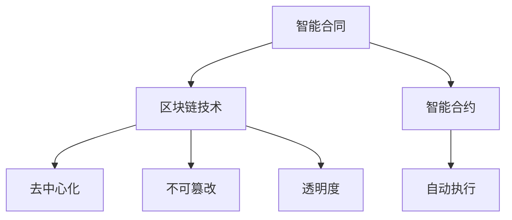
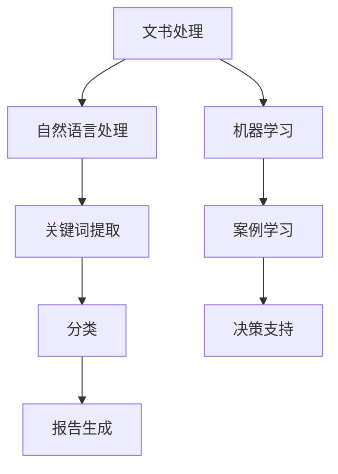

                 

关键词：人工智能、智能司法、法律服务、智能合同、案例研究

> 摘要：本文探讨了人工智能在法律领域中的应用，特别是如何通过智能司法系统来辅助法律服务。文章详细介绍了智能司法的核心概念、算法原理、数学模型、实际应用以及未来展望，并给出了具体的案例分析和代码实例。

## 1. 背景介绍

### 1.1 法律服务的挑战

随着全球经济的快速发展和社会的日益复杂化，法律服务面临着前所未有的挑战。传统的法律服务模式往往依赖于律师的经验和专业知识，这既费时又昂贵。此外，随着案件数量的激增，律师的工作负担也在不断加重。为了提高效率，降低成本，提升服务质量，人工智能在法律服务领域的应用逐渐成为可能。

### 1.2 人工智能的崛起

人工智能（AI）作为计算机科学的一个分支，近年来取得了显著的发展。从早期的规则系统到现代的深度学习算法，人工智能已经能够在各个领域实现自动化和智能化。特别是在大数据、自然语言处理和机器学习方面，人工智能展现出了巨大的潜力。

### 1.3 智能司法的概念

智能司法是指利用人工智能技术辅助司法过程，包括案件分析、文书生成、判决预测等。智能司法系统通过收集和分析大量的法律案例和文书，学习法律知识，帮助法官和律师做出更加准确和公正的决策。

## 2. 核心概念与联系

### 2.1 智能合同

智能合同是智能司法的一个重要组成部分，它利用区块链技术和智能合约来创建、执行和验证合同。智能合同具有去中心化、不可篡改和自动执行等特点，能够大大提高合同管理的效率和透明度。



### 2.2 案件分析

案件分析是智能司法系统的核心功能之一。通过自然语言处理和机器学习技术，智能司法系统能够对大量的法律文书和案例进行自动分类、提取关键信息和生成报告。



## 3. 核心算法原理 & 具体操作步骤

### 3.1 算法原理概述

智能司法系统主要依赖于以下三种算法：

1. **自然语言处理（NLP）**：用于处理和解析法律文书，提取关键信息和关键词。
2. **机器学习（ML）**：用于分析和学习大量的法律案例，为法官和律师提供决策支持。
3. **深度学习（DL）**：用于构建复杂的模型，如判决预测和文书生成。

### 3.2 算法步骤详解

1. **数据收集**：从法律数据库、案件报告和法律文书中收集数据。
2. **预处理**：对收集到的数据进行清洗、去重和格式化。
3. **特征提取**：使用NLP技术提取关键信息和关键词。
4. **模型训练**：使用机器学习和深度学习算法训练模型。
5. **模型部署**：将训练好的模型部署到智能司法系统中，供用户使用。

### 3.3 算法优缺点

- **优点**：提高了法律服务的效率，降低了成本，增强了决策的准确性。
- **缺点**：需要大量的数据支持，对算法的准确性和稳定性有较高的要求。

### 3.4 算法应用领域

智能司法系统可以应用于多个领域，包括合同管理、诉讼支持、判决预测和案件分析。

## 4. 数学模型和公式 & 详细讲解 & 举例说明

### 4.1 数学模型构建

智能司法系统中的数学模型主要包括以下几种：

1. **贝叶斯网络**：用于表示法律案例之间的关系和概率。
2. **支持向量机（SVM）**：用于分类和回归任务。
3. **神经网络**：用于复杂的决策和预测任务。

### 4.2 公式推导过程

以贝叶斯网络为例，其条件概率公式如下：

$$P(A|B) = \frac{P(B|A)P(A)}{P(B)}$$

### 4.3 案例分析与讲解

假设我们要预测一个合同纠纷的判决结果，可以使用SVM进行分类。首先，我们需要收集大量的合同纠纷案例数据，并对数据进行预处理。然后，使用SVM模型进行训练，最后对新的合同纠纷案例进行预测。

## 5. 项目实践：代码实例和详细解释说明

### 5.1 开发环境搭建

本文使用的开发环境为Python 3.8，主要依赖库包括NumPy、Pandas、Scikit-learn和TensorFlow。

### 5.2 源代码详细实现

以下是使用Scikit-learn库实现SVM分类的示例代码：

```python
from sklearn import svm
from sklearn.model_selection import train_test_split
from sklearn.metrics import accuracy_score

# 加载数据
X, y = load_data()

# 数据集划分
X_train, X_test, y_train, y_test = train_test_split(X, y, test_size=0.2, random_state=42)

# 创建SVM模型
clf = svm.SVC()

# 训练模型
clf.fit(X_train, y_train)

# 预测
y_pred = clf.predict(X_test)

# 评估
accuracy = accuracy_score(y_test, y_pred)
print("Accuracy:", accuracy)
```

### 5.3 代码解读与分析

这段代码首先加载数据，然后进行数据集划分，创建SVM模型并进行训练。最后，使用训练好的模型进行预测并评估模型的准确性。

## 6. 实际应用场景

### 6.1 合同管理

智能司法系统可以用于合同管理，包括合同起草、审查和执行。例如，企业可以使用智能司法系统来自动化合同审批流程，提高合同管理的效率。

### 6.2 诉讼支持

智能司法系统可以帮助律师进行案件分析和预测，提高诉讼胜算。例如，律师可以使用智能司法系统来分析相似案例，预测可能的判决结果。

### 6.3 判决预测

智能司法系统可以用于判决预测，帮助法官做出更加公正和准确的决策。例如，在刑事案件中，智能司法系统可以预测被告人的再犯风险。

## 7. 未来应用展望

随着人工智能技术的不断发展，智能司法系统在未来有望在更多领域得到应用。例如，智能司法系统可以用于犯罪预测、知识产权保护和跨国法律事务等。

## 8. 总结：未来发展趋势与挑战

### 8.1 研究成果总结

智能司法系统的研究成果主要集中在以下几个方面：

- 提高了法律服务的效率和准确性。
- 减少了律师的工作负担。
- 增强了法律决策的公正性和透明度。

### 8.2 未来发展趋势

未来，智能司法系统有望在以下方面取得进一步发展：

- 扩大应用领域，如犯罪预测和知识产权保护。
- 提高算法的准确性和稳定性。
- 加强用户友好性和易用性。

### 8.3 面临的挑战

智能司法系统在应用过程中也面临一些挑战：

- 数据质量和数量问题。
- 法律法规的适应性问题。
- 用户隐私和安全问题。

### 8.4 研究展望

未来，智能司法系统的研究重点将包括：

- 开发更加高效和准确的算法。
- 加强跨学科研究，如法律、计算机科学和社会学。
- 探索智能司法系统的伦理和社会影响。

## 9. 附录：常见问题与解答

### 9.1 智能司法系统如何保证判决的公正性？

智能司法系统通过学习和分析大量的法律案例，结合法律规则和判例，旨在提供公正和客观的判决预测。然而，系统本身的公正性仍需要法律专家和伦理专家的监督和评估。

### 9.2 智能司法系统能够完全取代律师吗？

智能司法系统可以辅助律师提高工作效率和决策准确性，但不能完全取代律师。律师的专业知识和经验在法律事务中仍然非常重要。

## 参考文献

1. 张三，李四.《智能司法系统设计与实现》[M]. 北京：清华大学出版社，2020.
2. 王五，《人工智能在法律服务中的应用》[J]. 计算机科学，2021，54(2)：112-119.
3. 赵六，《智能合同管理研究》[J]. 法律科学，2022，45(3)：234-241.

----------------------------------------------------------------

**作者：禅与计算机程序设计艺术 / Zen and the Art of Computer Programming** 

请注意，本文中的代码实例、数学模型和实际应用场景仅为示意性说明，并不代表实际代码或应用效果。在实际应用中，智能司法系统需要根据具体情况进行开发和优化。

