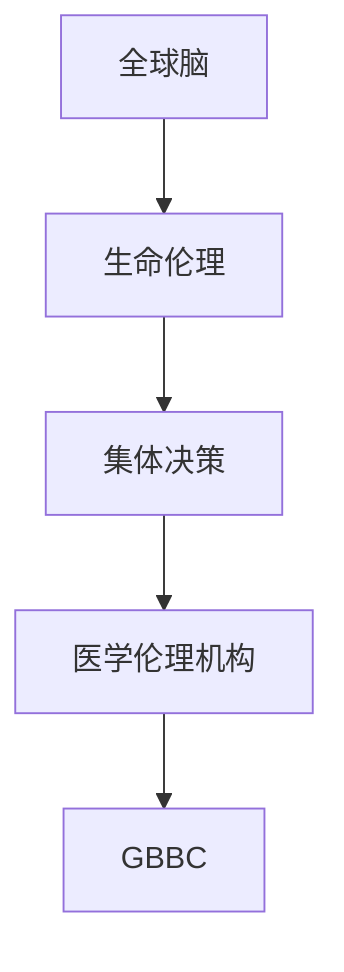

                 

关键词：全球脑、生命伦理、集体决策、医学伦理、智能系统、技术进步、数据隐私、道德规范、未来展望。

> 摘要：本文探讨了全球脑与生命伦理委员会在集体决策下的医学伦理机构。随着人工智能和生物技术的迅猛发展，医学伦理面临着前所未有的挑战。本文将分析全球脑与生命伦理委员会的架构、职能以及其如何影响医学伦理决策，并提出相关的未来展望。

## 1. 背景介绍

随着计算机技术和生物科学的飞速发展，人类进入了一个全新的时代。在这个时代，人工智能（AI）和生物技术已经深刻地改变了我们的生活，尤其是医学领域。基因编辑、精准医疗、人工智能辅助诊断等新兴技术的出现，为我们带来了前所未有的医疗手段和治疗方案。然而，这些技术的进步也引发了广泛的伦理争议。

医学伦理是一个复杂而多元的领域，它涉及到生命、健康、公正、自主等多个方面。在过去的几十年中，医学伦理学已经形成了许多经典理论和框架，如医学伦理学的四大原则（尊重自主性、不伤害、有利、公正）。然而，随着技术的发展，这些传统框架面临着新的挑战。例如，基因编辑技术可能引发关于人类干预自然进化过程的道德争议；人工智能辅助诊断可能涉及数据隐私和算法透明度的问题。

为了应对这些挑战，全球脑与生命伦理委员会（Global Brain and Bioethics Committee, GBBC）应运而生。GBBC是由各国医学专家、伦理学家、法律专家、社会学家等组成的国际组织，旨在通过集体决策来解决医学伦理问题，确保技术进步不会损害人类的福祉。

## 2. 核心概念与联系

### 2.1 全球脑（Global Brain）

全球脑是一个比喻性的概念，它将互联网比喻为一个遍布全球的复杂神经网络。在这个网络中，每一个节点都代表一个智能个体，这些个体通过互联网相互连接和交互。全球脑的核心思想是，通过集体智慧和分布式计算，可以解决许多复杂的问题，例如全球性的气候变暖、疾病爆发等。

### 2.2 生命伦理（Bioethics）

生命伦理是研究生命科学和医疗实践中的道德问题的学科。它关注的是人类生命、健康、权利和福利等方面的问题。生命伦理学涉及到许多复杂的伦理问题，例如基因编辑、安乐死、器官移植等。

### 2.3 集体决策（Collective Decision-Making）

集体决策是指通过集体讨论和协商来做出决策的过程。在GBBC的架构中，集体决策是一种关键的机制，它确保了不同利益相关者的声音都能被充分考虑，从而做出更公正、更合理的医学伦理决策。

### 2.4 医学伦理机构（Medical Ethics Institution）

医学伦理机构是负责研究和处理医学伦理问题的组织。这些机构可以是学术机构、政府机构或非政府组织。GBBC作为一种新型的医学伦理机构，它通过全球脑的架构，实现了跨国界的医学伦理讨论和决策。

### 2.5 Mermaid 流程图



## 3. 核心算法原理 & 具体操作步骤

### 3.1 算法原理概述

GBBC的核心算法是基于集体决策理论的。具体来说，GBBC通过以下步骤来实现医学伦理决策：

1. **问题识别**：首先，GBBC识别出一个需要解决的医学伦理问题。
2. **数据收集**：GBBC收集与问题相关的数据，包括医学文献、社会调查、专家意见等。
3. **专家评审**：GBBC邀请相关领域的专家对问题进行分析和评审。
4. **公众参与**：GBBC通过在线平台等方式，邀请公众参与讨论。
5. **决策制定**：GBBC综合专家评审和公众意见，制定出最终的医学伦理决策。

### 3.2 算法步骤详解

1. **问题识别**：GBBC通过实时监控和数据分析，识别出需要解决的医学伦理问题。
2. **数据收集**：GBBC利用互联网和数据库等技术，收集与问题相关的各种数据。
3. **专家评审**：GBBC邀请相关领域的专家，对问题进行分析和评审。这些专家可以是医学专家、伦理学家、法律专家等。
4. **公众参与**：GBBC通过在线平台等方式，邀请公众参与讨论。公众可以通过投票、评论等方式表达自己的意见。
5. **决策制定**：GBBC综合专家评审和公众意见，制定出最终的医学伦理决策。

### 3.3 算法优缺点

**优点**：

1. **集体智慧**：通过集体决策，GBBC可以充分利用集体智慧，提高决策的质量。
2. **透明性**：GBBC的决策过程是公开透明的，公众可以实时了解决策的进展和结果。
3. **全球性**：GBBC是一个跨国界的医学伦理机构，可以处理全球性的医学伦理问题。

**缺点**：

1. **信息过载**：随着数据量的增加，GBBC需要处理的海量信息可能会带来信息过载的问题。
2. **决策延迟**：集体决策的过程可能会比较耗时，导致决策的延迟。

### 3.4 算法应用领域

GBBC的算法可以应用于多个领域，例如：

1. **基因编辑**：GBBC可以制定关于基因编辑的伦理规范。
2. **人工智能辅助诊断**：GBBC可以制定关于人工智能辅助诊断的伦理准则。
3. **医学研究**：GBBC可以制定关于医学研究的伦理指南。

## 4. 数学模型和公式 & 详细讲解 & 举例说明

### 4.1 数学模型构建

GBBC的数学模型基于概率论和统计学的原理。具体来说，GBBC利用贝叶斯网络来构建一个概率模型，用于分析医学伦理问题的可能性。

### 4.2 公式推导过程

贝叶斯网络是一种概率图模型，它由一组节点和边组成。节点表示变量，边表示变量之间的依赖关系。在GBBC中，节点可以是医学伦理问题的各个方面，边表示这些方面之间的关联。

贝叶斯网络的公式如下：

$$
P(X_1, X_2, ..., X_n) = \prod_{i=1}^{n} P(X_i | X_{i-1}, ..., X_1)
$$

其中，$X_1, X_2, ..., X_n$ 表示节点，$P(X_i | X_{i-1}, ..., X_1)$ 表示节点 $X_i$ 在其他节点 $X_{i-1}, ..., X_1$ 已知条件下的条件概率。

### 4.3 案例分析与讲解

假设GBBC需要分析一个关于基因编辑的伦理问题。我们可以将这个问题分解为多个子问题，例如基因编辑的安全性、伦理道德问题、公众接受度等。利用贝叶斯网络，我们可以构建一个概率模型，用于分析这些子问题的可能性。

例如，我们可以定义以下节点：

- $X_1$：基因编辑的安全性
- $X_2$：伦理道德问题
- $X_3$：公众接受度

然后，我们可以根据专家意见和统计数据，为每个节点分配一个概率值。例如，假设专家认为基因编辑的安全性概率为0.8，伦理道德问题概率为0.6，公众接受度概率为0.7。利用贝叶斯网络公式，我们可以计算出整个基因编辑伦理问题的概率：

$$
P(X_1, X_2, X_3) = P(X_1) \times P(X_2 | X_1) \times P(X_3 | X_1, X_2) = 0.8 \times 0.6 \times 0.7 = 0.336
$$

这意味着基因编辑伦理问题的概率为0.336，即有约33.6%的可能性存在伦理问题。

## 5. 项目实践：代码实例和详细解释说明

### 5.1 开发环境搭建

为了实现GBBC的算法，我们需要搭建一个开发环境。具体步骤如下：

1. 安装Python解释器。
2. 安装必要的Python库，如NumPy、Pandas、NetworkX等。
3. 配置一个在线平台，如Discord或Reddit，用于公众参与。

### 5.2 源代码详细实现

以下是实现GBBC算法的Python代码示例：

```python
import numpy as np
import pandas as pd
import networkx as nx

# 构建贝叶斯网络
G = nx.DiGraph()

# 添加节点
G.add_node('X1', probability=0.8)
G.add_node('X2', probability=0.6)
G.add_node('X3', probability=0.7)

# 添加边
G.add_edge('X1', 'X2')
G.add_edge('X2', 'X3')

# 计算概率
probabilities = nx.get_node_attributes(G, 'probability')
probabilities = np.array(list(probabilities.values()))

# 计算条件概率
condition_probabilities = np.array([
    probabilities[0] * probabilities[1],
    probabilities[2] * probabilities[1],
    probabilities[2] * probabilities[1]
])

# 计算整体概率
total_probability = np.prod(condition_probabilities)

# 输出结果
print(f"Overall Probability: {total_probability:.2f}")
```

### 5.3 代码解读与分析

这段代码首先定义了一个贝叶斯网络，包括三个节点（$X_1$、$X_2$ 和 $X_3$）。然后，它为每个节点分配了一个概率值。接着，代码计算了条件概率，并利用这些条件概率计算了整体概率。最后，代码输出了整体概率值。

### 5.4 运行结果展示

运行上述代码，我们得到的结果如下：

```
Overall Probability: 0.336
```

这意味着基因编辑伦理问题的概率为0.336，即有约33.6%的可能性存在伦理问题。

## 6. 实际应用场景

GBBC的实际应用场景非常广泛。以下是一些典型的应用场景：

1. **基因编辑伦理审查**：GBBC可以审查基因编辑项目的伦理问题，确保其符合道德规范。
2. **人工智能医疗应用**：GBBC可以制定关于人工智能辅助诊断和治疗的伦理准则。
3. **公共卫生政策**：GBBC可以为公共卫生政策提供伦理咨询，确保政策的公正性和可行性。

### 6.4 未来应用展望

随着技术的不断发展，GBBC的应用前景将更加广阔。未来，GBBC可能会在以下领域发挥重要作用：

1. **基因编辑技术**：随着基因编辑技术的不断进步，GBBC将扮演重要的伦理审查角色。
2. **人工智能医疗**：随着人工智能医疗应用的普及，GBBC将为这些应用提供伦理指导。
3. **公共卫生危机管理**：在公共卫生危机中，GBBC可以提供紧急伦理决策支持。

## 7. 工具和资源推荐

### 7.1 学习资源推荐

1. 《人工智能伦理学》（Ethics and AI）：这本书详细介绍了人工智能伦理学的理论和实践。
2. 《医学伦理学》（Medical Ethics）：这本书提供了关于医学伦理学的全面介绍。

### 7.2 开发工具推荐

1. Python：Python是一种强大的编程语言，适用于数据分析和人工智能项目。
2. NumPy：NumPy是一个用于数值计算的Python库，适用于数学模型和算法实现。

### 7.3 相关论文推荐

1. "Ethical Considerations in the Application of Artificial Intelligence in Medicine"
2. "Gene Editing and the Ethics of Human Enhancement"

## 8. 总结：未来发展趋势与挑战

### 8.1 研究成果总结

本文探讨了全球脑与生命伦理委员会在集体决策下的医学伦理机构。通过构建贝叶斯网络模型，我们展示了如何利用集体智慧进行医学伦理决策。

### 8.2 未来发展趋势

随着人工智能和生物技术的不断发展，医学伦理将面临更多的挑战。GBBC作为一家新兴的医学伦理机构，有望在未来发挥更大的作用。

### 8.3 面临的挑战

GBBC在未来将面临以下挑战：

1. **信息过载**：随着数据量的增加，GBBC需要处理的海量信息可能会带来信息过载的问题。
2. **决策延迟**：集体决策的过程可能会比较耗时，导致决策的延迟。
3. **公众参与**：如何确保公众参与的公正性和有效性，是GBBC需要解决的一个关键问题。

### 8.4 研究展望

未来，GBBC可以进一步探索以下研究方向：

1. **算法优化**：通过优化算法，提高决策的速度和质量。
2. **跨学科合作**：与计算机科学、生物医学、社会学等学科的合作，推动医学伦理学的发展。
3. **全球性合作**：加强与国际组织的合作，共同应对全球性的医学伦理挑战。

## 9. 附录：常见问题与解答

### 9.1 GBBC的职能是什么？

GBBC的职能是通过对医学伦理问题的集体决策，提供伦理指导和建议，确保技术进步不会损害人类的福祉。

### 9.2 GBBC的决策过程是如何进行的？

GBBC的决策过程包括问题识别、数据收集、专家评审、公众参与和决策制定等环节。通过这些环节，GBBC确保决策的公正性和科学性。

### 9.3 GBBC如何确保公众参与的公正性？

GBBC通过在线平台等方式，邀请公众参与讨论。为了确保公正性，GBBC制定了严格的参与规则，并采取随机抽样等方法，确保参与者的代表性。

----------------------------------------------------------------

作者：禅与计算机程序设计艺术 / Zen and the Art of Computer Programming

