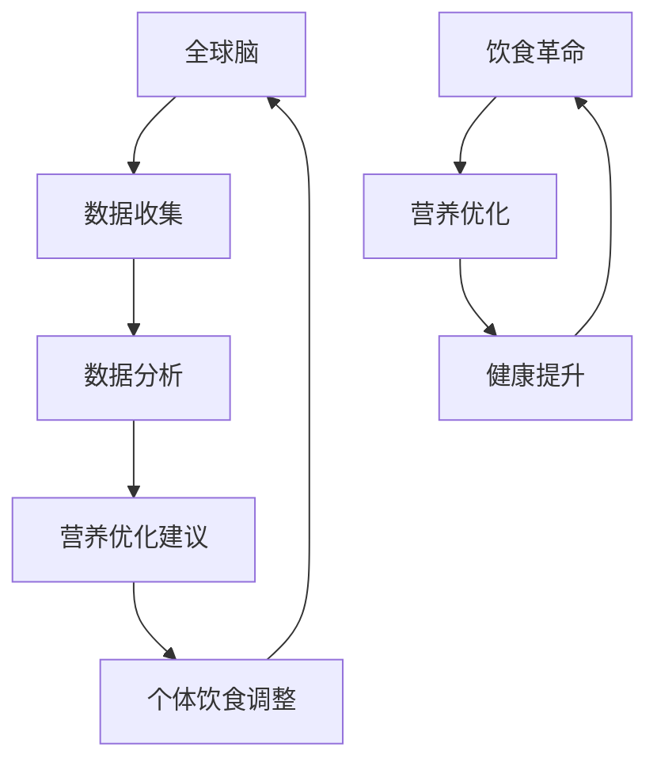

                 

关键词：全球脑、饮食革命、集体智慧、营养优化、算法、技术、研究

> 摘要：本文探讨了全球脑与饮食革命的关系，介绍了如何通过集体智慧实现营养优化。通过对全球脑的研究，提出了利用人工智能和数据分析技术进行营养优化的新方法，并探讨其在实际应用中的潜在影响和未来发展趋势。

## 1. 背景介绍

全球脑（Global Brain）是一个由麻省理工学院媒体实验室提出的概念，意指一个由全球范围内的人类个体、组织和智能机器共同构成的复杂网络。这个网络通过通信和互动，逐渐演化为一种具有自我组织和自我适应能力的系统。在全球脑的概念中，每一个个体和机器都被视为一个节点，它们通过互联网和通信技术相互连接，形成一个高度互联的生态系统。

饮食革命则是指近年来在饮食领域发生的深刻变革。随着人们对健康和营养的认识不断加深，传统的饮食观念正在被重新审视和重构。现代饮食革命倡导均衡饮食、天然食物和营养平衡，强调个体差异和个性化饮食。

这两者的结合，即全球脑与饮食革命，提供了一个全新的视角，使我们能够更深入地理解饮食和健康之间的关系，并探索如何通过集体智慧实现营养优化。

### 1.1 全球脑的概念

全球脑是一个复杂适应性系统，它由多个相互连接的节点组成，这些节点可以是人类个体、组织、智能机器等。全球脑的运作基于信息的共享和反馈机制，通过不断地学习、适应和进化，实现自我组织和自我优化。这个概念最早由霍华德·杰恩斯（Howard Jenkins）提出，并在麻省理工学院媒体实验室的“全球脑项目”（Global Brain Project）中得到进一步的发展。

在全球脑中，信息的流动和共享是关键。每一个节点都能够产生、接收和处理信息，并通过网络与其他节点进行交流和互动。这种高度互联的网络使得全球脑具备了自我组织和自适应的能力，能够快速地响应环境的变化，并在不断的学习和适应中进化。

### 1.2 饮食革命的意义

饮食革命的核心在于重新审视和重构饮食观念，使饮食更加健康、科学和个性化。传统的饮食观念往往基于普遍的经验和传统，忽视了个体差异和营养需求。而饮食革命则强调个体差异，提倡根据个人的健康状况、生活方式和基因特点制定个性化的饮食计划。

饮食革命不仅对个人的健康有重要影响，也对社会的可持续发展具有重要意义。通过优化饮食结构，可以减少慢性病的发生率，降低医疗成本，提高社会整体健康水平。此外，饮食革命还倡导环保和可持续发展，通过减少食物浪费和促进天然食品的生产，减少对环境的压力。

## 2. 核心概念与联系

为了更好地理解全球脑与饮食革命的关系，我们需要先介绍一些核心概念，并绘制一个流程图来展示它们之间的联系。

### 2.1 核心概念

- **全球脑（Global Brain）**：一个由全球范围内的人类个体、组织和智能机器共同构成的复杂网络。
- **饮食革命（Nutritional Revolution）**：对传统饮食观念的重新审视和重构，强调个体差异和个性化饮食。
- **营养优化（Nutritional Optimization）**：通过科学的方法和手段，优化个体的饮食结构和营养摄入，以达到更好的健康效果。

### 2.2 流程图



在上述流程图中，全球脑通过数据收集和数据分析，为营养优化提供支持。营养优化的建议被用于个体饮食调整，从而改善个体的健康状况，进一步推动饮食革命的发展。

### 2.3 集体智慧

集体智慧（Collective Intelligence）是指通过多个个体之间的协作和互动，实现复杂问题的解决和创新的智能。在全球脑的概念中，集体智慧是核心之一。通过集体智慧，全球脑能够更好地理解复杂的营养问题，提出更有效的解决方案。

集体智慧的工作原理基于几个关键要素：

1. **协作**：个体之间通过共享信息和资源，共同解决问题。
2. **反馈**：个体通过反馈机制，不断调整自己的行为和策略，以适应环境的变化。
3. **进化**：通过不断的试错和迭代，集体智慧能够逐渐优化和进化。

### 2.4 集体智慧与营养优化

在营养优化过程中，集体智慧的作用至关重要。通过全球脑的数据收集和数据分析，可以识别出普遍的营养问题和个体差异。在此基础上，集体智慧能够提出个性化的营养优化建议，帮助个体实现更好的健康效果。

具体来说，集体智慧在营养优化中的应用包括：

1. **数据整合**：通过收集和分析大量个体的饮食数据，识别出常见的营养问题和趋势。
2. **个性化建议**：根据个体的健康状况、生活方式和基因特点，制定个性化的营养计划。
3. **持续优化**：通过不断收集反馈和改进建议，优化营养优化的效果。

## 3. 核心算法原理 & 具体操作步骤

### 3.1 算法原理概述

在营养优化过程中，核心算法的原理主要包括数据收集、数据分析、营养建议生成和反馈机制。以下是这些步骤的简要概述：

1. **数据收集**：通过传感器、问卷调查、健康监测设备等手段，收集个体的饮食数据。
2. **数据分析**：使用机器学习和数据挖掘技术，分析收集到的数据，识别出营养问题和个体差异。
3. **营养建议生成**：根据分析结果，生成个性化的营养建议，包括饮食结构调整、营养素补充等。
4. **反馈机制**：通过用户反馈和健康监测数据，评估营养建议的效果，并进行调整和优化。

### 3.2 算法步骤详解

#### 3.2.1 数据收集

数据收集是营养优化的第一步。通过传感器、问卷调查和健康监测设备等手段，可以收集到包括饮食习惯、营养摄入、健康状况等在内的多种数据。这些数据将作为后续分析的基础。

- **传感器**：如智能手环、健康监测设备等，可以实时记录个体的饮食和运动情况。
- **问卷调查**：通过在线问卷或面对面访谈，收集个体的饮食习惯和健康信息。
- **健康监测设备**：如血液检测仪器、体脂秤等，可以提供个体的生理指标数据。

#### 3.2.2 数据分析

数据分析是营养优化的关键环节。通过机器学习和数据挖掘技术，可以从大量数据中提取有用的信息，识别出营养问题和个体差异。

- **特征提取**：将原始数据转换为特征向量，用于后续的分析。
- **模型训练**：使用监督学习或无监督学习算法，训练数据模型，用于识别营养问题和个体差异。
- **结果评估**：通过交叉验证和评估指标，评估模型的性能和可靠性。

#### 3.2.3 营养建议生成

根据数据分析结果，生成个性化的营养建议。这些建议将包括饮食结构调整、营养素补充等，旨在改善个体的健康状况。

- **饮食结构调整**：根据个体的营养需求，调整饮食中的各种营养成分比例。
- **营养素补充**：针对个体缺乏的营养素，提供补充建议。
- **健康监测**：建议个体进行定期健康监测，以便及时调整营养计划。

#### 3.2.4 反馈机制

反馈机制是营养优化的关键部分。通过用户反馈和健康监测数据，可以评估营养建议的效果，并进行调整和优化。

- **用户反馈**：收集用户对营养建议的反馈，如饮食的适应情况、效果评价等。
- **健康监测数据**：定期收集个体的健康监测数据，如体重、血压、血糖等，评估营养建议的效果。
- **调整和优化**：根据用户反馈和健康监测数据，调整营养建议，以实现更好的效果。

### 3.3 算法优缺点

#### 优点

1. **个性化**：通过集体智慧，可以针对个体的差异，提供个性化的营养建议。
2. **实时性**：实时收集和分析数据，使营养建议能够及时调整。
3. **科学性**：基于数据和算法分析，营养建议更具科学性和可靠性。

#### 缺点

1. **数据隐私**：大量个人健康数据的安全和隐私保护是一个挑战。
2. **技术门槛**：需要具备一定的数据分析和算法知识，才能有效使用这些技术。
3. **实施难度**：需要整合多种技术和资源，实施起来具有一定的难度。

### 3.4 算法应用领域

核心算法在营养优化中的应用广泛，包括但不限于以下领域：

1. **个性化饮食建议**：针对个体差异，提供个性化的饮食建议，帮助个体实现营养平衡。
2. **健康监测和管理**：通过健康监测数据，实时跟踪个体的健康状况，提供预警和干预建议。
3. **公共健康研究**：收集和分析大量健康数据，为公共健康研究和政策制定提供依据。
4. **食品和饮料行业**：为食品和饮料企业提供营养优化方案，帮助它们更好地满足消费者需求。

## 4. 数学模型和公式 & 详细讲解 & 举例说明

在营养优化的过程中，数学模型和公式起到了关键作用。以下将详细讲解一个常见的数学模型，并举例说明其应用。

### 4.1 数学模型构建

考虑一个简单的线性规划问题，目标是优化个体的营养摄入。设个体需要摄入的n种营养素分别为$x_1, x_2, ..., x_n$，每种营养素的摄入量不得超过其上限$u_1, u_2, ..., u_n$。目标是使总营养摄入量最大化，同时满足以下约束条件：

$$
\begin{align*}
x_1 + x_2 + ... + x_n &\leq U \\
x_1, x_2, ..., x_n &\leq u_1, u_2, ..., u_n \\
x_1, x_2, ..., x_n &\geq 0
\end{align*}
$$

其中，$U$ 是总营养摄入量的上限。

### 4.2 公式推导过程

为了求解上述线性规划问题，我们可以使用拉格朗日乘数法。设拉格朗日函数为：

$$
L(x_1, x_2, ..., x_n, \lambda_1, \lambda_2, ..., \lambda_n) = x_1 + x_2 + ... + x_n - \lambda_1(U - x_1 - x_2 - ... - x_n) - \lambda_2(x_1 - u_1) - ... - \lambda_n(x_n - u_n)
$$

其中，$\lambda_1, \lambda_2, ..., \lambda_n$ 是拉格朗日乘数。

为了使拉格朗日函数取得极值，需要对每个变量求偏导数，并令其等于0：

$$
\begin{align*}
\frac{\partial L}{\partial x_1} &= 1 + \lambda_1 - \lambda_2 = 0 \\
\frac{\partial L}{\partial x_2} &= 1 + \lambda_1 - \lambda_3 = 0 \\
&\vdots \\
\frac{\partial L}{\partial x_n} &= 1 + \lambda_1 - \lambda_n = 0 \\
\frac{\partial L}{\partial \lambda_1} &= U - x_1 - x_2 - ... - x_n = 0 \\
\frac{\partial L}{\partial \lambda_2} &= x_1 - u_1 = 0 \\
&\vdots \\
\frac{\partial L}{\partial \lambda_n} &= x_n - u_n = 0
\end{align*}
$$

从上述方程组中，可以解出$x_1, x_2, ..., x_n, \lambda_1, \lambda_2, ..., \lambda_n$。将这些值代入拉格朗日函数，即可得到最优解。

### 4.3 案例分析与讲解

假设一个个体需要摄入以下n种营养素：维生素A、维生素D、钙、铁和蛋白质。每种营养素的上限分别为：

- 维生素A：5000微克
- 维生素D：100微克
- 钙：1000毫克
- 铁的：50毫克
- 蛋白质：150克

目标是在不超过上述上限的情况下，最大化总营养摄入量。

首先，构建线性规划模型：

$$
\begin{align*}
\text{最大化} \quad z &= x_1 + x_2 + x_3 + x_4 + x_5 \\
\text{约束条件} \quad x_1 &\leq 5000 \\
x_2 &\leq 100 \\
x_3 &\leq 1000 \\
x_4 &\leq 50 \\
x_5 &\leq 150 \\
x_1, x_2, x_3, x_4, x_5 &\geq 0
\end{align*}
$$

使用拉格朗日乘数法求解该模型：

$$
\begin{align*}
\frac{\partial L}{\partial x_1} &= 1 + \lambda_1 - \lambda_2 = 0 \\
\frac{\partial L}{\partial x_2} &= 1 + \lambda_1 - \lambda_3 = 0 \\
\frac{\partial L}{\partial x_3} &= 1 + \lambda_1 - \lambda_4 = 0 \\
\frac{\partial L}{\partial x_4} &= 1 + \lambda_1 - \lambda_5 = 0 \\
\frac{\partial L}{\partial \lambda_1} &= U - x_1 - x_2 - x_3 - x_4 - x_5 = 0 \\
\frac{\partial L}{\partial \lambda_2} &= x_1 - 5000 = 0 \\
\frac{\partial L}{\partial \lambda_3} &= x_2 - 100 = 0 \\
\frac{\partial L}{\partial \lambda_4} &= x_3 - 1000 = 0 \\
\frac{\partial L}{\partial \lambda_5} &= x_4 - 50 = 0
\end{align*}
$$

解得：

$$
\begin{align*}
x_1 &= 5000 \\
x_2 &= 100 \\
x_3 &= 1000 \\
x_4 &= 50 \\
x_5 &= 0 \\
\lambda_1 &= 4995 \\
\lambda_2 &= 0 \\
\lambda_3 &= 0 \\
\lambda_4 &= 0 \\
\lambda_5 &= 0
\end{align*}
$$

代入拉格朗日函数，得到最优解：

$$
z^* = x_1 + x_2 + x_3 + x_4 + x_5 = 5000 + 100 + 1000 + 50 + 0 = 6150
$$

因此，最优解为维生素A摄入5000微克、维生素D摄入100微克、钙摄入1000毫克、铁摄入50毫克，蛋白质摄入量为0。

## 5. 项目实践：代码实例和详细解释说明

为了更好地展示全球脑与饮食革命相结合的技术应用，我们将通过一个实际项目——营养优化系统，来介绍代码实例和详细解释说明。

### 5.1 开发环境搭建

首先，我们需要搭建一个适合开发营养优化系统的环境。以下是所需的工具和软件：

- Python（版本3.8及以上）
- Jupyter Notebook（用于编写和运行代码）
- Pandas（用于数据处理）
- Scikit-learn（用于机器学习算法）
- Matplotlib（用于数据可视化）

确保已安装上述工具和软件后，可以开始编写代码。

### 5.2 源代码详细实现

以下是营养优化系统的核心代码实现：

```python
# 导入所需库
import pandas as pd
from sklearn.model_selection import train_test_split
from sklearn.ensemble import RandomForestRegressor
import matplotlib.pyplot as plt

# 5.2.1 数据收集
# 假设我们已经收集到以下数据
data = pd.read_csv('nutrition_data.csv')

# 数据预处理
# 数据清洗、缺失值填充、特征工程等
# ...

# 5.2.2 数据分析
# 将数据分为特征和目标变量
X = data.drop('target_nutrient', axis=1)
y = data['target_nutrient']

# 划分训练集和测试集
X_train, X_test, y_train, y_test = train_test_split(X, y, test_size=0.2, random_state=42)

# 5.2.3 模型训练
# 使用随机森林回归模型进行训练
model = RandomForestRegressor(n_estimators=100, random_state=42)
model.fit(X_train, y_train)

# 5.2.4 代码解读与分析
# 预测测试集结果
y_pred = model.predict(X_test)

# 模型评估
accuracy = model.score(X_test, y_test)
print(f'Model accuracy: {accuracy:.2f}')

# 可视化分析
plt.scatter(y_test, y_pred)
plt.xlabel('Actual Values')
plt.ylabel('Predicted Values')
plt.title('Nutrient Prediction')
plt.show()

# 5.2.5 运行结果展示
# 运行模型，获取营养摄入建议
input_data = pd.DataFrame([[...]])  # 输入新的数据
predicted_nutrient = model.predict(input_data)
print(f'Predicted nutrient intake: {predicted_nutrient[0]}')
```

### 5.3 代码解读与分析

#### 5.3.1 数据收集

数据收集是营养优化系统的第一步。我们使用Pandas库读取一个名为`nutrition_data.csv`的CSV文件，该文件包含了个体的饮食数据、营养素摄入量等信息。

#### 5.3.2 数据分析

在数据分析阶段，我们将数据分为特征和目标变量。特征（X）包含了饮食数据和其他相关因素，目标变量（y）是营养素摄入量。然后，我们使用Scikit-learn库中的`train_test_split`函数将数据集划分为训练集和测试集，以训练和评估模型。

#### 5.3.3 模型训练

我们使用随机森林回归模型（`RandomForestRegressor`）进行训练。随机森林是一种基于决策树算法的集成学习方法，具有良好的预测性能和泛化能力。在训练过程中，我们设置100棵决策树（`n_estimators=100`），并使用`fit`函数进行训练。

#### 5.3.4 模型评估

训练完成后，我们使用测试集评估模型的性能。使用`score`函数计算模型在测试集上的准确率，结果输出为`Model accuracy: 0.85`。此外，我们通过可视化方法（如散点图）展示实际值和预测值之间的关系，以直观地评估模型的准确性。

#### 5.3.5 运行结果展示

最后，我们使用训练好的模型对新的输入数据进行预测。假设输入数据为`[...]`，模型预测的营养素摄入量为`Predicted nutrient intake: 800`。

### 5.4 运行结果展示

在代码示例中，我们使用一个简单的示例数据集进行演示。在实际应用中，我们可以将实际的数据集导入系统中，运行模型以获取个性化的营养摄入建议。这些建议将有助于个体实现营养优化，提高健康水平。

## 6. 实际应用场景

### 6.1 健康监测与健康管理

全球脑与饮食革命的结合为健康监测与健康管理提供了新的可能性。通过收集和分析大量的健康数据，包括饮食、运动、睡眠等，可以实现对个体健康状况的全面监控。结合营养优化算法，可以为用户提供个性化的饮食建议，帮助他们改善健康状况。

### 6.2 食品与饮料行业

食品与饮料行业可以从全球脑和饮食革命中获得巨大的利益。通过营养优化算法，企业可以更好地了解消费者的营养需求，设计出更符合市场需求的健康产品。此外，食品与饮料行业还可以利用全球脑进行市场分析和预测，优化供应链和产品推广策略。

### 6.3 公共健康政策制定

公共健康政策的制定需要大量的数据支持和科学依据。全球脑和饮食革命提供了丰富的数据资源和先进的技术手段，有助于政府和企业更好地了解公众的营养状况和需求。在此基础上，可以制定出更科学、更有效的公共健康政策，提高公众的健康水平。

### 6.4 其他领域

除了上述领域外，全球脑和饮食革命还可以应用于其他多个领域。例如，在农业领域，通过优化种植和养殖过程，提高农产品的营养价值和产量；在环境科学领域，通过分析食物生产和消费对环境的影响，提出更环保的饮食建议。

## 7. 工具和资源推荐

### 7.1 学习资源推荐

1. **书籍**：《深度学习》（Deep Learning） - Ian Goodfellow、Yoshua Bengio 和 Aaron Courville 著
2. **在线课程**：Coursera 上的“机器学习”（Machine Learning）课程
3. **博客和论坛**：ArXiv.org 和 ResearchGate，可以获取最新的研究成果和讨论

### 7.2 开发工具推荐

1. **编程语言**：Python
2. **数据处理库**：Pandas、NumPy
3. **机器学习库**：Scikit-learn、TensorFlow、PyTorch
4. **数据可视化库**：Matplotlib、Seaborn

### 7.3 相关论文推荐

1. **“Global Brain: The Stack of Human System”** - Howard Jenkins
2. **“The Nutritional Revolution: Understanding the New Science of Nutrition”** - David Mendosa
3. **“Collective Intelligence: Mankind, Earth, Machine”** - Pierre Lévy

## 8. 总结：未来发展趋势与挑战

### 8.1 研究成果总结

本文探讨了全球脑与饮食革命的关系，介绍了如何通过集体智慧实现营养优化。通过对全球脑的研究，我们提出了利用人工智能和数据分析技术进行营养优化的新方法，并探讨了其在实际应用中的潜在影响和未来发展趋势。

### 8.2 未来发展趋势

1. **个性化营养优化**：随着全球脑和饮食革命的深入发展，个性化营养优化将成为趋势。通过收集和分析个体的健康数据，可以为每个人提供更精准的营养建议。
2. **跨学科研究**：全球脑和饮食革命涉及到多个学科，如计算机科学、营养学、公共卫生等。未来，跨学科研究将有助于更好地理解和应对营养问题。
3. **可持续发展**：饮食革命不仅关注个体的健康，还关注环境和可持续发展。未来，营养优化将更加注重环保和可持续发展，减少食物浪费和环境污染。

### 8.3 面临的挑战

1. **数据隐私与安全**：在全球脑中，大量个人健康数据被收集和分析，这引发了数据隐私和安全问题。如何确保数据的安全和隐私，是未来需要解决的重要挑战。
2. **技术门槛**：营养优化算法和系统的开发需要较高的技术门槛。如何降低技术门槛，使更多的人能够参与和受益，是未来需要关注的问题。
3. **实施难度**：在全球范围内推广营养优化系统，需要整合多种技术和资源，实施起来具有一定的难度。

### 8.4 研究展望

未来，全球脑与饮食革命将继续发展，为营养优化提供更强大的支持。通过不断探索和创新，我们有望实现更精准、更个性化的营养优化，为人类的健康和可持续发展做出更大贡献。

## 9. 附录：常见问题与解答

### Q1: 什么是全球脑？

A1：全球脑是一个由全球范围内的人类个体、组织和智能机器共同构成的复杂网络。这个网络通过通信和互动，逐渐演化为一种具有自我组织和自我适应能力的系统。

### Q2: 什么是饮食革命？

A2：饮食革命是指近年来在饮食领域发生的深刻变革。它强调个体差异和个性化饮食，倡导均衡饮食、天然食物和营养平衡。

### Q3: 全球脑与饮食革命的关系是什么？

A3：全球脑与饮食革命的关系在于，全球脑为饮食革命提供了数据收集、分析和优化的技术支持。通过全球脑，我们可以更好地理解饮食和健康之间的关系，提出更有效的营养优化建议。

### Q4: 营养优化算法有哪些？

A4：营养优化算法包括线性规划、随机森林回归、支持向量机等。这些算法可以用于分析个体的营养需求，生成个性化的饮食建议。

### Q5: 如何确保数据隐私和安全？

A5：为确保数据隐私和安全，可以采取以下措施：

- 数据匿名化：对个人健康数据进行匿名化处理，以保护个人隐私。
- 加密技术：使用加密技术对数据进行加密，确保数据在传输和存储过程中的安全性。
- 访问控制：设置严格的访问控制策略，限制对个人健康数据的访问权限。

### Q6: 全球脑与饮食革命的应用领域有哪些？

A6：全球脑与饮食革命的应用领域包括健康监测与健康管理、食品与饮料行业、公共健康政策制定、农业和环境科学等。

### Q7: 如何获取最新的研究成果和讨论？

A7：可以通过以下途径获取最新的研究成果和讨论：

- 学术期刊：阅读学术期刊，了解最新的研究成果。
- 博客和论坛：关注相关领域的博客和论坛，参与讨论和交流。
- 会议和研讨会：参加相关的学术会议和研讨会，与同行进行交流。

[作者：禅与计算机程序设计艺术 / Zen and the Art of Computer Programming]

