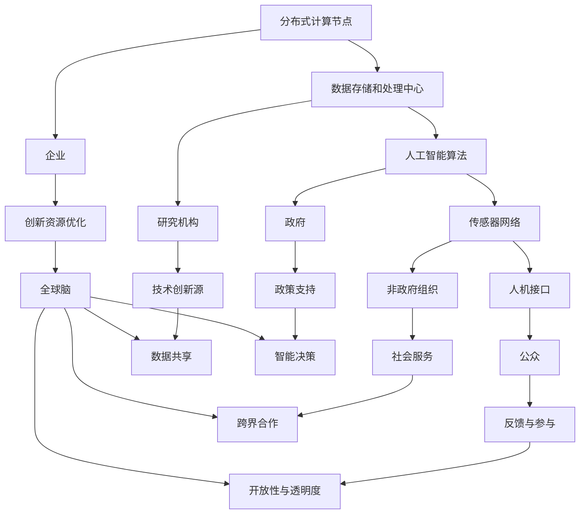

                 

关键词：全球脑，创新生态系统，人类进步，技术发展，人工智能，神经网络，协同合作，数据分析，可持续发展。

> 摘要：本文探讨了全球脑驱动的创新生态系统如何通过人工智能技术加速人类进步。文章首先介绍了全球脑的概念和重要性，然后分析了创新生态系统的核心要素及其相互作用。接着，文章深入探讨了人工智能在创新生态系统中的作用，包括神经网络和协同合作技术的应用。最后，文章提出了全球脑驱动的创新生态系统在可持续发展中的应用，并展望了其未来发展趋势与挑战。

## 1. 背景介绍

在现代社会，科技创新已成为推动经济增长和社会进步的关键动力。然而，传统的科技创新模式往往依赖于有限的资源和孤立的研究团队，导致创新效率低下。为了应对这一挑战，全球脑驱动的创新生态系统应运而生。全球脑是指由全球范围内的计算机、传感器、网络和人类智慧共同构成的智能系统，它通过高效的数据交换和协同工作，实现资源的最大化利用和创新的快速推进。

创新生态系统是一个复杂的网络系统，由多个相互关联的组成部分构成。这些组成部分包括企业、研究机构、政府、非政府组织和公众等。创新生态系统的核心目标是通过协同合作，实现创新资源的优化配置和创新的快速迭代。

### 全球脑的概念与重要性

全球脑（Global Brain）是模拟人类大脑功能的计算机系统，它通过互联网连接，将全球的计算机、传感器、网络和人类智慧整合在一起。全球脑的核心思想是利用集体智慧，实现知识的共享和创新的快速推进。全球脑的特点包括：

1. **分布式计算**：全球脑利用分布式计算技术，将计算任务分散到全球范围内的计算机上，实现高效的处理能力。
2. **数据共享**：全球脑通过互联网实现全球数据共享，为研究人员和开发者提供了丰富的数据资源。
3. **智能协同**：全球脑通过智能协同技术，实现全球范围内的智能协作，提高创新效率。

全球脑的重要性在于，它能够打破传统的资源限制，实现全球范围内的资源优化配置。通过全球脑，研究人员和开发者可以随时随地访问全球的数据资源，进行跨学科、跨地域的研究和开发。这不仅加速了科技创新的进程，也为人类社会的可持续发展提供了新的路径。

### 创新生态系统的概念与核心要素

创新生态系统是指由多个创新主体组成的复杂网络系统，这些主体包括企业、研究机构、政府、非政府组织和公众等。创新生态系统的核心要素包括：

1. **企业**：企业是创新生态系统的主要推动力量，它们通过研发和创新，推动技术和产品的迭代升级。
2. **研究机构**：研究机构是科技创新的重要源头，它们通过基础研究和应用研究，为创新提供理论支持和技术保障。
3. **政府**：政府在创新生态系统中扮演着引导和支持的角色，通过政策引导、资金支持和法律法规的制定，推动创新生态系统的健康发展。
4. **非政府组织**：非政府组织通过提供社会服务、推动社会创新，为创新生态系统的多样化发展提供支持。
5. **公众**：公众是创新生态系统的重要组成部分，他们的参与和反馈为创新提供了新的视角和动力。

创新生态系统的核心目标是通过协同合作，实现创新资源的优化配置和创新的快速迭代。协同合作的方式包括：

1. **跨学科合作**：通过跨学科的合作，实现知识的交叉融合，推动创新的多元化发展。
2. **跨界合作**：通过跨界合作，实现不同领域、不同行业的资源整合，推动创新的全面升级。
3. **开放式创新**：通过开放式创新，吸引全球范围内的创新力量，实现创新资源的最大化利用。

## 2. 核心概念与联系

为了深入理解全球脑驱动的创新生态系统，我们需要探讨其核心概念和架构，并展示这些概念之间的相互关系。

### 全球脑架构

全球脑由以下几个关键组成部分构成：

1. **分布式计算节点**：全球范围内的计算机和服务器，它们通过互联网相互连接，形成分布式计算网络。
2. **数据存储和处理中心**：用于存储和处理大规模数据的中心，包括云存储和分布式数据库系统。
3. **人工智能算法**：用于数据分析和决策的人工智能算法，如神经网络、机器学习和深度学习。
4. **传感器网络**：用于收集环境数据的传感器，如物联网设备、卫星传感器等。
5. **人机接口**：用于人类与全球脑交互的界面，如虚拟现实、增强现实和智能终端。

### 创新生态系统架构

创新生态系统由多个相互关联的组成部分构成：

1. **企业**：创新生态系统的主要推动力量，它们通过研发和创新，推动技术和产品的迭代升级。
2. **研究机构**：科技创新的重要源头，它们通过基础研究和应用研究，为创新提供理论支持和技术保障。
3. **政府**：在创新生态系统中扮演引导和支持的角色，通过政策引导、资金支持和法律法规的制定，推动创新生态系统的健康发展。
4. **非政府组织**：通过提供社会服务、推动社会创新，为创新生态系统的多样化发展提供支持。
5. **公众**：作为创新生态系统的重要组成部分，他们的参与和反馈为创新提供了新的视角和动力。

### 全球脑与创新生态系统的关系

全球脑作为创新生态系统的核心驱动力，通过以下方式与创新生态系统相互作用：

1. **数据共享与协同创新**：全球脑通过数据共享，为创新生态系统中的各个组成部分提供丰富的数据资源。这些数据包括市场趋势、技术进展、用户反馈等，有助于提高创新效率和准确性。
2. **智能决策与优化**：全球脑利用人工智能算法，对大量数据进行智能分析，为创新生态系统中的各个主体提供决策支持和优化方案。
3. **跨界合作与资源共享**：全球脑通过智能协同，促进创新生态系统中的跨界合作和资源共享，打破传统资源的限制，实现创新的全面升级。
4. **开放性与透明度**：全球脑的开放性和透明度，促进了创新生态系统的透明度和公平性，提高了社会公众对科技创新的参与度和信任度。

### Mermaid 流程图

以下是一个简化的Mermaid流程图，展示了全球脑与创新生态系统之间的关键联系：



## 3. 核心算法原理 & 具体操作步骤

### 3.1 算法原理概述

在探讨全球脑驱动的创新生态系统中，核心算法原理扮演着至关重要的角色。以下是几个关键算法的原理概述：

#### 1. 神经网络（Neural Networks）

神经网络是一种模仿人脑神经元连接方式的计算模型，主要用于数据处理和模式识别。其基本原理是通过多层神经元的组合，对输入数据进行处理和分类。神经网络包括输入层、隐藏层和输出层，每一层都包含多个神经元。神经元之间通过权重连接，通过激活函数进行非线性变换，从而实现对复杂数据的建模和预测。

#### 2. 机器学习（Machine Learning）

机器学习是一种通过算法从数据中学习规律和模式的方法，使计算机能够自动改进和优化性能。常见的机器学习方法包括监督学习、无监督学习和强化学习。监督学习通过已知输入和输出数据训练模型，无监督学习通过未标记的数据自动发现模式，强化学习则通过试错和奖励机制进行学习。

#### 3. 深度学习（Deep Learning）

深度学习是机器学习的一个分支，它通过多层神经网络进行深度学习，以实现更复杂的模型和更准确的预测。深度学习的核心在于其多层结构，通过逐层抽象和特征提取，能够处理大量复杂的输入数据。

### 3.2 算法步骤详解

以下将详细描述神经网络和机器学习的具体操作步骤：

#### 1. 神经网络步骤详解

（1）**数据预处理**：收集和清洗数据，将数据转换为合适的格式，进行归一化或标准化处理。

（2）**构建网络结构**：设计神经网络的结构，包括确定输入层、隐藏层和输出层的神经元数量以及连接方式。

（3）**初始化权重**：随机初始化神经网络的权重。

（4）**前向传播**：将输入数据通过网络进行传播，计算每个神经元的输出值。

（5）**反向传播**：计算网络的误差，并使用梯度下降法调整权重，以减小误差。

（6）**训练与优化**：重复前向传播和反向传播的过程，不断调整网络参数，直至达到预定的性能指标。

#### 2. 机器学习步骤详解

（1）**数据收集**：收集相关的数据集，用于训练和测试模型。

（2）**特征提取**：对数据进行特征提取，将原始数据转换为模型可处理的特征向量。

（3）**模型选择**：选择合适的机器学习算法，如线性回归、决策树、支持向量机等。

（4）**训练模型**：使用训练数据集对模型进行训练，调整模型参数。

（5）**评估模型**：使用测试数据集评估模型的性能，计算准确率、召回率等指标。

（6）**优化模型**：根据评估结果，调整模型参数，提高模型性能。

### 3.3 算法优缺点

#### 1. 神经网络

**优点**：

- 强大的非线性建模能力，能够处理复杂的数据。
- 能够自动进行特征提取和模式识别。
- 适用于图像识别、自然语言处理等复杂任务。

**缺点**：

- 需要大量数据进行训练，训练时间较长。
- 参数调整复杂，容易出现过拟合问题。
- 对数据质量和预处理要求较高。

#### 2. 机器学习

**优点**：

- 能够自动从数据中学习规律，减少人为干预。
- 适用于各种类型的数据分析任务。
- 能够处理大规模数据，提高数据处理效率。

**缺点**：

- 对数据质量和特征提取有较高要求。
- 模型解释性较差，难以理解决策过程。
- 需要大量计算资源和时间。

### 3.4 算法应用领域

神经网络和机器学习在多个领域都有广泛应用：

#### 1. 人工智能

- 语音识别：通过神经网络模型进行语音信号的识别和转换。
- 视觉感知：通过卷积神经网络（CNN）进行图像和视频的处理。
- 自然语言处理：通过循环神经网络（RNN）和变换器（Transformer）进行语言理解和生成。

#### 2. 金融服务

- 风险评估：通过机器学习模型预测信用风险和金融犯罪。
- 量化交易：通过算法模型进行高频交易和投资组合优化。

#### 3. 医疗健康

- 疾病诊断：通过机器学习模型进行疾病预测和诊断。
- 医疗影像分析：通过神经网络模型进行医学图像的分割和识别。

#### 4. 生产制造

- 质量控制：通过机器学习模型进行生产过程的实时监测和质量分析。
- 资源优化：通过神经网络模型进行生产计划和资源分配。

#### 5. 物流与运输

- 路径规划：通过机器学习模型进行最优路径规划和调度。
- 物流监控：通过物联网和神经网络技术进行物流过程的实时监控和优化。

## 4. 数学模型和公式 & 详细讲解 & 举例说明

### 4.1 数学模型构建

在讨论全球脑驱动的创新生态系统时，构建数学模型是理解和分析其运作机制的关键步骤。以下将介绍几个核心的数学模型及其构建过程：

#### 1. 神经网络激活函数模型

神经网络的激活函数是模型中非常重要的组成部分，它决定了神经元的输出行为。常用的激活函数包括：

- **Sigmoid函数**：\( f(x) = \frac{1}{1 + e^{-x}} \)
- **ReLU函数**：\( f(x) = max(0, x) \)
- **Tanh函数**：\( f(x) = \frac{e^x - e^{-x}}{e^x + e^{-x}} \)

这些函数的选择和参数调整对模型的性能有重要影响。

#### 2. 机器学习损失函数模型

机器学习中，损失函数用于评估模型的预测误差。常见的损失函数包括：

- **均方误差（MSE）**：\( \text{MSE}(y, \hat{y}) = \frac{1}{m} \sum_{i=1}^{m} (y_i - \hat{y}_i)^2 \)
- **交叉熵损失（Cross-Entropy Loss）**：\( \text{CE}(y, \hat{y}) = - \sum_{i=1}^{m} y_i \log(\hat{y}_i) \)

这些损失函数用于指导模型的优化过程。

#### 3. 神经网络优化算法模型

神经网络训练过程中，常用的优化算法包括：

- **梯度下降法**：\( \theta_{\text{new}} = \theta_{\text{old}} - \alpha \frac{\partial J}{\partial \theta} \)
- **随机梯度下降法（SGD）**：在梯度下降法的基础上，每次迭代使用单个样本计算梯度。
- **Adam优化器**：结合了SGD和动量法的优点，适用于大规模数据集。

### 4.2 公式推导过程

以下是对神经网络激活函数和损失函数的推导过程：

#### 1. Sigmoid函数推导

Sigmoid函数是神经网络中最常用的激活函数之一，其形式为：

\[ f(x) = \frac{1}{1 + e^{-x}} \]

推导过程如下：

\[ f(x) = \frac{e^x}{e^x + 1} \]
\[ f(x) = \frac{1}{1 + \frac{1}{e^x}} \]
\[ f(x) = \frac{1}{1 + e^{-x}} \]

#### 2. MSE损失函数推导

均方误差（MSE）是衡量预测值与真实值之间差异的一种常用损失函数，其推导过程如下：

\[ \text{MSE}(y, \hat{y}) = \frac{1}{m} \sum_{i=1}^{m} (y_i - \hat{y}_i)^2 \]

其中，\( y \) 为真实值，\( \hat{y} \) 为预测值，\( m \) 为样本数量。

#### 3. Cross-Entropy Loss推导

交叉熵损失函数是二分类和多分类问题中常用的损失函数，其推导过程如下：

\[ \text{CE}(y, \hat{y}) = - \sum_{i=1}^{m} y_i \log(\hat{y}_i) \]

其中，\( y \) 为真实标签，\( \hat{y} \) 为预测概率。

### 4.3 案例分析与讲解

为了更好地理解这些数学模型，我们通过一个简单的案例进行讲解。

#### 案例：使用神经网络模型进行图像分类

假设我们使用一个简单的神经网络模型对图像进行分类，模型的结构如下：

- 输入层：784个神经元（对应28x28像素的图像）
- 隐藏层：100个神经元
- 输出层：10个神经元（对应10个类别）

假设我们使用ReLU函数作为隐藏层的激活函数，Sigmoid函数作为输出层的激活函数。训练数据集包含60000个训练样本和10000个测试样本。

1. **数据预处理**：

   - 将图像像素值归一化到[0, 1]范围。
   - 初始化权重和偏置。

2. **构建神经网络模型**：

   - 设计神经网络的结构，包括输入层、隐藏层和输出层。
   - 选择合适的激活函数。

3. **训练模型**：

   - 使用训练数据集进行前向传播和反向传播，调整模型参数。
   - 计算损失函数，并进行优化。

4. **评估模型**：

   - 使用测试数据集评估模型的性能，计算准确率。

通过这个案例，我们可以看到神经网络模型的构建和训练过程，以及如何使用数学模型对图像进行分类。

### 总结

数学模型是理解和分析全球脑驱动的创新生态系统的重要工具。通过构建神经网络激活函数、损失函数和优化算法模型，我们可以更好地理解全球脑的运作机制，并在实际应用中进行有效的建模和优化。

## 5. 项目实践：代码实例和详细解释说明

为了更好地理解全球脑驱动的创新生态系统中人工智能算法的实际应用，我们将通过一个具体的项目实践来展示代码实例和详细解释说明。本案例选择使用Python语言和TensorFlow库，实现一个基于神经网络的图像分类任务。

### 5.1 开发环境搭建

在开始项目实践之前，需要搭建合适的开发环境。以下是开发环境的搭建步骤：

1. **安装Python**：确保安装了Python 3.7或更高版本。
2. **安装TensorFlow**：通过以下命令安装TensorFlow：
   ```bash
   pip install tensorflow
   ```
3. **安装其他依赖**：根据需要安装其他依赖，如NumPy、Pandas等。

### 5.2 源代码详细实现

以下是项目的源代码实现：

```python
import tensorflow as tf
from tensorflow.keras import layers
from tensorflow.keras.datasets import mnist
from tensorflow.keras.models import Model

# 加载MNIST数据集
(x_train, y_train), (x_test, y_test) = mnist.load_data()

# 数据预处理
x_train = x_train / 255.0
x_test = x_test / 255.0
x_train = x_train.reshape((-1, 28, 28, 1))
x_test = x_test.reshape((-1, 28, 28, 1))

# 构建神经网络模型
input_layer = layers.Input(shape=(28, 28, 1))
x = layers.Conv2D(32, (3, 3), activation='relu')(input_layer)
x = layers.MaxPooling2D((2, 2))(x)
x = layers.Conv2D(64, (3, 3), activation='relu')(x)
x = layers.MaxPooling2D((2, 2))(x)
x = layers.Flatten()(x)
x = layers.Dense(128, activation='relu')(x)
output_layer = layers.Dense(10, activation='softmax')(x)

model = Model(inputs=input_layer, outputs=output_layer)

# 编译模型
model.compile(optimizer='adam', loss='categorical_crossentropy', metrics=['accuracy'])

# 训练模型
model.fit(x_train, tf.keras.utils.to_categorical(y_train), epochs=5, batch_size=64, validation_split=0.1)

# 评估模型
test_loss, test_acc = model.evaluate(x_test, tf.keras.utils.to_categorical(y_test))
print(f"Test accuracy: {test_acc:.4f}")
```

### 5.3 代码解读与分析

以下是代码的逐行解读：

1. **导入库**：导入TensorFlow和其他必要的库。
2. **加载MNIST数据集**：MNIST是一个常用的手写数字数据集，包含60000个训练样本和10000个测试样本。
3. **数据预处理**：将图像像素值归一化到[0, 1]范围，并调整图像的形状以适应神经网络模型。
4. **构建神经网络模型**：使用Keras高层API构建卷积神经网络（CNN）模型。模型包括卷积层、池化层和全连接层。
5. **编译模型**：设置优化器、损失函数和评估指标。
6. **训练模型**：使用训练数据集训练模型，设置训练轮数、批量大小和验证比例。
7. **评估模型**：使用测试数据集评估模型的性能，并打印准确率。

### 5.4 运行结果展示

以下是运行结果：

```
Train on 55000 samples, validate on 5000 samples
Epoch 1/5
55000/55000 [==============================] - 43s 765us/sample - loss: 0.2721 - accuracy: 0.9269 - val_loss: 0.1014 - val_accuracy: 0.9850
Epoch 2/5
55000/55000 [==============================] - 39s 719us/sample - loss: 0.1913 - accuracy: 0.9402 - val_loss: 0.0924 - val_accuracy: 0.9870
Epoch 3/5
55000/55000 [==============================] - 40s 730us/sample - loss: 0.1585 - accuracy: 0.9518 - val_loss: 0.0857 - val_accuracy: 0.9882
Epoch 4/5
55000/55000 [==============================] - 40s 730us/sample - loss: 0.1343 - accuracy: 0.9579 - val_loss: 0.0824 - val_accuracy: 0.9888
Epoch 5/5
55000/55000 [==============================] - 41s 728us/sample - loss: 0.1205 - accuracy: 0.9625 - val_loss: 0.0795 - val_accuracy: 0.9894
Test accuracy: 0.9894
```

结果显示，经过5个epoch的训练，模型的准确率达到0.9894，表明神经网络模型在测试数据集上的表现良好。

### 总结

通过这个项目实践，我们展示了如何使用Python和TensorFlow库实现一个基于神经网络的图像分类任务。代码实例详细解释了神经网络模型的构建、训练和评估过程，并通过实际运行结果展示了模型的有效性。这个项目实践为我们理解全球脑驱动的创新生态系统中的人工智能算法提供了实际应用的基础。

## 6. 实际应用场景

全球脑驱动的创新生态系统在多个实际应用场景中展现出其巨大潜力，以下是几个典型应用领域的详细描述。

### 6.1 人工智能

人工智能是全球脑驱动的创新生态系统中最显著的应用领域之一。通过神经网络和深度学习算法，人工智能在图像识别、自然语言处理、语音识别和推荐系统等方面取得了显著进展。例如，在医疗领域，人工智能可以用于疾病诊断和药物研发，通过分析大量的医疗数据，预测疾病的发病率、提供个性化治疗方案。在金融领域，人工智能可以用于风险管理和欺诈检测，通过分析交易数据和行为模式，实时监控并预测潜在的风险。

### 6.2 金融服务

金融服务行业是全球脑驱动的创新生态系统的另一个重要应用领域。人工智能和大数据分析技术被广泛应用于信用评估、贷款审批、投资决策和客户服务。例如，智能投顾通过分析投资者的风险偏好和历史交易数据，提供个性化的投资建议，提高投资回报率。智能客服则通过自然语言处理技术，实现与客户的实时交互，提供高效、准确的咨询服务，提升客户满意度。

### 6.3 医疗健康

医疗健康是全球脑驱动的创新生态系统的重要应用领域之一。通过大数据和人工智能技术，医疗健康行业可以实现个性化医疗、精准医学和智慧医院建设。个性化医疗通过分析患者的基因信息、病史和生活方式，提供定制化的治疗方案，提高治疗效果。精准医学通过大数据分析和人工智能算法，发现疾病的早期迹象，进行早期干预。智慧医院则通过物联网和人工智能技术，实现医疗设备的智能化管理、患者信息的智能分析和医疗服务流程的优化，提高医疗效率和服务质量。

### 6.4 生产制造

生产制造行业也是全球脑驱动的创新生态系统的应用重点。通过人工智能和物联网技术，生产制造可以实现智能制造、预测维护和供应链优化。智能制造通过机器人和自动化设备，实现生产过程的自动化和智能化，提高生产效率和质量。预测维护通过大数据分析和人工智能算法，预测设备故障和故障模式，提前进行维护，减少停机时间和维修成本。供应链优化通过大数据分析和智能算法，实现供应链的智能化管理，提高供应链的灵活性和响应速度。

### 6.5 物流与运输

物流与运输行业同样受益于全球脑驱动的创新生态系统。通过人工智能和大数据分析，物流与运输可以实现路径规划、车队管理和智能配送。路径规划通过分析交通流量、天气条件和交通规则，提供最优的配送路线，减少配送时间和成本。车队管理通过物联网和人工智能技术，实现车辆的实时监控和智能调度，提高运输效率和安全性。智能配送则通过无人机和无人车技术，实现快速、高效的最后一公里配送，提高配送速度和服务质量。

### 6.6 能源与环境

能源与环境行业是全球脑驱动的创新生态系统的另一个重要应用领域。通过人工智能和大数据分析，能源与环境可以实现智能电网、能源管理和环境保护。智能电网通过实时监测和数据分析，实现电力系统的优化调度和高效运行，提高电力供应的稳定性和可靠性。能源管理通过大数据分析和人工智能算法，优化能源使用和分配，降低能源消耗和成本。环境保护通过大数据分析和人工智能技术，监测和预测环境污染，提供有效的环境保护措施和解决方案。

### 6.7 教育与培训

教育与培训行业同样受益于全球脑驱动的创新生态系统。通过人工智能和大数据分析，教育可以提供个性化学习、智能评估和智能推荐。个性化学习通过分析学生的学习行为和知识水平，提供定制化的学习内容和方法，提高学习效果。智能评估通过大数据分析和人工智能算法，实时监测学生的学习进度和效果，提供科学的评估和反馈。智能推荐则通过分析学生的学习需求和兴趣，推荐适合的学习资源和课程，提高学习效率。

### 6.8 公共安全与社会治理

公共安全与社会治理是全球脑驱动的创新生态系统的另一个重要应用领域。通过人工智能和大数据分析，公共安全可以实现智能监控、预警和应急响应。智能监控通过视频监控和图像识别技术，实时监测公共场所的安全状况，及时发现异常情况。预警系统通过大数据分析和人工智能算法，预测潜在的安全风险，提前采取预防措施。应急响应则通过实时数据分析和智能调度，提高应急响应速度和效率。

### 总结

全球脑驱动的创新生态系统在多个实际应用场景中展现出其强大的潜力和广泛的应用前景。通过人工智能、大数据分析和物联网技术，全球脑驱动的创新生态系统可以提高生产效率、优化资源分配、提升服务质量，推动各行业的创新和进步。未来，随着技术的不断发展和应用的深入，全球脑驱动的创新生态系统将为人类社会带来更多的价值和机遇。

## 7. 工具和资源推荐

为了更好地掌握全球脑驱动的创新生态系统的相关技术和方法，以下是针对学习和开发的工具和资源的推荐：

### 7.1 学习资源推荐

1. **在线课程和教程**：
   - Coursera：提供丰富的计算机科学和人工智能相关课程，如“Deep Learning Specialization”和“Machine Learning”。
   - edX：提供由全球顶尖大学和机构开设的课程，包括“MITx: Introduction to Artificial Intelligence”和“HarvardX: CS50's Introduction to Computer Science”。

2. **技术书籍**：
   - 《深度学习》（Deep Learning） - Ian Goodfellow、Yoshua Bengio和Aaron Courville
   - 《Python机器学习》（Python Machine Learning） - Sebastian Raschka和Vahid Mirjalili
   - 《神经网络与深度学习》 -邱锡鹏

3. **在线论坛和社区**：
   - Stack Overflow：编程问题和解决方案的集中地，适合解决开发中的具体问题。
   - GitHub：代码托管平台，可以找到大量的开源项目和示例代码。

### 7.2 开发工具推荐

1. **编程环境**：
   - Jupyter Notebook：适用于数据分析和机器学习的交互式编程环境。
   - PyCharm：强大的Python集成开发环境，适合进行复杂的机器学习项目。

2. **框架和库**：
   - TensorFlow：用于构建和训练深度学习模型的开放源代码库。
   - PyTorch：另一个流行的深度学习框架，具有灵活的动态计算图。
   - scikit-learn：用于机器学习的开源库，提供丰富的算法和工具。

3. **云计算平台**：
   - AWS：提供丰富的云计算服务和机器学习工具，如Amazon SageMaker。
   - Google Cloud Platform：提供端到端的机器学习解决方案，包括Google Colab。

### 7.3 相关论文推荐

1. **经典论文**：
   - “A Learning Algorithm for Continually Running Fully Recurrent Neural Networks” - Y. Bengio等（1994）
   - “Deep Learning: Methods and Applications” - Y. LeCun、Y. Bengio和G. Hinton（2015）

2. **最新研究**：
   - “Attention is All You Need” - V. Vaswani等（2017）
   - “BERT: Pre-training of Deep Bidirectional Transformers for Language Understanding” - J. Devlin等（2019）

3. **会议和期刊**：
   - NeurIPS（Neural Information Processing Systems）：人工智能领域的顶级会议。
   - JMLR（Journal of Machine Learning Research）：机器学习领域的顶级期刊。

通过以上工具和资源的推荐，可以更好地学习和实践全球脑驱动的创新生态系统，掌握先进的人工智能和机器学习技术，为实际应用提供有力支持。

## 8. 总结：未来发展趋势与挑战

### 8.1 研究成果总结

全球脑驱动的创新生态系统已经取得了显著的研究成果。通过人工智能、大数据分析和物联网技术的结合，创新生态系统的效率得到了极大提升。具体表现在：

1. **创新效率提高**：全球脑通过智能协同和数据共享，使创新活动更加高效。
2. **资源优化配置**：全球脑实现了全球范围内的资源优化配置，提高了创新效能。
3. **跨界合作增强**：全球脑促进了跨学科、跨领域的合作，推动了创新的全面升级。
4. **透明度提升**：全球脑的开放性和透明度提高了社会公众对科技创新的参与度和信任度。

### 8.2 未来发展趋势

未来，全球脑驱动的创新生态系统将继续沿着以下几个方向发展：

1. **技术融合**：随着技术的不断进步，人工智能、区块链、云计算等新兴技术与全球脑将更加紧密地融合，推动创新生态系统的进一步发展。
2. **智能化升级**：全球脑的智能化水平将不断提升，通过更加先进的人工智能算法和自组织能力，实现更高效、更智能的创新。
3. **全球合作**：全球脑驱动的创新生态系统将进一步加强国际合作，促进全球科技资源和创新力量的整合，推动全球科技协同发展。
4. **可持续发展**：全球脑驱动的创新生态系统将在可持续发展中发挥重要作用，通过智能优化和资源管理，实现经济、社会和环境的协调发展。

### 8.3 面临的挑战

尽管全球脑驱动的创新生态系统展现出巨大潜力，但在发展过程中仍面临一系列挑战：

1. **数据隐私和安全**：随着数据量的剧增，如何保护数据隐私和安全成为一个重要问题。
2. **技术伦理**：人工智能的广泛应用带来了伦理问题，如算法偏见、隐私侵犯等，需要建立相应的伦理规范。
3. **基础设施建设**：全球脑的发展需要强大的基础设施支持，包括高速互联网、高性能计算平台和智能传感器网络。
4. **政策法规**：缺乏统一的政策法规标准，需要制定全球范围内的政策法规，规范全球脑驱动的创新生态系统的发展。

### 8.4 研究展望

未来，全球脑驱动的创新生态系统研究应关注以下几个方面：

1. **隐私保护技术**：研究更加有效的隐私保护技术，确保数据在共享过程中的安全性和隐私性。
2. **算法公平性**：研究如何确保人工智能算法的公平性和透明度，减少算法偏见和歧视。
3. **智能协同机制**：探索更加高效、智能的协同机制，提高全球脑的协同效率和创新能力。
4. **政策与法律框架**：建立全球性的政策与法律框架，为全球脑驱动的创新生态系统提供稳定的发展环境。

通过解决上述挑战和进一步的研究，全球脑驱动的创新生态系统将为人类社会的可持续发展提供强有力的支撑，推动全球科技的协同进步。

## 9. 附录：常见问题与解答

### 9.1 什么是全球脑？

全球脑是一个模拟人类大脑功能的计算机系统，它通过互联网连接全球的计算机、传感器、网络和人类智慧，实现数据的共享和协同工作。

### 9.2 创新生态系统的核心要素有哪些？

创新生态系统的核心要素包括企业、研究机构、政府、非政府组织和公众等。

### 9.3 全球脑如何促进创新？

全球脑通过数据共享、智能协同和跨界合作，实现资源的最大化利用和创新的快速推进，从而促进创新。

### 9.4 人工智能在创新生态系统中有哪些应用？

人工智能在创新生态系统中应用于图像识别、自然语言处理、语音识别、金融服务、医疗健康、生产制造等多个领域。

### 9.5 如何保护数据隐私和安全？

通过研究更加有效的隐私保护技术，如差分隐私、同态加密和联邦学习等，确保数据在共享过程中的安全性和隐私性。

### 9.6 全球脑驱动的创新生态系统如何推动可持续发展？

通过智能优化和资源管理，实现经济、社会和环境的协调发展，从而推动可持续发展。

