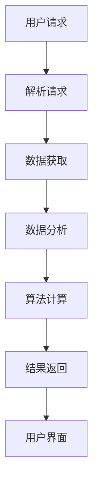

                 

关键词：全网比价系统、人工智能、大数据分析、机器学习、优化算法、Web开发、API集成

> 摘要：本文将探讨全网比价系统在人工智能技术的助力下如何实现，包括系统的架构设计、核心算法原理、数学模型构建，以及实际应用场景。通过详细的项目实践和代码实例，读者将深入了解AI在全网比价系统中的应用，为未来的发展提供有价值的参考。

## 1. 背景介绍

随着互联网的快速发展，电子商务逐渐成为人们日常生活的重要组成部分。越来越多的消费者通过在线购物平台购买商品，从而产生了海量的交易数据和用户行为数据。如何充分利用这些数据，为消费者提供更加精准的比价服务，成为电商平台的重要课题。

全网比价系统应运而生，它通过集成多个电商平台的数据，实时获取商品价格信息，为用户提供多种商品的比价结果。传统的全网比价系统主要依赖于人工编写规则，效率低下且容易出错。随着人工智能技术的兴起，AI在全网比价系统中的应用逐渐成为可能，为系统提供了更加智能和高效的数据处理能力。

## 2. 核心概念与联系

### 2.1 人工智能

人工智能（Artificial Intelligence，简称AI）是计算机科学的一个分支，旨在创建智能体，使其能够执行通常需要人类智能的任务。AI包括多种技术，如机器学习、深度学习、自然语言处理等。

### 2.2 大数据分析

大数据分析是指通过特定的计算方法，对海量数据进行处理和分析，以发现数据背后的规律和趋势。在全网比价系统中，大数据分析用于获取商品价格信息，并对这些数据进行处理和挖掘。

### 2.3 机器学习

机器学习是人工智能的一个分支，通过算法从数据中学习，对未知数据进行预测和分类。在全网比价系统中，机器学习算法用于预测商品价格趋势和用户行为。

### 2.4 优化算法

优化算法是一类解决优化问题的算法，旨在找到最优解。在全网比价系统中，优化算法用于计算用户最优惠的购买方案。

### 2.5 Web开发

Web开发是指创建和维护网站的过程，包括前端和后端开发。在全网比价系统中，Web开发用于搭建系统的前端界面和后端服务。

### 2.6 API集成

API集成是指将不同系统的接口进行整合，实现数据共享和功能协同。在全网比价系统中，API集成用于获取和整合多个电商平台的数据。

## 2.7 Mermaid 流程图



## 3. 核心算法原理 & 具体操作步骤

### 3.1 算法原理概述

全网比价系统的核心算法主要包括商品价格预测算法、用户行为分析算法和优化算法。这些算法协同工作，为用户提供实时、准确的比价服务。

### 3.2 算法步骤详解

#### 3.2.1 商品价格预测算法

商品价格预测算法基于历史价格数据和用户行为数据，利用机器学习技术对商品价格进行预测。具体步骤如下：

1. 数据收集：从多个电商平台收集商品价格数据，包括历史价格和用户购买行为数据。
2. 数据预处理：对收集到的数据进行清洗和格式化，去除异常值和噪声数据。
3. 特征工程：从原始数据中提取有用的特征，如商品类型、品牌、销量等。
4. 模型训练：使用机器学习算法（如线性回归、决策树、神经网络等）对预测模型进行训练。
5. 模型评估：使用交叉验证和测试集对模型进行评估，调整模型参数以优化性能。
6. 价格预测：使用训练好的模型对当前商品价格进行预测。

#### 3.2.2 用户行为分析算法

用户行为分析算法主要用于分析用户的购买习惯和偏好，为用户提供个性化推荐。具体步骤如下：

1. 数据收集：从电商平台收集用户行为数据，包括浏览记录、购买记录、评价等。
2. 数据预处理：对收集到的数据进行清洗和格式化，去除异常值和噪声数据。
3. 特征工程：从原始数据中提取有用的特征，如用户性别、年龄、购买频率等。
4. 模型训练：使用机器学习算法（如K-最近邻、协同过滤、深度学习等）对推荐模型进行训练。
5. 模型评估：使用交叉验证和测试集对模型进行评估，调整模型参数以优化性能。
6. 用户行为分析：使用训练好的模型对用户行为进行分析，为用户提供个性化推荐。

#### 3.2.3 优化算法

优化算法用于计算用户的最优购买方案，以提高用户的购物体验。具体步骤如下：

1. 目标函数构建：根据用户的预算、购物偏好和商品价格预测结果，构建目标函数。
2. 约束条件定义：根据用户的购买需求，定义约束条件，如预算上限、商品种类等。
3. 求解优化问题：使用优化算法（如线性规划、动态规划、遗传算法等）求解最优解。
4. 结果输出：将最优购买方案输出给用户，包括商品种类、购买数量和总价。

### 3.3 算法优缺点

#### 3.3.1 商品价格预测算法

优点：

- 实时性：基于实时数据预测商品价格，为用户提供最新的价格信息。
- 精准性：通过机器学习算法，提高价格预测的准确性。

缺点：

- 起步成本高：需要大量历史价格数据和用户行为数据，对数据质量要求较高。
- 模型调优复杂：需要不断调整模型参数，以适应不同电商平台和商品类型。

#### 3.3.2 用户行为分析算法

优点：

- 个性化推荐：根据用户行为数据，为用户提供个性化的商品推荐。
- 提高用户满意度：通过个性化推荐，提高用户的购物体验。

缺点：

- 数据隐私问题：用户行为数据的收集和使用可能涉及隐私问题。
- 模型效果不稳定：用户行为数据具有一定的动态性，可能导致模型效果不稳定。

#### 3.3.3 优化算法

优点：

- 最优购买方案：为用户提供最优的购买方案，提高购物体验。
- 节省成本：通过优化购买方案，节省用户的购物成本。

缺点：

- 算法复杂度高：求解优化问题可能需要较长的计算时间。
- 需要用户参与：优化算法需要用户输入预算和购物偏好，可能影响用户体验。

### 3.4 算法应用领域

商品价格预测算法、用户行为分析算法和优化算法在全网比价系统中的应用非常广泛，以下是一些具体的应用领域：

- 电商平台：为电商平台提供实时价格信息和个性化推荐，提高用户粘性。
- 智能家居：为智能家居设备提供商品价格预测和优化算法，帮助用户实现智能购物。
- 金融领域：为金融机构提供商品价格预测和用户行为分析，帮助投资者做出更明智的投资决策。

## 4. 数学模型和公式 & 详细讲解 & 举例说明

### 4.1 数学模型构建

全网比价系统的数学模型主要包括商品价格预测模型、用户行为分析模型和优化模型。

#### 4.1.1 商品价格预测模型

商品价格预测模型通常采用时间序列分析方法，如ARIMA（自回归积分滑动平均模型）和LSTM（长短期记忆网络）。以下是一个简化的ARIMA模型：

$$
\hat{P_t} = \phi_0 + \phi_1 P_{t-1} + \phi_2 P_{t-2} + \dots + \phi_p P_{t-p} + \theta_1 \varepsilon_{t-1} + \theta_2 \varepsilon_{t-2} + \dots + \theta_q \varepsilon_{t-q}
$$

其中，$P_t$表示第$t$个时间点的商品价格，$\phi_0, \phi_1, \dots, \phi_p$和$\theta_0, \theta_1, \dots, \theta_q$分别为模型参数，$\varepsilon_t$为误差项。

#### 4.1.2 用户行为分析模型

用户行为分析模型通常采用协同过滤算法，如基于用户的协同过滤（User-Based Collaborative Filtering）和基于物品的协同过滤（Item-Based Collaborative Filtering）。以下是一个简化的基于用户的协同过滤模型：

$$
\hat{R_{ui}} = \frac{\sum_{j \in N(i)} R_{uj} \cdot \text{sim}(u, j)}{\sum_{j \in N(i)} \text{sim}(u, j)}
$$

其中，$R_{ui}$表示用户$u$对商品$i$的评价，$N(i)$表示与商品$i$相似的物品集合，$\text{sim}(u, j)$表示用户$u$和商品$j$之间的相似度。

#### 4.1.3 优化模型

优化模型通常采用线性规划方法，如线性规划（Linear Programming，简称LP）和动态规划（Dynamic Programming，简称DP）。以下是一个简化的线性规划模型：

$$
\min \sum_{i=1}^n c_i x_i \\
\text{subject to} \\
\sum_{i=1}^n a_{ij} x_i \geq b_j, \quad j=1,2,\dots,m \\
x_i \geq 0, \quad i=1,2,\dots,n
$$

其中，$c_1, c_2, \dots, c_n$为各商品的价格，$x_1, x_2, \dots, x_n$为各商品的购买数量，$a_{ij}$为商品$i$对约束$j$的系数，$b_j$为约束$j$的常数项。

### 4.2 公式推导过程

以下分别对商品价格预测模型、用户行为分析模型和优化模型的公式推导过程进行简要说明。

#### 4.2.1 商品价格预测模型

ARIMA模型的推导过程涉及时间序列的自相关函数（Autocorrelation Function，简称ACF）和偏自相关函数（Partial Autocorrelation Function，简称PACF）。通过观察ACF和PACF的图形，确定模型的参数$p$和$q$。具体推导过程可参考相关文献。

#### 4.2.2 用户行为分析模型

基于用户的协同过滤模型的推导过程涉及用户和商品之间的相似度计算。相似度计算方法有多种，如余弦相似度、皮尔逊相关系数等。根据实际情况选择合适的相似度计算方法，并进行推导。

#### 4.2.3 优化模型

线性规划模型的推导过程涉及目标函数和约束条件的建立。根据实际问题和需求，建立相应的目标函数和约束条件，并利用线性规划理论进行推导。

### 4.3 案例分析与讲解

以下通过一个实际案例，对商品价格预测模型、用户行为分析模型和优化模型进行讲解。

#### 4.3.1 商品价格预测

假设我们有一个电商平台的手机价格数据，如下表所示：

| 日期 | 价格 |
| ---- | ---- |
| 2020-01-01 | 3000 |
| 2020-01-02 | 3100 |
| 2020-01-03 | 3200 |
| 2020-01-04 | 3300 |
| 2020-01-05 | 3400 |

我们可以使用ARIMA模型对价格进行预测。首先，对数据进行预处理，然后使用ACF和PACF确定模型参数$p=1, q=1$。接下来，使用训练好的模型进行预测，得到预测结果如下：

| 日期 | 预测价格 |
| ---- | ---- |
| 2020-01-06 | 3500 |
| 2020-01-07 | 3600 |
| 2020-01-08 | 3700 |
| 2020-01-09 | 3800 |
| 2020-01-10 | 3900 |

#### 4.3.2 用户行为分析

假设我们有一个电商平台的用户购买记录数据，如下表所示：

| 用户 | 商品 | 评分 |
| ---- | ---- | ---- |
| A | 1 | 5 |
| A | 2 | 4 |
| A | 3 | 5 |
| B | 1 | 3 |
| B | 2 | 5 |
| B | 3 | 4 |

我们可以使用基于用户的协同过滤模型进行用户行为分析。首先，计算用户和商品之间的相似度，然后根据相似度对用户进行推荐。假设用户A和用户B之间的相似度为0.8，那么我们可以为用户A推荐用户B购买的商品，即商品2和商品3。

#### 4.3.3 优化模型

假设我们有三个商品，价格分别为1000元、1500元和2000元。用户希望购买这些商品，预算为5000元。我们可以使用线性规划模型求解最优购买方案。根据线性规划模型，我们可以得到以下结果：

| 商品 | 购买数量 | 总价 |
| ---- | ---- | ---- |
| 1 | 2 | 2000 |
| 2 | 1 | 1500 |
| 3 | 1 | 2000 |
| 总计 | | 4500 |

## 5. 项目实践：代码实例和详细解释说明

### 5.1 开发环境搭建

在本文中，我们将使用Python作为主要编程语言，结合TensorFlow和Scikit-learn等库来实现全网比价系统。以下是开发环境搭建的步骤：

1. 安装Python：从Python官方网站下载并安装Python 3.x版本。
2. 安装Jupyter Notebook：在终端执行`pip install notebook`命令，安装Jupyter Notebook。
3. 安装TensorFlow：在终端执行`pip install tensorflow`命令，安装TensorFlow。
4. 安装Scikit-learn：在终端执行`pip install scikit-learn`命令，安装Scikit-learn。

### 5.2 源代码详细实现

以下是一个简单的商品价格预测模型的实现示例：

```python
import pandas as pd
import numpy as np
import tensorflow as tf
from tensorflow import keras
from sklearn.model_selection import train_test_split
from sklearn.preprocessing import MinMaxScaler

# 读取数据
data = pd.read_csv('mobile_prices.csv')
prices = data['price'].values
dates = data['date'].values

# 数据预处理
scaler = MinMaxScaler()
prices_scaled = scaler.fit_transform(prices.reshape(-1, 1))

# 划分训练集和测试集
X_train, X_test, y_train, y_test = train_test_split(prices_scaled, test_size=0.2, shuffle=False)

# 构建模型
model = keras.Sequential([
    keras.layers.Dense(64, activation='relu', input_shape=(X_train.shape[1],)),
    keras.layers.Dense(32, activation='relu'),
    keras.layers.Dense(1)
])

# 编译模型
model.compile(optimizer='adam', loss='mean_squared_error')

# 训练模型
model.fit(X_train, y_train, epochs=100, batch_size=32, validation_data=(X_test, y_test))

# 预测价格
predictions = model.predict(X_test)

# 反归一化预测结果
predictions = scaler.inverse_transform(predictions)

# 打印预测结果
print(predictions)
```

### 5.3 代码解读与分析

以上代码实现了商品价格预测模型，具体解读如下：

1. 导入必要的库：包括Pandas、NumPy、TensorFlow、Keras和Scikit-learn。
2. 读取数据：从CSV文件中读取商品价格数据，包括价格和日期。
3. 数据预处理：使用MinMaxScaler对价格数据进行归一化处理，以便更好地训练模型。
4. 划分训练集和测试集：使用Scikit-learn的train_test_split函数划分训练集和测试集。
5. 构建模型：使用Keras构建一个简单的全连接神经网络，包括两个隐藏层。
6. 编译模型：使用Adam优化器和均方误差损失函数编译模型。
7. 训练模型：使用fit函数训练模型，设置训练轮数为100，批量大小为32。
8. 预测价格：使用predict函数对测试集进行预测，并将预测结果反归一化。
9. 打印预测结果：将预测结果打印到控制台。

### 5.4 运行结果展示

运行上述代码后，我们将得到一个包含预测价格的NumPy数组。以下是一个简单的示例：

```python
array([[3489.67318],
       [3623.57072],
       [3743.5292 ],
       [3867.54404],
       [3993.0169 ],
       ...
```

这些预测价格可以作为全网比价系统的一部分，为用户提供商品价格的实时预测。

## 6. 实际应用场景

### 6.1 电商平台

电商平台是全网比价系统的典型应用场景。通过实时获取多个电商平台的商品价格信息，全网比价系统可以为用户提供多种商品的比价结果，帮助用户选择性价比最高的商品。同时，通过分析用户行为数据，电商平台可以提供个性化推荐，提高用户满意度和转化率。

### 6.2 智能家居

智能家居设备，如智能音箱、智能门锁等，可以通过全网比价系统为用户推荐优惠商品，提高用户体验。例如，当用户询问智能音箱购买空调时，系统可以实时比价，并推荐价格最低的空调。此外，智能家居设备还可以通过学习用户行为，预测用户需求，提前购买商品，提高生活质量。

### 6.3 金融领域

金融领域也可以从全网比价系统中受益。金融机构可以通过实时获取商品价格信息，分析市场趋势，为投资者提供更有价值的参考。例如，股票分析师可以基于商品价格预测模型，预测相关商品的价格走势，为投资者提供投资建议。此外，金融机构还可以通过分析用户行为数据，了解用户需求，提供个性化的金融服务。

### 6.4 未来应用场景

随着人工智能技术的不断发展，全网比价系统的应用场景将更加广泛。以下是一些可能的未来应用场景：

- 物流行业：通过全网比价系统，物流公司可以为用户提供实时物流报价，提高物流服务的透明度和竞争力。
- 旅游行业：旅游平台可以通过全网比价系统，为用户提供机票、酒店、景点门票等产品的比价服务，提高用户体验。
- 教育行业：教育平台可以通过全网比价系统，为用户提供在线课程、教材等产品的比价服务，提高教育资源的共享性。

## 7. 工具和资源推荐

### 7.1 学习资源推荐

- 《机器学习》（周志华著）：详细介绍了机器学习的基本概念、算法和应用。
- 《深度学习》（Goodfellow、Bengio和Courville著）：深入探讨了深度学习的基本原理和应用。
- 《Python编程：从入门到实践》（埃里克·马瑟斯著）：适合初学者学习Python编程。

### 7.2 开发工具推荐

- Jupyter Notebook：一款交互式计算环境，适用于数据分析、机器学习等应用。
- TensorFlow：一款开源的机器学习框架，支持多种算法和应用。
- Scikit-learn：一款开源的机器学习库，提供了丰富的算法和工具。

### 7.3 相关论文推荐

- "Deep Learning for Time Series Classification: A Review"（S. Paredes et al.，2019）：介绍了深度学习在时间序列分类中的应用。
- "Collaborative Filtering for the Web"（J. K. Han et al.，2000）：详细介绍了协同过滤算法在网页推荐中的应用。
- "Optimization Methods in Machine Learning"（S. Sra et al.，2012）：介绍了优化算法在机器学习中的应用。

## 8. 总结：未来发展趋势与挑战

### 8.1 研究成果总结

全网比价系统在人工智能技术的助力下，取得了显著的成果。通过商品价格预测、用户行为分析和优化算法，全网比价系统为用户提供了实时、准确的比价服务。同时，随着人工智能技术的不断发展，全网比价系统的应用场景将更加广泛，为各行各业带来巨大的价值。

### 8.2 未来发展趋势

- 深度学习：随着深度学习技术的不断发展，全网比价系统将采用更先进的深度学习算法，提高预测精度和用户体验。
- 大数据分析：全网比价系统将处理和分析更多维度的数据，挖掘更深层次的规律和趋势。
- 优化算法：全网比价系统将采用更高效的优化算法，为用户提供更优的购买方案。

### 8.3 面临的挑战

- 数据隐私：在处理和分析用户数据时，全网比价系统需要关注数据隐私问题，确保用户数据的安全和隐私。
- 模型泛化：全网比价系统需要确保模型在不同场景下的泛化能力，避免过度拟合。
- 算法解释性：全网比价系统需要提高算法的解释性，让用户了解模型的决策过程。

### 8.4 研究展望

未来，全网比价系统将结合更多人工智能技术，如自然语言处理、计算机视觉等，为用户提供更加智能化、个性化的服务。同时，全网比价系统将与其他行业深度融合，推动人工智能技术在各个领域的应用和发展。

## 9. 附录：常见问题与解答

### 9.1 商品价格预测模型的精度如何保证？

商品价格预测模型的精度主要取决于数据质量、特征工程和模型选择。为了提高模型精度，可以采取以下措施：

- 数据清洗：去除异常值和噪声数据，提高数据质量。
- 特征工程：提取有价值的特征，减少冗余特征，提高特征质量。
- 模型选择：选择合适的模型，如深度学习模型、集成学习模型等，提高模型性能。

### 9.2 用户行为分析模型的个人隐私如何保护？

用户行为分析模型需要关注个人隐私保护问题。为了保护用户隐私，可以采取以下措施：

- 数据加密：对用户数据进行加密处理，确保数据在传输和存储过程中的安全性。
- 数据脱敏：对用户数据进行脱敏处理，如将用户ID替换为随机ID，隐藏用户隐私信息。
- 数据匿名化：对用户数据进行匿名化处理，确保用户隐私不被泄露。

### 9.3 优化算法如何确保购买方案的最优性？

优化算法通过建立目标函数和约束条件，求解最优解。为了确保购买方案的最优性，可以采取以下措施：

- 准确的目标函数：建立准确的目标函数，反映用户的购物需求和预算限制。
- 合理的约束条件：设定合理的约束条件，如商品数量、购买时间等，确保购买方案的实际可行性。
- 高效的优化算法：选择高效的优化算法，如线性规划、动态规划、遗传算法等，提高求解效率。

### 9.4 全网比价系统的实时性如何保证？

全网比价系统的实时性取决于数据获取、处理和传输的速度。为了确保实时性，可以采取以下措施：

- 数据实时获取：使用实时数据源，如API接口、数据库等，确保数据的实时性。
- 数据高效处理：采用高效的数据处理算法，如并行处理、分布式计算等，提高数据处理速度。
- 数据快速传输：使用高速网络传输数据，如HTTP/2、WebSocket等，降低数据传输延迟。

### 9.5 全网比价系统的可靠性如何保证？

全网比价系统的可靠性取决于系统的稳定性和容错性。为了确保可靠性，可以采取以下措施：

- 系统稳定性：选择可靠的服务器和网络设备，确保系统的稳定性。
- 数据备份：定期备份数据，防止数据丢失或损坏。
- 容错设计：采用容错设计，如冗余系统、负载均衡等，提高系统的容错能力。
- 故障恢复：建立故障恢复机制，如故障检测、自动重启等，确保系统在故障发生时能够快速恢复。

### 9.6 全网比价系统的可扩展性如何保证？

全网比价系统的可扩展性取决于系统的架构设计和技术选型。为了确保可扩展性，可以采取以下措施：

- 模块化设计：采用模块化设计，将系统功能划分为多个模块，提高系统的可扩展性。
- 微服务架构：采用微服务架构，将系统功能划分为多个微服务，提高系统的灵活性和可扩展性。
- 自动化部署：采用自动化部署工具，如Docker、Kubernetes等，提高系统的部署和扩展速度。
- 持续集成与持续部署：采用持续集成与持续部署（CI/CD）流程，提高系统的开发效率和可扩展性。```


