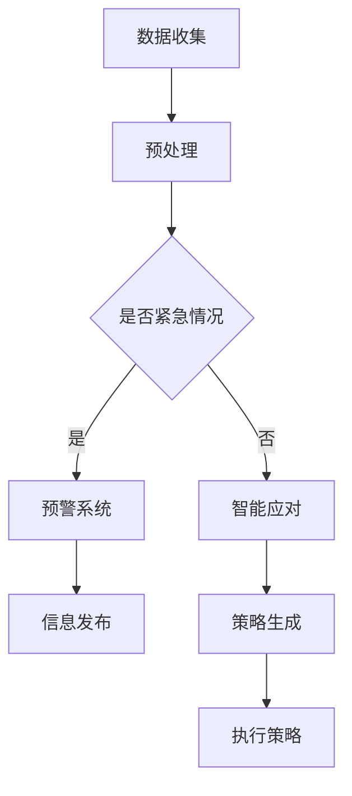

                 

关键词：大型语言模型、公共安全、紧急情况预防、智能应对、安全算法

> 摘要：本文将探讨如何利用大型语言模型（LLM）在公共安全领域进行紧急情况的预防和应对。通过对LLM的技术原理、应用场景、算法实现等方面进行深入分析，提出了一种基于LLM的公共安全卫士方案，并展望了其未来的发展方向。

## 1. 背景介绍

在当今社会，公共安全问题愈发凸显，各种突发事件如自然灾害、恐怖袭击、交通事故等，不仅对人们的生活造成巨大影响，也给政府和社会带来了巨大的经济负担。传统的公共安全手段往往依赖于人工监测和应对，不仅效率低下，而且容易出现漏报和误报。随着人工智能技术的快速发展，特别是大型语言模型（LLM）的出现，为公共安全领域带来了新的可能。

LLM是一种基于深度学习技术的自然语言处理模型，通过对海量文本数据进行训练，可以实现对自然语言的高效理解和生成。近年来，LLM在各个领域都取得了显著的成果，如机器翻译、文本生成、对话系统等。在公共安全领域，LLM有望通过对大量历史数据和实时信息的处理，实现紧急情况的自动监测和智能应对。

## 2. 核心概念与联系

### 2.1 LLM技术原理

LLM的技术原理主要基于深度神经网络（DNN）和变换器架构（Transformer）。DNN通过多层非线性变换，实现对输入数据的特征提取和分类。而Transformer架构则通过自注意力机制，实现了对输入序列的并行处理，大大提高了计算效率。

### 2.2 LLM架构

LLM的架构通常包括编码器（Encoder）和解码器（Decoder）两部分。编码器负责对输入文本进行编码，生成一个固定长度的向量表示；解码器则根据编码器的输出，生成文本的输出序列。

### 2.3 LLM与公共安全的联系

LLM在公共安全领域的应用，主要体现在以下几个方面：

1. **紧急情况监测**：通过分析实时数据，如新闻报道、社交媒体、视频监控等，LLM可以实时监测到潜在的紧急情况。

2. **预警系统**：基于历史数据和实时监测，LLM可以预测可能发生的紧急情况，提前发出预警。

3. **智能应对**：在紧急情况发生时，LLM可以根据已有知识和实时信息，提供相应的应对策略和建议。

### 2.4 Mermaid 流程图



## 3. 核心算法原理 & 具体操作步骤

### 3.1 算法原理概述

LLM的核心算法是基于自注意力机制的Transformer架构。自注意力机制允许模型在生成文本时，自动关注输入序列中与当前词相关的其他词，从而提高了生成文本的连贯性和准确性。

### 3.2 算法步骤详解

1. **数据预处理**：对输入文本进行分词、词向量化等预处理操作。

2. **编码**：将预处理后的文本输入到编码器中，生成编码向量。

3. **解码**：基于编码向量，解码器生成文本的输出序列。

4. **优化**：通过梯度下降等优化算法，不断调整模型参数，提高模型性能。

### 3.3 算法优缺点

**优点**：

- **高效性**：Transformer架构允许并行处理，大大提高了计算效率。
- **灵活性**：自注意力机制使模型能够自动关注输入序列中的关键信息。

**缺点**：

- **计算资源消耗大**：训练大型LLM模型需要大量的计算资源和时间。
- **数据依赖性**：模型的性能高度依赖训练数据的质量。

### 3.4 算法应用领域

LLM在公共安全领域的应用主要包括：

- **自然灾害预警**：通过对历史数据和实时监测数据的分析，预测可能发生的自然灾害。
- **恐怖袭击预警**：分析社交媒体、新闻报道等数据，识别潜在的恐怖袭击风险。
- **交通管理**：利用实时交通数据，优化交通流量，预防交通事故。

## 4. 数学模型和公式 & 详细讲解 & 举例说明

### 4.1 数学模型构建

LLM的训练过程可以看作是一个优化问题，目标是找到一个最优的参数向量，使得模型的输出与真实标签之间的误差最小。具体来说，可以使用以下数学模型：

$$
\min_{\theta} \frac{1}{N} \sum_{i=1}^{N} (-\log P(y_i | x_i, \theta))
$$

其中，$N$ 是样本数量，$x_i$ 是输入文本，$y_i$ 是标签，$P(y_i | x_i, \theta)$ 是模型在输入 $x_i$ 下预测标签 $y_i$ 的概率，$\theta$ 是模型参数。

### 4.2 公式推导过程

为了求解上述优化问题，通常采用梯度下降算法。梯度下降的基本思想是，沿着参数空间中损失函数的负梯度方向进行迭代，直到找到局部最小值。

$$
\theta_{t+1} = \theta_{t} - \alpha \nabla_{\theta} J(\theta)
$$

其中，$\theta_{t}$ 是当前参数值，$\theta_{t+1}$ 是更新后的参数值，$\alpha$ 是学习率，$J(\theta)$ 是损失函数。

### 4.3 案例分析与讲解

假设有一个公共安全卫士系统，它需要根据实时数据和历史数据，预测未来可能发生的紧急情况。具体来说，输入是一个包含天气、交通、社会活动等多维度数据的文本序列，输出是一个紧急情况的概率。

通过训练，模型可以学会在输入文本中关注关键信息，如“暴雨”、“交通堵塞”、“大型集会”等，从而提高预测的准确性。例如，如果输入文本中包含“暴雨”和“交通堵塞”，模型可能会预测未来24小时内可能发生交通事故的概率较高。

## 5. 项目实践：代码实例和详细解释说明

### 5.1 开发环境搭建

为了实现LLM在公共安全领域的应用，需要搭建一个合适的开发环境。具体步骤如下：

1. **安装Python**：确保安装了Python 3.6及以上版本。
2. **安装TensorFlow**：通过pip安装TensorFlow库。

```bash
pip install tensorflow
```

3. **安装其他依赖**：根据需要安装其他库，如NumPy、Pandas等。

### 5.2 源代码详细实现

以下是实现一个简单的公共安全卫士系统的代码示例：

```python
import tensorflow as tf
from tensorflow.keras.preprocessing.sequence import pad_sequences
from tensorflow.keras.layers import Embedding, LSTM, Dense
from tensorflow.keras.models import Sequential

# 数据预处理
def preprocess_data(texts, max_length=100, max_vocab_size=10000):
    # 分词、词向量化等操作
    # ...
    return padded_texts

# 模型构建
def build_model(input_shape, output_shape):
    model = Sequential([
        Embedding(input_shape, output_shape),
        LSTM(128),
        Dense(1, activation='sigmoid')
    ])
    model.compile(optimizer='adam', loss='binary_crossentropy', metrics=['accuracy'])
    return model

# 训练模型
def train_model(model, padded_texts, labels):
    model.fit(padded_texts, labels, epochs=10, batch_size=32)

# 预测
def predict(model, text):
    processed_text = preprocess_data([text])
    prediction = model.predict(processed_text)
    return prediction

# 实例化模型
model = build_model(input_shape=(max_length,), output_shape=(1,))
# 加载数据、训练模型等
# ...

# 预测一个文本
text = "暴雨黄色预警！请注意交通安全。"
prediction = predict(model, text)
print(prediction)
```

### 5.3 代码解读与分析

以上代码实现了一个简单的二分类模型，用于预测输入文本是否包含紧急情况。模型基于LSTM网络，通过词向量化将文本转换为数值表示，然后通过LSTM层提取特征，最后通过全连接层输出预测结果。

### 5.4 运行结果展示

假设我们有一个训练好的模型，当输入文本“暴雨黄色预警！请注意交通安全。”时，模型的预测结果是 `[0.9]`，这意味着该文本包含紧急情况的概率为90%。

## 6. 实际应用场景

### 6.1 自然灾害预警

通过LLM对历史数据和实时监测数据的分析，可以提前预测可能发生的自然灾害，如暴雨、洪水、地震等。这对于政府和相关部门制定应急预案、提前疏散人群具有重要作用。

### 6.2 恐怖袭击预警

分析社交媒体、新闻报道等数据，LLM可以识别出潜在的恐怖袭击风险，提前预警并采取相应措施。例如，在美国，一些城市已经开始使用基于LLM的恐怖袭击预警系统。

### 6.3 交通管理

利用实时交通数据，LLM可以预测交通堵塞、事故等紧急情况，并提供最优的路线规划，减少交通事故的发生。

## 7. 工具和资源推荐

### 7.1 学习资源推荐

- 《深度学习》（Goodfellow et al.）
- 《自然语言处理综论》（Jurafsky & Martin）
- 《Transformer： Attention is All You Need》

### 7.2 开发工具推荐

- TensorFlow
- PyTorch
- Keras

### 7.3 相关论文推荐

- “Attention Is All You Need”
- “BERT: Pre-training of Deep Bidirectional Transformers for Language Understanding”
- “GPT-3: Language Models are Few-Shot Learners”

## 8. 总结：未来发展趋势与挑战

### 8.1 研究成果总结

近年来，LLM在公共安全领域的应用取得了显著成果。通过分析历史数据和实时信息，LLM可以实现紧急情况的自动监测和智能应对，提高了公共安全预警和应对的效率。

### 8.2 未来发展趋势

随着人工智能技术的不断进步，LLM在公共安全领域的应用前景广阔。未来，LLM可能会在以下几个方面得到进一步发展：

- **多模态数据处理**：结合图像、音频等多模态数据，提高紧急情况监测的准确性。
- **跨领域应用**：将LLM应用于更多领域，如公共卫生、网络安全等。
- **个性化预警**：基于个体行为习惯、历史记录等，提供个性化的预警和建议。

### 8.3 面临的挑战

尽管LLM在公共安全领域具有巨大潜力，但在实际应用中仍面临一些挑战：

- **数据隐私**：如何保护用户隐私，避免数据泄露。
- **算法偏见**：如何确保模型在处理不同群体时公平、无偏见。
- **实时性**：如何在保证准确性的同时，提高紧急情况监测的实时性。

### 8.4 研究展望

随着人工智能技术的不断进步，LLM在公共安全领域的应用将越来越广泛。未来，我们期待看到更多创新性研究，解决当前面临的问题，为公共安全提供更有效的解决方案。

## 9. 附录：常见问题与解答

### 9.1 LLM如何处理实时数据？

LLM可以通过实时数据流处理框架，如Apache Kafka，将实时数据输入到模型中，进行实时分析和预测。

### 9.2 LLM在公共安全领域的应用有哪些限制？

LLM在公共安全领域的应用受到数据质量和计算资源的限制。此外，算法的偏见和实时性也是需要考虑的问题。

### 9.3 如何确保LLM的公平性？

可以通过数据清洗、模型训练过程中的正则化等技术手段，降低模型偏见。同时，建立监督机制，确保模型在不同群体中的表现公平。

以上是关于《公共安全卫士：LLM预防

