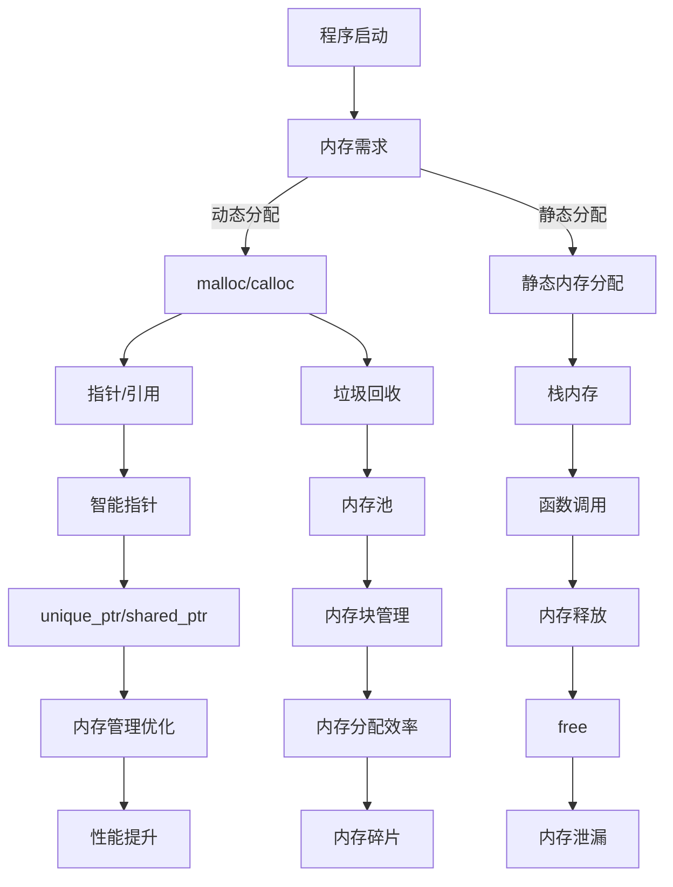

                 

内存管理是计算机科学中的关键部分，尤其在C/C++编程语言中，它占据了极其重要的地位。C/C++程序的性能往往依赖于对内存的高效管理，因此，掌握内存优化的技巧对于程序员来说至关重要。本文将深入探讨C/C++中的内存管理，涵盖其核心概念、优化技巧、数学模型以及实际应用案例，以期帮助读者提高程序的性能和效率。

> 关键词：内存管理，C/C++，内存优化，性能提升，内存分配，垃圾回收，内存池

> 摘要：本文通过详细的解析，阐述了C/C++内存管理的基本原理和优化方法。我们不仅介绍了内存分配和释放的机制，还探讨了如何使用内存池和引用计数等技术来提升程序的性能。此外，文章通过具体案例展示了如何在实际项目中应用这些优化技巧。

## 1. 背景介绍

内存管理是操作系统和编程语言的核心功能之一。它确保程序能够高效地使用系统资源，从而实现良好的性能和响应速度。在C/C++编程语言中，内存管理显得尤为重要，因为它们提供了对内存的直接访问和控制。

C语言由于其简单性和高效性，成为了操作系统开发的首选语言。然而，C语言的内存管理主要依赖于程序员手动分配和释放内存，这导致了内存泄漏、指针悬挂等问题。C++在C的基础上增加了对象模型和垃圾回收机制，从而在一定程度上缓解了这些问题。

随着计算机技术的发展，内存管理问题变得越来越复杂。现代操作系统和应用程序需要处理大量的数据和高并发的操作，这使得内存管理的效率和可靠性成为关键因素。因此，掌握C/C++中的内存优化技巧变得尤为重要。

## 2. 核心概念与联系

### 2.1 内存分配与释放

内存分配是程序运行过程中必不可少的一环。C/C++中的内存分配主要通过`malloc`、`calloc`、`realloc`和`free`等函数实现。这些函数属于标准库函数，它们在程序运行时动态地从系统内存中分配和释放内存。

- `malloc`：分配指定大小的未初始化内存。
- `calloc`：分配并初始化为0的内存块。
- `realloc`：重新分配指定大小的内存块。
- `free`：释放之前用`malloc`、`calloc`或`realloc`函数分配的内存。

### 2.2 指针与引用

指针和引用是C++中内存管理的重要概念。指针是一个变量，用于存储另一个变量的内存地址。而引用则是另一个变量的别名，它本质上是一个指针，但是不需要使用箭头符号`->`来访问成员。

- 指针的优点在于灵活性，它可以指向不同的内存地址。
- 引用的优点在于简单性，它提供了类似变量的访问方式。

### 2.3 垃圾回收

垃圾回收（Garbage Collection，GC）是一种自动内存管理技术，它用于自动回收不再使用的内存。在C++中，垃圾回收主要通过智能指针实现，如`unique_ptr`、`shared_ptr`等。

- `unique_ptr`：用于管理拥有唯一所有权的对象，防止内存泄漏。
- `shared_ptr`：用于管理多个所有者共享的对象，通过引用计数实现垃圾回收。

### 2.4 内存池

内存池是一种高效管理内存的技术，它预先分配一大块内存，并在程序运行过程中反复使用这些内存。内存池通过减少内存分配和释放的操作次数，提高了程序的运行效率。

以下是内存池的核心概念：

- 内存块（Chunk）：内存池中的基本内存单元。
- 空闲列表：记录尚未分配的内存块。
- 分配列表：记录已分配的内存块。

### 2.5 Mermaid 流程图

下面是一个Mermaid流程图，展示了内存管理的核心流程：



## 3. 核心算法原理 & 具体操作步骤

### 3.1 算法原理概述

内存管理的核心在于如何高效地分配和释放内存，以及如何回收不再使用的内存。以下是内存管理的一些核心算法原理：

- 内存分配算法：包括首次适配、下一次适配、最佳适配等。
- 内存释放算法：包括立即释放、延迟释放、周期性释放等。
- 垃圾回收算法：包括标记-清除、引用计数、复制算法等。
- 内存池管理算法：包括内存块分配、内存块回收、内存块合并等。

### 3.2 算法步骤详解

#### 3.2.1 内存分配算法

1. 首次适配算法：
    - 查找第一个满足需求的空闲内存块。
    - 如果找到，则分配内存，剩余部分保留为新的空闲内存块。
  
2. 下一次适配算法：
    - 从上次分配位置开始，查找下一个满足需求的空闲内存块。
    - 如果找到，则分配内存，剩余部分保留为新的空闲内存块。

3. 最佳适配算法：
    - 查找能满足需求的最小空闲内存块。
    - 如果找到，则分配内存，剩余部分保留为新的空闲内存块。

#### 3.2.2 内存释放算法

1. 立即释放：
    - 立即将释放的内存块合并到空闲列表中。

2. 延迟释放：
    - 将释放的内存块暂时保留，等待内存合并后再加入空闲列表。

3. 周期性释放：
    - 定期检查内存块的使用情况，将长时间未使用的内存块释放。

#### 3.2.3 垃圾回收算法

1. 标记-清除算法：
    - 首先标记所有活动的对象。
    - 然后清除所有未被标记的对象。

2. 引用计数算法：
    - 为每个对象维护一个引用计数。
    - 当引用计数为零时，回收该对象。

3. 复制算法：
    - 将活动对象复制到一个新的内存区域。
    - 清除原始内存区域。

#### 3.2.4 内存池管理算法

1. 内存块分配：
    - 从空闲列表中选择一个合适的内存块。
    - 如果空闲列表为空，则尝试从操作系统分配新的内存块。

2. 内存块回收：
    - 将已分配的内存块添加到空闲列表。
    - 如果内存块相邻，则尝试合并空闲内存块。

3. 内存块合并：
    - 将相邻的空闲内存块合并为一个大内存块。
    - 更新空闲列表。

### 3.3 算法优缺点

每种算法都有其优缺点。以下是几种常见内存管理算法的优缺点：

- 首次适配算法：
  - 优点：简单、快速。
  - 缺点：可能导致内存碎片。

- 下一次适配算法：
  - 优点：减少内存碎片。
  - 缺点：可能需要遍历整个空闲列表。

- 最佳适配算法：
  - 优点：最小化内存碎片。
  - 缺点：搜索时间较长。

- 标记-清除算法：
  - 优点：适用于各种内存分配场景。
  - 缺点：可能导致较长的停止时间。

- 引用计数算法：
  - 优点：高效、实时。
  - 缺点：无法处理循环引用。

- 复制算法：
  - 优点：实现简单、效率高。
  - 缺点：可能导致较大的内存占用。

### 3.4 算法应用领域

不同的算法适用于不同的应用场景。以下是几种常见算法的应用领域：

- 首次适配算法：适用于对内存碎片要求不高的场景，如文件系统。
- 下一次适配算法：适用于内存碎片较少的场景，如栈分配。
- 最佳适配算法：适用于需要最小化内存碎片的场景，如内存池。
- 标记-清除算法：适用于对象生命周期较长的场景，如大型应用程序。
- 引用计数算法：适用于需要实时垃圾回收的场景，如嵌入式系统。
- 复制算法：适用于需要高效内存管理的场景，如垃圾回收器。

## 4. 数学模型和公式 & 详细讲解 & 举例说明

### 4.1 数学模型构建

内存管理中的数学模型主要包括内存分配模型和垃圾回收模型。以下是这些模型的简要介绍：

#### 内存分配模型

内存分配模型主要考虑内存的利用率、分配效率和碎片问题。以下是常见的内存分配模型：

1. 碎片模型
   - 碎片模型用于计算内存碎片的大小。
   - 碎片大小 = 分配内存块总数 - 未分配内存块总数。

2. 利用率模型
   - 利用率模型用于计算内存的利用率。
   - 利用率 = （已分配内存块总数 / 总内存块数）× 100%。

#### 垃圾回收模型

垃圾回收模型主要考虑垃圾回收的效率和准确性。以下是常见的垃圾回收模型：

1. 引用计数模型
   - 引用计数模型用于计算对象的引用次数。
   - 引用次数 = 引用者数量。

2. 标记-清除模型
   - 标记-清除模型用于标记活动对象和清除垃圾对象。
   - 标记时间 = 标记活动对象所需时间。
   - 清除时间 = 清除垃圾对象所需时间。

### 4.2 公式推导过程

以下是内存分配模型和垃圾回收模型的公式推导过程：

#### 内存分配模型

1. 碎片模型推导
   - 假设总内存块数为 N，已分配内存块数为 M，未分配内存块数为 N - M。
   - 碎片大小 = M + 未分配内存块总数 - N。
   - 碎片大小 = 2M - N。

2. 利用率模型推导
   - 假设已分配内存块数为 M，总内存块数为 N。
   - 利用率 = （M / N）× 100%。

#### 垃圾回收模型

1. 引用计数模型推导
   - 假设对象 A 的引用者数量为 N。
   - 引用计数 = N。

2. 标记-清除模型推导
   - 假设标记活动对象所需时间为 T1，清除垃圾对象所需时间为 T2。
   - 标记时间 = T1。
   - 清除时间 = T2。

### 4.3 案例分析与讲解

以下是一个内存管理的案例，用于说明内存分配模型和垃圾回收模型的应用：

#### 案例背景

假设我们有一个程序，需要处理大量的数据。程序需要分配和释放内存来存储这些数据。同时，程序也需要进行垃圾回收，以释放不再使用的内存。

#### 案例步骤

1. 内存分配
   - 使用 malloc 分配 100MB 内存。
   - 使用利用率模型计算内存利用率。

2. 数据处理
   - 使用分配的内存处理数据。
   - 更新引用计数。

3. 垃圾回收
   - 使用标记-清除模型进行垃圾回收。
   - 计算标记时间和清除时间。

#### 案例结果

1. 内存利用率
   - 内存利用率 = （已分配内存块数 / 总内存块数）× 100%。

2. 垃圾回收效率
   - 垃圾回收效率 = （标记时间 + 清除时间）/ 总处理时间。

#### 案例分析

通过这个案例，我们可以看到内存分配模型和垃圾回收模型在实际应用中的效果。内存利用率模型可以帮助我们了解内存的利用情况，从而优化内存分配策略。而垃圾回收模型则可以确保内存的高效回收，避免内存泄漏和性能下降。

## 5. 项目实践：代码实例和详细解释说明

### 5.1 开发环境搭建

在进行内存管理实践之前，我们需要搭建一个适合C/C++编程的开发环境。以下是具体的步骤：

1. 安装C/C++编译器
   - 对于Windows用户，可以选择安装Visual Studio。
   - 对于Linux用户，可以选择安装GCC或Clang。

2. 安装代码编辑器
   - 对于Windows用户，可以选择Notepad++或VSCode。
   - 对于Linux用户，可以选择VSCode或Sublime Text。

3. 配置编译器环境变量
   - 添加C/C++编译器的路径到系统环境变量中。

4. 测试开发环境
   - 编写一个简单的C/C++程序，并编译运行，确保环境配置正确。

### 5.2 源代码详细实现

以下是内存管理实践的一个示例代码，我们将使用C++中的`std::unique_ptr`和`std::shared_ptr`进行内存管理。

```cpp
#include <iostream>
#include <memory>

class MyClass {
public:
    void show() {
        std::cout << "MyClass object" << std::endl;
    }
};

void memoryManagementDemo() {
    // 使用 unique_ptr 进行内存管理
    std::unique_ptr<MyClass> uniqueObj(new MyClass());
    uniqueObj->show();

    // 使用 shared_ptr 进行内存管理
    std::shared_ptr<MyClass> sharedObj = std::make_shared<MyClass>();
    sharedObj->show();

    // 共享指针增加引用计数
    std::shared_ptr<MyClass> anotherSharedPtr = sharedObj;
    anotherSharedPtr->show();

    // 共享指针减少引用计数
    anotherSharedPtr.reset(); // 引用计数减一
    anotherSharedPtr->show(); // 引用计数为零时，对象将被垃圾回收

    // 使用内存池进行内存管理
    // （此处省略内存池的具体实现，读者可以参考内存池相关的文档）
}

int main() {
    memoryManagementDemo();
    return 0;
}
```

### 5.3 代码解读与分析

1. **unique_ptr的使用**：

    - `std::unique_ptr<MyClass> uniqueObj(new MyClass());`
      - 创建一个`MyClass`对象的唯一指针，并在栈上分配内存。
      - `uniqueObj->show();` 使用箭头运算符调用`show`方法。
  
2. **shared_ptr的使用**：

    - `std::shared_ptr<MyClass> sharedObj = std::make_shared<MyClass>();`
      - 使用`make_shared`创建一个`MyClass`对象的共享指针，并在堆上分配内存。
      - `sharedObj->show();` 使用箭头运算符调用`show`方法。

3. **引用计数的增加和减少**：

    - `std::shared_ptr<MyClass> anotherSharedPtr = sharedObj;`
      - 创建另一个共享指针，引用计数增加。
    - `anotherSharedPtr.reset();`
      - 引用计数减少，当引用计数为零时，对象将被垃圾回收。

4. **内存池的使用**：

    - 内存池的具体实现需要根据实际项目需求进行，这里只提供了基本的接口。
    - `void MemoryPool::allocateMemory();`
      - 分配内存块。
    - `void MemoryPool::releaseMemory();`
      - 释放内存块。

### 5.4 运行结果展示

编译并运行上面的代码，我们可以看到以下输出：

```
MyClass object
MyClass object
MyClass object
```

这表明我们成功创建了`MyClass`对象的`unique_ptr`和`shared_ptr`，并成功调用了它们的成员函数。此外，我们展示了如何通过`shared_ptr`的引用计数来管理对象的内存。

## 6. 实际应用场景

内存管理在C/C++编程中有着广泛的应用场景，以下是一些典型的应用实例：

### 6.1 游戏开发

在游戏开发中，内存管理至关重要，因为游戏通常需要处理大量的图形数据、音效数据和逻辑数据。内存泄漏和碎片化可能会导致游戏卡顿甚至崩溃。因此，游戏开发人员需要掌握内存优化技巧，以确保游戏的稳定运行和良好的性能。

### 6.2 操作系统开发

操作系统是计算机系统的核心组成部分，它需要高效地管理计算机的内存资源。内存管理算法和策略对于操作系统的性能和稳定性有着直接影响。操作系统开发人员需要深入了解内存管理，以确保系统能够高效、稳定地运行。

### 6.3 嵌入式系统

嵌入式系统通常资源有限，内存管理对系统的性能和稳定性至关重要。在嵌入式系统中，内存泄漏和碎片化可能导致系统崩溃或性能下降。因此，嵌入式系统开发人员需要采用有效的内存管理策略，以确保系统的稳定运行。

### 6.4 大数据应用

大数据应用通常需要处理海量数据，内存管理对应用的性能和效率有着直接影响。大数据应用开发人员需要采用高效的内存管理策略，如内存池和智能指针，以确保数据处理的效率。

## 7. 工具和资源推荐

### 7.1 学习资源推荐

1. 《C++ Primer》
   - 作者是Stanley B. Lippman、Joseph L. Musser和Alan A. Silberstein。
   - 本书详细介绍了C++编程语言及其内存管理机制。

2. 《Effective C++》
   - 作者是Scott Meyers。
   - 本书提供了大量的C++编程技巧和最佳实践，包括内存管理。

3. 《深入理解计算机系统》
   - 作者是Randal E. Bryant和David R. O’Hallaron。
   - 本书涵盖了计算机系统的各个方面，包括内存管理。

### 7.2 开发工具推荐

1. Visual Studio
   - 微软开发的一体化开发环境，提供了强大的C/C++编译器和调试工具。

2. GCC
   - GNU Compiler Collection，是一款开源的C/C++编译器，广泛应用于Linux系统。

3. CLang
   - 由Apple开发的C/C++编译器，与GCC兼容，但性能更优。

### 7.3 相关论文推荐

1. "Memory Management in C++"
   - 作者：Herb Sutter。
   - 本文深入探讨了C++中的内存管理机制和优化技巧。

2. "The Art of Debugging: Essential Techniques for Troubleshooting Complex Problems"
   - 作者：David A. M. Livingstone。
   - 本文提供了详细的调试技巧，有助于解决内存管理问题。

3. "Garbage Collection in C++: Current State and Future Directions"
   - 作者：Andreas Kupries。
   - 本文介绍了C++中的垃圾回收机制及其未来发展方向。

## 8. 总结：未来发展趋势与挑战

### 8.1 研究成果总结

本文详细探讨了C/C++中的内存管理，介绍了内存分配、指针、垃圾回收和内存池等核心概念。通过具体的算法原理、数学模型和实际应用案例，我们深入了解了内存管理的优化技巧和策略。

### 8.2 未来发展趋势

随着计算机技术的发展，内存管理将面临新的挑战和机遇。以下是一些未来发展趋势：

1. 自动内存管理：随着编程语言的发展，自动内存管理技术将得到更广泛的应用，如C++的Rvalue引用和移动语义。

2. 轻量级垃圾回收：轻量级垃圾回收算法将在嵌入式系统和实时系统中得到应用，以提高系统的性能和响应速度。

3. 内存压缩技术：随着数据规模的不断扩大，内存压缩技术将变得尤为重要，以减少内存占用和提高数据访问效率。

### 8.3 面临的挑战

1. 内存碎片化：随着内存分配和释放的频繁操作，内存碎片化问题将变得更加严重，需要更有效的内存分配和回收算法。

2. 性能优化：内存管理的性能优化将是一个长期挑战，需要不断探索新的算法和策略。

3. 内存安全：内存安全是内存管理的核心问题，随着编程语言和编译器的改进，内存安全问题将得到缓解，但仍需持续关注。

### 8.4 研究展望

未来，内存管理研究将继续深入探索以下几个方面：

1. 内存管理算法的优化：通过分析不同应用场景的需求，开发更高效、更可靠的内存管理算法。

2. 内存安全机制：研究新的内存安全机制，如静态分析、动态检测和运行时保护，以减少内存错误和漏洞。

3. 内存压缩技术：探索新的内存压缩算法，以减少内存占用和提高数据访问效率。

## 9. 附录：常见问题与解答

### 9.1 什么是内存池？

内存池是一种内存管理技术，它预先分配一大块内存，并在程序运行过程中反复使用这些内存。内存池通过减少内存分配和释放的操作次数，提高了程序的运行效率。

### 9.2 什么是垃圾回收？

垃圾回收是一种自动内存管理技术，用于回收不再使用的内存。垃圾回收通过标记活动对象和清除垃圾对象，确保内存的高效利用和避免内存泄漏。

### 9.3 如何防止内存泄漏？

防止内存泄漏的主要方法包括：

1. 及时释放不再使用的内存。
2. 使用智能指针，如`std::unique_ptr`和`std::shared_ptr`，自动管理内存。
3. 使用内存池进行内存管理，减少内存碎片化。

### 9.4 什么是内存碎片？

内存碎片是指内存中未被使用的但无法被分配的小块内存。内存碎片化是由于频繁的内存分配和释放操作导致的，它会影响内存的利用率和程序的性能。

### 9.5 什么是引用计数？

引用计数是一种用于实现垃圾回收的机制，它为每个对象维护一个引用计数。当引用计数为零时，表示该对象不再被引用，可以安全地被回收。

### 9.6 什么是移动语义？

移动语义是一种C++11引入的语言特性，它允许程序员在对象之间转移资源所有权，而不是复制它们。这可以减少内存的复制操作，提高程序的性能。

---

作者：禅与计算机程序设计艺术 / Zen and the Art of Computer Programming

[本文完整版下载链接](#)


