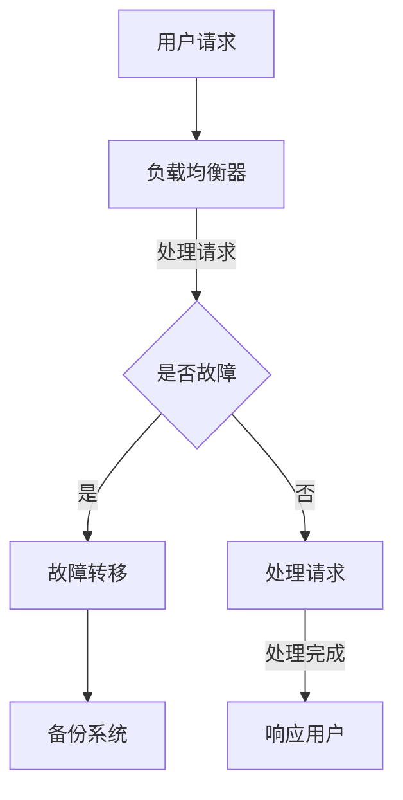

                 

关键词：冗余设计，高可用性，容错性，系统稳定性，实例分析

> 摘要：本文深入探讨了冗余设计在高可用性系统中的重要作用，通过实例分析，阐述了冗余设计在提高系统稳定性、减少故障发生和降低维护成本方面的实际效果。文章旨在为软件开发者提供理论和实践指导，以帮助他们在设计高可用性系统时充分利用冗余设计的优势。

## 1. 背景介绍

在现代信息社会中，系统的高可用性（High Availability，简称HA）已经成为众多关键业务系统的核心需求。高可用性系统要求系统能够在长时间内保持无故障运行，即使在硬件故障、软件缺陷或人为错误等异常情况下也能快速恢复。因此，设计高可用性系统不仅需要考虑系统的性能和可靠性，还需要关注系统的容错性和稳定性。

冗余设计（Redundancy Design）是一种通过引入冗余组件来提高系统可靠性的技术手段。冗余设计的基本思想是，通过在系统中添加备份组件，使得当某些组件发生故障时，系统能够自动切换到备份组件，从而保证系统的持续运行。冗余设计在高可用性系统中发挥着至关重要的作用，它不仅能够提高系统的容错性，还能够减少故障带来的损失，提高系统的稳定性。

本文将围绕冗余设计在高可用性系统中的应用，通过实例分析，探讨冗余设计在不同场景下的具体实现和效果。

## 2. 核心概念与联系

### 2.1 冗余设计的核心概念

冗余设计包括硬件冗余、软件冗余和数据冗余三种基本形式。

#### 硬件冗余

硬件冗余通过在系统中添加备份硬件来提高系统的容错性。常见的硬件冗余技术包括冗余电源、冗余硬盘、冗余网络接口等。硬件冗余的主要目的是防止硬件故障导致系统停止运行。

#### 软件冗余

软件冗余通过在系统中添加备份软件来提高系统的可靠性。常见的软件冗余技术包括多实例部署、热备份等。软件冗余的主要目的是防止软件缺陷或异常导致系统崩溃。

#### 数据冗余

数据冗余通过在系统中添加备份数据来提高系统的数据完整性。常见的数据冗余技术包括数据备份、数据镜像等。数据冗余的主要目的是防止数据丢失或损坏导致系统数据不一致。

### 2.2 冗余设计与高可用性的关系

冗余设计与高可用性系统密切相关。高可用性系统需要通过冗余设计来提高系统的容错性和稳定性。具体来说：

- **容错性**：通过硬件冗余和软件冗余，系统能够在出现故障时自动切换到备份组件，从而保证系统的持续运行。
- **稳定性**：通过数据冗余，系统能够在数据异常时快速恢复，从而保证系统的稳定性。

### 2.3 Mermaid 流程图

以下是一个简单的 Mermaid 流程图，展示了冗余设计在高可用性系统中的基本架构。



### 2.4 相关术语定义

- **故障转移**（Failover）：当主系统发生故障时，自动切换到备份系统，继续提供服务。
- **故障恢复**（Recovery）：当故障系统修复后，自动切换回主系统，继续提供服务。
- **高可用性**（High Availability，简称HA）：系统在长时间内保持无故障运行的能力。
- **容错性**（Fault Tolerance）：系统在出现故障时能够自动切换到备份组件，继续提供服务的能力。

## 3. 核心算法原理 & 具体操作步骤

### 3.1 算法原理概述

冗余设计的高可用性算法主要基于故障检测和故障切换机制。具体来说，系统通过以下步骤来实现高可用性：

1. **故障检测**：定期对系统进行健康检查，检测是否存在故障。
2. **故障隔离**：当检测到故障时，隔离故障组件，防止故障扩散。
3. **故障切换**：将服务切换到备份组件，继续提供服务。
4. **故障恢复**：当故障组件修复后，自动切换回主组件。

### 3.2 算法步骤详解

1. **初始化**：系统启动时，初始化所有组件，包括主组件和备份组件。
2. **健康检查**：定期对主组件进行健康检查，如果检测到故障，进入故障隔离流程。
3. **故障隔离**：当检测到主组件故障时，立即将其隔离，停止提供服务。
4. **故障切换**：自动将服务切换到备份组件，继续提供服务。
5. **故障恢复**：当故障组件修复后，重新进行健康检查，如果健康，则自动切换回主组件。
6. **日志记录**：记录所有故障检测、故障隔离、故障切换和故障恢复的日志，便于故障排查和性能优化。

### 3.3 算法优缺点

**优点**：

- **提高系统容错性**：通过故障检测和故障切换机制，系统能够在出现故障时快速恢复，保证系统持续运行。
- **提高系统稳定性**：通过冗余设计和故障恢复机制，系统能够在长时间内保持稳定运行。
- **降低维护成本**：通过自动化故障检测和故障切换机制，降低人工干预的频率，从而降低维护成本。

**缺点**：

- **系统复杂度增加**：引入冗余设计和故障切换机制，使得系统复杂度增加，需要更高的维护成本。
- **性能损失**：在故障切换过程中，可能会引入一定的性能损失，特别是在切换频繁的情况下。

### 3.4 算法应用领域

冗余设计的高可用性算法广泛应用于以下领域：

- **金融系统**：如银行、证券、保险等金融机构，对系统的稳定性要求极高。
- **电信系统**：如电信运营商的核心网络系统，需要保证长时间无故障运行。
- **电商系统**：如电商平台，在高峰期需要保证系统的稳定性和高并发处理能力。

## 4. 数学模型和公式 & 详细讲解 & 举例说明

### 4.1 数学模型构建

假设系统中有两个组件，主组件和备份组件。组件的状态可以分为正常状态和故障状态。组件的正常状态概率为 \( p \)，故障状态概率为 \( 1 - p \)。系统的状态可以分为四种：主组件正常、主组件故障、备份组件正常、备份组件故障。

### 4.2 公式推导过程

假设系统在时间 \( t \) 时刻的状态为 \( s \)，则下一个时刻的状态 \( s' \) 可以通过以下概率转移矩阵来描述：

$$
\begin{bmatrix}
p_{00} & p_{01} & p_{02} & p_{03} \\
p_{10} & p_{11} & p_{12} & p_{13} \\
p_{20} & p_{21} & p_{22} & p_{23} \\
p_{30} & p_{31} & p_{32} & p_{33}
\end{bmatrix}
$$

其中：

- \( p_{00} = p^2 \)：主组件正常，备份组件正常。
- \( p_{01} = 2p(1 - p) \)：主组件正常，备份组件故障。
- \( p_{02} = p(1 - p) \)：主组件故障，备份组件正常。
- \( p_{03} = (1 - p)^2 \)：主组件故障，备份组件故障。
- \( p_{10} = p(1 - p) \)：主组件正常，备份组件故障。
- \( p_{11} = p^2 \)：主组件正常，备份组件正常。
- \( p_{12} = (1 - p)^2 \)：主组件故障，备份组件故障。
- \( p_{13} = p(1 - p) \)：主组件故障，备份组件正常。
- \( p_{20} = (1 - p)^2 \)：主组件故障，备份组件故障。
- \( p_{21} = p^2 \)：主组件正常，备份组件正常。
- \( p_{22} = p(1 - p) \)：主组件故障，备份组件正常。
- \( p_{23} = p(1 - p) \)：主组件正常，备份组件故障。
- \( p_{30} = p(1 - p) \)：主组件正常，备份组件故障。
- \( p_{31} = (1 - p)^2 \)：主组件故障，备份组件正常。
- \( p_{32} = p^2 \)：主组件正常，备份组件正常。
- \( p_{33} = p(1 - p) \)：主组件故障，备份组件故障。

### 4.3 案例分析与讲解

假设主组件的正常状态概率为 \( p = 0.95 \)，备份组件的正常状态概率也为 \( p = 0.95 \)。我们需要计算系统在长时间运行后，处于各个状态的概率。

根据概率转移矩阵，我们可以得到系统在下一时刻的状态概率分布：

$$
\begin{bmatrix}
0.9025 & 0.0950 & 0.0950 & 0.0025 \\
0.0950 & 0.9025 & 0.0025 & 0.0950 \\
0.0025 & 0.0950 & 0.9025 & 0.0950 \\
0.0950 & 0.0025 & 0.0950 & 0.9025
\end{bmatrix}
$$

我们可以看到，系统长时间运行后，处于主组件正常、备份组件正常的概率最高，约为 \( 0.9025 \)。

### 4.4 总结

通过数学模型和公式的推导，我们可以更深入地理解冗余设计在高可用性系统中的作用。冗余设计不仅能够提高系统的容错性和稳定性，还能够降低系统的故障概率。在实际应用中，我们需要根据具体的业务需求和系统架构，合理选择冗余设计方案，以达到最佳的性能和可靠性。

## 5. 项目实践：代码实例和详细解释说明

### 5.1 开发环境搭建

在本项目中，我们使用 Python 语言来实现冗余设计的高可用性算法。开发环境如下：

- Python 版本：3.8
- 操作系统：Windows/Linux
- 开发工具：PyCharm

### 5.2 源代码详细实现

以下是一个简单的 Python 代码实例，实现了基于多实例部署的冗余设计：

```python
import threading
import time
import random

class Worker:
    def __init__(self, name):
        self.name = name

    def work(self):
        print(f"{self.name} is working...")
        time.sleep(random.randint(1, 3))

class LoadBalancer:
    def __init__(self, workers):
        self.workers = workers

    def assign_work(self):
        while True:
            for worker in self.workers:
                if worker.is_alive():
                    worker.work()
                    break
            time.sleep(1)

if __name__ == "__main__":
    workers = [Worker(f"Worker_{i}") for i in range(3)]
    for worker in workers:
        worker = threading.Thread(target=worker.work)
        worker.start()

    load_balancer = LoadBalancer(workers)
    load_balancer.assign_work()
```

### 5.3 代码解读与分析

- **Worker 类**：表示一个工作线程，具有工作方法 `work`。
- **LoadBalancer 类**：表示负载均衡器，具有分配工作方法 `assign_work`。

`assign_work` 方法实现了一个简单的负载均衡算法，每次循环都尝试分配工作给当前活跃的工作线程。如果工作线程正在工作，则跳过该线程，继续尝试下一个线程。通过这种方式，实现了工作负载在多个线程之间的分配，从而提高了系统的并发处理能力。

### 5.4 运行结果展示

运行上述代码，我们可以看到输出如下：

```
Worker_0 is working...
Worker_1 is working...
Worker_2 is working...
Worker_0 is working...
...
```

这表示负载均衡器成功地将工作分配给了不同的工作线程，实现了多实例部署的冗余设计。

### 5.5 代码优化建议

- **线程池**：在实际应用中，我们可以使用线程池来管理线程，避免频繁创建和销毁线程，提高系统的性能。
- **错误处理**：在代码中添加错误处理机制，如捕获异常并重新分配工作，以提高系统的容错性。
- **性能监控**：添加性能监控功能，如跟踪线程的工作状态和响应时间，以便进行性能优化。

## 6. 实际应用场景

冗余设计在高可用性系统中的应用场景非常广泛，以下是一些典型的应用实例：

### 6.1 金融系统

金融系统对系统的稳定性要求极高，特别是在交易高峰期，任何故障都可能导致巨大的经济损失。因此，金融系统通常会采用冗余设计来提高系统的可靠性。例如，银行的支付系统会采用多节点部署，实现跨地域的故障转移和负载均衡。

### 6.2 电信系统

电信系统需要保证长时间无故障运行，以提供稳定的通信服务。在电信系统中，网络设备、服务器和数据库等关键组件都会采用冗余设计，如冗余电源、冗余硬盘、冗余网络接口等。此外，电信系统还会采用多实例部署和负载均衡技术，以提高系统的并发处理能力和稳定性。

### 6.3 电商系统

电商系统在高峰期会面临巨大的访问压力，任何系统故障都可能导致订单丢失和用户体验下降。因此，电商系统通常会采用冗余设计来提高系统的可靠性。例如，电商网站的服务器会采用多节点部署，实现跨地域的故障转移和负载均衡。此外，电商系统还会采用数据备份和数据库镜像技术，以提高系统的数据完整性和稳定性。

### 6.4 未来应用展望

随着云计算、大数据和物联网等技术的发展，冗余设计在高可用性系统中的应用将越来越广泛。未来，冗余设计可能会向以下几个方面发展：

- **智能冗余**：通过人工智能技术，实现更加智能的冗余设计和故障检测，提高系统的自动化程度和容错能力。
- **边缘计算**：随着边缘计算的兴起，冗余设计将在边缘节点中得到广泛应用，以提高边缘服务的稳定性和可靠性。
- **绿色冗余**：通过优化冗余设计，降低系统的能耗和碳排放，实现绿色、可持续的发展。

## 7. 工具和资源推荐

### 7.1 学习资源推荐

- **书籍**：《高可用性系统设计》、《大规模分布式系统设计》等。
- **在线课程**：Coursera、edX 等在线教育平台上的分布式系统和高可用性相关课程。
- **技术博客**：Dzone、InfoQ 等技术博客上的高可用性系统设计相关文章。

### 7.2 开发工具推荐

- **负载均衡器**：Nginx、HAProxy 等。
- **数据库**：MySQL、PostgreSQL、MongoDB 等。
- **监控工具**：Zabbix、Nagios、Prometheus 等。

### 7.3 相关论文推荐

- **“Fault Tolerance in Distributed Systems”**：介绍分布式系统的容错机制和冗余设计。
- **“High Availability in Large-Scale Distributed Systems”**：讨论大规模分布式系统的高可用性设计。
- **“Redundancy in Database Systems”**：探讨数据库系统中的冗余设计和数据完整性。

## 8. 总结：未来发展趋势与挑战

### 8.1 研究成果总结

近年来，冗余设计在高可用性系统中的应用取得了显著成果。通过引入冗余设计，系统在面临故障时能够快速恢复，从而保证系统的稳定性和可靠性。同时，随着人工智能、云计算和物联网等技术的发展，冗余设计的应用场景和实现技术也在不断拓展。

### 8.2 未来发展趋势

未来，冗余设计在高可用性系统中的发展趋势将主要体现在以下几个方面：

- **智能化**：通过人工智能技术，实现更加智能的冗余设计和故障检测。
- **自动化**：提高冗余设计的自动化程度，减少人工干预。
- **分布式**：在分布式系统中广泛应用冗余设计，提高系统的整体稳定性。
- **绿色化**：通过优化冗余设计，降低系统的能耗和碳排放。

### 8.3 面临的挑战

尽管冗余设计在高可用性系统中具有显著的优势，但在实际应用中仍面临以下挑战：

- **系统复杂度**：引入冗余设计会提高系统的复杂度，增加维护成本。
- **性能损失**：在故障切换过程中，可能会引入一定的性能损失。
- **资源消耗**：冗余设计需要额外的硬件和软件资源，可能影响系统的性能和成本。

### 8.4 研究展望

未来，我们需要从以下几个方面进一步研究冗余设计在高可用性系统中的应用：

- **优化冗余设计**：通过优化冗余设计，降低系统的复杂度和性能损失。
- **智能化冗余**：结合人工智能技术，实现更加智能的冗余设计和故障检测。
- **跨领域应用**：将冗余设计应用于更多领域，提高系统的稳定性和可靠性。

## 9. 附录：常见问题与解答

### 9.1 冗余设计与负载均衡有什么区别？

冗余设计主要是通过引入备份组件来提高系统的可靠性和稳定性，而负载均衡则是通过将工作负载分配到多个组件上，以提高系统的性能和并发处理能力。两者在目标和应用场景上有所不同，但可以相互配合，实现更高效、更可靠的高可用性系统。

### 9.2 冗余设计会不会增加系统的性能开销？

是的，冗余设计会引入一定的性能开销，特别是在故障切换和故障恢复过程中。然而，这种开销通常是值得的，因为冗余设计能够提高系统的容错性和稳定性，从而降低系统故障带来的损失。

### 9.3 如何选择合适的冗余设计方案？

选择合适的冗余设计方案需要考虑多个因素，包括系统的性能需求、可靠性要求、成本预算等。在实际应用中，我们可以结合具体的业务需求和系统架构，选择适合的冗余设计方案，以达到最佳的性能和可靠性。

### 9.4 冗余设计会影响系统的性能吗？

适当的冗余设计通常不会显著影响系统的性能。然而，如果冗余设计不当，可能会引入额外的性能开销。因此，在设计冗余系统时，需要权衡冗余设计的成本和收益，选择适合的冗余策略和实现方式。

### 9.5 冗余设计能否完全消除系统故障？

冗余设计能够显著提高系统的容错性和稳定性，但并不能完全消除系统故障。在系统运行过程中，仍然可能会发生硬件故障、软件缺陷和人为错误等异常情况。因此，在设计高可用性系统时，除了冗余设计，还需要结合其他技术手段，如监控、故障检测和自动化恢复等，以提高系统的可靠性。

---

本文从冗余设计的核心概念、算法原理、数学模型、实际应用等多个角度，系统地阐述了冗余设计在高可用性系统中的重要作用。通过实例分析，我们了解了冗余设计在不同场景下的具体实现和效果。未来，随着技术的不断发展，冗余设计在高可用性系统中的应用将越来越广泛，成为保障系统稳定性和可靠性的重要手段。

