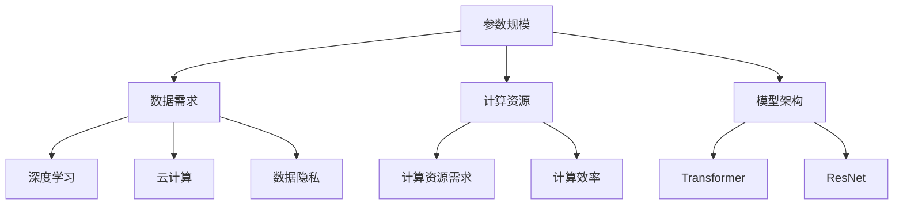

                 

关键词：冷启动、大模型、应用价值、技术趋势

> 摘要：本文将探讨冷启动场景下大模型的应用价值，通过深入分析核心概念、算法原理、数学模型以及实际应用场景，揭示大模型在各个领域的潜力和挑战。

## 1. 背景介绍

### 冷启动场景

冷启动（Cold Start）是互联网领域中的一个常见问题，尤其在推荐系统、社交媒体、在线广告等领域中。当新用户、新产品或新内容首次出现在系统中时，由于缺乏历史数据和用户行为信息，系统难以提供个性化、有针对性的服务。这种情况下，如何快速、有效地收集用户数据，建立有效的推荐模型，成为了冷启动场景需要解决的问题。

### 大模型的应用

近年来，大模型（Large-scale Models）在人工智能领域取得了显著的进展。大模型通常是指参数规模达到亿级甚至万亿级的深度学习模型，如GPT-3、BERT、ViT等。大模型的强大之处在于其能够处理大量的数据和复杂的任务，从而在各个领域展现出了巨大的应用价值。

## 2. 核心概念与联系

### 大模型的核心概念

大模型的核心概念包括以下几个方面：

1. **参数规模**：大模型的参数规模达到亿级甚至万亿级，这使得模型具有更强的表达能力和泛化能力。
2. **数据需求**：大模型需要大量的训练数据来确保模型的性能和效果。
3. **计算资源**：大模型的训练和推理过程需要大量的计算资源和时间。
4. **模型架构**：大模型的架构通常采用分层结构，如Transformer、ResNet等，以提高模型的计算效率和性能。

### 大模型与其他技术的联系

大模型与其他技术的联系主要体现在以下几个方面：

1. **深度学习**：大模型是深度学习技术的一种重要应用，深度学习通过多层神经网络来模拟人脑的思考过程，实现图像识别、语音识别、自然语言处理等任务。
2. **云计算**：大模型的训练和推理过程需要大量的计算资源和存储资源，云计算技术为大规模数据处理提供了强大的支持。
3. **数据隐私**：在大模型的应用过程中，数据隐私保护成为了一个重要问题。为了保护用户隐私，需要对数据进行脱敏处理，同时采用差分隐私、联邦学习等技术来保证数据的安全性和隐私性。

### Mermaid 流程图

下面是关于大模型的核心概念和架构的 Mermaid 流程图：



## 3. 核心算法原理 & 具体操作步骤

### 3.1 算法原理概述

大模型的算法原理主要基于深度学习，深度学习通过多层神经网络来模拟人脑的思考过程，实现图像识别、语音识别、自然语言处理等任务。大模型的训练过程通常包括以下几个步骤：

1. **数据预处理**：对输入数据进行清洗、归一化等处理，确保数据的质量和一致性。
2. **模型初始化**：初始化模型的参数，通常采用随机初始化或预训练模型的方式。
3. **前向传播**：将输入数据传递到模型中，通过多层神经网络的计算，得到模型的输出。
4. **反向传播**：根据模型的输出和真实标签，计算损失函数，并通过反向传播算法更新模型的参数。
5. **迭代训练**：重复执行前向传播和反向传播的过程，直至达到预定的训练次数或损失函数收敛。

### 3.2 算法步骤详解

1. **数据预处理**：

   - 数据清洗：去除数据中的噪声和异常值。
   - 数据归一化：将数据映射到统一的数值范围，如[-1, 1]或[0, 1]。
   - 数据增强：通过旋转、缩放、裁剪等方式增加数据的多样性。

2. **模型初始化**：

   - 随机初始化：随机生成模型的参数。
   - 预训练模型：使用预训练的模型作为初始化，如GPT-3、BERT等。

3. **前向传播**：

   - 输入数据经过模型的每一层，通过激活函数和权重矩阵的计算，得到模型的输出。
   - 使用softmax函数将输出映射到概率分布。

4. **反向传播**：

   - 计算损失函数：损失函数用于衡量模型的输出与真实标签之间的差距。
   - 使用梯度下降算法更新模型的参数。

5. **迭代训练**：

   - 设置训练次数或损失函数收敛条件。
   - 重复执行前向传播和反向传播的过程。

### 3.3 算法优缺点

**优点**：

1. **强大的表达能力**：大模型具有亿级甚至万亿级的参数，能够处理复杂的任务和数据。
2. **高效的计算能力**：大模型采用分层结构，提高了模型的计算效率和性能。
3. **优秀的泛化能力**：大模型在训练过程中通过大量的数据学习，具有较好的泛化能力。

**缺点**：

1. **对计算资源的需求高**：大模型的训练和推理过程需要大量的计算资源和时间。
2. **对数据的需求高**：大模型需要大量的训练数据来保证模型的性能和效果。
3. **模型的可解释性差**：大模型通常采用深层神经网络，其内部的计算过程较为复杂，难以解释。

### 3.4 算法应用领域

大模型在各个领域都有着广泛的应用，包括但不限于：

1. **自然语言处理**：如文本分类、情感分析、机器翻译等。
2. **计算机视觉**：如图像分类、目标检测、图像生成等。
3. **推荐系统**：如个性化推荐、广告投放等。
4. **语音识别**：如语音识别、语音合成等。

## 4. 数学模型和公式 & 详细讲解 & 举例说明

### 4.1 数学模型构建

大模型的数学模型主要基于深度学习，包括以下几个关键部分：

1. **激活函数**：如ReLU、Sigmoid、Tanh等。
2. **损失函数**：如交叉熵损失、均方误差等。
3. **优化算法**：如梯度下降、Adam等。

### 4.2 公式推导过程

下面以ReLU激活函数为例，介绍其数学推导过程：

假设输入$x$，ReLU函数的定义如下：

$$
ReLU(x) = \begin{cases}
x & \text{if } x > 0 \\
0 & \text{otherwise}
\end{cases}
$$

其导数可以表示为：

$$
\frac{dReLU(x)}{dx} = \begin{cases}
1 & \text{if } x > 0 \\
0 & \text{otherwise}
\end{cases}
$$

### 4.3 案例分析与讲解

下面以一个简单的神经网络为例，分析其数学模型和公式推导过程：

假设有一个简单的两层神经网络，输入为$x$，输出为$y$，激活函数为ReLU，损失函数为均方误差，优化算法为梯度下降。其数学模型如下：

$$
y = \sigma(\sigma(W_2 \cdot ReLU(W_1 \cdot x + b_1) + b_2))
$$

其中，$\sigma$表示softmax函数，$W_1$和$W_2$分别为第一层和第二层的权重矩阵，$b_1$和$b_2$分别为第一层和第二层的偏置。

损失函数为：

$$
J = \frac{1}{m} \sum_{i=1}^{m} (y_i - \sigma(W_2 \cdot ReLU(W_1 \cdot x_i + b_1) + b_2))^2
$$

其中，$m$表示样本数量。

优化算法的更新公式为：

$$
W_2 = W_2 - \alpha \cdot \frac{\partial J}{\partial W_2}
$$

$$
W_1 = W_1 - \alpha \cdot \frac{\partial J}{\partial W_1}
$$

$$
b_2 = b_2 - \alpha \cdot \frac{\partial J}{\partial b_2}
$$

$$
b_1 = b_1 - \alpha \cdot \frac{\partial J}{\partial b_1}
$$

其中，$\alpha$表示学习率。

## 5. 项目实践：代码实例和详细解释说明

### 5.1 开发环境搭建

首先，我们需要搭建一个Python开发环境，包括以下步骤：

1. 安装Python和pip。
2. 安装TensorFlow库。
3. 安装其他依赖库，如NumPy、Pandas等。

### 5.2 源代码详细实现

下面是一个简单的两层神经网络的实现代码：

```python
import tensorflow as tf
import numpy as np

# 定义神经网络结构
model = tf.keras.Sequential([
    tf.keras.layers.Dense(64, activation='relu', input_shape=(784,)),
    tf.keras.layers.Dense(10, activation='softmax')
])

# 编译模型
model.compile(optimizer='adam',
              loss='categorical_crossentropy',
              metrics=['accuracy'])

# 加载数据集
(x_train, y_train), (x_test, y_test) = tf.keras.datasets.mnist.load_data()

# 预处理数据
x_train = x_train / 255.0
x_test = x_test / 255.0

# 将标签转换为one-hot编码
y_train = tf.keras.utils.to_categorical(y_train, 10)
y_test = tf.keras.utils.to_categorical(y_test, 10)

# 训练模型
model.fit(x_train, y_train, epochs=5, batch_size=32)

# 评估模型
model.evaluate(x_test, y_test)
```

### 5.3 代码解读与分析

1. **定义神经网络结构**：

   使用`tf.keras.Sequential`类定义一个简单的两层神经网络，第一层为64个神经元的全连接层，使用ReLU激活函数；第二层为10个神经元的全连接层，使用softmax激活函数。

2. **编译模型**：

   使用`compile`方法编译模型，指定优化器为Adam，损失函数为categorical_crossentropy，评估指标为accuracy。

3. **加载数据集**：

   使用`tf.keras.datasets.mnist.load_data`方法加载数据集，其中包括训练集和测试集。

4. **预处理数据**：

   将图像数据除以255，将标签转换为one-hot编码。

5. **训练模型**：

   使用`fit`方法训练模型，指定训练轮次为5，批量大小为32。

6. **评估模型**：

   使用`evaluate`方法评估模型在测试集上的性能。

## 6. 实际应用场景

### 6.1 推荐系统

在推荐系统中，大模型可以用于用户画像、内容推荐、广告投放等任务。例如，通过分析用户的历史行为数据，大模型可以生成个性化的用户画像，从而为用户提供个性化的推荐。

### 6.2 自然语言处理

在自然语言处理领域，大模型可以用于文本分类、情感分析、机器翻译等任务。例如，通过训练大量文本数据，大模型可以学习到文本的特征和规律，从而实现文本分类和情感分析。

### 6.3 计算机视觉

在计算机视觉领域，大模型可以用于图像分类、目标检测、图像生成等任务。例如，通过训练大量图像数据，大模型可以学习到图像的特征和规律，从而实现图像分类和目标检测。

## 7. 工具和资源推荐

### 7.1 学习资源推荐

1. **《深度学习》（Goodfellow, Bengio, Courville著）**：这是一本经典的深度学习教材，涵盖了深度学习的核心概念、算法和原理。
2. **《Python深度学习》（François Chollet著）**：这本书通过实际案例和代码示例，介绍了使用Python进行深度学习的实践方法。

### 7.2 开发工具推荐

1. **TensorFlow**：TensorFlow是谷歌开源的深度学习框架，适用于各种深度学习任务。
2. **PyTorch**：PyTorch是Facebook开源的深度学习框架，具有动态计算图和灵活的API，适用于研究性和工业级应用。

### 7.3 相关论文推荐

1. **“A Theoretically Grounded Application of Dropout in Recurrent Neural Networks”**：这篇论文介绍了在循环神经网络中应用dropout的方法，提高了模型的性能和稳定性。
2. **“Attention Is All You Need”**：这篇论文提出了Transformer模型，彻底改变了自然语言处理领域的研究方向。

## 8. 总结：未来发展趋势与挑战

### 8.1 研究成果总结

近年来，大模型在人工智能领域取得了显著的进展，其在自然语言处理、计算机视觉、推荐系统等领域的应用取得了突破性的成果。大模型具有强大的表达能力、高效的计算能力和优秀的泛化能力，为人工智能的发展提供了新的机遇。

### 8.2 未来发展趋势

1. **模型压缩与加速**：为了降低大模型的计算资源和存储需求，模型压缩与加速技术将成为未来的研究热点。
2. **联邦学习与数据隐私**：随着数据隐私问题的日益突出，联邦学习与数据隐私技术将得到更广泛的应用。
3. **多模态学习**：大模型在处理多模态数据方面具有巨大的潜力，未来将会有更多的多模态学习应用出现。

### 8.3 面临的挑战

1. **计算资源需求**：大模型的训练和推理过程需要大量的计算资源和时间，如何高效地利用计算资源是一个重要挑战。
2. **数据需求**：大模型需要大量的训练数据来保证模型的性能和效果，如何获取和标注高质量的数据是一个重要挑战。
3. **模型可解释性**：大模型通常采用深层神经网络，其内部的计算过程较为复杂，如何解释和验证模型的决策过程是一个重要挑战。

### 8.4 研究展望

未来，大模型在人工智能领域将继续发挥重要作用，我们将看到更多创新性的应用和突破性的成果。同时，我们也需要关注大模型的计算资源需求、数据需求和模型可解释性问题，以确保大模型的可持续发展。

## 9. 附录：常见问题与解答

### 9.1 大模型为什么需要大量的训练数据？

大模型具有强大的表达能力和泛化能力，但这也意味着它们需要大量的训练数据来学习到数据的特征和规律。如果训练数据不足，模型可能会出现过拟合现象，导致在新的数据集上表现不佳。

### 9.2 如何解决大模型的计算资源需求？

为了降低大模型的计算资源需求，可以采用以下几种方法：

1. **模型压缩**：通过剪枝、量化、蒸馏等方法降低模型的参数规模和计算复杂度。
2. **分布式训练**：将训练任务分布在多台机器上，以加速训练过程。
3. **异构计算**：利用GPU、TPU等硬件加速训练过程。

### 9.3 如何解释大模型的决策过程？

大模型的决策过程通常较为复杂，难以直观解释。为了提高模型的可解释性，可以采用以下几种方法：

1. **模型可视化**：通过可视化模型的内部结构和计算过程，帮助理解模型的决策过程。
2. **特征重要性分析**：分析模型对各个特征的依赖程度，以确定哪些特征对模型决策影响最大。
3. **生成对抗网络（GAN）**：通过GAN生成模拟数据，帮助理解模型的决策过程。

---

作者：禅与计算机程序设计艺术 / Zen and the Art of Computer Programming

---

本文通过深入探讨冷启动场景下大模型的应用价值，分析了大模型的核心概念、算法原理、数学模型以及实际应用场景，展示了大模型在各个领域的潜力和挑战。随着人工智能技术的不断发展，大模型将继续在人工智能领域发挥重要作用，为人们的生活带来更多便利和创新。然而，我们也需要关注大模型的计算资源需求、数据需求和模型可解释性问题，以确保大模型的可持续发展。未来，我们将看到更多创新性的应用和突破性的成果，共同推动人工智能技术的发展。

