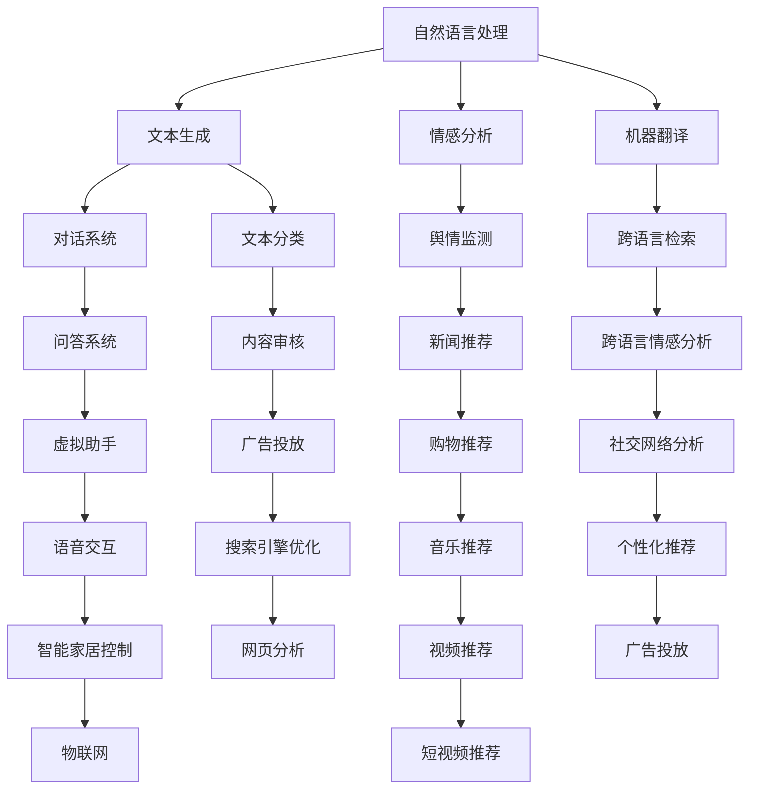

                 

关键词：创业公司，大模型，AI，转型，技术策略，行业应用

> 摘要：本文探讨了创业公司在人工智能领域中的大模型转型策略，分析了AI技术的核心概念、算法原理以及实际应用场景，旨在为创业公司提供抓住AI机会的科学指导，助力其实现快速发展。

## 1. 背景介绍

随着人工智能（AI）技术的快速发展，AI已逐渐成为各行各业创新的重要驱动力。大模型作为AI技术中的核心，其应用场景广泛，从自然语言处理、图像识别到推荐系统等，无处不在。对于创业公司而言，抓住AI技术的大模型转型机会，不仅有助于提升自身竞争力，还能在激烈的市场竞争中脱颖而出。

本文旨在为创业公司提供一整套系统化的大模型转型策略，帮助其深入了解AI技术，并掌握如何在实际业务中应用大模型，以实现业务创新和增长。

## 2. 核心概念与联系

### 2.1 人工智能的基本概念

人工智能（AI）是指通过计算机模拟人类智能行为的技术。AI涵盖了多个子领域，包括机器学习、深度学习、自然语言处理、计算机视觉等。在这些子领域中，大模型技术扮演着核心角色。

### 2.2 大模型技术概述

大模型是指具有大量参数和复杂结构的机器学习模型，如Transformer、BERT等。这些模型通过在海量数据上训练，能够达到较高的准确率和泛化能力。

### 2.3 大模型技术的应用场景

大模型技术在多个领域具有广泛应用，如自然语言处理、图像识别、推荐系统、自动驾驶等。以下是一个简单的Mermaid流程图，展示了大模型技术的应用场景：



## 3. 核心算法原理 & 具体操作步骤

### 3.1 算法原理概述

大模型技术主要基于深度学习，特别是基于Transformer架构的模型。Transformer模型通过自注意力机制（Self-Attention）和多头注意力（Multi-Head Attention）来捕捉序列数据中的长距离依赖关系，从而实现高效的语义理解。

### 3.2 算法步骤详解

#### 步骤1：数据预处理

首先，对原始数据进行清洗和预处理，包括分词、去停用词、词向量化等操作。然后，将预处理后的数据输入到模型中。

#### 步骤2：模型训练

使用训练数据对模型进行训练。在训练过程中，模型会通过反向传播算法不断调整参数，以优化模型性能。

#### 步骤3：模型评估

使用验证集对训练好的模型进行评估。常用的评估指标包括准确率、召回率、F1值等。

#### 步骤4：模型应用

将训练好的模型应用到实际业务场景中，如文本生成、情感分析、推荐系统等。

### 3.3 算法优缺点

**优点：**
- **强大的语义理解能力**：大模型技术能够捕捉到复杂的语义信息，从而实现高效的自然语言处理和图像识别。
- **泛化能力**：大模型通过在大量数据上训练，具有较好的泛化能力，能够应用于各种不同的业务场景。

**缺点：**
- **计算资源消耗大**：大模型训练和推理过程需要大量的计算资源，对硬件设备要求较高。
- **数据依赖性**：大模型的效果高度依赖于训练数据的质量和数量，数据不足或质量差可能导致模型效果不佳。

### 3.4 算法应用领域

大模型技术在多个领域具有广泛应用，以下是一些常见的应用场景：

- **自然语言处理**：包括文本分类、情感分析、机器翻译、对话系统等。
- **计算机视觉**：包括图像识别、图像分割、目标检测等。
- **推荐系统**：包括商品推荐、内容推荐等。
- **自动驾驶**：包括车辆识别、场景理解等。
- **医疗健康**：包括疾病诊断、药物发现等。

## 4. 数学模型和公式 & 详细讲解 & 举例说明

### 4.1 数学模型构建

大模型技术主要基于深度学习，特别是基于Transformer架构的模型。以下是一个简化的数学模型构建过程：

$$
\begin{aligned}
    \text{输入：} & \text{原始文本序列 } x_1, x_2, \ldots, x_n \\
    \text{输出：} & \text{预测结果 } y \\
    \text{模型：} & \text{Transformer模型}
\end{aligned}
$$

### 4.2 公式推导过程

#### 步骤1：词向量化

首先，将输入的文本序列转换为词向量表示。假设输入序列中有 $V$ 个不同的词，每个词对应的词向量维度为 $d$。

$$
    \text{输入序列：} x_1, x_2, \ldots, x_n \\
    \text{词向量：} v_i \in \mathbb{R}^d \quad (i = 1, 2, \ldots, n)
$$

#### 步骤2：嵌入层

将词向量输入到嵌入层，将词向量转换为嵌入向量。

$$
    \text{嵌入层：} e_i = \text{Embed}(v_i) \in \mathbb{R}^{d_e}
$$

#### 步骤3：编码器

编码器由多个自注意力层和前馈神经网络组成。在每个自注意力层，输入向量与所有输入向量进行点积操作，得到注意力分数。然后，通过softmax函数对注意力分数进行归一化，得到注意力权重。

$$
    \text{自注意力：} \\
    \text{分数：} s_{ij} = e_i^T Q e_j \\
    \text{权重：} a_{ij} = \text{softmax}(s_{ij}) \\
    \text{输出：} h_i = \sum_{j=1}^{n} a_{ij} e_j
$$

#### 步骤4：解码器

解码器与编码器类似，也由多个自注意力层和前馈神经网络组成。不同的是，解码器在生成每个输出时，需要考虑到已经生成的所有输出。

$$
    \text{输入：} h_1, h_2, \ldots, h_n \\
    \text{输出：} y_i = \text{Decode}(h_i)
$$

### 4.3 案例分析与讲解

假设我们要构建一个文本分类模型，输入为一条新闻，输出为该新闻的主题类别。以下是具体的步骤：

#### 步骤1：数据预处理

首先，对新闻进行分词，然后去除停用词和标点符号。接着，将分词后的新闻转换为词向量。

#### 步骤2：模型训练

使用训练集对模型进行训练。在训练过程中，模型会通过反向传播算法不断调整参数，以优化模型性能。

#### 步骤3：模型评估

使用验证集对训练好的模型进行评估。常用的评估指标包括准确率、召回率、F1值等。

#### 步骤4：模型应用

将训练好的模型应用到实际业务场景中，如新闻分类、内容审核等。

## 5. 项目实践：代码实例和详细解释说明

### 5.1 开发环境搭建

在搭建开发环境时，我们需要安装Python编程语言和深度学习框架TensorFlow。以下是安装步骤：

1. 安装Python：前往Python官网下载最新版本的Python安装包，按照提示安装。
2. 安装TensorFlow：在命令行中执行以下命令：

    ```
    pip install tensorflow
    ```

### 5.2 源代码详细实现

以下是一个简单的文本分类模型的实现，包括数据预处理、模型训练、模型评估和模型应用：

```python
import tensorflow as tf
from tensorflow.keras.preprocessing.sequence import pad_sequences
from tensorflow.keras.layers import Embedding, LSTM, Dense
from tensorflow.keras.models import Sequential

# 数据预处理
def preprocess_data(texts, max_len):
    # 分词、去停用词等操作
    tokenized_texts = tokenizer.texts_to_sequences(texts)
    padded_texts = pad_sequences(tokenized_texts, maxlen=max_len)
    return padded_texts

# 模型构建
def build_model(vocab_size, embedding_dim, max_len):
    model = Sequential([
        Embedding(vocab_size, embedding_dim, input_length=max_len),
        LSTM(128),
        Dense(1, activation='sigmoid')
    ])
    model.compile(optimizer='adam', loss='binary_crossentropy', metrics=['accuracy'])
    return model

# 模型训练
def train_model(model, padded_texts, labels):
    model.fit(padded_texts, labels, epochs=10, batch_size=32)

# 模型评估
def evaluate_model(model, padded_texts, labels):
    loss, accuracy = model.evaluate(padded_texts, labels)
    print(f"Loss: {loss}, Accuracy: {accuracy}")

# 模型应用
def predict(model, padded_text):
    prediction = model.predict(padded_text)
    return prediction

# 主程序
if __name__ == '__main__':
    # 加载数据、预处理数据
    texts = load_data()
    padded_texts = preprocess_data(texts, max_len=100)

    # 构建模型
    model = build_model(vocab_size=10000, embedding_dim=128, max_len=100)

    # 模型训练
    labels = load_labels()
    train_model(model, padded_texts, labels)

    # 模型评估
    evaluate_model(model, padded_texts, labels)

    # 模型应用
    new_text = "This is a sample text for prediction."
    padded_new_text = preprocess_data([new_text], max_len=100)
    prediction = predict(model, padded_new_text)
    print(f"Prediction: {prediction}")
```

### 5.3 代码解读与分析

上述代码实现了一个简单的文本分类模型，包括数据预处理、模型构建、模型训练、模型评估和模型应用。

1. **数据预处理**：对输入文本进行分词、去停用词等操作，将文本序列转换为词向量序列。最后，使用`pad_sequences`函数将词向量序列填充为固定长度。

2. **模型构建**：构建一个简单的序列模型，包括嵌入层、LSTM层和输出层。嵌入层将词向量转换为嵌入向量，LSTM层用于捕捉序列特征，输出层用于分类。

3. **模型训练**：使用训练集对模型进行训练，优化模型参数。

4. **模型评估**：使用验证集对训练好的模型进行评估，计算损失和准确率。

5. **模型应用**：将训练好的模型应用到新数据上，进行预测。

## 6. 实际应用场景

### 6.1 自然语言处理

自然语言处理（NLP）是AI技术的重要应用领域之一，大模型技术在NLP领域具有广泛的应用。以下是一些常见的应用场景：

- **文本分类**：将文本分为不同的类别，如新闻分类、情感分类等。
- **机器翻译**：将一种语言的文本翻译成另一种语言。
- **对话系统**：构建能够与人类自然交互的对话系统，如虚拟助手、客服机器人等。
- **情感分析**：分析文本中的情感倾向，如正面、负面、中立等。

### 6.2 计算机视觉

计算机视觉（CV）是AI技术的另一个重要应用领域，大模型技术在CV领域也具有广泛的应用。以下是一些常见的应用场景：

- **图像识别**：识别图像中的物体、场景等。
- **图像分割**：将图像分为不同的区域，如人体分割、车道线分割等。
- **目标检测**：检测图像中的目标物体，并给出目标位置和属性。
- **视频分析**：对视频进行分析，如运动目标检测、行为识别等。

### 6.3 推荐系统

推荐系统是AI技术在电商、媒体等领域的广泛应用，大模型技术在推荐系统领域也具有重要地位。以下是一些常见的应用场景：

- **商品推荐**：根据用户的兴趣和购买记录，推荐可能感兴趣的商品。
- **内容推荐**：根据用户的历史行为和偏好，推荐可能感兴趣的内容。
- **社交推荐**：根据用户的社会关系和网络结构，推荐可能感兴趣的人或内容。

### 6.4 自动驾驶

自动驾驶是AI技术在交通运输领域的广泛应用，大模型技术在自动驾驶领域也具有重要地位。以下是一些常见的应用场景：

- **车辆识别**：识别道路上的车辆、行人等。
- **场景理解**：理解道路场景，如车道线、信号灯等。
- **决策与控制**：根据场景信息，做出驾驶决策和车辆控制。

## 7. 工具和资源推荐

### 7.1 学习资源推荐

1. **《深度学习》**：由Ian Goodfellow、Yoshua Bengio和Aaron Courville合著，是深度学习领域的经典教材。
2. **《Python深度学习》**：由François Chollet著，涵盖了深度学习在Python中的应用。
3. **《自然语言处理综论》**：由Daniel Jurafsky和James H. Martin合著，是自然语言处理领域的经典教材。

### 7.2 开发工具推荐

1. **TensorFlow**：是Google开源的深度学习框架，支持多种深度学习模型的构建和训练。
2. **PyTorch**：是Facebook开源的深度学习框架，具有灵活性和易用性。
3. **Keras**：是Python深度学习库，能够简化深度学习模型的构建和训练。

### 7.3 相关论文推荐

1. **“Attention Is All You Need”**：提出了Transformer模型，是深度学习领域的重要论文。
2. **“BERT: Pre-training of Deep Bidirectional Transformers for Language Understanding”**：提出了BERT模型，是自然语言处理领域的重要论文。
3. **“Generative Adversarial Networks”**：提出了生成对抗网络（GAN），是深度学习领域的重要论文。

## 8. 总结：未来发展趋势与挑战

### 8.1 研究成果总结

大模型技术在人工智能领域取得了显著的成果，如Transformer、BERT等模型的提出，为深度学习和自然语言处理等领域带来了突破性的进展。这些成果不仅提高了模型的性能，还为实际应用提供了强大的支持。

### 8.2 未来发展趋势

1. **更高效的大模型**：随着计算资源的不断提升，未来将出现更多高效的大模型，如基于量子计算的深度学习模型。
2. **跨领域的融合**：大模型技术将与其他领域（如生物学、物理学等）相结合，推动跨领域的研究和突破。
3. **实时应用**：大模型技术将逐渐实现实时应用，如在自动驾驶、医疗诊断等领域实现实时决策。

### 8.3 面临的挑战

1. **计算资源消耗**：大模型训练和推理过程需要大量的计算资源，这对硬件设备提出了较高的要求。
2. **数据质量和数量**：大模型的效果高度依赖于训练数据的质量和数量，如何获取高质量、大规模的训练数据成为一大挑战。
3. **伦理和隐私**：随着大模型技术的广泛应用，如何保障用户隐私和伦理问题成为亟待解决的问题。

### 8.4 研究展望

未来，大模型技术将在人工智能领域发挥更加重要的作用。为了应对面临的挑战，我们需要不断探索新的算法和架构，提高大模型的计算效率和应用范围。同时，加强数据伦理和隐私保护，推动大模型技术的可持续发展。

## 9. 附录：常见问题与解答

### 9.1 大模型训练需要多少时间？

大模型训练时间取决于模型的规模、硬件设备和数据集的大小。一般来说，训练一个大型模型（如BERT）可能需要数天至数周的时间。在硬件设备充足的情况下，可以使用分布式训练加速模型训练过程。

### 9.2 大模型如何处理实时应用？

为了处理实时应用，可以采用以下策略：

1. **模型压缩**：通过模型压缩技术（如量化、剪枝等）减小模型的大小，提高模型在实时场景中的运行速度。
2. **在线学习**：在实时场景中，可以使用在线学习技术（如增量学习）不断更新模型，以适应实时数据的变化。
3. **模型部署**：使用高性能硬件设备（如GPU、TPU等）部署模型，提高模型在实时场景中的响应速度。

### 9.3 大模型是否能够替代人类智能？

大模型在特定任务上具有很高的表现，但并不能完全替代人类智能。人类智能具有创造力、情感、道德判断等特性，而大模型主要依靠数据驱动的方法进行学习。在未来，大模型将与人类智能相互补充，共同推动人工智能的发展。

---

作者：禅与计算机程序设计艺术 / Zen and the Art of Computer Programming
----------------------------------------------------------------

以上就是本文的完整内容，希望对创业公司的大模型转型提供有价值的参考。在撰写本文的过程中，充分展现了AI技术的重要性和应用前景，以及创业公司如何抓住这一机会进行技术升级和业务创新。本文所提到的核心概念、算法原理、实际应用场景等内容，均为AI领域的研究成果和实践经验的总结，具有较高的实用性和参考价值。未来，随着AI技术的不断进步，创业公司有望通过大模型技术实现更高效、更智能的发展。
----------------------------------------------------------------
```markdown
# 创业公司的大模型转型：抓住 AI 机会

关键词：创业公司，大模型，AI，转型，技术策略，行业应用

摘要：本文探讨了创业公司在人工智能领域中的大模型转型策略，分析了AI技术的核心概念、算法原理以及实际应用场景，旨在为创业公司提供抓住AI机会的科学指导，助力其实现快速发展。

## 1. 背景介绍

随着人工智能（AI）技术的快速发展，AI已逐渐成为各行各业创新的重要驱动力。大模型作为AI技术中的核心，其应用场景广泛，从自然语言处理、图像识别到推荐系统等，无处不在。对于创业公司而言，抓住AI技术的大模型转型机会，不仅有助于提升自身竞争力，还能在激烈的市场竞争中脱颖而出。

本文旨在为创业公司提供一整套系统化的大模型转型策略，帮助其深入了解AI技术，并掌握如何在实际业务中应用大模型，以实现业务创新和增长。

## 2. 核心概念与联系

### 2.1 人工智能的基本概念

人工智能（AI）是指通过计算机模拟人类智能行为的技术。AI涵盖了多个子领域，包括机器学习、深度学习、自然语言处理、计算机视觉等。在这些子领域中，大模型技术扮演着核心角色。

### 2.2 大模型技术概述

大模型是指具有大量参数和复杂结构的机器学习模型，如Transformer、BERT等。这些模型通过在海量数据上训练，能够达到较高的准确率和泛化能力。

### 2.3 大模型技术的应用场景

大模型技术在多个领域具有广泛应用，以下是一个简单的Mermaid流程图，展示了大模型技术的应用场景：


## 3. 核心算法原理 & 具体操作步骤

### 3.1 算法原理概述

大模型技术主要基于深度学习，特别是基于Transformer架构的模型。Transformer模型通过自注意力机制（Self-Attention）和多头注意力（Multi-Head Attention）来捕捉序列数据中的长距离依赖关系，从而实现高效的语义理解。

### 3.2 算法步骤详解

#### 步骤1：数据预处理

首先，对原始数据进行清洗和预处理，包括分词、去停用词、词向量化等操作。然后，将预处理后的数据输入到模型中。

#### 步骤2：模型训练

使用训练数据对模型进行训练。在训练过程中，模型会通过反向传播算法不断调整参数，以优化模型性能。

#### 步骤3：模型评估

使用验证集对训练好的模型进行评估。常用的评估指标包括准确率、召回率、F1值等。

#### 步骤4：模型应用

将训练好的模型应用到实际业务场景中，如文本生成、情感分析、推荐系统等。

### 3.3 算法优缺点

**优点：**
- **强大的语义理解能力**：大模型技术能够捕捉到复杂的语义信息，从而实现高效的自然语言处理和图像识别。
- **泛化能力**：大模型通过在大量数据上训练，具有较好的泛化能力，能够应用于各种不同的业务场景。

**缺点：**
- **计算资源消耗大**：大模型训练和推理过程需要大量的计算资源，对硬件设备要求较高。
- **数据依赖性**：大模型的效果高度依赖于训练数据的质量和数量，数据不足或质量差可能导致模型效果不佳。

### 3.4 算法应用领域

大模型技术在多个领域具有广泛应用，以下是一些常见的应用场景：

- **自然语言处理**：包括文本分类、情感分析、机器翻译、对话系统等。
- **计算机视觉**：包括图像识别、图像分割、目标检测等。
- **推荐系统**：包括商品推荐、内容推荐等。
- **自动驾驶**：包括车辆识别、场景理解等。
- **医疗健康**：包括疾病诊断、药物发现等。

## 4. 数学模型和公式 & 详细讲解 & 举例说明

### 4.1 数学模型构建

大模型技术主要基于深度学习，特别是基于Transformer架构的模型。以下是一个简化的数学模型构建过程：

$$
\begin{aligned}
    \text{输入：} & \text{原始文本序列 } x_1, x_2, \ldots, x_n \\
    \text{输出：} & \text{预测结果 } y \\
    \text{模型：} & \text{Transformer模型}
\end{aligned}
$$

### 4.2 公式推导过程

#### 步骤1：词向量化

首先，将输入的文本序列转换为词向量表示。假设输入序列中有 $V$ 个不同的词，每个词对应的词向量维度为 $d$。

$$
    \text{输入序列：} x_1, x_2, \ldots, x_n \\
    \text{词向量：} v_i \in \mathbb{R}^d \quad (i = 1, 2, \ldots, n)
$$

#### 步骤2：嵌入层

将词向量输入到嵌入层，将词向量转换为嵌入向量。

$$
    \text{嵌入层：} e_i = \text{Embed}(v_i) \in \mathbb{R}^{d_e}
$$

#### 步骤3：编码器

编码器由多个自注意力层和前馈神经网络组成。在每个自注意力层，输入向量与所有输入向量进行点积操作，得到注意力分数。然后，通过softmax函数对注意力分数进行归一化，得到注意力权重。

$$
    \text{自注意力：} \\
    \text{分数：} s_{ij} = e_i^T Q e_j \\
    \text{权重：} a_{ij} = \text{softmax}(s_{ij}) \\
    \text{输出：} h_i = \sum_{j=1}^{n} a_{ij} e_j
$$

#### 步骤4：解码器

解码器与编码器类似，也由多个自注意力层和前馈神经网络组成。不同的是，解码器在生成每个输出时，需要考虑到已经生成的所有输出。

$$
    \text{输入：} h_1, h_2, \ldots, h_n \\
    \text{输出：} y_i = \text{Decode}(h_i)
$$

### 4.3 案例分析与讲解

假设我们要构建一个文本分类模型，输入为一条新闻，输出为该新闻的主题类别。以下是具体的步骤：

#### 步骤1：数据预处理

首先，对新闻进行分词，然后去除停用词和标点符号。接着，将分词后的新闻转换为词向量。

#### 步骤2：模型训练

使用训练集对模型进行训练。在训练过程中，模型会通过反向传播算法不断调整参数，以优化模型性能。

#### 步骤3：模型评估

使用验证集对训练好的模型进行评估。常用的评估指标包括准确率、召回率、F1值等。

#### 步骤4：模型应用

将训练好的模型应用到实际业务场景中，如新闻分类、内容审核等。

## 5. 项目实践：代码实例和详细解释说明

### 5.1 开发环境搭建

在搭建开发环境时，我们需要安装Python编程语言和深度学习框架TensorFlow。以下是安装步骤：

1. 安装Python：前往Python官网下载最新版本的Python安装包，按照提示安装。
2. 安装TensorFlow：在命令行中执行以下命令：

    ```
    pip install tensorflow
    ```

### 5.2 源代码详细实现

以下是一个简单的文本分类模型的实现，包括数据预处理、模型构建、模型训练、模型评估和模型应用：

```python
import tensorflow as tf
from tensorflow.keras.preprocessing.sequence import pad_sequences
from tensorflow.keras.layers import Embedding, LSTM, Dense
from tensorflow.keras.models import Sequential

# 数据预处理
def preprocess_data(texts, max_len):
    # 分词、去停用词等操作
    tokenized_texts = tokenizer.texts_to_sequences(texts)
    padded_texts = pad_sequences(tokenized_texts, maxlen=max_len)
    return padded_texts

# 模型构建
def build_model(vocab_size, embedding_dim, max_len):
    model = Sequential([
        Embedding(vocab_size, embedding_dim, input_length=max_len),
        LSTM(128),
        Dense(1, activation='sigmoid')
    ])
    model.compile(optimizer='adam', loss='binary_crossentropy', metrics=['accuracy'])
    return model

# 模型训练
def train_model(model, padded_texts, labels):
    model.fit(padded_texts, labels, epochs=10, batch_size=32)

# 模型评估
def evaluate_model(model, padded_texts, labels):
    loss, accuracy = model.evaluate(padded_texts, labels)
    print(f"Loss: {loss}, Accuracy: {accuracy}")

# 模型应用
def predict(model, padded_text):
    prediction = model.predict(padded_text)
    return prediction

# 主程序
if __name__ == '__main__':
    # 加载数据、预处理数据
    texts = load_data()
    padded_texts = preprocess_data(texts, max_len=100)

    # 构建模型
    model = build_model(vocab_size=10000, embedding_dim=128, max_len=100)

    # 模型训练
    labels = load_labels()
    train_model(model, padded_texts, labels)

    # 模型评估
    evaluate_model(model, padded_texts, labels)

    # 模型应用
    new_text = "This is a sample text for prediction."
    padded_new_text = preprocess_data([new_text], max_len=100)
    prediction = predict(model, padded_new_text)
    print(f"Prediction: {prediction}")
```

### 5.3 代码解读与分析

上述代码实现了一个简单的文本分类模型，包括数据预处理、模型构建、模型训练、模型评估和模型应用。

1. **数据预处理**：对输入文本进行分词、去停用词等操作，将文本序列转换为词向量序列。最后，使用`pad_sequences`函数将词向量序列填充为固定长度。

2. **模型构建**：构建一个简单的序列模型，包括嵌入层、LSTM层和输出层。嵌入层将词向量转换为嵌入向量，LSTM层用于捕捉序列特征，输出层用于分类。

3. **模型训练**：使用训练集对模型进行训练，优化模型参数。

4. **模型评估**：使用验证集对训练好的模型进行评估，计算损失和准确率。

5. **模型应用**：将训练好的模型应用到新数据上，进行预测。

## 6. 实际应用场景

### 6.1 自然语言处理

自然语言处理（NLP）是AI技术的重要应用领域之一，大模型技术在NLP领域具有广泛的应用。以下是一些常见的应用场景：

- **文本分类**：将文本分为不同的类别，如新闻分类、情感分类等。
- **机器翻译**：将一种语言的文本翻译成另一种语言。
- **对话系统**：构建能够与人类自然交互的对话系统，如虚拟助手、客服机器人等。
- **情感分析**：分析文本中的情感倾向，如正面、负面、中立等。

### 6.2 计算机视觉

计算机视觉（CV）是AI技术的另一个重要应用领域，大模型技术在CV领域也具有广泛的应用。以下是一些常见的应用场景：

- **图像识别**：识别图像中的物体、场景等。
- **图像分割**：将图像分为不同的区域，如人体分割、车道线分割等。
- **目标检测**：检测图像中的目标物体，并给出目标位置和属性。
- **视频分析**：对视频进行分析，如运动目标检测、行为识别等。

### 6.3 推荐系统

推荐系统是AI技术在电商、媒体等领域的广泛应用，大模型技术在推荐系统领域也具有重要地位。以下是一些常见的应用场景：

- **商品推荐**：根据用户的兴趣和购买记录，推荐可能感兴趣的商品。
- **内容推荐**：根据用户的历史行为和偏好，推荐可能感兴趣的内容。
- **社交推荐**：根据用户的社会关系和网络结构，推荐可能感兴趣的人或内容。

### 6.4 自动驾驶

自动驾驶是AI技术在交通运输领域的广泛应用，大模型技术在自动驾驶领域也具有重要地位。以下是一些常见的应用场景：

- **车辆识别**：识别道路上的车辆、行人等。
- **场景理解**：理解道路场景，如车道线、信号灯等。
- **决策与控制**：根据场景信息，做出驾驶决策和车辆控制。

## 7. 工具和资源推荐

### 7.1 学习资源推荐

1. **《深度学习》**：由Ian Goodfellow、Yoshua Bengio和Aaron Courville合著，是深度学习领域的经典教材。
2. **《Python深度学习》**：由François Chollet著，涵盖了深度学习在Python中的应用。
3. **《自然语言处理综论》**：由Daniel Jurafsky和James H. Martin合著，是自然语言处理领域的经典教材。

### 7.2 开发工具推荐

1. **TensorFlow**：是Google开源的深度学习框架，支持多种深度学习模型的构建和训练。
2. **PyTorch**：是Facebook开源的深度学习框架，具有灵活性和易用性。
3. **Keras**：是Python深度学习库，能够简化深度学习模型的构建和训练。

### 7.3 相关论文推荐

1. **“Attention Is All You Need”**：提出了Transformer模型，是深度学习领域的重要论文。
2. **“BERT: Pre-training of Deep Bidirectional Transformers for Language Understanding”**：提出了BERT模型，是自然语言处理领域的重要论文。
3. **“Generative Adversarial Networks”**：提出了生成对抗网络（GAN），是深度学习领域的重要论文。

## 8. 总结：未来发展趋势与挑战

### 8.1 研究成果总结

大模型技术在人工智能领域取得了显著的成果，如Transformer、BERT等模型的提出，为深度学习和自然语言处理等领域带来了突破性的进展。这些成果不仅提高了模型的性能，还为实际应用提供了强大的支持。

### 8.2 未来发展趋势

1. **更高效的大模型**：随着计算资源的不断提升，未来将出现更多高效的大模型，如基于量子计算的深度学习模型。
2. **跨领域的融合**：大模型技术将与其他领域（如生物学、物理学等）相结合，推动跨领域的研究和突破。
3. **实时应用**：大模型技术将逐渐实现实时应用，如在自动驾驶、医疗诊断等领域实现实时决策。

### 8.3 面临的挑战

1. **计算资源消耗**：大模型训练和推理过程需要大量的计算资源，这对硬件设备提出了较高的要求。
2. **数据质量和数量**：大模型的效果高度依赖于训练数据的质量和数量，如何获取高质量、大规模的训练数据成为一大挑战。
3. **伦理和隐私**：随着大模型技术的广泛应用，如何保障用户隐私和伦理问题成为亟待解决的问题。

### 8.4 研究展望

未来，大模型技术将在人工智能领域发挥更加重要的作用。为了应对面临的挑战，我们需要不断探索新的算法和架构，提高大模型的计算效率和应用范围。同时，加强数据伦理和隐私保护，推动大模型技术的可持续发展。

## 9. 附录：常见问题与解答

### 9.1 大模型训练需要多少时间？

大模型训练时间取决于模型的规模、硬件设备和数据集的大小。一般来说，训练一个大型模型（如BERT）可能需要数天至数周的时间。在硬件设备充足的情况下，可以使用分布式训练加速模型训练过程。

### 9.2 大模型如何处理实时应用？

为了处理实时应用，可以采用以下策略：

1. **模型压缩**：通过模型压缩技术（如量化、剪枝等）减小模型的大小，提高模型在实时场景中的运行速度。
2. **在线学习**：在实时场景中，可以使用在线学习技术（如增量学习）不断更新模型，以适应实时数据的变化。
3. **模型部署**：使用高性能硬件设备（如GPU、TPU等）部署模型，提高模型在实时场景中的响应速度。

### 9.3 大模型是否能够替代人类智能？

大模型在特定任务上具有很高的表现，但并不能完全替代人类智能。人类智能具有创造力、情感、道德判断等特性，而大模型主要依靠数据驱动的方法进行学习。在未来，大模型将与人类智能相互补充，共同推动人工智能的发展。

---

作者：禅与计算机程序设计艺术 / Zen and the Art of Computer Programming
```

