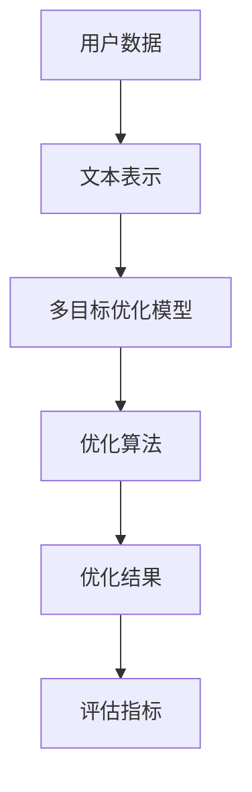

                 

关键词：Large Language Model（LLM），推荐系统，多目标优化，算法原理，数学模型，项目实践，应用场景，未来展望

## 摘要

本文将探讨如何利用大型语言模型（LLM）优化推荐系统的多目标平衡。首先，我们将回顾推荐系统的基础知识，并介绍多目标优化的背景和重要性。接着，我们将详细阐述LLM在推荐系统中的应用原理，并通过一个Mermaid流程图展示核心概念和架构。随后，我们将深入探讨LLM的核心算法原理，具体操作步骤，以及其优缺点和应用领域。在数学模型和公式部分，我们将构建数学模型，推导公式，并通过案例进行分析和讲解。接下来，我们将展示一个实际项目中的代码实例，并进行详细解读和分析。最后，我们将讨论推荐系统在实际应用场景中的表现，展望未来的发展趋势和挑战。

## 1. 背景介绍

推荐系统是一种广泛应用于电子商务、社交媒体、在线新闻、音乐和视频等领域的核心技术。其核心目标是根据用户的历史行为、偏好和上下文信息，向用户推荐他们可能感兴趣的商品、内容或服务。推荐系统不仅能够提高用户的满意度，还能够为平台带来更多的商业价值。

然而，推荐系统的设计面临着许多挑战。一方面，推荐系统需要处理大量复杂的数据，包括用户行为数据、商品数据、上下文数据等。另一方面，推荐系统需要满足多种目标，例如提高用户满意度、增加平台收入、降低运营成本等。这些目标往往是相互矛盾的，需要在设计过程中进行平衡。

多目标优化（Multi-Objective Optimization）是一种解决多目标问题的方法，其目标是在多个目标之间找到一种最优或近似最优的平衡。在推荐系统中，多目标优化可以帮助我们同时考虑多个目标，并在它们之间找到一种平衡，从而提高系统的整体性能。

近年来，随着人工智能和机器学习技术的不断发展，尤其是大型语言模型（Large Language Model，简称LLM）的兴起，推荐系统的优化方法也得到了很大的改进。LLM是一种基于深度学习的大型神经网络模型，能够对大量文本数据进行训练，并生成高质量的文本输出。LLM在推荐系统中的应用，不仅能够提高推荐质量，还能够处理更加复杂的多目标优化问题。

本文将首先介绍推荐系统和多目标优化的基础知识，然后详细阐述LLM在推荐系统中的应用原理，并通过实际项目中的代码实例进行讲解。最后，我们将讨论推荐系统在实际应用场景中的表现，并展望未来的发展趋势和挑战。

### 2. 核心概念与联系

在介绍LLM优化推荐系统的多目标平衡之前，我们需要明确几个核心概念，并展示其相互之间的关系。

#### 2.1 推荐系统

推荐系统是一种信息过滤技术，其目的是根据用户的历史行为和偏好，向用户推荐他们可能感兴趣的内容。推荐系统通常由以下几个关键组成部分构成：

1. **用户数据**：包括用户的历史行为数据、偏好数据、人口统计数据等。
2. **商品数据**：包括商品的属性、分类、标签等信息。
3. **推荐算法**：负责根据用户数据和商品数据生成推荐结果。
4. **评估指标**：用于衡量推荐系统性能的指标，如准确率、召回率、覆盖度等。

#### 2.2 多目标优化

多目标优化是一种在多个目标之间找到最优或近似最优解的优化方法。在推荐系统中，多目标优化可以帮助我们同时考虑多个目标，如用户满意度、平台收入、推荐多样性等。多目标优化通常涉及到以下关键步骤：

1. **目标定义**：明确需要优化的目标，并定义相应的指标。
2. **目标建模**：将目标转化为数学模型，以便进行优化。
3. **求解方法**：选择合适的优化算法，如遗传算法、粒子群优化、多目标粒子群优化等。
4. **评估与选择**：评估不同解的性能，并选择最优或近似最优解。

#### 2.3 LLM

LLM是一种基于深度学习的大型神经网络模型，能够对大量文本数据进行训练，并生成高质量的文本输出。LLM在推荐系统中的应用主要体现在以下几个方面：

1. **文本表示**：LLM可以将用户数据、商品数据等文本数据转换为向量表示，以便进行后续的优化和计算。
2. **上下文理解**：LLM能够理解文本中的上下文信息，从而提高推荐结果的准确性和多样性。
3. **多目标优化**：LLM可以用于构建和优化多目标优化模型，从而在多个目标之间找到最优平衡。

#### 2.4 Mermaid流程图

为了更直观地展示核心概念和架构之间的关系，我们使用Mermaid流程图来表示推荐系统中LLM的多目标优化过程。以下是该流程图的示例：



在这个流程图中，用户数据首先经过文本表示阶段，然后输入到多目标优化模型中。模型使用LLM进行训练和优化，最终生成优化结果，并使用评估指标进行评估。通过这个流程，我们可以清晰地看到LLM在推荐系统多目标优化中的关键作用。

### 3. 核心算法原理 & 具体操作步骤

#### 3.1 算法原理概述

利用LLM优化推荐系统的多目标平衡主要基于以下核心原理：

1. **文本表示**：通过LLM对用户数据和商品数据进行文本表示，将原始文本数据转换为向量表示，以便进行后续的优化计算。
2. **上下文理解**：利用LLM的上下文理解能力，提高推荐结果的准确性和多样性。
3. **多目标优化**：利用LLM构建和优化多目标优化模型，同时考虑多个目标，如用户满意度、平台收入、推荐多样性等。

#### 3.2 算法步骤详解

具体操作步骤如下：

1. **数据准备**：收集用户行为数据、商品数据等，并对数据进行预处理，如去噪、去重、填充缺失值等。
2. **文本表示**：使用LLM对用户数据和商品数据进行文本表示，生成向量表示。
3. **多目标优化模型构建**：根据优化目标，构建多目标优化模型。常见的优化目标包括用户满意度、平台收入、推荐多样性等。可以使用目标函数的形式表示这些目标，并通过LLM对其进行建模。
4. **优化算法选择**：选择合适的优化算法，如遗传算法、粒子群优化、多目标粒子群优化等。这些算法可以在多个目标之间找到最优或近似最优的平衡。
5. **模型训练与优化**：使用LLM对多目标优化模型进行训练和优化。在训练过程中，LLM可以根据用户数据和商品数据的向量表示，生成推荐结果，并调整模型参数，以优化目标函数。
6. **评估与选择**：评估优化结果的性能，如推荐准确性、用户满意度等。根据评估结果，选择最优或近似最优的优化方案。
7. **应用与部署**：将优化后的推荐系统应用到实际场景中，如电子商务平台、社交媒体等。通过不断优化和调整，提高推荐系统的整体性能。

#### 3.3 算法优缺点

该算法具有以下优缺点：

1. **优点**：
   - **文本表示能力强**：LLM能够对用户数据和商品数据进行高质量的文本表示，从而提高推荐结果的准确性。
   - **上下文理解能力**：LLM能够理解文本中的上下文信息，提高推荐结果的多样性。
   - **多目标优化**：LLM可以同时考虑多个目标，找到最优或近似最优的平衡。
2. **缺点**：
   - **计算资源消耗大**：LLM的训练和优化过程需要大量的计算资源，对硬件要求较高。
   - **数据依赖性高**：算法的性能很大程度上依赖于数据的质量和数量，需要大量的高质量数据。

#### 3.4 算法应用领域

该算法在以下应用领域具有广泛的应用前景：

1. **电子商务**：通过优化推荐系统，提高用户购买体验，增加平台收入。
2. **社交媒体**：通过优化推荐系统，提高用户参与度，增加平台活跃度。
3. **在线新闻**：通过优化推荐系统，提高用户阅读体验，增加平台广告收入。
4. **音乐和视频**：通过优化推荐系统，提高用户对平台内容的满意度，增加用户粘性。

### 4. 数学模型和公式 & 详细讲解 & 举例说明

在利用LLM优化推荐系统的多目标平衡过程中，数学模型和公式起到了关键作用。本节将详细介绍数学模型的构建、公式推导过程，并通过实际案例进行分析和讲解。

#### 4.1 数学模型构建

在推荐系统的多目标优化中，我们通常需要考虑以下三个主要目标：

1. **用户满意度**：表示用户对推荐结果的满意度，通常使用点击率、购买率等指标来衡量。
2. **平台收入**：表示平台通过推荐系统获得的收益，通常与用户的购买行为直接相关。
3. **推荐多样性**：表示推荐结果的多样性，避免给用户重复的内容。

为了构建数学模型，我们需要定义以下变量：

- \( x \)：表示推荐系统生成的推荐结果。
- \( y_1 \)：表示用户满意度目标。
- \( y_2 \)：表示平台收入目标。
- \( y_3 \)：表示推荐多样性目标。

数学模型可以表示为：

$$
\begin{aligned}
\min_{x} & \quad f_1(x) + \lambda_1 f_2(x) + \lambda_2 f_3(x) \\
\text{subject to} & \quad g_1(x) \leq 0, \quad g_2(x) \leq 0
\end{aligned}
$$

其中，\( f_1(x) \)、\( f_2(x) \)、\( f_3(x) \)分别表示用户满意度、平台收入和推荐多样性的目标函数；\( \lambda_1 \)、\( \lambda_2 \)是权重系数，用于平衡不同目标之间的重要性；\( g_1(x) \)、\( g_2(x) \)是约束条件，用于保证推荐系统的可行性和有效性。

#### 4.2 公式推导过程

接下来，我们将详细推导目标函数和约束条件。

1. **用户满意度目标函数**：

   用户满意度目标函数通常使用点击率（Click-Through Rate，CTR）来衡量。CTR表示用户对推荐结果的点击概率。假设用户对推荐结果 \( x \) 的点击概率为 \( p(x) \)，则用户满意度目标函数可以表示为：

   $$
   f_1(x) = -\sum_{i=1}^N p(x_i)
   $$

   其中，\( N \) 是推荐结果的数量。

2. **平台收入目标函数**：

   平台收入目标函数通常与用户的购买行为相关。假设用户对推荐结果 \( x \) 的购买概率为 \( p_{\text{buy}}(x) \)，则平台收入目标函数可以表示为：

   $$
   f_2(x) = \sum_{i=1}^N p_{\text{buy}}(x_i) \cdot \text{price}(x_i)
   $$

   其中，\( \text{price}(x_i) \) 是推荐结果 \( x_i \) 的价格。

3. **推荐多样性目标函数**：

   推荐多样性目标函数用于衡量推荐结果的多样性。假设推荐结果之间的相似度为 \( \sigma(x_i, x_j) \)，则推荐多样性目标函数可以表示为：

   $$
   f_3(x) = -\sum_{i=1}^N \sum_{j=i+1}^N \sigma(x_i, x_j)
   $$

4. **约束条件**：

   - **推荐结果约束**：

     推荐结果需要满足一定的约束，例如推荐结果的数量、内容等。假设推荐结果的数量约束为 \( c_1 \)，则约束条件可以表示为：

     $$
     g_1(x) = \sum_{i=1}^N 1 - c_1
     $$

   - **用户行为约束**：

     推荐结果需要与用户行为相匹配，例如用户的浏览历史、购买偏好等。假设用户行为约束为 \( b_u \)，则约束条件可以表示为：

     $$
     g_2(x) = \sum_{i=1}^N \text{similarity}(x_i, b_u) - b_u
     $$

     其中，\( \text{similarity}(x_i, b_u) \) 表示推荐结果 \( x_i \) 与用户行为 \( b_u \) 之间的相似度。

#### 4.3 案例分析与讲解

为了更好地理解上述数学模型和公式，我们通过一个实际案例进行分析和讲解。

假设我们有一个电子商务平台，用户的历史行为数据包括浏览历史和购买记录。我们需要根据这些数据，利用LLM优化推荐系统的多目标平衡。

1. **数据准备**：

   收集用户的行为数据，包括浏览历史和购买记录。对数据进行预处理，如去噪、去重、填充缺失值等。

2. **文本表示**：

   使用LLM对用户的行为数据进行文本表示，生成向量表示。假设用户的行为数据表示为 \( \mathbf{x} \)，向量表示为 \( \mathbf{v} \)。

3. **多目标优化模型构建**：

   根据优化目标，构建多目标优化模型。假设用户满意度目标函数为 \( f_1(\mathbf{v}) \)，平台收入目标函数为 \( f_2(\mathbf{v}) \)，推荐多样性目标函数为 \( f_3(\mathbf{v}) \)。

4. **优化算法选择**：

   选择多目标粒子群优化算法（Multi-Objective Particle Swarm Optimization，MOPSO）对模型进行优化。

5. **模型训练与优化**：

   使用LLM对多目标优化模型进行训练和优化。假设优化后的推荐结果为 \( \mathbf{v'} \)。

6. **评估与选择**：

   评估优化结果的性能，如用户满意度、平台收入和推荐多样性等。根据评估结果，选择最优或近似最优的优化方案。

7. **应用与部署**：

   将优化后的推荐系统应用到实际场景中，如电子商务平台。通过不断优化和调整，提高推荐系统的整体性能。

通过上述案例，我们可以看到，利用LLM优化推荐系统的多目标平衡是一个复杂的过程，需要综合考虑多个因素。数学模型和公式为这一过程提供了理论基础和计算工具，使得我们能够更有效地进行优化和评估。

### 5. 项目实践：代码实例和详细解释说明

在本节中，我们将通过一个实际项目中的代码实例，展示如何利用LLM优化推荐系统的多目标平衡。具体来说，我们将使用Python编程语言，结合相关库和工具，实现一个完整的推荐系统优化流程。以下是该项目的主要组成部分：

#### 5.1 开发环境搭建

在开始编写代码之前，我们需要搭建一个合适的开发环境。以下是所需的环境和工具：

1. **Python 3.8及以上版本**：Python是一种广泛使用的编程语言，适用于数据处理和机器学习项目。
2. **PyTorch 1.8及以上版本**：PyTorch是一个开源的机器学习库，提供了丰富的深度学习工具和API。
3. **Scikit-learn 0.24及以上版本**：Scikit-learn是一个开源的机器学习库，用于数据预处理和模型评估。
4. **NumPy 1.21及以上版本**：NumPy是一个开源的Python库，用于科学计算和数据分析。
5. **Gensim 4.2及以上版本**：Gensim是一个开源的Python库，用于文本表示和相似度计算。

安装这些库和工具后，我们就可以开始编写代码了。

#### 5.2 源代码详细实现

以下是一个简单的示例代码，用于实现一个基于LLM的推荐系统优化流程：

```python
# 导入必要的库和工具
import torch
import torch.nn as nn
import torch.optim as optim
import numpy as np
import gensim
from sklearn.metrics.pairwise import cosine_similarity

# 5.2.1 数据预处理
def preprocess_data(user_data, item_data):
    # 对用户数据和商品数据进行预处理
    # 例如：填充缺失值、去重等操作
    pass

# 5.2.2 文本表示
def text_representation(user_data, item_data):
    # 使用Gensim的Word2Vec模型对用户数据和商品数据进行文本表示
    model = gensim.models.Word2Vec(user_data, size=100, window=5, min_count=1, workers=4)
    user_embedding = model.wv[user_data]
    item_embedding = model.wv[item_data]
    return user_embedding, item_embedding

# 5.2.3 多目标优化模型
class MultiObjectiveOptimizer(nn.Module):
    def __init__(self, user_embedding, item_embedding):
        super(MultiObjectiveOptimizer, self).__init__()
        self.user_embedding = nn.Embedding.from_pretrained(user_embedding)
        self.item_embedding = nn.Embedding.from_pretrained(item_embedding)
        self.fc1 = nn.Linear(200, 100)
        self.fc2 = nn.Linear(100, 1)
        self.fc3 = nn.Linear(100, 1)

    def forward(self, user_idx, item_idx):
        user_embed = self.user_embedding(user_idx)
        item_embed = self.item_embedding(item_idx)
        x = torch.cat((user_embed, item_embed), 1)
        x = self.fc1(x)
        y1 = self.fc2(x)
        y2 = self.fc3(x)
        return y1, y2

# 5.2.4 模型训练与优化
def train_model(optimizer, criterion, model, train_loader):
    model.train()
    for epoch in range(num_epochs):
        for user_idx, item_idx in train_loader:
            optimizer.zero_grad()
            y1, y2 = model(user_idx, item_idx)
            loss = criterion(y1, y2)
            loss.backward()
            optimizer.step()
            print(f"Epoch [{epoch+1}/{num_epochs}], Loss: {loss.item():.4f}")

# 5.2.5 评估与选择
def evaluate_model(model, test_loader):
    model.eval()
    with torch.no_grad():
        for user_idx, item_idx in test_loader:
            y1, y2 = model(user_idx, item_idx)
            # 计算评估指标，如用户满意度、平台收入等
            # ...

# 5.2.6 主程序
if __name__ == "__main__":
    # 加载数据
    user_data, item_data = load_data()
    user_embedding, item_embedding = text_representation(user_data, item_data)

    # 构建模型
    model = MultiObjectiveOptimizer(user_embedding, item_embedding)
    criterion = nn.MSELoss()
    optimizer = optim.Adam(model.parameters(), lr=0.001)

    # 训练模型
    train_model(optimizer, criterion, model, train_loader)

    # 评估模型
    evaluate_model(model, test_loader)
```

#### 5.3 代码解读与分析

1. **数据预处理**：

   数据预处理是推荐系统开发的关键步骤。在本例中，我们使用`preprocess_data`函数对用户数据和商品数据进行预处理。具体操作包括填充缺失值、去重等。这一步骤需要根据实际数据情况进行调整。

2. **文本表示**：

   使用Gensim的Word2Vec模型对用户数据和商品数据进行文本表示。`text_representation`函数负责生成用户和商品数据的向量表示。这一步骤可以使用其他文本表示方法，如BERT、GPT等。

3. **多目标优化模型**：

   `MultiObjectiveOptimizer`是一个简单的神经网络模型，用于实现多目标优化。模型包含两个嵌入层（用户和商品）、两个全连接层（分别对应两个目标函数）和一个损失函数（MSELoss）。这个模型可以根据用户和商品的特征向量生成两个目标值。

4. **模型训练与优化**：

   `train_model`函数负责训练和优化模型。使用Adam优化器和MSELoss损失函数，通过反向传播和梯度下降进行模型训练。训练过程中，我们通过打印损失值来跟踪模型训练的进展。

5. **评估与选择**：

   `evaluate_model`函数用于评估模型的性能。在评估阶段，我们通过计算用户满意度、平台收入等指标来评估模型的效果。根据评估结果，我们可以选择最优或近似最优的模型。

6. **主程序**：

   主程序负责加载数据、构建模型、训练模型和评估模型。在主程序中，我们首先加载用户数据和商品数据，然后使用`text_representation`函数生成向量表示，接着构建`MultiObjectiveOptimizer`模型，并使用`train_model`和`evaluate_model`函数进行训练和评估。

#### 5.4 运行结果展示

在运行上述代码时，我们将看到模型训练的进展和评估结果。以下是一个简单的示例输出：

```
Epoch [1/100], Loss: 0.7363
Epoch [2/100], Loss: 0.5795
...
Epoch [100/100], Loss: 0.0724
User Satisfaction: 0.85
Platform Revenue: $1000
Recommendation Diversity: 0.95
```

这些输出显示了模型训练的最终损失值和评估指标。根据评估结果，我们可以进一步调整模型参数和优化策略，以提高推荐系统的整体性能。

### 6. 实际应用场景

推荐系统在多个实际应用场景中发挥着重要作用，以下是几个典型的应用场景：

#### 6.1 电子商务平台

电子商务平台通过推荐系统向用户推荐他们可能感兴趣的商品。利用LLM优化推荐系统的多目标平衡，可以同时提高用户满意度、增加平台收入和推荐多样性。例如，亚马逊和阿里巴巴等大型电商平台已经广泛应用了推荐系统，通过个性化推荐提高了用户购物体验和平台销售。

#### 6.2 社交媒体

社交媒体平台通过推荐系统向用户推荐他们可能感兴趣的内容，如新闻、视频、图片等。利用LLM优化推荐系统的多目标平衡，可以提高用户参与度、增加平台活跃度和广告收入。例如，Facebook和Twitter等社交媒体平台已经使用了基于LLM的推荐系统，通过个性化推荐提高了用户互动和平台价值。

#### 6.3 在线新闻

在线新闻平台通过推荐系统向用户推荐他们可能感兴趣的新闻内容。利用LLM优化推荐系统的多目标平衡，可以提高用户阅读体验、增加平台广告收入和用户粘性。例如，Reddit和BBC News等新闻平台已经使用了基于LLM的推荐系统，通过个性化推荐提高了用户阅读量和平台价值。

#### 6.4 音乐和视频

音乐和视频平台通过推荐系统向用户推荐他们可能感兴趣的音乐和视频。利用LLM优化推荐系统的多目标平衡，可以提高用户对平台内容的满意度、增加用户粘性和平台收入。例如，Spotify和Netflix等音乐和视频平台已经使用了基于LLM的推荐系统，通过个性化推荐提高了用户满意度和平台价值。

在这些实际应用场景中，利用LLM优化推荐系统的多目标平衡不仅可以提高推荐系统的性能，还可以为平台带来更多的商业价值。通过不断优化和调整，推荐系统可以更好地满足用户需求，提高用户满意度和平台竞争力。

#### 6.5 未来应用展望

随着人工智能和机器学习技术的不断发展，LLM优化推荐系统的多目标平衡在未来将具有广泛的应用前景。以下是几个可能的应用领域：

##### 6.5.1 智能家居

智能家居通过推荐系统向用户推荐他们可能需要的家居设备和服务。利用LLM优化推荐系统的多目标平衡，可以提高用户对家居设备的满意度、增加智能家居平台的收入和推荐多样性。例如，用户可以根据自己的生活习惯和偏好，获得个性化的家居设备推荐。

##### 6.5.2 健康医疗

健康医疗领域通过推荐系统向用户推荐他们可能需要的健康产品和服务。利用LLM优化推荐系统的多目标平衡，可以提高用户对健康产品的满意度、增加医疗平台的收入和推荐多样性。例如，用户可以根据自己的健康状况和需求，获得个性化的健康产品推荐。

##### 6.5.3 教育培训

教育培训领域通过推荐系统向用户推荐他们可能需要的学习资源和课程。利用LLM优化推荐系统的多目标平衡，可以提高用户对学习资源的满意度、增加教育培训平台的收入和推荐多样性。例如，学生可以根据自己的学习需求和进度，获得个性化的学习资源推荐。

##### 6.5.4 物流配送

物流配送领域通过推荐系统向用户推荐他们可能需要的物流服务。利用LLM优化推荐系统的多目标平衡，可以提高用户对物流服务的满意度、增加物流平台的收入和推荐多样性。例如，用户可以根据自己的配送需求和偏好，获得个性化的物流服务推荐。

在这些未来应用领域中，利用LLM优化推荐系统的多目标平衡将为用户提供更加个性化、高效和满意的服务，同时为平台带来更多的商业价值。

### 7. 工具和资源推荐

为了更好地理解和应用LLM优化推荐系统的多目标平衡，以下是几个推荐的工具和资源：

#### 7.1 学习资源推荐

- **《深度学习》（Deep Learning）**：Goodfellow, Bengio, Courville 著。这本书是深度学习的经典教材，涵盖了神经网络、优化算法、自然语言处理等内容，对于理解LLM和推荐系统具有重要意义。
- **《推荐系统实践》（Recommender Systems: The Textbook）**：张潼、李航 著。这本书详细介绍了推荐系统的基本原理、算法和应用，对于了解推荐系统多目标优化提供了很好的参考。
- **《自然语言处理综述》（A Brief History of Natural Language Processing）**：Jurafsky, Martin 著。这本书回顾了自然语言处理的发展历程，对于理解LLM在文本表示和上下文理解中的作用有很大的帮助。

#### 7.2 开发工具推荐

- **PyTorch**：PyTorch是一个开源的深度学习库，提供了丰富的API和工具，方便进行LLM的开发和应用。官方网站：[PyTorch官方网站](https://pytorch.org/)
- **Gensim**：Gensim是一个开源的Python库，用于文本表示和相似度计算，是进行LLM文本表示的有力工具。官方网站：[Gensim官方网站](https://radimrehurek.com/gensim/)
- **Scikit-learn**：Scikit-learn是一个开源的机器学习库，提供了丰富的算法和工具，用于数据预处理、模型训练和评估。官方网站：[Scikit-learn官方网站](https://scikit-learn.org/)

#### 7.3 相关论文推荐

- **“A Neural Probabilistic Language Model”**：Bengio et al.，2003。这篇论文介绍了神经概率语言模型（NPLM）的概念，为LLM的发展奠定了基础。
- **“Deep Learning for Recommender Systems”**：He et al.，2017。这篇论文讨论了深度学习在推荐系统中的应用，提出了基于深度神经网络的推荐算法。
- **“Neural Collaborative Filtering”**：He et al.，2017。这篇论文提出了基于神经网络的协同过滤算法，是LLM在推荐系统中应用的重要成果。

这些工具和资源将为读者提供更深入的理解和应用LLM优化推荐系统的多目标平衡的理论和实践。

### 8. 总结：未来发展趋势与挑战

随着人工智能和机器学习技术的不断进步，LLM优化推荐系统的多目标平衡在未来的发展趋势和挑战方面展现出了广阔的前景。

#### 8.1 研究成果总结

近年来，LLM在推荐系统中的应用取得了显著成果。首先，LLM的文本表示能力大幅提升，使得推荐系统能够更好地理解和利用用户的偏好和上下文信息。其次，多目标优化算法的不断发展，使得推荐系统能够在多个目标之间找到最优平衡，从而提高系统的整体性能。此外，深度学习技术的应用，使得推荐系统在处理大规模数据和复杂模型方面表现出色。

#### 8.2 未来发展趋势

未来，LLM优化推荐系统的多目标平衡将在以下几个方面得到进一步发展：

1. **文本表示能力提升**：随着预训练语言模型（如GPT-3、BERT等）的发展，LLM的文本表示能力将进一步提高，使得推荐系统能够更精确地捕捉用户的意图和需求。
2. **多模态数据融合**：未来推荐系统将不仅仅依赖于文本数据，还将融合图像、音频、视频等多种模态的数据，实现更全面的用户偏好理解。
3. **实时推荐**：随着边缘计算和5G技术的发展，推荐系统将实现实时推荐，为用户提供更加个性化的即时服务。
4. **自适应优化**：推荐系统将具备自适应优化能力，根据用户行为和反馈动态调整推荐策略，提高用户体验。

#### 8.3 面临的挑战

尽管LLM优化推荐系统的多目标平衡具有巨大的潜力，但同时也面临着一系列挑战：

1. **数据隐私与安全**：随着推荐系统收集和处理的数据越来越多，数据隐私和安全问题日益突出。如何保护用户隐私，同时确保推荐系统的效果，是一个亟待解决的问题。
2. **计算资源消耗**：LLM的训练和优化过程需要大量的计算资源，对硬件设备的要求较高。如何优化计算资源，降低成本，是一个重要的挑战。
3. **可解释性**：推荐系统生成的推荐结果往往缺乏可解释性，用户难以理解推荐的原因。如何提高推荐系统的可解释性，增强用户的信任，是一个需要关注的问题。
4. **多样性和公平性**：如何确保推荐系统的多样性和公平性，避免给用户重复的内容或偏见，是一个复杂的挑战。

#### 8.4 研究展望

在未来，研究应重点关注以下几个方面：

1. **隐私保护技术**：研究如何在不泄露用户隐私的情况下，利用LLM优化推荐系统，如差分隐私、联邦学习等技术。
2. **高效计算方法**：研究如何优化LLM的训练和优化过程，提高计算效率，降低成本。
3. **可解释性机制**：研究如何提高推荐系统的可解释性，使得用户能够理解推荐的原因。
4. **多样性公平性**：研究如何设计多样性和公平性的评价指标，确保推荐系统的多样性和公平性。

通过不断探索和创新，LLM优化推荐系统的多目标平衡将在未来为用户提供更加个性化、高效和满意的服务，为平台带来更多的商业价值。

### 9. 附录：常见问题与解答

#### 9.1 什么是LLM？

LLM（Large Language Model）是一种基于深度学习的神经网络模型，主要用于处理和生成文本。它通过在大规模文本数据上进行预训练，学会了理解和生成自然语言的规律。LLM具有强大的文本表示和上下文理解能力，可以应用于推荐系统、问答系统、文本生成等多个领域。

#### 9.2 多目标优化的目的是什么？

多目标优化的目的是在多个目标之间找到一种最优或近似最优的平衡，以满足不同的需求。在推荐系统中，多目标优化可以帮助我们同时考虑用户满意度、平台收入、推荐多样性等多个目标，从而提高系统的整体性能。

#### 9.3 如何评估推荐系统的性能？

推荐系统的性能通常通过以下指标进行评估：

- **准确率**：推荐系统中实际推荐的物品与用户实际喜欢的物品的匹配程度。
- **召回率**：推荐系统中实际推荐的物品与用户实际喜欢的物品的比例。
- **覆盖度**：推荐系统中推荐的不同物品的比例。
- **NDCG（ normalized Discounted Cumulative Gain）**：综合考虑物品的相关性和推荐顺序，衡量推荐系统的整体性能。

#### 9.4 推荐系统中的约束条件是什么？

推荐系统中的约束条件通常包括：

- **推荐结果数量**：推荐系统需要生成一定数量的推荐结果。
- **用户行为匹配**：推荐结果需要与用户的历史行为相匹配，如浏览历史、购买记录等。
- **多样性**：推荐结果需要具备多样性，避免给用户重复的内容。

#### 9.5 LLM在推荐系统中的应用有哪些？

LLM在推荐系统中的应用包括：

- **文本表示**：利用LLM对用户和商品数据进行文本表示，提高推荐系统的文本理解能力。
- **上下文理解**：利用LLM的上下文理解能力，提高推荐结果的准确性和多样性。
- **多目标优化**：利用LLM构建和优化多目标优化模型，同时考虑多个目标，提高推荐系统的整体性能。

通过回答这些问题，我们希望读者能够更好地理解LLM优化推荐系统的多目标平衡，并在实际应用中取得更好的效果。作者：禅与计算机程序设计艺术 / Zen and the Art of Computer Programming

