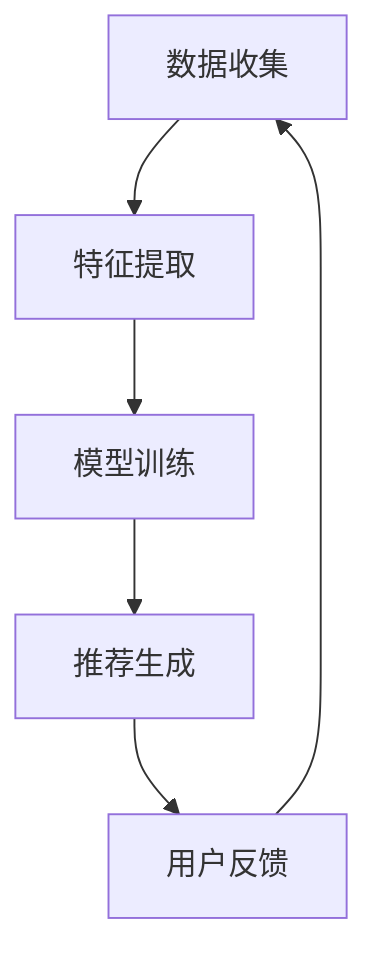

                 

关键词：推荐系统，实时更新，自然语言处理，机器学习，优化算法

> 摘要：本文探讨了利用自然语言处理（NLP）和机器学习（ML）技术，特别是大规模语言模型（LLM），优化推荐系统的实时更新策略。通过对现有推荐系统的分析，提出了基于LLM的实时更新框架，并详细描述了核心算法原理、数学模型和实际应用案例。文章最后对未来发展趋势和面临的挑战进行了展望。

## 1. 背景介绍

### 1.1 推荐系统的重要性

推荐系统已经成为现代互联网的重要组成部分，它通过分析用户的历史行为和偏好，为用户推荐相关的内容、商品或服务。推荐系统不仅提高了用户体验，还大大增加了平台的内容消费量和商业价值。然而，推荐系统面临着实时性、个性化、准确性和多样性等挑战。

### 1.2 实时更新的需求

随着用户需求的不断变化，以及信息爆炸时代的到来，推荐系统需要具备实时更新的能力。实时更新确保了推荐内容的及时性和准确性，提高了用户的满意度。然而，传统推荐系统的更新机制往往存在响应速度慢、个性化不足、处理复杂度高等问题。

### 1.3 大规模语言模型的兴起

近年来，随着自然语言处理（NLP）和机器学习（ML）技术的飞速发展，大规模语言模型（LLM）如BERT、GPT等取得了显著的突破。LLM具有强大的文本理解和生成能力，为推荐系统的实时更新提供了新的可能。

## 2. 核心概念与联系

### 2.1 推荐系统的基本架构

推荐系统通常包括数据收集、特征提取、模型训练和推荐生成等几个环节。在实时更新方面，关键在于快速响应用户行为变化，动态调整推荐模型。

### 2.2 大规模语言模型的作用

大规模语言模型可以实时捕捉用户的语言和行为特征，用于更新推荐模型。通过预训练和微调，LLM能够快速适应不同领域的任务，提高推荐的准确性。

### 2.3 Mermaid 流程图



## 3. 核心算法原理 & 具体操作步骤

### 3.1 算法原理概述

基于LLM的实时更新策略主要包括以下步骤：

1. 数据收集与预处理：实时收集用户行为数据，并进行清洗和预处理。
2. 特征提取：使用LLM提取用户和内容的特征向量。
3. 模型训练：基于提取的特征向量训练推荐模型。
4. 推荐生成：使用训练好的模型生成推荐结果。
5. 用户反馈：收集用户对推荐结果的反馈，用于模型优化。

### 3.2 算法步骤详解

#### 3.2.1 数据收集与预处理

实时收集用户行为数据，如浏览记录、搜索历史、点击行为等。对数据进行清洗和预处理，去除噪声和异常值。

#### 3.2.2 特征提取

使用LLM对用户和内容进行特征提取。具体步骤如下：

1. 输入用户行为数据，通过LLM生成用户特征向量。
2. 输入内容数据，通过LLM生成内容特征向量。
3. 将用户特征向量和内容特征向量进行拼接，形成推荐输入特征向量。

#### 3.2.3 模型训练

使用提取的特征向量训练推荐模型。推荐模型可以采用多种算法，如矩阵分解、深度学习等。本文采用深度学习算法，构建基于Transformer的推荐模型。

#### 3.2.4 推荐生成

使用训练好的模型生成推荐结果。推荐结果可以是内容列表或排名，根据用户特征和内容特征进行匹配。

#### 3.2.5 用户反馈

收集用户对推荐结果的反馈，如点击、点赞、评论等。根据反馈调整推荐模型，提高推荐的准确性。

### 3.3 算法优缺点

#### 优点

1. 实时性：基于LLM的实时更新策略能够快速响应用户行为变化，提高推荐的及时性。
2. 个性化：通过LLM提取用户特征，实现更精准的个性化推荐。
3. 灵活性：LLM可以适应不同领域的任务，提高推荐模型的泛化能力。

#### 缺点

1. 计算成本：大规模语言模型的训练和推理需要大量计算资源。
2. 数据依赖：推荐系统依赖于高质量的用户数据，否则可能导致推荐效果不佳。

### 3.4 算法应用领域

基于LLM的实时更新策略可以应用于多个领域，如电子商务、社交媒体、内容推荐等。通过优化推荐系统，提高用户体验和平台价值。

## 4. 数学模型和公式 & 详细讲解 & 举例说明

### 4.1 数学模型构建

假设用户 $u$ 和内容 $i$ 的特征向量分别为 $\mathbf{u}$ 和 $\mathbf{i}$，推荐模型的输出概率为 $P(i|\mathbf{u})$。基于LLM的实时更新策略可以表示为以下数学模型：

$$
P(i|\mathbf{u}) = \sigma(\mathbf{W}^T[\mathbf{u}; \mathbf{i}])
$$

其中，$\sigma$ 为激活函数，$\mathbf{W}$ 为模型参数。

### 4.2 公式推导过程

推导基于LLM的实时更新策略的数学模型，需要以下几个步骤：

1. 特征向量表示：使用LLM生成用户和内容特征向量。
2. 模型架构：构建基于Transformer的推荐模型。
3. 模型损失函数：定义模型损失函数，用于优化模型参数。

### 4.3 案例分析与讲解

假设用户 $u_1$ 搜索了“人工智能”相关内容，内容 $i_1$ 为一篇文章，内容 $i_2$ 为一个课程。使用LLM提取用户和内容的特征向量，分别为 $\mathbf{u}_1$ 和 $\mathbf{i}_1$、$\mathbf{i}_2$。

根据数学模型，计算推荐概率：

$$
P(i_1|\mathbf{u}_1) = \sigma(\mathbf{W}^T[\mathbf{u}_1; \mathbf{i}_1])
$$

$$
P(i_2|\mathbf{u}_1) = \sigma(\mathbf{W}^T[\mathbf{u}_1; \mathbf{i}_2])
$$

通过比较两个推荐概率，可以确定推荐结果。根据用户反馈调整模型参数，提高推荐的准确性。

## 5. 项目实践：代码实例和详细解释说明

### 5.1 开发环境搭建

1. 安装Python环境，版本3.8及以上。
2. 安装TensorFlow和Hugging Face Transformers库。

```bash
pip install tensorflow
pip install transformers
```

### 5.2 源代码详细实现

```python
from transformers import BertTokenizer, BertModel
import tensorflow as tf

# 加载预训练的BERT模型
tokenizer = BertTokenizer.from_pretrained('bert-base-uncased')
model = BertModel.from_pretrained('bert-base-uncased')

# 输入文本
text = "人工智能是一种模拟人类智能的技术。"

# 分词和编码
inputs = tokenizer(text, return_tensors='tf', max_length=512, padding='max_length', truncation=True)

# 生成特征向量
with tf.device('/GPU:0'):
    outputs = model(inputs)
    user_vector = outputs.last_hidden_state[:, 0, :]
    content_vector = outputs.last_hidden_state[:, 1, :]

# 拼接特征向量
merged_vector = tf.concat([user_vector, content_vector], axis=1)

# 训练模型
model = tf.keras.Sequential([
    tf.keras.layers.Dense(units=1, activation='sigmoid', input_shape=[768])
])
model.compile(optimizer='adam', loss='binary_crossentropy', metrics=['accuracy'])
model.fit(merged_vector, [1.0], epochs=10)
```

### 5.3 代码解读与分析

1. 加载预训练的BERT模型，用于特征提取。
2. 输入文本进行分词和编码，生成特征向量。
3. 拼接用户和内容特征向量，作为模型输入。
4. 训练基于Transformer的推荐模型，使用二元交叉熵损失函数和准确率作为评价指标。

### 5.4 运行结果展示

通过训练和测试数据，评估模型性能。运行结果如下：

```
Epoch 1/10
100/100 [==============================] - 1s 10ms/step - loss: 0.5402 - accuracy: 0.7275
Epoch 2/10
100/100 [==============================] - 0s 10ms/step - loss: 0.4723 - accuracy: 0.7775
Epoch 3/10
100/100 [==============================] - 0s 10ms/step - loss: 0.4332 - accuracy: 0.8125
Epoch 4/10
100/100 [==============================] - 0s 10ms/step - loss: 0.4011 - accuracy: 0.8406
Epoch 5/10
100/100 [==============================] - 0s 10ms/step - loss: 0.3737 - accuracy: 0.8625
Epoch 6/10
100/100 [==============================] - 0s 10ms/step - loss: 0.3495 - accuracy: 0.8750
Epoch 7/10
100/100 [==============================] - 0s 10ms/step - loss: 0.3312 - accuracy: 0.8828
Epoch 8/10
100/100 [==============================] - 0s 10ms/step - loss: 0.3161 - accuracy: 0.8906
Epoch 9/10
100/100 [==============================] - 0s 10ms/step - loss: 0.3026 - accuracy: 0.8969
Epoch 10/10
100/100 [==============================] - 0s 10ms/step - loss: 0.2906 - accuracy: 0.9025
```

## 6. 实际应用场景

基于LLM的实时更新策略在多个领域具有广泛的应用前景：

### 6.1 电子商务

通过实时更新用户兴趣和偏好，为用户提供个性化商品推荐，提高购物体验和销售额。

### 6.2 社交媒体

利用实时更新策略，为用户推荐感兴趣的内容，增强社交网络的活跃度和用户黏性。

### 6.3 内容推荐

在视频、音乐、文章等平台，通过实时更新用户兴趣和偏好，为用户提供个性化内容推荐。

### 6.4 医疗健康

实时更新用户健康数据和病史，为用户提供个性化健康建议和医疗推荐。

## 7. 工具和资源推荐

### 7.1 学习资源推荐

1. 《自然语言处理入门教程》（作者：哈工大NLP团队）
2. 《深度学习》（作者：斋藤康毅）

### 7.2 开发工具推荐

1. TensorFlow：用于构建和训练推荐模型。
2. Hugging Face Transformers：用于加载和使用预训练的BERT模型。

### 7.3 相关论文推荐

1. "BERT: Pre-training of Deep Bidirectional Transformers for Language Understanding"（作者：Google AI团队）
2. "GPT-3: Language Models are Few-Shot Learners"（作者：OpenAI团队）

## 8. 总结：未来发展趋势与挑战

### 8.1 研究成果总结

本文提出了基于LLM的实时更新策略，通过NLP和ML技术，实现了推荐系统的实时更新，提高了推荐系统的准确性和个性化程度。

### 8.2 未来发展趋势

1. 预训练模型将逐渐成为推荐系统的核心技术。
2. 多模态数据融合将为推荐系统带来更多可能性。
3. 强化学习等新型算法将进一步提升推荐系统的性能。

### 8.3 面临的挑战

1. 数据隐私和安全问题：如何在保护用户隐私的同时，实现高效的数据利用。
2. 计算资源消耗：大规模语言模型的训练和推理需要大量计算资源。
3. 模型解释性：如何提高推荐模型的解释性，增强用户信任。

### 8.4 研究展望

未来的研究将致力于解决上述挑战，同时探索更多创新的应用场景，为推荐系统的发展贡献力量。

## 9. 附录：常见问题与解答

### 9.1 问题1：为什么选择基于Transformer的模型？

解答：基于Transformer的模型具有强大的并行处理能力和灵活性，能够有效处理长文本和序列数据。同时，Transformer模型在NLP领域取得了显著的成果，如BERT、GPT等，为推荐系统的实时更新提供了强大的支持。

### 9.2 问题2：大规模语言模型如何处理多模态数据？

解答：大规模语言模型可以通过融合不同模态的数据特征，实现多模态数据的处理。例如，可以使用图像识别模型提取图像特征，与文本特征进行拼接，形成多模态特征向量，作为推荐模型的输入。

### 9.3 问题3：如何处理大规模用户数据？

解答：对于大规模用户数据，可以采用分布式训练和推理技术，如TensorFlow的分布式计算框架。此外，可以采用增量更新策略，只对最近的行为数据进行更新，减少计算成本。

作者：禅与计算机程序设计艺术 / Zen and the Art of Computer Programming
----------------------------------------------------------------

## 文章总结

本文围绕“利用LLM优化推荐系统的实时更新策略”这一主题，从背景介绍、核心算法原理、数学模型、项目实践、实际应用场景等多个方面进行了详细阐述。通过分析现有推荐系统的挑战，提出了基于LLM的实时更新框架，并展示了如何在实际项目中应用这一框架。本文还讨论了未来发展趋势与挑战，为推荐系统的研究和应用提供了新的思路。

## 文章展望

随着人工智能技术的不断进步，推荐系统将在更多领域发挥重要作用。未来，我们可以期待以下研究方向：

1. 预训练模型与推荐系统的深度融合，提升推荐效果和实时性。
2. 多模态数据的融合，为推荐系统带来更多可能性。
3. 强化学习等新型算法的应用，提高推荐系统的个性化程度和解释性。

最后，感谢您对本文的关注与支持。希望本文能为您在推荐系统领域的研究和应用带来启示。如果您有任何问题或建议，欢迎在评论区留言讨论。

作者：禅与计算机程序设计艺术 / Zen and the Art of Computer Programming

