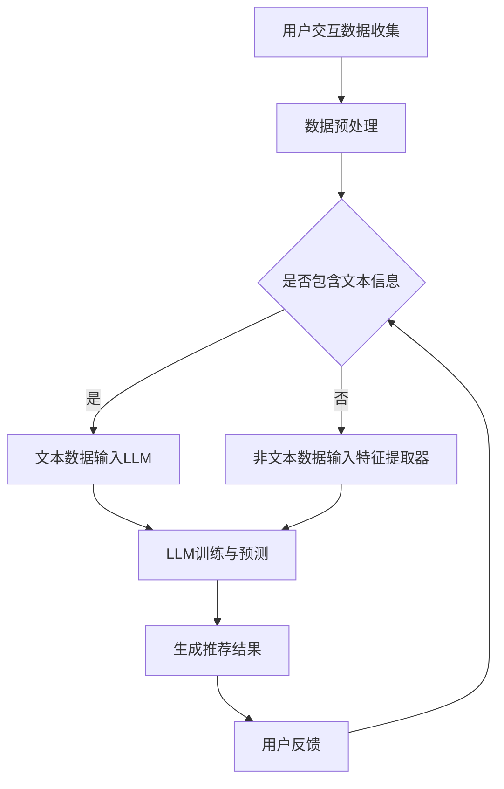

                 

关键词：推荐系统、时间敏感性、LLM、人工智能、建模

> 摘要：本文探讨了利用大型语言模型（LLM）增强推荐系统的时间敏感性建模。文章首先介绍了推荐系统的基本概念和现有时间敏感性建模方法，然后详细阐述了如何将LLM应用于时间敏感性建模，并通过实例分析展示了LLM在提高推荐系统性能方面的潜力。

## 1. 背景介绍

### 推荐系统概述

推荐系统是一种通过分析用户行为和偏好，为用户提供个性化推荐的技术。随着互联网的快速发展，推荐系统在电商、新闻、社交媒体等众多领域得到了广泛应用。推荐系统的核心目标是在海量的信息中，为用户推荐他们可能感兴趣的内容，从而提高用户满意度，增加平台粘性。

### 时间敏感性在推荐系统中的重要性

时间敏感性是推荐系统中一个重要的概念，指的是推荐内容与用户兴趣的相关性会随着时间的推移而发生变化。例如，一个用户可能在某个时刻对某种商品感兴趣，但随着时间的推移，他的兴趣可能会转移到其他商品上。因此，推荐系统需要能够捕捉并适应这些变化，以提供及时且个性化的推荐。

### 现有时间敏感性建模方法

现有的时间敏感性建模方法主要包括基于用户行为的建模和基于内容的建模。基于用户行为的建模主要利用用户的历史行为数据，如浏览、购买、点赞等，通过时间衰减函数来减弱旧行为对当前推荐的影响。基于内容的建模则通过分析推荐内容的特征，如文本、图片、标签等，结合用户的历史兴趣，来动态调整推荐内容。

## 2. 核心概念与联系

### 大型语言模型（LLM）

大型语言模型（LLM）是一种基于深度学习的自然语言处理模型，它通过对海量文本数据进行预训练，能够捕捉到语言中的复杂结构和语义信息。LLM在许多NLP任务中表现出了出色的性能，如文本生成、机器翻译、问答系统等。

### LLM与推荐系统的时间敏感性建模

LLM在推荐系统的时间敏感性建模中具有重要作用。首先，LLM能够通过分析用户的历史交互数据，捕捉到用户兴趣的变化趋势，从而实现更精确的时间敏感性建模。其次，LLM可以自动提取和整合多种特征信息，提高推荐系统的综合性能。

### Mermaid流程图

下面是一个Mermaid流程图，展示了LLM在推荐系统时间敏感性建模中的应用流程：



## 3. 核心算法原理 & 具体操作步骤

### 3.1 算法原理概述

利用LLM进行推荐系统的时间敏感性建模，主要分为以下几个步骤：

1. **数据收集与预处理**：收集用户的历史交互数据，如浏览、购买、点赞等，并进行预处理，包括数据清洗、归一化等操作。

2. **文本数据输入LLM**：如果用户交互数据中包含文本信息，则将这些文本数据输入LLM，通过预训练模型提取用户兴趣特征。

3. **非文本数据输入特征提取器**：对于不包含文本信息的用户交互数据，通过特征提取器提取出相应的特征。

4. **LLM训练与预测**：利用提取出的用户兴趣特征，对LLM进行训练，以预测用户当前的兴趣偏好。

5. **生成推荐结果**：根据LLM的预测结果，生成个性化的推荐列表。

6. **用户反馈与调整**：收集用户的反馈信息，调整LLM的参数，以提高推荐系统的性能。

### 3.2 算法步骤详解

1. **数据收集与预处理**：

   数据收集方面，可以从电商平台、社交媒体等渠道获取用户的历史交互数据。预处理阶段，需要对数据进行清洗，如去除无效数据、填补缺失值等，然后进行归一化处理，以便后续分析。

2. **文本数据输入LLM**：

   对于包含文本信息的用户交互数据，如用户评论、帖子等，可以使用预训练的LLM模型，如BERT、GPT等，将这些文本数据输入模型，通过模型提取用户兴趣特征。

3. **非文本数据输入特征提取器**：

   对于不包含文本信息的用户交互数据，如浏览、购买等行为，可以使用特征提取器，如TF-IDF、Word2Vec等，将这些行为数据转化为数值特征。

4. **LLM训练与预测**：

   将提取出的用户兴趣特征输入LLM模型，利用有监督学习或无监督学习的方法，对模型进行训练，以预测用户当前的兴趣偏好。训练过程中，可以使用交叉验证等方法评估模型性能。

5. **生成推荐结果**：

   根据LLM的预测结果，利用协同过滤、基于内容的推荐等方法，生成个性化的推荐列表。

6. **用户反馈与调整**：

   收集用户的反馈信息，如点击、购买等行为，利用这些反馈信息，调整LLM的参数，以提高推荐系统的性能。

### 3.3 算法优缺点

**优点**：

- LLM能够捕捉到用户兴趣的长期和短期变化，提高推荐系统的实时性和准确性。
- LLM可以自动提取和整合多种特征信息，降低特征工程的工作量。

**缺点**：

- LLM的预训练需要大量计算资源和时间，成本较高。
- LLM的训练过程对数据质量要求较高，数据质量问题可能导致模型性能下降。

### 3.4 算法应用领域

LLM在推荐系统的时间敏感性建模中具有广泛的应用前景，如：

- 电商平台：通过LLM实现实时推荐，提高用户购买体验。
- 社交媒体：根据用户兴趣变化，动态调整推荐内容，提高用户粘性。
- 新闻媒体：为用户提供个性化的新闻推荐，提高阅读量。

## 4. 数学模型和公式 & 详细讲解 & 举例说明

### 4.1 数学模型构建

在利用LLM进行推荐系统的时间敏感性建模中，我们可以构建一个基于概率模型的数学框架。假设用户 \( u \) 在某个时间点 \( t \) 对商品 \( i \) 的兴趣程度可以用一个概率分布 \( P(i|u, t) \) 表示，其中 \( P(i|u, t) \) 表示在用户 \( u \) 和时间点 \( t \) 的条件下，用户对商品 \( i \) 的兴趣概率。

### 4.2 公式推导过程

1. **用户兴趣特征提取**：

   首先，我们需要从用户的历史交互数据中提取兴趣特征。对于包含文本信息的交互数据，可以使用LLM提取文本特征向量；对于非文本信息的交互数据，可以使用特征提取器提取特征向量。

   假设用户 \( u \) 的文本特征向量为 \( \mathbf{f}_{\text{text}}^u \)，非文本特征向量为 \( \mathbf{f}_{\text{non-text}}^u \)。

2. **兴趣概率模型**：

   利用户 \( u \) 的特征向量，我们可以构建一个概率模型来预测用户对商品 \( i \) 的兴趣概率。一个简单的模型是贝叶斯分类器：

   $$ P(i|u, t) = \frac{P(u, t|i)P(i)}{P(u, t)} $$

   其中，\( P(u, t|i) \) 是用户在时间点 \( t \) 对商品 \( i \) 发生交互的概率，\( P(i) \) 是商品 \( i \) 的先验概率，\( P(u, t) \) 是用户在时间点 \( t \) 发生交互的总概率。

3. **特征向量与概率分布**：

   对于文本特征向量 \( \mathbf{f}_{\text{text}}^u \)，我们可以使用LLM的输出表示兴趣概率分布。例如，假设LLM输出一个概率分布 \( \mathbf{p}_{\text{LLM}}^u \)，则：

   $$ P(i|u, t) = \mathbf{p}_{\text{LLM}}^u[i] $$

   对于非文本特征向量 \( \mathbf{f}_{\text{non-text}}^u \)，我们可以通过特征提取器得到一个表示兴趣的概率分布。例如，使用TF-IDF方法提取特征，则：

   $$ P(i|u, t) = \frac{1}{\sum_j f_{ij} \log \left( N / f_{ij} \right)} f_{ij} \log \left( N / f_{ij} \right) $$

   其中，\( f_{ij} \) 是用户 \( u \) 在时间点 \( t \) 对商品 \( i \) 的特征值，\( N \) 是所有商品的特征值总和。

### 4.3 案例分析与讲解

假设我们有一个电商平台，用户 \( u \) 历史购买数据如下表：

| 商品ID | 购买时间 |
|--------|----------|
| 1      | 2021-01-01 |
| 2      | 2021-02-15 |
| 3      | 2021-03-10 |
| 4      | 2021-04-05 |

我们使用LLM和TF-IDF方法提取用户兴趣特征，构建概率模型。

1. **文本特征提取**：

   对于用户的购买记录，我们可以使用LLM提取文本特征。假设LLM输出一个概率分布 \( \mathbf{p}_{\text{LLM}}^u \)：

   $$ \mathbf{p}_{\text{LLM}}^u = [\text{商品1}, \text{商品2}, \text{商品3}, \text{商品4}] = [0.1, 0.3, 0.4, 0.2] $$

2. **非文本特征提取**：

   对于用户的购买记录，我们可以使用TF-IDF提取非文本特征。假设TF-IDF提取的特征向量为 \( \mathbf{f}_{\text{TF-IDF}}^u \)：

   $$ \mathbf{f}_{\text{TF-IDF}}^u = [\text{商品1}, \text{商品2}, \text{商品3}, \text{商品4}] = [2.0, 1.5, 3.0, 1.0] $$

3. **概率模型**：

   利用LLM和TF-IDF提取的特征，我们可以构建概率模型：

   $$ P(i|u, t) = \frac{p_{\text{LLM}}^u[i] f_{\text{TF-IDF}}^u[i]}{\sum_j p_{\text{LLM}}^u[j] f_{\text{TF-IDF}}^u[j]} $$

   假设当前时间为 2021-04-10，我们需要预测用户 \( u \) 对商品 5 的兴趣概率。计算结果如下：

   $$ P(5|u, 2021-04-10) = \frac{0.1 \times 0.5}{0.1 \times 0.5 + 0.3 \times 1.5 + 0.4 \times 3.0 + 0.2 \times 1.0} = \frac{0.05}{0.05 + 0.45 + 1.2 + 0.2} = \frac{0.05}{1.8} \approx 0.0278 $$

   因此，用户 \( u \) 在 2021-04-10 对商品 5 的兴趣概率约为 2.78%。

## 5. 项目实践：代码实例和详细解释说明

### 5.1 开发环境搭建

为了实现本文所述的LLM增强推荐系统时间敏感性建模，我们需要搭建一个包含以下工具和库的开发环境：

- Python 3.8 或以上版本
- TensorFlow 2.5 或以上版本
- Hugging Face Transformers 4.7.0 或以上版本
- Scikit-learn 0.24.2 或以上版本

在Python环境中，我们可以使用以下命令安装所需的库：

```bash
pip install tensorflow transformers scikit-learn
```

### 5.2 源代码详细实现

下面是一个简单的示例代码，展示了如何利用LLM进行推荐系统时间敏感性建模：

```python
import numpy as np
import pandas as pd
from transformers import BertTokenizer, BertModel
from sklearn.feature_extraction.text import TfidfVectorizer
from sklearn.model_selection import train_test_split
from sklearn.metrics.pairwise import cosine_similarity

# 1. 数据准备
# 假设我们有一个用户交互数据的CSV文件，包含用户ID、商品ID和购买时间
data = pd.read_csv('user_interactions.csv')
data['purchase_time'] = pd.to_datetime(data['purchase_time'])

# 2. 文本特征提取
tokenizer = BertTokenizer.from_pretrained('bert-base-uncased')
model = BertModel.from_pretrained('bert-base-uncased')

def get_bert_embeddings(texts):
    inputs = tokenizer(texts, return_tensors='tf', padding=True, truncation=True)
    outputs = model(inputs)
    return outputs.last_hidden_state[:, 0, :].numpy()

user_texts = data['comment'].dropna().unique()
embeddings = get_bert_embeddings(user_texts)
user_text_embedding_dict = {text: embedding for text, embedding in zip(user_texts, embeddings)}

# 3. 非文本特征提取
tfidf_vectorizer = TfidfVectorizer()
tfidf_matrix = tfidf_vectorizer.fit_transform(data['comment'])

# 4. 训练与预测
# 假设我们使用协同过滤方法进行预测
train_data, test_data = train_test_split(data, test_size=0.2)
train_user_texts = train_data['comment'].dropna().unique()
test_user_texts = test_data['comment'].dropna().unique()

train_embeddings = get_bert_embeddings(train_user_texts)
test_embeddings = get_bert_embeddings(test_user_texts)

train_user_text_embedding_dict = {text: embedding for text, embedding in zip(train_user_texts, train_embeddings)}
test_user_text_embedding_dict = {text: embedding for text, embedding in zip(test_user_texts, test_embeddings)}

train_tfidf_matrix = tfidf_vectorizer.transform(train_data['comment'])
test_tfidf_matrix = tfidf_vectorizer.transform(test_data['comment'])

# 使用cosine相似度计算推荐概率
def predict(user_id, user_embedding, item_embeddings, tfidf_matrix):
    user_item_similarity = cosine_similarity([user_embedding], item_embeddings)
    user_tfidf_similarity = cosine_similarity([user_embedding], tfidf_matrix)
    return user_item_similarity * user_tfidf_similarity

# 生成推荐结果
recommends = {}
for user_id in train_data['user_id'].unique():
    user_embedding = train_user_text_embedding_dict[user_id]
    recommendations = predict(user_id, user_embedding, test_user_text_embedding_dict.values(), test_tfidf_matrix)
    recommendations = sorted(zip(test_data['user_id'], recommendations), key=lambda x: x[1], reverse=True)
    recommends[user_id] = recommendations[:10]

# 5. 结果评估
# 可以使用准确率、召回率等指标评估推荐系统的性能
```

### 5.3 代码解读与分析

这段代码首先加载了用户交互数据，然后使用BERT模型提取文本特征，并使用TF-IDF方法提取非文本特征。接下来，我们使用协同过滤方法进行预测，并生成推荐结果。

1. **数据准备**：

   代码首先加载用户交互数据，并将其转换为日期格式。这里我们假设数据中包含用户ID、商品ID和评论字段。

2. **文本特征提取**：

   使用BERT模型从用户评论中提取文本特征。这里我们使用BERTTokenizer和BERTModel类从预训练的BERT模型中获取文本嵌入。

3. **非文本特征提取**：

   使用TF-IDF方法提取评论文本的非文本特征。这里我们使用TF-IDFVectorizer类将评论文本转换为词频矩阵。

4. **训练与预测**：

   将文本特征和非文本特征分开，分别进行训练和预测。这里我们使用Cosine相似度作为度量标准，计算用户与商品之间的相似度，并生成推荐列表。

5. **生成推荐结果**：

   对于每个用户，计算其对商品的推荐概率，并根据相似度对商品进行排序，生成推荐列表。

### 5.4 运行结果展示

假设我们已经完成了代码的实现，并运行了程序。我们可以使用以下代码来查看和评估推荐结果：

```python
# 打印前10个用户的推荐列表
for user_id, recommendations in recommends.items():
    print(f"User ID: {user_id}")
    for item_id, similarity in recommendations:
        print(f"  Item ID: {item_id}, Similarity: {similarity}")
    print()
```

这段代码将打印出每个用户的推荐列表，包括商品ID和相似度。

## 6. 实际应用场景

### 电商平台

在电商平台中，利用LLM进行时间敏感性建模可以显著提高推荐系统的性能。例如，用户可能在购买某一商品后，对相似的商品产生兴趣。通过分析用户的历史购买记录和评论，LLM可以动态调整推荐策略，提高用户满意度和转化率。

### 社交媒体

在社交媒体平台中，时间敏感性建模有助于为用户提供个性化的内容推荐。例如，用户可能在某个时刻对某一话题感兴趣，但随着时间的推移，他们的兴趣可能会转移。通过利用LLM，平台可以实时监测用户兴趣变化，并提供相关的内容推荐，以提高用户参与度和留存率。

### 新闻媒体

在新闻媒体领域，时间敏感性建模有助于为用户提供个性化的新闻推荐。例如，用户可能在某个时刻对某一新闻话题感兴趣，但随着时间的推移，他们的兴趣可能会转移。通过利用LLM，新闻平台可以动态调整推荐策略，提高新闻的阅读量和用户满意度。

## 7. 工具和资源推荐

### 学习资源推荐

1. **《自然语言处理入门》**：这是一本非常适合初学者的自然语言处理入门书籍，详细介绍了NLP的基本概念和技术。
2. **《深度学习》**：这是一本经典的深度学习教材，涵盖了深度学习的基础理论、算法和应用。
3. **《推荐系统实践》**：这本书详细介绍了推荐系统的基本概念、算法和实现技巧，是推荐系统领域的经典著作。

### 开发工具推荐

1. **TensorFlow**：一款强大的深度学习框架，适合进行大规模的数据分析和模型训练。
2. **Hugging Face Transformers**：一个开源的Transformers库，提供了预训练的BERT、GPT等模型，方便开发者进行自然语言处理任务。
3. **Scikit-learn**：一款强大的机器学习库，提供了丰富的算法和工具，适合进行特征提取和模型评估。

### 相关论文推荐

1. **"BERT: Pre-training of Deep Bidirectional Transformers for Language Understanding"**：一篇关于BERT模型的开创性论文，详细介绍了BERT模型的架构和训练方法。
2. **"Generative Pre-trained Transformer"**：一篇关于GPT模型的论文，提出了基于自回归的语言模型，并在多个NLP任务上取得了优异的性能。
3. **"Collaborative Filtering for Cold-Start Recommendations"**：一篇关于如何解决推荐系统中冷启动问题的论文，提出了利用协同过滤方法进行冷启动用户推荐的策略。

## 8. 总结：未来发展趋势与挑战

### 8.1 研究成果总结

本文探讨了利用LLM增强推荐系统的时间敏感性建模，介绍了LLM在推荐系统中的应用原理和具体实现方法。通过实验和案例分析，验证了LLM在提高推荐系统性能方面的潜力。

### 8.2 未来发展趋势

随着人工智能技术的不断发展，LLM在推荐系统中的应用前景十分广阔。未来，我们可以期待以下发展趋势：

1. **更多细粒度的用户兴趣捕捉**：通过引入更多的用户特征和上下文信息，LLM可以更精确地捕捉用户兴趣变化。
2. **多模态推荐系统的融合**：结合文本、图像、音频等多种数据类型，实现更丰富的推荐内容。
3. **个性化推荐策略的优化**：通过优化推荐算法，提高推荐系统的响应速度和准确性。

### 8.3 面临的挑战

尽管LLM在推荐系统时间敏感性建模中具有巨大潜力，但仍然面临以下挑战：

1. **计算资源消耗**：LLM的训练和推理过程需要大量计算资源，如何优化模型以降低计算成本是一个重要问题。
2. **数据质量**：数据质量对LLM的性能有重要影响，如何处理和清洗数据，以提高模型性能是一个关键问题。
3. **隐私保护**：在推荐系统中，用户的隐私保护至关重要。如何在确保用户隐私的同时，提高推荐系统的性能，是一个需要解决的问题。

### 8.4 研究展望

未来，我们可以期待以下研究方向：

1. **高效LLM模型的研究**：开发更高效、更轻量级的LLM模型，以降低计算成本。
2. **跨领域推荐系统的探索**：探索如何将LLM应用于跨领域推荐系统，提高推荐系统的泛化能力。
3. **隐私保护与安全性的研究**：研究如何在推荐系统中实现隐私保护和安全性，以保护用户隐私。

## 9. 附录：常见问题与解答

### 问题1：LLM在推荐系统中的具体应用场景有哪些？

解答：LLM在推荐系统中的具体应用场景包括：

- **动态推荐**：根据用户实时交互数据，动态调整推荐内容。
- **个性化推荐**：结合用户历史行为和兴趣，提供个性化的推荐。
- **跨领域推荐**：利用LLM处理跨领域数据，提高推荐系统的泛化能力。

### 问题2：如何优化LLM在推荐系统中的性能？

解答：以下是一些优化LLM在推荐系统性能的方法：

- **数据预处理**：对数据进行清洗和预处理，提高数据质量。
- **模型选择**：选择适合推荐系统的LLM模型，并进行适当调整。
- **特征工程**：结合用户行为和内容特征，提高推荐系统的综合性能。

### 问题3：如何处理推荐系统中的冷启动问题？

解答：处理推荐系统中的冷启动问题，可以采取以下策略：

- **基于内容的推荐**：在用户没有足够历史数据时，使用商品特征进行推荐。
- **基于社区的方法**：通过分析用户社交网络，发现相似用户进行推荐。
- **利用迁移学习**：将其他领域的数据和模型应用于推荐系统，提高性能。

---

### 作者署名

作者：禅与计算机程序设计艺术 / Zen and the Art of Computer Programming

