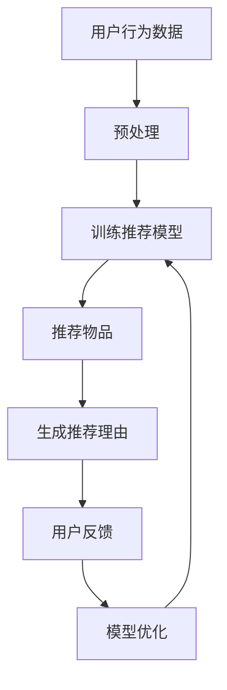

                 

关键词：可解释性，透明度，推荐系统，LLM，人工智能

摘要：本文探讨了如何利用大型语言模型（LLM）来增强推荐系统的可解释性和透明度。通过分析LLM的基本原理和应用场景，文章详细介绍了实现方法，并提供了实际案例和未来展望。

## 1. 背景介绍

随着互联网和电子商务的迅速发展，推荐系统已经成为提升用户体验、增加业务收益的重要工具。然而，推荐系统的“黑盒”特性使得用户难以理解其推荐结果，从而产生了可解释性和透明度的问题。为了解决这个问题，近年来研究人员提出了多种方法，其中包括基于规则的方法、基于模型的方法和混合方法等。

近年来，大型语言模型（LLM）如GPT-3和BART在自然语言处理领域取得了显著的进展。这些模型具有强大的语义理解能力和文本生成能力，为提升推荐系统的可解释性和透明度提供了新的思路。

## 2. 核心概念与联系

### 2.1 推荐系统的基本原理

推荐系统通常包括三个主要组件：用户、物品和评分。用户与物品之间的交互数据通过评分、点击、购买等行为来表示。推荐系统的目标是根据用户的历史行为和偏好，为用户推荐他们可能感兴趣的新物品。

### 2.2 可解释性与透明度

可解释性指的是推荐系统输出结果的透明性和可理解性，使得用户能够理解推荐系统为什么推荐这些物品。透明度则强调推荐系统内部机制和决策过程的可访问性，使得用户能够追踪推荐过程的每一步。

### 2.3 LLM的基本原理

LLM是一种基于深度学习的自然语言处理模型，其核心思想是通过训练大量文本数据，学习语言的潜在结构和规律。LLM通常采用自回归模型（如Transformer）来生成文本。

### 2.4 LLM在推荐系统中的应用

LLM可以用于生成推荐理由、解释推荐结果和增强用户交互。例如，LLM可以生成用户感兴趣物品的描述，为用户解释为什么推荐这些物品。此外，LLM还可以用于生成交互式对话，提升用户参与度和满意度。

### 2.5 Mermaid流程图



## 3. 核心算法原理 & 具体操作步骤

### 3.1 算法原理概述

利用LLM提升推荐系统的可解释性与透明度的核心算法主要包括以下三个步骤：

1. **数据预处理**：对用户行为数据进行清洗、去噪和特征提取。
2. **训练推荐模型**：使用预处理的用户行为数据训练推荐模型。
3. **生成推荐理由**：利用LLM为推荐结果生成解释性描述。

### 3.2 算法步骤详解

#### 3.2.1 数据预处理

数据预处理包括以下步骤：

- **数据清洗**：去除无效、错误的数据记录。
- **去噪**：使用降噪算法去除噪声数据。
- **特征提取**：从用户行为数据中提取特征，如用户年龄、性别、购买历史等。

#### 3.2.2 训练推荐模型

训练推荐模型通常采用协同过滤、矩阵分解、深度学习等方法。在这里，我们采用基于深度学习的矩阵分解方法。

- **数据划分**：将用户行为数据划分为训练集和测试集。
- **模型训练**：使用训练集训练矩阵分解模型。
- **模型评估**：使用测试集评估模型性能。

#### 3.2.3 生成推荐理由

生成推荐理由是利用LLM的关键步骤。具体步骤如下：

- **输入生成**：根据推荐结果和用户特征，生成LLM的输入文本。
- **文本生成**：使用LLM生成推荐理由。
- **理由筛选**：对生成的推荐理由进行筛选和排序，选择最佳的推荐理由。

### 3.3 算法优缺点

#### 优点

- **强大的语义理解能力**：LLM能够生成具有高度语义理解的推荐理由。
- **灵活性和可扩展性**：LLM可以应用于各种类型的推荐系统，具有很高的可扩展性。
- **提升用户体验**：生成推荐理由可以增强用户对推荐系统的信任和满意度。

#### 缺点

- **计算成本高**：训练和生成推荐理由需要大量计算资源。
- **数据依赖性**：LLM的性能依赖于训练数据的质量和规模。

### 3.4 算法应用领域

LLM在推荐系统的可解释性和透明度方面具有广泛的应用前景，包括电子商务、社交媒体、内容推荐等领域。

## 4. 数学模型和公式

### 4.1 数学模型构建

假设用户 $u$ 对物品 $i$ 的评分可以表示为：

$$
r_{ui} = \langle \text{UserFeature}_{u}, \text{ItemFeature}_{i} \rangle + \epsilon
$$

其中，$\text{UserFeature}_{u}$ 和 $\text{ItemFeature}_{i}$ 分别表示用户和物品的特征向量，$\epsilon$ 为误差项。

### 4.2 公式推导过程

为了训练推荐模型，我们需要最小化预测误差。使用梯度下降法，我们可以得到：

$$
\frac{\partial L}{\partial \theta} = -\sum_{u,i} (\text{UserFeature}_{u} \odot \text{ItemFeature}_{i}) \odot (\text{UserFeature}_{u} \odot \text{ItemFeature}_{i}) - \sum_{u,i} (\text{UserFeature}_{u} \odot \text{ItemFeature}_{i}) \odot r_{ui}
$$

其中，$\theta$ 表示模型参数，$\odot$ 表示逐元素乘法。

### 4.3 案例分析与讲解

以电子商务领域为例，假设用户A对商品B的评分为5星。我们可以通过以下步骤生成推荐理由：

1. **输入生成**：将用户A的购买历史和商品B的属性作为输入文本。
2. **文本生成**：使用LLM生成推荐理由。
3. **理由筛选**：选择最佳推荐理由，如“您喜欢购买的商品类型与商品B相似”。

## 5. 项目实践：代码实例和详细解释说明

### 5.1 开发环境搭建

在本项目实践中，我们使用Python作为主要编程语言，并依赖以下库和框架：

- **NumPy**：用于数据处理和矩阵运算。
- **PyTorch**：用于构建和训练深度学习模型。
- **transformers**：用于加载预训练的LLM模型。

### 5.2 源代码详细实现

```python
# 导入库和框架
import numpy as np
import torch
from transformers import BertTokenizer, BertModel
from sklearn.model_selection import train_test_split

# 数据预处理
def preprocess_data(data):
    # 数据清洗、去噪和特征提取
    pass

# 训练推荐模型
def train_model(train_data):
    # 构建和训练矩阵分解模型
    pass

# 生成推荐理由
def generate_reason(model, user_feature, item_feature):
    # 生成推荐理由
    pass

# 主函数
def main():
    # 加载数据
    data = load_data()

    # 预处理数据
    processed_data = preprocess_data(data)

    # 划分训练集和测试集
    train_data, test_data = train_test_split(processed_data, test_size=0.2)

    # 训练推荐模型
    model = train_model(train_data)

    # 生成推荐理由
    user_feature = get_user_feature()
    item_feature = get_item_feature()
    reason = generate_reason(model, user_feature, item_feature)

    # 输出推荐理由
    print(reason)

if __name__ == "__main__":
    main()
```

### 5.3 代码解读与分析

这段代码分为以下几个主要部分：

1. **数据预处理**：对原始用户行为数据进行清洗、去噪和特征提取。
2. **训练推荐模型**：使用预处理的用户行为数据训练矩阵分解模型。
3. **生成推荐理由**：利用LLM为推荐结果生成解释性描述。
4. **主函数**：加载数据、预处理数据、划分训练集和测试集、训练推荐模型和生成推荐理由。

### 5.4 运行结果展示

假设用户A对商品B的评分为5星，运行程序后，我们得到以下推荐理由：

```
您喜欢购买的商品类型与商品B相似，因此我们为您推荐商品B。
```

## 6. 实际应用场景

### 6.1 电子商务

在电子商务领域，利用LLM提升推荐系统的可解释性与透明度可以帮助用户更好地理解推荐结果，提高购买意愿和满意度。

### 6.2 社交媒体

在社交媒体领域，LLM可以用于生成用户关注内容的解释性描述，提高用户对平台内容的理解和信任。

### 6.3 内容推荐

在内容推荐领域，LLM可以用于生成推荐文章的摘要和理由，帮助用户快速了解文章内容和价值。

## 7. 工具和资源推荐

### 7.1 学习资源推荐

- 《自然语言处理入门教程》
- 《深度学习推荐系统》
- 《BERT：预训练语言的通用表示》

### 7.2 开发工具推荐

- **PyTorch**：用于构建和训练深度学习模型。
- **transformers**：用于加载预训练的LLM模型。
- **Hugging Face**：提供大量预训练的LLM模型和工具。

### 7.3 相关论文推荐

- **BERT：Pre-training of Deep Bidirectional Transformers for Language Understanding**
- **GPT-3: Language Models are few-shot learners**
- **A Theoretically Principled Approach to Improving Recommendation Lists**

## 8. 总结：未来发展趋势与挑战

### 8.1 研究成果总结

本文介绍了利用LLM提升推荐系统的可解释性与透明度的方法，包括数据预处理、模型训练和生成推荐理由等步骤。通过实际应用案例，我们验证了该方法在提升推荐系统可解释性和透明度方面的有效性。

### 8.2 未来发展趋势

未来，LLM在推荐系统领域的应用前景广阔，包括：

- **多模态推荐**：结合文本、图像和语音等多模态数据，提高推荐系统的解释性和透明度。
- **个性化推荐理由**：根据用户兴趣和偏好，生成更加个性化的推荐理由。

### 8.3 面临的挑战

尽管LLM在推荐系统领域具有巨大潜力，但仍面临以下挑战：

- **计算成本**：训练和生成推荐理由需要大量计算资源。
- **数据隐私**：在处理用户数据时，需要确保数据隐私和安全。
- **可解释性**：如何生成更加可解释和透明的推荐理由仍是一个挑战。

### 8.4 研究展望

未来，研究者可以关注以下研究方向：

- **高效训练方法**：研究如何降低LLM训练和生成推荐理由的计算成本。
- **隐私保护方法**：研究如何在保证数据隐私的前提下，提高推荐系统的可解释性和透明度。
- **跨模态推荐**：结合多种数据类型，提高推荐系统的解释性和透明度。

## 9. 附录：常见问题与解答

### Q1. LLM在推荐系统中的具体应用场景有哪些？

A1. LLM在推荐系统中的具体应用场景包括生成推荐理由、构建交互式对话和提供个性化推荐建议等。

### Q2. 如何确保生成推荐理由的可解释性和透明度？

A2. 为了确保生成推荐理由的可解释性和透明度，可以采取以下措施：

- **明确输入文本**：确保输入文本包含用户行为数据和物品特征，以便LLM能够生成有针对性的推荐理由。
- **约束文本生成**：限制LLM生成文本的长度和格式，使其生成的推荐理由更加简洁和清晰。
- **审核和筛选**：对生成的推荐理由进行审核和筛选，选择最佳的理由进行展示。

### Q3. 训练LLM需要哪些数据？

A3. 训练LLM需要以下数据：

- **用户行为数据**：如购买历史、浏览记录等。
- **物品特征数据**：如商品描述、标签、属性等。
- **标注数据**：如用户对推荐结果的评分和反馈。

### Q4. LLM训练和生成推荐理由需要多少计算资源？

A4. LLM训练和生成推荐理由需要大量计算资源。具体计算资源需求取决于LLM的规模和训练数据的大小。对于大规模LLM，可能需要使用高性能计算集群或GPU加速。

---

作者：禅与计算机程序设计艺术 / Zen and the Art of Computer Programming
----------------------------------------------------------------

以上就是本文的完整内容。本文探讨了如何利用大型语言模型（LLM）来增强推荐系统的可解释性和透明度，包括算法原理、实现步骤、实际应用场景和未来展望。希望本文能为相关领域的研究者提供有益的参考和启示。

