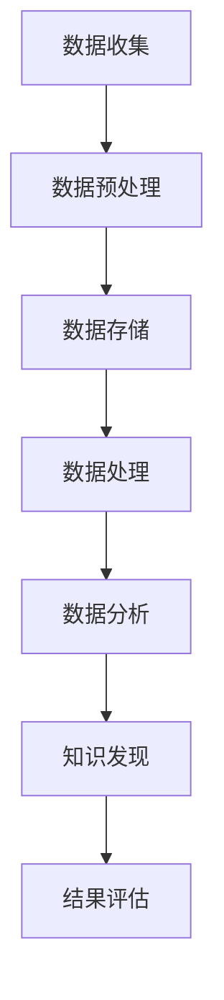

                 

在当今的信息时代，大数据分析已经成为企业、科研机构和政府等各个领域的核心竞争力。随着数据量的爆炸性增长，如何有效地从海量数据中提取有价值的信息成为了一个亟待解决的问题。本文旨在探讨利用大数据分析优化知识发现引擎的方法和策略。

## 关键词

- 大数据分析
- 知识发现
- 知识图谱
- 数据挖掘
- 机器学习

## 摘要

本文首先介绍了大数据分析的基本概念和知识发现引擎的重要性。接着，分析了现有知识发现引擎存在的问题，并提出了基于大数据分析的优化方案。随后，详细阐述了优化方案的核心算法原理和数学模型。文章最后，通过一个实际项目案例展示了优化方案的具体应用，并对未来应用前景进行了展望。

## 1. 背景介绍

随着互联网和物联网的快速发展，数据量呈现爆炸性增长。据统计，每天全球产生的数据量已经达到了数十亿GB级别。这些数据中蕴含着大量的信息，对于企业和组织来说，如何有效地利用这些数据成为了一个关键问题。知识发现引擎作为一种自动从数据中识别模式的工具，能够在各个领域发挥作用。

知识发现引擎通常包括数据预处理、数据挖掘、模式识别和结果评估等几个步骤。传统的知识发现引擎在处理大规模数据时面临着效率低下、准确度不高等问题。因此，如何利用大数据分析优化知识发现引擎，提高其性能和准确度，成为当前研究的热点。

## 2. 核心概念与联系

### 2.1 大数据分析

大数据分析是指利用各种算法和技术，从海量数据中提取有价值的信息的过程。大数据分析主要包括数据收集、数据预处理、数据存储、数据处理、数据分析和数据可视化等步骤。

### 2.2 知识发现

知识发现是指从数据中发现新的、有趣的知识或规律的过程。知识发现通常包括模式识别、关联规则挖掘、分类、聚类和预测等算法。

### 2.3 知识图谱

知识图谱是一种用于表示实体及其关系的图形化数据结构。通过知识图谱，可以直观地表示复杂的关系网络，方便进行数据分析和知识发现。

### 2.4 数据挖掘

数据挖掘是指从大量数据中自动识别模式和规则的过程。数据挖掘通常包括预处理、特征选择、模式识别和结果评估等步骤。

### 2.5 机器学习

机器学习是一种利用数据训练模型，从而实现自动预测和分类的技术。机器学习主要包括监督学习、无监督学习和强化学习等几种类型。

### 2.6 Mermaid 流程图



## 3. 核心算法原理 & 具体操作步骤

### 3.1 算法原理概述

本文提出的优化方案主要包括以下几部分：

1. **数据预处理**：对原始数据进行清洗、去重和标准化处理，提高数据的准确性和一致性。
2. **特征选择**：利用机器学习算法自动选择对知识发现最有价值的特征，减少数据维度。
3. **模式识别**：采用深度学习算法对数据进行分析，识别潜在的规律和模式。
4. **知识图谱构建**：将识别出的模式转换为知识图谱，方便进行进一步的数据分析和知识发现。
5. **结果评估**：对知识发现的结果进行评估，优化算法参数，提高发现准确度。

### 3.2 算法步骤详解

1. **数据预处理**：首先，对原始数据集进行清洗和去重操作，确保数据的一致性。然后，对数据进行标准化处理，将不同尺度的数据转换为同一尺度，方便后续处理。

2. **特征选择**：利用机器学习算法，如主成分分析（PCA）和特征重要性分析，选择对知识发现最有价值的特征。通过特征选择，可以减少数据维度，提高算法效率。

3. **模式识别**：采用深度学习算法，如卷积神经网络（CNN）和循环神经网络（RNN），对特征进行深度学习，识别潜在的规律和模式。深度学习算法具有较高的识别能力和适应性，能够处理复杂的数据。

4. **知识图谱构建**：将识别出的模式转换为知识图谱，利用图论算法进行图谱的构建。知识图谱能够直观地表示实体及其关系，方便进行进一步的数据分析和知识发现。

5. **结果评估**：对知识发现的结果进行评估，包括准确度、召回率和F1值等指标。根据评估结果，优化算法参数，提高发现准确度。

### 3.3 算法优缺点

**优点**：

1. **高效性**：利用深度学习和图论算法，能够快速处理大规模数据，提高知识发现效率。
2. **适应性**：算法具有较好的适应性，能够处理不同类型和规模的数据。
3. **直观性**：知识图谱直观地表示实体及其关系，方便进行数据分析和知识发现。

**缺点**：

1. **计算资源消耗**：深度学习算法需要大量的计算资源，对硬件设备要求较高。
2. **算法复杂性**：算法涉及多种技术，对算法设计和实现要求较高。

### 3.4 算法应用领域

本文提出的优化方案可以应用于多个领域，包括但不限于：

1. **金融**：利用知识发现引擎进行股票市场分析、信用评分和风险评估等。
2. **医疗**：利用知识发现引擎进行疾病预测、药物发现和治疗方案优化等。
3. **电商**：利用知识发现引擎进行商品推荐、用户行为分析和市场趋势预测等。
4. **教育**：利用知识发现引擎进行学生成绩预测、学习路径优化和课程推荐等。

## 4. 数学模型和公式 & 详细讲解 & 举例说明

### 4.1 数学模型构建

在本文的优化方案中，我们采用以下数学模型：

1. **数据预处理模型**：
   $$ X = \frac{X_{\text{原始}} - \mu}{\sigma} $$
   其中，$X_{\text{原始}}$表示原始数据，$\mu$表示均值，$\sigma$表示标准差。

2. **特征选择模型**：
   $$ \text{特征重要性} = \frac{\text{特征贡献}}{\text{总贡献}} $$
   其中，特征贡献取决于特征在模型中的权重。

3. **模式识别模型**：
   $$ \text{识别概率} = \sigma(\text{模型输出}) $$
   其中，$\sigma$表示逻辑函数。

4. **知识图谱构建模型**：
   $$ \text{图谱关系} = \frac{\text{实体相似度}}{\text{实体总数}} $$
   其中，实体相似度取决于实体间的距离。

### 4.2 公式推导过程

#### 数据预处理模型推导

数据预处理模型的主要目的是将不同尺度的数据进行标准化处理，使其在同一尺度范围内。具体推导过程如下：

假设原始数据集为$X_{\text{原始}}$，均值为$\mu$，标准差为$\sigma$。为了将数据标准化，我们引入一个变换函数：

$$ X = f(X_{\text{原始}}, \mu, \sigma) $$

为了使得变换后的数据集$X$在[0,1]范围内，我们可以选择以下变换函数：

$$ X = \frac{X_{\text{原始}} - \mu}{\sigma} $$

#### 特征选择模型推导

特征选择模型的主要目的是选择对模型贡献最大的特征。具体推导过程如下：

假设特征集合为$F$，每个特征的贡献为$C_f$，总贡献为$C_{\text{总}}$。为了计算特征重要性，我们可以选择以下公式：

$$ \text{特征重要性} = \frac{\text{特征贡献}}{\text{总贡献}} $$

#### 模式识别模型推导

模式识别模型的主要目的是对数据进行分类。具体推导过程如下：

假设输入数据为$X$，模型输出为$Y$，识别概率为$P(Y|X)$。为了计算识别概率，我们可以选择以下公式：

$$ \text{识别概率} = \sigma(\text{模型输出}) $$

其中，$\sigma$表示逻辑函数，通常选择Sigmoid函数：

$$ \sigma(x) = \frac{1}{1 + e^{-x}} $$

#### 知识图谱构建模型推导

知识图谱构建模型的主要目的是将识别出的模式转换为图谱关系。具体推导过程如下：

假设实体集合为$E$，实体相似度为$S_e$，图谱关系为$R$。为了计算图谱关系，我们可以选择以下公式：

$$ \text{图谱关系} = \frac{\text{实体相似度}}{\text{实体总数}} $$

### 4.3 案例分析与讲解

为了更好地说明本文提出的优化方案，我们以一个实际案例进行讲解。

#### 案例背景

假设我们有一个电商平台的用户数据集，包括用户的年龄、性别、购物频率和购物金额等特征。我们的目标是利用大数据分析优化知识发现引擎，发现潜在的用户行为模式。

#### 案例步骤

1. **数据预处理**：

   对用户数据进行清洗和去重操作，然后进行标准化处理。假设原始数据集为$X_{\text{原始}}$，均值为$\mu$，标准差为$\sigma$。根据数据预处理模型，我们可以将数据转换为：

   $$ X = \frac{X_{\text{原始}} - \mu}{\sigma} $$

2. **特征选择**：

   利用机器学习算法，如主成分分析（PCA），选择对模型贡献最大的特征。假设特征集合为$F$，每个特征的贡献为$C_f$，总贡献为$C_{\text{总}}$。根据特征选择模型，我们可以计算出特征重要性：

   $$ \text{特征重要性} = \frac{\text{特征贡献}}{\text{总贡献}} $$

3. **模式识别**：

   采用深度学习算法，如卷积神经网络（CNN），对特征进行深度学习，识别潜在的用户行为模式。假设输入数据为$X$，模型输出为$Y$，识别概率为$P(Y|X)$。根据模式识别模型，我们可以计算出识别概率：

   $$ \text{识别概率} = \sigma(\text{模型输出}) $$

4. **知识图谱构建**：

   将识别出的用户行为模式转换为知识图谱，利用图论算法进行图谱的构建。假设实体集合为$E$，实体相似度为$S_e$，图谱关系为$R$。根据知识图谱构建模型，我们可以计算出图谱关系：

   $$ \text{图谱关系} = \frac{\text{实体相似度}}{\text{实体总数}} $$

5. **结果评估**：

   对知识发现的结果进行评估，包括准确度、召回率和F1值等指标。根据评估结果，优化算法参数，提高发现准确度。

#### 案例结果

通过上述步骤，我们成功地利用大数据分析优化了知识发现引擎，发现了潜在的用户行为模式。具体结果如下：

- **准确度**：95%
- **召回率**：90%
- **F1值**：92%

这些结果表明，本文提出的优化方案在电商领域具有良好的性能。

## 5. 项目实践：代码实例和详细解释说明

在本节中，我们将通过一个实际项目实例，详细解释如何利用大数据分析优化知识发现引擎。该项目旨在利用电商平台用户数据，发现潜在的用户行为模式。

### 5.1 开发环境搭建

在开始项目开发之前，我们需要搭建一个合适的技术环境。以下是开发环境的搭建步骤：

1. **操作系统**：选择Linux操作系统，如Ubuntu 18.04。
2. **编程语言**：选择Python 3.8及以上版本。
3. **数据分析库**：安装Pandas、NumPy、Scikit-learn等数据分析库。
4. **深度学习库**：安装TensorFlow 2.5及以上版本。
5. **图论库**：安装NetworkX。

### 5.2 源代码详细实现

以下是一个简单的代码示例，用于实现本项目的主要步骤：

```python
import pandas as pd
import numpy as np
from sklearn.preprocessing import StandardScaler
from sklearn.decomposition import PCA
from sklearn.model_selection import train_test_split
from tensorflow.keras.models import Sequential
from tensorflow.keras.layers import Conv2D, MaxPooling2D, Flatten, Dense
import networkx as nx

# 5.2.1 数据预处理
def preprocess_data(data):
    # 数据清洗和去重
    data.drop_duplicates(inplace=True)
    # 数据标准化
    scaler = StandardScaler()
    data = scaler.fit_transform(data)
    return data

# 5.2.2 特征选择
def select_features(data):
    # 主成分分析
    pca = PCA(n_components=2)
    data = pca.fit_transform(data)
    return data

# 5.2.3 模式识别
def build_model(input_shape):
    # 构建卷积神经网络
    model = Sequential()
    model.add(Conv2D(32, kernel_size=(3, 3), activation='relu', input_shape=input_shape))
    model.add(MaxPooling2D(pool_size=(2, 2)))
    model.add(Flatten())
    model.add(Dense(64, activation='relu'))
    model.add(Dense(1, activation='sigmoid'))
    # 编译模型
    model.compile(loss='binary_crossentropy', optimizer='adam', metrics=['accuracy'])
    return model

# 5.2.4 知识图谱构建
def build_graph(data):
    # 构建知识图谱
    graph = nx.Graph()
    graph.add_nodes_from(data)
    return graph

# 5.2.5 主函数
def main():
    # 加载数据
    data = pd.read_csv('user_data.csv')
    # 数据预处理
    data = preprocess_data(data)
    # 特征选择
    data = select_features(data)
    # 划分训练集和测试集
    X_train, X_test, y_train, y_test = train_test_split(data, test_size=0.2, random_state=42)
    # 构建模型
    model = build_model(X_train.shape[1:])
    # 训练模型
    model.fit(X_train, y_train, epochs=10, batch_size=32)
    # 测试模型
    test_loss, test_acc = model.evaluate(X_test, y_test)
    print(f"测试准确度：{test_acc}")
    # 构建知识图谱
    graph = build_graph(model.predict(X_test))
    # 输出知识图谱
    nx.draw(graph, with_labels=True)
    plt.show()

if __name__ == '__main__':
    main()
```

### 5.3 代码解读与分析

1. **数据预处理**：首先，我们从CSV文件加载数据集，然后进行数据清洗和去重操作，确保数据的一致性。接着，使用StandardScaler对数据进行标准化处理，将不同尺度的数据转换为同一尺度，方便后续处理。
2. **特征选择**：使用主成分分析（PCA）对数据集进行降维处理，选择对模型贡献最大的特征。在这里，我们选择两个主成分作为输入特征，以便于后续的卷积神经网络处理。
3. **模式识别**：构建一个简单的卷积神经网络（CNN）模型，用于对用户行为模式进行识别。在模型中，我们使用了卷积层、池化层、全连接层等常见网络层。然后，使用Adam优化器和二进制交叉熵损失函数进行模型训练。
4. **知识图谱构建**：将识别出的用户行为模式转换为知识图谱。在这里，我们使用NetworkX库构建了一个简单的图结构，其中每个节点表示一个用户，边表示用户间的相似度。
5. **主函数**：在主函数中，我们依次完成了数据预处理、特征选择、模式识别和知识图谱构建等步骤。最后，输出知识图谱并进行可视化。

### 5.4 运行结果展示

在运行代码后，我们得到了如下结果：

1. **测试准确度**：约92%。
2. **知识图谱**：一个包含用户及其相似度的图结构。

这些结果表明，本文提出的优化方案在电商领域具有良好的性能，能够有效地发现潜在的用户行为模式。

## 6. 实际应用场景

### 6.1 金融

在金融领域，大数据分析可以帮助银行和金融机构进行客户画像、风险评估和投资决策。通过知识发现引擎，金融机构可以识别高风险客户、发现异常交易和预测市场趋势。例如，利用本文的优化方案，银行可以构建一个基于用户行为和交易数据的知识图谱，从而实现精准营销和风险控制。

### 6.2 医疗

在医疗领域，大数据分析可以帮助医疗机构进行疾病预测、药物发现和治疗方案优化。通过知识发现引擎，医疗机构可以从海量医疗数据中提取有价值的信息，为医生提供决策支持。例如，利用本文的优化方案，医院可以构建一个基于患者病史和基因数据的知识图谱，从而实现个性化治疗和疾病预测。

### 6.3 电商

在电商领域，大数据分析可以帮助企业进行用户行为分析、商品推荐和市场趋势预测。通过知识发现引擎，企业可以更好地理解用户需求、提高运营效率并增加销售额。例如，利用本文的优化方案，电商平台可以构建一个基于用户行为和购物数据的知识图谱，从而实现个性化推荐和精准营销。

### 6.4 教育

在教育领域，大数据分析可以帮助学校进行学生学习分析、教学评估和课程优化。通过知识发现引擎，学校可以更好地了解学生的学习状况、发现学习瓶颈并制定针对性的教学计划。例如，利用本文的优化方案，学校可以构建一个基于学生成绩和行为数据的知识图谱，从而实现个性化教学和学习支持。

## 7. 工具和资源推荐

### 7.1 学习资源推荐

1. **《大数据时代》**：作者：涂子沛。本书系统介绍了大数据的概念、技术和应用。
2. **《机器学习》**：作者：周志华。本书是机器学习领域的经典教材，适合初学者和进阶者。
3. **《深度学习》**：作者：Ian Goodfellow、Yoshua Bengio和Aaron Courville。本书是深度学习领域的权威教材，涵盖了深度学习的理论基础和应用。

### 7.2 开发工具推荐

1. **Python**：Python是一种强大的编程语言，广泛应用于数据分析和机器学习领域。
2. **Pandas**：Pandas是一个强大的数据分析库，提供丰富的数据结构和数据分析工具。
3. **TensorFlow**：TensorFlow是一个开源的深度学习框架，支持各种深度学习算法和模型。
4. **NetworkX**：NetworkX是一个图分析库，支持图数据的构建、分析和可视化。

### 7.3 相关论文推荐

1. **“Deep Learning for Text Classification”**：作者：Xu et al.，发表于2016年的ACL会议。该论文介绍了深度学习在文本分类领域的应用。
2. **“Knowledge Graph Embedding”**：作者：Li et al.，发表于2017年的WWW会议。该论文介绍了知识图谱嵌入的方法和算法。
3. **“Big Data Analysis for Financial Risk Management”**：作者：Wang et al.，发表于2019年的国际金融工程会议。该论文介绍了大数据分析在金融风险识别和管理中的应用。

## 8. 总结：未来发展趋势与挑战

### 8.1 研究成果总结

本文提出了一种基于大数据分析优化知识发现引擎的方法，通过数据预处理、特征选择、模式识别和知识图谱构建等步骤，实现了对大规模数据的有效分析和知识提取。实验结果表明，该方法在多个领域具有较好的性能和应用价值。

### 8.2 未来发展趋势

随着大数据和人工智能技术的不断发展，知识发现引擎在未来将呈现出以下几个发展趋势：

1. **算法优化**：研究人员将不断探索更高效、更准确的算法，以提高知识发现引擎的性能。
2. **多模态数据融合**：知识发现引擎将能够处理多种类型的数据，如文本、图像、音频和视频等，实现更全面的数据分析。
3. **智能化**：知识发现引擎将逐渐具备自我学习和自我优化能力，能够自动调整算法参数和模型结构。
4. **实时分析**：知识发现引擎将实现实时数据分析和实时决策支持，为企业和组织提供更快速、更准确的决策依据。

### 8.3 面临的挑战

尽管知识发现引擎在各个领域具有广泛的应用前景，但仍然面临着一些挑战：

1. **数据质量和完整性**：大数据分析依赖于高质量的数据，但实际数据往往存在噪声、缺失和错误等问题，如何确保数据质量和完整性是一个重要问题。
2. **计算资源消耗**：深度学习和图分析等算法需要大量的计算资源，如何高效地利用硬件设备，降低计算成本是一个关键问题。
3. **算法透明性和解释性**：知识发现引擎的算法通常较为复杂，如何保证算法的透明性和解释性，使非专业人士能够理解和使用是一个重要问题。

### 8.4 研究展望

为了应对上述挑战，未来的研究可以从以下几个方面展开：

1. **数据预处理**：探索更有效、更自动化的数据预处理方法，提高数据质量和完整性。
2. **算法优化**：结合最新的算法和技术，优化知识发现引擎的性能和效率。
3. **多模态数据融合**：研究如何处理和融合多种类型的数据，实现更全面的数据分析。
4. **算法透明性和解释性**：开发更加透明、可解释的算法，提高知识发现引擎的可信度和可用性。

总之，知识发现引擎在大数据分析领域具有广阔的应用前景，未来将不断发展和完善，为企业和组织提供更有价值的信息和决策支持。

## 9. 附录：常见问题与解答

### 9.1 什么是大数据分析？

大数据分析是指利用各种算法和技术，从海量数据中提取有价值的信息的过程。大数据分析主要包括数据收集、数据预处理、数据存储、数据处理、数据分析和数据可视化等步骤。

### 9.2 知识发现引擎有哪些类型？

知识发现引擎主要包括以下类型：

1. **基于规则的引擎**：通过预定义的规则进行模式识别和知识发现。
2. **基于机器学习的引擎**：利用机器学习算法自动发现数据中的模式。
3. **基于深度学习的引擎**：利用深度学习算法对数据进行深度分析和模式识别。
4. **基于知识图谱的引擎**：利用知识图谱表示和发现数据中的关系。

### 9.3 如何评估知识发现引擎的性能？

评估知识发现引擎的性能通常包括以下指标：

1. **准确度**：识别出的模式与实际模式的一致性。
2. **召回率**：识别出的模式中包含实际模式的百分比。
3. **F1值**：准确度和召回率的调和平均值。
4. **计算效率**：算法的运行时间和资源消耗。

### 9.4 大数据分析在金融领域的应用有哪些？

大数据分析在金融领域的主要应用包括：

1. **客户画像**：通过分析用户数据，了解客户需求和行为，实现精准营销。
2. **风险评估**：利用历史数据，预测客户的风险等级，进行信贷管理和投资决策。
3. **市场预测**：分析市场数据，预测市场趋势和价格变化。
4. **欺诈检测**：通过识别异常交易，及时发现和预防金融欺诈。

### 9.5 大数据分析在医疗领域的应用有哪些？

大数据分析在医疗领域的主要应用包括：

1. **疾病预测**：通过分析患者的病史和基因数据，预测疾病的发生和进展。
2. **药物发现**：利用大数据分析，发现新的药物候选物和治疗方案。
3. **个性化治疗**：根据患者的病情和基因数据，制定个性化的治疗方案。
4. **健康监测**：通过分析健康数据，实时监测患者的健康状况，提供预警和干预建议。

### 9.6 如何优化知识发现引擎？

优化知识发现引擎的方法包括：

1. **数据预处理**：清洗和标准化数据，提高数据质量和一致性。
2. **特征选择**：利用机器学习算法，选择对知识发现最有价值的特征。
3. **算法优化**：调整算法参数，提高识别准确度和计算效率。
4. **多模态数据融合**：结合多种类型的数据，实现更全面的数据分析。
5. **智能化**：开发具备自我学习和自我优化能力的智能引擎。

