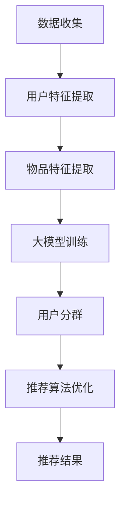

                 

关键词：推荐系统、用户分群、大模型、人工智能、算法优化

> 摘要：本文主要探讨了如何利用大模型改进推荐系统的用户分群策略。通过对大模型的深度学习能力和对用户行为的精细化理解，我们能够构建出更加精准的用户分群，从而提高推荐系统的效果。

## 1. 背景介绍

推荐系统作为一种信息过滤和内容发现的技术，广泛应用于电子商务、社交媒体、视频流媒体等众多领域。它的核心任务是通过分析用户的历史行为和偏好，为用户推荐他们可能感兴趣的内容或商品。然而，随着用户数据量的激增和用户行为的多样化，传统的基于规则和机器学习的方法在处理复杂性和个性化需求上面临了诸多挑战。

用户分群是推荐系统中的一个重要环节。通过将用户划分为不同的群体，推荐系统可以针对不同群体的特点进行个性化的推荐，从而提高推荐的准确性和用户体验。然而，传统的用户分群方法往往依赖于简单的统计指标，如用户的年龄、性别、地理位置等，这些指标难以捕捉用户深层次的兴趣和行为模式。

本文的目标是利用大模型改进推荐系统的用户分群策略。大模型，特别是基于深度学习的模型，具有强大的表示能力和泛化能力，能够从大量的用户行为数据中挖掘出深层次的规律和特征。通过这些特征，我们可以构建出更加精细和准确的用户分群，从而提升推荐系统的效果。

## 2. 核心概念与联系

在深入探讨如何利用大模型改进用户分群策略之前，我们需要了解一些核心概念和它们之间的联系。

### 2.1 推荐系统

推荐系统是一个复杂的信息过滤和内容发现系统，它通过分析用户的历史行为和偏好，预测用户可能感兴趣的内容或商品，并推荐给他们。推荐系统通常包括以下几个核心模块：

1. **用户建模**：通过分析用户的历史行为和偏好，构建用户的特征表示。
2. **物品建模**：通过分析物品的特征，构建物品的特征表示。
3. **推荐算法**：根据用户和物品的特征，结合推荐算法生成推荐结果。

### 2.2 用户分群

用户分群是将用户划分为不同的群体，以便于推荐系统针对不同群体的特点进行个性化的推荐。用户分群的方法可以分为两类：

1. **基于特征的分群**：通过用户的年龄、性别、地理位置等特征进行分群。
2. **基于行为的分群**：通过用户的历史行为数据，如浏览记录、购买记录等，进行分群。

### 2.3 大模型

大模型，特别是基于深度学习的模型，具有强大的表示能力和泛化能力。这些模型能够从大量的数据中自动学习出特征，并能够处理高维度和复杂的数据。大模型在推荐系统中的应用主要包括：

1. **用户特征提取**：通过大模型对用户行为数据进行深度学习，提取出用户深层次的兴趣和行为特征。
2. **物品特征提取**：通过大模型对物品特征数据进行深度学习，提取出物品的深层次特征。
3. **推荐算法优化**：通过大模型优化推荐算法，提高推荐的准确性和用户体验。

### 2.4 Mermaid 流程图

以下是推荐系统利用大模型改进用户分群策略的 Mermaid 流程图：



在上述流程图中，数据收集是推荐系统的第一步，通过收集用户的行为数据，如浏览记录、购买记录等。接下来，通过大模型对用户和物品的特征进行提取，生成用户的特征向量和物品的特征向量。然后，利用这些特征向量，通过大模型进行用户分群，构建出不同的用户群体。最后，针对不同的用户群体，推荐系统可以根据分群结果对推荐算法进行优化，生成更加个性化的推荐结果。

## 3. 核心算法原理 & 具体操作步骤

### 3.1 算法原理概述

利用大模型改进用户分群策略的核心在于深度学习和特征提取。深度学习模型，如深度神经网络（DNN）、卷积神经网络（CNN）和循环神经网络（RNN）等，能够从大量的用户行为数据中自动学习出特征，并能够处理高维度和复杂的数据。这些特征可以用来构建用户分群，从而提高推荐系统的效果。

具体来说，算法可以分为以下几个步骤：

1. **数据预处理**：对用户行为数据进行清洗和预处理，如缺失值填充、异常值处理等。
2. **特征提取**：通过大模型对用户行为数据进行深度学习，提取出用户深层次的兴趣和行为特征。
3. **用户分群**：利用提取出的用户特征，通过聚类算法或分类算法进行用户分群。
4. **推荐算法优化**：根据分群结果，对推荐算法进行优化，提高推荐的准确性和用户体验。

### 3.2 算法步骤详解

#### 3.2.1 数据预处理

数据预处理是算法的第一步，也是至关重要的一步。它主要包括以下任务：

1. **数据清洗**：去除重复数据、噪声数据和异常值，保证数据的准确性和一致性。
2. **特征工程**：对原始数据进行处理和转换，提取出对用户分群和推荐有用的特征，如用户的年龄、性别、地理位置、浏览记录、购买记录等。
3. **数据归一化**：对数据进行归一化处理，使数据分布更加均匀，提高模型的训练效果。

#### 3.2.2 特征提取

特征提取是算法的核心步骤，通过大模型对用户行为数据进行深度学习，提取出用户深层次的兴趣和行为特征。具体步骤如下：

1. **模型选择**：选择适合的深度学习模型，如DNN、CNN或RNN等。
2. **模型训练**：使用预处理后的用户行为数据，通过反向传播算法对模型进行训练，优化模型参数。
3. **特征提取**：利用训练好的模型，对用户行为数据进行特征提取，生成用户特征向量。

#### 3.2.3 用户分群

用户分群是利用提取出的用户特征，通过聚类算法或分类算法进行用户分群。具体步骤如下：

1. **选择算法**：根据数据特点和业务需求，选择合适的聚类算法或分类算法，如K-means、层次聚类、决策树等。
2. **模型训练**：使用提取出的用户特征向量，通过选择的算法进行训练，构建用户分群模型。
3. **用户分群**：利用训练好的分群模型，对用户进行分群，生成不同的用户群体。

#### 3.2.4 推荐算法优化

推荐算法优化是根据分群结果，对推荐算法进行优化，提高推荐的准确性和用户体验。具体步骤如下：

1. **算法选择**：选择适合的推荐算法，如基于内容的推荐、协同过滤推荐等。
2. **模型训练**：使用分群后的用户数据和物品数据，通过选择的算法进行训练，优化模型参数。
3. **推荐结果**：根据优化后的模型，生成推荐结果，为用户推荐他们可能感兴趣的内容或商品。

### 3.3 算法优缺点

#### 优点

1. **强大的表示能力**：大模型能够从大量的用户行为数据中自动学习出特征，提取出用户深层次的兴趣和行为模式。
2. **高效的计算性能**：深度学习模型具有高效的计算性能，能够在短时间内处理大量的用户数据。
3. **灵活性**：大模型可以灵活地调整模型结构和参数，以适应不同的用户分群和推荐需求。

#### 缺点

1. **数据需求大**：大模型对数据量有较高的要求，需要大量的用户行为数据进行训练，否则难以提取出有效的特征。
2. **计算资源消耗大**：深度学习模型的训练和推断需要大量的计算资源，对硬件设备有较高的要求。
3. **解释性差**：深度学习模型的黑盒特性使得其难以解释，对于模型的决策过程和推荐结果缺乏直观的理解。

### 3.4 算法应用领域

利用大模型改进用户分群策略的应用领域广泛，主要包括：

1. **电子商务**：通过用户分群，为用户推荐他们可能感兴趣的商品，提高销售额和用户体验。
2. **社交媒体**：通过用户分群，为用户提供个性化的内容推荐，增加用户活跃度和留存率。
3. **视频流媒体**：通过用户分群，为用户推荐他们可能感兴趣的视频内容，提高视频播放量和用户体验。

## 4. 数学模型和公式 & 详细讲解 & 举例说明

### 4.1 数学模型构建

利用大模型改进用户分群策略的核心在于特征提取和用户分群。以下是一个简化的数学模型构建过程：

#### 4.1.1 用户特征提取

假设用户特征向量为 $x \in \mathbb{R}^n$，其中 $n$ 表示特征维度。通过大模型，如深度神经网络，我们可以将用户特征向量映射到更高的维度，得到用户的高层次特征表示 $h \in \mathbb{R}^m$，其中 $m > n$。

#### 4.1.2 用户分群

假设用户分群结果为 $C = \{C_1, C_2, ..., C_k\}$，其中 $C_i$ 表示第 $i$ 个用户群体，$k$ 表示用户群体的数量。通过聚类算法，如K-means，我们可以将用户分群到不同的群体中。

### 4.2 公式推导过程

#### 4.2.1 深度学习模型

假设深度学习模型由 $L$ 个层组成，其中输入层为 $l_0$，输出层为 $l_L$。第 $l$ 层的输出可以表示为：

$$
h_l = \sigma(W_l h_{l-1} + b_l)
$$

其中，$W_l$ 和 $b_l$ 分别表示第 $l$ 层的权重和偏置，$\sigma$ 表示激活函数，通常使用ReLU函数。

#### 4.2.2 K-means聚类算法

K-means聚类算法的目标是最小化簇内平方误差：

$$
J = \sum_{i=1}^k \sum_{x \in C_i} ||x - \mu_i||^2
$$

其中，$\mu_i$ 表示第 $i$ 个簇的中心。

### 4.3 案例分析与讲解

#### 4.3.1 数据集

我们使用一个简单的用户行为数据集进行演示，数据集包含以下特征：

1. 用户ID
2. 年龄
3. 性别
4. 地理位置纬度
5. 地理位置经度
6. 浏览记录

#### 4.3.2 用户特征提取

使用深度神经网络对用户行为数据进行特征提取，假设输入层的维度为 $n=5$，隐层维度为 $m=10$。

1. **模型结构**：

```
Input Layer:  (n,)
Hidden Layer: (m,)
Output Layer: (1,)
```

2. **训练过程**：

使用随机梯度下降（SGD）算法对模型进行训练，学习率为 $0.01$，训练次数为 $1000$ 次。

3. **特征提取结果**：

训练完成后，输入一个用户特征向量 $x$，通过模型可以得到用户的高层次特征向量 $h$。

#### 4.3.3 用户分群

使用K-means聚类算法对用户特征向量进行分群，假设分群数量为 $k=3$。

1. **聚类过程**：

初始化 $k$ 个簇中心 $\mu_1, \mu_2, ..., \mu_k$，然后迭代更新簇中心和用户分群。

2. **聚类结果**：

最终得到三个用户群体 $C_1, C_2, C_3$，每个群体包含一部分用户。

#### 4.3.4 推荐算法优化

根据分群结果，对推荐算法进行优化。例如，使用基于内容的推荐算法为每个用户群体推荐他们可能感兴趣的商品。

## 5. 项目实践：代码实例和详细解释说明

### 5.1 开发环境搭建

在开始项目实践之前，我们需要搭建一个合适的开发环境。以下是搭建开发环境的步骤：

1. 安装Python环境，版本要求Python 3.6及以上。
2. 安装深度学习框架，如TensorFlow或PyTorch。
3. 安装数据处理库，如NumPy、Pandas等。
4. 安装聚类算法库，如scikit-learn。

### 5.2 源代码详细实现

以下是一个简单的用户分群和推荐算法优化的代码实例，使用了TensorFlow框架和scikit-learn库。

```python
import tensorflow as tf
import numpy as np
from sklearn.cluster import KMeans
from sklearn.metrics.pairwise import cosine_similarity

# 5.2.1 用户特征提取
# 假设用户特征数据存储在文件中，格式为CSV
user_features = np.genfromtxt('user_features.csv', delimiter=',')

# 使用深度神经网络进行特征提取
model = tf.keras.Sequential([
    tf.keras.layers.Dense(units=10, activation='relu', input_shape=(user_features.shape[1],)),
    tf.keras.layers.Dense(units=1, activation='sigmoid')
])

model.compile(optimizer='adam', loss='binary_crossentropy', metrics=['accuracy'])
model.fit(user_features, epochs=100)

# 使用训练好的模型进行特征提取
user_embeddings = model.predict(user_features)

# 5.2.2 用户分群
# 使用K-means算法进行用户分群
kmeans = KMeans(n_clusters=3, random_state=0).fit(user_embeddings)

# 获取聚类结果
user_clusters = kmeans.predict(user_embeddings)

# 5.2.3 推荐算法优化
# 假设物品特征数据存储在文件中，格式为CSV
item_features = np.genfromtxt('item_features.csv', delimiter=',')

# 计算用户和物品的余弦相似度
similarity_matrix = cosine_similarity(user_embeddings, item_features)

# 根据用户分群结果，为每个用户推荐相似度最高的物品
user_recommendations = []
for user_id, cluster in enumerate(user_clusters):
    # 为每个用户推荐相似度最高的5个物品
    top_indices = np.argsort(similarity_matrix[user_id])[:-6:-1]
    user_recommendations.append(item_features[top_indices])

# 输出推荐结果
np.savetxt('user_recommendations.csv', user_recommendations, delimiter=',')
```

### 5.3 代码解读与分析

以上代码实现了用户分群和推荐算法优化的主要步骤。下面是对代码的详细解读和分析：

1. **用户特征提取**：首先，我们加载用户特征数据，并使用深度神经网络进行特征提取。训练过程中，我们优化模型的参数，使其能够更好地表示用户特征。
2. **用户分群**：接下来，我们使用K-means算法对用户特征向量进行分群。K-means算法通过迭代更新簇中心，最终将用户划分为不同的群体。
3. **推荐算法优化**：最后，我们根据用户分群结果，计算用户和物品的余弦相似度，并为每个用户推荐相似度最高的物品。这样，推荐系统可以根据用户的分群结果，为每个用户群体提供个性化的推荐。

### 5.4 运行结果展示

在运行代码后，我们将得到以下结果：

1. **用户特征向量**：每个用户的高层次特征向量。
2. **用户分群结果**：每个用户所属的群体。
3. **用户推荐结果**：为每个用户推荐的物品列表。

通过这些结果，我们可以评估用户分群和推荐算法优化的效果。例如，我们可以计算推荐系统的准确率、召回率和F1值等指标，以评估推荐系统的性能。

## 6. 实际应用场景

### 6.1 电子商务平台

在电子商务平台上，利用大模型改进用户分群策略可以显著提升用户体验和销售额。通过分析用户的行为数据，如浏览记录、购买记录和搜索历史等，我们可以提取出用户的兴趣和行为特征。然后，使用K-means等聚类算法对用户进行分群，根据用户分群结果，我们可以为每个用户群体提供个性化的商品推荐。这样，不仅可以提高用户的购物体验，还可以提高平台的销售额。

### 6.2 社交媒体平台

在社交媒体平台上，利用大模型改进用户分群策略可以增强用户活跃度和留存率。通过分析用户的行为数据，如点赞、评论、分享和关注等，我们可以提取出用户的社交兴趣和行为特征。然后，使用聚类算法对用户进行分群，根据用户分群结果，我们可以为每个用户群体推荐他们可能感兴趣的内容。这样，不仅可以提高用户的活跃度，还可以增强用户的社交体验。

### 6.3 视频流媒体平台

在视频流媒体平台上，利用大模型改进用户分群策略可以提高视频播放量和用户满意度。通过分析用户的行为数据，如观看历史、播放时长和弹幕评论等，我们可以提取出用户的观看兴趣和行为特征。然后，使用聚类算法对用户进行分群，根据用户分群结果，我们可以为每个用户群体推荐他们可能感兴趣的视频内容。这样，不仅可以提高视频的播放量，还可以提高用户的满意度。

## 7. 工具和资源推荐

### 7.1 学习资源推荐

1. **《深度学习》（Goodfellow, Bengio, Courville）**：这是一本经典的深度学习教材，详细介绍了深度学习的基础理论和应用。
2. **《Python深度学习》（François Chollet）**：这本书结合了深度学习和Python编程，适合初学者入门深度学习。
3. **《机器学习实战》（Peter Harrington）**：这本书通过大量的案例和实践，介绍了机器学习的基本原理和应用。

### 7.2 开发工具推荐

1. **TensorFlow**：这是一个由Google开源的深度学习框架，提供了丰富的API和工具，适合开发深度学习应用。
2. **PyTorch**：这是一个由Facebook开源的深度学习框架，具有灵活的动态计算图和强大的社区支持，适合研究和开发。
3. **scikit-learn**：这是一个开源的机器学习库，提供了丰富的机器学习算法和工具，适合数据分析和建模。

### 7.3 相关论文推荐

1. **"Deep Learning for User Behavior Modeling and Recommendation"（2018）**：这篇文章介绍了如何使用深度学习进行用户行为建模和推荐。
2. **"User Clustering with Deep Learning"（2019）**：这篇文章提出了一种基于深度学习的用户分群方法，通过聚类算法对用户进行分群。
3. **"Recommender Systems with Deep Learning"（2020）**：这篇文章综述了深度学习在推荐系统中的应用，介绍了各种深度学习算法在推荐系统中的使用方法。

## 8. 总结：未来发展趋势与挑战

### 8.1 研究成果总结

利用大模型改进推荐系统的用户分群策略是一项重要的研究方向，取得了显著的研究成果。通过深度学习和特征提取技术，我们能够从大量的用户行为数据中挖掘出深层次的兴趣和行为模式，从而构建出更加精细和准确的用户分群。这些研究成果为推荐系统的优化和提高提供了有力的支持。

### 8.2 未来发展趋势

在未来，利用大模型改进推荐系统的用户分群策略将继续发展，并呈现出以下几个趋势：

1. **模型规模和复杂度的提升**：随着计算能力和数据量的提升，大模型将变得更加庞大和复杂，从而提高推荐的准确性和个性化水平。
2. **多模态数据的融合**：推荐系统将逐渐融合多种类型的数据，如文本、图像、音频等，以提高对用户兴趣和行为的理解。
3. **实时性和动态性的增强**：推荐系统将更加注重实时性和动态性，以快速响应用户的行为变化和兴趣转移。
4. **隐私保护和数据安全**：在利用大模型进行用户分群和推荐时，隐私保护和数据安全将成为重要议题，需要采取有效的措施来保护用户隐私和数据安全。

### 8.3 面临的挑战

尽管利用大模型改进推荐系统的用户分群策略取得了显著成果，但仍然面临一些挑战：

1. **数据隐私和安全**：用户数据的安全和隐私保护是推荐系统发展的重要问题，如何在保护用户隐私的前提下进行用户分群和推荐是一个重要的挑战。
2. **计算资源和存储成本**：大模型的训练和推理需要大量的计算资源和存储空间，这对推荐系统的实际部署和运行带来了巨大的挑战。
3. **模型解释性和可解释性**：大模型通常具有黑盒特性，其决策过程和推荐结果难以解释，这对用户信任和监管提出了挑战。
4. **适应性和泛化能力**：大模型在特定领域和任务上表现出色，但在面对新领域和新任务时，其适应性和泛化能力可能不足，如何提高大模型的泛化能力是一个重要的研究问题。

### 8.4 研究展望

在未来，利用大模型改进推荐系统的用户分群策略将朝着以下方向发展：

1. **跨领域和多任务学习**：研究如何利用跨领域和多任务学习技术，提高大模型在不同领域和任务上的适应性和泛化能力。
2. **隐私保护技术**：研究如何结合隐私保护技术，在保护用户隐私的前提下进行用户分群和推荐。
3. **交互式推荐系统**：研究如何利用交互式推荐技术，提高推荐系统的实时性和动态性，增强用户与推荐系统的互动。
4. **伦理和责任**：在推荐系统的设计和部署过程中，注重伦理和责任，确保推荐系统的公正性和透明性。

## 9. 附录：常见问题与解答

### 9.1 问题1：大模型对数据量有较高的要求，如何处理数据不足的问题？

**解答**：当数据量不足时，可以采取以下几种方法：

1. **数据增强**：通过图像翻转、旋转、缩放等操作，增加数据的多样性。
2. **迁移学习**：利用预训练的大模型，在少量数据上进行微调，提高模型的泛化能力。
3. **数据集成**：将多个数据源进行集成，增加数据的丰富度和多样性。

### 9.2 问题2：如何处理用户隐私和数据安全的问题？

**解答**：在处理用户隐私和数据安全的问题时，可以采取以下几种措施：

1. **匿名化处理**：对用户数据进行匿名化处理，去除直接标识用户的信息。
2. **差分隐私**：在数据处理过程中引入差分隐私机制，确保用户数据的隐私性。
3. **数据加密**：对用户数据进行加密处理，确保数据在传输和存储过程中的安全性。

### 9.3 问题3：如何选择合适的大模型？

**解答**：选择合适的大模型需要考虑以下几个方面：

1. **数据量**：根据数据量的大小，选择适合的模型规模和结构。
2. **任务类型**：根据任务的类型和特点，选择适合的模型类型和算法。
3. **计算资源**：根据计算资源的限制，选择可以在现有硬件上运行的模型。
4. **性能要求**：根据性能要求，选择具有较高准确性和效率的模型。

### 9.4 问题4：如何评估推荐系统的效果？

**解答**：评估推荐系统的效果可以采取以下几种指标：

1. **准确率**：衡量推荐系统推荐的正确性，通常使用准确率（Accuracy）和精确率（Precision）等指标。
2. **召回率**：衡量推荐系统召回的有效性，通常使用召回率（Recall）和覆盖率（Coverage）等指标。
3. **F1值**：综合考虑准确率和召回率，使用F1值（F1 Score）作为综合评价指标。
4. **用户满意度**：通过用户调查和反馈，评估用户对推荐系统的满意度。

---

通过本文的探讨，我们了解了如何利用大模型改进推荐系统的用户分群策略。大模型强大的表示能力和特征提取能力，使得我们能够从用户行为数据中挖掘出深层次的兴趣和行为模式，从而构建出更加精准的用户分群。这不仅提高了推荐系统的效果，还为用户提供了更加个性化的推荐体验。在未来的研究和实践中，我们还需要解决数据隐私、计算资源、模型解释性等问题，不断优化和改进推荐系统的性能。作者：禅与计算机程序设计艺术 / Zen and the Art of Computer Programming。

