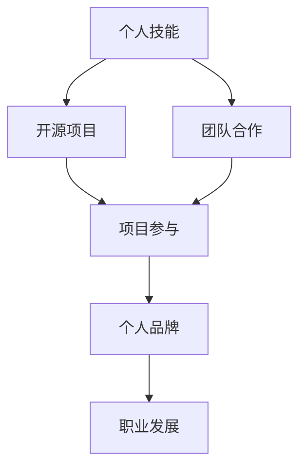

                 

关键词：开源贡献、职业发展、技术影响力、项目参与、技能提升、个人品牌建设

> 摘要：在当今快速发展的技术领域，开源项目已成为技术人才的必备技能之一。通过积极参与开源项目，不仅能够提升个人技术水平，还能为职业发展打开新的可能性。本文将探讨开源贡献如何成为技术人才职业发展的有力工具，并提供一系列实际操作建议。

## 1. 背景介绍

在过去的几十年中，开源软件运动已经深刻地改变了软件开发的方式。开源软件（Open Source Software，OSS）是指那些软件的源代码可以被公众自由查看、修改和分享的软件。这种模式促进了全球范围内的知识共享和技术创新。随着互联网的普及，开源项目数量激增，吸引了无数的技术人才参与其中。

开源贡献不再仅仅是编程高手和软件爱好者的游戏，它已成为技术人才职业发展的关键因素。许多公司现在重视候选人的开源贡献经验，因为这在一定程度上反映了其技术能力和团队协作精神。此外，开源项目提供了一个展示个人技术能力和成就的平台，有助于建立个人品牌，提升在行业中的影响力。

本文旨在帮助技术人才了解如何利用开源贡献提升职业发展，从背景介绍、核心概念、算法原理、数学模型、项目实践到未来展望，全方位解析开源贡献的方方面面。

## 2. 核心概念与联系

在探讨开源贡献如何提升职业发展之前，我们需要先理解一些核心概念和它们之间的联系。以下是一个简单的 Mermaid 流程图，用于说明这些概念：



### 2.1 个人技能

个人技能是指个人在特定领域内掌握的知识和技能。这些技能可以通过正规教育、自学、工作实践和开源项目参与等多种途径获得。在开源项目中，技术人才有机会接触和学习到最新的技术动态和最佳实践，从而提升个人技能。

### 2.2 开源项目

开源项目是那些遵循开放源代码协议（如GPL、Apache License等）的项目，允许用户自由查看、修改和分发代码。这些项目通常有一个明确的愿景和目标，并依靠全球社区的贡献来不断进步。

### 2.3 项目参与

项目参与是指个人在开源项目中贡献代码、文档、测试或其他形式的工作。通过参与开源项目，技术人才可以建立自己的技术声誉，并为未来的职业发展打下坚实的基础。

### 2.4 个人品牌

个人品牌是指个人在公众心中的形象和认知。一个强大的个人品牌可以增加个人的市场价值，提高就业竞争力。通过在开源项目中展示专业技能和成就，技术人才可以建立并提升自己的个人品牌。

### 2.5 职业发展

职业发展是指个人在职业生涯中不断进步和成长的过程。通过开源贡献，技术人才可以增加技术实力、建立人脉关系、提升个人品牌，从而在职业市场上脱颖而出。

### 2.6 团队合作

团队合作是指多个个体为了共同的目标而协作的过程。在开源项目中，团队合作至关重要，因为它需要参与者共同解决复杂问题、协同推进项目进展。这种能力对于技术人才在职业生涯中也是非常宝贵的。

通过理解这些核心概念及其相互关系，我们可以更好地把握开源贡献如何提升职业发展的路径。

## 3. 核心算法原理 & 具体操作步骤

### 3.1 算法原理概述

在开源项目中，核心算法原理通常是指解决特定问题的算法设计和实现。这些算法可以是数据结构、排序算法、搜索算法等。开源项目的算法通常具有以下特点：

- **开放性**：算法源代码对所有人公开，任何人都可以查看、理解和改进。
- **高效性**：开源项目的算法通常经过社区的不断优化，以达到最佳性能。
- **可扩展性**：开源项目的算法设计通常考虑了未来扩展的可能性，易于添加新功能和特性。
- **社区驱动的迭代**：开源项目的算法通过社区成员的反馈和改进不断迭代优化。

### 3.2 算法步骤详解

参与开源项目的算法实现通常包括以下步骤：

1. **问题理解**：明确项目需求和目标，理解需要解决的问题。
2. **算法设计**：设计算法的基本框架，确定算法的复杂度和效率。
3. **代码实现**：根据算法设计，编写具体的代码实现。
4. **代码审查**：提交代码进行社区审查，确保代码质量和可读性。
5. **测试**：编写测试用例，验证代码的正确性和性能。
6. **迭代优化**：根据审查和测试结果，对代码进行优化和改进。

### 3.3 算法优缺点

开源项目的算法有以下优点：

- **透明性**：所有人都可以查看源代码，确保算法的公平性和透明性。
- **社区参与**：社区成员可以共同改进算法，提高性能和功能。
- **可定制化**：用户可以根据自己的需求修改和扩展算法。

然而，开源项目的算法也存在一些缺点：

- **维护成本**：开源项目通常需要持续维护和更新，这需要大量的时间和资源。
- **质量控制**：由于代码审查的不确定性，可能会引入错误的代码。
- **安全风险**：开源项目的代码可能会被恶意攻击者利用，导致安全漏洞。

### 3.4 算法应用领域

开源项目的算法广泛应用于各个领域，包括但不限于：

- **互联网应用**：搜索引擎、推荐系统、社交网络等。
- **大数据处理**：分布式计算、数据挖掘、机器学习等。
- **区块链技术**：加密算法、分布式账本、智能合约等。
- **人工智能**：深度学习框架、神经网络模型等。

## 4. 数学模型和公式 & 详细讲解 & 举例说明

在开源项目中，数学模型和公式是算法的核心组成部分，它们用于描述问题、推导解决方案以及评估性能。以下将详细讲解一些常见的数学模型和公式，并通过具体案例进行说明。

### 4.1 数学模型构建

数学模型通常包括以下几个基本步骤：

1. **问题定义**：明确需要解决的问题和目标。
2. **变量定义**：定义问题中的变量，包括输入变量和输出变量。
3. **约束条件**：确定问题的约束条件，如线性规划中的资源限制。
4. **目标函数**：定义需要优化的目标函数，如最大化或最小化某个指标。

以线性规划为例，其数学模型可以表示为：

$$
\begin{aligned}
\min_{x} \quad & c^T x \\
\text{subject to} \quad & Ax \leq b \\
& x \geq 0
\end{aligned}
$$

其中，$x$ 是变量向量，$c$ 是目标函数系数向量，$A$ 是约束条件矩阵，$b$ 是约束条件常数向量。

### 4.2 公式推导过程

以快速排序算法为例，其时间复杂度可以通过概率统计方法推导。快速排序的基本步骤如下：

1. **选择基准元素**：从数组中随机选择一个元素作为基准。
2. **分区操作**：将数组分为两部分，小于基准的元素和大于基准的元素。
3. **递归排序**：对小于和大于基准的两部分数组重复以上步骤。

快速排序的平均时间复杂度为 $O(n \log n)$，最坏情况下的时间复杂度为 $O(n^2)$。具体推导过程如下：

- **平均情况**：假设每次分区操作将数组分为 $\frac{n}{k}$ 的两部分，其中 $k$ 是随机数。
- **递归关系**：设 $T(n)$ 为排序长度为 $n$ 的数组所需的时间，则：
  $$
  T(n) = T\left(\frac{n}{k}\right) + T\left(\frac{n - k}{k}\right) + O(n)
  $$
- **边界条件**：当 $n \leq 1$ 时，$T(n) = O(1)$。
- **解递归**：使用主定理解递归关系，得到 $T(n) = O(n \log n)$。

### 4.3 案例分析与讲解

以开源数据库项目 PostgreSQL 为例，其内部使用的排序算法是外部排序算法。外部排序算法通常用于处理大数据集的排序问题，其中数据集过大无法一次性加载到内存中。以下是外部排序算法的基本步骤：

1. **分块**：将数据集分成多个大小相等的块，每个块的大小不超过内存限制。
2. **内排序**：对每个块进行排序，可以使用快速排序、归并排序等算法。
3. **归并**：将排序后的块合并成一个有序的数据集。

外部排序算法的时间复杂度可以通过以下公式计算：

$$
T(n) = \frac{n}{b} \cdot T_b + \frac{n \log_b n}{b} + O(n)
$$

其中，$n$ 是数据集大小，$b$ 是内存块大小，$T_b$ 是对单个块进行排序的时间复杂度。

通过上述公式，我们可以优化外部排序算法，使其在处理大数据集时达到最佳性能。

## 5. 项目实践：代码实例和详细解释说明

### 5.1 开发环境搭建

为了实践开源项目，我们需要搭建一个基本的开发环境。以下是在 Linux 系统下搭建 Python 开发环境的过程：

1. **安装 Python**：首先安装 Python 3，可以通过包管理器如 `apt-get` 安装。
   ```bash
   sudo apt-get install python3
   ```

2. **安装代码编辑器**：推荐使用 Vim 或 VSCode 作为代码编辑器。以 VSCode 为例，可以通过以下命令安装：
   ```bash
   sudo apt-get install code
   ```

3. **安装 Git**：Git 是开源项目的重要工具，用于版本控制和代码提交。安装命令如下：
   ```bash
   sudo apt-get install git
   ```

4. **配置 Git**：配置 Git 用户名和邮箱，以便在提交代码时使用。
   ```bash
   git config --global user.name "Your Name"
   git config --global user.email "your-email@example.com"
   ```

5. **克隆开源项目**：通过 Git 克隆一个开源项目，如 GitHub 上的某个 Python 项目。
   ```bash
   git clone https://github.com/your-username/your-project.git
   ```

### 5.2 源代码详细实现

以一个简单的 Python Web 应用为例，我们将使用 Flask 框架实现一个简单的博客系统。以下是源代码实现的关键部分：

1. **安装 Flask**：
   ```bash
   pip install flask
   ```

2. **创建 Flask 应用**：
   ```python
   from flask import Flask, render_template, request
   
   app = Flask(__name__)

   @app.route('/')
   def index():
       return render_template('index.html')

   @app.route('/post', methods=['GET', 'POST'])
   def post():
       if request.method == 'POST':
           title = request.form['title']
           content = request.form['content']
           # 保存到数据库
           return f'Post created: {title}'
       return render_template('post.html')

   if __name__ == '__main__':
       app.run(debug=True)
   ```

3. **创建 HTML 模板**：
   - `index.html`：
     ```html
     <!DOCTYPE html>
     <html lang="en">
     <head>
         <meta charset="UTF-8">
         <meta name="viewport" content="width=device-width, initial-scale=1.0">
         <title>Home</title>
     </head>
     <body>
         <h1>Home</h1>
         <a href="/post">New Post</a>
     </body>
     </html>
     ```
   - `post.html`：
     ```html
     <!DOCTYPE html>
     <html lang="en">
     <head>
         <meta charset="UTF-8">
         <meta name="viewport" content="width=device-width, initial-scale=1.0">
         <title>New Post</title>
     </head>
     <body>
         <h1>New Post</h1>
         <form method="post">
             <input type="text" name="title" placeholder="Title" required>
             <textarea name="content" placeholder="Content" required></textarea>
             <button type="submit">Submit</button>
         </form>
     </body>
     </html>
     ```

### 5.3 代码解读与分析

上述代码实现了一个简单的博客系统，其中包含以下关键部分：

- **Flask 应用**：定义了两个路由：首页和新建帖子页。
- **模板渲染**：使用 Jinja2 模板引擎渲染 HTML 页面。
- **表单处理**：处理 POST 请求，获取表单数据并保存到数据库。

这个例子展示了如何通过简单的代码实现一个具有基本功能的应用。在实际项目中，还需要考虑更多的功能和安全问题，如用户认证、数据验证、错误处理等。

### 5.4 运行结果展示

在开发环境中运行 Flask 应用，访问本地服务器（如 `http://127.0.0.1:5000/`），可以看到以下界面：

- **首页**：
  ```html
  <!DOCTYPE html>
  <html lang="en">
  <head>
      <meta charset="UTF-8">
      <meta name="viewport" content="width=device-width, initial-scale=1.0">
      <title>Home</title>
  </head>
  <body>
      <h1>Home</h1>
      <a href="/post">New Post</a>
  </body>
  </html>
  ```

- **新建帖子页**：
  ```html
  <!DOCTYPE html>
  <html lang="en">
  <head>
      <meta charset="UTF-8">
      <meta name="viewport" content="width=device-width, initial-scale=1.0">
      <title>New Post</title>
  </head>
  <body>
      <h1>New Post</h1>
      <form method="post">
          <input type="text" name="title" placeholder="Title" required>
          <textarea name="content" placeholder="Content" required></textarea>
          <button type="submit">Submit</button>
      </form>
  </body>
  </html>
  ```

通过以上运行结果，我们可以看到博客系统的基本功能已经实现。用户可以创建新的帖子，并通过 URL 访问具体的帖子页面。

## 6. 实际应用场景

### 6.1 数据处理

开源项目在数据处理领域有着广泛的应用。以 Apache Hadoop 和 Apache Spark 为例，这两个项目提供了强大的分布式数据处理框架，可以处理海量数据。技术人才可以通过参与这些项目，提升分布式系统和大数据处理的能力。

### 6.2 人工智能

人工智能领域的开源项目如 TensorFlow、PyTorch 等为研究人员和开发者提供了丰富的工具和框架。参与这些项目，可以帮助技术人才深入了解深度学习和机器学习的技术细节，提升在人工智能领域的技术水平。

### 6.3 区块链

区块链技术是一个快速发展的领域，开源项目如 Ethereum、Hyperledger 等为区块链应用的开发提供了基础。技术人才可以通过参与这些项目，学习和实践区块链技术，探索其应用潜力。

### 6.4 未来应用展望

随着技术的不断发展，开源项目将在更多领域发挥重要作用。未来，开源项目可能会在以下几个方面得到更广泛的应用：

- **物联网（IoT）**：开源项目将为物联网设备的互联和数据处理提供支持。
- **云计算**：开源云平台如 OpenStack、Kubernetes 等将继续发展，为云计算服务提供更多的选择。
- **边缘计算**：开源项目将在边缘计算领域发挥重要作用，支持实时数据处理和智能决策。

## 7. 工具和资源推荐

### 7.1 学习资源推荐

- **GitHub**：GitHub 是最大的开源代码托管平台，提供了丰富的开源项目和文档。
- **GitHub Guides**：GitHub 官方提供的教程和指南，适合初学者了解开源项目的基本操作。
- **Open Source Guide**：由 GitHub 赞助的免费电子书，全面介绍开源社区的文化和实践。

### 7.2 开发工具推荐

- **Visual Studio Code**：一款强大的代码编辑器，支持多种编程语言和开源项目开发。
- **Jenkins**：自动化构建和持续集成工具，可以自动化构建和测试开源项目。
- **Docker**：容器化技术，用于创建、运行和分发应用程序，有助于开发和部署开源项目。

### 7.3 相关论文推荐

- **"Open Source Development in the Open Source Development Model"**：探讨开源软件开发模式及其优势。
- **"The Cathedral and the Bazaar"**：Eric S. Raymond 的论文，分析开源社区的运作模式。
- **"How to Win Friends and Influence People"**：Dale Carnegie 的经典作品，提供人际交往和沟通技巧。

## 8. 总结：未来发展趋势与挑战

### 8.1 研究成果总结

开源贡献在提升个人技术能力、建立个人品牌和促进职业发展方面发挥了重要作用。通过参与开源项目，技术人才能够接触到最新的技术动态和最佳实践，提升个人技能。此外，开源项目的协作模式有助于培养团队合作能力，增强在行业中的影响力。

### 8.2 未来发展趋势

随着技术的不断进步，开源项目将在更多领域得到应用。未来，开源项目可能会在物联网、区块链、边缘计算等领域发挥更大作用。此外，开源社区将进一步发展和成熟，为技术人才提供更多的机会和平台。

### 8.3 面临的挑战

开源贡献也面临一些挑战。首先，开源项目需要持续维护和更新，这可能需要大量的时间和资源。其次，开源项目可能会面临质量控制问题，代码审查的不确定性可能导致错误的代码被引入。最后，开源项目的安全风险不容忽视，恶意攻击者可能会利用开源项目的漏洞进行攻击。

### 8.4 研究展望

为了更好地利用开源贡献提升职业发展，技术人才需要积极参与开源项目，提升个人技术水平。同时，企业和组织也应该重视开源贡献，为技术人才提供支持和鼓励。未来，开源社区和企业在推动开源贡献方面将有更多的合作空间，共同促进技术的发展。

## 9. 附录：常见问题与解答

### 9.1 如何选择适合自己的开源项目？

- **确定兴趣领域**：选择自己感兴趣的技术领域，以便持续投入热情。
- **查看项目活跃度**：选择活跃度较高的项目，这样可以更容易得到支持和反馈。
- **了解项目需求**：研究项目的需求和目标，确保自己能够为项目做出实际贡献。

### 9.2 如何在开源项目中得到认可？

- **积极参与**：积极参与项目讨论和代码贡献，展示自己的技术能力。
- **提供高质量的代码**：编写高质量的代码，确保代码的可读性和可维护性。
- **主动沟通**：与项目维护者和其他贡献者保持良好的沟通，及时解决问题。

### 9.3 开源贡献会影响职业安全吗？

- **正面影响**：开源贡献可以提升个人技术能力和行业影响力，有助于职业发展。
- **负面影响**：如果开源贡献不当，可能会引起知识产权和安全问题。因此，应当确保开源贡献符合法律法规和道德标准。

### 9.4 如何在开源项目中保持长期活跃？

- **制定计划**：制定明确的参与计划和目标，确保参与活动的连续性。
- **设定优先级**：平衡工作和开源贡献，确保两者之间有合理的优先级。
- **保持兴趣**：选择自己感兴趣的项目和领域，保持参与的积极性。

通过上述常见问题的解答，希望读者能够更好地理解和利用开源贡献提升职业发展。

