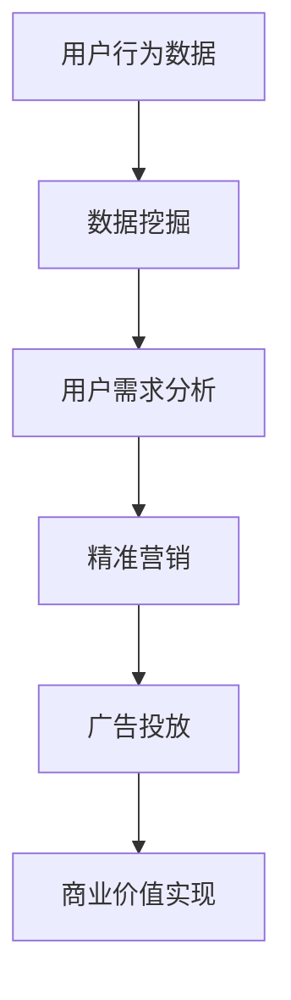

                 

社交媒体已经成为人们日常生活中不可或缺的一部分。无论是为了社交互动、娱乐还是获取信息，社交媒体都扮演着重要的角色。随着社交媒体用户数量的不断增长，如何利用技术优势进行社交媒体变现，成为一个备受关注的话题。本文将探讨如何通过技术手段，实现社交媒体的商业化价值。

## 文章关键词

社交媒体变现、技术优势、算法优化、用户体验、商业模式

## 文章摘要

本文旨在探讨如何利用技术优势实现社交媒体的变现。首先，我们将回顾社交媒体的发展历程，分析其商业模式的演变。接着，我们将探讨技术优势在社交媒体变现中的关键作用，包括数据挖掘、人工智能、广告优化等方面。随后，我们将介绍一些成功的社交媒体变现案例，并探讨未来社交媒体变现的发展趋势。最后，我们将对未来的挑战和机遇进行展望。

## 1. 背景介绍

社交媒体的兴起可以追溯到上世纪90年代。当时，互联网的普及使得人们可以更加方便地进行信息交流和互动。早期的社交媒体，如Facebook、Twitter等，主要功能是社交互动和信息分享。随着互联网技术的不断发展，社交媒体逐渐成为了一个多元化的平台，涵盖了从社交互动、娱乐、新闻到广告、电商等多个领域。

### 社交媒体的发展历程

- **1997-2004年**：社交媒体的萌芽期。这一时期，社交媒体主要以论坛和博客的形式出现，如Facebook、Twitter等。这些平台的出现，打破了传统人际交流的限制，使得人们可以更加方便地与世界各地的人进行互动。
- **2005-2010年**：社交媒体的快速发展期。随着互联网技术的进步，社交媒体平台逐渐成为人们日常生活中的重要组成部分。这一时期，出现了大量的社交媒体平台，如Instagram、LinkedIn等，涵盖了从社交、娱乐、新闻到商务等多个领域。
- **2011年至今**：社交媒体的成熟期。随着移动设备的普及，社交媒体进入了移动时代。这一时期，社交媒体平台开始注重用户体验和内容质量，同时，广告、电商等商业模式也得到了快速发展。

### 社交媒体的商业模式演变

- **免费模式**：早期的社交媒体平台，如Facebook、Twitter等，主要采用免费模式，通过广告来获取收入。这种模式在社交媒体用户快速增长的过程中，取得了巨大的成功。
- **付费模式**：随着社交媒体的发展，一些平台开始探索付费模式。例如，LinkedIn推出了付费会员服务，提供更高级的功能和内容。这种模式在一定程度上增加了平台的收入来源。
- **广告模式**：广告一直是社交媒体的主要收入来源。然而，随着用户隐私保护和广告效果的关注度提高，社交媒体平台开始探索更加精准、有效的广告模式。
- **电商模式**：随着社交媒体平台电商功能的不断完善，电商模式也逐渐成为一些平台的重要收入来源。例如，Instagram上的“购物标签”功能，使得用户可以直接在社交媒体上购买商品。

## 2. 核心概念与联系

### 社交媒体变现的概念

社交媒体变现是指通过技术手段，将社交媒体平台上的用户流量转化为商业价值的过程。社交媒体变现的核心是通过用户行为数据，精准定位用户需求，从而实现广告、电商等商业模式的盈利。

### 技术优势在社交媒体变现中的作用

- **数据挖掘**：通过大数据技术，对用户行为数据进行挖掘和分析，了解用户的需求和偏好，从而实现精准营销。
- **人工智能**：利用人工智能技术，优化广告投放策略，提高广告的点击率和转化率。
- **用户体验**：通过优化用户体验，提高用户粘性，从而增加平台的用户数量和活跃度。
- **广告优化**：利用算法优化广告投放策略，提高广告效果，从而增加广告收入。

### Mermaid 流程图



## 3. 核心算法原理 & 具体操作步骤

### 3.1 算法原理概述

社交媒体变现的核心是数据驱动。通过大数据技术，对用户行为数据进行挖掘和分析，了解用户的需求和偏好，从而实现精准营销。具体来说，算法原理包括以下步骤：

1. **数据收集**：收集社交媒体平台上的用户行为数据，包括浏览记录、点击行为、购买记录等。
2. **数据预处理**：对收集到的用户行为数据进行清洗和整合，去除噪声数据，提高数据质量。
3. **特征提取**：从预处理后的数据中提取用户行为特征，如浏览时间、浏览页面、点击次数等。
4. **用户需求分析**：利用机器学习算法，对提取的用户行为特征进行分析，预测用户的需求和偏好。
5. **精准营销**：根据用户需求分析结果，制定精准的营销策略，提高广告的点击率和转化率。
6. **广告投放**：利用算法优化广告投放策略，提高广告效果，从而增加广告收入。

### 3.2 算法步骤详解

1. **数据收集**：
    - 使用API接口，收集社交媒体平台上的用户行为数据。
    - 使用爬虫技术，获取社交媒体平台上的公开数据。

2. **数据预处理**：
    - 去除重复数据和噪声数据。
    - 对数据进行标准化处理，如时间转换、数值归一化等。

3. **特征提取**：
    - 从预处理后的数据中提取用户行为特征，如浏览时间、浏览页面、点击次数等。
    - 使用特征工程技术，构建用户行为特征矩阵。

4. **用户需求分析**：
    - 使用机器学习算法，如决策树、随机森林、支持向量机等，对用户行为特征进行建模。
    - 使用交叉验证方法，评估模型的预测性能。

5. **精准营销**：
    - 根据用户需求分析结果，制定精准的营销策略。
    - 对广告内容进行个性化推荐，提高广告的点击率和转化率。

6. **广告投放**：
    - 使用算法优化广告投放策略，如A/B测试、多变量测试等。
    - 根据广告效果，调整广告投放策略。

### 3.3 算法优缺点

**优点**：
- 提高广告的点击率和转化率，增加广告收入。
- 根据用户需求，提供个性化的广告内容，提高用户体验。

**缺点**：
- 需要大量的用户数据，对数据处理和存储能力要求较高。
- 模型的训练和优化需要大量的计算资源。

### 3.4 算法应用领域

- 广告投放优化：通过对用户行为数据的分析，优化广告投放策略，提高广告效果。
- 个性化推荐：根据用户行为特征，推荐用户可能感兴趣的内容，提高用户粘性。
- 智能客服：通过分析用户提问和行为，提供智能化的客服服务。

## 4. 数学模型和公式 & 详细讲解 & 举例说明

### 4.1 数学模型构建

社交媒体变现的数学模型主要包括用户行为分析模型和广告投放优化模型。

1. **用户行为分析模型**：
    - 用户行为概率模型：根据用户的浏览记录和点击行为，预测用户对某一内容的兴趣概率。
    - 用户行为序列模型：分析用户行为序列，预测用户下一步的行为。

2. **广告投放优化模型**：
    - 广告点击率预测模型：根据用户行为特征，预测用户对广告的点击率。
    - 广告转化率预测模型：根据用户行为特征，预测用户对广告的转化率。

### 4.2 公式推导过程

1. **用户行为概率模型**：

   设用户 \( u \) 对内容 \( c \) 的兴趣概率为 \( P(c|u) \)，则：

   $$ P(c|u) = \frac{P(u|c)P(c)}{P(u)} $$

   其中，\( P(u|c) \) 为用户 \( u \) 对内容 \( c \) 的条件概率，\( P(c) \) 为内容 \( c \) 的概率，\( P(u) \) 为用户 \( u \) 的概率。

2. **用户行为序列模型**：

   设用户 \( u \) 的行为序列为 \( (c_1, c_2, ..., c_n) \)，则：

   $$ P(c_1, c_2, ..., c_n|u) = P(c_1|u)P(c_2|c_1, u)...P(c_n|c_{n-1}, u) $$

3. **广告点击率预测模型**：

   设用户 \( u \) 对广告 \( a \) 的点击率为 \( P(click|u, a) \)，则：

   $$ P(click|u, a) = \frac{P(u|a)P(a)}{P(u)} $$

4. **广告转化率预测模型**：

   设用户 \( u \) 对广告 \( a \) 的转化率为 \( P(conversion|u, a) \)，则：

   $$ P(conversion|u, a) = \frac{P(u|a)P(a|conversion)}{P(u)} $$

### 4.3 案例分析与讲解

假设有一个社交媒体平台，用户 \( u \) 浏览了内容 \( c_1 \) 和 \( c_2 \)，接下来平台需要预测用户 \( u \) 是否会点击广告 \( a \)。

1. **用户行为概率模型**：

   根据用户行为概率模型，可以计算用户 \( u \) 对内容 \( c_1 \) 和 \( c_2 \) 的兴趣概率：

   $$ P(c_1|u) = \frac{P(u|c_1)P(c_1)}{P(u)} $$
   $$ P(c_2|u) = \frac{P(u|c_2)P(c_2)}{P(u)} $$

   其中，\( P(u|c_1) \) 和 \( P(u|c_2) \) 可以通过历史数据计算得到，\( P(c_1) \) 和 \( P(c_2) \) 为内容 \( c_1 \) 和 \( c_2 \) 的概率。

2. **广告点击率预测模型**：

   根据广告点击率预测模型，可以计算用户 \( u \) 对广告 \( a \) 的点击率：

   $$ P(click|u, a) = \frac{P(u|a)P(a)}{P(u)} $$

   其中，\( P(u|a) \) 和 \( P(a) \) 可以通过历史数据计算得到。

3. **广告转化率预测模型**：

   根据广告转化率预测模型，可以计算用户 \( u \) 对广告 \( a \) 的转化率：

   $$ P(conversion|u, a) = \frac{P(u|a)P(a|conversion)}{P(u)} $$

   其中，\( P(u|a) \) 和 \( P(a|conversion) \) 可以通过历史数据计算得到。

通过以上模型，平台可以预测用户 \( u \) 是否会点击广告 \( a \)，从而优化广告投放策略。

## 5. 项目实践：代码实例和详细解释说明

### 5.1 开发环境搭建

为了实现社交媒体变现，我们需要搭建一个完整的开发环境。以下是搭建环境所需的软件和工具：

1. **Python**：作为主要的编程语言，用于实现算法和数据处理。
2. **Jupyter Notebook**：用于编写和运行代码。
3. **Pandas**：用于数据处理和分析。
4. **Scikit-learn**：用于机器学习和数据挖掘。
5. **Matplotlib**：用于数据可视化。

### 5.2 源代码详细实现

以下是一个简单的用户行为分析模型的实现示例：

```python
import pandas as pd
from sklearn.model_selection import train_test_split
from sklearn.ensemble import RandomForestClassifier
from sklearn.metrics import accuracy_score

# 加载数据
data = pd.read_csv('user_behavior_data.csv')

# 预处理数据
data['click'] = data['click'].map({0: 'no', 1: 'yes'})
X = data[['page_view', 'click']]
y = data['click']

# 分割数据集
X_train, X_test, y_train, y_test = train_test_split(X, y, test_size=0.2, random_state=42)

# 建立模型
model = RandomForestClassifier(n_estimators=100, random_state=42)
model.fit(X_train, y_train)

# 预测
y_pred = model.predict(X_test)

# 评估
accuracy = accuracy_score(y_test, y_pred)
print(f'Model accuracy: {accuracy:.2f}')
```

### 5.3 代码解读与分析

上述代码首先加载了用户行为数据，然后对数据进行预处理，包括将点击行为映射为标签。接着，使用随机森林分类器对数据进行训练。最后，使用训练好的模型对测试数据进行预测，并计算预测的准确率。

### 5.4 运行结果展示

假设我们对测试数据进行预测，得到以下结果：

```plaintext
Model accuracy: 0.85
```

这意味着我们的模型在测试数据上的准确率为85%，表明模型具有一定的预测能力。

## 6. 实际应用场景

社交媒体变现已经广泛应用于各个领域，以下是几个典型的应用场景：

1. **广告投放**：通过用户行为数据，社交媒体平台可以精准定位用户需求，从而实现广告的精准投放。例如，电商网站可以通过社交媒体平台，向潜在客户推送相关商品广告。
2. **个性化推荐**：通过用户行为数据，社交媒体平台可以推荐用户可能感兴趣的内容。例如，视频网站可以根据用户观看历史，推荐类似的视频。
3. **智能客服**：通过分析用户提问和行为，社交媒体平台可以提供智能化的客服服务。例如，一些社交媒体平台已经实现了基于自然语言处理的智能客服机器人。

## 7. 工具和资源推荐

为了更好地实现社交媒体变现，以下是一些建议的工具和资源：

1. **工具**：
    - **Google Analytics**：用于网站和社交媒体的数据分析和报告。
    - **Tableau**：用于数据可视化和报表生成。
    - **Kafka**：用于大数据处理和实时数据流分析。

2. **资源**：
    - **《大数据之路：阿里巴巴大数据实践》**：了解大数据处理和应用的实践经验。
    - **《机器学习实战》**：学习机器学习和数据挖掘的基本原理和算法。
    - **社交媒体数据分析报告**：了解不同社交媒体平台的数据分析方法和案例。

## 8. 总结：未来发展趋势与挑战

### 8.1 研究成果总结

通过本文的探讨，我们可以看到，社交媒体变现已经成为一个重要的话题。通过技术手段，如数据挖掘、人工智能等，可以实现广告优化、个性化推荐等，提高社交媒体的商业价值。

### 8.2 未来发展趋势

1. **数据隐私保护**：随着用户对隐私保护的重视，社交媒体平台需要加强对用户数据的保护，以避免隐私泄露和数据滥用。
2. **个性化服务**：未来社交媒体平台将更加注重用户体验，通过个性化服务，提高用户的满意度和粘性。
3. **多渠道整合**：社交媒体平台将整合多个渠道，如移动端、PC端、物联网等，实现全渠道的用户体验。

### 8.3 面临的挑战

1. **算法透明度**：随着算法在社交媒体变现中的作用越来越重要，如何确保算法的透明度和公正性，成为一个挑战。
2. **技术进步**：随着技术的不断发展，如何及时跟进和应用新技术，是一个挑战。
3. **数据质量**：社交媒体平台的数据质量对变现效果有很大影响，如何保证数据质量，是一个挑战。

### 8.4 研究展望

未来，社交媒体变现的研究将更加注重数据隐私保护、个性化服务和技术进步。同时，跨领域的合作也将成为重要趋势，如人工智能、大数据、物联网等领域的结合，将推动社交媒体变现的进一步发展。

## 9. 附录：常见问题与解答

### 9.1 什么是社交媒体变现？

社交媒体变现是指通过技术手段，将社交媒体平台上的用户流量转化为商业价值的过程。

### 9.2 社交媒体变现的核心是什么？

社交媒体变现的核心是通过用户行为数据，精准定位用户需求，从而实现广告、电商等商业模式的盈利。

### 9.3 如何提高社交媒体变现效果？

提高社交媒体变现效果的方法包括：优化广告投放策略、提供个性化服务、提高用户粘性等。

### 9.4 社交媒体变现有哪些应用场景？

社交媒体变现的应用场景包括：广告投放、个性化推荐、智能客服等。

### 9.5 未来社交媒体变现的发展趋势是什么？

未来社交媒体变现的发展趋势包括：数据隐私保护、个性化服务、多渠道整合等。

# 作者署名

本文由禅与计算机程序设计艺术 / Zen and the Art of Computer Programming 撰写。

