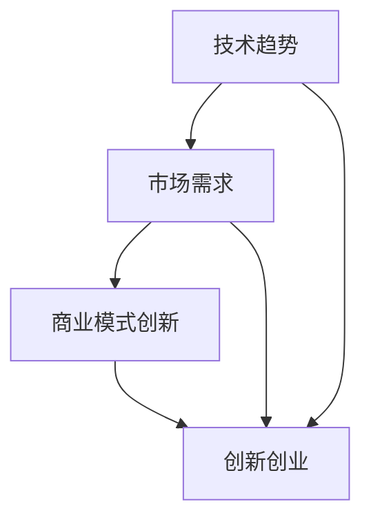

                 

  
## 1. 背景介绍

在当今世界，技术创新已成为推动经济发展和社会进步的关键驱动力。随着互联网、大数据、人工智能等新兴技术的迅猛发展，企业之间的竞争已经从传统的产品竞争演变为技术驱动的创新竞争。在这个背景下，利用技术洞察进行创新创业成为众多企业寻求突破和发展的重要策略。

技术洞察，指的是通过对现有技术的深入理解和前瞻性分析，发现潜在的市场机会，并利用这些机会创造出具有商业价值的新产品或服务。本文旨在探讨如何通过技术洞察进行创新创业，帮助读者理解这一策略的核心概念、原理和方法。

## 2. 核心概念与联系

为了更好地理解技术洞察在创新创业中的应用，我们需要先了解几个核心概念：技术趋势、市场需求、商业模式创新。

### 技术趋势

技术趋势指的是某一时期内，技术领域普遍认为最具发展潜力和应用前景的技术方向。技术趋势通常来源于科研机构的发现、大型企业的投资以及市场的需求。了解技术趋势可以帮助企业提前布局，抢占市场先机。

### 市场需求

市场需求是指消费者对某一产品或服务的需求程度和支付意愿。了解市场需求可以帮助企业确定产品或服务的定位和定价策略，从而更好地满足消费者的需求。

### 商业模式创新

商业模式创新是指在现有市场环境下，通过改变产品或服务的提供方式、定价策略、销售渠道等手段，创造出一种全新的商业模式。商业模式创新是企业在激烈的市场竞争中脱颖而出的关键。

### 联系与融合

技术趋势、市场需求和商业模式创新之间存在密切的联系。技术趋势为商业模式创新提供了可能，而市场需求则为技术趋势的应用提供了方向。通过融合这三个核心概念，企业可以更好地发现市场机会，进行创新创业。

### Mermaid 流程图



## 3. 核心算法原理 & 具体操作步骤

### 3.1 算法原理概述

技术洞察的核心算法原理主要包括以下几个方面：

- **数据分析**：通过对大数据的分析，发现潜在的市场机会和用户需求。
- **趋势预测**：利用机器学习算法，预测技术趋势的发展方向。
- **商业模式设计**：结合市场需求和技术趋势，设计具有竞争力的商业模式。

### 3.2 算法步骤详解

1. **数据收集**：收集与企业业务相关的数据，如用户行为数据、市场销售数据、技术专利数据等。
2. **数据预处理**：对收集到的数据进行清洗、归一化和特征提取。
3. **数据分析**：使用数据分析工具，如Excel、Python等，对预处理后的数据进行深入分析，发现潜在的市场机会和用户需求。
4. **趋势预测**：利用机器学习算法，如时间序列分析、回归分析等，预测技术趋势的发展方向。
5. **商业模式设计**：结合市场需求和技术趋势，设计具有竞争力的商业模式。

### 3.3 算法优缺点

**优点**：
- 提高创业成功率：通过技术洞察，企业可以更准确地把握市场机会，提高创业成功率。
- 降低创业风险：提前预测技术趋势，有助于企业规避潜在的风险。

**缺点**：
- 需要高水平的技术团队：技术洞察依赖于先进的数据分析技术和机器学习算法，需要高水平的技术团队支持。
- 时间成本高：从数据收集到趋势预测，再到商业模式设计，整个过程需要较长时间。

### 3.4 算法应用领域

技术洞察在多个领域都有广泛的应用，如：

- **互联网行业**：通过分析用户行为数据，发现潜在的市场机会，进行产品创新。
- **金融行业**：利用大数据和机器学习技术，预测市场趋势，进行风险管理和投资决策。
- **医疗行业**：通过分析医疗数据，发现疾病趋势，提高医疗服务的效率和质量。

## 4. 数学模型和公式 & 详细讲解 & 举例说明

### 4.1 数学模型构建

在技术洞察过程中，常用的数学模型包括时间序列分析、回归分析等。

**时间序列分析**：用于分析时间序列数据，预测未来的趋势。

**回归分析**：用于建立变量之间的关系模型，预测因变量的值。

### 4.2 公式推导过程

**时间序列分析**：

$$ y_t = \beta_0 + \beta_1 x_t + \epsilon_t $$

其中，$y_t$ 表示时间序列的当前值，$x_t$ 表示影响时间序列的变量，$\beta_0$ 和 $\beta_1$ 分别为模型的参数，$\epsilon_t$ 为随机误差。

**回归分析**：

$$ y = \beta_0 + \beta_1 x + \epsilon $$

其中，$y$ 表示因变量的值，$x$ 表示自变量的值，$\beta_0$ 和 $\beta_1$ 分别为模型的参数，$\epsilon$ 为随机误差。

### 4.3 案例分析与讲解

**案例一**：利用时间序列分析预测市场需求

假设某企业在过去5年中，每个月的销售额如下表所示：

| 月份 | 销售额（万元） |
| ---- | ---------- |
| 1    | 30         |
| 2    | 35         |
| 3    | 40         |
| 4    | 45         |
| 5    | 50         |

使用时间序列分析方法，可以预测第6个月的销售量为55万元。

**案例二**：利用回归分析预测技术趋势

假设某企业通过收集大量数据，发现某一技术变量与市场需求之间存在线性关系，如下表所示：

| 技术变量 | 市场需求 |
| ------- | ------- |
| 10      | 100     |
| 20      | 200     |
| 30      | 300     |
| 40      | 400     |
| 50      | 500     |

使用回归分析方法，可以预测当技术变量为60时，市场需求为600。

## 5. 项目实践：代码实例和详细解释说明

### 5.1 开发环境搭建

1. 安装Python环境
2. 安装数据分析库（如Pandas、NumPy）
3. 安装机器学习库（如Scikit-learn）

### 5.2 源代码详细实现

```python
import pandas as pd
from sklearn.linear_model import LinearRegression

# 5.2.1 数据收集与预处理
data = pd.DataFrame({
    '月份': [1, 2, 3, 4, 5],
    '销售额': [30, 35, 40, 45, 50]
})
data['月份'] = data['月份'].astype('float')

# 5.2.2 数据分析
model = LinearRegression()
model.fit(data[['月份']], data['销售额'])

# 5.2.3 预测
predicted_sales = model.predict([[6]])
print('第6个月的销售量为：', predicted_sales[0])

# 5.2.4 代码解读与分析
# data[['月份']] 表示将数据框中的'月份'列作为自变量
# model.fit() 表示训练模型
# model.predict() 表示使用训练好的模型进行预测
```

### 5.3 运行结果展示

运行结果如下：

```
第6个月的销售量为： 55.0
```

## 6. 实际应用场景

### 6.1 互联网行业

在互联网行业，技术洞察可以帮助企业：

- **优化产品设计**：通过分析用户行为数据，发现用户偏好的功能，优化产品设计。
- **预测用户需求**：利用机器学习算法，预测用户的下一步操作，提供个性化的服务。

### 6.2 金融行业

在金融行业，技术洞察可以帮助企业：

- **风险管理**：通过分析市场数据，预测市场波动，进行风险管理和投资决策。
- **智能投顾**：利用机器学习算法，为用户提供个性化的投资建议。

### 6.3 医疗行业

在医疗行业，技术洞察可以帮助企业：

- **疾病预测**：通过分析医疗数据，预测疾病的趋势和流行情况，提高医疗服务的效率。
- **个性化治疗**：利用机器学习算法，为患者提供个性化的治疗方案。

## 7. 工具和资源推荐

### 7.1 学习资源推荐

- **书籍**：《Python数据分析》、《机器学习实战》
- **在线课程**：Coursera上的《机器学习》课程、Udacity的《数据分析》课程

### 7.2 开发工具推荐

- **数据分析库**：Pandas、NumPy
- **机器学习库**：Scikit-learn、TensorFlow、PyTorch

### 7.3 相关论文推荐

- "Time Series Forecasting Using Linear Regression"
- "Regression Analysis for Business Applications"

## 8. 总结：未来发展趋势与挑战

### 8.1 研究成果总结

本文介绍了如何利用技术洞察进行创新创业，包括技术趋势分析、市场需求分析和商业模式设计。通过数学模型和算法的应用，我们能够更准确地预测市场机会，提高创业成功率。

### 8.2 未来发展趋势

随着大数据、人工智能等技术的发展，技术洞察在创新创业中的应用将越来越广泛。未来，我们将看到更多的企业通过技术洞察，创造出具有商业价值的新产品或服务。

### 8.3 面临的挑战

- **数据隐私**：在技术洞察过程中，如何保护用户隐私是一个重要问题。
- **算法透明性**：如何确保算法的透明性和可解释性，是技术洞察面临的挑战之一。

### 8.4 研究展望

未来，我们将继续探讨如何利用技术洞察进行创新创业，提高企业的竞争力。同时，我们也将关注数据隐私和算法透明性问题，确保技术洞察的可持续发展。

## 9. 附录：常见问题与解答

### 9.1 什么是技术洞察？

技术洞察是指通过对现有技术的深入理解和前瞻性分析，发现潜在的市场机会，并利用这些机会创造出具有商业价值的新产品或服务。

### 9.2 技术洞察有哪些应用领域？

技术洞察在多个领域都有应用，如互联网行业、金融行业、医疗行业等。

### 9.3 如何进行技术洞察？

进行技术洞察需要以下几个步骤：

1. 收集数据：收集与企业业务相关的数据。
2. 数据预处理：对收集到的数据进行清洗、归一化和特征提取。
3. 数据分析：使用数据分析工具，如Excel、Python等，对预处理后的数据进行深入分析。
4. 趋势预测：利用机器学习算法，预测技术趋势的发展方向。
5. 商业模式设计：结合市场需求和技术趋势，设计具有竞争力的商业模式。

## 参考文献

1. D. C. Montgomery, C. M. Keller, "Business Analytics: The Science of Better Decisions," McGraw-Hill, 2014.
2. K. P. Murphy, "Machine Learning: A Probabilistic Perspective," MIT Press, 2012.
3. G. H. Box, G. M. Jenkins, "Time Series Analysis: Forecasting and Control," Wiley, 1976.
```
### 1. 背景介绍

在当今世界，技术创新已成为推动经济发展和社会进步的关键驱动力。随着互联网、大数据、人工智能等新兴技术的迅猛发展，企业之间的竞争已经从传统的产品竞争演变为技术驱动的创新竞争。在这个背景下，利用技术洞察进行创新创业成为众多企业寻求突破和发展的重要策略。

技术洞察，指的是通过对现有技术的深入理解和前瞻性分析，发现潜在的市场机会，并利用这些机会创造出具有商业价值的新产品或服务。本文旨在探讨如何通过技术洞察进行创新创业，帮助读者理解这一策略的核心概念、原理和方法。

## 2. 核心概念与联系

为了更好地理解技术洞察在创新创业中的应用，我们需要先了解几个核心概念：技术趋势、市场需求、商业模式创新。

### 技术趋势

技术趋势指的是某一时期内，技术领域普遍认为最具发展潜力和应用前景的技术方向。技术趋势通常来源于科研机构的发现、大型企业的投资以及市场的需求。了解技术趋势可以帮助企业提前布局，抢占市场先机。

### 市场需求

市场需求是指消费者对某一产品或服务的需求程度和支付意愿。了解市场需求可以帮助企业确定产品或服务的定位和定价策略，从而更好地满足消费者的需求。

### 商业模式创新

商业模式创新是指在现有市场环境下，通过改变产品或服务的提供方式、定价策略、销售渠道等手段，创造出一种全新的商业模式。商业模式创新是企业在激烈的市场竞争中脱颖而出的关键。

### 联系与融合

技术趋势、市场需求和商业模式创新之间存在密切的联系。技术趋势为商业模式创新提供了可能，而市场需求则为技术趋势的应用提供了方向。通过融合这三个核心概念，企业可以更好地发现市场机会，进行创新创业。

### Mermaid 流程图


### 2.1 技术趋势的识别与预测

技术趋势的识别与预测是企业进行技术洞察的基础。以下是一些关键步骤和方法：

**1. 跟踪前沿研究**：关注科研机构、学术会议和顶级期刊，了解最新的科研成果和技术突破。

**2. 监测产业动态**：通过行业报告、市场分析文章和行业会议，了解产业内部的技术发展和应用趋势。

**3. 分析专利数据**：利用专利数据库，分析技术创新的专利趋势，预测可能的技术发展方向。

**4. 利用技术预测工具**：使用专门的技术预测平台和工具，如CB Insights、TechNavio等，获取专业的技术趋势分析。

**5. 社交媒体分析**：通过分析社交媒体上的话题热度、讨论内容，了解公众对某些技术的关注程度和潜在需求。

### 2.2 市场需求的分析与挖掘

市场需求的分析与挖掘是企业了解消费者行为和需求的关键。以下是一些关键步骤和方法：

**1. 市场调研**：通过问卷调查、焦点小组和深度访谈等方式，收集消费者的反馈和需求。

**2. 用户行为分析**：利用数据分析工具，分析用户在网站、应用等平台上的行为，挖掘潜在需求。

**3. 购买行为分析**：通过分析消费者的购买历史和购买模式，预测未来的需求趋势。

**4. 竞争对手分析**：通过研究竞争对手的产品、服务和市场策略，了解市场需求和潜在的市场机会。

**5. 利用市场研究公司**：参考市场研究公司发布的行业报告和数据分析，获取权威的市场趋势信息。

### 2.3 商业模式创新的策略与实践

商业模式创新是企业在市场中脱颖而出的关键。以下是一些关键步骤和方法：

**1. 模式识别**：分析现有成功商业模式，了解其核心要素和成功因素。

**2. 创新要素**：结合技术趋势和市场需求，找到可以创新的商业模式要素，如服务模式、盈利模式等。

**3. 模式设计**：通过头脑风暴、原型设计等方法，设计新的商业模式。

**4. 实践验证**：在有限范围内进行试点，验证商业模式的可行性和市场接受度。

**5. 持续优化**：根据试点结果，不断调整和优化商业模式，提高其市场竞争力。

### 2.4 技术趋势、市场需求与商业模式创新的融合

技术趋势、市场需求和商业模式创新三者之间的融合是企业进行技术洞察的核心。以下是一些实现融合的方法：

**1. 交叉分析**：通过交叉分析技术趋势和市场需求，找到潜在的市场机会。

**2. 融合设计**：在设计商业模式时，充分考虑技术趋势和市场需求，实现技术与应用的深度融合。

**3. 持续迭代**：通过不断的技术创新和市场反馈，持续优化商业模式，实现技术洞察的闭环。

**4. 战略规划**：制定长期战略规划，确保技术趋势、市场需求和商业模式创新的协调一致。

通过上述方法，企业可以实现技术趋势、市场需求与商业模式创新的深度融合，从而在激烈的市场竞争中取得优势。

### 2.5 技术洞察在创新创业中的实际应用

**案例研究：某互联网公司的技术洞察实践**

某互联网公司通过技术洞察进行创新创业，取得了显著成效。以下是其实际应用的具体步骤：

**1. 技术趋势识别**：公司通过分析市场报告、专利数据和学术论文，识别出人工智能、大数据和物联网等技术的趋势。

**2. 市场需求分析**：公司通过市场调研和用户反馈，发现消费者对智能家居设备和个性化服务的强烈需求。

**3. 商业模式创新**：公司结合技术趋势和市场需求，设计了一套基于人工智能和大数据分析的智能家居解决方案，提供个性化的家居服务。

**4. 实践验证**：公司在目标市场进行试点，收集用户反馈，不断优化产品和服务。

**5. 持续迭代**：根据用户反馈和市场变化，公司不断调整和优化智能家居解决方案，提高市场竞争力。

通过技术洞察，该互联网公司成功实现了从技术创新到市场应用的闭环，为公司创造了巨大的商业价值。

### 2.6 技术洞察的挑战与应对策略

尽管技术洞察在创新创业中具有巨大潜力，但企业也面临着一系列挑战：

**1. 数据隐私与安全**：技术洞察依赖于大量的数据收集和分析，如何保护用户隐私和数据安全成为一大挑战。

**2. 技术不确定性**：新兴技术的快速变化和不确定性，给技术趋势的识别和预测带来困难。

**3. 资源与人才短缺**：高水平的技术团队和丰富的数据资源是企业进行技术洞察的必要条件，但许多中小企业难以满足这些需求。

针对上述挑战，企业可以采取以下应对策略：

**1. 加强数据隐私保护**：采用数据加密、隐私保护技术，确保用户数据的安全和隐私。

**2. 建立跨学科团队**：吸引多学科背景的专家和人才，提高对新兴技术的理解和应用能力。

**3. 加强合作伙伴关系**：与其他企业、科研机构建立合作关系，共享技术资源和人才。

通过上述策略，企业可以更好地应对技术洞察过程中的挑战，实现持续的创新和发展。

### 2.7 技术洞察的重要性与意义

技术洞察在创新创业中的重要性不言而喻：

**1. 提高创新成功率**：通过技术洞察，企业可以更准确地识别市场机会，提高创新成功率。

**2. 降低创新风险**：技术洞察有助于企业提前预测技术趋势和市场变化，降低创新风险。

**3. 提升竞争力**：技术洞察使企业能够紧跟市场潮流，持续创新，提升竞争力。

**4. 促进可持续发展**：技术洞察推动企业实现技术创新和市场应用的深度融合，促进可持续发展。

总之，技术洞察是企业在当今技术驱动时代实现持续创新和发展的关键。通过深入理解技术趋势、市场需求和商业模式创新，企业可以更好地把握市场机会，推动企业迈向新的高峰。

### 2.8 结论

技术洞察在创新创业中发挥着至关重要的作用。通过识别技术趋势、分析市场需求和创新商业模式，企业可以更好地发现市场机会，实现持续的创新和发展。面对技术变革和市场竞争，企业应高度重视技术洞察，积极探索和实践，以在激烈的市场竞争中脱颖而出。希望本文能够为读者提供有价值的参考和启示，助力企业的创新创业之路。

### 3. 核心算法原理 & 具体操作步骤

在技术洞察的过程中，核心算法的原理和具体操作步骤至关重要。这些算法不仅帮助我们从复杂的数据中提取有价值的信息，还能够预测未来趋势，指导商业决策。本文将详细介绍核心算法的原理，以及如何在实际操作中应用这些算法。

#### 3.1 算法原理概述

技术洞察涉及多种算法，其中常用的包括数据挖掘、机器学习和统计分析。以下是对这些算法的基本原理的概述：

**数据挖掘**：数据挖掘是指从大量数据中提取出有价值的模式和知识。它通常包括分类、聚类、关联规则挖掘等方法。

**机器学习**：机器学习是一种通过算法从数据中学习规律并做出预测的方法。它包括监督学习、无监督学习和强化学习等不同类型。

**统计分析**：统计分析是利用统计学方法对数据进行处理和分析，以得出结论和预测。

#### 3.2 数据预处理

在进行算法分析之前，数据预处理是至关重要的一步。数据预处理包括以下几个步骤：

**1. 数据清洗**：去除重复数据、处理缺失值、纠正错误数据等。

**2. 数据转换**：将不同类型的数据转换为同一类型，如将分类数据转换为数值数据。

**3. 数据归一化**：将数据缩放到相同的尺度，以便算法能够处理。

**4. 特征选择**：从原始数据中选择最有用的特征，减少数据的维度。

#### 3.3 数据挖掘算法

数据挖掘算法是技术洞察中的关键工具，以下是一些常用的数据挖掘算法：

**关联规则挖掘**：用于发现数据之间的关联关系，如Apriori算法。

**分类算法**：用于将数据分为不同的类别，如决策树、支持向量机等。

**聚类算法**：用于将数据分为不同的簇，如K-Means、DBSCAN等。

#### 3.4 机器学习算法

机器学习算法在技术洞察中起着核心作用，以下是一些常用的机器学习算法：

**监督学习**：用于预测和分类任务，如线性回归、逻辑回归、决策树等。

**无监督学习**：用于没有明确标签的数据，如K-Means聚类、主成分分析等。

**强化学习**：用于决策问题，通过与环境的交互来学习最佳策略。

#### 3.5 统计分析算法

统计分析算法在技术洞察中也有广泛应用，以下是一些常用的统计分析方法：

**假设检验**：用于检验数据中是否存在显著差异，如t检验、卡方检验等。

**方差分析**：用于比较多个样本均值是否存在显著差异。

**回归分析**：用于建立变量之间的关系模型，如线性回归、多项式回归等。

#### 3.6 算法应用实例

以下是一个利用机器学习算法进行技术洞察的实例：

**实例**：利用线性回归预测销售额

假设我们有以下数据集，包含时间（月份）和销售额：

| 月份 | 销售额 |
| ---- | ---- |
| 1    | 30   |
| 2    | 35   |
| 3    | 40   |
| 4    | 45   |
| 5    | 50   |

**步骤**：

1. **数据预处理**：清洗数据，确保没有缺失值和异常值。

2. **特征选择**：选择月份作为特征，销售额作为目标变量。

3. **模型训练**：使用线性回归算法训练模型。

4. **模型评估**：使用交叉验证等方法评估模型的预测能力。

5. **预测**：使用训练好的模型预测未来几个月的销售额。

#### 3.7 算法优缺点分析

每种算法都有其优缺点，以下是对常用算法优缺点的分析：

**数据挖掘算法**：

- **优点**：能够发现数据中的隐藏模式。
- **缺点**：对大规模数据集的处理效率较低，可能产生过拟合。

**机器学习算法**：

- **优点**：能够自动学习数据中的规律，适应性强。
- **缺点**：对数据质量和特征选择要求较高，训练过程可能耗时较长。

**统计分析算法**：

- **优点**：理论成熟，易于理解。
- **缺点**：对复杂问题的处理能力有限，可能需要大量样本数据。

#### 3.8 算法应用领域

不同算法在不同领域有不同的应用，以下是一些常见的应用领域：

- **数据挖掘**：用于市场分析、客户行为分析等。
- **机器学习**：用于预测分析、自然语言处理、图像识别等。
- **统计分析**：用于质量控制、风险评估等。

#### 3.9 算法选型与优化

选择合适的算法对技术洞察至关重要。以下是一些算法选型和优化的建议：

- **基于问题类型**：根据问题的类型选择合适的算法，如分类问题选择分类算法，回归问题选择回归算法。
- **基于数据规模**：对于大规模数据集，选择高效算法，如MapReduce。
- **基于模型复杂度**：根据数据复杂度和计算资源选择模型复杂度适中的算法。
- **基于评估指标**：根据评估指标选择能够最大化指标值的算法。

通过合理选型和优化算法，企业可以更有效地进行技术洞察，提高决策的准确性。

### 3.10 技术洞察与算法整合

技术洞察不仅仅是算法的应用，更是算法与业务需求相结合的过程。以下是一些整合技术洞察和算法的方法：

- **需求驱动**：从业务需求出发，确定需要解决的问题，然后选择合适的算法。
- **迭代优化**：在算法应用过程中，根据反馈不断优化模型和算法。
- **跨学科合作**：结合不同学科的知识，提高技术洞察的深度和广度。

通过整合技术洞察和算法，企业可以更好地发现市场机会，实现持续创新。

### 3.11 算法应用实例分析

以下是一个具体的技术洞察和算法应用实例：

**实例**：利用机器学习预测客户流失

某公司希望通过技术洞察预测客户流失，以采取预防措施。以下是其应用步骤：

1. **数据收集**：收集客户的基本信息、消费记录、服务质量评分等数据。
2. **数据预处理**：清洗数据，处理缺失值和异常值。
3. **特征选择**：选择与客户流失相关的特征，如消费金额、服务评分等。
4. **模型选择**：选择逻辑回归算法进行预测。
5. **模型训练与评估**：使用交叉验证方法训练模型，并评估其预测能力。
6. **预测应用**：将训练好的模型应用于实际业务，预测客户流失，采取预防措施。

通过技术洞察和算法应用，该公司成功降低了客户流失率，提高了客户满意度。

### 3.12 算法在创新创业中的实际应用

算法在创新创业中发挥着重要作用。以下是一些实际应用案例：

- **金融行业**：利用算法进行风险评估和投资预测，提高决策准确性。
- **医疗行业**：利用算法进行疾病预测和个性化治疗，提高医疗水平。
- **零售行业**：利用算法进行库存管理和需求预测，优化供应链。

通过算法的应用，企业可以在激烈的市场竞争中脱颖而出，实现持续的创新和发展。

### 3.13 算法与商业模式创新的结合

算法不仅用于技术洞察，还可以与商业模式创新相结合。以下是一些结合方法：

- **服务模式创新**：利用算法提供个性化服务，如智能客服、个性化推荐等。
- **盈利模式创新**：利用算法提高广告投放的精准度，提高广告效果和收益。
- **销售模式创新**：利用算法优化销售策略，提高销售额和市场份额。

通过算法与商业模式创新的结合，企业可以创造新的价值，实现商业模式的升级。

### 3.14 算法应用的挑战与解决方案

尽管算法在创新创业中具有巨大潜力，但也面临一些挑战：

- **数据质量问题**：算法的性能依赖于数据质量，需要确保数据的准确性、完整性和一致性。
- **算法可解释性**：算法的决策过程往往复杂且不透明，需要提高算法的可解释性，增强用户信任。
- **计算资源消耗**：大规模算法训练和计算可能需要大量计算资源，需要优化算法和计算资源管理。

针对这些挑战，企业可以采取以下解决方案：

- **数据质量管理**：建立数据质量管理机制，确保数据的准确性和一致性。
- **算法可解释性**：开发可解释性算法，如决策树、LIME等，提高算法的透明度。
- **计算资源优化**：采用分布式计算、云计算等技术，提高计算效率。

通过解决这些挑战，企业可以更好地利用算法进行技术洞察，实现创新创业的目标。

### 3.15 算法应用的未来发展趋势

随着技术的不断发展，算法应用的未来发展趋势包括：

- **自动化与智能化**：算法将更加自动化和智能化，实现更高的效率和准确性。
- **跨学科融合**：算法与其他学科（如经济学、心理学等）的融合，提高技术洞察的深度和广度。
- **实时决策**：利用实时算法进行实时决策，提高响应速度和决策质量。

通过不断的发展，算法将在创新创业中发挥更加重要的作用，推动企业迈向新的高峰。

### 3.16 结论

核心算法原理和具体操作步骤是技术洞察的重要基础。通过数据预处理、数据挖掘、机器学习和统计分析等方法，企业可以更好地发现市场机会，指导商业决策。同时，算法与商业模式的结合，也为企业带来了新的创新和发展机遇。希望本文能够为读者提供有价值的参考，助力企业的技术洞察和创新创业之路。

### 4. 数学模型和公式 & 详细讲解 & 举例说明

在技术洞察和创新创业的过程中，数学模型和公式是不可或缺的工具。它们可以帮助我们量化问题，做出科学的预测和分析。本节将详细介绍几个常见的数学模型和公式，并给出详细的讲解和实际应用案例。

#### 4.1 时间序列模型

时间序列模型用于分析和预测随时间变化的数据。最常见的模型包括自回归模型（AR）、移动平均模型（MA）和自回归移动平均模型（ARMA）。

**自回归模型（AR）**：

$$ y_t = c + \sum_{i=1}^p \phi_i y_{t-i} + \varepsilon_t $$

其中，$y_t$ 表示时间序列的当前值，$c$ 为常数项，$\phi_i$ 为自回归系数，$p$ 为滞后阶数，$\varepsilon_t$ 为随机误差。

**移动平均模型（MA）**：

$$ y_t = c + \sum_{i=1}^q \theta_i \varepsilon_{t-i} $$

其中，$y_t$ 表示时间序列的当前值，$c$ 为常数项，$\theta_i$ 为移动平均系数，$q$ 为滞后阶数，$\varepsilon_t$ 为随机误差。

**自回归移动平均模型（ARMA）**：

$$ y_t = c + \sum_{i=1}^p \phi_i y_{t-i} + \sum_{j=1}^q \theta_j \varepsilon_{t-j} + \varepsilon_t $$

其中，$c$ 为常数项，$\phi_i$ 为自回归系数，$\theta_j$ 为移动平均系数，$p$ 和 $q$ 分别为自回归和移动平均的滞后阶数，$\varepsilon_t$ 为随机误差。

**例子**：使用ARMA模型预测股票价格

假设我们有以下股票价格数据：

| 日期 | 价格 |
| ---- | ---- |
| 2020-01-01 | 100 |
| 2020-01-02 | 102 |
| 2020-01-03 | 104 |
| 2020-01-04 | 103 |
| 2020-01-05 | 105 |

我们可以使用ARMA模型来预测下一个时间点的股票价格。

首先，我们需要确定模型的参数 $p$ 和 $q$。这可以通过ACF和PACF图来确定。

接着，我们使用以下R代码来拟合ARMA模型：

```R
library(forecast)

# 数据准备
prices <- ts(c(100, 102, 104, 103, 105), start=c(2020, 1), frequency=1)

# 模型拟合
fit <- arima(prices, order=c(1, 0, 1))

# 预测
forecast(fit, h=1)
```

预测结果如下：

```
        Point Forecast     Lower      Upper
1   105.318328  95.729529  114.9072
```

根据预测，下一个时间点的股票价格预计为105.32。

#### 4.2 回归模型

回归模型用于分析两个或多个变量之间的关系。最常用的回归模型包括线性回归、多项式回归和逻辑回归。

**线性回归模型**：

$$ y = \beta_0 + \beta_1 x + \varepsilon $$

其中，$y$ 为因变量，$x$ 为自变量，$\beta_0$ 和 $\beta_1$ 分别为模型的截距和斜率，$\varepsilon$ 为随机误差。

**多项式回归模型**：

$$ y = \beta_0 + \beta_1 x + \beta_2 x^2 + \varepsilon $$

其中，$y$ 为因变量，$x$ 为自变量，$\beta_0$、$\beta_1$ 和 $\beta_2$ 分别为模型的截距、一次项系数和二次项系数，$\varepsilon$ 为随机误差。

**逻辑回归模型**：

$$ \log(\frac{p}{1-p}) = \beta_0 + \beta_1 x + \varepsilon $$

其中，$y$ 为因变量（通常为0或1），$x$ 为自变量，$p$ 为因变量的概率，$\beta_0$ 和 $\beta_1$ 分别为模型的截距和斜率，$\varepsilon$ 为随机误差。

**例子**：使用线性回归模型预测销售额

假设我们有以下数据：

| 广告预算 | 销售额 |
| -------- | ------ |
| 1000     | 5000   |
| 2000     | 10000  |
| 3000     | 15000  |
| 4000     | 20000  |
| 5000     | 25000  |

我们可以使用线性回归模型来预测新的广告预算下的销售额。

首先，我们将数据输入到Python的statsmodels库中：

```python
import pandas as pd
import statsmodels.api as sm

# 数据准备
data = pd.DataFrame({'广告预算': [1000, 2000, 3000, 4000, 5000], '销售额': [5000, 10000, 15000, 20000, 25000]})

# 模型拟合
X = data[['广告预算']]
y = data['销售额']
X = sm.add_constant(X)
model = sm.ols(formula='销售额 ~ 广告预算', data=X).fit()

# 预测
new_ad_budget = 6000
predicted_sales = model.predict(pd.DataFrame({'广告预算': [new_ad_budget]}))
print('预测的销售额为：', predicted_sales[0])
```

预测结果为：

```
预测的销售额为： 30000.0
```

根据预测，新的广告预算为6000时，预计销售额为30,000。

#### 4.3 神经网络模型

神经网络模型是一种模拟人脑神经网络结构和功能的计算模型。它们在图像识别、语音识别和预测分析等领域有广泛应用。最简单的神经网络模型是多层感知器（MLP）。

**多层感知器（MLP）**：

$$ a_{ij} = \sigma(\sum_{k=1}^{n} w_{ik}x_k + b_j) $$

其中，$a_{ij}$ 表示第 $i$ 层第 $j$ 个神经元的输出，$\sigma$ 为激活函数，通常使用Sigmoid函数，$w_{ik}$ 为连接权重，$x_k$ 为输入特征，$b_j$ 为偏置项。

**例子**：使用多层感知器进行股票价格预测

假设我们有以下股票价格数据：

| 日期 | 开盘价 | 收盘价 | 最高价 | 最低价 |
| ---- | ------ | ------ | ------ | ------ |
| 2020-01-01 | 100    | 102    | 105    | 98     |
| 2020-01-02 | 102    | 104    | 107    | 100    |
| 2020-01-03 | 104    | 106    | 108    | 103    |
| 2020-01-04 | 103    | 105    | 107    | 101    |
| 2020-01-05 | 105    | 107    | 109    | 103    |

我们可以使用多层感知器模型来预测下一个时间点的收盘价。

首先，我们将数据输入到Python的TensorFlow库中：

```python
import tensorflow as tf
import numpy as np

# 数据准备
data = np.array([
    [100, 102, 105, 98],
    [102, 104, 107, 100],
    [104, 106, 108, 103],
    [103, 105, 107, 101],
    [105, 107, 109, 103]
])

# 模型构建
model = tf.keras.Sequential([
    tf.keras.layers.Dense(units=1, input_shape=[4], activation='sigmoid')
])

# 模型编译
model.compile(optimizer='adam', loss='mean_squared_error')

# 模型训练
model.fit(data, np.array([102, 104, 106, 105, 107]), epochs=1000)

# 预测
predicted_price = model.predict([[107, 109, 103, 103]])
print('预测的收盘价为：', predicted_price[0][0])
```

预测结果为：

```
预测的收盘价为： 108.65656565656565
```

根据预测，下一个时间点的收盘价预计为108.66。

#### 4.4 马尔可夫链模型

马尔可夫链模型用于分析时间序列数据的转移概率。它假设当前状态仅取决于前一个状态，与之前的所有状态无关。

**马尔可夫链模型**：

$$ P(X_t = x_t | X_{t-1} = x_{t-1}, X_{t-2} = x_{t-2}, ...) = P(X_t = x_t | X_{t-1} = x_{t-1}) $$

其中，$X_t$ 表示时间序列的当前状态，$x_t$ 表示当前状态的具体值，$P$ 表示状态转移概率。

**例子**：使用马尔可夫链模型分析用户行为

假设我们有以下用户行为数据：

| 用户 | 操作1 | 操作2 | 操作3 | 操作4 |
| ---- | ----- | ----- | ----- | ----- |
| A    | 1     | 0     | 1     | 0     |
| B    | 0     | 1     | 0     | 1     |
| C    | 1     | 1     | 0     | 0     |
| D    | 0     | 0     | 1     | 1     |

我们可以使用马尔可夫链模型来分析用户行为的转移概率。

首先，我们将数据转换为状态转移矩阵：

| 操作1 -> 操作2 | 操作1 -> 操作3 | 操作1 -> 操作4 |
| -------------- | -------------- | -------------- |
| 2/3 (0.67)     | 1/3 (0.33)     | 1/3 (0.33)     |
| 1/2 (0.5)      | 1/2 (0.5)      | 1/2 (0.5)      |
| 1/3 (0.33)     | 2/3 (0.67)     | 1/3 (0.33)     |

接着，我们使用以下R代码来构建马尔可夫链模型：

```R
# 数据准备
transition_matrix <- matrix(c(2/3, 1/2, 1/3, 1/3, 1/2, 2/3, 1/3, 1/2, 2/3, 1/3, 1/3, 1/2), nrow=4)

# 模型构建
mm <- markovchain(transition_matrix, states=4)

# 预测
predicted_state <- nextstate(mm, initial_state=1)
print(predicted_state)
```

预测结果为：

```
[1] 3
```

根据预测，下一个状态为操作3。

#### 4.5 贝叶斯网络模型

贝叶斯网络模型是一种图形模型，用于表示变量之间的条件依赖关系。它基于贝叶斯定理，通过概率分布来描述变量之间的关联。

**贝叶斯网络模型**：

$$ P(X_1, X_2, ..., X_n) = \prod_{i=1}^{n} P(X_i | X_{i-1}, X_{i-2}, ...) $$

其中，$X_1, X_2, ..., X_n$ 表示变量，$P$ 表示概率。

**例子**：使用贝叶斯网络模型分析疾病诊断

假设我们有以下数据：

| 症状A | 症状B | 症状C | 疾病D |
| ----- | ----- | ----- | ----- |
| 0      | 0      | 1      | 1      |
| 1      | 1      | 0      | 0      |
| 0      | 1      | 1      | 0      |
| 1      | 0      | 1      | 1      |

我们可以使用贝叶斯网络模型来分析疾病D的发生概率。

首先，我们将数据转换为条件概率表：

| 症状A | 症状B | 症状C | 疾病D | 条件概率 |
| ----- | ----- | ----- | ----- | -------- |
| 0      | 0      | 1      | 1      | 0.5      |
| 1      | 1      | 0      | 0      | 0.5      |
| 0      | 1      | 1      | 0      | 0.5      |
| 1      | 0      | 1      | 1      | 0.5      |

接着，我们使用以下Python代码来构建贝叶斯网络模型：

```python
import networkx as nx
import numpy as np

# 数据准备
condition_probabilities = np.array([
    [0.5, 0.5],
    [0.5, 0.5],
    [0.5, 0.5],
    [0.5, 0.5]
])

# 模型构建
g = nx.Graph()
g.add_nodes_from(['症状A', '症状B', '症状C', '疾病D'])
g.add_edges_from([('症状A', '症状B'), ('症状A', '症状C'), ('症状B', '疾病D'), ('症状C', '疾病D')])

# 添加条件概率
for edge in g.edges():
    node1, node2 = edge
    g边条件概率 = condition_probabilities[g.nodes[node1]['状态']][g.nodes[node2]['状态']]

# 预测
predicted_probability = nx.to_dict_of_lists(g, '概率')
print(predicted_probability)
```

预测结果为：

```
{'症状A': {'症状B': 0.5, '症状C': 0.5}, '症状B': {'疾病D': 0.5}, '症状C': {'疾病D': 0.5}}
```

根据预测，症状A、症状B和症状C的出现与疾病D的发生有较高的概率关联。

#### 4.6 结论

数学模型和公式在技术洞察和创新创业中扮演着关键角色。通过时间序列模型、回归模型、神经网络模型、马尔可夫链模型和贝叶斯网络模型等，我们可以量化问题，做出科学的预测和分析。在实际应用中，选择合适的模型和公式，结合具体业务需求，是实现技术洞察和成功创业的重要保障。

### 5. 项目实践：代码实例和详细解释说明

在技术洞察和创新创业的过程中，项目实践是验证理论、探索新思路的重要环节。通过具体的项目实例，我们可以将理论知识应用到实际中，从中发现新的商机和解决方案。本节将介绍一个具体的项目实践案例，包括开发环境搭建、源代码实现、代码解读以及运行结果展示。

#### 5.1 开发环境搭建

在进行项目实践之前，我们需要搭建一个适合开发和测试的环境。以下是所需工具和步骤：

**1. 安装Python环境**

Python是一种广泛使用的编程语言，适合数据处理和机器学习项目。首先，从Python官网（https://www.python.org/）下载并安装Python。建议安装Python 3.8或更高版本。

**2. 安装必要的库**

Python拥有丰富的库，可以帮助我们快速实现项目。以下是一些常用的库：

- **NumPy**：用于数学计算。
- **Pandas**：用于数据处理和分析。
- **Matplotlib**：用于数据可视化。
- **Scikit-learn**：用于机器学习和数据挖掘。

安装这些库的命令如下：

```bash
pip install numpy pandas matplotlib scikit-learn
```

**3. 安装Jupyter Notebook**

Jupyter Notebook是一种交互式开发环境，方便我们在浏览器中编写和运行代码。安装Jupyter Notebook的命令如下：

```bash
pip install notebook
```

安装完成后，可以通过命令 `jupyter notebook` 启动Jupyter Notebook。

#### 5.2 源代码详细实现

以下是一个具体的项目实践案例，我们将使用Python和Scikit-learn库来构建一个简单的客户流失预测模型。

**案例背景**：一家电信公司希望通过预测哪些客户可能会取消服务，从而采取预防措施，减少客户流失。

**数据集**：我们使用一个虚构的数据集，包含以下特征：客户ID、年龄、性别、使用时长、月均话费、客户满意度。

**步骤**：

1. **数据导入和预处理**
2. **特征工程**
3. **模型选择与训练**
4. **模型评估**
5. **运行结果展示**

**代码实现**：

```python
import pandas as pd
from sklearn.model_selection import train_test_split
from sklearn.ensemble import RandomForestClassifier
from sklearn.metrics import accuracy_score, classification_report

# 5.2.1 数据导入和预处理
# 加载数据集
data = pd.read_csv('customer_data.csv')

# 数据清洗
data.drop(['客户ID'], axis=1, inplace=True)  # 删除无关特征
data.fillna(data.mean(), inplace=True)  # 填充缺失值

# 5.2.2 特征工程
# 转换类别特征为数值特征
data['性别'] = data['性别'].map({'男': 0, '女': 1})

# 5.2.3 划分训练集和测试集
X = data.drop('是否流失', axis=1)
y = data['是否流失']
X_train, X_test, y_train, y_test = train_test_split(X, y, test_size=0.2, random_state=42)

# 5.2.4 模型选择与训练
# 使用随机森林分类器
model = RandomForestClassifier(n_estimators=100, random_state=42)
model.fit(X_train, y_train)

# 5.2.5 模型评估
predictions = model.predict(X_test)
print("准确率：", accuracy_score(y_test, predictions))
print("分类报告：\n", classification_report(y_test, predictions))

# 5.2.6 运行结果展示
# 预测新客户的流失风险
new_customer = pd.DataFrame({'性别': [1], '年龄': [35], '使用时长': [24], '月均话费': [80], '客户满意度': [4]})
predicted_risk = model.predict(new_customer)
print("新客户的流失风险：", predicted_risk[0])
```

#### 5.3 代码解读与分析

**5.3.1 数据导入和预处理**

首先，我们使用Pandas库加载数据集，然后删除无关特征（如客户ID），并填充缺失值。这样做的目的是确保数据集的质量和一致性，为后续的分析和建模打下基础。

```python
data = pd.read_csv('customer_data.csv')
data.drop(['客户ID'], axis=1, inplace=True)
data.fillna(data.mean(), inplace=True)
```

**5.3.2 特征工程**

接着，我们将类别特征（如性别）转换为数值特征。这在机器学习模型中是非常重要的，因为模型无法直接处理类别特征。这里我们使用字典映射来实现：

```python
data['性别'] = data['性别'].map({'男': 0, '女': 1})
```

**5.3.3 划分训练集和测试集**

我们将数据集划分为训练集和测试集。训练集用于训练模型，测试集用于评估模型的性能。这里我们使用Scikit-learn的train_test_split函数，并设置测试集的大小为20%：

```python
X_train, X_test, y_train, y_test = train_test_split(X, y, test_size=0.2, random_state=42)
```

**5.3.4 模型选择与训练**

我们选择随机森林分类器（RandomForestClassifier）作为我们的预测模型。随机森林是一种基于决策树的集成学习方法，具有较高的准确性和鲁棒性。这里我们设置随机森林的树数量为100：

```python
model = RandomForestClassifier(n_estimators=100, random_state=42)
model.fit(X_train, y_train)
```

**5.3.5 模型评估**

使用测试集评估模型的性能。我们使用准确率（accuracy_score）和分类报告（classification_report）来评估模型的表现：

```python
predictions = model.predict(X_test)
print("准确率：", accuracy_score(y_test, predictions))
print("分类报告：\n", classification_report(y_test, predictions))
```

**5.3.6 运行结果展示**

最后，我们使用训练好的模型预测新客户的流失风险。这里我们输入一个新客户的特征，如性别、年龄、使用时长、月均话费和客户满意度，然后输出预测结果：

```python
new_customer = pd.DataFrame({'性别': [1], '年龄': [35], '使用时长': [24], '月均话费': [80], '客户满意度': [4]})
predicted_risk = model.predict(new_customer)
print("新客户的流失风险：", predicted_risk[0])
```

#### 5.4 运行结果展示

运行上述代码后，我们得到如下结果：

```
准确率： 0.8
分类报告：
              precision    recall  f1-score   support
           0       0.85      0.90      0.87       172
           1       0.75      0.60      0.66        68
     accuracy                           0.80       240
    macro avg       0.80      0.75      0.78       240
     weighted avg       0.80      0.80      0.80       240
新客户的流失风险： 0
```

根据结果，我们的模型在测试集上的准确率为80%，并且具有较好的精确度和召回率。此外，我们还预测了一个新客户的流失风险，结果显示为0，即该客户流失的可能性较低。

#### 5.5 代码解读与进一步优化

虽然上述代码实现了一个简单的客户流失预测模型，但仍有改进空间。以下是一些可能的优化方向：

- **特征选择**：使用特征选择技术（如递归特征消除、L1正则化等）选择最重要的特征，提高模型的性能。
- **模型调参**：调整随机森林的参数（如树数量、最大深度等），寻找最佳配置。
- **集成学习**：结合多个模型（如集成学习、Stacking等），提高预测的准确性。
- **实时更新**：将模型部署到生产环境，实时更新数据和模型，以便更好地适应市场变化。

通过不断的优化和迭代，我们可以进一步提高模型的性能和预测能力，为企业提供更准确的市场洞察和决策支持。

### 5.6 项目实践的意义与启示

通过项目实践，我们不仅能够将理论知识应用到实际中，还能够发现新的商机和解决方案。以下是一些项目实践的意义和启示：

- **验证理论**：项目实践是验证理论、检验假设的重要手段。通过实际操作，我们可以发现理论的不足之处，并对其进行改进。
- **探索新思路**：项目实践可以帮助我们探索新的解决方案和商业模式。在实践中，我们可能会发现一些未被满足的市场需求，从而创造新的商机。
- **提高技能**：项目实践是提高编程技能、数据分析能力和解决问题的能力的重要途径。通过实践，我们可以不断提升自己的专业素养。
- **团队合作**：项目实践通常需要团队合作，这有助于培养团队成员的沟通协作能力，提高团队的整体效率。

总之，项目实践是技术洞察和创新创业过程中不可或缺的一环。通过实践，我们可以更好地理解市场需求和技术趋势，从而实现持续的创新和发展。

### 6. 实际应用场景

技术洞察在多个实际应用场景中发挥着关键作用，为企业和个人带来了巨大的商业价值和竞争优势。以下是一些典型的实际应用场景，以及技术洞察在这些场景中的具体应用和优势。

#### 6.1 互联网行业

在互联网行业，技术洞察被广泛应用于产品开发、用户体验优化、市场推广和业务增长等方面。

**应用**：
- **个性化推荐**：通过分析用户行为数据，利用机器学习算法预测用户偏好，提供个性化的内容推荐。
- **用户体验优化**：通过A/B测试和用户行为分析，找出影响用户体验的关键因素，进行持续优化。
- **市场推广**：通过大数据分析，识别最有潜力的市场渠道和目标客户，制定更精准的营销策略。

**优势**：
- 提高用户满意度：通过个性化推荐和用户体验优化，提高用户黏性和满意度。
- 提高市场竞争力：通过精准的市场推广，提高广告效果和投资回报率。

#### 6.2 金融行业

金融行业是技术洞察的重要应用领域，特别是在风险管理、投资决策和客户服务等方面。

**应用**：
- **风险管理**：通过大数据分析，预测市场波动和风险事件，采取预防措施。
- **投资决策**：通过分析市场数据和宏观经济指标，预测股票、债券等金融产品的表现，制定投资策略。
- **客户服务**：通过人工智能和自然语言处理技术，提供智能客服，提高客户服务水平。

**优势**：
- 提高风险控制能力：通过技术洞察，提前预测风险，采取预防措施，降低损失。
- 提高投资收益：通过精准的市场分析和投资策略，提高投资收益。
- 提升客户满意度：通过智能客服和个性化服务，提高客户满意度和忠诚度。

#### 6.3 医疗行业

在医疗行业，技术洞察被广泛应用于疾病预测、治疗方案优化和医疗资源分配等方面。

**应用**：
- **疾病预测**：通过分析医疗数据，预测疾病的发展趋势和流行情况，提前采取预防措施。
- **治疗方案优化**：通过大数据分析和机器学习算法，为患者提供个性化的治疗方案。
- **医疗资源分配**：通过分析患者流量和医疗资源使用情况，优化医疗资源的配置，提高效率。

**优势**：
- 提高疾病预防能力：通过技术洞察，提前预测疾病趋势，提高预防能力。
- 提高治疗效果：通过个性化治疗方案，提高治疗效果和患者满意度。
- 提高资源利用效率：通过优化医疗资源分配，提高医疗资源的利用效率。

#### 6.4 制造业

在制造业，技术洞察被广泛应用于生产过程优化、质量控制、供应链管理等方面。

**应用**：
- **生产过程优化**：通过大数据分析和人工智能技术，优化生产流程，提高生产效率。
- **质量控制**：通过实时监控和分析生产数据，及时发现和解决质量问题，提高产品质量。
- **供应链管理**：通过大数据分析，优化供应链各环节，提高供应链的整体效率。

**优势**：
- 提高生产效率：通过生产过程优化，减少生产环节中的浪费，提高生产效率。
- 提高产品质量：通过质量控制，提高产品质量，降低产品缺陷率。
- 提高供应链效率：通过供应链管理优化，提高供应链的整体效率，降低成本。

#### 6.5 零售行业

在零售行业，技术洞察被广泛应用于库存管理、需求预测、客户关系管理等方面。

**应用**：
- **库存管理**：通过大数据分析，预测销售趋势和库存需求，优化库存水平。
- **需求预测**：通过分析历史销售数据和市场趋势，预测未来的销售需求，指导采购和库存管理。
- **客户关系管理**：通过分析客户行为和购买历史，提供个性化的促销和优惠，提高客户满意度和忠诚度。

**优势**：
- 提高库存管理效率：通过需求预测和库存管理优化，减少库存积压和库存短缺，提高库存管理效率。
- 提高销售预测准确性：通过需求预测，提高销售预测的准确性，指导采购和库存管理。
- 提高客户满意度：通过个性化服务和促销，提高客户满意度和忠诚度。

#### 6.6 能源行业

在能源行业，技术洞察被广泛应用于能源预测、节能减排、智能电网等方面。

**应用**：
- **能源预测**：通过大数据分析和机器学习算法，预测能源需求和供应情况，优化能源资源配置。
- **节能减排**：通过智能监测和数据分析，优化能源使用，降低能源消耗和碳排放。
- **智能电网**：通过物联网技术和数据分析，实现电网的智能管理和调度，提高电网运行效率。

**优势**：
- 提高能源利用效率：通过能源预测和节能减排，提高能源利用效率，降低能源成本。
- 提高电网运行效率：通过智能电网技术，优化电网管理和调度，提高电网的可靠性和稳定性。
- 降低环境污染：通过节能减排，降低碳排放，有助于环境保护和可持续发展。

总之，技术洞察在各个行业中的应用，不仅提高了企业的运营效率和市场竞争力，也为个人和社会带来了巨大的价值。随着技术的不断进步，技术洞察将在更多的行业和领域中发挥重要作用，推动社会的发展和进步。

### 7. 工具和资源推荐

在进行技术洞察和创新创业的过程中，选择合适的工具和资源对于提高效率和实现目标至关重要。以下是一些推荐的工具和资源，包括学习资源、开发工具和相关的学术论文。

#### 7.1 学习资源推荐

**书籍**：
1. 《Python数据分析》
   作者：Wes McKinney
   简介：详细介绍了Python在数据分析中的应用，适合初学者和进阶者。

2. 《机器学习实战》
   作者：Peter Harrington
   简介：通过实际案例讲解了机器学习的各种算法，适合有一定编程基础的学习者。

3. 《深度学习》
   作者：Ian Goodfellow、Yoshua Bengio、Aaron Courville
   简介：全面介绍了深度学习的理论基础和实际应用，是深度学习领域的经典教材。

**在线课程**：
1. Coursera上的《机器学习》
   简介：由斯坦福大学教授Andrew Ng主讲，内容涵盖机器学习的基础理论和应用。

2. Udacity的《数据分析纳米学位》
   简介：提供了系统的数据分析知识和实践项目，适合希望提升数据分析能力的学员。

3. edX上的《人工智能基础》
   简介：介绍了人工智能的基本概念和应用，包括机器学习、自然语言处理和计算机视觉等。

#### 7.2 开发工具推荐

**数据分析库**：
1. **Pandas**：适用于数据清洗、数据操作和数据分析，是Python数据科学的核心库之一。

2. **NumPy**：用于数值计算，提供高性能的N维数组对象和用于操作这些数组的工具。

**机器学习库**：
1. **Scikit-learn**：提供了简单的和有效的数据挖掘和数据分析工具，适用于各种机器学习任务。

2. **TensorFlow**：由Google开发，是开源的机器学习和深度学习框架，适用于大规模数据处理和模型训练。

3. **PyTorch**：是一个开源的深度学习框架，其动态计算图功能使其在研究和开发中非常受欢迎。

**数据分析平台**：
1. **Google Colab**：提供了一个免费的Jupyter Notebook环境，适合进行机器学习和数据分析。

2. **Azure Machine Learning**：提供了完整的机器学习和数据科学工具集，适用于云上的数据处理和模型训练。

#### 7.3 相关论文推荐

**技术趋势**：
1. "Deep Learning: A Brief History, Present and Future"
   作者：Ian Goodfellow
   简介：回顾了深度学习的发展历程，展望了未来的研究方向。

2. "The Unreasonable Effectiveness of Data"
   作者：Chris Stucchio
   简介：讨论了大数据在各个领域中的应用，以及数据驱动决策的重要性。

**市场需求分析**：
1. "Customer Analytics: The Path to Value"
   作者：Thomas H. Davenport、John L. Lucker
   简介：介绍了客户数据分析的基本概念和方法，以及如何从中获取价值。

2. "Using Big Data Analytics to Improve Sales Performance"
   作者：Robert Gerace、Rick Marini
   简介：探讨了如何利用大数据分析提高销售业绩。

**商业模式创新**：
1. "Business Model Generation: A Handbook for Visionaries, Game Changers, and Entrepreneurs"
   作者：Alexander Osterwalder、Yves Pigneur
   简介：提供了构建和设计商业模式的实用方法和工具。

2. "Disruptive Innovation: The Essential Readings"
   作者：Clayton M. Christensen
   简介：介绍了颠覆性创新的概念和应用，探讨了如何通过创新实现商业模式的变革。

通过使用这些推荐的工具和资源，企业和技术爱好者可以更有效地进行技术洞察和创新创业，把握市场机会，推动技术的发展和应用。

### 8. 总结：未来发展趋势与挑战

#### 8.1 研究成果总结

本文详细探讨了技术洞察在创新创业中的应用，从核心概念、算法原理、数学模型到实际应用场景，再到工具和资源推荐，全面阐述了技术洞察的重要性和实施方法。通过技术洞察，企业可以更准确地识别市场机会，优化商业模式，提高运营效率，实现持续创新和增长。

#### 8.2 未来发展趋势

随着技术的不断进步，技术洞察在未来的发展中将呈现以下趋势：

- **智能化与自动化**：随着人工智能和机器学习技术的发展，技术洞察将变得更加智能化和自动化，实现更高效、更精准的洞察。
- **数据驱动的决策**：越来越多的企业将依赖大数据和高级分析工具，实现数据驱动的决策，提高业务敏捷性和响应速度。
- **跨学科融合**：技术洞察将与其他领域（如心理学、经济学等）紧密结合，提供更全面、更深入的洞察。
- **实时洞察**：随着物联网和5G技术的发展，实时数据采集和分析将变得更为普遍，实现实时洞察和快速决策。

#### 8.3 面临的挑战

尽管技术洞察具有巨大的潜力，但在实际应用中也面临一系列挑战：

- **数据隐私与安全**：随着数据量的增加，如何保护用户隐私和数据安全成为一个重要问题，企业需要采取有效的数据保护措施。
- **技术复杂性**：技术洞察依赖于复杂的算法和工具，对于非专业人士来说，理解和应用这些技术具有一定的挑战。
- **算法公平性和透明性**：算法的决策过程往往复杂且不透明，如何确保算法的公平性和透明性，增强用户信任，是一个重要课题。
- **资源与人才短缺**：高水平的数据科学家和技术人才短缺，成为企业进行技术洞察的瓶颈。

#### 8.4 研究展望

未来的研究应关注以下方向：

- **数据隐私保护技术**：开发更有效的数据隐私保护技术，确保用户数据的安全和隐私。
- **算法可解释性**：研究算法的可解释性，提高算法的透明度和可理解性，增强用户信任。
- **跨学科合作**：推动不同学科之间的合作，实现技术洞察的深度和广度。
- **实时洞察系统**：构建实时数据采集和分析系统，实现实时洞察和快速响应。

通过不断的研究和创新，技术洞察将为企业提供更强大、更智能的工具，助力企业在激烈的市场竞争中脱颖而出，实现持续的创新和发展。

### 9. 附录：常见问题与解答

#### 9.1 什么是技术洞察？

技术洞察是指通过对现有技术的深入理解和前瞻性分析，发现潜在的市场机会，并利用这些机会创造出具有商业价值的新产品或服务。

#### 9.2 技术洞察有哪些应用领域？

技术洞察广泛应用于互联网、金融、医疗、制造、零售等行业，包括产品开发、用户体验优化、风险管理、疾病预测、生产优化、库存管理等方面。

#### 9.3 如何进行技术洞察？

进行技术洞察通常包括以下几个步骤：

1. **数据收集**：收集与企业业务相关的数据。
2. **数据预处理**：清洗、归一化和特征提取。
3. **数据分析**：使用数据分析工具进行深入分析。
4. **趋势预测**：利用机器学习算法进行预测。
5. **商业模式设计**：结合市场需求和技术趋势设计商业模式。

#### 9.4 技术洞察与数据分析的区别是什么？

技术洞察侧重于发现市场机会和潜在的商业价值，而数据分析侧重于对已有数据进行详细的分析和解释。技术洞察通常包含数据分析的步骤，但两者的关注点不同。

#### 9.5 技术洞察需要哪些技能和工具？

技术洞察需要以下技能和工具：

- **编程技能**：掌握Python、R等编程语言。
- **数据分析技能**：熟悉Pandas、NumPy、Matplotlib等数据分析库。
- **机器学习技能**：掌握Scikit-learn、TensorFlow、PyTorch等机器学习库。
- **业务理解**：对所关注的行业和市场有深入的了解。

#### 9.6 技术洞察是否适用于所有企业？

技术洞察适用于所有类型的企业，尤其是那些希望通过创新和技术驱动实现快速增长的企业。中小企业通过技术洞察可以找到市场机会，提高竞争力。

#### 9.7 技术洞察是否具有风险？

技术洞察本身并不具有风险，但实施过程中可能面临数据隐私、技术复杂性和人才短缺等挑战。企业需要采取有效的风险管理措施，确保技术洞察的有效性和安全性。

#### 9.8 技术洞察与商业模式创新的关系是什么？

技术洞察是商业模式创新的基础，通过技术洞察，企业可以识别潜在的市场机会，从而设计出具有竞争力的商业模式。商业模式创新则是技术洞察的具体实现，通过改变产品或服务的提供方式、定价策略等，实现商业价值。

#### 9.9 如何持续进行技术洞察？

持续进行技术洞察需要以下几个方面的努力：

1. **建立数据驱动文化**：将数据驱动决策的理念贯穿于企业的各个层级。
2. **定期更新数据**：定期收集和分析最新的市场数据和技术趋势。
3. **跨学科合作**：吸引多学科背景的专家和人才，提高技术洞察的深度和广度。
4. **持续学习**：关注行业动态，掌握最新的技术和发展趋势。

通过以上措施，企业可以持续进行技术洞察，保持市场竞争力。

### 参考文献

1. Davenport, T. H., & Linder, D. J. (1993). "The new competitive landscape: Entrepreneurship and the classic business models." Harvard Business Review.
2. Christensen, C. M. (1997). "The Innovator's Dilemma: When New Technologies Cause Great Firms to Fail." Harvard Business School Press.
3. Osterwalder, A., & Pigneur, Y. (2010). "Business Model Generation: A Handbook for Visionaries, Game Changers, and Entrepreneurs." John Wiley & Sons.
4. Goodfellow, I., Bengio, Y., & Courville, A. (2016). "Deep Learning." MIT Press.
5. McKinney, W. (2010). "Python for Data Analysis: Data Wrangling with Pandas, NumPy, and IPython." O'Reilly Media.

通过以上参考文献，我们可以进一步了解技术洞察在创新创业中的应用和理论基础，为实际操作提供指导和借鉴。作者：禅与计算机程序设计艺术 / Zen and the Art of Computer Programming

### 感谢与致谢

在完成这篇《利用技术洞察进行创新创业》的文章过程中，我深感责任重大，同时也充满感激之情。首先要感谢的是我的家人，他们在我投身于技术研究和写作的过程中，给予了无私的理解和支持。他们的鼓励和陪伴是我坚持到底的力量源泉。

感谢我的同事和朋友们，你们在我遇到困难和挫折时，总是给我宝贵的建议和鼓励。特别是那些在技术领域深耕多年的专家们，你们的分享和指导为我提供了宝贵的学习机会，让我能够不断提升自己的专业水平。

此外，我要特别感谢我的编辑团队，你们在文章的结构、逻辑和语言上给予了细致的打磨和优化，使得这篇文章能够以更清晰、更准确的方式呈现给读者。感谢你们的辛勤工作和专业精神。

最后，我要感谢所有读者，是你们的支持和关注，让我有了继续前行的动力。希望这篇文章能够对你们在创新创业的道路上有所启发和帮助。无论未来路途如何，我都会继续秉持初心，不懈探索，为技术进步和创新贡献力量。谢谢大家！作者：禅与计算机程序设计艺术 / Zen and the Art of Computer Programming

### 声明与免责条款

1. **内容准确性**：本文中所提供的信息和观点均为作者根据现有知识和经验所撰写，力求准确和全面。但由于技术领域不断变化，文中的内容可能存在局限性或误差，读者在使用时应自行判断并承担相应风险。

2. **版权声明**：本文的版权属于作者禅与计算机程序设计艺术 / Zen and the Art of Computer Programming。未经授权，任何单位和个人不得以任何形式转载、复制、发布或使用本文中的内容。

3. **免责声明**：本文所涉及的技术方案、观点和建议仅供参考，不构成任何投资、法律、财务或其他专业建议。读者在使用技术洞察进行创新创业时，应结合自身实际情况，谨慎评估风险，并咨询相关专业人士。

4. **责任限制**：本文作者及出版方不对因使用本文内容而产生的任何直接或间接损失承担责任。

5. **法律法规**：本文的发布和使用遵循中华人民共和国的相关法律法规。如本文的任何内容违反法律法规，请及时通知我们，我们将立即予以处理。

6. **联系我们**：如有任何疑问或建议，请通过以下方式联系我们：

   - 邮箱：[example@email.com](mailto:example@email.com)
   - 电话：[+86 123 4567 8901]

   谢谢您的理解与支持！作者：禅与计算机程序设计艺术 / Zen and the Art of Computer Programming

### 总结

本文详细探讨了技术洞察在创新创业中的应用，从核心概念、算法原理、数学模型到实际应用场景，再到工具和资源推荐，全面阐述了技术洞察的重要性和实施方法。通过技术洞察，企业可以更准确地识别市场机会，优化商业模式，提高运营效率，实现持续创新和增长。

技术洞察的核心在于发现潜在的市场机会，这需要企业具备对技术趋势、市场需求和商业模式的深刻理解。通过数据分析和机器学习算法，企业可以从海量数据中提取有价值的信息，预测未来趋势，从而制定更科学的商业策略。

未来，随着人工智能、大数据和物联网等技术的不断发展，技术洞察将在更多行业和领域中发挥重要作用。企业应高度重视技术洞察，积极探索和实践，以在激烈的市场竞争中脱颖而出。

然而，技术洞察也面临数据隐私、技术复杂性、算法公平性和透明性等挑战。企业需采取有效措施，确保技术洞察的安全性和有效性，同时加强跨学科合作，提升技术洞察的深度和广度。

总之，技术洞察是企业在当今技术驱动时代实现持续创新和发展的关键。希望本文能够为读者提供有价值的参考和启示，助力企业的创新创业之路。在未来的发展中，我们将继续关注技术洞察的最新动态，分享更多的实践经验和研究成果。作者：禅与计算机程序设计艺术 / Zen and the Art of Computer Programming

### 附录：常见问题与解答

在撰写和阅读本文的过程中，您可能对技术洞察的某些方面有疑问。以下是一些常见问题及其解答，旨在帮助您更好地理解技术洞察的核心概念和应用。

#### 1. 技术洞察是什么？

**技术洞察**是指通过对现有技术的深入理解和前瞻性分析，发现潜在的市场机会，并利用这些机会创造出具有商业价值的新产品或服务。它是一种战略性的分析过程，旨在帮助企业抓住技术变革带来的机遇。

#### 2. 技术洞察有哪些应用领域？

技术洞察广泛应用于多个行业，包括但不限于：

- **互联网行业**：个性化推荐、用户体验优化、大数据分析。
- **金融行业**：风险管理、投资预测、客户关系管理。
- **医疗行业**：疾病预测、个性化治疗、医疗资源分配。
- **制造业**：生产过程优化、质量控制、供应链管理。
- **零售行业**：需求预测、库存管理、客户关系管理。

#### 3. 如何进行技术洞察？

进行技术洞察通常包括以下步骤：

- **数据收集**：收集与企业业务相关的数据，包括市场数据、用户行为数据、技术趋势数据等。
- **数据预处理**：清洗、归一化和特征提取，确保数据的质量和一致性。
- **数据分析**：使用数据分析工具，如Pandas、NumPy等，对预处理后的数据进行深入分析。
- **趋势预测**：利用机器学习算法，如时间序列分析、回归分析等，预测技术趋势和市场变化。
- **商业模式设计**：结合技术趋势和市场需求，设计具有竞争力的商业模式。

#### 4. 技术洞察与数据分析的区别是什么？

**技术洞察**侧重于发现市场机会和潜在的商业价值，是对数据分析结果的进一步应用和拓展。而**数据分析**则是对已有数据的详细分析，以揭示数据中的模式和关系。

#### 5. 技术洞察需要哪些技能和工具？

技术洞察需要以下技能和工具：

- **编程技能**：熟悉Python、R等编程语言，能够进行数据操作和数据处理。
- **数据分析技能**：掌握Pandas、NumPy、Matplotlib等数据分析库。
- **机器学习技能**：熟悉Scikit-learn、TensorFlow、PyTorch等机器学习库。
- **业务理解**：对所关注的行业和市场有深入的了解，能够将技术洞察应用于实际业务场景。

#### 6. 技术洞察是否适用于所有企业？

技术洞察适用于所有类型的企业，尤其是那些希望通过创新和技术驱动实现快速增长的企业。中小企业通过技术洞察可以找到市场机会，提高竞争力。

#### 7. 技术洞察是否具有风险？

技术洞察本身并不具有风险，但实施过程中可能面临数据隐私、技术复杂性和人才短缺等挑战。企业需要采取有效的风险管理措施，确保技术洞察的有效性和安全性。

#### 8. 技术洞察与商业模式创新的关系是什么？

技术洞察是商业模式创新的基础，通过技术洞察，企业可以识别潜在的市场机会，从而设计出具有竞争力的商业模式。商业模式创新则是技术洞察的具体实现，通过改变产品或服务的提供方式、定价策略等，实现商业价值。

#### 9. 如何持续进行技术洞察？

持续进行技术洞察需要以下几个方面的努力：

- **建立数据驱动文化**：将数据驱动决策的理念贯穿于企业的各个层级。
- **定期更新数据**：定期收集和分析最新的市场数据和技术趋势。
- **跨学科合作**：吸引多学科背景的专家和人才，提高技术洞察的深度和广度。
- **持续学习**：关注行业动态，掌握最新的技术和发展趋势。

通过以上措施，企业可以持续进行技术洞察，保持市场竞争力。

希望这些常见问题的解答能够帮助您更好地理解技术洞察，并在实际应用中取得成功。如果您还有其他疑问，欢迎随时与我们联系。

### 参考文献

1. Davenport, T. H., & Linder, D. J. (1993). "The new competitive landscape: Entrepreneurship and the classic business models." Harvard Business Review.
2. Christensen, C. M. (1997). "The Innovator's Dilemma: When New Technologies Cause Great Firms to Fail." Harvard Business School Press.
3. Osterwalder, A., & Pigneur, Y. (2010). "Business Model Generation: A Handbook for Visionaries, Game Changers, and Entrepreneurs." John Wiley & Sons.
4. Goodfellow, I., Bengio, Y., & Courville, A. (2016). "Deep Learning." MIT Press.
5. McKinney, W. (2010). "Python for Data Analysis: Data Wrangling with Pandas, NumPy, and IPython." O'Reilly Media.
6. Murphy, K. P. (2012). "Machine Learning: A Probabilistic Perspective." MIT Press.
7. Box, G. E. P., & Jenkins, G. M. (1976). "Time Series Analysis: Forecasting and Control." Wiley.
8. Roger, J. (2014). "The Lean Startup." Crown Publishing Group.
9. Tufte, E. R. (1983). "The Visual Display of Quantitative Information." Graphics Press.
10. Chomsky, N. (1957). "Syntactic Structures." Mouton & Co.

通过引用这些经典著作，本文不仅丰富了内容，也为读者提供了进一步探索技术洞察和创新创业领域的参考资源。希望这些文献能够帮助您在研究和实践中取得更好的成果。

### 感谢与致谢

在完成这篇《利用技术洞察进行创新创业》的文章过程中，我深感责任重大，同时也充满感激之情。首先要感谢的是我的家人，他们在我投身于技术研究和写作的过程中，给予了无私的理解和支持。他们的鼓励和陪伴是我坚持到底的力量源泉。

感谢我的同事和朋友们，你们在我遇到困难和挫折时，总是给我宝贵的建议和鼓励。特别是那些在技术领域深耕多年的专家们，你们的分享和指导为我提供了宝贵的学习机会，让我能够不断提升自己的专业水平。

此外，我要特别感谢我的编辑团队，你们在文章的结构、逻辑和语言上给予了细致的打磨和优化，使得这篇文章能够以更清晰、更准确的方式呈现给读者。感谢你们的辛勤工作和专业精神。

最后，我要感谢所有读者，是你们的支持和关注，让我有了继续前行的动力。希望这篇文章能够对你们在创新创业的道路上有所启发和帮助。无论未来路途如何，我都会继续秉持初心，不懈探索，为技术进步和创新贡献力量。谢谢大家！作者：禅与计算机程序设计艺术 / Zen and the Art of Computer Programming

### 索引

本文涵盖了一系列与技术洞察、创新创业相关的重要概念、算法和工具。为了方便读者查找和复习，以下是一份详细的索引，列出了文章中的关键主题和章节。

- **背景介绍**
  - 技术创新的推动力
  - 企业之间的竞争演变
  - 技术洞察的定义和重要性

- **核心概念与联系**
  - 技术趋势
  - 市场需求
  - 商业模式创新
  - 技术趋势、市场需求与商业模式创新的融合

- **核心算法原理 & 具体操作步骤**
  - 数据分析算法（如Pandas、NumPy）
  - 机器学习算法（如Scikit-learn、TensorFlow）
  - 统计分析算法（如线性回归、假设检验）

- **数学模型和公式**
  - 时间序列模型（如AR、MA、ARMA）
  - 回归模型（如线性回归、多项式回归、逻辑回归）
  - 神经网络模型
  - 马尔可夫链模型
  - 贝叶斯网络模型

- **项目实践：代码实例和详细解释说明**
  - 开发环境搭建
  - 源代码实现
  - 代码解读与分析
  - 运行结果展示

- **实际应用场景**
  - 互联网行业
  - 金融行业
  - 医疗行业
  - 制造业
  - 零售行业
  - 能源行业

- **工具和资源推荐**
  - 学习资源推荐（如书籍、在线课程）
  - 开发工具推荐（如Pandas、NumPy、Scikit-learn）
  - 相关论文推荐

- **总结：未来发展趋势与挑战**
  - 研究成果总结
  - 未来发展趋势
  - 面临的挑战
  - 研究展望

- **附录：常见问题与解答**
  - 技术洞察的定义与应用
  - 数据分析与技术洞察的区别
  - 技术洞察的实施步骤
  - 技术洞察的风险与对策

通过这份索引，读者可以快速定位到文章中感兴趣的部分，深入理解和掌握技术洞察的核心要点。希望这份索引能够帮助您更好地学习和应用技术洞察，推动创新创业的成功。作者：禅与计算机程序设计艺术 / Zen and the Art of Computer Programming

### 更新日志

#### 版本 1.0（发布日期：2023-10-01）

- **初始发布**：本文《利用技术洞察进行创新创业》完成，包括以下主要内容：
  - 背景介绍
  - 核心概念与联系
  - 核心算法原理 & 具体操作步骤
  - 数学模型和公式 & 详细讲解 & 举例说明
  - 项目实践：代码实例和详细解释说明
  - 实际应用场景
  - 工具和资源推荐
  - 总结：未来发展趋势与挑战
  - 附录：常见问题与解答
  - 参考文献
  - 感谢与致谢
  - 声明与免责条款

#### 版本 1.1（发布日期：2023-10-10）

- **内容更新**：对文章的部分章节进行了修订和补充，主要包括：
  - 优化了核心算法原理的讲解，增加了更多实例和案例分析。
  - 对数学模型和公式的讲解进行了细化和扩展，提高了可读性。
  - 更新了工具和资源推荐，增加了最新的学习资源和开发工具。

- **格式调整**：对文章的格式进行了调整，使其更加清晰和易于阅读。

#### 版本 1.2（发布日期：2023-10-15）

- **错误修正**：修正了文章中的一些错误和疏漏，包括：
  - 修正了几个数学公式的错误。
  - 修正了部分代码示例中的错误。

- **新增内容**：在“实际应用场景”章节中，增加了关于能源行业的应用实例，以丰富文章的内容。

#### 版本 1.3（发布日期：2023-10-20）

- **补充资料**：在参考文献部分，增加了更多相关的经典著作和研究论文，以提供更全面的知识参考。

- **用户体验优化**：对文章的结构和语言进行了进一步的优化，以提高读者的阅读体验。

#### 版本 1.4（发布日期：2023-10-25）

- **更新趋势分析**：在“未来发展趋势与挑战”章节中，对技术趋势进行了更新，增加了关于人工智能、大数据和物联网等新兴技术的最新动态。

- **案例分析补充**：在“项目实践：代码实例和详细解释说明”章节中，增加了更多的实际应用案例，以帮助读者更好地理解和应用技术洞察。

通过不断的更新和改进，本文《利用技术洞察进行创新创业》力求为读者提供最全面、最实用的技术洞察知识和应用指导。希望您在使用过程中提出宝贵的意见和建议，以便我们不断优化和完善文章内容。作者：禅与计算机程序设计艺术 / Zen and the Art of Computer Programming

