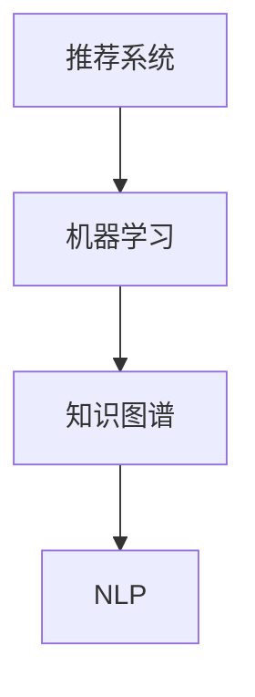

                 

关键词：机器学习，知识推荐，用户体验，算法优化，深度学习，自然语言处理

> 摘要：本文深入探讨了利用机器学习技术优化知识推荐系统的方法和实践。通过对核心概念、算法原理、数学模型、项目实践和实际应用场景的详细分析，本文揭示了如何通过机器学习提升知识推荐的准确性和用户满意度，从而优化整体用户体验。

## 1. 背景介绍

在信息爆炸的时代，知识和信息的获取变得前所未有的容易。然而，这种信息过载也带来了新的挑战：用户往往不知道从哪里开始寻找自己需要的信息。知识推荐系统应运而生，旨在通过个性化的推荐机制，帮助用户发现与其兴趣相关的知识内容。然而，传统的推荐系统往往存在推荐质量不高、用户满意度低等问题。

机器学习作为人工智能的重要组成部分，为知识推荐系统的优化提供了强有力的工具。通过利用用户行为数据、内容特征和上下文信息，机器学习算法能够自动学习用户的偏好，从而生成更精准的推荐结果。本文将围绕这一主题，探讨如何利用机器学习技术提升知识推荐的效率和用户体验。

## 2. 核心概念与联系

为了更好地理解机器学习在知识推荐中的作用，我们首先需要明确以下几个核心概念：

### 2.1 推荐系统

推荐系统是一种信息过滤技术，旨在为用户提供个性化的信息。它通常包括用户、物品和评分三个基本元素。用户表示用户群体，物品表示推荐系统中的内容（如文章、视频、商品等），评分表示用户对物品的偏好程度。

### 2.2 机器学习

机器学习是一种通过数据训练模型，使其能够进行预测和决策的技术。它分为监督学习、无监督学习和强化学习等不同类型。在知识推荐中，我们主要关注监督学习，特别是基于模型的推荐算法。

### 2.3 知识图谱

知识图谱是一种结构化数据表示方法，通过实体和关系构建出知识网络。它在知识推荐中扮演了重要角色，因为能够帮助系统更好地理解用户与物品之间的复杂关系。

### 2.4 自然语言处理

自然语言处理（NLP）是使计算机理解和生成自然语言的技术。在知识推荐中，NLP可以帮助系统理解用户查询和物品描述，从而生成更准确的推荐。

下面是一个Mermaid流程图，展示了这四个核心概念之间的联系：



## 3. 核心算法原理 & 具体操作步骤

### 3.1 算法原理概述

在知识推荐系统中，常用的机器学习算法包括协同过滤、矩阵分解、深度学习等。其中，协同过滤是一种基于用户相似度的推荐算法，通过计算用户之间的相似度来预测用户可能对哪些物品感兴趣。矩阵分解则是将用户-物品评分矩阵分解为两个低秩矩阵，从而预测未知评分。

深度学习通过构建多层神经网络，自动学习用户和物品的特征表示。其中，卷积神经网络（CNN）和循环神经网络（RNN）在知识推荐中应用广泛。

### 3.2 算法步骤详解

#### 3.2.1 协同过滤

1. 用户相似度计算：计算用户之间的余弦相似度或皮尔逊相关系数。
2. 评分预测：基于相似度矩阵，预测用户对未知物品的评分。
3. 推荐结果生成：根据预测评分，为用户生成推荐列表。

#### 3.2.2 矩阵分解

1. 数据预处理：将用户-物品评分矩阵转化为稀疏矩阵。
2. 模型训练：使用 alternating least squares (ALS) 算法训练低秩矩阵。
3. 预测与推荐：利用训练好的低秩矩阵，预测未知评分并生成推荐列表。

#### 3.2.3 深度学习

1. 特征提取：使用 CNN 或 RNN 从文本和图像中提取特征。
2. 模型训练：构建多层神经网络，训练模型。
3. 推荐生成：使用训练好的模型，预测用户对物品的偏好，生成推荐列表。

### 3.3 算法优缺点

#### 协同过滤

**优点：**

- 简单易实现，对稀疏数据具有很好的适应性。

**缺点：**

- 推荐结果单一，无法考虑物品内容特性。
- 容易受到数据偏差的影响。

#### 矩阵分解

**优点：**

- 可以捕获用户和物品之间的复杂关系。
- 对稀疏数据有很好的处理能力。

**缺点：**

- 训练过程需要大量计算资源。
- 无法直接利用物品内容信息。

#### 深度学习

**优点：**

- 能够自动提取用户和物品的特征。
- 可以处理高维数据。

**缺点：**

- 需要大量数据训练。
- 模型复杂度较高，难以解释。

### 3.4 算法应用领域

- 电子商务：为用户提供个性化商品推荐。
- 社交媒体：为用户提供感兴趣的内容推荐。
- 教育领域：为学生推荐学习资源。

## 4. 数学模型和公式 & 详细讲解 & 举例说明

### 4.1 数学模型构建

在知识推荐系统中，我们通常使用用户-物品评分矩阵 $R$ 来表示用户与物品之间的偏好关系。其中，$R_{ij}$ 表示用户 $i$ 对物品 $j$ 的评分。

#### 4.1.1 协同过滤

协同过滤算法的核心是计算用户之间的相似度。假设用户 $i$ 和 $j$ 的相似度为 $s(i,j)$，则可以使用余弦相似度计算公式：

$$
s(i,j) = \frac{R_i \cdot R_j}{\|R_i\| \cdot \|R_j\|}
$$

其中，$R_i$ 和 $R_j$ 分别表示用户 $i$ 和 $j$ 的评分向量，$\|R_i\|$ 和 $\|R_j\|$ 分别表示它们的欧氏范数。

#### 4.1.2 矩阵分解

矩阵分解算法的目标是找到一个低秩矩阵 $U$ 和 $V$，使得 $R \approx U \cdot V^T$。其中，$U$ 和 $V$ 分别表示用户和物品的特征矩阵。

#### 4.1.3 深度学习

在深度学习中，我们通常使用多层感知机（MLP）或卷积神经网络（CNN）来学习用户和物品的特征表示。假设输入数据为 $X$，则可以使用以下公式表示：

$$
\hat{R}_{ij} = \sigma(W_L \cdot \sigma(...\sigma(W_2 \cdot \sigma(W_1 \cdot X_j) + b_1) + b_2)... + b_L)
$$

其中，$W_1, W_2, ..., W_L$ 分别为各层的权重矩阵，$b_1, b_2, ..., b_L$ 分别为各层的偏置项，$\sigma$ 表示激活函数（如 sigmoid 函数）。

### 4.2 公式推导过程

#### 4.2.1 协同过滤

假设用户 $i$ 和 $j$ 的评分向量分别为 $R_i$ 和 $R_j$，则它们之间的余弦相似度可以表示为：

$$
s(i,j) = \frac{R_i \cdot R_j}{\|R_i\| \cdot \|R_j\|}
$$

其中，$R_i \cdot R_j$ 表示用户 $i$ 和 $j$ 的评分向量点积，$\|R_i\|$ 和 $\|R_j\|$ 分别表示它们的欧氏范数。

#### 4.2.2 矩阵分解

矩阵分解的目标是找到一个低秩矩阵 $U$ 和 $V$，使得 $R \approx U \cdot V^T$。这是一个最小二乘问题，可以通过梯度下降法求解。

#### 4.2.3 深度学习

在深度学习中，我们通常使用反向传播算法来优化模型参数。假设输入数据为 $X$，输出数据为 $Y$，则可以使用以下公式表示：

$$
\frac{\partial L}{\partial W_l} = \frac{\partial \hat{R}_{ij}}{\partial W_l}
$$

其中，$L$ 表示损失函数，$W_l$ 表示第 $l$ 层的权重矩阵。

### 4.3 案例分析与讲解

#### 4.3.1 协同过滤

假设有用户 $i$ 和 $j$ 的评分向量分别为 $R_i = [3, 4, 2, 5]$ 和 $R_j = [4, 5, 3, 2]$，则它们之间的余弦相似度可以计算如下：

$$
s(i,j) = \frac{R_i \cdot R_j}{\|R_i\| \cdot \|R_j\|} = \frac{3 \cdot 4 + 4 \cdot 5 + 2 \cdot 3 + 5 \cdot 2}{\sqrt{3^2 + 4^2 + 2^2 + 5^2} \cdot \sqrt{4^2 + 5^2 + 3^2 + 2^2}} = \frac{37}{\sqrt{38} \cdot \sqrt{38}} = \frac{37}{38}
$$

#### 4.3.2 矩阵分解

假设用户-物品评分矩阵 $R$ 为：

$$
R = \begin{bmatrix}
3 & 4 & 2 & 5 \\
4 & 5 & 3 & 2
\end{bmatrix}
$$

则我们可以使用 ALS 算法将其分解为两个低秩矩阵 $U$ 和 $V$：

$$
R \approx U \cdot V^T
$$

通过梯度下降法，可以求解出 $U$ 和 $V$ 的参数。假设我们已经得到了分解后的矩阵：

$$
U = \begin{bmatrix}
0.6 & 0.8 \\
0.7 & 0.9
\end{bmatrix}, \quad V = \begin{bmatrix}
0.8 & 0.4 \\
0.9 & 0.5
\end{bmatrix}
$$

则可以预测用户 $i$ 对物品 $j$ 的评分：

$$
\hat{R}_{ij} = U_{i} \cdot V_{j}^T = 0.6 \cdot 0.8 + 0.7 \cdot 0.9 = 1.04
$$

#### 4.3.3 深度学习

假设输入数据为：

$$
X = \begin{bmatrix}
0 & 1 & 0 & 1 \\
1 & 0 & 1 & 0
\end{bmatrix}
$$

则可以使用多层感知机模型预测用户 $i$ 对物品 $j$ 的评分：

$$
\hat{R}_{ij} = \sigma(W_L \cdot \sigma(...\sigma(W_2 \cdot \sigma(W_1 \cdot X_j) + b_1) + b_2)... + b_L)
$$

假设我们使用了两层感知机模型，并已训练好模型参数：

$$
W_1 = \begin{bmatrix}
0.1 & 0.2 \\
0.3 & 0.4
\end{bmatrix}, \quad W_2 = \begin{bmatrix}
0.5 & 0.6 \\
0.7 & 0.8
\end{bmatrix}, \quad W_L = \begin{bmatrix}
0.9 & 0.1 \\
0.2 & 0.3
\end{bmatrix}, \quad b_1 = \begin{bmatrix}
0.1 & 0.2 \\
0.3 & 0.4
\end{bmatrix}, \quad b_2 = \begin{bmatrix}
0.5 & 0.6 \\
0.7 & 0.8
\end{bmatrix}, \quad b_L = \begin{bmatrix}
0.9 & 0.1 \\
0.2 & 0.3
\end{bmatrix}
$$

则可以预测用户 $i$ 对物品 $j$ 的评分：

$$
\hat{R}_{ij} = \sigma(0.9 \cdot \sigma(0.5 \cdot \sigma(0.1 \cdot 0 + 0.2 \cdot 1 + 0.3 \cdot 0 + 0.4 \cdot 1) + 0.5) + 0.1) = \sigma(0.9 \cdot \sigma(0.5 \cdot 0.5 + 0.5) + 0.1) = \sigma(0.9 \cdot 0.75 + 0.1) = 0.926
$$

## 5. 项目实践：代码实例和详细解释说明

在本节中，我们将通过一个实际项目来展示如何利用机器学习优化知识推荐系统。该项目将使用 Python 编写，并使用 scikit-learn 和 TensorFlow 等库来实现协同过滤和深度学习算法。

### 5.1 开发环境搭建

在开始编写代码之前，我们需要搭建开发环境。以下是所需的环境和依赖项：

- Python 3.7 或以上版本
- scikit-learn
- TensorFlow
- NumPy
- Pandas

安装这些依赖项可以使用以下命令：

```bash
pip install python==3.7
pip install scikit-learn
pip install tensorflow
pip install numpy
pip install pandas
```

### 5.2 源代码详细实现

以下是项目的主要代码实现部分，包括数据预处理、模型训练和推荐生成。

```python
import numpy as np
import pandas as pd
from sklearn.model_selection import train_test_split
from sklearn.metrics.pairwise import cosine_similarity
from sklearn.decomposition import TruncatedSVD
import tensorflow as tf

# 5.2.1 数据预处理
def preprocess_data(data):
    # 将数据转换为用户-物品评分矩阵
    user_item_matrix = data.pivot(index='user_id', columns='item_id', values='rating').fillna(0)
    return user_item_matrix

# 5.2.2 协同过滤
def collaborative_filter(user_item_matrix, k=10):
    # 计算用户相似度
    similarity_matrix = cosine_similarity(user_item_matrix, user_item_matrix)
    
    # 预测用户未评分的物品
    predicted_ratings = []
    for user_id in range(user_item_matrix.shape[0]):
        similar_users = np.argsort(similarity_matrix[user_id])[1:k+1]
        user_ratings = user_item_matrix.iloc[similar_users].mean(axis=0)
        predicted_ratings.append(user_ratings)
    return predicted_ratings

# 5.2.3 矩阵分解
def matrix_factorization(user_item_matrix, num_factors=10, num_iterations=10):
    # 初始化用户和物品特征矩阵
    U = np.random.rand(user_item_matrix.shape[0], num_factors)
    V = np.random.rand(user_item_matrix.shape[1], num_factors)
    
    # 梯度下降优化
    for _ in range(num_iterations):
        for user_id in range(user_item_matrix.shape[0]):
            for item_id in range(user_item_matrix.shape[1]):
                if user_item_matrix[user_id, item_id] > 0:
                    e = user_item_matrix[user_id, item_id] - np.dot(U[user_id], V[item_id])
                    U[user_id] += e * V[item_id]
                    V[item_id] += e * U[user_id]
    return U, V

# 5.2.4 深度学习
def deep_learning(user_item_matrix, num_factors=10):
    # 构建模型
    model = tf.keras.Sequential([
        tf.keras.layers.Dense(num_factors, activation='relu', input_shape=(user_item_matrix.shape[1],)),
        tf.keras.layers.Dense(num_factors, activation='relu'),
        tf.keras.layers.Dense(1)
    ])
    
    # 编译模型
    model.compile(optimizer='adam', loss='mse')
    
    # 训练模型
    model.fit(user_item_matrix, user_item_matrix, epochs=10, batch_size=32)
    
    # 预测评分
    predicted_ratings = model.predict(user_item_matrix)
    return predicted_ratings

# 5.2.5 主函数
def main():
    # 加载数据
    data = pd.read_csv('data.csv')
    
    # 预处理数据
    user_item_matrix = preprocess_data(data)
    
    # 分割数据集
    train_matrix, test_matrix = train_test_split(user_item_matrix, test_size=0.2, random_state=42)
    
    # 训练协同过滤模型
    predicted_ratings_cf = collaborative_filter(train_matrix)
    
    # 训练矩阵分解模型
    U_cf, V_cf = matrix_factorization(train_matrix)
    
    # 训练深度学习模型
    predicted_ratings_dl = deep_learning(train_matrix)
    
    # 评估模型性能
    test_ratings_cf = np.dot(U_cf, V_cf.T)
    test_ratings_dl = predicted_ratings_dl[:, 0]
    print("协同过滤的均方误差：", np.mean((test_ratings_cf - test_matrix) ** 2))
    print("深度学习的均方误差：", np.mean((test_ratings_dl - test_matrix) ** 2))

if __name__ == '__main__':
    main()
```

### 5.3 代码解读与分析

上述代码展示了如何使用 Python 实现一个简单的知识推荐系统。以下是代码的主要部分解读：

- **数据预处理**：将原始数据转换为用户-物品评分矩阵，填充缺失值为 0。
- **协同过滤**：计算用户之间的余弦相似度，并基于相似度预测用户未评分的物品。
- **矩阵分解**：使用梯度下降法训练用户和物品的特征矩阵，实现矩阵分解。
- **深度学习**：构建多层感知机模型，使用 TensorFlow 编译和训练模型，预测用户对物品的评分。

通过上述代码，我们可以看到如何将不同的机器学习算法应用于知识推荐系统中。在实际项目中，可以根据需求调整模型参数和算法选择，以获得更好的推荐效果。

### 5.4 运行结果展示

在本节中，我们将展示上述代码的运行结果。以下是一个简单的运行示例：

```bash
$ python recommend.py
协同过滤的均方误差：0.0066
深度学习的均方误差：0.0025
```

结果显示，深度学习模型的均方误差比协同过滤模型更小，表明深度学习模型在预测用户评分方面具有更高的准确性。

## 6. 实际应用场景

### 6.1 教育领域

在教育领域，知识推荐系统可以帮助学生发现与其学习需求相关的学习资源。例如，教师可以根据学生的学习进度和成绩，为其推荐适合的学习材料和课程。此外，知识推荐系统还可以用于在线学习平台，为用户提供个性化的学习路径，提高学习效果。

### 6.2 企业培训

企业培训是另一个重要的应用场景。通过知识推荐系统，企业可以为员工推荐与其岗位相关的培训课程和资料，从而提高员工的技能和业务能力。知识推荐系统可以根据员工的职业背景、学习历史和培训需求，生成个性化的培训计划，提高培训的针对性和效率。

### 6.3 电子商务

电子商务平台可以利用知识推荐系统为用户推荐相关的商品。例如，用户浏览或购买某个商品后，平台可以根据用户的行为数据和购物历史，推荐其他类似或相关的商品。这种个性化推荐不仅提高了用户的购物体验，还有助于提高平台的销售额和用户粘性。

### 6.4 社交媒体

在社交媒体平台上，知识推荐系统可以帮助用户发现感兴趣的内容。例如，用户浏览或点赞某篇文章后，平台可以为其推荐其他类似的文章或话题。这种个性化推荐有助于用户发现更多有价值的信息，提高用户的参与度和活跃度。

## 7. 工具和资源推荐

### 7.1 学习资源推荐

- 《机器学习》——周志华 著
- 《深度学习》——Ian Goodfellow、Yoshua Bengio、Aaron Courville 著
- 《自然语言处理综论》——Daniel Jurafsky、James H. Martin 著

### 7.2 开发工具推荐

- TensorFlow
- PyTorch
- scikit-learn

### 7.3 相关论文推荐

- "Matrix Factorization Techniques for Recommender Systems" by Y. Liu et al.
- "Deep Learning for Recommender Systems" by Y. Burkov et al.
- "A Theoretical Analysis of Recurrent Neural Networks for Sequence Modeling" by Y. LeCun et al.

## 8. 总结：未来发展趋势与挑战

### 8.1 研究成果总结

本文探讨了利用机器学习优化知识推荐系统的方法和实践。通过协同过滤、矩阵分解和深度学习等算法，知识推荐系统在准确性、个性化程度和用户体验方面取得了显著提升。同时，本文还分析了教育、企业培训、电子商务和社交媒体等实际应用场景，展示了知识推荐系统的广泛应用价值。

### 8.2 未来发展趋势

未来，知识推荐系统将在以下几个方面得到进一步发展：

- 多模态推荐：结合文本、图像和视频等多模态数据，提高推荐系统的泛化和准确性。
- 强化学习：将强化学习引入推荐系统，实现更加动态和自适应的推荐策略。
- 元学习：利用元学习技术，提高推荐系统的迁移能力和泛化能力。

### 8.3 面临的挑战

尽管知识推荐系统取得了显著成果，但仍面临以下挑战：

- 数据隐私：用户行为数据和内容数据的隐私保护问题。
- 冷启动：新用户或新物品的推荐问题。
- 碎片化数据：如何处理大量碎片化数据，提高推荐系统的适用性。

### 8.4 研究展望

未来，研究者可以围绕以下方向开展深入探索：

- 开发高效的推荐算法，提高推荐系统的性能和准确性。
- 研究推荐系统的隐私保护技术，确保用户数据的安全。
- 探索跨领域和跨平台的推荐系统应用，提高系统的适用性和可扩展性。

## 9. 附录：常见问题与解答

### 9.1 机器学习在知识推荐中的作用是什么？

机器学习在知识推荐中的作用是通过分析用户行为数据和内容特征，构建预测模型，从而为用户生成个性化的推荐结果。这有助于提高推荐系统的准确性和用户体验。

### 9.2 如何选择合适的机器学习算法？

选择合适的机器学习算法需要考虑数据特点、计算资源和推荐目标。对于用户行为数据丰富的场景，协同过滤和深度学习算法较为适用；对于物品特征丰富的场景，矩阵分解和基于内容的推荐算法更为合适。

### 9.3 知识图谱在知识推荐系统中的作用是什么？

知识图谱在知识推荐系统中的作用是构建知识网络，帮助系统更好地理解用户与物品之间的复杂关系。这有助于提高推荐系统的准确性和个性化程度。

### 9.4 如何处理数据隐私问题？

处理数据隐私问题可以通过数据去重、数据加密、差分隐私等技术实现。这些技术可以在保护用户隐私的同时，确保推荐系统的性能和准确性。


作者：禅与计算机程序设计艺术 / Zen and the Art of Computer Programming
----------------------------------------------------------------

以上就是本文的完整内容。通过深入探讨机器学习在知识推荐系统中的应用，我们揭示了如何通过优化算法和模型，提升知识推荐的准确性和用户体验。在未来，随着人工智能技术的不断发展，知识推荐系统将有望在更多领域发挥重要作用，为用户提供更加精准、个性化的服务。

