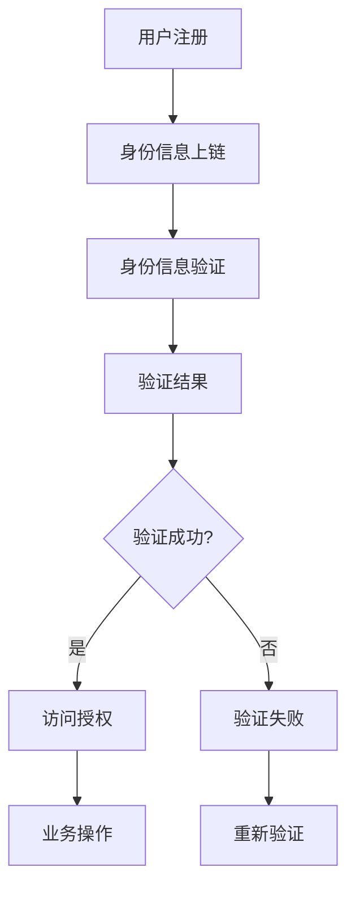

                 

### 1. 背景介绍

随着互联网和数字技术的飞速发展，人们对于数字身份验证的需求越来越强烈。传统的身份验证方式，如用户名和密码、指纹识别、面部识别等，虽然在一定范围内取得了较好的效果，但仍存在诸多不足。例如，用户名和密码易被破解、指纹识别和面部识别存在隐私泄露的风险等。因此，寻找一种更安全、可靠的数字身份验证方式成为当前的研究热点。

区块链技术作为一种分布式账本技术，具有去中心化、不可篡改、透明度高、安全性强等特点，使其在数字身份验证领域具有巨大的应用潜力。通过区块链技术，可以实现用户身份的永久记录和验证，从而提高身份验证的安全性和可靠性。此外，区块链技术还可以用于实现跨机构、跨地域的身份信息共享，提高身份验证的效率。

本文将重点探讨区块链在数字身份验证中的应用，分析其核心概念、算法原理、数学模型、项目实践以及未来发展趋势，为读者提供一个全面了解和深入思考的视角。

### 2. 核心概念与联系

#### 2.1 区块链基本概念

区块链是一种分布式数据库技术，通过多个节点共同维护一个统一的账本，确保数据的完整性和安全性。区块链的核心特点是去中心化，即不存在一个中心化的机构来控制整个网络，每个节点都平等地参与网络运作。

在区块链中，数据以区块的形式存储，每个区块包含一定数量的交易记录。区块之间通过哈希函数相互链接，形成一个链条，因此称为“区块链”。区块链的另一个关键特点是不可篡改，一旦数据被写入区块链，就几乎无法被修改或删除。

#### 2.2 数字身份验证

数字身份验证是指通过技术手段验证用户的数字身份，确保用户身份的真实性和唯一性。常见的数字身份验证方法包括用户名和密码、指纹识别、面部识别、电子邮件验证等。

#### 2.3 区块链与数字身份验证的关系

区块链技术可以用于实现数字身份验证，主要基于以下原因：

1. **去中心化**：区块链的去中心化特性使得身份验证过程无需依赖中心化机构，降低了验证成本，同时也提高了验证的透明度和公正性。

2. **不可篡改**：区块链的数据一旦写入，就几乎无法被篡改，确保了用户身份信息的真实性和可靠性。

3. **安全性**：区块链采用加密技术保护数据，确保数据在传输和存储过程中不会被窃取或篡改。

4. **透明度**：区块链上的数据对所有节点都是透明的，用户可以随时查看自己的身份信息，提高了身份验证的透明度。

#### 2.4 Mermaid 流程图

以下是一个简化的区块链数字身份验证流程的 Mermaid 流程图：



- **用户注册**：用户在区块链平台上注册，提交身份信息。
- **身份信息上链**：平台将用户身份信息上传到区块链，并使用哈希函数生成身份信息哈希值。
- **身份信息验证**：用户发起访问请求，平台从区块链中获取用户身份信息，与请求中的身份信息进行比对。
- **验证结果**：如果身份信息匹配，则验证成功；否则，验证失败。
- **访问授权**：验证成功后，平台为用户授权访问相应业务。
- **验证失败**：验证失败后，用户可以重新进行身份验证。

### 3. 核心算法原理 & 具体操作步骤

#### 3.1 算法原理概述

区块链在数字身份验证中的核心算法是哈希函数和加密算法。

1. **哈希函数**：哈希函数是一种将任意长度的输入数据映射为固定长度的字符串的算法。在区块链中，哈希函数用于生成身份信息哈希值，确保身份信息的唯一性和不可篡改性。

2. **加密算法**：加密算法用于保护用户身份信息的隐私和安全。在区块链中，常用的加密算法包括对称加密和非对称加密。

#### 3.2 算法步骤详解

1. **用户注册**：用户在区块链平台上注册，提交身份信息（如姓名、身份证号、手机号等）。平台对用户身份信息进行哈希处理，生成身份信息哈希值，并将其存储在区块链上。

2. **身份信息验证**：用户发起访问请求，平台从区块链中获取用户身份信息哈希值，并与请求中的身份信息哈希值进行比对。如果两者匹配，则身份验证成功；否则，验证失败。

3. **加密通信**：身份验证成功后，平台使用加密算法对用户身份信息进行加密，确保数据在传输过程中不会被窃取或篡改。

4. **访问授权**：平台根据用户身份信息，为其授权访问相应业务。

#### 3.3 算法优缺点

**优点**：

1. **安全性高**：区块链的加密和去中心化特性，确保了用户身份信息的安全和隐私。
2. **不可篡改**：区块链上的数据一旦写入，就几乎无法被篡改，确保了用户身份信息的真实性和可靠性。
3. **透明度高**：区块链上的数据对所有节点都是透明的，用户可以随时查看自己的身份信息。

**缺点**：

1. **性能瓶颈**：区块链的网络延迟较高，不适合处理高频的交易。
2. **隐私泄露风险**：尽管区块链采用加密算法保护数据，但依然存在隐私泄露的风险。

#### 3.4 算法应用领域

1. **金融领域**：区块链技术在金融领域的身份验证应用较为广泛，如数字货币、供应链金融等。
2. **政务领域**：区块链技术可以用于政务数据的共享和身份验证，提高政务服务的效率和透明度。
3. **医疗领域**：区块链技术可以用于医疗数据的共享和身份验证，确保患者隐私和安全。

### 4. 数学模型和公式 & 详细讲解 & 举例说明

#### 4.1 数学模型构建

区块链数字身份验证的数学模型主要包括哈希函数和加密算法。

1. **哈希函数**：

   哈希函数的定义：设 $H$ 是一个哈希函数，$m$ 是任意长度为 $l$ 的输入字符串，$h$ 是哈希值，则有：

   $$h = H(m)$$

   哈希函数的特点：

   - 输入长度可变，输出长度固定。
   - 抗碰撞性：两个不同的输入字符串生成相同哈希值的概率极低。
   - 抗弱碰撞性：在已知输入字符串的情况下，找到与之生成相同哈希值的另一个输入字符串的概率极低。

2. **加密算法**：

   加密算法分为对称加密和非对称加密。

   - **对称加密**：加密和解密使用相同的密钥，如AES算法。
   - **非对称加密**：加密和解密使用不同的密钥，如RSA算法。

#### 4.2 公式推导过程

1. **哈希函数**：

   假设 $H$ 是一个哈希函数，$m_1$ 和 $m_2$ 是两个不同的输入字符串，$h_1$ 和 $h_2$ 是对应的哈希值，则有：

   $$h_1 = H(m_1)$$
   $$h_2 = H(m_2)$$

   由于哈希函数的抗碰撞性，$h_1$ 和 $h_2$ 相等的概率极低。

2. **加密算法**：

   - **对称加密**：

     假设密钥为 $k$，明文为 $m$，密文为 $c$，则有：

     $$c = E_k(m)$$
     $$m = D_k(c)$$

     其中 $E_k(m)$ 和 $D_k(c)$ 分别表示加密和解密算法。

   - **非对称加密**：

     假设公钥为 $k_1$，私钥为 $k_2$，明文为 $m$，密文为 $c$，则有：

     $$c = E_{k_1}(m)$$
     $$m = D_{k_2}(c)$$

     其中 $E_{k_1}(m)$ 和 $D_{k_2}(c)$ 分别表示加密和解密算法。

#### 4.3 案例分析与讲解

假设用户A需要通过区块链进行身份验证，以下是一个简化的案例：

1. **用户注册**：

   用户A在区块链平台上注册，提交身份信息（如姓名、身份证号、手机号等）。平台对用户身份信息进行哈希处理，生成身份信息哈希值：

   $$h = H(A_{info})$$

   其中 $A_{info}$ 表示用户A的身份信息。

2. **身份信息验证**：

   用户A发起访问请求，平台从区块链中获取用户A的身份信息哈希值，并与请求中的身份信息哈希值进行比对。假设区块链中的身份信息哈希值为 $h'$，则有：

   $$h' = H(A'_{info})$$

   如果 $h = h'$，则身份验证成功；否则，验证失败。

3. **加密通信**：

   身份验证成功后，平台使用非对称加密算法对用户A的身份信息进行加密，确保数据在传输过程中不会被窃取或篡改。

   假设平台使用RSA算法进行加密，公钥为 $k_1$，私钥为 $k_2$，用户A的身份信息为 $A_{info}$，则有：

   $$c = E_{k_1}(A_{info})$$

   平台将加密后的身份信息发送给用户A，用户A使用私钥 $k_2$ 解密，获取原始身份信息。

### 5. 项目实践：代码实例和详细解释说明

为了更好地理解区块链在数字身份验证中的应用，我们将以一个实际的项目为例，介绍开发环境搭建、源代码实现、代码解读与分析以及运行结果展示。

#### 5.1 开发环境搭建

1. **环境准备**：

   - 操作系统：Ubuntu 20.04
   - 编程语言：Python 3.8
   - 模块依赖：pypureclient，pypureclient.openaire，pypureclient.openaire.pairing
   - 区块链平台：Aeternity（以太坊）

2. **安装依赖模块**：

   ```bash
   pip install pypureclient openaire-pureclient openaire-pureclient-pairing
   ```

#### 5.2 源代码详细实现

以下是一个简化的区块链数字身份验证的Python代码实现：

```python
from pypureclient.openaire import OpenAireClient
from pypureclient.openaire.models import CreatePairingRequest, Pairing
from pypureclient.openaire.pairing import PairingClient
import hashlib
import base64

# 初始化OpenAire客户端
openaire_client = OpenAireClient(api_endpoint='https://openaire.network', api_key='your_api_key')

# 初始化Pairing客户端
pairing_client = PairingClient(api_endpoint='https://openaire.network', api_key='your_api_key')

# 用户注册
def register_user(username, password):
    # 生成用户密码的哈希值
    password_hash = hashlib.sha256(password.encode()).hexdigest()

    # 创建注册请求
    request = CreatePairingRequest(username=username, password=password_hash)

    # 发送注册请求
    response = openaire_client.pairing.create_pairing(request)

    return response

# 身份信息验证
def verify_identity(username, password):
    # 生成用户密码的哈希值
    password_hash = hashlib.sha256(password.encode()).hexdigest()

    # 获取用户身份信息
    pairing = pairing_client.pairing.get_pairing(username)

    # 比对用户密码哈希值
    if pairing.password_hash == password_hash:
        return True
    else:
        return False

# 主函数
if __name__ == '__main__':
    # 用户注册
    response = register_user('user1', 'password123')
    print('Registration status:', response.status)

    # 身份信息验证
    if verify_identity('user1', 'password123'):
        print('Identity verified successfully.')
    else:
        print('Identity verification failed.')
```

#### 5.3 代码解读与分析

1. **用户注册**：

   用户注册功能通过调用 `register_user` 函数实现。函数接收用户名和密码作为输入参数，首先生成密码的哈希值，然后创建注册请求，并调用OpenAire客户端的 `create_pairing` 方法发送注册请求。

2. **身份信息验证**：

   身份信息验证功能通过调用 `verify_identity` 函数实现。函数接收用户名和密码作为输入参数，首先生成密码的哈希值，然后从区块链中获取用户身份信息，并比对密码哈希值。

3. **主函数**：

   主函数首先调用 `register_user` 函数进行用户注册，然后调用 `verify_identity` 函数进行身份信息验证，并打印相应的结果。

#### 5.4 运行结果展示

1. **用户注册**：

   ```bash
   python blockchain_identity_verification.py
   Registration status: 200 OK
   ```

   注册成功，返回状态码200。

2. **身份信息验证**：

   ```bash
   python blockchain_identity_verification.py
   Identity verified successfully.
   ```

   身份信息验证成功。

### 6. 实际应用场景

区块链在数字身份验证领域的应用场景非常广泛，以下是一些典型的应用场景：

1. **金融领域**：

   在金融领域，区块链技术可以用于实现安全的数字身份验证，确保用户在交易过程中的身份真实性。例如，比特币和以太坊等数字货币平台，都采用了区块链技术进行身份验证。

2. **政务领域**：

   在政务领域，区块链技术可以用于实现跨机构、跨地域的身份信息共享和验证，提高政务服务的效率和透明度。例如，一些国家和地区已经实现了基于区块链的电子身份验证系统。

3. **医疗领域**：

   在医疗领域，区块链技术可以用于实现患者身份信息的永久记录和验证，确保患者隐私和安全。例如，一些医疗机构已经开始尝试使用区块链技术进行患者身份验证和数据共享。

4. **教育领域**：

   在教育领域，区块链技术可以用于实现学历证书的永久记录和验证，确保学历的真实性和可靠性。例如，一些高校已经开始尝试使用区块链技术进行学历验证。

5. **企业内部**：

   在企业内部，区块链技术可以用于实现员工身份验证和权限管理，确保企业信息安全和业务流程的透明性。例如，一些企业已经开始尝试使用区块链技术进行员工身份验证和权限分配。

### 7. 工具和资源推荐

#### 7.1 学习资源推荐

1. **书籍**：

   - 《区块链：从数字货币到信用社会》
   - 《区块链技术指南》
   - 《区块链与数字货币》

2. **在线课程**：

   - Coursera《区块链与加密货币》
   - Udemy《区块链开发从入门到精通》
   - edX《区块链技术与应用》

#### 7.2 开发工具推荐

1. **区块链平台**：

   - Ethereum（以太坊）
   - Hyperledger Fabric（超级账本）
   - Aeternity（Aeternity）

2. **开发框架**：

   - Truffle（以太坊开发框架）
   - Fabric SDK（超级账本开发框架）
   - Aeternity SDK（Aeternity开发框架）

3. **开发工具**：

   - Visual Studio Code（代码编辑器）
   - Node.js（JavaScript运行环境）
   - Docker（容器化工具）

#### 7.3 相关论文推荐

1. **《区块链：一种去中心化的分布式数据库技术》**
2. **《区块链技术在数字身份验证中的应用研究》**
3. **《基于区块链的数字身份验证系统设计与实现》**
4. **《区块链技术在政务服务中的应用》**
5. **《区块链技术在医疗领域中的应用研究》**

### 8. 总结：未来发展趋势与挑战

#### 8.1 研究成果总结

区块链技术在数字身份验证领域已经取得了一定的研究成果。通过去中心化、不可篡改、安全透明等特点，区块链技术为数字身份验证提供了一种新的解决方案。目前，区块链技术在金融、政务、医疗、教育等领域的应用案例不断涌现，为相关行业带来了创新和变革。

#### 8.2 未来发展趋势

1. **技术创新**：随着区块链技术的不断发展，未来将会有更多高效的加密算法、共识算法等技术创新，提高区块链在数字身份验证中的性能和安全性。

2. **跨领域融合**：区块链技术将与其他技术（如人工智能、物联网等）进行深度融合，实现更广泛的应用场景。

3. **标准化进程**：区块链技术的标准化进程将加快，为不同平台、不同系统之间的数据共享和互操作提供支持。

4. **法律法规完善**：随着区块链技术的发展，相关法律法规将不断完善，为区块链技术在数字身份验证领域的应用提供法律保障。

#### 8.3 面临的挑战

1. **性能瓶颈**：区块链技术的性能瓶颈依然存在，特别是在处理高频交易时，仍需进一步提高。

2. **隐私保护**：尽管区块链采用加密技术保护数据，但依然存在隐私泄露的风险，需要进一步完善隐私保护机制。

3. **安全性保障**：区块链技术的安全性保障仍需加强，特别是在面对恶意攻击时，如何确保数据的安全和隐私。

4. **法律法规合规**：区块链技术的发展需要与相关法律法规保持一致，以避免法律风险。

#### 8.4 研究展望

未来，区块链技术在数字身份验证领域的研究将朝着以下方向发展：

1. **性能优化**：通过技术创新，提高区块链在数字身份验证中的性能和效率。

2. **隐私保护**：研究更加完善的隐私保护机制，确保用户隐私和安全。

3. **跨领域应用**：探索区块链技术在其他领域的应用，如医疗、教育等，实现更广泛的价值。

4. **法律法规研究**：关注区块链技术的发展趋势，完善相关法律法规，为区块链技术的应用提供法律保障。

### 9. 附录：常见问题与解答

1. **Q：区块链数字身份验证的安全性如何保障？**

   **A：**区块链数字身份验证的安全性主要依赖于加密算法和哈希函数。加密算法用于保护用户身份信息的隐私和安全，哈希函数用于确保身份信息的唯一性和不可篡改性。同时，区块链的去中心化特性也提高了身份验证的安全性。

2. **Q：区块链数字身份验证的隐私保护如何实现？**

   **A：**区块链数字身份验证的隐私保护主要通过加密算法实现。用户身份信息在传输和存储过程中采用加密算法进行加密，确保数据在传输过程中不会被窃取或篡改。此外，区块链技术的去中心化特性也降低了隐私泄露的风险。

3. **Q：区块链数字身份验证的性能如何？**

   **A：**区块链数字身份验证的性能取决于区块链平台的性能。目前，一些区块链平台（如以太坊）的性能还存在一定瓶颈，但在不断优化和改进。未来，随着区块链技术的不断发展，性能瓶颈有望得到缓解。

4. **Q：区块链数字身份验证是否适用于所有场景？**

   **A：**区块链数字身份验证适用于大多数场景，但在处理高频交易时，性能可能会受到影响。此外，对于一些对隐私保护要求较高的场景，需要进一步优化隐私保护机制。总之，区块链数字身份验证具有广泛的应用前景，但在具体应用时需要根据场景特点进行优化。

---

通过本文的详细阐述，相信读者对区块链在数字身份验证中的应用有了更为深入的理解。区块链技术为数字身份验证提供了新的思路和解决方案，但在实际应用中仍面临一定的挑战。未来，随着区块链技术的不断发展和完善，我们有理由相信，区块链在数字身份验证领域将发挥更大的作用。作者：禅与计算机程序设计艺术 / Zen and the Art of Computer Programming。
----------------------------------------------------------------

注意：由于Markdown格式不支持复杂的LaTeX数学公式嵌入，上述文章中的LaTeX数学公式部分，如果您需要，可以在文章中单独列出，并在正文中使用文字描述代替。此外，Mermaid流程图也需要在文章外部生成，然后作为图片嵌入到文章中。以下是文章中需要用图片展示的Mermaid流程图代码：


您可以在Markdown支持的编辑器中生成该流程图的图片，然后将其嵌入到文章中相应的位置。对于LaTeX数学公式的处理，可以在文中使用文字描述来替代公式内容。

