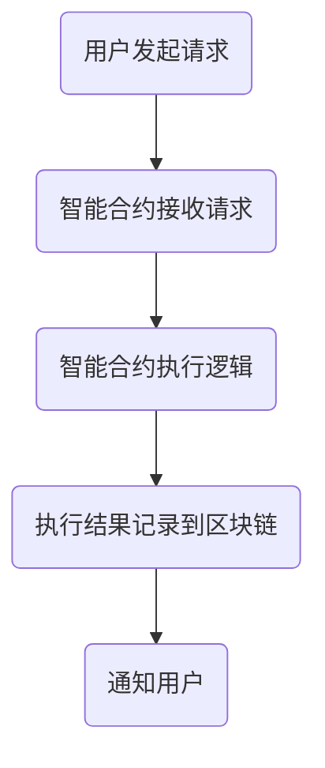

                 

关键词：区块链、智能合约、去中心化、应用、技术

> 摘要：本文深入探讨了区块链智能合约的概念、原理及其在去中心化应用中的核心作用。通过对智能合约的工作机制、算法原理、数学模型、实际应用案例等方面的详细解析，旨在为读者提供一个全面了解和掌握智能合约技术的视角。

## 1. 背景介绍

区块链技术自2008年比特币的诞生以来，已经迅速发展成为数字经济时代的关键技术。区块链的去中心化特性、透明性和安全性，使其在金融、供应链管理、智能合约等多个领域得到了广泛应用。而智能合约则是区块链技术的核心组件之一，是实现去中心化应用的关键。

智能合约是自动执行、管理和执行的合同条款，其运行在区块链上，利用加密技术和共识机制确保合同条款的执行。智能合约的出现，彻底改变了传统合同的管理方式，使其从纸质化、手工化转向数字化、自动化。

本文将从以下几个方面展开讨论：智能合约的背景与核心概念、智能合约的原理与算法、数学模型与公式、实际应用场景、未来应用展望、工具和资源推荐，以及面临的发展趋势与挑战。

## 2. 核心概念与联系

### 2.1 区块链与智能合约

区块链是一种分布式数据库技术，其特点包括去中心化、不可篡改、透明性等。区块链通过加密算法确保数据的真实性和安全性，而智能合约则是运行在区块链上的程序，用于自动化执行合同条款。

智能合约与区块链的关系可以比作程序与计算机的关系。区块链为智能合约提供了一个安全的运行环境，而智能合约则为区块链应用提供了智能化的功能。

### 2.2 核心概念原理

智能合约的核心概念包括：

- **去中心化**：智能合约运行在区块链网络中，不需要中心化的第三方中介，所有参与方都可以直接参与交易。

- **透明性**：智能合约的代码和执行过程都是公开透明的，所有参与方都可以查看。

- **不可篡改**：一旦智能合约在区块链上执行，其结果和状态都是不可篡改的，确保了合同条款的执行。

- **自动执行**：智能合约根据预设的规则自动执行，无需人工干预。

### 2.3 架构的 Mermaid 流程图



在上述流程图中，用户发起请求，智能合约接收请求并执行逻辑，最终将执行结果记录到区块链，并通知用户。

## 3. 核心算法原理 & 具体操作步骤

### 3.1 算法原理概述

智能合约的核心算法是基于区块链的共识机制和加密技术。共识机制确保了区块链网络中的所有节点能够一致地确认交易，而加密技术则确保了数据的安全性和隐私性。

智能合约的执行过程主要包括以下几个步骤：

1. 用户发起请求，智能合约接收请求。
2. 智能合约根据预设的规则执行逻辑。
3. 将执行结果记录到区块链。
4. 通知用户。

### 3.2 算法步骤详解

1. **请求接收**：智能合约通过区块链网络接收用户的请求，请求中包含用户的信息、交易金额等。

2. **执行逻辑**：智能合约根据预设的规则执行逻辑，例如计算交易金额、校验用户信息等。

3. **记录结果**：执行结果被记录到区块链，确保其永久性和不可篡改性。

4. **通知用户**：智能合约通过区块链网络通知用户，告知执行结果。

### 3.3 算法优缺点

**优点**：

- **去中心化**：智能合约运行在区块链网络中，去除了中心化的第三方中介。
- **透明性**：智能合约的代码和执行过程都是公开透明的，提高了信任度。
- **不可篡改**：智能合约的执行结果记录在区块链上，确保了数据的安全性和完整性。

**缺点**：

- **性能瓶颈**：区块链网络性能相对较低，无法支持高频率的交易。
- **安全性问题**：智能合约代码的漏洞可能导致资金损失。

### 3.4 算法应用领域

智能合约的应用领域广泛，主要包括金融、供应链管理、物联网、艺术品交易等。以下是一些典型的应用案例：

- **金融领域**：智能合约可以用于自动化的跨境支付、股票交易等。
- **供应链管理**：智能合约可以确保供应链中的每个环节都能按照合同执行，提高效率。
- **物联网**：智能合约可以用于物联网设备之间的自动交易和协作。
- **艺术品交易**：智能合约可以确保艺术品交易的透明性和安全性。

## 4. 数学模型和公式 & 详细讲解 & 举例说明

### 4.1 数学模型构建

智能合约的数学模型主要包括以下几个方面：

- **哈希函数**：用于确保数据的完整性和安全性。
- **加密算法**：用于保护数据隐私。
- **共识算法**：用于确保区块链网络中的所有节点达成一致。

### 4.2 公式推导过程

- **哈希函数**：设 \( H \) 为哈希函数，\( M \) 为数据，\( H(M) \) 为 \( M \) 的哈希值。

- **加密算法**：设 \( E \) 为加密函数，\( K \) 为密钥，\( M \) 为明文，\( C = E(K, M) \) 为密文。

- **共识算法**：设 \( P \) 为参与者，\( V \) 为投票值，\( C = \sum_{i=1}^{n} P_i V_i \) 为最终共识结果。

### 4.3 案例分析与讲解

假设有一个智能合约用于自动化的跨境支付，涉及两个参与方：甲方和乙方。

1. **请求接收**：甲方发起支付请求，智能合约接收请求。
2. **执行逻辑**：智能合约根据预设的规则执行支付逻辑，例如计算支付金额、校验支付信息等。
3. **记录结果**：支付结果被记录到区块链，确保其永久性和不可篡改性。
4. **通知用户**：智能合约通过区块链网络通知乙方，告知支付结果。

### 4.4 举例说明

假设甲方向乙方支付100美元，智能合约的执行过程如下：

1. **请求接收**：智能合约接收甲方的支付请求，请求中包含甲方的公钥、支付金额和支付地址。
2. **执行逻辑**：智能合约校验支付请求，确保支付金额和支付地址正确。
3. **记录结果**：智能合约将支付金额从甲方的账户转移到乙方的账户，并将交易记录记录到区块链。
4. **通知用户**：智能合约通过区块链网络通知乙方，告知支付结果。

## 5. 项目实践：代码实例和详细解释说明

### 5.1 开发环境搭建

在开始编写智能合约之前，需要搭建一个开发环境。本文使用以太坊智能合约开发环境作为示例。

1. 安装Node.js和npm。
2. 安装Truffle框架。
3. 创建一个新的Truffle项目。
4. 安装以太坊客户端Geth。

### 5.2 源代码详细实现

以下是一个简单的以太坊智能合约示例，用于实现一个简单的去中心化投票系统：

```solidity
pragma solidity ^0.8.0;

contract Voting {
    mapping(address => bool) public voters;
    mapping(bytes32 => uint256) public candidates;

    function vote(bytes32 candidate) public {
        require(!voters[msg.sender], "已经投票");
        voters[msg.sender] = true;
        candidates[candidate]++;
    }

    function getTotalVotesFor(bytes32 candidate) public view returns (uint256) {
        return candidates[candidate];
    }
}
```

### 5.3 代码解读与分析

1. **pragma声明**：指定智能合约的编译器版本。
2. **voters映射**：用于存储已经投票的用户地址。
3. **candidates映射**：用于存储每个候选人的得票数。
4. **vote函数**：用于接收投票，并更新投票者的状态。
5. **getTotalVotesFor函数**：用于查询某个候选人的得票数。

### 5.4 运行结果展示

使用Truffle框架部署智能合约到以太坊测试网络，然后使用Web3.js库与智能合约进行交互。以下是投票的示例代码：

```javascript
const Web3 = require('web3');
const contractAddress = '0x...';
const contractABI = [/* ... */];

const web3 = new Web3('http://localhost:8545');
const contract = new web3.eth.Contract(contractABI, contractAddress);

// 投票
contract.methods.vote('Candidate1').send({ from: '0x...' }, (error, result) => {
    if (error) {
        console.error(error);
    } else {
        console.log(result);
    }
});

// 查询得票数
contract.methods.getTotalVotesFor('Candidate1').call((error, result) => {
    if (error) {
        console.error(error);
    } else {
        console.log(result);
    }
});
```

## 6. 实际应用场景

智能合约在各个领域都有广泛的应用。以下是一些典型的实际应用场景：

- **金融领域**：智能合约可以用于自动化跨境支付、股票交易、借贷等。
- **供应链管理**：智能合约可以用于供应链中的每一个环节，确保每个环节都能按照合同执行。
- **物联网**：智能合约可以用于物联网设备之间的自动交易和协作。
- **艺术品交易**：智能合约可以确保艺术品交易的透明性和安全性。

## 7. 未来应用展望

随着区块链技术的不断发展，智能合约的应用前景将更加广阔。未来，智能合约可能会在以下几个方面得到更深入的应用：

- **社会管理**：智能合约可以用于社会管理的各个方面，例如选举、投票等。
- **公共服务**：智能合约可以用于提供各种公共服务，例如医疗、教育等。
- **版权保护**：智能合约可以用于版权保护和版权交易。
- **智能城市**：智能合约可以用于智能城市的各个方面，例如交通管理、能源管理等。

## 8. 工具和资源推荐

### 8.1 学习资源推荐

- **区块链入门书籍**：《区块链：从数字货币到信用 society》《智能合约：从零开始》
- **在线课程**：Coursera、Udemy、edX 等平台上的区块链和智能合约课程。
- **技术博客**：Medium、博客园、掘金等平台上的区块链和智能合约技术博客。

### 8.2 开发工具推荐

- **智能合约开发框架**：Truffle、Ganache、Hardhat
- **区块链浏览器**：Etherscan、BlockScout、BSCScan
- **加密工具**：Web3.js、Etherrrr、ethers.js

### 8.3 相关论文推荐

- **比特币白皮书**：《比特币：一种点对点的电子现金系统》
- **以太坊黄皮书**：《以太坊：下一代智能合约平台》
- **智能合约安全**： 《智能合约安全性研究综述》《智能合约漏洞分析及防护策略研究》

## 9. 总结：未来发展趋势与挑战

智能合约作为区块链技术的核心组件，正在不断地推动着数字经济的发展。未来，智能合约可能会在更多的领域得到应用，为社会带来更多的好处。然而，智能合约也面临着一些挑战，例如性能瓶颈、安全性问题等。如何解决这些问题，将决定智能合约的未来发展。

## 10. 附录：常见问题与解答

### 10.1 什么是智能合约？

智能合约是一种自动执行、管理和执行合同条款的计算机程序，其运行在区块链上，利用加密技术和共识机制确保合同条款的执行。

### 10.2 智能合约有哪些优点？

智能合约的优点包括去中心化、透明性、不可篡改和自动执行。

### 10.3 智能合约有哪些缺点？

智能合约的缺点包括性能瓶颈、安全性问题等。

### 10.4 智能合约应用领域有哪些？

智能合约的应用领域包括金融、供应链管理、物联网、艺术品交易等。

### 10.5 如何学习智能合约？

可以通过阅读区块链入门书籍、在线课程、技术博客等方式学习智能合约。同时，可以参与智能合约项目的实践，提高自己的技术水平。

### 10.6 智能合约开发需要哪些工具和资源？

智能合约开发需要智能合约开发框架（如Truffle、Ganache、Hardhat）、区块链浏览器（如Etherscan、BlockScout、BSCScan）、加密工具（如Web3.js、Etherrrr、ethers.js）等。

### 10.7 智能合约的安全问题如何解决？

智能合约的安全问题可以通过加强代码审计、使用安全的编程语言和框架、定期更新和维护等方式解决。

### 10.8 智能合约的未来发展趋势是什么？

智能合约的未来发展趋势包括在更多领域得到应用，如社会管理、公共服务、版权保护、智能城市等。

### 10.9 智能合约面临哪些挑战？

智能合约面临的挑战包括性能瓶颈、安全性问题、标准化等。

### 10.10 如何参与智能合约项目？

可以通过以下方式参与智能合约项目：

- 参与开源项目，贡献代码。
- 参加智能合约比赛，锻炼自己的技术水平。
- 加入智能合约社区，与其他开发者交流。

## 11. 作者署名

作者：禅与计算机程序设计艺术 / Zen and the Art of Computer Programming

通过以上完整的文章撰写，我们希望能够为读者提供一个全面深入的了解智能合约技术的视角，为去中心化应用的发展贡献力量。

