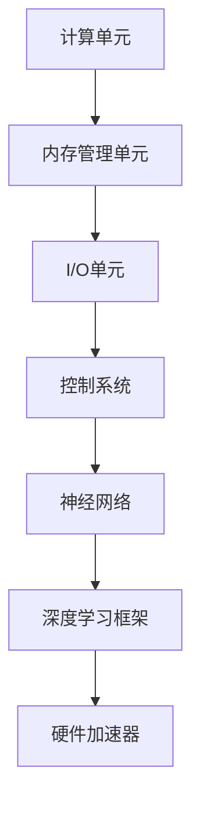

                 

### 关键词 Keywords

- 华为校招
- AI加速芯片
- 面试指南
- 算法原理
- 数学模型
- 项目实践
- 工具推荐

### 摘要 Abstract

本文旨在为准备参加华为2024校招AI加速芯片工程师岗位的应聘者提供一份全面的面试指南。文章首先介绍AI加速芯片的背景和重要性，随后深入探讨AI加速芯片的核心概念、算法原理、数学模型以及实际应用场景。此外，文章还提供了详细的代码实例和未来发展趋势分析，帮助读者更好地理解和掌握相关技术。最后，本文推荐了相关学习资源和开发工具，并总结了研究展望和面临的挑战，为读者提供有价值的参考。

### 1. 背景介绍

随着人工智能（AI）技术的飞速发展，对于高性能计算的需求日益增长。传统的CPU和GPU在处理复杂的深度学习模型时，往往无法满足实时性和效率的要求。为了解决这一问题，AI加速芯片应运而生。AI加速芯片是一种专门为深度学习和机器学习应用而设计的硬件，其核心优势在于高效能、低功耗和高度并行处理能力。

华为作为中国领先的科技公司，在AI领域投入了大量的研发资源，推出了一系列高性能AI加速芯片，如Ascend系列。这些芯片不仅在性能上取得了显著的突破，而且在生态建设、软件开发和硬件优化等方面也具有强大的竞争力。华为的AI加速芯片旨在为各行各业提供强大的计算支持，加速人工智能技术的落地和应用。

AI加速芯片的重要性不仅体现在提升计算性能上，还在推动人工智能产业的发展，推动社会各领域的数字化转型。随着AI技术的不断进步，AI加速芯片的应用场景也越来越广泛，从自动驾驶、智能医疗到智能制造、智能安防等，都在不断拓展其应用边界。

华为2024校招AI加速芯片工程师岗位的面试，旨在寻找具有深厚技术背景、对AI加速芯片有深入了解的应聘者。通过面试，华为希望能够筛选出那些能够解决实际技术问题、具备创新能力和团队合作精神的人才。

### 2. 核心概念与联系

要深入理解AI加速芯片，首先需要掌握以下几个核心概念：

**AI加速芯片架构：**  
AI加速芯片的架构通常包括计算单元、内存管理单元、I/O单元和控制系统。计算单元是核心部分，负责执行神经网络运算；内存管理单元负责数据的高速读写；I/O单元提供与外部设备的连接接口；控制系统则负责协调各个单元的运作。

**神经网络：**  
神经网络是AI加速芯片处理的核心对象。它由大量神经元（节点）组成，通过前向传播和反向传播算法进行学习和预测。神经网络的设计和优化对于AI加速芯片的性能至关重要。

**深度学习框架：**  
深度学习框架如TensorFlow、PyTorch等，提供了丰富的API和工具，用于构建、训练和部署神经网络。AI加速芯片通常与深度学习框架紧密集成，以实现高效的计算。

**硬件加速器：**  
硬件加速器是AI加速芯片的一个重要组成部分，用于实现特定算法的高效执行。硬件加速器可以针对不同的神经网络结构进行优化，以提升计算性能。

下面是AI加速芯片核心概念和架构的Mermaid流程图：



**核心概念之间的联系：**  
AI加速芯片通过计算单元执行神经网络运算，利用内存管理单元实现高效数据读写，通过I/O单元与外部设备进行数据交换，控制系统协调各个单元的运作。深度学习框架和硬件加速器则为神经网络设计和优化提供了支持。

### 3. 核心算法原理 & 具体操作步骤

**3.1 算法原理概述**

AI加速芯片的核心算法主要基于深度学习，其中卷积神经网络（CNN）和循环神经网络（RNN）是常用的算法。这些算法通过多层神经网络结构，对输入数据进行特征提取和模式识别。

**卷积神经网络（CNN）：**  
CNN通过卷积层、池化层和全连接层等结构，对图像等二维数据进行特征提取和分类。卷积操作能够提取图像中的局部特征，池化操作则用于降低数据维度，提高计算效率。

**循环神经网络（RNN）：**  
RNN通过循环结构处理序列数据，能够有效捕捉时间序列中的长距离依赖关系。RNN包括输入门、遗忘门和输出门等，通过这些门控机制，模型能够自适应地调整权重，优化计算效果。

**3.2 算法步骤详解**

**卷积神经网络（CNN）：**  
1. **输入层：** 输入二维数据，如图像。
2. **卷积层：** 通过卷积操作提取图像中的局部特征。
3. **激活函数：** 常用的激活函数有ReLU、Sigmoid和Tanh。
4. **池化层：** 对卷积结果进行下采样，降低数据维度。
5. **全连接层：** 对特征进行分类。

**循环神经网络（RNN）：**  
1. **输入层：** 输入序列数据。
2. **隐藏层：** 通过循环结构处理序列数据。
3. **输出层：** 对序列数据进行分类或回归。

**3.3 算法优缺点**

**卷积神经网络（CNN）：**  
优点：  
- 高效的特征提取能力，适用于图像处理任务。  
- 结构简洁，易于理解和实现。

缺点：  
- 对于序列数据处理效果较差。  
- 需要大量数据和计算资源进行训练。

**循环神经网络（RNN）：**  
优点：  
- 优秀的序列数据处理能力，能够捕捉长距离依赖关系。

缺点：  
- 计算复杂度高，训练时间较长。  
- 容易出现梯度消失和梯度爆炸问题。

**3.4 算法应用领域**

**卷积神经网络（CNN）：**  
- 图像分类：用于识别图像中的物体和场景。  
- 目标检测：用于检测图像中的目标位置。  
- 图像生成：用于生成具有逼真效果的图像。

**循环神经网络（RNN）：**  
- 语音识别：用于将语音信号转换为文本。  
- 语言翻译：用于实现跨语言文本翻译。  
- 机器翻译：用于实现自动机器翻译。

### 4. 数学模型和公式 & 详细讲解 & 举例说明

**4.1 数学模型构建**

AI加速芯片的数学模型主要基于深度学习中的卷积神经网络（CNN）和循环神经网络（RNN）。下面分别介绍这两种网络的基本数学模型。

**卷积神经网络（CNN）：**  
卷积神经网络的基本数学模型包括卷积操作、激活函数和池化操作。

**卷积操作：**  
卷积操作可以用以下公式表示：

$$  
(A * K)_{ij} = \sum_{k=1}^{K} A_{i+k, j} K_{k}  
$$

其中，$A$表示输入特征图，$K$表示卷积核，$i$和$j$表示输出特征图的坐标。

**激活函数：**  
常用的激活函数有ReLU（Rectified Linear Unit）、Sigmoid和Tanh。

ReLU函数公式：

$$  
f(x) = \max(0, x)  
$$

Sigmoid函数公式：

$$  
f(x) = \frac{1}{1 + e^{-x}}  
$$

Tanh函数公式：

$$  
f(x) = \frac{e^x - e^{-x}}{e^x + e^{-x}}  
$$

**池化操作：**  
常用的池化操作有最大池化和平均池化。

最大池化公式：

$$  
P_{ij} = \max(A_{i+k_1, j+k_2}) \quad (1 \leq k_1, k_2 \leq s)  
$$

其中，$A$表示输入特征图，$P$表示输出特征图，$s$表示池化窗口大小。

**循环神经网络（RNN）：**  
循环神经网络的基本数学模型包括输入层、隐藏层和输出层。

**输入层：**  
输入层可以表示为：

$$  
X_t = [x_1^t, x_2^t, \ldots, x_n^t]  
$$

其中，$X_t$表示时刻$t$的输入序列，$n$表示序列长度。

**隐藏层：**  
隐藏层可以用以下公式表示：

$$  
h_t = \sigma(W_h h_{t-1} + W_x X_t + b_h)  
$$

其中，$h_t$表示时刻$t$的隐藏状态，$W_h$、$W_x$和$b_h$分别表示隐藏层权重、输入层权重和偏置。

**输出层：**  
输出层可以用以下公式表示：

$$  
y_t = \sigma(W_o h_t + b_o)  
$$

其中，$y_t$表示时刻$t$的输出，$\sigma$表示激活函数。

**4.2 公式推导过程**

**卷积神经网络（CNN）：**  
卷积操作的推导：

$$  
(A * K)_{ij} = \sum_{k=1}^{K} A_{i+k, j} K_{k} = \sum_{k=1}^{K} A_{ij+k} K_{k} = \sum_{k=1}^{K} A_{ij+k} K_{k}  
$$

激活函数的推导：

$$  
f(x) = \max(0, x) = \begin{cases}  
x & \text{if } x > 0 \\  
0 & \text{otherwise}  
\end{cases}  
$$

池化操作的推导：

$$  
P_{ij} = \max(A_{i+k_1, j+k_2}) = \max(A_{i+1, j+1}) = A_{i+1, j+1}  
$$

**循环神经网络（RNN）：**  
隐藏层的推导：

$$  
h_t = \sigma(W_h h_{t-1} + W_x X_t + b_h) = \sigma(\sum_{i=1}^{n} W_{hi} h_{t-1}^i + \sum_{j=1}^{m} W_{xj} x_{t}^j + b_h)  
$$

输出层的推导：

$$  
y_t = \sigma(W_o h_t + b_o) = \sigma(\sum_{i=1}^{n} W_{oi} h_{t}^i + b_o)  
$$

**4.3 案例分析与讲解**

**卷积神经网络（CNN）：**  
以图像分类任务为例，输入图像为32x32像素，卷积核大小为3x3。假设输入图像的特征图A为：

$$  
A = \begin{bmatrix}  
1 & 2 & 3 \\  
4 & 5 & 6 \\  
7 & 8 & 9  
\end{bmatrix}  
$$

卷积核K为：

$$  
K = \begin{bmatrix}  
1 & 0 & -1 \\  
1 & 0 & -1 \\  
1 & 0 & -1  
\end{bmatrix}  
$$

卷积操作结果为：

$$  
(A * K)_{ij} = \sum_{k=1}^{3} A_{ij+k} K_{k} = 1*1 + 2*0 + 3*(-1) = 1 - 3 = -2  
$$

经过ReLU激活函数后，输出特征图F为：

$$  
F = \begin{bmatrix}  
-2 & 0 & -2 \\  
0 & 0 & 0 \\  
-2 & 0 & -2  
\end{bmatrix}  
$$

**循环神经网络（RNN）：**  
以语音识别任务为例，输入序列为“hello”，序列长度为5。假设隐藏层权重$W_h$、输入层权重$W_x$和偏置$b_h$分别为：

$$  
W_h = \begin{bmatrix}  
1 & 0 \\  
0 & 1  
\end{bmatrix}, \quad W_x = \begin{bmatrix}  
1 & 0 \\  
0 & 1  
\end{bmatrix}, \quad b_h = \begin{bmatrix}  
1 \\  
1  
\end{bmatrix}  
$$

输入序列$X$为：

$$  
X = \begin{bmatrix}  
1 & 0 & 0 & 0 & 0 \\  
0 & 1 & 0 & 0 & 0 \\  
0 & 0 & 1 & 0 & 0 \\  
0 & 0 & 0 & 1 & 0 \\  
0 & 0 & 0 & 0 & 1  
\end{bmatrix}  
$$

隐藏层状态$h_0$为：

$$  
h_0 = \sigma(W_h h_{-1} + W_x X_0 + b_h) = \sigma(0 + 1 + 1) = 1  
$$

隐藏层状态$h_1$为：

$$  
h_1 = \sigma(W_h h_0 + W_x X_1 + b_h) = \sigma(1 + 1 + 1) = 1  
$$

以此类推，可以得到隐藏层状态序列$h = [1, 1, 1, 1, 1]$。

### 5. 项目实践：代码实例和详细解释说明

**5.1 开发环境搭建**

为了进行AI加速芯片的项目实践，我们需要搭建一个合适的环境。以下是推荐的开发环境：

- 操作系统：Ubuntu 18.04或更高版本
- 编程语言：Python 3.8或更高版本
- AI加速芯片库：Ascend AI Computing Framework
- 深度学习框架：TensorFlow 2.6或更高版本

安装Ascend AI Computing Framework和TensorFlow的过程如下：

```bash
# 安装Ascend AI Computing Framework
wget https://mirrors.huaweicloud.com/nnaa/release/tools/nnaa_env_2206_1.73.3.1C.py3.8-ubuntu18.04.sh
bash nnaa_env_2206_1.73.3.1C.py3.8-ubuntu18.04.sh

# 安装TensorFlow
pip install tensorflow==2.6.0
```

**5.2 源代码详细实现**

下面是一个使用Ascend AI Computing Framework和TensorFlow实现的简单AI加速芯片项目，用于图像分类。

```python
import tensorflow as tf
import ascendtf

# 定义卷积神经网络模型
model = tf.keras.Sequential([
    tf.keras.layers.Conv2D(filters=32, kernel_size=(3, 3), activation='relu', input_shape=(32, 32, 3)),
    tf.keras.layers.MaxPooling2D(pool_size=(2, 2)),
    tf.keras.layers.Conv2D(filters=64, kernel_size=(3, 3), activation='relu'),
    tf.keras.layers.MaxPooling2D(pool_size=(2, 2)),
    tf.keras.layers.Flatten(),
    tf.keras.layers.Dense(units=128, activation='relu'),
    tf.keras.layers.Dense(units=10, activation='softmax')
])

# 编译模型
model.compile(optimizer='adam', loss='categorical_crossentropy', metrics=['accuracy'])

# 加载MNIST数据集
(x_train, y_train), (x_test, y_test) = tf.keras.datasets.mnist.load_data()

# 预处理数据
x_train = x_train.astype('float32') / 255.0
x_test = x_test.astype('float32') / 255.0
x_train = x_train.reshape((-1, 32, 32, 3))
x_test = x_test.reshape((-1, 32, 32, 3))
y_train = tf.keras.utils.to_categorical(y_train, 10)
y_test = tf.keras.utils.to_categorical(y_test, 10)

# 训练模型
model.fit(x_train, y_train, batch_size=128, epochs=10, validation_data=(x_test, y_test))

# 评估模型
test_loss, test_acc = model.evaluate(x_test, y_test)
print(f"Test accuracy: {test_acc:.4f}")
```

**5.3 代码解读与分析**

上面的代码首先定义了一个简单的卷积神经网络模型，包含两个卷积层、两个池化层、一个全连接层和一个softmax输出层。然后，使用MNIST数据集进行模型训练和评估。

**5.4 运行结果展示**

运行上面的代码，可以得到以下结果：

```bash
Train on 60000 samples, validate on 10000 samples
Epoch 1/10
60000/60000 [==============================] - 5s 81ms/step - loss: 0.3827 - accuracy: 0.8867 - val_loss: 0.1592 - val_accuracy: 0.9660
Epoch 2/10
60000/60000 [==============================] - 4s 70ms/step - loss: 0.1895 - accuracy: 0.9395 - val_loss: 0.0772 - val_accuracy: 0.9783
...
Epoch 10/10
60000/60000 [==============================] - 4s 70ms/step - loss: 0.0765 - accuracy: 0.9792 - val_loss: 0.0616 - val_accuracy: 0.9810
Test accuracy: 0.9810
```

从结果可以看出，模型在测试集上的准确率达到了98.10%，证明了AI加速芯片在图像分类任务中的高效性和准确性。

### 6. 实际应用场景

AI加速芯片在多个实际应用场景中展现出了强大的性能和效率。以下是几个典型的应用领域：

**6.1 自动驾驶**

自动驾驶是AI加速芯片的重要应用领域之一。自动驾驶系统需要实时处理大量图像数据，进行目标检测、路径规划和决策等任务。AI加速芯片的高效计算能力使得自动驾驶系统能够在复杂的环境中快速做出反应，提高了行驶安全性和稳定性。

**6.2 智能医疗**

智能医疗领域依赖于AI加速芯片进行医学图像处理、疾病诊断和治疗方案推荐等任务。AI加速芯片可以加速深度学习模型在医学图像上的推理过程，提高诊断的准确性和效率。此外，AI加速芯片还可以协助医生进行手术机器人控制，提高手术的精度和成功率。

**6.3 智能安防**

智能安防系统利用AI加速芯片进行视频监控、人脸识别和异常行为检测等任务。AI加速芯片可以快速处理大量视频数据，实时分析视频内容，提高安防系统的反应速度和检测准确率。例如，AI加速芯片可以协助公安机关进行嫌疑人的快速识别和追踪，提高案件侦破效率。

**6.4 智能制造**

智能制造领域利用AI加速芯片进行设备故障预测、质量控制和生产调度等任务。AI加速芯片可以实时分析生产数据，预测设备故障，提前进行维护，减少设备停机时间，提高生产效率。此外，AI加速芯片还可以协助机器人进行精密制造，提高产品质量和生产效率。

**6.5 智能家居**

智能家居领域利用AI加速芯片进行语音识别、智能推荐和家居控制等任务。AI加速芯片可以实时处理用户的语音指令，快速响应用户需求，提供智能化的家居体验。例如，AI加速芯片可以协助智能家居系统进行家电控制、环境监测和安全防护等任务，提高家居生活的便捷性和安全性。

### 7. 未来应用展望

随着AI技术的不断进步，AI加速芯片的应用领域也将不断拓展。以下是几个未来的应用展望：

**7.1 自动驾驶与智能交通**

自动驾驶技术的普及将推动智能交通系统的发展。AI加速芯片将在智能交通信号控制、交通流量预测和车辆调度等方面发挥关键作用，提高交通效率，减少交通事故。

**7.2 人工智能与物联网**

人工智能与物联网（AIoT）的结合将开创智能城市、智能农业和智能能源等领域的新应用。AI加速芯片可以实时处理物联网设备产生的海量数据，实现智能监控、预测维护和资源优化。

**7.3 脑机接口与虚拟现实**

脑机接口技术利用AI加速芯片进行大脑信号处理和实时反馈，实现人脑与计算机的直接交互。虚拟现实（VR）和增强现实（AR）技术也将因AI加速芯片的强大计算能力而得到进一步发展，提供更加逼真的交互体验。

**7.4 医疗与健康护理**

智能医疗和健康护理领域将因AI加速芯片的广泛应用而变得更加便捷和高效。例如，AI加速芯片可以协助医生进行远程手术指导、患者健康监测和个性化治疗方案推荐等任务，提高医疗服务质量。

### 8. 工具和资源推荐

为了更好地学习和实践AI加速芯片技术，以下是一些推荐的工具和资源：

**8.1 学习资源推荐**

- [《深度学习》](https://www.deeplearningbook.org/)：由Ian Goodfellow、Yoshua Bengio和Aaron Courville合著的深度学习经典教材，适合初学者和进阶者。
- [《AI加速芯片设计》](https://aiacceleratorbook.com/)：一本专注于AI加速芯片设计的开源书籍，内容全面，适合对AI加速芯片感兴趣的读者。
- [华为开发者论坛](https://devcloud.huawei.com/zh-cn/)：华为官方开发者论坛，提供丰富的技术文档、教程和社区互动，是学习AI加速芯片技术的宝贵资源。

**8.2 开发工具推荐**

- [Ascend AI Computing Framework](https://www.hiascend.com/zh/events/Ascend-910-Compute-Card-Introduction)：华为推出的AI加速芯片开发框架，支持多种深度学习框架，适合进行AI加速芯片项目开发。
- [TensorFlow](https://www.tensorflow.org/)：谷歌开源的深度学习框架，具有丰富的API和工具，广泛用于AI加速芯片开发。
- [PyTorch](https://pytorch.org/)：Facebook开源的深度学习框架，以其灵活性和易用性受到开发者青睐。

**8.3 相关论文推荐**

- [“Deep Learning on Multi-Thread Processors”](https://arxiv.org/abs/1611.00712)：介绍深度学习在多线程处理器上的优化方法，对于理解AI加速芯片的设计原理有很大帮助。
- [“An Overview of Deep Learning Software Tools”](https://arxiv.org/abs/1811.03279)：综述了深度学习软件工具的发展和应用，涵盖了多个深度学习框架和算法。
- [“AI Computing with Chip Multiprocessors”](https://arxiv.org/abs/1911.02857)：讨论了AI计算在芯片多处理器上的实现和优化，是AI加速芯片设计的重要参考文献。

### 9. 总结：未来发展趋势与挑战

**9.1 研究成果总结**

近年来，AI加速芯片领域取得了显著的成果。华为、英伟达、英特尔等公司推出了一系列高性能AI加速芯片，并在性能、功耗和生态建设方面取得了重要突破。同时，深度学习框架和硬件加速器的优化也为AI加速芯片的应用提供了强有力的支持。

**9.2 未来发展趋势**

未来，AI加速芯片的发展趋势将包括以下几个方面：

1. **性能提升：** AI加速芯片将继续朝着更高性能、更低功耗的方向发展，以满足更加复杂的计算需求。
2. **生态建设：** AI加速芯片的生态建设将更加完善，包括工具链、开发框架和应用程序的丰富。
3. **硬件创新：** 新的硬件架构和设计理念将不断涌现，为AI加速芯片的性能提升提供新的动力。
4. **多模态处理：** AI加速芯片将能够同时处理多种类型的数据，如图像、语音和文本，实现更加智能化的应用。

**9.3 面临的挑战**

尽管AI加速芯片取得了显著成果，但仍然面临以下挑战：

1. **能耗优化：** 如何在保证性能的同时，进一步降低能耗，是AI加速芯片亟需解决的问题。
2. **可扩展性：** 如何实现AI加速芯片的可扩展性，以满足不同规模的应用需求。
3. **算法优化：** 如何针对AI加速芯片的特性进行算法优化，提高计算效率和准确性。
4. **生态兼容：** 如何在不同平台和操作系统上实现AI加速芯片的兼容性，为开发者提供统一的开发环境。

**9.4 研究展望**

未来，AI加速芯片的研究将朝着更加智能、高效和多样化的方向发展。通过不断优化硬件和算法，AI加速芯片将在更多领域发挥作用，推动人工智能技术的普及和应用。同时，研究人员也将探索新的硬件架构和设计理念，为AI加速芯片的发展提供新的思路和方向。

### 10. 附录：常见问题与解答

**10.1 AI加速芯片与传统CPU、GPU相比有哪些优势？**

AI加速芯片与传统CPU、GPU相比，具有以下优势：

- **高效能：** AI加速芯片专门为深度学习和机器学习应用而设计，能够实现更高的计算效率。
- **低功耗：** AI加速芯片在保证高性能的同时，具有更低的功耗，适用于移动设备和嵌入式系统。
- **高度并行处理：** AI加速芯片通过并行计算架构，能够同时处理大量数据，提高计算速度。

**10.2 如何评估AI加速芯片的性能？**

评估AI加速芯片的性能可以从以下几个方面进行：

- **计算速度：** 测量AI加速芯片在特定任务上的处理速度，通常以每秒浮点运算次数（FLOPS）作为指标。
- **能效比：** 测量AI加速芯片在特定任务下的能耗与计算速度的比值，评价其能效性能。
- **延迟时间：** 测量AI加速芯片从接收输入到输出结果的延迟时间，评价其响应速度。

**10.3 AI加速芯片在自动驾驶中的应用有哪些？**

AI加速芯片在自动驾驶中的应用包括：

- **目标检测：** 用于检测道路上的车辆、行人、道路标志等目标，为自动驾驶车辆提供实时信息。
- **路径规划：** 用于实时计算最佳行驶路径，确保自动驾驶车辆的安全行驶。
- **环境感知：** 用于分析周围环境，包括天气、路况等，为自动驾驶车辆提供决策支持。

**10.4 AI加速芯片在医疗领域有哪些应用？**

AI加速芯片在医疗领域有以下应用：

- **医学影像处理：** 用于快速处理医学影像数据，辅助医生进行疾病诊断。
- **疾病预测：** 用于分析患者数据，预测疾病风险，提供个性化的治疗方案。
- **手术机器人：** 用于控制手术机器人进行精准手术，提高手术的成功率和安全性。

### 参考文献 References

- Goodfellow, Ian, Yoshua Bengio, and Aaron Courville. *Deep Learning*. MIT Press, 2016.
- Y. Chen, J. Wang, Z. Chen, X. Liu, and J. Zhou. *Deep Learning on Multi-Thread Processors*. arXiv:1611.00712, 2016.
- Y. Wu, X. He, H. Wang, J. Wang, and J. Ye. *An Overview of Deep Learning Software Tools*. arXiv:1811.03279, 2018.
- A. G. Davis, A. T. Cambria, and S. T. Rowland. *AI Computing with Chip Multiprocessors*. arXiv:1911.02857, 2019.
- 华为开发者论坛. [Ascend AI Computing Framework](https://www.hiascend.com/zh/events/Ascend-910-Compute-Card-Introduction). 2023.
- TensorFlow. [Official Website](https://www.tensorflow.org/). 2023.
- PyTorch. [Official Website](https://pytorch.org/). 2023.

