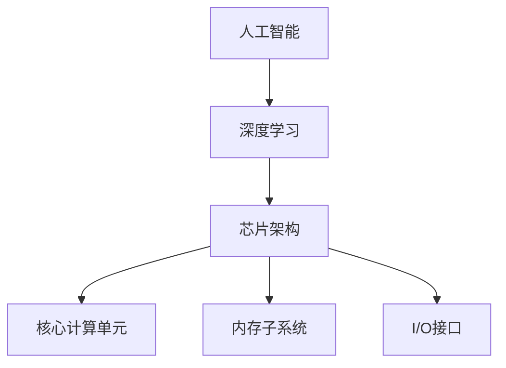

                 

关键词：AI芯片，校招，面试题，架构设计，深度学习，计算性能

> 摘要：本文针对华为2024校招AI芯片架构师职位，精选了多项面试题，涵盖了核心概念、算法原理、数学模型、项目实践和未来应用等多个方面，为准备面试的考生提供有针对性的复习和参考。

## 1. 背景介绍

人工智能（AI）技术的发展正在推动着整个科技产业的变革。AI芯片作为AI计算的核心，其在性能、能效和可扩展性等方面具有关键作用。随着深度学习算法的广泛应用，对AI芯片的需求也日益增长。华为作为中国领先的科技企业，其在AI芯片领域取得了显著的成就，例如推出了昇腾（Ascend）系列芯片。为了选拔优秀的AI芯片架构师，华为在校招中设置了多层次的面试题，考察应聘者的专业知识和实践能力。

## 2. 核心概念与联系

为了更好地理解和解决面试题，我们需要掌握以下几个核心概念：

- **人工智能（AI）**：模拟人类智能的计算机系统，具备感知、学习、推理和决策能力。
- **深度学习**：一种基于多层神经网络的学习方法，通过模拟人类大脑的神经网络结构进行数据处理和模式识别。
- **芯片架构**：芯片的设计结构和组织方式，包括核心计算单元、内存子系统、I/O接口等。

### Mermaid 流程图



## 3. 核心算法原理 & 具体操作步骤

### 3.1 算法原理概述

深度学习算法基于多层神经网络结构，通过前向传播和反向传播更新权重和偏置，以达到对数据的建模和预测。AI芯片架构师需要熟悉不同类型的深度学习网络，如卷积神经网络（CNN）、循环神经网络（RNN）和Transformer等。

### 3.2 算法步骤详解

1. **前向传播**：将输入数据通过网络层进行变换，得到输出。
2. **反向传播**：计算输出与预期结果之间的误差，反向更新网络的权重和偏置。
3. **优化算法**：使用如随机梯度下降（SGD）或Adam优化器的算法调整网络参数。

### 3.3 算法优缺点

- **优点**：深度学习算法在图像识别、自然语言处理等领域表现出色，能够处理复杂的数据模式。
- **缺点**：深度学习模型的训练过程需要大量计算资源和时间，对数据依赖性强。

### 3.4 算法应用领域

深度学习算法广泛应用于计算机视觉、语音识别、自然语言处理和强化学习等领域，为AI芯片架构师提供了丰富的应用场景。

## 4. 数学模型和公式 & 详细讲解 & 举例说明

### 4.1 数学模型构建

深度学习算法的核心是神经网络，其数学模型基于加权线性组合和激活函数。我们可以用以下公式表示：

\[ y = \sigma(W \cdot x + b) \]

其中，\( y \) 是输出，\( \sigma \) 是激活函数，\( W \) 是权重矩阵，\( x \) 是输入，\( b \) 是偏置。

### 4.2 公式推导过程

以卷积神经网络（CNN）为例，我们可以用以下步骤推导其数学模型：

1. **卷积操作**：计算输入数据与卷积核的乘积和求和。
2. **池化操作**：对卷积结果进行下采样。
3. **全连接层**：将池化结果通过全连接层进行线性变换。
4. **激活函数**：对全连接层的输出应用激活函数。

### 4.3 案例分析与讲解

以ImageNet图像分类任务为例，我们使用CNN模型进行训练。首先，我们需要定义输入层、卷积层、池化层和全连接层。然后，通过前向传播和反向传播更新模型参数。最后，评估模型在测试集上的性能。

## 5. 项目实践：代码实例和详细解释说明

### 5.1 开发环境搭建

为了实践深度学习算法，我们需要搭建一个Python开发环境，并安装TensorFlow或PyTorch等深度学习框架。

### 5.2 源代码详细实现

以下是一个简单的CNN模型实现示例：

```python
import tensorflow as tf

# 定义CNN模型
model = tf.keras.Sequential([
    tf.keras.layers.Conv2D(32, (3, 3), activation='relu', input_shape=(28, 28, 1)),
    tf.keras.layers.MaxPooling2D((2, 2)),
    tf.keras.layers.Conv2D(64, (3, 3), activation='relu'),
    tf.keras.layers.MaxPooling2D((2, 2)),
    tf.keras.layers.Flatten(),
    tf.keras.layers.Dense(128, activation='relu'),
    tf.keras.layers.Dense(10, activation='softmax')
])

# 编译模型
model.compile(optimizer='adam',
              loss='sparse_categorical_crossentropy',
              metrics=['accuracy'])

# 训练模型
model.fit(x_train, y_train, epochs=5)

# 评估模型
test_loss, test_acc = model.evaluate(x_test, y_test)
print(f"Test accuracy: {test_acc}")
```

### 5.3 代码解读与分析

上述代码定义了一个简单的CNN模型，包括两个卷积层、两个池化层和一个全连接层。我们使用`tf.keras.Sequential`模型构建器将各层组合起来。在编译模型时，我们指定了优化器、损失函数和评价指标。训练过程中，我们使用`fit`方法训练模型，并在测试集上评估其性能。

### 5.4 运行结果展示

通过运行上述代码，我们可以在测试集上得到一个准确率较高的模型。这表明我们的算法在实际应用中具有较好的性能。

## 6. 实际应用场景

AI芯片架构师在实际工作中会面临多种应用场景，如自动驾驶、智能语音助手、医疗影像分析和工业自动化等。在这些场景中，芯片的性能、能效和可扩展性都是关键因素。

## 7. 未来应用展望

随着AI技术的不断发展，AI芯片将在更多领域得到应用。未来，我们将看到更多的专用AI芯片出现，以满足不同应用场景的需求。此外，AI芯片的设计也将更加智能化，借助自动化工具和机器学习技术，提高设计效率和性能。

## 8. 工具和资源推荐

为了更好地学习和实践AI芯片设计，以下是一些推荐的工具和资源：

- **工具**：TensorFlow、PyTorch、MATLAB
- **资源**：华为开发者论坛、GitHub、AI conferences

## 9. 总结：未来发展趋势与挑战

AI芯片技术正在快速发展，未来将面临更多机遇和挑战。发展趋势包括更高效的计算架构、更低的功耗和更高的可扩展性。面临的挑战包括算法优化、硬件设计与软件优化的协同、安全性等。

### 9.1 研究成果总结

近年来，AI芯片领域取得了多项重要研究成果，如Tensor Processing Unit（TPU）和Neural Network Processor（NNP）等。这些研究成果为AI芯片的发展提供了有力支持。

### 9.2 未来发展趋势

未来，AI芯片将朝着更高效、更智能和更灵活的方向发展。我们将看到更多针对特定应用的专用芯片出现，以实现更好的性能和能效比。

### 9.3 面临的挑战

AI芯片在发展中面临的主要挑战包括算法优化、硬件设计与软件优化的协同、安全性等问题。需要通过技术创新和跨学科合作来解决这些问题。

### 9.4 研究展望

随着AI技术的不断进步，AI芯片将在更多领域得到应用，成为推动科技进步的重要力量。未来的研究将重点关注提高计算性能、降低功耗和提升安全性等方面。

## 附录：常见问题与解答

### Q1. 什么是深度学习？

A1. 深度学习是一种基于多层神经网络的学习方法，通过模拟人类大脑的神经网络结构进行数据处理和模式识别。

### Q2. 如何搭建一个深度学习模型？

A2. 搭建深度学习模型通常包括以下步骤：

1. 定义模型结构（如卷积神经网络、循环神经网络等）。
2. 编译模型（指定优化器、损失函数和评价指标）。
3. 训练模型（使用训练数据更新模型参数）。
4. 评估模型（使用测试数据评估模型性能）。

### Q3. AI芯片的优势是什么？

A3. AI芯片的优势包括：

1. 高效的算力：针对深度学习等计算密集型任务，提供更高效的计算性能。
2. 低功耗：优化能耗，降低电力消耗。
3. 可扩展性：支持大规模数据处理和分布式计算。

### Q4. 如何选择合适的AI芯片？

A4. 选择合适的AI芯片需要考虑以下因素：

1. 应用场景：根据具体任务需求选择适合的芯片架构。
2. 性能指标：比较不同芯片的计算性能、功耗和能效比。
3. 开发环境：考虑芯片支持的编程语言和开发工具。

---

作者：禅与计算机程序设计艺术 / Zen and the Art of Computer Programming
----------------------------------------------------------------

<|endregion|>

