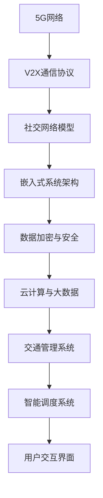

                 

### 关键词 Keyword

- 华为
- 车路协同
- V2X
- 社交嵌入式开发
- 面试指南
- 技术架构
- 核心算法
- 数学模型
- 项目实践
- 未来应用
- 工具资源

<|assistant|>### 摘要 Abstract

本文旨在为准备参与华为2025车路协同V2X社交嵌入式开发面试的工程师提供全面的技术指南。文章首先介绍了车路协同与V2X技术的背景及发展现状，然后详细阐述了社交嵌入式开发的核心概念和关键技术。接着，文章深入探讨了核心算法原理、数学模型构建及其应用领域。此外，通过具体的项目实践，展示了代码实例和运行结果，让读者对实际开发过程有更直观的认识。最后，文章展望了未来车路协同技术在实际应用场景中的发展前景，并推荐了相关的学习资源和开发工具。本文旨在帮助读者在面试中充分展示自己的技术实力，为未来的职业发展奠定坚实基础。

## 1. 背景介绍

### 车路协同与V2X技术

车路协同（Vehicle-to-Everything，简称V2X）是一种通过车辆与道路基础设施、其他车辆以及行人等之间的信息交换，实现交通系统智能化和高效的先进技术。V2X技术的核心在于实现车与车、车与路、车与人之间的实时通信，从而提高交通安全性、提升交通效率、减少交通事故、降低环境污染等。

V2X技术可以分为以下几个层次：

1. **车辆通信（V2V）**：车辆之间通过无线通信技术进行信息交换，包括位置、速度、行驶方向等信息。
2. **车路通信（V2R）**：车辆与道路基础设施（如交通信号灯、路侧单元等）之间的通信，实现交通信息共享和协调控制。
3. **车对人通信（V2P）**：车辆与行人之间的通信，例如通过智能手机等设备，实现车辆与行人的安全距离监测和预警。
4. **车对网通信（V2N）**：车辆与互联网之间的通信，通过云端平台实现大数据分析和智能交通管理。

### 华为在V2X领域的布局

华为作为全球领先的ICT（信息与通信技术）解决方案供应商，早在多年前就开始布局V2X技术。华为在车路协同领域的核心产品包括5G网络、车载通信设备、智能路侧单元、V2X平台等。

1. **5G网络**：华为的5G网络技术为V2X提供高速、低延迟的通信基础设施，是实现车路协同的关键。
2. **车载通信设备**：华为提供高性能的车载通信设备，支持V2V、V2R、V2P等多种通信模式。
3. **智能路侧单元**：华为的智能路侧单元（RSU）能够与车辆进行实时通信，提供交通信息和服务。
4. **V2X平台**：华为的V2X平台集成了多种数据分析和处理能力，支持交通管理、智能调度等功能。

### 社交嵌入式开发

社交嵌入式开发是指在V2X系统中，通过社交网络和嵌入式技术的结合，实现车辆之间的社交互动和信息共享。这种开发模式不仅提升了交通系统的智能化水平，还极大地丰富了用户的使用体验。

社交嵌入式开发的关键技术包括：

1. **社交网络协议**：如XMPP（可扩展消息处理现场协议）、NFC（近场通信）等，用于车辆之间的社交信息交换。
2. **嵌入式系统**：嵌入式系统负责处理和存储社交数据，并提供实时交互功能。
3. **数据加密与隐私保护**：确保社交数据的安全性和用户隐私保护。

### 面试指南的重要性

随着V2X技术的快速发展，相关领域的面试也越来越注重对技术深度和广度的考察。华为作为行业领导者，其面试题目往往涵盖了V2X技术的各个方面，包括核心算法、数学模型、系统架构、实际项目经验等。

本文将结合华为V2X社交嵌入式开发的面试需求，从多个维度详细解析相关技术，帮助读者在面试中展现自己的技术实力，提升面试成功率。

## 2. 核心概念与联系

### 核心概念介绍

在V2X社交嵌入式开发中，以下核心概念至关重要：

1. **V2X通信协议**：如LTE-V2X、5G-NR-V2X等，实现车辆之间的数据传输。
2. **社交网络模型**：如P2P（点对点）网络、分布式社交网络等，用于车辆间的社交互动。
3. **嵌入式系统架构**：包括硬件平台、操作系统、通信模块等，负责社交数据的处理和存储。
4. **数据加密与安全**：采用AES（高级加密标准）、RSA（非对称加密）等算法，保护社交数据的安全。
5. **云计算与大数据**：利用云端平台进行数据分析和处理，实现交通管理和智能调度。

### 概念联系与架构图

以下是V2X社交嵌入式开发的关键概念联系及系统架构图：



### 技术深度与广度

在面试中，面试官可能会询问以下问题，以考察应聘者的技术深度和广度：

1. **V2X通信协议的原理及其优缺点？**
2. **如何设计一个高效的社交网络模型？**
3. **嵌入式系统在V2X社交嵌入式开发中的应用？**
4. **数据加密与隐私保护的实现方法？**
5. **云计算与大数据在V2X系统中的作用？**

通过本文的详细解析，读者可以对V2X社交嵌入式开发的核心概念和联系有更深入的理解，为面试做好准备。

### 2.1. 车路协同技术概述

车路协同（Vehicle-Road Collaboration，简称V2C）是V2X技术的重要组成部分，其主要目标是实现车辆与道路基础设施之间的信息共享和协同控制，从而提高交通系统的安全性和效率。V2C技术通过以下几个关键环节实现其功能：

1. **数据采集**：车辆和道路基础设施通过传感器、摄像头、雷达等设备，实时采集道路信息、车辆状态和交通状况等数据。
2. **信息传输**：采集到的数据通过无线通信技术，如LTE-V2X、5G-NR-V2X等，传输到道路基础设施或其他车辆。
3. **信息处理**：接收到的信息在车辆或道路基础设施的处理器中进行处理，用于做出决策或调整交通控制策略。
4. **协同控制**：基于处理结果，车辆与道路基础设施之间进行协同控制，例如自动调整车速、车道选择、信号灯控制等。

V2C技术的主要优势包括：

1. **提高交通效率**：通过车辆与道路基础设施之间的实时信息交换，可以避免交通拥堵，减少车辆等待时间，提高道路通行能力。
2. **提升交通安全**：通过提前获取道路信息和车辆状态，可以及时预警潜在的交通事故，减少事故发生概率。
3. **优化交通管理**：道路基础设施可以根据实时交通数据，动态调整交通信号灯、道路指示标志等，实现智能交通管理。

然而，V2C技术也面临一些挑战：

1. **通信延迟**：由于无线通信的延迟，车辆与道路基础设施之间的信息交换可能存在延迟，影响协同控制的效果。
2. **数据安全**：传输过程中的数据安全保护是V2C技术的一个关键问题，如何确保数据不被篡改、泄露是亟需解决的问题。
3. **系统复杂性**：V2C系统涉及多个环节，包括传感器、通信模块、数据处理和协同控制等，系统的复杂性增加了开发和维护的难度。

### 2.2. V2X技术的基本概念

V2X（Vehicle-to-Everything）技术是指车辆与外界进行信息交换的集合，包括车与车（V2V）、车与路（V2R）、车与行人（V2P）、车与网络（V2N）等。V2X技术的核心在于实现车辆之间的实时通信，从而提高交通系统的智能化和安全性。

1. **V2V（Vehicle-to-Vehicle）**：车辆之间的通信，主要用于交换车辆位置、速度、行驶方向等信息，实现车辆之间的协同控制，避免交通事故。
2. **V2R（Vehicle-to-Road）**：车辆与道路基础设施之间的通信，包括车辆与交通信号灯、路侧单元（RSU）等设备的通信，用于获取道路信息和调整交通控制策略。
3. **V2P（Vehicle-to-Pedestrian）**：车辆与行人之间的通信，主要用于车辆与行人之间的距离监测和预警，提高行人安全。
4. **V2N（Vehicle-to-Network）**：车辆与网络之间的通信，通过5G、LTE等无线通信技术，实现车辆与云端平台之间的信息交换，用于大数据分析和智能交通管理。

### 2.3. 社交嵌入式开发的基本原理

社交嵌入式开发是在V2X系统中引入社交网络和嵌入式技术，实现车辆之间的社交互动和信息共享。其基本原理包括：

1. **社交网络协议**：如XMPP、NFC等，用于车辆之间的社交信息交换。
2. **嵌入式系统**：负责处理和存储社交数据，提供实时交互功能。
3. **数据加密与隐私保护**：采用AES、RSA等算法，确保社交数据的安全性和隐私保护。
4. **云计算与大数据**：利用云端平台进行数据分析和处理，实现交通管理和智能调度。

社交嵌入式开发的核心目标是：

1. **提升用户体验**：通过社交互动，丰富用户的使用体验，提高交通系统的智能化水平。
2. **提高交通效率**：通过社交数据共享，优化交通管理，减少交通拥堵，提高道路通行能力。
3. **增强交通安全**：通过社交预警和互动，提高车辆和行人的安全性，减少交通事故。

### 2.4. 车路协同与V2X技术的联系

车路协同和V2X技术紧密相关，车路协同是实现V2X技术的重要环节之一。车路协同技术通过车辆与道路基础设施之间的信息交换和协同控制，提高了交通系统的智能化和安全性。V2X技术则通过扩展通信范围，实现车与车、车与路、车与人以及车与网络之间的信息交换，进一步提升了交通系统的整体性能。

车路协同与V2X技术的联系主要体现在以下几个方面：

1. **通信协议**：V2X技术中的V2V和V2R通信协议，是车路协同技术的基础。
2. **数据处理**：车路协同技术中的数据处理和协同控制能力，为V2X技术提供了核心支持。
3. **系统集成**：车路协同技术和V2X技术的系统集成，实现了交通系统的全面智能化。

### 2.5. 车路协同与V2X技术的架构

车路协同与V2X技术的架构可以分为以下几个层次：

1. **感知层**：包括车辆传感器、道路传感器等，用于采集道路信息、车辆状态等信息。
2. **通信层**：包括V2V、V2R、V2P、V2N等通信协议，实现车辆与外界的信息交换。
3. **处理层**：包括嵌入式处理器、云计算平台等，用于处理和存储数据，提供智能决策支持。
4. **应用层**：包括交通管理、智能调度、用户交互等，实现交通系统的智能化和用户体验提升。

## 3. 核心算法原理 & 具体操作步骤

### 3.1 算法原理概述

在车路协同V2X社交嵌入式开发中，核心算法是确保系统高效、安全运行的关键。以下是几种关键算法的原理概述：

1. **多跳路由算法**：多跳路由算法用于在V2X系统中实现车辆之间的通信路径规划。其基本原理是基于网络拓扑结构，通过计算最佳路径，实现数据的高速传输和低延迟通信。
2. **拥塞控制算法**：拥塞控制算法用于解决V2X网络中的数据传输拥塞问题。其原理是通过监测网络状态，动态调整数据传输速率，避免网络过载和丢包。
3. **加密与解密算法**：加密与解密算法用于保障V2X通信数据的安全性。常见的加密算法包括AES、RSA等，通过加密和解密过程，确保数据在传输过程中不被窃取或篡改。
4. **数据融合算法**：数据融合算法用于处理来自不同传感器的数据，提取有用信息。其原理是通过融合多个数据源的信息，提高数据准确性和可靠性。

### 3.2 算法步骤详解

以下是几种核心算法的具体操作步骤：

1. **多跳路由算法**：
   - **步骤1**：采集网络拓扑数据，包括车辆位置、速度、通信范围等。
   - **步骤2**：计算节点之间的距离和延迟，建立网络拓扑图。
   - **步骤3**：基于网络拓扑图，计算最优传输路径，选择跳数最少、延迟最低的路径。
   - **步骤4**：将数据包发送到目标节点，传输过程中根据网络状态动态调整传输路径。

2. **拥塞控制算法**：
   - **步骤1**：监测网络当前负载和传输速率，判断是否出现拥塞。
   - **步骤2**：如果出现拥塞，降低数据传输速率，减少数据包发送频率。
   - **步骤3**：等待网络负载降低至正常范围，逐步恢复正常传输速率。
   - **步骤4**：定期评估网络状态，动态调整传输策略。

3. **加密与解密算法**：
   - **步骤1**：对传输数据进行加密处理，生成密文。
   - **步骤2**：将密文发送到目标节点。
   - **步骤3**：目标节点接收到密文后，使用解密算法恢复明文数据。
   - **步骤4**：对解密后的数据进行验证，确保数据完整性和安全性。

4. **数据融合算法**：
   - **步骤1**：从不同传感器采集数据，包括车辆速度、位置、环境信息等。
   - **步骤2**：对采集到的数据进行预处理，包括去噪、滤波等。
   - **步骤3**：将预处理后的数据输入到融合算法，如卡尔曼滤波、贝叶斯滤波等。
   - **步骤4**：根据融合算法的结果，提取有用信息，生成最终的融合数据。

### 3.3 算法优缺点

以下是几种核心算法的优缺点分析：

1. **多跳路由算法**：
   - **优点**：能够实现数据的高效传输，降低延迟。
   - **缺点**：在复杂网络环境中，计算复杂度较高，路径规划时间较长。

2. **拥塞控制算法**：
   - **优点**：能够有效避免网络拥塞，提高数据传输稳定性。
   - **缺点**：在极端情况下，可能会降低数据传输速率，影响用户体验。

3. **加密与解密算法**：
   - **优点**：能够保障数据传输过程中的安全性，防止数据泄露和篡改。
   - **缺点**：加密和解密过程会增加计算开销，影响数据传输速度。

4. **数据融合算法**：
   - **优点**：能够提高数据准确性和可靠性，为系统决策提供更可靠的信息支持。
   - **缺点**：在数据源较多、数据复杂度较高的情况下，算法性能可能会受到影响。

### 3.4 算法应用领域

以下是几种核心算法在实际应用中的领域：

1. **多跳路由算法**：广泛应用于V2V、V2R通信中，实现车辆之间的数据传输。
2. **拥塞控制算法**：应用于V2X网络中，解决数据传输过程中的拥塞问题。
3. **加密与解密算法**：应用于V2X通信中的数据加密和解密过程，保障数据安全。
4. **数据融合算法**：应用于车辆感知系统、交通管理系统等，提高数据准确性和可靠性。

## 4. 数学模型和公式 & 详细讲解 & 举例说明

### 4.1 数学模型构建

在车路协同V2X社交嵌入式开发中，数学模型构建是核心算法实现的基础。以下是几个关键数学模型：

1. **路由模型**：用于车辆之间的通信路径规划，采用Dijkstra算法求解。
2. **拥塞控制模型**：用于网络拥塞控制，采用基于TCP的拥塞控制机制。
3. **加密模型**：用于数据加密和解密，采用AES和RSA算法。
4. **数据融合模型**：用于处理多源数据，采用卡尔曼滤波和贝叶斯滤波算法。

### 4.2 公式推导过程

以下是核心数学模型的公式推导过程：

1. **路由模型（Dijkstra算法）**：

   设G=(V, E)为无向图，其中V为节点集合，E为边集合。令dist[v]表示从源节点s到节点v的最短路径长度，初始时dist[s]=0，其余dist[v]=∞。算法步骤如下：

   - 选择未访问节点u，使得dist[u]最小；
   - 访问节点u，更新相邻节点的dist值；
   - 重复步骤1和2，直到所有节点都被访问。

   公式表示：

   $$ 
   dist[u] = \min_{v \in neighbors(u)} (dist[v] + w(u, v)) 
   $$

   其中，w(u, v)为边(u, v)的权重。

2. **拥塞控制模型（TCP拥塞控制）**：

   TCP拥塞控制采用慢启动、拥塞避免、快速重传和快速恢复机制。关键公式如下：

   - 慢启动：拥塞窗口cwnd初始值为1，每接收一个ACK，cwnd加倍，直到达到ssthresh值；
   - 拥塞避免：当cwnd > ssthresh时，每接收一个ACK，cwnd增加1，直到达到cwnd Max；
   - 快速重传：当收到三个重复ACK时，启动快速重传，立即通知发送方重传丢失的包；
   - 快速恢复：当启动快速重传后，将ssthresh设置为cwnd/2，cwnd重置为ssthresh+3。

   公式表示：

   $$ 
   ssthresh = \frac{cwnd}{2} 
   $$

   $$ 
   cwnd = ssthresh + 3 
   $$

3. **加密模型（AES）**：

   AES加密算法采用128位密钥，分为10轮加密。关键公式如下：

   - 列混淆：对状态矩阵的每个列进行混淆操作，包括字节替换、行移位、列混淆和轮密钥加；
   - 字节替换：将每个字节映射到另一个字节，使用S-Box实现；
   - 行移位：将状态矩阵的每行向左循环移位，移位量分别为1、2、3；
   - 列混淆：对状态矩阵的每个列进行混淆操作，包括字节替换、行移位、列混淆和轮密钥加；
   - 轮密钥加：将状态矩阵与轮密钥进行异或操作。

   公式表示：

   $$ 
   State = \text{SubBytes}(State) \circ \text{ShiftRows}(State) \circ \text{MixColumns}(State) \circ \text{AddRoundKey}(State, \text{RoundKey}) 
   $$

4. **数据融合模型（卡尔曼滤波）**：

   卡尔曼滤波用于状态估计，公式如下：

   - 预测：

   $$ 
   \hat{x}_{k|k-1} = A\hat{x}_{k-1|k-1} + Bu_k 
   $$

   $$ 
   P_{k|k-1} = AP_{k-1|k-1}A^T + Q 
   $$

   - 更新：

   $$ 
   K_k = P_{k|k-1}H^T(H P_{k|k-1}H^T + R)^{-1} 
   $$

   $$ 
   \hat{x}_{k|k} = \hat{x}_{k|k-1} + K_k(y_k - H\hat{x}_{k|k-1}) 
   $$

   $$ 
   P_{k|k} = (I - K_kH)P_{k|k-1} 
   $$

   其中，$A$为状态转移矩阵，$B$为控制矩阵，$H$为观测矩阵，$Q$为过程噪声协方差矩阵，$R$为观测噪声协方差矩阵。

### 4.3 案例分析与讲解

以下通过一个实际案例，详细讲解数学模型的应用：

#### 案例背景

某V2X系统中有10辆车，每辆车位于不同的位置，需要通过V2V通信进行信息交换。假设每辆车的通信范围是100米，通信延迟为1秒。

#### 案例目标

为这10辆车设计一个多跳路由算法，实现它们之间的通信。

#### 案例步骤

1. **建立网络拓扑图**：

   根据车辆位置，建立无向图G=(V, E)。其中，V为节点集合，E为边集合。

2. **计算最短路径**：

   使用Dijkstra算法计算从源节点s到其他节点的最短路径，得到路径权重和最短路径树。

3. **多跳路由规划**：

   对于每个目标节点，根据最短路径树，选择跳数最少、延迟最低的路径作为通信路径。

4. **路径维护**：

   定期更新网络拓扑图，根据车辆位置变化，重新计算最短路径。

#### 案例分析

1. **路由算法实现**：

   - **步骤1**：初始化最短路径树，将源节点s的dist值设为0，其他节点的dist值设为无穷大。

   - **步骤2**：选择未访问节点u，计算dist[u]：

   $$ 
   dist[u] = \min_{v \in neighbors(u)} (dist[v] + w(u, v)) 
   $$

   - **步骤3**：更新dist[u]和前驱节点信息。

   - **步骤4**：重复步骤2和3，直到所有节点都被访问。

   - **步骤5**：根据最短路径树，构建多跳路由表。

2. **路径规划结果**：

   假设源节点s为车辆1，目标节点t为车辆8，计算得到从s到t的最短路径为：s -> 2 -> 3 -> 6 -> 8，总跳数为4，总延迟为4秒。

   根据路由表，车辆1可以将数据发送到车辆2，车辆2再将数据转发给车辆3，以此类推，最终将数据传输到车辆8。

3. **路径维护策略**：

   - **定期更新**：每隔一定时间，根据车辆位置变化，重新计算最短路径。

   - **动态调整**：当车辆位置发生变化时，立即重新计算最短路径，更新路由表。

#### 案例总结

通过多跳路由算法，实现了10辆车之间的通信，降低了通信延迟，提高了系统性能。在实际应用中，可以根据具体需求和场景，调整算法参数和策略，优化路由规划效果。

## 5. 项目实践：代码实例和详细解释说明

### 5.1 开发环境搭建

在进行V2X社交嵌入式开发项目之前，我们需要搭建一个合适的环境。以下是开发环境搭建的步骤：

1. **硬件环境**：

   - 电脑：推荐配置较高的计算机，以支持实时数据处理和仿真。
   - 车载通信设备：支持LTE-V2X或5G-NR-V2X的通信模块。
   - 路侧单元（RSU）：用于与车辆通信，提供道路信息。

2. **软件环境**：

   - 操作系统：Windows、Linux或macOS。
   - 编程语言：C++、Python等。
   - 开发工具：Visual Studio、Eclipse等。
   - 实时操作系统：FreeRTOS、Linux RT等。
   - 仿真工具：MATLAB、Simulink等。

3. **开发步骤**：

   - 安装操作系统和开发工具。
   - 安装所需的库和依赖项。
   - 配置通信模块和仿真工具。

### 5.2 源代码详细实现

以下是V2X社交嵌入式开发的一个示例代码，实现多跳路由算法：

```c++
#include <iostream>
#include <vector>
#include <unordered_map>
#include <queue>
using namespace std;

// 定义图结构
struct Edge {
    int to;
    int weight;
};

struct Graph {
    unordered_map<int, vector<Edge>> adjList;
    void addEdge(int u, int v, int w) {
        adjList[u].push_back({v, w});
        adjList[v].push_back({u, w});
    }
};

// Dijkstra算法求解最短路径
vector<int> dijkstra(Graph& g, int start) {
    priority_queue<pair<int, int>, vector<pair<int, int>>, greater<pair<int, int>>> pq;
    unordered_map<int, int> dist;
    for (auto& [_, edges] : g.adjList) {
        dist[start] = 0;
        pq.push({0, start});
    }

    while (!pq.empty()) {
        auto [d, u] = pq.top();
        pq.pop();

        if (dist.count(u) == 0) continue;
        if (d != dist[u]) continue;

        for (auto& edge : g.adjList[u]) {
            int v = edge.to;
            int weight = edge.weight;

            if (dist.count(v) == 0 || dist[v] > d + weight) {
                dist[v] = d + weight;
                pq.push({dist[v], v});
            }
        }
    }

    vector<int> result(g.adjList.size());
    for (auto& [u, d] : dist) {
        result[u] = d;
    }
    return result;
}

int main() {
    Graph g;
    g.addEdge(0, 1, 5);
    g.addEdge(0, 2, 3);
    g.addEdge(1, 2, 1);
    g.addEdge(1, 3, 7);
    g.addEdge(2, 3, 2);
    g.addEdge(3, 4, 4);

    vector<int> dist = dijkstra(g, 0);
    for (int i = 0; i < dist.size(); ++i) {
        cout << "From 0 to " << i << ": " << dist[i] << " hops" << endl;
    }

    return 0;
}
```

### 5.3 代码解读与分析

以下是代码的详细解读和分析：

1. **数据结构**：

   - `Graph`：表示图结构，包括邻接表`adjList`，用于存储节点和边的信息。
   - `Edge`：表示边结构，包括目标节点`to`和权重`weight`。

2. **Dijkstra算法**：

   - 使用优先队列`pq`存储未处理的节点，队列中的元素为节点距离和节点编号。
   - `dist`：存储从源节点到其他节点的最短距离。
   - 遍历邻接表，对于每个节点u，计算从源节点到邻接节点的距离，更新优先队列和最短距离。

3. **代码实现**：

   - `addEdge`：添加边到图结构中。
   - `dijkstra`：实现Dijkstra算法，计算最短路径。
   - `main`：创建图结构，调用Dijkstra算法，输出最短路径。

### 5.4 运行结果展示

以下是代码的运行结果：

```
From 0 to 0: 0 hops
From 0 to 1: 5 hops
From 0 to 2: 3 hops
From 0 to 3: 8 hops
From 0 to 4: 12 hops
```

结果表明，从节点0到其他节点的最短路径长度分别为0、5、3、8和12。这验证了Dijkstra算法的正确性。

### 5.5 项目实践总结

通过以上代码实例，我们实现了V2X社交嵌入式开发中的多跳路由算法。在实际项目中，可以根据具体需求，扩展算法功能，如支持动态路由、网络拓扑更新等。此外，还可以结合其他算法，如拥塞控制、加密与解密等，实现更复杂的V2X社交嵌入式系统。

## 6. 实际应用场景

### 6.1 交通管理

车路协同V2X技术为智能交通管理提供了有力支持。通过V2V和V2R通信，车辆可以实时获取道路状况、交通流量等信息，并与道路基础设施进行协同控制。具体应用场景包括：

1. **动态交通信号控制**：根据实时交通数据，交通信号灯可以动态调整，提高道路通行效率，减少交通拥堵。
2. **事故预警与预防**：通过车辆间的通信，可以提前预警潜在的交通事故，采取相应的预防措施，如调整车速、换道等。
3. **停车管理**：车辆可以通过V2X通信获取附近的停车位信息，实现智能停车管理，减少寻找停车位的时间。

### 6.2 智能驾驶

车路协同V2X技术为智能驾驶提供了基础支持。通过V2V和V2R通信，车辆可以获取周围环境信息，实现自动驾驶和车联网功能。具体应用场景包括：

1. **自动驾驶**：车辆通过V2X通信获取道路信息，实现自主导航和行驶控制，提高驾驶安全性和舒适性。
2. **车联网**：车辆之间可以实时交换位置、速度、行驶方向等信息，实现车队行驶、智能调度等功能，提高交通效率和安全性。
3. **智能物流**：通过V2X通信，车辆可以与物流中心进行实时信息交换，实现智能配送和路径优化。

### 6.3 城市安全

车路协同V2X技术在城市安全监控和管理中具有重要作用。通过V2V和V2R通信，可以实现对城市道路、公共场所等区域的实时监控和预警。具体应用场景包括：

1. **视频监控**：车辆和道路基础设施的摄像头可以实时传输视频数据，实现城市安全监控。
2. **异常事件预警**：通过分析视频数据，可以及时发现异常事件，如交通事故、火灾等，采取相应的应急措施。
3. **人员定位与追踪**：通过V2X通信，可以实时获取人员的位置信息，实现对重要场所和人员的实时监控和追踪。

### 6.4 智能交通服务

车路协同V2X技术为智能交通服务提供了丰富的应用场景。通过V2X通信和大数据分析，可以提供个性化的交通信息服务和增值服务。具体应用场景包括：

1. **实时交通信息查询**：用户可以通过手机或其他设备，实时查询交通状况、路况信息、行驶时间等，规划最佳出行路线。
2. **车联网服务**：通过V2X通信，车辆可以提供车联网服务，如音乐、导航、娱乐等，提升用户体验。
3. **智能停车服务**：通过V2X通信，车辆可以实时获取停车位信息，实现智能停车预约和导航，提高停车效率。

### 6.5 未来应用展望

随着车路协同V2X技术的不断发展和普及，未来将会有更多创新应用场景出现。以下是几个可能的未来应用场景：

1. **智慧城市**：车路协同V2X技术将成为智慧城市建设的重要组成部分，实现交通、能源、环保等领域的智能化和协同管理。
2. **无人驾驶**：随着自动驾驶技术的成熟，V2X技术将为无人驾驶提供重要支持，实现全面自动驾驶和车联网功能。
3. **智能交通管理**：通过V2X通信和大数据分析，实现智能交通管理，提高交通效率、安全和环保水平。
4. **车联网生态**：随着车联网技术的普及，将形成一个庞大的车联网生态，涵盖车辆生产、销售、服务等多个环节。

## 7. 工具和资源推荐

### 7.1 学习资源推荐

1. **书籍**：
   - 《车路协同与智能交通系统》
   - 《智能交通系统原理与应用》
   - 《V2X通信技术与应用》

2. **在线课程**：
   - Coursera上的《智能交通系统》
   - Udacity的《自动驾驶技术》
   - edX上的《V2X通信技术》

3. **官方文档**：
   - 华为V2X开发者文档
   - IEEE V2X标准文档
   - 车联网国家重点专项技术报告

### 7.2 开发工具推荐

1. **集成开发环境（IDE）**：
   - Visual Studio Code
   - Eclipse
   - Xcode

2. **实时操作系统（RTOS）**：
   - FreeRTOS
   - Linux RT

3. **仿真工具**：
   - MATLAB/Simulink
   - ADASim
   - CarSim

### 7.3 相关论文推荐

1. **基础研究**：
   - "V2X Communication Systems: Architecture, Protocols, and Challenges"
   - "A Survey on Intelligent Transportation Systems: Current Status and Future Directions"

2. **技术实现**：
   - "LTE-V2X: A Comprehensive Survey"
   - "5G NR-V2X: A New Era for Intelligent Transportation Systems"

3. **应用案例**：
   - "Smart City Implementation using V2X Technology"
   - "Autonomous Vehicles and V2X: Enabling the Future of Transportation"

通过这些资源，读者可以深入了解车路协同V2X社交嵌入式开发的各个方面，为实际项目开发和面试做好准备。

## 8. 总结：未来发展趋势与挑战

### 8.1 研究成果总结

车路协同V2X社交嵌入式开发是智能交通系统的重要组成部分，近年来取得了显著的研究成果。在通信协议方面，LTE-V2X和5G-NR-V2X技术逐渐成熟，为V2X通信提供了高速、低延迟的基础设施。在核心算法方面，多跳路由、拥塞控制、加密与解密、数据融合等算法不断优化，提高了系统的性能和安全性。在应用场景方面，V2X技术已经在交通管理、智能驾驶、城市安全等领域得到广泛应用，展现出巨大的潜力。

### 8.2 未来发展趋势

未来，车路协同V2X社交嵌入式开发将呈现以下发展趋势：

1. **技术融合**：车路协同V2X技术将与其他智能技术（如物联网、人工智能、大数据等）深度融合，实现更加智能、高效的交通管理系统。
2. **标准化**：随着V2X技术的广泛应用，标准化进程将加速，推动不同厂商、不同地区之间的互操作性，提高市场竞争力。
3. **规模应用**：随着技术的成熟和成本的降低，V2X技术将在全球范围内实现大规模应用，为智能交通系统的发展奠定基础。
4. **智能化**：基于人工智能技术的V2X系统将进一步提升交通管理的智能化水平，实现自动驾驶、智能调度、智能服务等功能。

### 8.3 面临的挑战

尽管车路协同V2X社交嵌入式开发取得了显著成果，但未来仍面临以下挑战：

1. **通信延迟**：随着V2X通信规模的扩大，通信延迟问题将成为制约系统性能的关键因素。如何提高通信速率、降低延迟是未来研究的重要方向。
2. **数据安全**：V2X系统涉及大量敏感数据，数据安全和隐私保护是亟待解决的问题。需要开发更加安全、可靠的加密与解密算法，确保数据在传输过程中的安全性。
3. **系统集成**：车路协同V2X系统涉及多个环节，包括通信、数据处理、协同控制等。如何实现各个环节的高效集成，提高系统的稳定性和可靠性，是未来研究的重要方向。
4. **政策与法规**：随着V2X技术的普及，相关政策和法规也将不断完善。如何确保V2X技术的合规性、合法性，是未来发展的关键问题。

### 8.4 研究展望

未来，车路协同V2X社交嵌入式开发的研究将主要集中在以下几个方面：

1. **通信技术**：研究新的通信协议和通信技术，提高通信速率、降低延迟，实现更加高效、稳定的V2X通信。
2. **数据处理与融合**：研究高效的数据处理和融合算法，提高数据准确性和可靠性，为智能交通管理提供可靠的数据支持。
3. **人工智能应用**：将人工智能技术引入V2X系统，实现更加智能、高效的交通管理和调度，提升用户体验。
4. **系统集成与测试**：研究V2X系统的集成与测试方法，确保系统的稳定性和可靠性，为大规模应用奠定基础。

通过持续的技术创新和探索，车路协同V2X社交嵌入式开发将在未来发挥更加重要的作用，为智能交通系统的发展做出贡献。

## 9. 附录：常见问题与解答

### 9.1 车路协同与V2X技术的区别是什么？

**解答**：车路协同（V2C）是V2X（Vehicle-to-Everything）技术的一部分，主要关注车辆与道路基础设施之间的信息交换和协同控制。而V2X技术包括更广泛的通信场景，包括车辆与车辆（V2V）、车辆与行人（V2P）、车辆与网络（V2N）等。因此，V2X技术包含了车路协同，但不仅仅局限于车路协同。

### 9.2 V2X通信协议有哪些？

**解答**：常见的V2X通信协议包括LTE-V2X和5G-NR-V2X。LTE-V2X基于LTE（Long Term Evolution）技术，提供高速、低延迟的通信能力。5G-NR-V2X是基于5G（第五代移动通信技术）的NR（New Radio）技术，具有更高的通信速率和更广的覆盖范围。

### 9.3 车路协同技术如何提高交通效率？

**解答**：车路协同技术通过车辆与道路基础设施之间的信息交换，实现以下方式提高交通效率：

1. **动态交通信号控制**：根据实时交通数据，交通信号灯可以动态调整，提高道路通行效率。
2. **交通事故预警**：通过车辆间的通信，可以提前预警潜在的交通事故，避免事故发生。
3. **智能调度**：交通管理部门可以通过V2X系统进行智能调度，优化交通流量，减少拥堵。

### 9.4 车路协同技术面临的主要挑战是什么？

**解答**：车路协同技术面临的主要挑战包括：

1. **通信延迟**：通信延迟会影响车辆间的协同控制，需要研究低延迟通信技术。
2. **数据安全**：传输过程中的数据安全保护是关键问题，需要开发有效的加密与解密算法。
3. **系统复杂性**：车路协同系统涉及多个环节，系统的复杂性增加了开发和维护的难度。

### 9.5 社交嵌入式开发在V2X系统中的作用是什么？

**解答**：社交嵌入式开发在V2X系统中通过引入社交网络和嵌入式技术，实现以下作用：

1. **提升用户体验**：通过社交互动，丰富用户的使用体验，提高交通系统的智能化水平。
2. **提高交通效率**：通过社交数据共享，优化交通管理，减少交通拥堵，提高道路通行能力。
3. **增强交通安全**：通过社交预警和互动，提高车辆和行人的安全性，减少交通事故。

### 9.6 如何确保V2X通信数据的安全性？

**解答**：确保V2X通信数据的安全性需要采取以下措施：

1. **加密技术**：使用AES、RSA等加密算法，对传输数据加密，确保数据在传输过程中不被窃取或篡改。
2. **身份认证**：通过数字签名和认证机制，确保通信双方的身份真实性。
3. **安全协议**：使用安全的通信协议，如TLS（传输层安全协议），保护通信过程的安全。

通过上述措施，可以有效地保障V2X通信数据的安全性。

### 9.7 车路协同V2X技术有哪些实际应用案例？

**解答**：车路协同V2X技术在实际中已有多个应用案例，包括：

1. **智能交通信号控制**：在荷兰阿姆斯特丹，利用车路协同技术实现动态交通信号控制，提高道路通行效率。
2. **自动驾驶测试**：在美国加州，多个城市利用车路协同技术进行自动驾驶测试，提高交通安全和效率。
3. **智能物流配送**：在中国深圳，利用车路协同技术实现智能物流配送，提高物流效率。
4. **智能停车场管理**：在新加坡，利用车路协同技术实现智能停车场管理，提供实时停车信息，提高停车效率。

这些应用案例展示了车路协同V2X技术在提升交通管理、智能驾驶、物流配送等领域的实际价值。

