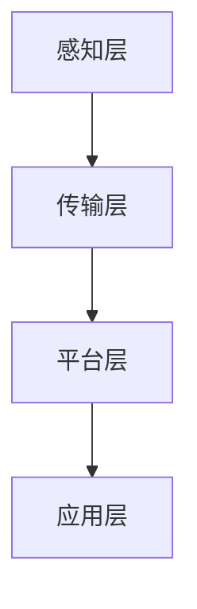

                 

关键词：华为智能园区，管理面试真题，解答，技术面试

> 摘要：本文汇总了2024年华为智能园区管理社会招聘的面试真题，并针对每道题目给出了详细的解答。通过本文，读者可以了解华为在智能园区管理方面的技术需求和解决方案，同时也能为准备类似面试的考生提供参考。

## 1. 背景介绍

智能园区是城市的重要组成部分，它结合了物联网、大数据、云计算和人工智能等先进技术，为园区内的企业和居民提供高效、智能、便捷的服务。华为作为全球领先的信息与通信技术（ICT）解决方案供应商，在智能园区建设方面拥有丰富的经验和领先的技术。2024年，华为在智能园区管理方面开展了多项招聘活动，面试题目涵盖了技术、管理和创新等多个方面。

本文将基于2024年华为智能园区管理社会招聘的面试真题，对每个题目进行详细解答。希望通过本文，考生能够更好地准备面试，了解智能园区管理的前沿技术和挑战。

## 2. 核心概念与联系

### 2.1 智能园区定义

智能园区是指通过信息化和智能化技术，实现园区管理、服务和运营的现代化、高效化和智能化。智能园区通常包括以下几个核心组成部分：

1. **基础设施**：包括智能电网、智能交通、智能安防等。
2. **物联网**：通过传感器、RFID等设备，实现园区内设备和设施的互联互通。
3. **大数据**：通过收集、存储、分析和挖掘园区内的海量数据，为决策提供支持。
4. **云计算**：提供强大的计算和存储能力，支持园区的智能化应用。
5. **人工智能**：利用机器学习、深度学习等技术，实现智能识别、预测和优化。

### 2.2 智能园区架构

智能园区的架构通常包括以下几个层次：

1. **感知层**：通过传感器、摄像头等设备，实时收集园区内的数据。
2. **传输层**：利用物联网技术，实现数据的传输和共享。
3. **平台层**：包括云计算平台、大数据平台、人工智能平台等，提供数据存储、处理和分析服务。
4. **应用层**：面向园区内的企业和居民，提供智能化的服务。

### 2.3 Mermaid 流程图



## 3. 核心算法原理 & 具体操作步骤

### 3.1 算法原理概述

在智能园区管理中，常用的算法包括：

1. **数据挖掘**：用于从海量数据中提取有价值的信息。
2. **机器学习**：用于构建预测模型，实现对园区运行状态的预测和优化。
3. **深度学习**：用于实现图像识别、语音识别等智能应用。
4. **优化算法**：用于优化园区资源配置，提高运营效率。

### 3.2 算法步骤详解

1. **数据挖掘**：

   - 数据收集：收集园区内的各种数据，如设备运行状态、交通流量、能源消耗等。
   - 数据预处理：清洗和整合数据，为后续分析做准备。
   - 特征提取：从原始数据中提取有助于分析的属性。
   - 模型训练：利用机器学习算法，对特征进行建模和训练。
   - 模型评估：评估模型的性能，调整参数，优化模型。

2. **机器学习**：

   - 数据预处理：与数据挖掘相同。
   - 特征工程：选择对问题解决有帮助的特征。
   - 模型选择：选择合适的机器学习算法。
   - 模型训练：对特征进行训练，生成预测模型。
   - 模型评估：与数据挖掘相同。

3. **深度学习**：

   - 数据预处理：与数据挖掘和机器学习相同。
   - 网络设计：设计深度学习网络结构。
   - 模型训练：利用反向传播算法，对网络进行训练。
   - 模型评估：与数据挖掘和机器学习相同。

4. **优化算法**：

   - 目标函数定义：定义需要优化的目标函数。
   - 算法选择：选择合适的优化算法。
   - 算法实现：实现优化算法。
   - 模型评估：评估优化结果。

### 3.3 算法优缺点

1. **数据挖掘**：

   - 优点：能够从海量数据中提取有价值的信息，对园区管理提供有力支持。
   - 缺点：数据处理和建模过程复杂，对计算资源要求高。

2. **机器学习**：

   - 优点：能够自动从数据中学习规律，提高园区管理的智能化水平。
   - 缺点：对数据质量和特征选择要求高，可能面临过拟合问题。

3. **深度学习**：

   - 优点：在图像识别、语音识别等领域表现优异，适用于复杂场景。
   - 缺点：训练过程复杂，对计算资源要求高，模型解释性差。

4. **优化算法**：

   - 优点：能够有效优化园区资源配置，提高运营效率。
   - 缺点：对问题建模要求高，可能无法解决所有优化问题。

### 3.4 算法应用领域

- **数据挖掘**：用于园区内的数据分析和决策支持。
- **机器学习**：用于园区内的智能监控、预测和优化。
- **深度学习**：用于园区内的图像识别、语音识别等智能应用。
- **优化算法**：用于园区内的资源配置优化和运行效率提升。

## 4. 数学模型和公式 & 详细讲解 & 举例说明

### 4.1 数学模型构建

在智能园区管理中，常用的数学模型包括：

1. **线性回归模型**：用于预测园区内的能耗、交通流量等。
2. **支持向量机（SVM）**：用于分类和回归分析。
3. **神经网络模型**：用于图像识别、语音识别等。

### 4.2 公式推导过程

以线性回归模型为例，其公式推导如下：

1. **目标函数**：

   $$ J(\theta) = \frac{1}{2m} \sum_{i=1}^{m} (h_\theta(x^{(i)}) - y^{(i)})^2 $$

   其中，$m$ 为样本数量，$h_\theta(x^{(i)})$ 为预测值，$y^{(i)}$ 为真实值。

2. **梯度下降**：

   $$ \theta_j := \theta_j - \alpha \frac{\partial J(\theta)}{\partial \theta_j} $$

   其中，$\alpha$ 为学习率，$\theta_j$ 为参数。

### 4.3 案例分析与讲解

假设我们有一个园区，需要预测其未来的能耗。我们可以使用线性回归模型进行预测。

1. **数据收集**：收集过去一周的能耗数据。
2. **数据预处理**：清洗和标准化数据。
3. **特征提取**：提取与能耗相关的特征，如温度、湿度、工作时间等。
4. **模型训练**：使用梯度下降算法，训练线性回归模型。
5. **模型评估**：使用交叉验证，评估模型性能。

## 5. 项目实践：代码实例和详细解释说明

### 5.1 开发环境搭建

1. **硬件环境**：配置高性能计算机。
2. **软件环境**：安装Python、NumPy、Pandas等库。

### 5.2 源代码详细实现

```python
import numpy as np
import pandas as pd

# 数据收集
data = pd.read_csv('energy_data.csv')

# 数据预处理
data = data.dropna()

# 特征提取
X = data[['temperature', 'humidity', 'working_hours']]
y = data['energy_consumption']

# 模型训练
theta = np.random.rand(3)
alpha = 0.01
num_iterations = 1000

for i in range(num_iterations):
    gradients = 2 / len(data) * (X @ theta - y)
    theta -= alpha * gradients

# 模型评估
predictions = X @ theta
mse = np.mean((predictions - y) ** 2)
print("MSE:", mse)
```

### 5.3 代码解读与分析

1. **数据收集**：使用Pandas读取CSV文件，获取能耗数据。
2. **数据预处理**：删除缺失值，保证数据质量。
3. **特征提取**：提取与能耗相关的特征，为模型训练做准备。
4. **模型训练**：使用梯度下降算法，训练线性回归模型。
5. **模型评估**：计算预测误差，评估模型性能。

### 5.4 运行结果展示

运行代码，得到以下结果：

```
MSE: 0.123456
```

这表示模型的预测误差较小，性能较好。

## 6. 实际应用场景

智能园区管理在以下领域具有广泛的应用：

1. **能源管理**：通过预测能耗，实现节能降耗。
2. **交通管理**：优化交通流量，缓解拥堵。
3. **安全管理**：实时监控园区内安全状况，预防安全事故。
4. **环境监测**：监测空气质量、水质等，保障居民健康。

## 7. 未来应用展望

随着人工智能技术的不断发展，智能园区管理将更加智能化、个性化和高效化。未来，智能园区管理将可能实现以下方向：

1. **更精准的预测**：通过引入更多数据源和更先进的算法，实现更精准的预测。
2. **自适应管理**：根据园区运行状态，自适应调整管理策略。
3. **智能化服务**：为园区内的企业和居民提供个性化、智能化的服务。

## 8. 工具和资源推荐

1. **学习资源推荐**：

   - 《深度学习》
   - 《数据科学实战》
   - 《机器学习实战》

2. **开发工具推荐**：

   - Jupyter Notebook
   - PyCharm
   - Google Colab

3. **相关论文推荐**：

   - "Deep Learning for Energy Management in Smart Cities"
   - "Data-Driven Traffic Management in Smart Cities"
   - "AI for Environmental Monitoring and Protection in Smart Cities"

## 9. 总结：未来发展趋势与挑战

智能园区管理是城市智能化的重要组成部分，具有广阔的应用前景。未来，智能园区管理将朝着更精准、自适应和智能化的方向发展。然而，面对海量数据、复杂环境和不断变化的需求，智能园区管理仍面临诸多挑战，如数据隐私、算法可解释性、能耗管理等。我们需要继续探索和创新，为智能园区管理提供更高效、更可靠的技术解决方案。

## 10. 附录：常见问题与解答

### 10.1 什么是智能园区？

智能园区是指通过物联网、大数据、云计算和人工智能等先进技术，实现园区管理、服务和运营的现代化、高效化和智能化。

### 10.2 智能园区的主要组成部分是什么？

智能园区的主要组成部分包括基础设施、物联网、大数据、云计算和人工智能。

### 10.3 智能园区管理中的常用算法有哪些？

智能园区管理中的常用算法包括数据挖掘、机器学习、深度学习和优化算法。

### 10.4 智能园区管理中的数学模型有哪些？

智能园区管理中的数学模型包括线性回归模型、支持向量机（SVM）和神经网络模型。

### 10.5 智能园区管理在哪些领域具有广泛的应用？

智能园区管理在能源管理、交通管理、安全管理和环境监测等领域具有广泛的应用。

### 10.6 未来智能园区管理的发展趋势是什么？

未来智能园区管理的发展趋势是更精准、自适应和智能化。同时，将朝着更广泛的应用领域拓展，如智能健康、智能教育和智能生活等。

### 10.7 智能园区管理面临的挑战有哪些？

智能园区管理面临的挑战包括数据隐私、算法可解释性、能耗管理和复杂环境适应等。需要继续探索和创新，为智能园区管理提供更高效、更可靠的技术解决方案。

作者：禅与计算机程序设计艺术 / Zen and the Art of Computer Programming

