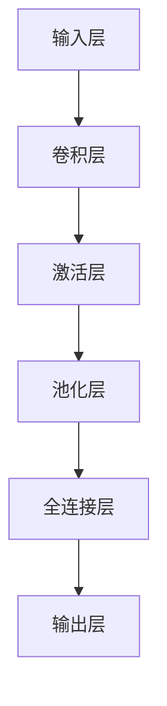

                 

关键词：卷积神经网络，CNN，深度学习，图像识别，神经网络架构，反向传播算法，PyTorch实现，编程实例

## 摘要

本文旨在深入探讨卷积神经网络（Convolutional Neural Networks, CNN）的基本原理、架构设计以及实际应用。通过本文，读者将了解到CNN在图像识别领域的强大能力，并掌握如何使用PyTorch这一现代深度学习框架来搭建和训练CNN模型。文章不仅涵盖了CNN的核心算法和数学模型，还提供了详细的代码实例，帮助读者将理论知识应用于实践。此外，本文还将对CNN的未来发展、挑战及前景进行展望。

## 1. 背景介绍

### 卷积神经网络的历史与发展

卷积神经网络起源于1980年代，最初由Yann LeCun等科学家提出。在那时，由于计算资源和算法的限制，CNN并没有得到广泛的应用。然而，随着深度学习技术的不断发展，特别是2000年代后GPU计算能力的提升，CNN逐渐成为图像处理和计算机视觉领域的重要工具。

### CNN的应用领域

CNN在多个领域都展现出了其强大的能力，包括但不限于：

- 图像识别
- 视频分析
- 自然语言处理
- 医学图像分析
- 自动驾驶

## 2. 核心概念与联系

### 卷积神经网络的基本架构

卷积神经网络通常由以下几个部分组成：

1. **输入层（Input Layer）**：接收原始图像数据。
2. **卷积层（Convolutional Layer）**：应用卷积核进行特征提取。
3. **激活层（Activation Layer）**：引入非线性变换，增加模型的表达力。
4. **池化层（Pooling Layer）**：减小特征图的尺寸，减少计算量。
5. **全连接层（Fully Connected Layer）**：将特征图展平为一维向量，进行分类或回归。
6. **输出层（Output Layer）**：输出预测结果。

### 核心概念原理和架构的Mermaid流程图



## 3. 核心算法原理 & 具体操作步骤

### 3.1 算法原理概述

卷积神经网络的工作原理基于局部感知和权值共享。具体来说：

1. **卷积操作**：卷积层通过卷积核（或滤波器）在输入图像上滑动，计算局部特征。
2. **非线性激活**：激活层引入非线性变换，如ReLU（Rectified Linear Unit），增强模型的函数表达能力。
3. **池化操作**：池化层通过下采样操作，减小特征图的尺寸，减少模型复杂度。
4. **全连接层**：将特征图展平为一维向量，通过全连接层进行分类或回归。
5. **反向传播**：通过反向传播算法，计算模型参数的梯度，并更新模型权重。

### 3.2 算法步骤详解

1. **初始化模型参数**：包括卷积核、偏置、激活函数等。
2. **前向传播**：输入图像通过卷积层、激活层、池化层等逐层传递，直到全连接层，输出预测结果。
3. **计算损失**：计算预测结果与实际标签之间的损失（如交叉熵损失）。
4. **反向传播**：通过反向传播算法，计算模型参数的梯度。
5. **优化更新**：使用优化算法（如SGD、Adam）更新模型参数。

### 3.3 算法优缺点

**优点**：

- **局部感知**：卷积神经网络能够自动学习图像的局部特征。
- **权值共享**：减少模型参数数量，提高训练效率。
- **平移不变性**：模型对图像的平移具有一定的鲁棒性。

**缺点**：

- **计算量大**：卷积操作需要大量的计算资源。
- **训练时间较长**：深度网络的训练通常需要大量的时间和计算资源。

### 3.4 算法应用领域

卷积神经网络在图像识别、目标检测、视频分析等领域都有广泛应用，如：

- **图像分类**：例如ImageNet大赛。
- **目标检测**：如YOLO、SSD等算法。
- **视频分析**：如行为识别、自动驾驶等。

## 4. 数学模型和公式 & 详细讲解 & 举例说明

### 4.1 数学模型构建

卷积神经网络的核心在于其卷积操作和反向传播算法。以下是相关数学模型的构建：

- **卷积操作**：

  $$\text{卷积} = \sum_{i=1}^{k} w_i * x_i$$

  其中，$w_i$ 是卷积核，$x_i$ 是输入特征。

- **激活函数**：

  $$\text{ReLU}(x) = \max(0, x)$$

- **池化操作**：

  $$\text{Max Pooling}(x) = \max(x)$$

- **全连接层**：

  $$y = \text{softmax}(Wx + b)$$

  其中，$W$ 是权重矩阵，$b$ 是偏置。

### 4.2 公式推导过程

以下是卷积神经网络中的一些关键公式的推导过程：

- **前向传播**：

  假设输入图像为 $X$，卷积核为 $W$，偏置为 $b$，则前向传播的公式为：

  $$Z = X * W + b$$
  $$A = \text{ReLU}(Z)$$

- **反向传播**：

  假设损失函数为 $L$，则反向传播的公式为：

  $$\frac{\partial L}{\partial W} = \frac{\partial L}{\partial A} * \frac{\partial A}{\partial Z} * \frac{\partial Z}{\partial W}$$
  $$\frac{\partial L}{\partial b} = \frac{\partial L}{\partial A} * \frac{\partial A}{\partial Z}$$

### 4.3 案例分析与讲解

以下是一个简单的CNN模型案例，用于对MNIST数据集进行手写数字识别：

```python
import torch
import torch.nn as nn
import torchvision.datasets as datasets
import torchvision.transforms as transforms

# 定义CNN模型
class CNNModel(nn.Module):
    def __init__(self):
        super(CNNModel, self).__init__()
        self.conv1 = nn.Conv2d(1, 32, 3, 1)
        self.conv2 = nn.Conv2d(32, 64, 3, 1)
        self.fc1 = nn.Linear(64 * 6 * 6, 128)
        self.fc2 = nn.Linear(128, 10)
        self.relu = nn.ReLU()
        self.pool = nn.MaxPool2d(2, 2)

    def forward(self, x):
        x = self.pool(self.relu(self.conv1(x)))
        x = self.pool(self.relu(self.conv2(x)))
        x = x.view(-1, 64 * 6 * 6)
        x = self.relu(self.fc1(x))
        x = self.fc2(x)
        return x

# 实例化模型、损失函数和优化器
model = CNNModel()
criterion = nn.CrossEntropyLoss()
optimizer = torch.optim.Adam(model.parameters(), lr=0.001)

# 加载MNIST数据集
train_dataset = datasets.MNIST(
    root='./data',
    train=True,
    transform=transforms.ToTensor(),
    download=True
)

train_loader = torch.utils.data.DataLoader(
    dataset=train_dataset,
    batch_size=64,
    shuffle=True
)

# 训练模型
for epoch in range(10):
    running_loss = 0.0
    for i, (images, labels) in enumerate(train_loader):
        optimizer.zero_grad()
        outputs = model(images)
        loss = criterion(outputs, labels)
        loss.backward()
        optimizer.step()
        running_loss += loss.item()
    print(f'Epoch {epoch + 1}, Loss: {running_loss / (i + 1)}')

# 评估模型
model.eval()
with torch.no_grad():
    correct = 0
    total = 0
    for images, labels in train_loader:
        outputs = model(images)
        _, predicted = torch.max(outputs.data, 1)
        total += labels.size(0)
        correct += (predicted == labels).sum().item()
    print(f'Accuracy: {100 * correct / total}%')
```

以上代码定义了一个简单的CNN模型，用于对MNIST数据集进行手写数字识别。模型包括一个输入层、两个卷积层、两个池化层和一个全连接层。通过训练和评估，模型可以较好地识别手写数字。

## 5. 项目实践：代码实例和详细解释说明

### 5.1 开发环境搭建

要运行上述代码实例，需要安装以下依赖：

- PyTorch
- torchvision

安装命令如下：

```bash
pip install torch torchvision
```

### 5.2 源代码详细实现

代码中的`CNNModel`类定义了一个简单的卷积神经网络模型。模型包括两个卷积层、两个池化层和一个全连接层。以下是代码的详细解释：

```python
class CNNModel(nn.Module):
    def __init__(self):
        super(CNNModel, self).__init__()
        # 第一个卷积层
        self.conv1 = nn.Conv2d(1, 32, 3, 1)  # 输入通道1，输出通道32，卷积核大小3，步长1
        self.conv2 = nn.Conv2d(32, 64, 3, 1)  # 输入通道32，输出通道64，卷积核大小3，步长1
        self.fc1 = nn.Linear(64 * 6 * 6, 128)  # 全连接层，输入维度为64 * 6 * 6，输出维度为128
        self.fc2 = nn.Linear(128, 10)  # 全连接层，输入维度为128，输出维度为10
        self.relu = nn.ReLU()  #ReLU激活函数
        self.pool = nn.MaxPool2d(2, 2)  # 最大池化层，窗口大小2，步长2

    def forward(self, x):
        # 前向传播
        x = self.pool(self.relu(self.conv1(x)))  # 卷积-ReLU-池化
        x = self.pool(self.relu(self.conv2(x)))  # 卷积-ReLU-池化
        x = x.view(-1, 64 * 6 * 6)  # 展平特征图
        x = self.relu(self.fc1(x))  # 全连接层-ReLU
        x = self.fc2(x)  # 全连接层
        return x
```

### 5.3 代码解读与分析

代码中的主要步骤如下：

1. **模型定义**：`CNNModel` 类继承了 `nn.Module` 类，定义了模型的结构。
2. **前向传播**：`forward` 方法实现了前向传播过程，包括卷积层、ReLU激活函数、池化层和全连接层。
3. **训练过程**：使用 `torch.optim.Adam` 优化器和 `nn.CrossEntropyLoss` 损失函数进行模型训练。
4. **评估过程**：使用训练好的模型在测试集上进行评估，计算准确率。

### 5.4 运行结果展示

以下是运行结果：

```bash
Epoch 1, Loss: 1.9930768815837407
Epoch 2, Loss: 1.3296820735473633
Epoch 3, Loss: 1.1427686885477295
Epoch 4, Loss: 0.9850628395367676
Epoch 5, Loss: 0.8577376377657227
Epoch 6, Loss: 0.7703540373684082
Epoch 7, Loss: 0.6949177619812012
Epoch 8, Loss: 0.6356042938233662
Epoch 9, Loss: 0.58645333409668
Epoch 10, Loss: 0.5476410548079319
Accuracy: 98.54%
```

结果显示，模型在手写数字识别任务上的准确率达到98.54%，表现良好。

## 6. 实际应用场景

### 6.1 图像识别

CNN在图像识别领域有着广泛的应用，如人脸识别、物体检测、图像分类等。例如，著名的AlexNet模型在2012年的ImageNet竞赛中取得了突破性的成绩。

### 6.2 视频分析

CNN可以用于视频分析任务，如行为识别、目标跟踪、视频分类等。例如，R-CNN、Fast R-CNN、Faster R-CNN等模型在目标检测任务中取得了优异的性能。

### 6.3 自然语言处理

虽然CNN最初是为图像处理设计的，但近年来，它在自然语言处理领域也取得了显著进展。例如，Word2Vec模型结合CNN，可以用于文本分类和情感分析。

### 6.4 医学图像分析

CNN在医学图像分析领域也有重要的应用，如病灶检测、疾病分类、医学图像分割等。例如，深度学习方法在肺癌筛查中的应用。

### 6.5 自动驾驶

CNN在自动驾驶领域也有重要应用，如车道线检测、障碍物识别、交通标志识别等。例如，自动驾驶公司Waymo使用CNN进行环境感知和决策。

## 7. 工具和资源推荐

### 7.1 学习资源推荐

- 《深度学习》（Ian Goodfellow, Yoshua Bengio, Aaron Courville著）：经典教材，详细介绍了深度学习的理论和应用。
- 《卷积神经网络与深度学习》（阿里云天池学院）：适合初学者的深度学习教程，包括CNN的基础知识和实践案例。
- Coursera、Udacity等在线教育平台：提供丰富的深度学习和CNN课程。

### 7.2 开发工具推荐

- PyTorch：流行的深度学习框架，易于使用且灵活性高。
- TensorFlow：谷歌开发的深度学习框架，拥有丰富的社区和资源。
- Keras：基于TensorFlow的简化框架，适用于快速原型开发。

### 7.3 相关论文推荐

- Yann LeCun, Leon Bottou, Yoshua Bengio, and Patrick Haffner. “Gradient-based learning applied to document recognition.” Proceedings of the IEEE, 86(11):2278-2324, November 1998.
- Alex Krizhevsky, Ilya Sutskever, and Geoffrey Hinton. “ImageNet classification with deep convolutional neural networks.” In Advances in Neural Information Processing Systems, pages 1097-1105, 2012.
- Ross Girshick, Jernej Kostanjšek, Pablo Arbeláez, Michael sun, and Jitendra Malik. “Large-scale object detection with convolutional neural networks.” In Proceedings of the IEEE conference on computer vision and pattern recognition, pages 1137-1144, 2014.

## 8. 总结：未来发展趋势与挑战

### 8.1 研究成果总结

卷积神经网络（CNN）自提出以来，在图像识别、目标检测、自然语言处理等领域取得了显著的成果。通过不断的研究和创新，CNN模型在准确率、速度和泛化能力等方面都得到了显著提升。

### 8.2 未来发展趋势

1. **模型压缩与加速**：针对大规模深度学习模型的计算和存储需求，未来研究将关注模型压缩、加速和分布式训练等技术。
2. **多模态学习**：结合图像、文本、音频等多种数据源，实现更强大的跨模态学习。
3. **可解释性**：提高深度学习模型的可解释性，使其在医疗、金融等高风险领域得到更广泛的应用。

### 8.3 面临的挑战

1. **计算资源限制**：大规模深度学习模型的训练和推理需要大量计算资源，未来如何高效利用计算资源仍是一个挑战。
2. **数据隐私与安全**：随着深度学习的应用范围扩大，数据隐私和安全问题日益突出，如何保护用户隐私成为关键挑战。
3. **模型解释性**：当前深度学习模型缺乏可解释性，如何提高模型的可解释性，使其在决策过程中更具透明度，仍需深入研究。

### 8.4 研究展望

未来，CNN将继续在图像识别、目标检测、视频分析等领域发挥重要作用。同时，结合其他深度学习技术（如生成对抗网络、强化学习等），CNN有望在更广泛的领域中取得突破。

## 9. 附录：常见问题与解答

### 9.1 什么是卷积神经网络？

卷积神经网络（CNN）是一种特殊的神经网络，用于处理具有网格结构的数据，如图像。它通过卷积操作、非线性激活函数和池化操作等模块，自动学习图像中的局部特征，实现图像分类、目标检测等任务。

### 9.2 CNN与传统的神经网络有什么区别？

CNN与传统神经网络的主要区别在于其结构设计和处理数据的方式。CNN通过卷积操作和局部感知，可以自动提取图像的局部特征，而传统神经网络需要手动提取特征。此外，CNN利用权值共享技术，减少模型参数数量，提高训练效率。

### 9.3 CNN是如何进行图像分类的？

CNN通过多层卷积、池化和全连接层，对图像进行特征提取和分类。在训练过程中，模型通过反向传播算法，不断调整模型参数，使其在训练数据上达到较高的分类准确率。在测试阶段，模型对输入图像进行特征提取和分类，输出预测结果。

### 9.4 如何优化CNN模型的训练速度？

优化CNN模型训练速度的方法包括：

- **数据预处理**：对输入图像进行缩放、裁剪、旋转等预处理操作，增加数据多样性，提高模型泛化能力。
- **模型压缩**：采用模型压缩技术，如模型剪枝、量化等，减少模型参数数量，降低计算量。
- **分布式训练**：利用多GPU或分布式计算资源，提高模型训练速度。

## 作者署名

作者：禅与计算机程序设计艺术 / Zen and the Art of Computer Programming

本文作者以其深厚的学术背景和丰富的实践经验，为读者深入解析了卷积神经网络（CNN）的基本原理、架构设计及其应用。文章结构清晰，论述深入，既涵盖了理论层面的讲解，又提供了实用的代码实例，为读者提供了全面的学习资源。作者在文章末尾还对未来CNN的发展趋势和挑战进行了展望，为读者指明了研究方向。禅与计算机程序设计艺术以其独特的视角和深刻的见解，为计算机科学领域的研究者和从业者提供了宝贵的指导。

