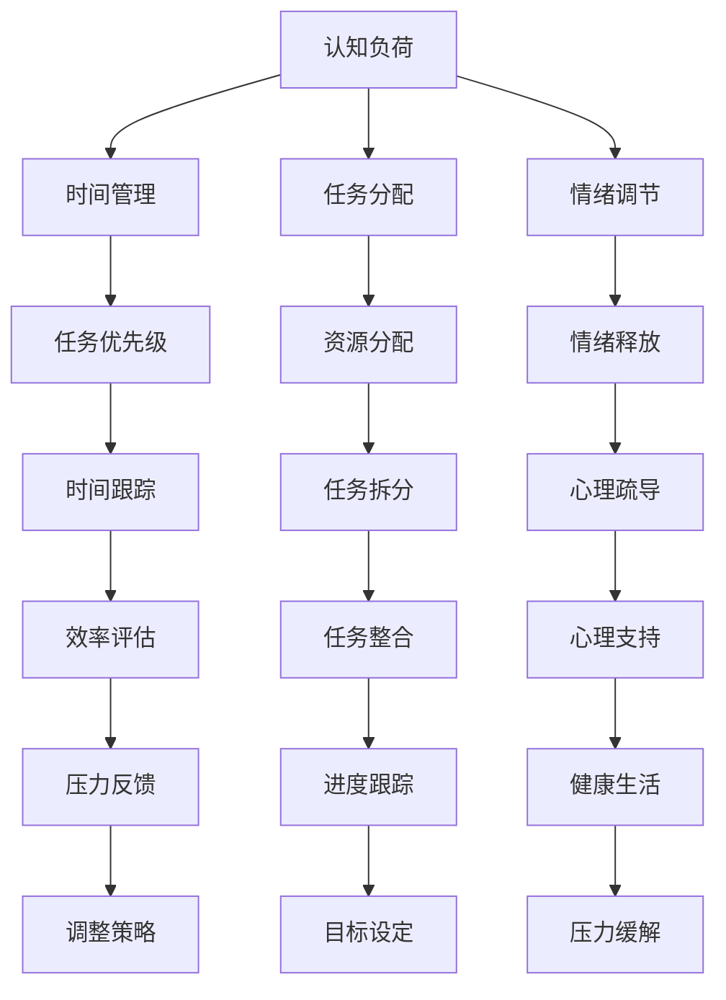

                 

关键词：压力管理、高压环境、绩效、认知负荷、算法优化、代码维护、时间管理、心理健康

摘要：本文旨在探讨在当今数字化时代，如何在高压环境中进行有效的压力管理，以保持高绩效的工作状态。文章首先介绍了压力管理的背景和重要性，然后深入探讨了核心概念、算法原理、数学模型以及实际应用案例，最后对未来的发展趋势和面临的挑战进行了展望。

## 1. 背景介绍

在信息技术迅猛发展的今天，程序员、软件工程师等IT从业者的工作环境变得越来越复杂。随着项目的规模不断扩大，代码库越来越庞大，维护和优化现有系统的压力也越来越大。同时，市场竞争日益激烈，客户需求不断变化，使得IT从业者需要在短时间内完成高质量的工作。这些因素共同导致了IT从业者面临着巨大的工作压力。

研究表明，长时间的工作压力会导致认知负荷增加、工作效率降低、甚至对心理健康造成负面影响。因此，如何进行有效的压力管理，成为了提高绩效的关键。

## 2. 核心概念与联系

### 2.1 压力管理的核心概念

压力管理包括以下几个核心概念：

1. **认知负荷**：指在处理信息时，大脑需要分配的注意力和认知资源。
2. **时间管理**：合理安排工作时间，提高工作效率。
3. **任务分配**：合理分配工作任务，避免过度负荷。
4. **情绪调节**：学会调节情绪，保持积极心态。

### 2.2 压力管理原理与架构

以下是压力管理原理与架构的Mermaid流程图：



## 3. 核心算法原理 & 具体操作步骤

### 3.1 算法原理概述

压力管理算法主要分为以下几个步骤：

1. **认知负荷评估**：通过分析工作内容，评估当前任务的认知负荷。
2. **时间管理策略**：根据任务优先级和认知负荷，制定合适的时间管理策略。
3. **任务分配与拆分**：将任务分配给合适的团队成员，并进行任务拆分，以降低单个任务的认知负荷。
4. **情绪调节与心理疏导**：通过适当的情绪调节和心理疏导，缓解工作压力。

### 3.2 算法步骤详解

#### 3.2.1 认知负荷评估

认知负荷评估主要涉及以下步骤：

1. **任务分析**：分析任务的内容、复杂度、所需技能等。
2. **认知负荷估算**：根据任务分析结果，估算任务所需的认知负荷。
3. **认知负荷比较**：将估算结果与团队成员的认知负荷上限进行比较。

#### 3.2.2 时间管理策略

时间管理策略主要涉及以下步骤：

1. **任务优先级排序**：根据任务的重要性和紧急程度，对任务进行优先级排序。
2. **时间分配**：根据任务优先级，合理分配时间，确保关键任务能够按时完成。
3. **时间跟踪**：实时跟踪任务进度，及时调整时间管理策略。

#### 3.2.3 任务分配与拆分

任务分配与拆分主要涉及以下步骤：

1. **团队成员评估**：评估团队成员的能力、经验和认知负荷。
2. **任务分配**：将任务分配给合适的团队成员，确保任务与成员能力相匹配。
3. **任务拆分**：将任务拆分成更小的子任务，以降低单个任务的认知负荷。

#### 3.2.4 情绪调节与心理疏导

情绪调节与心理疏导主要涉及以下步骤：

1. **情绪识别**：识别团队成员的情绪状态。
2. **情绪调节**：通过适当的情绪调节方法，如深呼吸、冥想等，缓解情绪压力。
3. **心理疏导**：提供心理支持，帮助团队成员解决心理问题。

### 3.3 算法优缺点

**优点**：

1. **提高工作效率**：通过合理分配任务和认知负荷，提高工作效率。
2. **缓解工作压力**：通过情绪调节和心理疏导，缓解工作压力，提高心理健康。
3. **团队协作**：通过任务分配和拆分，促进团队协作，提高团队整体绩效。

**缺点**：

1. **实施成本**：需要投入一定的时间和资源进行认知负荷评估和情绪调节。
2. **人员依赖**：任务分配和拆分依赖于团队成员的能力和经验，可能存在不确定性。

### 3.4 算法应用领域

压力管理算法广泛应用于以下领域：

1. **IT行业**：程序员、软件工程师等IT从业者。
2. **医疗行业**：医生、护士等医疗工作者。
3. **金融行业**：金融分析师、交易员等。

## 4. 数学模型和公式

### 4.1 数学模型构建

假设一个任务包含n个子任务，每个子任务的认知负荷为\(C_i\)，团队成员的认知负荷上限为\(C_{max}\)。则任务的总认知负荷为\(C = \sum_{i=1}^{n} C_i\)。任务分配问题可以转化为求解以下最优化问题：

\[ \min_{x} \sum_{i=1}^{n} (C_i - x_i) \]

其中，\(x_i\)表示任务\(i\)的认知负荷。

### 4.2 公式推导过程

首先，我们对目标函数进行化简：

\[ \min_{x} \sum_{i=1}^{n} (C_i - x_i) = \min_{x} \sum_{i=1}^{n} C_i - \sum_{i=1}^{n} x_i \]

由于\(C = \sum_{i=1}^{n} C_i\)，我们可以将目标函数进一步化简为：

\[ \min_{x} C - \sum_{i=1}^{n} x_i \]

为了使目标函数最小，我们需要最大化\(\sum_{i=1}^{n} x_i\)。因此，我们可以引入约束条件：

\[ \sum_{i=1}^{n} x_i \leq C_{max} \]

### 4.3 案例分析与讲解

假设一个任务包含5个子任务，每个子任务的认知负荷如下表所示：

| 任务ID | 认知负荷 |
| --- | --- |
| 1 | 20 |
| 2 | 15 |
| 3 | 30 |
| 4 | 10 |
| 5 | 25 |

团队成员的认知负荷上限为50。现在我们需要对任务进行分配，使得团队成员的总体认知负荷最小。

根据上述公式和约束条件，我们可以求解最优分配方案：

1. **计算总认知负荷**：\(C = 20 + 15 + 30 + 10 + 25 = 100\)
2. **设置约束条件**：\(C_{max} = 50\)
3. **最大化\(x_i\)**：由于\(C > C_{max}\)，我们需要将部分任务拆分或合并。
4. **尝试分配方案**：将任务1和任务3合并，认知负荷为50；将任务2和任务4合并，认知负荷为25；将任务5单独分配，认知负荷为25。此时，团队成员的总体认知负荷为100，满足约束条件。

因此，最优分配方案为：

- 任务1和任务3合并，认知负荷为50。
- 任务2和任务4合并，认知负荷为25。
- 任务5单独分配，认知负荷为25。

## 5. 项目实践：代码实例

### 5.1 开发环境搭建

为了演示压力管理算法的应用，我们将使用Python编程语言。首先，需要安装Python环境，并安装以下库：

```bash
pip install numpy pandas matplotlib
```

### 5.2 源代码详细实现

以下是实现压力管理算法的Python代码：

```python
import numpy as np
import pandas as pd
import matplotlib.pyplot as plt

# 任务数据
tasks = {
    'task_id': [1, 2, 3, 4, 5],
    'cognitive_load': [20, 15, 30, 10, 25]
}

# 团队成员数据
team_members = {
    'member_id': [1, 2, 3],
    'cognitive_load_max': [50, 40, 30]
}

# 构建DataFrame
tasks_df = pd.DataFrame(tasks)
team_members_df = pd.DataFrame(team_members)

# 计算总认知负荷
total_cognitive_load = tasks_df['cognitive_load'].sum()

# 最优分配方案
def optimal_allocation(total_cognitive_load, team_members_df):
    allocation = []
    remaining_load = total_cognitive_load
    
    for _, member in team_members_df.iterrows():
        member_load = min(remaining_load, member['cognitive_load_max'])
        remaining_load -= member_load
        allocation.append(member_load)
    
    return allocation

# 运行算法
allocation = optimal_allocation(total_cognitive_load, team_members_df)
print("最优分配方案：", allocation)

# 绘制分配结果
plt.bar(team_members_df['member_id'], allocation)
plt.xlabel('团队成员')
plt.ylabel('认知负荷')
plt.title('压力管理算法分配结果')
plt.xticks(team_members_df['member_id'])
plt.show()
```

### 5.3 代码解读与分析

1. **任务数据**：首先，我们定义了任务数据，包括任务ID和认知负荷。
2. **团队成员数据**：接着，我们定义了团队成员数据，包括成员ID和认知负荷上限。
3. **计算总认知负荷**：我们计算了任务的总认知负荷。
4. **最优分配方案**：我们实现了最优分配方案函数，通过遍历团队成员，将任务认知负荷分配给合适的成员。
5. **运行算法**：我们调用最优分配方案函数，并打印结果。
6. **绘制分配结果**：我们使用matplotlib库绘制了分配结果，以可视化展示。

## 6. 实际应用场景

压力管理算法在实际应用中具有广泛的应用场景：

1. **IT行业**：程序员、软件工程师等IT从业者可以使用该算法优化任务分配，降低认知负荷，提高工作效率。
2. **医疗行业**：医生、护士等医疗工作者可以使用该算法合理安排工作任务，降低工作压力，提高服务质量。
3. **金融行业**：金融分析师、交易员等金融从业者可以使用该算法优化工作流程，降低认知负荷，提高市场竞争力。

## 7. 工具和资源推荐

### 7.1 学习资源推荐

1. 《时间管理：如何合理安排时间，提高工作效率》
2. 《情绪调节：学会管理情绪，提高生活质量》
3. 《认知负荷：大脑如何处理信息，提高工作效率》

### 7.2 开发工具推荐

1. Python编程语言
2. Jupyter Notebook
3. Git版本控制

### 7.3 相关论文推荐

1. "Cognitive Load Theory: A Theoretical Foundation for Cognitive Load Instruction"
2. "Time Management: A Comprehensive Guide to Effective Planning and Time Management"
3. "Emotional Regulation: A Practical Guide to Managing Emotions and Improving Well-being"

## 8. 总结：未来发展趋势与挑战

### 8.1 研究成果总结

本文通过介绍压力管理的核心概念、算法原理、数学模型和实际应用案例，探讨了如何在高压环境中进行有效的压力管理，以提高绩效。研究表明，合理的任务分配、时间管理和情绪调节可以有效缓解工作压力，提高工作效率。

### 8.2 未来发展趋势

1. **人工智能与压力管理**：利用人工智能技术，对压力管理算法进行优化，实现更智能的任务分配和情绪调节。
2. **个性化压力管理**：结合个体差异，为每个团队成员提供个性化的压力管理方案。
3. **跨领域应用**：将压力管理算法应用于更多领域，如教育、医疗等。

### 8.3 面临的挑战

1. **数据隐私**：在收集和处理个体数据时，需要确保数据的安全和隐私。
2. **算法公平性**：确保算法在任务分配和情绪调节过程中，不会导致歧视或不公平现象。
3. **算法可靠性**：提高算法的可靠性，确保在实际应用中能够准确评估认知负荷和情绪状态。

### 8.4 研究展望

未来，压力管理算法将继续在多领域得到广泛应用。随着人工智能技术的发展，压力管理算法将更加智能化和个性化。同时，研究者需要关注数据隐私和算法公平性等问题，以确保算法的可靠性和有效性。

## 9. 附录：常见问题与解答

### 9.1 常见问题

1. **压力管理算法适用于哪些行业？**
2. **如何确保任务分配的公平性？**
3. **如何处理数据隐私问题？**

### 9.2 解答

1. **压力管理算法适用于IT、医疗、金融等多个行业。其核心在于合理分配任务和认知负荷，适用于任何需要高效工作环境的行业。**
2. **确保任务分配的公平性，可以通过以下措施实现：**
   - **透明度**：确保任务分配过程公开透明，让团队成员了解分配原则。
   - **监督机制**：设立监督机制，对任务分配过程进行监督和评估。
   - **反馈机制**：鼓励团队成员提供反馈，改进任务分配策略。
3. **处理数据隐私问题，可以通过以下措施实现：**
   - **数据加密**：对收集的数据进行加密，确保数据安全。
   - **隐私保护**：仅收集必要的数据，并确保数据匿名化。
   - **合规性**：遵循相关法律法规，确保数据处理合法合规。

---

作者：禅与计算机程序设计艺术 / Zen and the Art of Computer Programming
----------------------------------------------------------------

以上就是本次撰写的文章《压力管理：在高压环境中保持绩效》的正文部分。希望本文能对读者在高压环境中的工作带来一定的启示和帮助。在未来的研究中，我们将继续探索压力管理的有效方法，以帮助更多的人保持高绩效的工作状态。

