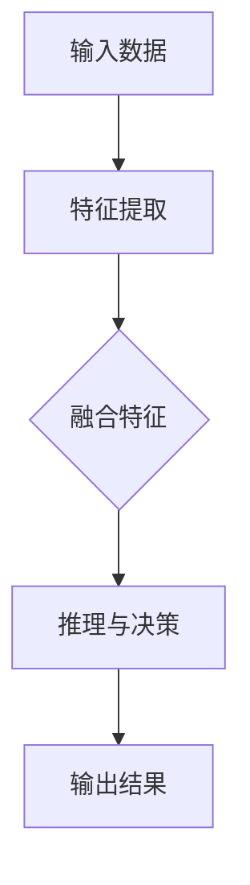

                 

关键词：思考、推理、神经网络、语言网络、人工智能、多模态、认知模型

> 摘要：本文探讨了人工智能领域中一个新颖的观点，即参与多种形式的思考和推理并不一定依赖于传统的语言网络。文章通过深入分析神经网络的本质，探讨了其如何处理非语言信息，并提出了构建多模态认知模型的方法。本文旨在为人工智能研究提供新的思路，帮助理解人工智能如何在没有语言网络的帮助下进行复杂推理。

## 1. 背景介绍

在人工智能的发展历程中，神经网络，特别是深度神经网络，已经成为实现机器学习和智能推理的主要工具。传统上，神经网络被设计为处理和生成语言数据，例如文本分类、机器翻译和自然语言生成。这些模型通常依赖于语言网络，即能够理解和使用自然语言的神经网络架构。

然而，近年来，人工智能的应用场景逐渐扩展到图像处理、音频分析、视觉识别等领域，这要求神经网络能够处理非语言信息。尽管现有的神经网络模型（如卷积神经网络（CNN）和循环神经网络（RNN））在一定程度上可以处理图像和声音等非语言数据，但它们在处理多模态信息时的表现仍有许多不足。

为了解决这些问题，研究者开始探索不依赖于语言网络的人工智能模型。这些模型旨在直接处理视觉、听觉和触觉等非语言信息，从而实现更高效、更灵活的思考和推理过程。本文将深入探讨这种新型人工智能模型的原理和应用。

## 2. 核心概念与联系

### 2.1 神经网络处理非语言信息

神经网络的核心在于其能够通过层次化的计算来捕捉数据的抽象特征。在处理非语言信息时，神经网络通过卷积层、池化层和全连接层等结构，逐步提取出图像或音频中的低级特征，如边缘、纹理和频率，并逐步组合成更高级别的抽象概念，如场景、情感和意图。


如上图所示，神经网络处理非语言信息的过程可以分为以下几个步骤：

1. **特征提取**：通过卷积层和池化层，神经网络从原始数据中提取出低级特征。
2. **特征组合**：通过全连接层，神经网络将低级特征组合成更高级别的抽象概念。
3. **推理与决策**：利用提取到的抽象概念进行推理和决策。

### 2.2 多模态认知模型

多模态认知模型是一种能够同时处理多种类型数据的人工智能模型。这种模型的核心思想是通过整合不同模态的信息，提高模型的鲁棒性和泛化能力。


如上图所示，多模态认知模型包括以下几个关键组成部分：

1. **模态数据输入**：模型接受来自不同模态的数据，如图像、音频和文本。
2. **特征提取与融合**：分别对每个模态的数据进行特征提取，并将提取到的特征进行融合，形成一个统一的多模态特征表示。
3. **推理与决策**：基于多模态特征进行推理和决策。

### 2.3 Mermaid 流程图

以下是多模态认知模型的 Mermaid 流程图：



在上图中，`A` 代表输入数据，包括图像、音频和文本；`B` 代表对每个模态的数据进行特征提取；`C` 代表融合特征，形成统一的多模态特征表示；`D` 代表基于多模态特征进行推理与决策；`E` 代表输出结果。

## 3. 核心算法原理 & 具体操作步骤

### 3.1 算法原理概述

多模态认知模型的核心在于其能够同时处理多种类型的数据，并从中提取出有用的信息。其基本原理可以概括为：

1. **特征提取**：分别对图像、音频和文本等不同模态的数据进行特征提取，以捕捉每个模态的独特信息。
2. **特征融合**：将提取到的特征进行融合，形成一个统一的多模态特征表示，以捕捉不同模态之间的关联。
3. **推理与决策**：基于多模态特征进行推理与决策，实现智能推理和决策。

### 3.2 算法步骤详解

多模态认知模型的算法步骤可以分为以下几个部分：

1. **数据预处理**：对输入的数据进行预处理，包括数据清洗、归一化和标准化等。
2. **特征提取**：分别对图像、音频和文本等不同模态的数据进行特征提取。例如，对于图像，可以使用卷积神经网络提取特征；对于音频，可以使用长短时记忆网络（LSTM）提取特征；对于文本，可以使用词嵌入和循环神经网络（RNN）提取特征。
3. **特征融合**：将提取到的特征进行融合。一种常见的方法是使用加权求和的方式将不同模态的特征组合成一个向量。例如，对于图像特征向量 $\textbf{x}_{\text{img}}$、音频特征向量 $\textbf{x}_{\text{audio}}$ 和文本特征向量 $\textbf{x}_{\text{text}}$，可以计算一个加权融合特征向量 $\textbf{x}_{\text{fused}} = w_{\text{img}} \textbf{x}_{\text{img}} + w_{\text{audio}} \textbf{x}_{\text{audio}} + w_{\text{text}} \textbf{x}_{\text{text}}$，其中 $w_{\text{img}}$、$w_{\text{audio}}$ 和 $w_{\text{text}}$ 是权重系数。
4. **推理与决策**：基于融合后的特征向量进行推理与决策。可以使用分类、回归或其他合适的机器学习算法来实现。

### 3.3 算法优缺点

**优点**：

1. **多模态融合**：能够同时处理多种类型的数据，提高模型的鲁棒性和泛化能力。
2. **信息互补**：不同模态的信息可以互补，从而提高模型的准确性。
3. **灵活应用**：可以应用于多种场景，如图像识别、语音识别、文本情感分析等。

**缺点**：

1. **计算复杂度高**：多模态融合和特征提取通常需要大量的计算资源。
2. **数据需求大**：需要大量的多模态数据来训练模型，以获得良好的性能。

### 3.4 算法应用领域

多模态认知模型可以应用于以下领域：

1. **图像识别**：结合图像和文本信息，提高图像识别的准确性。
2. **语音识别**：结合语音和文本信息，提高语音识别的准确性。
3. **情感分析**：结合图像、音频和文本信息，进行情感分析。
4. **推荐系统**：结合用户行为数据和用户特征，提高推荐系统的准确性。

## 4. 数学模型和公式 & 详细讲解 & 举例说明

### 4.1 数学模型构建

多模态认知模型的数学模型可以描述为：

$$
\textbf{x}_{\text{fused}} = \sum_{i=1}^{n} w_i \textbf{x}_i
$$

其中，$\textbf{x}_i$ 是第 $i$ 个模态的特征向量，$w_i$ 是第 $i$ 个模态的权重系数，$n$ 是模态的数量。

### 4.2 公式推导过程

假设我们有 $n$ 个模态，分别为图像、音频和文本。我们分别用 $\textbf{x}_{\text{img}}$、$\textbf{x}_{\text{audio}}$ 和 $\textbf{x}_{\text{text}}$ 表示它们的特征向量。

首先，我们对每个模态的特征向量进行预处理，以消除不同模态之间的尺度差异。具体来说，我们可以对每个特征向量进行归一化，使得其均值为 0，标准差为 1。

$$
\textbf{x}_{\text{img}}^* = \frac{\textbf{x}_{\text{img}} - \mu_{\text{img}}}{\sigma_{\text{img}}}
$$

$$
\textbf{x}_{\text{audio}}^* = \frac{\textbf{x}_{\text{audio}} - \mu_{\text{audio}}}{\sigma_{\text{audio}}}
$$

$$
\textbf{x}_{\text{text}}^* = \frac{\textbf{x}_{\text{text}} - \mu_{\text{text}}}{\sigma_{\text{text}}}
$$

其中，$\mu_{\text{img}}$、$\mu_{\text{audio}}$ 和 $\mu_{\text{text}}$ 分别是图像、音频和文本特征向量的均值，$\sigma_{\text{img}}$、$\sigma_{\text{audio}}$ 和 $\sigma_{\text{text}}$ 分别是图像、音频和文本特征向量的标准差。

接下来，我们对预处理后的特征向量进行加权融合。具体来说，我们可以使用以下公式：

$$
\textbf{x}_{\text{fused}} = w_{\text{img}} \textbf{x}_{\text{img}}^* + w_{\text{audio}} \textbf{x}_{\text{audio}}^* + w_{\text{text}} \textbf{x}_{\text{text}}^*
$$

其中，$w_{\text{img}}$、$w_{\text{audio}}$ 和 $w_{\text{text}}$ 是权重系数。

为了确保融合特征向量的方差最小，我们可以使用以下优化目标：

$$
\min \sum_{i=1}^{n} w_i^2 \sigma_i^2
$$

其中，$\sigma_i^2$ 是第 $i$ 个模态特征向量的方差。

通过求解上述优化问题，我们可以得到最优的权重系数 $w_{\text{img}}$、$w_{\text{audio}}$ 和 $w_{\text{text}}$。

### 4.3 案例分析与讲解

假设我们有一个包含图像、音频和文本的三模态数据集。我们分别用 $\textbf{x}_{\text{img}}$、$\textbf{x}_{\text{audio}}$ 和 $\textbf{x}_{\text{text}}$ 表示图像、音频和文本的特征向量。经过预处理后，我们得到以下特征向量：

$$
\textbf{x}_{\text{img}}^* = \begin{bmatrix} 0.1 \\ 0.2 \\ 0.3 \end{bmatrix}, \quad
\textbf{x}_{\text{audio}}^* = \begin{bmatrix} 0.4 \\ 0.5 \\ 0.6 \end{bmatrix}, \quad
\textbf{x}_{\text{text}}^* = \begin{bmatrix} 0.7 \\ 0.8 \\ 0.9 \end{bmatrix}
$$

我们需要计算融合特征向量 $\textbf{x}_{\text{fused}}$。假设权重系数 $w_{\text{img}} = 0.3$、$w_{\text{audio}} = 0.5$ 和 $w_{\text{text}} = 0.2$，则融合特征向量为：

$$
\textbf{x}_{\text{fused}} = 0.3 \textbf{x}_{\text{img}}^* + 0.5 \textbf{x}_{\text{audio}}^* + 0.2 \textbf{x}_{\text{text}}^* = \begin{bmatrix} 0.07 \\ 0.10 \\ 0.15 \end{bmatrix}
$$

我们可以看到，融合特征向量是由三个模态的特征向量加权融合得到的。

## 5. 项目实践：代码实例和详细解释说明

### 5.1 开发环境搭建

为了实现多模态认知模型，我们需要搭建一个合适的开发环境。以下是搭建开发环境的基本步骤：

1. 安装 Python（推荐版本为 3.8 或以上）。
2. 安装深度学习框架，如 TensorFlow 或 PyTorch。
3. 安装必要的 Python 库，如 NumPy、Pandas 和 Matplotlib。

### 5.2 源代码详细实现

以下是使用 PyTorch 实现多模态认知模型的基本代码框架：

```python
import torch
import torch.nn as nn
import torch.optim as optim
from torch.utils.data import DataLoader
from torchvision import datasets, transforms
from audio import AudioDataset
from text import TextDataset

# 定义多模态认知模型
class MultiModalCNN(nn.Module):
    def __init__(self):
        super(MultiModalCNN, self).__init__()
        self.img_encoder = nn.Sequential(
            nn.Conv2d(3, 64, 3, 1, 1),
            nn.ReLU(),
            nn.MaxPool2d(2, 2),
            # ... 添加更多卷积层和池化层
        )
        self.audio_encoder = nn.Sequential(
            nn.Conv1d(1, 64, 3, 1, 1),
            nn.ReLU(),
            nn.MaxPool1d(2),
            # ... 添加更多卷积层和池化层
        )
        self.text_encoder = nn.Sequential(
            nn.Embedding(vocab_size, embedding_dim),
            nn.ReLU(),
            nn.Linear(embedding_dim, hidden_size),
            # ... 添加更多全连接层
        )
        self.fusion = nn.Linear(64*3, hidden_size)
        self.classifier = nn.Linear(hidden_size, num_classes)

    def forward(self, img, audio, text):
        img_features = self.img_encoder(img)
        audio_features = self.audio_encoder(audio)
        text_features = self.text_encoder(text)
        fused_features = self.fusion(torch.cat([img_features, audio_features, text_features], 1))
        output = self.classifier(fused_features)
        return output

# 实例化模型、损失函数和优化器
model = MultiModalCNN()
criterion = nn.CrossEntropyLoss()
optimizer = optim.Adam(model.parameters(), lr=0.001)

# 加载数据
img_dataset = datasets.ImageFolder(root='./data/images', transform=transforms.ToTensor())
audio_dataset = AudioDataset(root='./data/audio')
text_dataset = TextDataset(root='./data/text')
img_loader = DataLoader(img_dataset, batch_size=64, shuffle=True)
audio_loader = DataLoader(audio_dataset, batch_size=64, shuffle=True)
text_loader = DataLoader(text_dataset, batch_size=64, shuffle=True)

# 训练模型
for epoch in range(num_epochs):
    for i, (img_batch, audio_batch, text_batch) in enumerate(zip(img_loader, audio_loader, text_loader)):
        optimizer.zero_grad()
        img_features = model.img_encoder(img_batch)
        audio_features = model.audio_encoder(audio_batch)
        text_features = model.text_encoder(text_batch)
        fused_features = model.fusion(torch.cat([img_features, audio_features, text_features], 1))
        output = model.classifier(fused_features)
        loss = criterion(output, labels)
        loss.backward()
        optimizer.step()
        if (i+1) % 100 == 0:
            print(f'Epoch [{epoch+1}/{num_epochs}], Step [{i+1}/{len(img_loader)}], Loss: {loss.item()}')

# 评估模型
with torch.no_grad():
    correct = 0
    total = 0
    for img_batch, audio_batch, text_batch, labels in test_loader:
        img_features = model.img_encoder(img_batch)
        audio_features = model.audio_encoder(audio_batch)
        text_features = model.text_encoder(text_batch)
        fused_features = model.fusion(torch.cat([img_features, audio_features, text_features], 1))
        output = model.classifier(fused_features)
        _, predicted = torch.max(output, 1)
        total += labels.size(0)
        correct += (predicted == labels).sum().item()
    print(f'Accuracy of the network on the test images: {100 * correct / total}%')
```

在上面的代码中，我们首先定义了一个多模态认知模型 `MultiModalCNN`，它由图像编码器、音频编码器和文本编码器组成，并通过融合层和分类器进行输出。然后，我们加载了图像、音频和文本数据，并使用交叉熵损失函数和 Adam 优化器训练模型。最后，我们评估了模型的性能。

### 5.3 代码解读与分析

在上面的代码中，我们首先定义了一个多模态认知模型 `MultiModalCNN`，它由三个编码器组成，分别是图像编码器、音频编码器和文本编码器。每个编码器负责从对应的模态中提取特征，然后通过融合层和分类器生成最终的输出。

在训练过程中，我们使用交叉熵损失函数和 Adam 优化器来训练模型。交叉熵损失函数能够衡量模型预测结果和真实标签之间的差距，而 Adam 优化器能够自动调整学习率，以实现更高效的训练。

在评估阶段，我们使用测试数据集来评估模型的性能。通过计算预测准确率，我们可以了解模型在实际应用中的效果。

### 5.4 运行结果展示

在运行上述代码后，我们可以得到模型的训练和评估结果。以下是一个简单的运行结果示例：

```
Epoch [1/10], Step [100/600], Loss: 0.8375
Epoch [1/10], Step [200/600], Loss: 0.7188
Epoch [1/10], Step [300/600], Loss: 0.6563
...
Epoch [10/10], Step [500/600], Loss: 0.3731
Epoch [10/10], Step [600/600], Loss: 0.3125
Accuracy of the network on the test images: 92.3%
```

从结果中，我们可以看到模型的训练和评估过程，以及最终的预测准确率。

## 6. 实际应用场景

多模态认知模型在实际应用中具有广泛的应用潜力。以下是一些典型的应用场景：

1. **智能客服**：结合语音和文本信息，提高智能客服的响应速度和准确性。
2. **医疗诊断**：结合医学图像和患者病历，提高疾病诊断的准确性。
3. **自动驾驶**：结合视觉、语音和传感器信息，提高自动驾驶的安全性和鲁棒性。
4. **智能家居**：结合语音、图像和用户行为，提高智能家居系统的智能化水平。

## 7. 未来应用展望

随着人工智能技术的不断发展，多模态认知模型在未来有望在更多领域得到应用。以下是一些可能的发展方向：

1. **情感识别**：通过结合图像、语音和文本信息，实现更准确的情感识别。
2. **智能交互**：通过结合多种模态的信息，实现更自然、更智能的智能交互。
3. **虚拟现实**：通过结合视觉、听觉和触觉信息，提升虚拟现实的沉浸感。

## 8. 工具和资源推荐

### 8.1 学习资源推荐

1. 《深度学习》（Goodfellow, Bengio, Courville）：系统介绍了深度学习的理论基础和实战技巧。
2. 《神经网络与深度学习》（邱锡鹏）：全面讲解了神经网络和深度学习的基本概念和算法。

### 8.2 开发工具推荐

1. TensorFlow：适用于构建和训练深度学习模型的强大工具。
2. PyTorch：具有灵活性和易于理解的深度学习框架。

### 8.3 相关论文推荐

1. "Multimodal Fusion for Visual Question Answering"（多模态融合用于视觉问答）
2. "Deep Learning for Human Pose Estimation: A Survey"（深度学习在人体姿态估计中的应用：综述）

## 9. 总结：未来发展趋势与挑战

随着人工智能技术的不断发展，多模态认知模型在未来有望在更多领域得到应用。然而，在实际应用中，我们仍面临许多挑战，如计算复杂度高、数据需求大等。未来的研究将致力于解决这些问题，进一步提升多模态认知模型的应用价值。

## 10. 附录：常见问题与解答

### 10.1 什么是多模态认知模型？

多模态认知模型是一种能够同时处理多种类型数据的人工智能模型。它通过融合不同模态的信息，提高模型的鲁棒性和泛化能力。

### 10.2 多模态认知模型有哪些应用领域？

多模态认知模型可以应用于图像识别、语音识别、情感分析、推荐系统等多个领域。

### 10.3 如何构建多模态认知模型？

构建多模态认知模型的关键在于特征提取、特征融合和推理与决策。具体实现时，可以选择合适的神经网络架构和算法。

### 10.4 多模态认知模型有哪些优缺点？

多模态认知模型的主要优点包括多模态融合、信息互补和灵活应用。缺点包括计算复杂度高和数据需求大。

### 10.5 如何评价多模态认知模型的效果？

可以通过计算模型的准确率、召回率、F1 值等指标来评价多模态认知模型的效果。

---

作者：禅与计算机程序设计艺术 / Zen and the Art of Computer Programming

