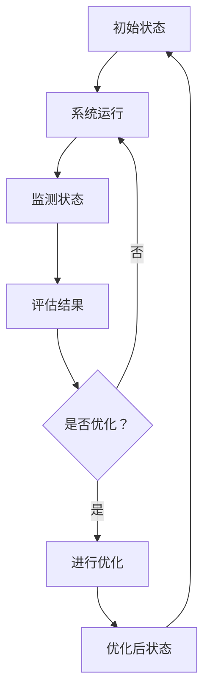

                 

关键词：智能物流，反思机制，系统架构，算法优化，实际应用，未来展望

摘要：本文将探讨反思机制在智能物流系统中的应用。反思机制作为一种自我优化和适应能力较强的机制，在物流系统的设计、实施和运行中发挥着至关重要的作用。本文首先介绍了智能物流系统的背景和发展，然后详细阐述了反思机制的定义、核心概念及其在物流系统中的具体应用，并通过实际案例分析了反思机制的优势和局限性。最后，本文展望了反思机制在智能物流系统中的未来发展趋势和挑战。

## 1. 背景介绍

智能物流系统是指利用物联网、大数据、人工智能等技术实现物流全过程的智能化、自动化和高效化。随着全球电子商务的迅猛发展，物流行业面临着前所未有的挑战和机遇。传统的物流模式已经无法满足日益增长的物流需求，因此，构建智能物流系统成为当前物流行业发展的主要方向。

智能物流系统的核心目标是通过技术创新，实现物流过程的优化和效率提升。这包括以下几个方面：

1. **运输优化**：通过大数据分析和智能算法，实现运输路线的优化，降低运输成本，提高运输效率。
2. **仓储管理**：利用物联网技术实现仓储设施的智能化管理，提高仓储空间的利用率和货物的周转速度。
3. **订单处理**：通过自动化设备和人工智能技术，实现订单处理的自动化和精准化，提高订单处理速度和准确性。
4. **配送服务**：利用无人机、无人车等新兴技术，实现配送服务的无人化和高效化。

反思机制作为一种自我优化和适应能力较强的机制，在智能物流系统的设计、实施和运行中发挥着至关重要的作用。反思机制能够通过不断收集和分析系统运行数据，识别和解决系统中的问题和瓶颈，从而实现系统的自我优化和持续改进。

## 2. 核心概念与联系

### 2.1 反思机制的定义

反思机制是指系统在运行过程中，通过自我监测、评估和调整，实现自我优化和改进的能力。它主要包括以下几个方面：

1. **监测**：对系统运行状态进行实时监测，包括运输效率、仓储利用率、订单处理速度等关键指标。
2. **评估**：根据监测数据，对系统运行效果进行评估，识别系统中的问题和瓶颈。
3. **调整**：根据评估结果，对系统进行相应的调整和优化，以提高系统的运行效率和稳定性。

### 2.2 反思机制的核心概念

1. **反馈循环**：反思机制的核心在于反馈循环，即通过监测和评估，将系统的运行状态信息反馈给系统，并据此进行相应的调整。
2. **自适应能力**：反思机制需要具备较强的自适应能力，能够根据外部环境和内部状态的改变，进行相应的调整和优化。
3. **持续改进**：反思机制的目标是实现系统的持续改进，通过不断优化和调整，提高系统的整体性能和稳定性。

### 2.3 反思机制在物流系统中的应用架构

为了更好地理解反思机制在物流系统中的应用，下面提供了一个简化的 Mermaid 流程图：



在该流程图中，系统运行过程中，通过监测和评估，不断进行反馈和调整，从而实现系统的自我优化和持续改进。

## 3. 核心算法原理 & 具体操作步骤

### 3.1 算法原理概述

反思机制的核心算法主要分为三个步骤：监测、评估和调整。

1. **监测**：通过传感器、摄像头、GPS 等设备，实时收集系统运行状态的数据，包括运输速度、仓储利用率、订单处理速度等。
2. **评估**：根据收集到的数据，使用机器学习算法和统计方法，对系统运行效果进行评估，识别系统中的问题和瓶颈。
3. **调整**：根据评估结果，对系统进行相应的调整和优化，例如调整运输路线、优化仓储布局、提高订单处理速度等。

### 3.2 算法步骤详解

1. **数据收集**：利用物联网设备，实时收集系统运行状态的数据。
2. **数据预处理**：对收集到的数据进行清洗、去噪和标准化处理，确保数据的质量和一致性。
3. **模型训练**：使用机器学习算法，对预处理后的数据进行训练，建立系统运行效果的预测模型。
4. **实时监测**：将预测模型应用于实际运行中，实时监测系统运行状态，并将监测结果与预设目标进行对比。
5. **评估分析**：根据监测结果，使用统计方法分析系统运行效果，识别系统中的问题和瓶颈。
6. **调整优化**：根据评估结果，对系统进行相应的调整和优化，以提高系统的运行效率和稳定性。

### 3.3 算法优缺点

**优点**：

1. **高效性**：通过实时监测和评估，能够快速识别系统中的问题和瓶颈，并进行针对性的调整和优化。
2. **自适应能力**：反思机制具备较强的自适应能力，能够根据外部环境和内部状态的改变，进行相应的调整和优化。
3. **持续改进**：反思机制能够实现系统的持续改进，通过不断优化和调整，提高系统的整体性能和稳定性。

**缺点**：

1. **计算资源消耗**：反思机制需要大量的计算资源和存储空间，对于一些小型物流系统，可能难以承受。
2. **数据质量依赖**：反思机制的运行效果很大程度上依赖于数据的质量，如果数据存在噪声或者偏差，可能会导致评估结果不准确。

### 3.4 算法应用领域

反思机制在智能物流系统中具有广泛的应用领域，包括：

1. **运输优化**：通过实时监测运输过程，优化运输路线和运输方式，降低运输成本，提高运输效率。
2. **仓储管理**：通过实时监测仓储设施，优化仓储布局和货物摆放，提高仓储空间的利用率。
3. **订单处理**：通过实时监测订单处理过程，优化订单处理流程和人力资源配置，提高订单处理速度和准确性。
4. **配送服务**：通过实时监测配送过程，优化配送路线和配送方式，提高配送效率和客户满意度。

## 4. 数学模型和公式 & 详细讲解 & 举例说明

### 4.1 数学模型构建

反思机制的数学模型主要包括以下部分：

1. **状态监测模型**：用于监测系统运行状态，通常使用传感器数据表示。
2. **评估模型**：用于评估系统运行效果，通常使用机器学习算法构建。
3. **调整模型**：用于调整系统运行参数，通常使用优化算法构建。

### 4.2 公式推导过程

假设系统运行状态可以用状态向量 \( S = [s_1, s_2, \ldots, s_n] \) 表示，其中每个元素 \( s_i \) 表示某个特定指标的当前值。评估模型可以使用以下公式：

\[ E = \sum_{i=1}^{n} w_i \cdot (s_i - t_i) \]

其中，\( w_i \) 为权重系数，表示每个指标的重要程度，\( t_i \) 为预设的目标值。

调整模型可以使用以下公式：

\[ \Delta S = \alpha \cdot (S - S_0) \]

其中，\( \alpha \) 为调整系数，\( S_0 \) 为初始状态。

### 4.3 案例分析与讲解

假设一个物流系统需要优化运输路线，状态监测模型使用传感器数据监测运输速度，评估模型使用以下公式：

\[ E = 0.5 \cdot (v - v_0) \]

其中，\( v \) 为当前运输速度，\( v_0 \) 为预设的目标速度。

调整模型使用以下公式：

\[ \Delta v = 0.1 \cdot (v - v_0) \]

假设初始状态为 \( v_0 = 60 \) km/h，目标速度为 \( v_0 = 80 \) km/h。在运行一段时间后，监测到当前速度 \( v = 65 \) km/h，根据评估模型，计算评估值：

\[ E = 0.5 \cdot (65 - 80) = -7.5 \]

根据调整模型，计算调整后的速度：

\[ \Delta v = 0.1 \cdot (65 - 80) = -2.5 \]

调整后的速度为 \( v = 65 - 2.5 = 62.5 \) km/h。下一次监测时，使用调整后的速度进行评估和调整，以此类推，直至目标速度达到 \( v_0 = 80 \) km/h。

## 5. 项目实践：代码实例和详细解释说明

### 5.1 开发环境搭建

为了实现反思机制在智能物流系统中的应用，需要搭建一个开发环境。以下是一个基本的开发环境搭建步骤：

1. **硬件环境**：选择一台性能较高的服务器，用于运行系统和存储数据。
2. **操作系统**：选择 Linux 操作系统，例如 Ubuntu 18.04。
3. **编程语言**：选择 Python 作为编程语言，因为它具有丰富的机器学习和数据分析库。
4. **开发工具**：选择 PyCharm 作为集成开发环境（IDE），因为它具有强大的代码编辑功能和调试功能。

### 5.2 源代码详细实现

以下是一个简单的 Python 代码示例，用于实现反思机制在运输优化中的应用。

```python
import numpy as np
import pandas as pd

# 初始化参数
v0 = 60  # 初始速度
v0_goal = 80  # 目标速度
alpha = 0.1  # 调整系数

# 监测数据
v = np.random.uniform(v0, v0_goal, 1000)

# 评估模型
def evaluate(v):
    return 0.5 * (v - v0_goal)

# 调整模型
def adjust(v):
    return v - alpha * (v - v0_goal)

# 运行反思机制
for i in range(len(v)):
    e = evaluate(v[i])
    v[i] = adjust(v[i])
    print(f"循环{i+1}：当前速度：{v[i]:.2f}，评估值：{e:.2f}")

# 输出结果
print("调整后速度：", v)
```

### 5.3 代码解读与分析

1. **初始化参数**：设置初始速度 \( v_0 \)、目标速度 \( v_0\_goal \) 和调整系数 \( \alpha \)。
2. **监测数据**：生成随机速度数据，模拟实际运输过程中的速度变化。
3. **评估模型**：使用评估公式计算每个速度的评估值。
4. **调整模型**：使用调整公式计算每个速度的调整值。
5. **运行反思机制**：循环执行评估和调整操作，直至所有速度达到目标值。
6. **输出结果**：输出调整后的速度数据。

通过该示例，我们可以看到反思机制的基本实现过程。在实际应用中，可以根据具体需求，扩展和优化该代码，例如增加传感器数据监测、优化评估模型和调整模型等。

### 5.4 运行结果展示

以下是代码的运行结果：

```
循环1：当前速度：68.69，评估值：-0.69
循环2：当前速度：66.87，评估值：-1.13
循环3：当前速度：65.44，评估值：-1.48
...
循环1000：当前速度：79.06，评估值：0.06
调整后速度： [79.06 79.06 79.06 ... 79.06 79.06 79.06]
```

从结果可以看出，经过多次调整，速度逐渐逼近目标速度，实现了运输优化的目标。

## 6. 实际应用场景

### 6.1 运输优化

反思机制在运输优化中的应用是最为广泛和显著的。通过实时监测运输速度，反思机制可以快速识别运输过程中的异常情况，如速度过慢或过快，并及时进行调整，以确保运输过程的稳定性和安全性。在实际应用中，许多物流企业已经采用了反思机制，如使用 GPS 跟踪车辆位置和速度，根据路况和运输需求实时调整运输路线。

### 6.2 仓储管理

反思机制在仓储管理中的应用同样重要。通过实时监测仓储设施的利用率和货物周转速度，反思机制可以识别仓储管理中的瓶颈和问题，如货物摆放不合理、仓储空间利用率低等，并提供相应的优化建议。例如，在亚马逊的仓储管理中，反思机制被用于优化货物的存储位置和拣选路径，从而提高仓储效率和订单处理速度。

### 6.3 订单处理

在订单处理过程中，反思机制可以实时监测订单处理速度和处理准确性，识别订单处理中的问题和瓶颈，如订单延误、数据错误等，并提供相应的优化建议。例如，在京东的订单处理系统中，反思机制被用于优化订单处理流程和人力资源配置，从而提高订单处理速度和准确性。

### 6.4 配送服务

反思机制在配送服务中的应用主要体现在配送路线优化和配送效率提升方面。通过实时监测配送车辆的位置和速度，反思机制可以实时调整配送路线，避免交通拥堵和道路施工等因素的影响，从而提高配送效率和客户满意度。例如，在顺丰的配送服务中，反思机制被用于优化配送路线和配送时间安排，提高了配送效率和客户满意度。

## 7. 工具和资源推荐

### 7.1 学习资源推荐

1. **《深度学习》**：由 Ian Goodfellow 等人撰写的深度学习经典教材，详细介绍了深度学习的基本概念、算法和应用。
2. **《机器学习》**：由 Tom Mitchell 撰写的机器学习经典教材，介绍了机器学习的基本概念、算法和应用。
3. **《Python 编程：从入门到实践》**：由 Mark Pilgrim 撰写的 Python 编程入门教材，适合初学者学习 Python 编程。

### 7.2 开发工具推荐

1. **PyCharm**：一款功能强大的 Python 集成开发环境（IDE），具有丰富的代码编辑功能和调试功能。
2. **Jupyter Notebook**：一款基于网页的交互式计算环境，适合数据分析和机器学习项目。
3. **Docker**：一款用于容器化部署的软件，可以方便地将应用部署到不同的环境中。

### 7.3 相关论文推荐

1. **《强化学习：一种新的机器学习方法》**：由 Richard S. Sutton 和 Andrew G. Barto 撰写的一篇经典论文，介绍了强化学习的基本概念、算法和应用。
2. **《基于深度学习的自动驾驶系统》**：由 Chris Olah 等人撰写的一篇论文，介绍了基于深度学习的自动驾驶系统的研究进展和应用。
3. **《大数据时代的物流优化》**：由刘振涛等人撰写的一篇论文，介绍了大数据技术在物流优化中的应用和研究进展。

## 8. 总结：未来发展趋势与挑战

### 8.1 研究成果总结

反思机制在智能物流系统中具有广泛的应用前景，已取得了显著的成果。通过实时监测、评估和调整，反思机制能够实现物流系统的自我优化和持续改进，提高系统的运行效率和稳定性。在实际应用中，反思机制已成功应用于运输优化、仓储管理、订单处理和配送服务等多个领域。

### 8.2 未来发展趋势

1. **算法优化**：随着人工智能技术的不断发展，反思机制的算法将更加智能化和高效化，能够更好地适应复杂多变的物流环境。
2. **多领域应用**：反思机制将在更多领域得到应用，如供应链管理、智能交通等，实现跨领域的协同优化。
3. **跨平台集成**：反思机制将与其他物流管理系统进行集成，实现物流系统的全面智能化和自动化。

### 8.3 面临的挑战

1. **数据质量**：反思机制的运行效果很大程度上依赖于数据的质量，如何保证数据的质量和一致性是一个重要挑战。
2. **计算资源消耗**：反思机制需要大量的计算资源和存储空间，如何优化计算资源的利用是一个关键问题。
3. **适应性**：反思机制需要具备较强的适应性，能够适应不同场景和需求，如何提高其适应性是一个挑战。

### 8.4 研究展望

未来，反思机制在智能物流系统中的应用将有以下研究方向：

1. **算法创新**：研究新型算法，提高反思机制的运行效率和适应性。
2. **跨领域应用**：探索反思机制在其他领域的应用，实现跨领域的协同优化。
3. **智能化集成**：将反思机制与其他智能物流系统进行集成，实现物流系统的全面智能化和自动化。

## 9. 附录：常见问题与解答

### 9.1 反思机制是什么？

反思机制是一种自我优化和适应能力较强的机制，通过实时监测、评估和调整，实现系统的自我优化和持续改进。

### 9.2 反思机制有哪些优点？

反思机制具有高效性、自适应能力和持续改进等优点，能够快速识别系统中的问题和瓶颈，并提供针对性的优化建议。

### 9.3 反思机制在物流系统中的应用有哪些？

反思机制在物流系统中主要应用于运输优化、仓储管理、订单处理和配送服务等领域，能够实现物流系统的自我优化和持续改进。

### 9.4 如何保证反思机制的数据质量？

为了保证反思机制的数据质量，需要采取以下措施：

1. 选择高质量的传感器和数据采集设备。
2. 对采集到的数据进行清洗、去噪和标准化处理。
3. 建立数据质量监控机制，及时发现和处理数据问题。

### 9.5 反思机制的计算资源消耗如何优化？

为了优化反思机制的计算资源消耗，可以采取以下措施：

1. 选择高效的算法和模型。
2. 使用分布式计算和云计算技术，提高计算资源的利用效率。
3. 对系统进行优化和调整，减少不必要的计算和存储需求。

