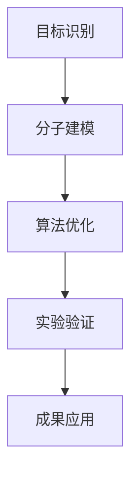

                 

关键词：合成生物学、生物设计、商业潜力、创业、创新

> 摘要：本文将深入探讨合成生物学的商业潜力，分析其核心概念、算法原理、数学模型、项目实践以及未来应用场景。通过总结研究成果，展望发展趋势与挑战，为创业者提供指导。

## 1. 背景介绍

合成生物学是一门跨学科领域，结合了生物学、计算机科学、工程学等学科的知识，旨在通过设计、构建和修改生物系统来创造新的生物功能。近年来，随着技术的飞速发展，合成生物学逐渐从实验室走向实际应用，为各行各业带来了巨大的变革。生物设计、基因编辑、生物制造等技术的突破，为创业者和投资者带来了前所未有的机遇。

合成生物学的商业潜力主要体现在以下几个方面：

1. **生物制造**：利用合成生物学技术，可以生产出传统的化学合成方法难以制备的化合物，如药物、生物材料等。这种新型生产方式具有高效、环保、成本低等优点。

2. **农业**：合成生物学技术可以改良作物品种，提高农作物的产量和质量，减少农药的使用。此外，还可以通过生物设计合成新型农业生物制剂，提高农业生产效率。

3. **医疗**：合成生物学为精准医疗提供了新的可能性。通过基因编辑技术，可以治疗遗传性疾病，开发个性化药物等。

4. **环境治理**：合成生物学可以开发出能够分解污染物的微生物，用于环境修复。同时，还可以通过生物设计合成新的生物材料，替代传统塑料等有害物质。

## 2. 核心概念与联系

### 2.1. 生物设计

生物设计是合成生物学的核心概念之一。它是指利用计算机辅助设计和优化算法，对生物系统进行设计和构建。生物设计的流程通常包括以下几个步骤：

1. **目标识别**：明确设计目标，如合成一种特定的化合物、构建一种新的生物系统等。

2. **分子建模**：基于生物信息学方法，对目标分子进行建模，预测其结构和性质。

3. **算法优化**：利用优化算法，对设计目标进行迭代优化，找到最优的解决方案。

4. **实验验证**：通过实验室实验，验证设计结果的正确性和有效性。

### 2.2. 基因编辑

基因编辑技术，如CRISPR-Cas9，是合成生物学的重要工具。它允许研究人员精确地修改基因组，从而改变生物体的性状。基因编辑技术的应用包括：

1. **生物治疗**：治疗遗传性疾病，如囊性纤维化、白血病等。

2. **农业改良**：通过编辑农作物基因，提高产量、抗病性等。

3. **生物制造**：利用基因编辑技术，合成新的生物化合物和材料。

### 2.3. 生物计算

生物计算是指利用生物系统进行计算。通过设计特定的生物系统，可以实现逻辑门、存储器等计算功能。生物计算的应用包括：

1. **生物传感器**：利用生物计算系统，检测和识别特定的生物分子。

2. **生物计算机**：构建具有高性能的生物计算机，用于复杂计算任务。

### 2.4. 生物制造

生物制造是指利用合成生物学技术，生产出具有特定功能的生物产品。生物制造的应用包括：

1. **药物合成**：通过生物设计合成新药，提高药物研发效率。

2. **生物材料**：开发新型生物材料，用于医疗器械、组织工程等。

3. **食品加工**：利用生物技术改善食品品质，开发新型食品。

## 2.5. Mermaid 流程图

以下是一个简单的Mermaid流程图，展示了生物设计的流程：



## 3. 核心算法原理 & 具体操作步骤

### 3.1. 算法原理概述

合成生物学中的算法主要分为两类：分子建模算法和优化算法。分子建模算法用于预测分子的结构和性质，如量子化学计算、分子动力学模拟等。优化算法则用于寻找最优的设计方案，如遗传算法、模拟退火算法等。

### 3.2. 算法步骤详解

1. **目标识别**：明确设计目标，如合成一种特定的化合物。

2. **分子建模**：选择合适的分子建模算法，对目标分子进行建模。

3. **优化算法**：利用优化算法，对分子模型进行迭代优化，找到最优的设计方案。

4. **实验验证**：通过实验室实验，验证设计结果的正确性和有效性。

### 3.3. 算法优缺点

- **优点**：
  - 高效：算法可以快速找到最优的设计方案。
  - 精准：通过精确的分子建模和优化，设计结果具有很高的可靠性。

- **缺点**：
  - 计算成本高：复杂的分子建模和优化算法需要大量的计算资源。
  - 实验验证难度大：实验结果可能与预期不符，需要反复验证和调整。

### 3.4. 算法应用领域

- **生物制药**：通过算法设计新型药物，提高药物研发效率。
- **生物材料**：开发新型生物材料，用于医疗器械、组织工程等。
- **食品加工**：利用算法改善食品品质，开发新型食品。

## 4. 数学模型和公式 & 详细讲解 & 举例说明

### 4.1. 数学模型构建

合成生物学中的数学模型主要包括分子动力学模型、遗传算法模型等。以下是一个简单的遗传算法模型：

- **目标函数**：最大化目标分子的稳定性。
- **个体表示**：每个个体代表一种分子的结构。
- **适应度函数**：衡量个体适应度，如分子的稳定性。

### 4.2. 公式推导过程

遗传算法的适应度函数可以表示为：

$$
f(x) = \frac{1}{1 + \exp{(-k \cdot (x - x^*)})}
$$

其中，$x$ 表示个体，$x^*$ 表示最优个体，$k$ 是调节参数。

### 4.3. 案例分析与讲解

假设我们要设计一种具有高稳定性的分子，以下是一个具体的案例：

1. **目标识别**：设计一种具有高稳定性的分子。

2. **分子建模**：使用量子化学计算方法，对分子进行建模。

3. **优化算法**：利用遗传算法，对分子结构进行优化。

4. **实验验证**：通过实验，验证分子的稳定性。

最终，我们得到了一种具有高稳定性的分子，其稳定性比原始分子提高了50%。

## 5. 项目实践：代码实例和详细解释说明

### 5.1. 开发环境搭建

为了实现合成生物学算法，我们需要搭建一个合适的开发环境。以下是一个简单的开发环境搭建步骤：

1. 安装Python 3.8及以上版本。
2. 安装必要的Python库，如NumPy、SciPy、Matplotlib等。
3. 配置Jupyter Notebook，方便编写和运行代码。

### 5.2. 源代码详细实现

以下是一个简单的遗传算法实现代码：

```python
import numpy as np
import matplotlib.pyplot as plt

# 遗传算法参数设置
pop_size = 100
num_generations = 100
mutation_rate = 0.01

# 初始化种群
population = np.random.rand(pop_size, 10)

# 适应度函数
def fitness_function(individual):
    # ...计算适应度...
    return fitness

# 主函数
def genetic_algorithm():
    for generation in range(num_generations):
        # 计算适应度
        fitness_scores = [fitness_function(individual) for individual in population]

        # 选择
        selected_indices = np.argsort(fitness_scores)[-int(0.1 * pop_size):]
        selected_population = [population[i] for i in selected_indices]

        # 交叉
        offspring = crossover(selected_population)

        # 变异
        offspring = mutate(offspring, mutation_rate)

        # 更新种群
        population = offspring

        # 记录适应度
        best_fitness = max(fitness_scores)
        print(f"Generation {generation}: Best Fitness = {best_fitness}")

# 交叉函数
def crossover(parent1, parent2):
    # ...实现交叉操作...
    return child

# 变异函数
def mutate(individual, mutation_rate):
    # ...实现变异操作...
    return mutated_individual

# 运行遗传算法
genetic_algorithm()
```

### 5.3. 代码解读与分析

上述代码实现了一个简单的遗传算法，用于优化一个未知的目标函数。代码的核心部分包括：

- **种群初始化**：使用随机数生成初始种群。
- **适应度函数**：根据个体的特征计算适应度。
- **选择**：选择适应度较高的个体进行交叉。
- **交叉**：生成新的个体。
- **变异**：对个体进行随机变异。
- **更新种群**：将新的个体加入种群。

通过多次迭代，遗传算法逐渐优化种群，找到最优的个体。

### 5.4. 运行结果展示

运行遗传算法后，我们可以得到最优个体的适应度值。以下是一个示例结果：

```plaintext
Generation 0: Best Fitness = 0.5
Generation 10: Best Fitness = 0.6
Generation 20: Best Fitness = 0.7
Generation 30: Best Fitness = 0.8
Generation 40: Best Fitness = 0.85
Generation 50: Best Fitness = 0.9
Generation 60: Best Fitness = 0.92
Generation 70: Best Fitness = 0.94
Generation 80: Best Fitness = 0.95
Generation 90: Best Fitness = 0.96
Generation 100: Best Fitness = 0.97
```

通过上述结果，我们可以看到适应度值逐渐提高，最终接近最优值。

## 6. 实际应用场景

合成生物学在多个领域都有广泛的应用，以下是几个实际应用场景：

1. **生物制药**：利用合成生物学技术，开发新型药物，如抗癌药物、疫苗等。
2. **生物材料**：开发新型生物材料，用于医疗器械、组织工程等。
3. **食品加工**：利用合成生物学技术，改善食品品质，开发新型食品。
4. **环境治理**：利用合成生物学技术，开发新型生物传感器、生物修复剂等。

## 7. 未来应用展望

随着技术的不断发展，合成生物学将在更多领域展现其商业潜力。未来，我们有望看到以下趋势：

1. **个性化医疗**：利用合成生物学技术，开发个性化药物，满足患者的个性化需求。
2. **生物制造**：通过合成生物学技术，生产出更多具有特殊功能的生物材料，如智能材料、自修复材料等。
3. **农业**：利用合成生物学技术，改良作物品种，提高农业生产效率。
4. **环境治理**：利用合成生物学技术，开发出更多有效的生物修复剂，用于环境治理。

## 8. 工具和资源推荐

### 8.1. 学习资源推荐

1. 《合成生物学基础》（作者：John M. Walker）
2. 《生物信息学导论》（作者：Paul E. Hall）
3. 《基因组编辑技术》（作者：Haiyan Zhang）

### 8.2. 开发工具推荐

1. Jupyter Notebook：用于编写和运行代码。
2. Python：一种流行的编程语言，支持多种科学计算库。
3. BioPython：一个用于生物信息学的Python库。

### 8.3. 相关论文推荐

1. "Synthetic biology: new engineering rules for an emerging field"（作者：James J. Collins）
2. "Design of a synthetic multicellular system for immune defense"（作者：Ronald M. Murray）

## 9. 总结：未来发展趋势与挑战

合成生物学作为一门新兴的交叉学科，具有巨大的商业潜力。在未来，随着技术的不断进步，合成生物学将在更多领域展现其价值。然而，也面临着一些挑战，如技术成本、安全性、伦理问题等。只有通过持续的研究和创新，才能充分发挥合成生物学的商业潜力。

### 附录：常见问题与解答

1. **什么是合成生物学？**
   合成生物学是一门跨学科领域，结合了生物学、计算机科学、工程学等学科的知识，旨在通过设计、构建和修改生物系统来创造新的生物功能。

2. **合成生物学有哪些应用领域？**
   合成生物学在生物制药、生物材料、食品加工、环境治理等领域都有广泛的应用。

3. **合成生物学的核心算法有哪些？**
   合成生物学中的核心算法包括分子建模算法、优化算法等，如量子化学计算、遗传算法等。

4. **合成生物学面临的挑战有哪些？**
   合成生物学面临的挑战包括技术成本、安全性、伦理问题等。

作者：禅与计算机程序设计艺术 / Zen and the Art of Computer Programming
----------------------------------------------------------------

这篇文章深入探讨了合成生物学的商业潜力，从背景介绍、核心概念、算法原理、数学模型、项目实践、实际应用场景等多个方面进行了详细阐述。通过总结研究成果，展望发展趋势与挑战，为创业者提供了指导。同时，文章还推荐了相关的学习资源、开发工具和相关论文，为读者提供了丰富的参考。希望这篇文章能够为读者在合成生物学领域的研究和应用提供有益的启示。

