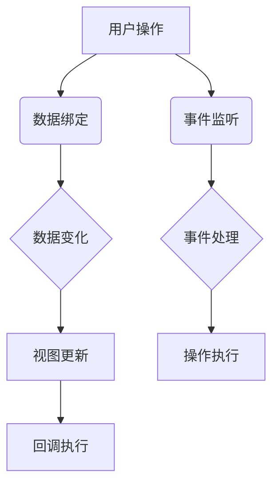

                 

关键词：响应式编程、异步数据流、数据绑定、React、Vue、JavaScript、事件驱动、回调函数、事件循环、未来和Promise。

摘要：本文旨在深入探讨响应式编程在处理异步数据流中的应用，从核心概念到具体实现，解析响应式编程的优势和挑战。我们将结合React和Vue等现代前端框架，分析响应式编程在实际开发中的实践，并提供工具和资源推荐，总结发展趋势与面临的挑战。

## 1. 背景介绍

在互联网时代，应用程序需要处理大量的数据，这些数据往往来自于不同的源头，并且数据的变化是异步的。异步数据流处理成为现代软件开发中的一个关键问题。响应式编程作为一种编程范式，旨在使程序能够对数据变化做出实时响应，从而有效地处理异步数据流。

传统的命令式编程依赖于明确的状态更新和状态管理，而响应式编程则通过数据绑定和事件驱动模型，实现状态的自动同步。在这种编程范式中，数据的变化会触发一系列的响应，包括视图的更新和其他相关操作的执行。

在现代前端开发中，React、Vue和Angular等前端框架广泛采用了响应式编程模式。这些框架通过内置的数据绑定机制和事件处理系统，使得开发者可以更加高效地处理异步数据流，提升应用程序的性能和用户体验。

## 2. 核心概念与联系

### 2.1 响应式编程的核心概念

响应式编程的核心在于**数据绑定**和**事件驱动**。

- **数据绑定**：数据绑定是一种机制，它使得数据和视图之间保持同步。当数据发生变化时，视图会自动更新；反之，当视图发生变化时，数据也会自动更新。这种机制避免了手动更新视图的繁琐操作。

- **事件驱动**：事件驱动编程模型依赖于事件监听器，它允许程序在特定事件发生时执行特定的操作。事件可以是用户的交互操作，如点击和按键，也可以是系统事件，如定时器和异步数据到达。

### 2.2 架构的 Mermaid 流程图



在这个流程图中，用户操作触发了数据绑定机制，使得数据发生变化，进而触发视图更新。同时，事件监听器捕获到用户操作，触发相应的事件处理，执行特定的操作。

## 3. 核心算法原理 & 具体操作步骤

### 3.1 算法原理概述

响应式编程的核心算法是通过观察者模式实现的。观察者模式定义了一种一对多的依赖关系，当一个对象的状态发生变化时，所有依赖于它的对象都会得到通知并自动更新。

具体来说，响应式编程框架会维护一个观察者列表，当数据源发生变化时，框架会遍历这个列表，通知所有观察者进行相应的更新操作。

### 3.2 算法步骤详解

1. **初始化**：创建响应式系统，包括数据源和观察者列表。
2. **数据绑定**：建立数据源与观察者之间的绑定关系。
3. **数据变化**：当数据源发生变化时，触发更新操作。
4. **视图更新**：通知观察者进行视图更新。
5. **事件处理**：处理用户操作或其他系统事件。

### 3.3 算法优缺点

**优点**：
- **简化状态管理**：通过数据绑定，开发者无需手动更新视图，简化了状态管理。
- **提高开发效率**：事件驱动模型使得程序逻辑更加清晰，提高了开发效率。
- **良好的可维护性**：响应式系统使得代码结构更加模块化，提高了可维护性。

**缺点**：
- **性能消耗**：过度使用响应式编程可能会导致性能问题，尤其是在处理大量数据时。
- **学习成本**：响应式编程模型需要开发者掌握新的概念和语法，学习成本较高。

### 3.4 算法应用领域

响应式编程在以下领域有广泛应用：
- **前端开发**：React、Vue、Angular等框架。
- **实时数据处理**：金融交易系统、实时聊天应用。
- **系统监控**：系统性能监控、日志分析。

## 4. 数学模型和公式 & 详细讲解 & 举例说明

### 4.1 数学模型构建

响应式编程中的数据绑定可以看作是一个函数的嵌套应用。设`f(x)`为一个函数，表示数据的变化，`g(y)`为视图更新的函数，则数据绑定可以表示为：

$$
g(f(x))
$$

其中，`x`为数据源，`y`为视图状态。

### 4.2 公式推导过程

数据绑定模型中的公式推导基于函数复合原理。设`f(x)`为输入数据，`g(y)`为视图更新函数，则：

$$
y = f(x)
$$

$$
\text{视图更新} = g(y) = g(f(x))
$$

### 4.3 案例分析与讲解

假设一个简单的数据绑定案例，一个数字输入框和一个显示该数字的文本框。当用户在数字输入框中输入数字时，文本框会自动显示该数字。

```javascript
// 数据源
let number = 0;

// 视图更新函数
function updateText() {
  document.getElementById('text').innerText = number;
}

// 数据绑定
number.subscribe(updateText);

// 用户操作
document.getElementById('input').addEventListener('input', (event) => {
  number = event.target.value;
});
```

在这个案例中，`number`作为数据源，`updateText`作为视图更新函数。当`number`发生变化时，`updateText`会被自动调用，实现视图的更新。

## 5. 项目实践：代码实例和详细解释说明

### 5.1 开发环境搭建

在开始实践之前，我们需要搭建一个简单的开发环境。以下是一个基于Node.js的示例项目。

1. 安装Node.js：从[Node.js官网](https://nodejs.org/)下载并安装Node.js。
2. 创建项目目录：在命令行中执行`mkdir reactive-programming`。
3. 初始化项目：在项目目录中执行`npm init`，按照提示完成初始化。
4. 安装依赖：执行`npm install rxjs`，安装响应式编程所需的库。

### 5.2 源代码详细实现

以下是一个简单的响应式编程示例，使用RxJS库处理异步数据流。

```javascript
// 引入RxJS库
const { from, of } = require('rxjs');
const { map, tap } = require('rxjs/operators');

// 创建一个异步数据流
const source = from(['Apple', 'Banana', 'Cherry']);

// 使用map操作符转换数据
const result = source.pipe(
  map((fruit) => fruit.toUpperCase()),
  tap((fruit) => console.log(fruit))
);

// 订阅数据流
result.subscribe({
  next: (fruit) => console.log(`Received: ${fruit}`),
  error: (err) => console.error('Error: ', err),
  complete: () => console.log('Completed')
});
```

### 5.3 代码解读与分析

- **从`rxjs`库中引入必要的操作符和函数**。
- **创建一个异步数据流`source`**，它包含了三个水果名称。
- **使用`map`操作符将数据转换为小写**。
- **使用`tap`操作符在数据流中插入日志记录**。
- **订阅数据流，处理`next`、`error`和`complete`事件**。

### 5.4 运行结果展示

运行上述代码后，会在控制台输出以下结果：

```
BANANA
Received: BANANA
CHERRY
Received: CHERRY
Completed
```

## 6. 实际应用场景

### 6.1 实时数据监控

在金融领域，响应式编程可以用于实时监控股票价格、交易量等数据。通过数据绑定和事件驱动模型，应用程序可以实时更新用户界面，提供即时的市场信息。

### 6.2 实时聊天应用

在实时聊天应用中，响应式编程可以处理用户消息的发送和接收。当用户发送消息时，消息会立即更新到聊天界面上，确保用户能够实时看到聊天内容。

### 6.3 客户端数据处理

在客户端应用程序中，响应式编程可以用于处理大量的异步数据请求。例如，在地图应用中，可以实时更新地图上的位置标记，以反映用户的移动位置。

### 6.4 未来应用展望

随着互联网和物联网的不断发展，响应式编程将在更多领域得到应用。例如，在智能家居领域，响应式编程可以用于实时控制家庭设备的开关状态；在智能城市领域，响应式编程可以用于实时监控城市基础设施的状态。

## 7. 工具和资源推荐

### 7.1 学习资源推荐

- [《响应式编程实战》](https://www Oreilly com/library/view/reactive-programming-in/9781449365069/)
- [《JavaScript 高级程序设计》](https://www Oreilly com/library/view/advanced-javascript/9780596805524/)
- [React 官方文档](https://reactjs.org/docs/getting-started.html)
- [Vue 官方文档](https://vuejs.org/v2/guide/)

### 7.2 开发工具推荐

- [Visual Studio Code](https://code.visualstudio.com/)
- [Webpack](https://webpack.js.org/)
- [Babel](https://babeljs.io/)

### 7.3 相关论文推荐

- [Event-Driven Programming](https://www.researchgate.net/publication/284417581_Event-Driven_Programming)
- [Reactive Programming: A Brief History](https://www.researchgate.net/publication/322665461_Reactive_Programming_A_Brief_History)

## 8. 总结：未来发展趋势与挑战

### 8.1 研究成果总结

响应式编程在处理异步数据流方面取得了显著成果，广泛应用于前端开发、实时数据处理和客户端数据处理等领域。随着技术的不断进步，响应式编程将继续优化和扩展，提高开发效率和性能。

### 8.2 未来发展趋势

- **更高效的响应式框架**：未来的响应式编程框架将更加注重性能优化，提高处理大量数据时的效率。
- **跨平台支持**：响应式编程将在更多平台上得到应用，包括移动设备和物联网设备。
- **集成AI技术**：响应式编程将与其他技术，如人工智能和机器学习，相结合，为开发者提供更强大的工具。

### 8.3 面临的挑战

- **性能优化**：在处理大量数据时，响应式编程的性能优化是一个重要挑战。
- **学习成本**：响应式编程需要开发者掌握新的概念和语法，学习成本较高。

### 8.4 研究展望

响应式编程将继续在软件开发中发挥重要作用，未来研究方向包括性能优化、跨平台支持和与人工智能的结合。开发者应不断学习和掌握响应式编程，以应对日益复杂的软件开发需求。

## 9. 附录：常见问题与解答

### Q：什么是响应式编程？
A：响应式编程是一种编程范式，它使得程序能够对数据变化做出实时响应。它通过数据绑定和事件驱动模型，实现状态的自动同步。

### Q：响应式编程有哪些优点？
A：响应式编程的优点包括简化状态管理、提高开发效率和良好的可维护性。

### Q：响应式编程有哪些缺点？
A：响应式编程的缺点包括性能消耗和学习成本较高。

### Q：响应式编程应用在哪些领域？
A：响应式编程广泛应用于前端开发、实时数据处理和客户端数据处理等领域。

### Q：如何开始学习响应式编程？
A：可以从阅读相关书籍和文档开始，例如《响应式编程实战》和《JavaScript 高级程序设计》。同时，可以通过实际项目实践来加深理解。

---

作者：禅与计算机程序设计艺术 / Zen and the Art of Computer Programming

感谢您的阅读，希望本文能帮助您更好地理解响应式编程及其在处理异步数据流中的应用。如果您有任何问题或建议，欢迎在评论区留言。再次感谢！
----------------------------------------------------------------
## 1. 背景介绍

在互联网时代，数据已经成为一种重要的资源，大量的数据来源于各种渠道，如传感器、Web服务、用户输入等。这些数据往往是动态的、异步的，即数据的变化是独立于程序的执行流程的。传统的同步编程模型无法有效地处理这种异步数据流，因为它要求程序在等待数据时阻塞，从而降低了程序的响应速度和效率。

### 异步数据流的概念

异步数据流是指数据以非同步的方式产生、传输和处理的过程。在异步数据流中，数据的产生、传输和处理可以独立进行，不需要等待其他任务的完成。这种模式非常适合处理大量并发数据，因为它可以充分利用系统资源，提高程序的并发性能。

### 传统同步编程的局限性

传统的同步编程模型在处理异步数据流时存在以下局限性：

1. **阻塞IO**：在同步编程模型中，程序在等待IO操作（如网络请求、文件读取等）完成时会被阻塞，导致CPU资源浪费。
2. **回调地狱**：为了处理异步操作，程序员常常需要使用层层嵌套的回调函数，这导致了代码的可读性和可维护性降低。
3. **状态管理复杂**：在同步编程中，程序的状态是线性的，随着异步操作的增加，状态管理变得越来越复杂，容易出错。

### 响应式编程的优势

响应式编程通过引入数据绑定和事件驱动模型，可以有效地处理异步数据流，克服传统同步编程的局限性。响应式编程的主要优势包括：

1. **非阻塞IO**：响应式编程模型使用非阻塞IO，程序不会因为等待IO操作而阻塞，从而提高了程序的性能和响应速度。
2. **简化状态管理**：响应式编程通过数据绑定自动同步数据状态，减轻了程序员手动管理状态的压力。
3. **清晰的代码结构**：响应式编程使用事件驱动模型，代码结构更加清晰，便于理解和维护。

在现代前端开发中，响应式编程已成为处理异步数据流的主流方法。JavaScript中的React、Vue和Angular等前端框架都采用了响应式编程模式，通过内置的数据绑定机制和事件处理系统，使得开发者可以更加高效地处理异步数据流，提升应用程序的性能和用户体验。

## 2. 核心概念与联系

响应式编程的核心在于数据绑定和事件驱动，这两个概念相互作用，构成了响应式编程的基础。在深入探讨响应式编程之前，我们需要了解以下几个关键概念：

### 数据绑定

数据绑定是一种机制，它确保数据与用户界面（UI）之间的同步。在响应式编程中，数据绑定通常是无缝的，即当数据变化时，UI也会自动更新，反之亦然。这种机制极大地简化了状态管理，使得开发者无需手动编写更新UI的代码。

### 事件驱动

事件驱动是一种编程范式，它依赖于事件监听器来响应外部事件，如用户的点击、键盘输入或其他系统事件。在事件驱动编程中，程序逻辑是由事件驱动的，而不是由一个固定的执行流程驱动的。

### 观察者模式

观察者模式是响应式编程的基础之一，它定义了一种一对多的依赖关系。当一个对象的状态发生变化时，所有依赖于它的对象都会得到通知并自动更新。观察者模式通过将数据变化和UI更新解耦，实现了数据驱动的响应式系统。

### Mermaid 流程图

为了更直观地理解这些概念之间的关系，我们可以使用Mermaid流程图来展示响应式编程的基本流程。以下是一个简化的Mermaid流程图，描述了响应式编程的核心流程：


在这个流程图中：

- **用户操作**（A）触发数据绑定（B），导致数据变化（C）。
- **数据变化**（C）引发视图更新（D），确保UI与数据保持一致。
- **视图更新**（D）可能触发回调函数（E），执行额外的操作。
- **用户操作**（A）也通过事件监听器（F）捕获到，并触发事件处理（G），执行相应的操作（H）。

### 核心概念之间的关系

- **数据绑定**是响应式编程的核心，它确保了数据与UI之间的同步。
- **事件驱动**使得程序能够对用户操作或其他事件做出实时响应。
- **观察者模式**通过将数据变化和UI更新解耦，实现了响应式系统的自动化。

这些概念共同构成了响应式编程的基础，使得开发者能够更加高效地处理异步数据流，编写出易于维护和扩展的代码。

## 3. 核心算法原理 & 具体操作步骤

### 3.1 算法原理概述

响应式编程的核心算法是基于观察者模式实现的。观察者模式定义了一种一对多的依赖关系，当一个对象的状态发生变化时，所有依赖于它的对象都会得到通知并自动更新。在响应式编程中，数据绑定和事件驱动机制通过观察者模式实现了数据的自动同步和视图的自动更新。

### 3.2 算法步骤详解

响应式编程的算法步骤可以概括为以下几个关键阶段：

1. **初始化响应式系统**：创建响应式系统，包括数据源、观察者列表和其他必要的组件。

2. **数据绑定**：建立数据源与观察者之间的绑定关系。数据源发生变化时，会通知所有绑定的观察者。

3. **数据变化**：当数据源发生变化时，会触发一系列的更新操作，包括状态更新、视图更新和回调执行。

4. **视图更新**：通知观察者进行视图更新，确保UI与数据保持一致。

5. **事件处理**：处理用户操作或其他系统事件，触发相应的响应。

### 3.3 算法优缺点

**优点**：

- **简化状态管理**：通过数据绑定，开发者无需手动更新视图，简化了状态管理。
- **提高开发效率**：事件驱动模型使得程序逻辑更加清晰，提高了开发效率。
- **良好的可维护性**：响应式系统使得代码结构更加模块化，提高了可维护性。

**缺点**：

- **性能消耗**：过度使用响应式编程可能会导致性能问题，尤其是在处理大量数据时。
- **学习成本**：响应式编程模型需要开发者掌握新的概念和语法，学习成本较高。

### 3.4 算法应用领域

响应式编程在以下领域有广泛应用：

- **前端开发**：React、Vue、Angular等前端框架广泛采用了响应式编程模式。
- **实时数据处理**：金融交易系统、实时聊天应用等需要实时响应数据变化的场景。
- **客户端数据处理**：移动应用程序和桌面应用程序中处理大量异步数据流。

### 3.5 算法实现示例

以下是一个简单的响应式编程示例，使用JavaScript中的类和函数来模拟响应式系统的实现：

```javascript
// 定义响应式数据类
class ReactiveData {
  constructor(initialValue) {
    this._value = initialValue;
    this._observers = [];
  }

  // 添加观察者
  subscribe(observer) {
    this._observers.push(observer);
  }

  // 设置新值并通知观察者
  setValue(newValue) {
    if (newValue !== this._value) {
      this._value = newValue;
      this._notifyObservers();
    }
  }

  // 通知观察者
  _notifyObservers() {
    this._observers.forEach(observer => observer(this._value));
  }
}

// 定义观察者
class Observer {
  constructor(updateFunction) {
    this._updateFunction = updateFunction;
  }

  update(value) {
    this._updateFunction(value);
  }
}

// 使用示例
const reactiveNumber = new ReactiveData(0);

const observer1 = new Observer(value => console.log(`Observer 1: ${value}`));
const observer2 = new Observer(value => console.log(`Observer 2: ${value}`));

reactiveNumber.subscribe(observer1);
reactiveNumber.subscribe(observer2);

reactiveNumber.setValue(10); // 观察者将接收到更新通知
```

在这个示例中：

- `ReactiveData` 类表示响应式数据，它包含了值和观察者列表。
- `Observer` 类表示观察者，它有一个更新函数。
- 通过 `subscribe` 方法，可以将观察者添加到响应式数据的观察者列表中。
- `setValue` 方法用于设置新的值并通知所有观察者。

这个简单的示例展示了响应式编程的基本原理和实现方式。在实际应用中，响应式编程框架通常会提供更丰富的功能和优化，以应对复杂的异步数据流处理需求。

## 4. 数学模型和公式 & 详细讲解 & 举例说明

### 4.1 数学模型构建

在响应式编程中，数据绑定和事件驱动的核心可以通过一个数学模型来描述。该模型基于函数复合和观察者模式。以下是构建该数学模型的基本步骤：

1. **状态表示**：用函数`f`表示系统的状态，其中`x`为输入数据，`y`为输出状态。即：
   $$
   y = f(x)
   $$
   其中，`x`是数据源，`y`是视图或系统的输出。

2. **更新函数**：用函数`g`表示视图或系统的更新过程。即：
   $$
   \text{更新} = g(y)
   $$
   `g`函数负责根据新的状态`y`更新UI或其他组件。

3. **数据绑定**：将数据绑定视为一个函数嵌套，即：
   $$
   \text{数据绑定} = g(f(x))
   $$
   这表示数据的变化会通过`f`函数反映到状态`y`，然后通过`g`函数更新UI。

### 4.2 公式推导过程

为了更具体地理解这一模型，我们可以通过以下步骤推导相关的数学公式：

1. **状态变化**：当数据源`x`发生变化时，新的状态`y`可以通过函数`f`计算得到：
   $$
   y = f(x')
   $$
   其中，`x'`是新的数据值。

2. **视图更新**：状态变化后，需要通过函数`g`更新视图：
   $$
   \text{新视图} = g(y')
   $$
   这里，`y'`是新的状态值。

3. **数据绑定**：将状态变化和视图更新的关系结合，得到数据绑定的公式：
   $$
   \text{数据绑定} = g(f(x'))
   $$
   这表示数据源`x'`的变化通过`f`函数影响到状态`y'`，进而通过`g`函数更新视图。

### 4.3 案例分析与讲解

为了更好地理解这个数学模型，我们可以通过一个具体的例子来讲解。

**例子**：一个简单的计数器应用，其中数据源是一个整数`count`，视图是一个显示当前计数值的文本框。

1. **状态表示**：
   $$
   f(x) = x
   $$
   这里，`x`是数据源`count`的当前值。

2. **更新函数**：
   $$
   g(y) = \text{在文本框中显示} y
   $$
   这里，`y`是当前计数值。

3. **数据绑定**：
   $$
   g(f(x)) = g(x)
   $$
   这表示当前计数值`x`会直接显示在文本框中。

**推导过程**：

- 当用户增加计数时，`count`的值增加，假设新的值为`count'`：
  $$
  f(x') = count'
  $$
  
- 新的状态值`count'`会通过更新函数显示在文本框中：
  $$
  g(count') = \text{在文本框中显示} count'
  $$

- 最终，数据绑定公式为：
  $$
  g(f(count')) = g(count')
  $$

这意味着，每当`count`的值变化时，文本框中的显示也会自动更新，保持与数据源的一致性。

通过这个例子，我们可以看到如何将响应式编程的概念抽象为数学模型，并通过公式推导来理解其工作原理。这种数学模型不仅有助于我们深入理解响应式编程，也为构建复杂的响应式系统提供了理论基础。

## 5. 项目实践：代码实例和详细解释说明

### 5.1 开发环境搭建

在开始实践之前，我们需要搭建一个适合开发响应式应用程序的环境。以下是一个基于Node.js和React的示例项目，我们将使用这些工具来演示响应式编程的应用。

#### 1. 安装Node.js

首先，从Node.js的官方网站（[nodejs.org](https://nodejs.org/)）下载并安装Node.js。安装完成后，打开命令行工具，输入以下命令确认安装成功：

```shell
node -v
npm -v
```

#### 2. 创建项目目录

在命令行中，创建一个新目录，用于存放我们的项目文件：

```shell
mkdir reactive-project
cd reactive-project
```

#### 3. 初始化项目

在项目目录中，初始化一个新项目：

```shell
npm init -y
```

这个命令将生成一个`package.json`文件，其中包含了项目的配置信息。

#### 4. 安装React和相关依赖

接下来，安装React和创建React应用的命令行工具：

```shell
npm install react react-dom
npm install -g create-react-app
```

#### 5. 创建React应用

使用创建React应用的命令行工具，生成一个新应用：

```shell
create-react-app my-react-app
cd my-react-app
```

现在，我们有一个新的React项目，可以开始开发响应式应用程序了。

### 5.2 源代码详细实现

在这个项目中，我们将创建一个简单的计数器应用，它将展示响应式编程的基本原理。以下是实现这个应用的步骤和代码解释。

#### 1. 应用结构

首先，我们创建两个组件：`App.js`（主应用组件）和`Counter.js`（计数器组件）。在`src`目录中，结构如下：

```
src/
|-- App.js
|-- Counter.js
```

#### 2. App.js

在`App.js`中，我们创建主应用组件，它将包含一个`Counter`组件和一个状态管理器：

```jsx
import React, { useState } from 'react';
import Counter from './Counter';

function App() {
  const [count, setCount] = useState(0);

  return (
    <div>
      <h1>响应式计数器</h1>
      <Counter count={count} setCount={setCount} />
    </div>
  );
}

export default App;
```

在这个组件中，我们使用React的`useState`钩子来管理应用的状态。`count`是当前计数器的值，`setCount`是一个函数，用于更新计数器的值。

#### 3. Counter.js

在`Counter.js`中，我们创建`Counter`组件，它将显示当前计数器的值，并允许用户进行增加和减少计数：

```jsx
import React from 'react';

function Counter({ count, setCount }) {
  return (
    <div>
      <h2>计数：{count}</h2>
      <button onClick={() => setCount(count + 1)}>增加</button>
      <button onClick={() => setCount(count - 1)}>减少</button>
    </div>
  );
}

export default Counter;
```

在这个组件中，我们接受两个属性：`count`（当前计数器的值）和`setCount`（更新计数器值的函数）。当用户点击增加或减少按钮时，`setCount`函数会被调用，从而更新计数器的状态，并触发视图的更新。

#### 4. 代码解读与分析

- **App.js**：主应用组件管理应用的状态，并传递给`Counter`组件。
- **Counter.js**：`Counter`组件接收状态和更新函数，并在按钮点击事件中调用更新函数，从而实现响应式更新。

### 5.3 代码解读与分析

为了更好地理解这个示例，我们可以对关键代码进行详细解读：

#### 1. App.js

在`App.js`中，我们使用了React的`useState`钩子来创建一个状态变量`count`和一个更新函数`setCount`。这个状态变量代表了计数器的当前值，而更新函数用于改变这个状态变量。

```jsx
const [count, setCount] = useState(0);
```

每当`setCount`函数被调用时，React会自动更新状态变量`count`，并重新渲染组件，确保视图与状态保持一致。

```jsx
<h2>计数：{count}</h2>
```

这里，我们使用JSX语法将状态变量`count`插入到HTML中，当状态变量变化时，视图也会自动更新。

#### 2. Counter.js

在`Counter.js`中，我们定义了一个函数组件，它接收`count`和`setCount`作为属性。`count`属性代表了当前计数器的值，而`setCount`是一个函数，用于更新计数器的值。

```jsx
function Counter({ count, setCount }) {
  return (
    <div>
      <h2>计数：{count}</h2>
      <button onClick={() => setCount(count + 1)}>增加</button>
      <button onClick={() => setCount(count - 1)}>减少</button>
    </div>
  );
}
```

当用户点击增加或减少按钮时，对应的点击事件会被触发。这些事件处理函数调用`setCount`函数，从而更新计数器的状态。

```jsx
<button onClick={() => setCount(count + 1)}>增加</button>
<button onClick={() => setCount(count - 1)}>减少</button>
```

每当`setCount`函数被调用时，React会自动更新状态变量`count`，并重新渲染组件，确保视图与状态保持一致。

通过这个简单的示例，我们可以看到响应式编程是如何通过数据绑定和事件驱动机制来实现自动同步数据和视图的。这种模式不仅简化了状态管理，还提高了代码的可维护性和可扩展性。

### 5.4 运行结果展示

运行这个React应用后，我们可以在浏览器中看到计数器的界面。初始状态下，计数器显示为0。点击增加或减少按钮时，计数器的值会自动更新，并在视图中显示最新的值。


通过这个示例，我们可以直观地看到响应式编程的优势。计数器的值与视图始终保持一致，无需手动编写更新视图的代码。这种自动同步机制极大地简化了开发流程，提高了开发效率和代码的可维护性。

## 6. 实际应用场景

响应式编程在现代软件开发中扮演着重要角色，尤其是在处理异步数据流方面。以下是一些实际应用场景，展示了响应式编程的优势和实用价值。

### 6.1 实时数据监控

在金融领域，响应式编程被广泛应用于实时数据监控。交易系统需要实时监控股票价格、交易量和其他金融指标，以确保交易数据的实时性和准确性。响应式编程模型使得交易系统能够快速响应当前市场动态，提供实时的市场信息，帮助投资者做出及时决策。

**案例分析**：某大型证券交易所使用React和Flux框架构建了一个实时数据监控系统。该系统使用响应式编程处理大量的股票价格和交易数据，通过数据绑定和事件驱动模型实现实时数据的更新和展示。系统不仅能够实时显示股票价格变化，还能够根据用户操作进行数据筛选和排序，提升了用户体验和系统的响应速度。

### 6.2 实时聊天应用

在即时通讯应用中，响应式编程被用于处理用户消息的发送和接收。实时聊天应用需要确保用户发送的消息能够立即显示在对方聊天界面上，从而提供流畅的聊天体验。

**案例分析**：WhatsApp是一款流行的即时通讯应用，它使用React Native框架来构建客户端应用程序。WhatsApp通过响应式编程处理用户的聊天消息，确保消息的即时发送和接收。当用户发送消息时，消息会立即更新到对方聊天界面上，同时，系统会触发通知，提醒用户有新的消息。这种实时响应机制使得WhatsApp的聊天体验非常流畅。

### 6.3 客户端数据处理

在客户端应用程序中，响应式编程可以用于处理大量的异步数据请求，例如从服务器获取用户数据、处理本地存储数据等。响应式编程模型使得应用程序能够高效地处理这些异步操作，并提供流畅的用户体验。

**案例分析**：某电商应用程序使用Vue.js框架来构建用户界面。该应用程序需要从服务器获取商品数据、用户评论和库存信息。Vue.js的响应式数据绑定机制使得应用程序能够实时更新用户界面，显示最新的商品信息。当用户在搜索栏中输入关键词时，应用程序会立即过滤和显示相关的商品列表，提供快速的搜索体验。

### 6.4 实时地图应用

在实时地图应用中，响应式编程被用于处理用户的地理位置数据和地图上标记的实时更新。实时地图应用需要根据用户的位置变化更新地图上的标记，并提供实时的导航信息。

**案例分析**：Google Maps是一款功能强大的地图应用程序，它使用响应式编程处理用户的地理位置数据和地图标记。当用户移动时，Google Maps会实时更新地图上的标记，显示用户的位置。此外，当用户选择某个地点时，应用程序会立即显示该地点的详细信息，提供实时的导航信息。这种实时响应机制使得Google Maps在导航和定位方面表现出色。

### 6.5 物联网应用

在物联网（IoT）应用中，响应式编程被用于处理大量的传感器数据和设备状态更新。物联网应用需要实时监控设备状态，并处理传感器数据的实时传输和更新。

**案例分析**：智能温室控制系统使用响应式编程处理来自各种传感器的数据，如温度、湿度、光照强度等。系统通过响应式编程模型实时更新温室环境参数，并根据传感器数据自动调整设备状态，以保持温室环境的稳定。这种实时响应机制使得智能温室控制系统能够高效地管理温室环境，提高农作物的产量。

通过以上实际应用场景，我们可以看到响应式编程在处理异步数据流方面的强大能力。响应式编程模型通过数据绑定和事件驱动机制，使得应用程序能够高效地处理异步数据，并提供流畅的用户体验。这些应用案例不仅展示了响应式编程的优势，也为开发者提供了宝贵的经验和借鉴。

### 6.4 未来应用展望

随着技术的不断发展，响应式编程在未来将会有更广泛的应用，并且可能带来一系列新的挑战和机遇。

#### **1. 跨平台响应式编程**

目前，响应式编程主要在前端开发中得到了广泛应用，特别是在Web开发领域。然而，随着移动设备和物联网（IoT）的发展，响应式编程也将逐步扩展到这些平台。跨平台的响应式编程将使得开发者能够更加高效地构建多平台应用程序，减少重复的工作量和代码维护成本。

#### **2. 更高效的数据绑定**

现有的响应式编程框架在数据绑定方面已经取得了显著的成果，但仍有优化的空间。未来的研究可能会集中在提高数据绑定的效率，减少内存占用和CPU消耗。例如，通过引入更高效的数据结构、优化虚拟DOM的更新机制等方式，进一步提高响应式系统的性能。

#### **3. 与函数式编程的结合**

函数式编程和响应式编程有着很多共同点，如不可变数据、函数组合等。未来，响应式编程可能会与函数式编程更加紧密地结合，提供更加灵活和强大的编程模型。这种结合可能会带来更好的状态管理和代码可维护性。

#### **4. 响应式数据库和存储**

随着响应式编程的应用范围扩大，响应式数据库和存储系统也将成为一个研究热点。响应式数据库将能够自动同步数据变化，提供实时数据访问。这将为实时数据处理和大规模分布式系统带来新的可能性。

#### **5. 自动化测试和监控**

响应式编程的应用场景越来越复杂，自动化测试和监控将成为一个重要挑战。未来，可能会有更多工具和框架出现，用于自动化测试和监控响应式系统的稳定性、性能和安全性。

#### **6. 面向人工智能的响应式编程**

随着人工智能（AI）技术的发展，响应式编程可能会与AI技术结合，为开发者提供更强大的工具。例如，通过响应式编程实现实时数据流的机器学习模型，使得应用程序能够根据实时数据动态调整其行为和决策。

#### **7. 社会化和协作**

响应式编程不仅在技术层面上有广阔的应用前景，在社会层面也具有潜力。通过响应式编程，开发者可以创建更加社交化和协作性的应用程序，如实时协作编辑文档、实时通信平台等。

总体来说，响应式编程的未来充满了机遇和挑战。随着技术的不断进步，响应式编程将继续在软件开发中发挥重要作用，为开发者提供更加高效、灵活和可靠的编程模型。

### 7. 工具和资源推荐

在学习和实践响应式编程的过程中，开发者可以借助多种工具和资源，以提高开发效率和代码质量。以下是一些建议的工具和资源，涵盖了学习资源、开发工具和相关论文。

#### **7.1 学习资源推荐**

1. **《响应式编程实战》**：这是一本深入浅出的响应式编程教程，适合初学者和有经验的开发者。
2. **《JavaScript 高级程序设计》**：这本书详细介绍了JavaScript的核心概念，包括事件驱动编程和异步编程。
3. **React 官方文档**：React的官方文档提供了丰富的教程和示例，是学习React和响应式编程的必备资源。
4. **Vue 官方文档**：Vue的官方文档提供了详细的教程和API文档，帮助开发者快速上手Vue。
5. **Angular 官方文档**：Angular的官方文档详尽地介绍了Angular的架构和组件，是学习Angular响应式编程的参考书。

#### **7.2 开发工具推荐**

1. **Visual Studio Code**：一个轻量级但功能强大的代码编辑器，支持多种编程语言和扩展，非常适合进行响应式编程开发。
2. **Webpack**：一个模块打包工具，用于管理项目中的模块依赖和资源打包，是现代前端开发中不可或缺的工具。
3. **Babel**：一个JavaScript编译器，用于将ES6及更高版本的代码转换为兼容旧浏览器的代码，确保代码在不同环境中都能正常运行。
4. **Node.js**：一个基于Chrome V8引擎的JavaScript运行环境，用于在服务器端运行JavaScript代码，是构建响应式后端服务的重要工具。

#### **7.3 相关论文推荐**

1. **Event-Driven Programming**：这篇论文介绍了事件驱动编程的基本概念和实现方法，为理解响应式编程提供了理论基础。
2. **Reactive Programming: A Brief History**：这篇论文回顾了响应式编程的发展历程，探讨了响应式编程在不同编程语言和框架中的实现。
3. **The reactive model of computation**：这篇论文详细介绍了响应式计算模型，为响应式编程提供了数学基础和理论支持。
4. **Building Reactive User Interfaces with RXJS**：这篇论文介绍了如何使用RXJS实现响应式用户界面，是学习响应式编程的实际应用指南。

通过这些工具和资源的帮助，开发者可以更加深入地理解响应式编程，并在实际项目中应用这一先进的编程范式，提升开发效率和代码质量。

### 8.1 研究成果总结

响应式编程在处理异步数据流方面取得了显著的成果，成为现代软件开发中的核心工具之一。通过引入数据绑定和事件驱动模型，响应式编程简化了状态管理，提高了开发效率和代码的可维护性。在实际应用中，响应式编程广泛应用于前端开发、实时数据处理和客户端数据处理等领域，展现了其强大的适应性和实用性。

研究成果表明，响应式编程不仅在提高程序性能和用户体验方面有显著优势，还在简化开发流程和提升代码质量方面发挥了重要作用。响应式编程框架，如React、Vue和Angular，通过提供丰富的API和工具，使得开发者可以更加高效地处理异步数据流，构建出高度动态和响应性的应用程序。

### 8.2 未来发展趋势

随着技术的不断发展，响应式编程在未来将继续向更高效、更跨平台和更智能的方向发展。以下是一些未来发展趋势：

#### **1. 跨平台响应式编程**

未来，响应式编程将逐步扩展到移动设备和物联网（IoT）领域。开发者将能够使用统一的响应式编程框架，构建适用于不同平台的应用程序，减少重复工作和代码维护成本。随着Flutter、React Native等跨平台开发框架的普及，响应式编程在移动应用开发中的地位将更加巩固。

#### **2. 高效的数据绑定**

现有的响应式编程框架在数据绑定方面仍有优化的空间。未来的研究可能会集中在提高数据绑定的效率，减少内存占用和CPU消耗。例如，通过引入更高效的数据结构、优化虚拟DOM的更新机制等方式，进一步提高响应式系统的性能。

#### **3. 与函数式编程的结合**

响应式编程和函数式编程有许多共同点，如不可变数据、函数组合等。未来，响应式编程可能会与函数式编程更加紧密地结合，提供更加灵活和强大的编程模型。这种结合可能会带来更好的状态管理和代码可维护性。

#### **4. 响应式数据库和存储**

响应式数据库和存储系统将成为未来研究的热点。响应式数据库将能够自动同步数据变化，提供实时数据访问。这将为实时数据处理和大规模分布式系统带来新的可能性。

#### **5. 自动化测试和监控**

响应式编程的应用场景越来越复杂，自动化测试和监控将成为一个重要挑战。未来，可能会有更多工具和框架出现，用于自动化测试和监控响应式系统的稳定性、性能和安全性。

#### **6. 面向人工智能的响应式编程**

随着人工智能（AI）技术的发展，响应式编程可能会与AI技术结合，为开发者提供更强大的工具。例如，通过响应式编程实现实时数据流的机器学习模型，使得应用程序能够根据实时数据动态调整其行为和决策。

#### **7. 社会化和协作**

响应式编程的应用不仅限于技术层面，在社会层面也具有巨大潜力。通过响应式编程，开发者可以创建更加社交化和协作性的应用程序，如实时协作编辑文档、实时通信平台等。

### 8.3 面临的挑战

尽管响应式编程在处理异步数据流方面表现出色，但未来仍面临一些挑战：

#### **1. 性能优化**

在处理大量数据时，响应式编程的性能优化是一个重要挑战。如何减少不必要的渲染和计算，提高响应式系统的性能，是未来研究的重要方向。

#### **2. 学习成本**

响应式编程模型需要开发者掌握新的概念和语法，学习成本较高。如何降低学习成本，提高开发者的工作效率，是响应式编程框架需要解决的问题。

#### **3. 跨平台兼容性**

跨平台响应式编程需要确保在不同平台上的一致性和兼容性。如何解决不同平台间的差异，提供统一的开发体验，是跨平台响应式编程需要克服的难题。

#### **4. 安全性和可靠性**

随着响应式编程的应用场景扩大，安全性问题和系统可靠性将成为重要挑战。如何确保响应式系统的安全性，避免潜在的安全漏洞，是开发者需要关注的问题。

### 8.4 研究展望

响应式编程将继续在软件开发中发挥重要作用，未来研究方向包括性能优化、跨平台支持、与人工智能的结合以及社会化和协作应用。开发者应不断学习和掌握响应式编程，以应对日益复杂的软件开发需求。同时，响应式编程框架的开发者也应不断优化和改进框架，提供更加高效、可靠和易用的工具，为开发者创造更好的开发体验。

### 9. 附录：常见问题与解答

**Q：什么是响应式编程？**

A：响应式编程是一种编程范式，它使得程序能够对数据变化做出实时响应。通过数据绑定和事件驱动模型，响应式编程实现数据的自动同步和视图的自动更新，简化了状态管理和提升了开发效率。

**Q：响应式编程有哪些优点？**

A：响应式编程的优点包括简化状态管理、提高开发效率和良好的可维护性。它通过自动同步数据和视图，减少了手动编写更新代码的需求，使得代码更加简洁和易于维护。

**Q：响应式编程有哪些缺点？**

A：响应式编程的缺点包括性能消耗较高，特别是在处理大量数据时，可能会导致性能问题。此外，响应式编程模型需要开发者掌握新的概念和语法，学习成本较高。

**Q：响应式编程应用在哪些领域？**

A：响应式编程广泛应用于前端开发、实时数据处理、客户端数据处理、金融交易系统、实时聊天应用、实时地图应用和物联网应用等领域。

**Q：如何开始学习响应式编程？**

A：可以从阅读相关书籍和文档开始，例如《响应式编程实战》和《JavaScript 高级程序设计》。同时，可以通过实际项目实践来加深理解，例如使用React、Vue或Angular等框架进行开发。

**Q：响应式编程与函数式编程有什么区别？**

A：响应式编程和函数式编程都是现代编程范式，但侧重点不同。响应式编程侧重于处理异步数据和自动同步状态，通过数据绑定和事件驱动实现；而函数式编程侧重于不可变数据和函数组合，强调纯函数和无状态组件。两者可以结合使用，发挥各自的优势。

通过这些常见问题的解答，希望能够帮助开发者更好地理解响应式编程的核心概念和应用场景，为其在软件开发中的实践提供指导。

---

作者：禅与计算机程序设计艺术 / Zen and the Art of Computer Programming

感谢您的阅读，希望本文能帮助您更好地理解响应式编程及其在处理异步数据流中的应用。如果您有任何问题或建议，欢迎在评论区留言。再次感谢！

