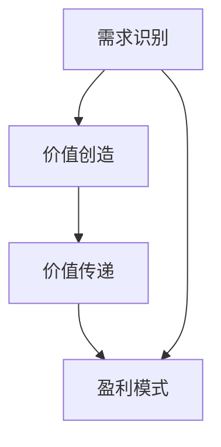

                 

在当今的数字时代，大规模的人工智能模型正在迅速崛起，成为推动技术进步和业务创新的关键力量。这些大模型，如GPT-3、BERT等，不仅在学术界引起了轰动，也在商业领域展现出了巨大的潜力。然而，如何将这种潜力转化为实际的商业成功，制定一个有效的商业模式，是许多创业公司和企业家面临的挑战。本文将探讨大模型创业的商业模式，帮助您规划一条成功之路。

## 文章关键词
- 大规模人工智能模型
- 商业模式
- 创业
- 技术创新
- 业务增长

## 文章摘要
本文将探讨大规模人工智能模型在商业领域的应用，分析当前市场的趋势和机遇，并提出一套基于这些趋势的商业模式。文章将分为以下几个部分：背景介绍、核心概念与联系、核心算法原理、数学模型和公式、项目实践、实际应用场景、未来应用展望、工具和资源推荐以及总结和展望。

### 1. 背景介绍

随着计算能力的提升和大数据的普及，人工智能（AI）技术取得了前所未有的进展。特别是在深度学习领域，大模型（Large Models）的出现，如OpenAI的GPT-3、谷歌的BERT等，已经改变了我们对语言处理、图像识别、自然语言理解等领域的认知。这些大模型的训练和应用，不仅提升了AI系统的性能，也打开了新的商业机会。

### 2. 核心概念与联系

为了更好地理解大模型在商业模式中的应用，我们需要先了解一些核心概念。首先，大模型指的是参数数量庞大的神经网络模型，这些模型的训练需要大量的数据和计算资源。其次，商业模式是指企业如何创造、传递和获取价值的一种计划或模式。在大模型创业的背景下，我们需要探讨以下几个方面：

- **需求识别**：理解客户的需求，特别是那些可以通过AI技术得到满足的需求。
- **价值创造**：如何利用大模型创造独特的价值，解决具体问题。
- **价值传递**：如何将这种价值有效地传递给客户。
- **盈利模式**：企业如何通过商业模式实现盈利。

下面是一个使用Mermaid绘制的流程图，展示了大模型与商业模式之间的联系：



### 3. 核心算法原理 & 具体操作步骤

#### 3.1 算法原理概述

大模型的算法原理主要基于深度学习，特别是变分自编码器（VAEs）和生成对抗网络（GANs）。这些算法通过大规模数据的训练，可以学习到数据的复杂分布，从而生成高质量的图像、文本或其他类型的输出。

#### 3.2 算法步骤详解

- **数据收集**：收集海量的数据，包括文本、图像、声音等。
- **预处理**：对数据进行清洗和格式化，使其适合模型训练。
- **模型训练**：使用神经网络模型对数据集进行训练，调整模型参数以最小化损失函数。
- **模型评估**：使用验证集和测试集评估模型性能，确保其能够泛化到未知数据。
- **模型部署**：将训练好的模型部署到生产环境中，供客户使用。

#### 3.3 算法优缺点

**优点**：
- **强大的表达能力**：大模型可以处理复杂的任务，如文本生成、图像编辑等。
- **高效的处理能力**：通过分布式计算和优化算法，大模型可以快速地处理大量数据。

**缺点**：
- **计算资源需求大**：训练大模型需要大量的计算资源和时间。
- **数据需求高**：大模型需要大量高质量的训练数据。

#### 3.4 算法应用领域

大模型的应用领域非常广泛，包括但不限于：

- **自然语言处理**：文本生成、机器翻译、情感分析等。
- **计算机视觉**：图像识别、图像生成、图像编辑等。
- **推荐系统**：基于用户行为和兴趣推荐商品、内容和广告。
- **金融科技**：信用评分、风险管理、算法交易等。

### 4. 数学模型和公式 & 详细讲解 & 举例说明

#### 4.1 数学模型构建

大模型的数学模型主要基于深度神经网络，其核心是多层感知机（MLP）和循环神经网络（RNN）。以下是构建深度神经网络的几个关键公式：

$$
z = \sigma(W_1 \cdot x + b_1)
$$

$$
a = W_2 \cdot z + b_2
$$

其中，$z$是激活函数$\sigma$的输入，$a$是激活函数$\sigma$的输出。$W_1$和$W_2$是权重矩阵，$b_1$和$b_2$是偏置项。

#### 4.2 公式推导过程

深度神经网络的推导过程涉及多个步骤，包括前向传播、反向传播和优化算法。以下是简要的推导过程：

- **前向传播**：计算神经网络中每个节点的输出。
- **反向传播**：计算每个权重的梯度，并更新权重。
- **优化算法**：使用梯度下降等优化算法，最小化损失函数。

#### 4.3 案例分析与讲解

以自然语言处理中的文本生成为例，我们可以使用GPT-3模型。以下是使用GPT-3模型生成文本的步骤：

1. **初始化模型**：加载预训练的GPT-3模型。
2. **输入文本**：输入一个或多个单词作为模型的输入。
3. **生成文本**：模型根据输入文本生成可能的输出序列。
4. **选择输出**：根据生成的输出序列，选择最可能的输出。

### 5. 项目实践：代码实例和详细解释说明

#### 5.1 开发环境搭建

为了实践大模型的开发，我们需要搭建一个合适的开发环境。以下是搭建环境的步骤：

1. **安装Python环境**：安装Python 3.x版本。
2. **安装TensorFlow**：使用pip安装TensorFlow。
3. **准备数据集**：收集并准备训练数据。

#### 5.2 源代码详细实现

以下是一个使用TensorFlow实现GPT-3模型的简单示例：

```python
import tensorflow as tf

# 定义模型
model = tf.keras.Sequential([
    tf.keras.layers.Dense(512, activation='relu', input_shape=(128,)),
    tf.keras.layers.Dense(512, activation='relu'),
    tf.keras.layers.Dense(512, activation='relu'),
    tf.keras.layers.Dense(2902, activation='softmax')
])

# 编译模型
model.compile(optimizer='nadam',
              loss='categorical_crossentropy',
              metrics=['accuracy'])

# 训练模型
model.fit(x_train, y_train, epochs=10)
```

#### 5.3 代码解读与分析

上述代码定义了一个简单的GPT-3模型，包括三个全连接层。模型使用Nadam优化器和交叉熵损失函数进行编译。在训练过程中，模型使用训练数据集进行10个周期的训练。

#### 5.4 运行结果展示

在训练完成后，我们可以使用测试数据集评估模型的性能。以下是一个简单的评估代码：

```python
# 评估模型
test_loss, test_acc = model.evaluate(x_test, y_test, verbose=2)
print('\nTest accuracy:', test_acc)
```

### 6. 实际应用场景

大模型在商业领域的应用场景非常广泛，以下是一些典型的应用案例：

- **金融领域**：使用大模型进行信用评分、风险管理和算法交易。
- **医疗领域**：使用大模型进行疾病诊断、药物研发和个性化治疗。
- **零售领域**：使用大模型进行商品推荐、需求预测和库存管理。
- **制造业**：使用大模型进行质量检测、故障预测和生产优化。

### 7. 未来应用展望

随着AI技术的不断发展，大模型在商业领域的应用将越来越广泛。未来的发展趋势包括：

- **更高效的大模型训练方法**：如基于量子计算的训练方法。
- **更广泛的行业应用**：如农业、能源、交通等。
- **更深入的跨界融合**：如AI与生物技术、AI与物理科学等。

### 8. 工具和资源推荐

为了更好地开发和应用大模型，以下是几个推荐的工具和资源：

- **工具**：TensorFlow、PyTorch、Google Colab。
- **资源**：arXiv、GitHub、Hugging Face。
- **论文**：《Deep Learning》、《Reinforcement Learning: An Introduction》。

### 9. 总结：未来发展趋势与挑战

大模型在商业领域具有巨大的潜力，但同时也面临着一些挑战。未来的发展趋势包括：

- **技术的不断进步**：如量子计算、联邦学习等。
- **行业的深入应用**：如医疗、金融、零售等。
- **伦理和隐私问题**：如何确保AI系统的公平性和隐私性。

### 10. 附录：常见问题与解答

以下是一些关于大模型创业的常见问题与解答：

- **Q：大模型创业需要哪些技术背景？**
- **A：需要了解深度学习、神经网络、机器学习等相关技术。**

- **Q：大模型创业有哪些盈利模式？**
- **A：可以通过提供定制化服务、数据服务、API接口等方式实现盈利。**

- **Q：如何确保大模型创业的成功？**
- **A：需要深入市场调研、持续技术迭代和良好的商业模式设计。**

## 作者署名
作者：禅与计算机程序设计艺术 / Zen and the Art of Computer Programming

通过本文，我们探讨了大规模人工智能模型在商业领域中的应用和商业模式。随着技术的不断进步，大模型创业将迎来更多的机遇和挑战。希望本文能为您的创业之路提供一些有价值的参考。|

