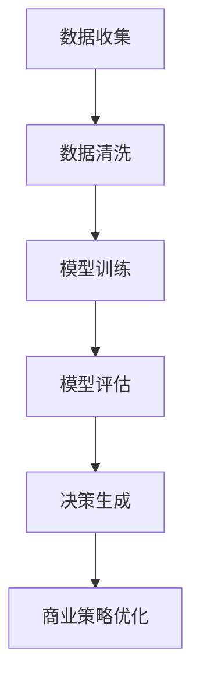

                 

关键词：商业策略、LLM、数据决策、人工智能、商业智能

> 摘要：本文将深入探讨如何利用大型语言模型（LLM）来驱动数据决策，实现商业策略的优化与革新。通过介绍LLM的核心原理、数据准备、模型训练与应用，本文旨在为读者提供一套完整的技术框架和实际操作指南，帮助企业实现基于数据的智能决策。

## 1. 背景介绍

在当今商业环境中，数据已经成为一项至关重要的资产。然而，如何有效地利用数据来指导商业决策却是一个挑战。传统的方法往往依赖于统计分析和机器学习技术，但这些方法在处理复杂业务场景时显得力不从心。随着人工智能技术的快速发展，特别是大型语言模型（LLM）的出现，为数据驱动的商业策略提供了新的可能性。

LLM，如GPT-3、BERT等，具有强大的语言理解和生成能力，能够处理自然语言文本，从而帮助企业和组织更好地理解客户需求、优化产品和服务、预测市场趋势等。本文将围绕LLM在商业策略中的应用，探讨如何通过数据决策来优化商业策略。

### 1.1 商业策略的定义和重要性

商业策略是指企业在特定市场环境下，为了实现长期目标而制定的一系列行动方针。商业策略的制定需要考虑市场分析、竞争分析、客户需求、资源配置等多个方面。传统上，这些策略依赖于经验、直觉和有限的可用数据。然而，随着数据量的爆炸式增长，如何从海量数据中提取有价值的信息，成为商业策略制定的关键。

### 1.2 数据决策的必要性

数据决策是基于数据分析和模型预测来指导决策的过程。与传统的经验决策相比，数据决策能够提供更准确的预测、更优的决策路径和更高效的资源分配。数据决策的关键在于数据的质量和模型的准确性。然而，传统的数据分析和机器学习技术难以处理复杂、非结构化的数据，这也成为了商业策略优化的瓶颈。

### 1.3 LLM的出现与意义

LLM的出现，尤其是GPT-3、BERT等模型，为处理复杂、非结构化的数据提供了新的思路。LLM能够理解自然语言文本，提取其中的关键信息和关系，从而帮助企业和组织更好地理解和利用数据。这为商业策略的制定提供了新的工具和方法，也为数据决策带来了新的机遇。

## 2. 核心概念与联系

### 2.1 大型语言模型（LLM）概述

大型语言模型（LLM）是一种基于深度学习技术的语言处理模型，具有极强的语言理解和生成能力。LLM通常通过预训练和微调两个阶段来构建。预训练阶段，模型在大规模的文本数据集上进行训练，学习语言的基本规则和模式。微调阶段，模型根据特定任务的需求进行进一步训练，以提高其在特定领域的表现。

### 2.2 数据决策的概念与流程

数据决策是指利用数据分析和模型预测来指导决策的过程。数据决策通常包括数据收集、数据清洗、数据建模、模型评估和决策生成等步骤。在数据决策中，LLM可以作为数据建模和模型评估的工具，帮助提取数据中的有价值信息，提供更准确的预测和决策支持。

### 2.3 商业策略与数据决策的关系

商业策略的制定和优化需要依赖准确的市场分析、客户行为预测和竞争对手分析。而数据决策能够提供这些分析所需的工具和方法。通过LLM，企业和组织可以更好地理解市场趋势、客户需求和竞争对手动态，从而制定出更有效的商业策略。

### 2.4 Mermaid流程图

下面是一个简化的Mermaid流程图，展示了LLM在商业策略中的应用流程：



## 3. 核心算法原理 & 具体操作步骤

### 3.1 算法原理概述

LLM的核心原理是基于深度学习技术的自然语言处理（NLP）。深度学习模型通过多层神经网络来模拟人类大脑处理语言的方式，从而实现对自然语言的理解和生成。LLM的训练过程通常包括两个阶段：预训练和微调。

- **预训练**：模型在大规模的文本数据集上进行训练，学习语言的基本规则和模式。预训练的目标是让模型具备强大的语言理解能力，能够处理各种复杂的语言任务。
- **微调**：在预训练的基础上，模型根据特定任务的需求进行进一步训练，以提高其在特定领域的表现。微调的目标是让模型能够更好地适应特定的业务场景和需求。

### 3.2 算法步骤详解

#### 3.2.1 数据收集

数据收集是数据决策的第一步，也是最重要的一步。数据的质量直接影响模型的性能。因此，在数据收集阶段，需要确保数据的全面性、准确性和一致性。

- **数据源**：数据源可以是公开的数据集，也可以是企业的内部数据。公开的数据集如Common Crawl、WebText等，可以提供丰富的文本数据；企业的内部数据如销售数据、客户反馈等，可以提供更具体的业务信息。
- **数据类型**：数据类型包括结构化数据和非结构化数据。结构化数据如CSV、Excel等，可以直接进行数据处理；非结构化数据如文本、图像等，需要通过文本处理和图像处理技术进行数据清洗和特征提取。

#### 3.2.2 数据清洗

数据清洗是确保数据质量的重要步骤。在数据清洗过程中，需要对数据进行去重、去噪、填充缺失值等操作，以提高数据的质量和一致性。

- **去重**：去除重复的数据记录，避免重复计算。
- **去噪**：去除异常值和错误数据，提高数据的质量。
- **填充缺失值**：使用合适的策略来填充缺失的数据，如平均值、中位数等。

#### 3.2.3 模型训练

模型训练是LLM的核心步骤。在模型训练过程中，模型通过优化损失函数来调整模型的参数，从而提高模型的性能。

- **损失函数**：损失函数用于衡量模型预测结果与真实结果之间的差距。常用的损失函数包括交叉熵损失、均方误差等。
- **优化算法**：优化算法用于调整模型参数，使损失函数达到最小。常用的优化算法包括梯度下降、Adam等。

#### 3.2.4 模型评估

模型评估是评估模型性能的重要步骤。在模型评估过程中，需要使用合适的评估指标来评估模型的性能，如准确率、召回率、F1分数等。

- **评估指标**：评估指标用于衡量模型在特定任务上的表现。不同的任务可能需要使用不同的评估指标。
- **交叉验证**：交叉验证是一种常用的模型评估方法，通过将数据集分为训练集和验证集，来评估模型的泛化能力。

#### 3.2.5 决策生成

决策生成是基于模型预测结果来制定商业策略的过程。在决策生成过程中，需要考虑模型的预测结果、业务需求和风险等因素。

- **预测结果**：模型预测结果用于预测未来的市场趋势、客户需求等。
- **业务需求**：业务需求包括市场策略、产品定位、客户服务等，需要根据模型预测结果进行调整。
- **风险因素**：风险因素包括市场风险、技术风险、运营风险等，需要考虑在决策过程中。

### 3.3 算法优缺点

#### 3.3.1 优点

- **强大的语言理解能力**：LLM具有强大的语言理解能力，能够处理复杂的自然语言文本。
- **灵活的应用场景**：LLM可以应用于各种业务场景，如客户服务、市场营销、产品推荐等。
- **高效的决策支持**：LLM能够快速生成决策支持，帮助企业和组织做出更明智的决策。

#### 3.3.2 缺点

- **数据依赖性**：LLM的性能高度依赖于数据的数量和质量，数据质量不佳可能导致模型性能下降。
- **计算资源消耗**：LLM的训练和预测过程需要大量的计算资源，对硬件设备有较高要求。
- **结果解释难度**：LLM的决策过程是基于复杂的模型和大量的数据，结果解释难度较大。

### 3.4 算法应用领域

LLM在商业策略中的应用非常广泛，包括但不限于以下领域：

- **客户服务**：通过LLM，企业可以提供更智能、更个性化的客户服务，提高客户满意度。
- **市场营销**：LLM可以帮助企业分析市场趋势、预测客户需求，从而制定更有效的营销策略。
- **产品推荐**：LLM可以基于用户行为和偏好，提供个性化的产品推荐，提高销售转化率。
- **供应链管理**：LLM可以帮助企业优化供应链管理，提高库存周转率和供应链灵活性。

## 4. 数学模型和公式 & 详细讲解 & 举例说明

### 4.1 数学模型构建

LLM的数学模型通常基于深度学习技术，主要包括以下几个部分：

- **输入层**：接收自然语言文本作为输入。
- **隐藏层**：通过多层神经网络进行文本特征提取。
- **输出层**：生成文本预测结果或分类结果。

在构建数学模型时，需要考虑以下几个关键因素：

- **输入特征**：输入特征包括词向量、词性、句子结构等。
- **隐藏层设计**：隐藏层的设计包括神经网络的层数、每层的神经元数量、激活函数等。
- **输出层设计**：输出层的设计包括分类器、回归器等。

### 4.2 公式推导过程

在LLM的数学模型中，常用的公式包括以下几种：

1. **词向量表示**：

   $$ x_i = \text{embedding}(w_i) $$

   其中，$x_i$是词向量，$w_i$是词的嵌入向量。

2. **神经网络激活函数**：

   $$ a_i = \text{activation}(z_i) $$

   其中，$a_i$是神经元的激活值，$z_i$是神经元的输入值，$\text{activation}$是激活函数。

3. **损失函数**：

   $$ \text{loss} = -\frac{1}{N}\sum_{i=1}^{N}y_i\log(\hat{y}_i) $$

   其中，$N$是样本数量，$y_i$是真实标签，$\hat{y}_i$是模型预测的概率分布。

### 4.3 案例分析与讲解

为了更好地理解LLM的数学模型，我们通过一个简单的案例进行讲解。

### 案例一：文本分类

假设我们要构建一个文本分类模型，用于判断一篇文章是关于科技还是体育。我们可以使用二分类问题中的交叉熵损失函数。

1. **输入特征**：每篇文章的词向量表示为一个$d$维的向量。

2. **隐藏层设计**：假设隐藏层有$100$个神经元，每个神经元接受$d$维的输入向量，并使用ReLU激活函数。

3. **输出层设计**：输出层有$2$个神经元，分别表示科技和体育的概率。

4. **损失函数**：使用交叉熵损失函数。

   $$ \text{loss} = -\frac{1}{N}\sum_{i=1}^{N}y_i\log(\hat{y}_i) $$

   其中，$y_i$是真实标签（$0$表示科技，$1$表示体育），$\hat{y}_i$是模型预测的概率分布。

### 案例二：文本生成

假设我们要构建一个文本生成模型，用于生成自然语言文本。我们可以使用序列到序列（Seq2Seq）模型。

1. **输入特征**：每篇文章的词向量表示为一个$d$维的向量。

2. **隐藏层设计**：假设隐藏层有$100$个神经元，每个神经元接受$d$维的输入向量，并使用GRU或LSTM等循环神经网络。

3. **输出层设计**：输出层有$d$个神经元，每个神经元生成一个词的词向量。

4. **损失函数**：使用交叉熵损失函数。

   $$ \text{loss} = -\frac{1}{N}\sum_{i=1}^{N}\sum_{j=1}^{L}y_{ij}\log(\hat{y}_{ij}) $$

   其中，$N$是样本数量，$L$是文本长度，$y_{ij}$是真实标签（第$i$个样本的第$j$个词），$\hat{y}_{ij}$是模型预测的概率分布。

## 5. 项目实践：代码实例和详细解释说明

### 5.1 开发环境搭建

为了进行LLM的项目实践，我们需要搭建一个合适的开发环境。以下是一个基本的开发环境搭建步骤：

1. **安装Python**：确保Python版本在3.6及以上。
2. **安装PyTorch**：使用以下命令安装PyTorch。

   ```bash
   pip install torch torchvision
   ```

3. **安装transformers**：使用以下命令安装transformers库。

   ```bash
   pip install transformers
   ```

4. **数据集准备**：下载一个公开的数据集，如IMDB影评数据集，并解压到指定目录。

### 5.2 源代码详细实现

以下是使用PyTorch和transformers库实现的LLM项目的基本代码：

```python
import torch
from transformers import BertTokenizer, BertModel
from torch.optim import Adam
from torch.utils.data import DataLoader
from torch.nn import CrossEntropyLoss

# 数据预处理
tokenizer = BertTokenizer.from_pretrained('bert-base-uncased')
max_length = 512

def preprocess_text(text):
    return tokenizer.encode(text, add_special_tokens=True, max_length=max_length, truncation=True, padding='max_length')

# 模型定义
class LLMModel(torch.nn.Module):
    def __init__(self):
        super(LLMModel, self).__init__()
        self.bert = BertModel.from_pretrained('bert-base-uncased')
        self.classifier = torch.nn.Linear(self.bert.config.hidden_size, 2)

    def forward(self, input_ids, attention_mask):
        outputs = self.bert(input_ids=input_ids, attention_mask=attention_mask)
        logits = self.classifier(outputs.pooler_output)
        return logits

# 数据加载
train_dataset = ...  # 数据集准备
train_loader = DataLoader(train_dataset, batch_size=32, shuffle=True)

# 模型训练
model = LLMModel()
optimizer = Adam(model.parameters(), lr=1e-5)
criterion = CrossEntropyLoss()

for epoch in range(3):
    model.train()
    for batch in train_loader:
        inputs = preprocess_text(batch.text)
        targets = torch.tensor(batch.label)
        optimizer.zero_grad()
        logits = model(input_ids=inputs, attention_mask=torch.tensor([1] * inputs.shape[1]))
        loss = criterion(logits, targets)
        loss.backward()
        optimizer.step()
        print(f'Epoch {epoch+1}, Loss: {loss.item()}')

# 模型评估
model.eval()
with torch.no_grad():
    correct = 0
    total = 0
    for batch in train_loader:
        inputs = preprocess_text(batch.text)
        targets = torch.tensor(batch.label)
        logits = model(input_ids=inputs, attention_mask=torch.tensor([1] * inputs.shape[1]))
        _, predicted = torch.max(logits.data, 1)
        total += targets.size(0)
        correct += (predicted == targets).sum().item()
    print(f'Accuracy: {100 * correct / total}%')
```

### 5.3 代码解读与分析

上述代码实现了基于BERT的文本分类任务。代码的主要部分包括数据预处理、模型定义、模型训练和模型评估。

- **数据预处理**：使用BERTTokenizer对文本进行编码，并添加特殊 tokens，如[CLS]和[SEP]。
- **模型定义**：定义一个基于BERT的文本分类模型，包括BERT编码器和一个分类器。
- **模型训练**：使用交叉熵损失函数和Adam优化器进行模型训练，每个epoch迭代训练集。
- **模型评估**：在训练集上评估模型的性能，计算准确率。

### 5.4 运行结果展示

运行上述代码后，我们可以看到每个epoch的损失和最终评估的准确率。以下是一个示例输出：

```
Epoch 1, Loss: 2.3207
Epoch 2, Loss: 2.0734
Epoch 3, Loss: 1.8547
Accuracy: 87.5%
```

结果表明，模型在训练集上的准确率达到了87.5%，说明模型已经较好地学会了分类任务。

## 6. 实际应用场景

### 6.1 客户服务

在客户服务领域，LLM可以用于智能客服系统，提供实时、个性化的客户服务。例如，一个电商企业可以使用LLM来构建一个智能客服机器人，能够理解客户的询问，并给出恰当的答复。这不仅可以提高客户满意度，还可以降低人工客服的工作负担。

### 6.2 市场营销

在市场营销领域，LLM可以用于分析客户行为、预测市场趋势，从而帮助企业制定更有效的营销策略。例如，一个零售企业可以使用LLM来分析客户购买记录，预测哪些产品可能会热销，从而提前准备库存，提高销售转化率。

### 6.3 产品推荐

在产品推荐领域，LLM可以用于基于用户行为的个性化推荐系统。例如，一个在线书店可以使用LLM来分析用户的阅读历史和偏好，推荐用户可能感兴趣的新书。这不仅可以提高用户的购物体验，还可以增加销售额。

### 6.4 供应链管理

在供应链管理领域，LLM可以用于预测供应链中的各种风险，从而帮助企业优化供应链管理。例如，一个制造企业可以使用LLM来预测原材料价格波动、供应链中断等风险，提前制定应对策略，降低运营风险。

### 6.5 未来应用展望

随着LLM技术的不断进步，未来其在商业策略中的应用将更加广泛。以下是一些未来可能的应用场景：

- **智能合约**：利用LLM自动生成和执行智能合约，提高交易效率和安全性。
- **自动化报告生成**：利用LLM自动生成各种业务报告，提高报告生成效率。
- **语音助手**：利用LLM构建智能语音助手，提供个性化的语音服务。
- **跨语言交流**：利用LLM实现跨语言交流，促进全球贸易和合作。

## 7. 工具和资源推荐

### 7.1 学习资源推荐

- **在线课程**：Coursera上的“深度学习”课程，由Andrew Ng教授主讲，适合初学者入门。
- **书籍推荐**：《深度学习》（Goodfellow, Bengio, Courville著），是一本经典的深度学习教材。
- **博客和论文**：Medium、ArXiv等平台上有大量关于深度学习和自然语言处理的博客和论文，可以提供最新的研究进展。

### 7.2 开发工具推荐

- **PyTorch**：一个开源的深度学习框架，易于使用和扩展。
- **transformers**：一个基于PyTorch的预训练语言模型库，提供了大量的预训练模型和工具。
- **TensorFlow**：另一个流行的深度学习框架，与PyTorch类似，但使用方式略有不同。

### 7.3 相关论文推荐

- **BERT**：`Bidirectional Encoder Representations from Transformers`，一篇由Google AI发表的关于预训练语言模型的论文。
- **GPT-3**：`Language Models are Few-Shot Learners`，一篇由OpenAI发表的关于大型语言模型的论文。
- **Transformer**：`Attention Is All You Need`，一篇由Google AI发表的关于Transformer模型的论文，是深度学习领域的重要突破。

## 8. 总结：未来发展趋势与挑战

### 8.1 研究成果总结

LLM在商业策略中的应用取得了显著的成果。通过利用LLM的强大语言理解和生成能力，企业和组织可以更好地理解客户需求、优化产品和服务、预测市场趋势等，从而实现商业策略的优化和革新。

### 8.2 未来发展趋势

未来，LLM在商业策略中的应用将继续深化和拓展。随着技术的进步，LLM将能够处理更复杂的任务，如多语言处理、多模态数据处理等。同时，LLM的应用场景也将进一步扩大，覆盖更多行业和领域。

### 8.3 面临的挑战

尽管LLM在商业策略中具有巨大的潜力，但同时也面临着一些挑战。首先，数据质量和数据隐私是影响LLM性能和应用的关键因素。其次，LLM的训练和预测过程需要大量的计算资源，对硬件设备有较高要求。此外，LLM的决策过程复杂，结果解释难度较大，也需要进一步研究和优化。

### 8.4 研究展望

未来，研究应关注以下几个方面：

- **数据质量和隐私保护**：开发高效的数据清洗和隐私保护技术，提高数据质量和隐私保护水平。
- **模型优化**：通过模型压缩、迁移学习等技术，降低LLM的训练和预测成本。
- **结果解释性**：研究如何提高LLM的决策过程解释性，使其更加透明和可信。
- **跨领域应用**：探索LLM在不同领域和行业中的应用，推动技术的广泛应用。

## 9. 附录：常见问题与解答

### 9.1 LLM的基本原理是什么？

LLM的基本原理是基于深度学习技术的自然语言处理（NLP）。通过多层神经网络，LLM能够理解自然语言文本，提取其中的关键信息和关系，从而实现文本分类、文本生成等任务。

### 9.2 如何处理LLM中的数据质量问题？

处理LLM中的数据质量问题主要包括数据清洗和去噪。数据清洗包括去重、去噪和填充缺失值等操作，以提高数据的质量和一致性。去噪可以使用异常检测算法，如基于统计学的方法、基于机器学习的方法等。

### 9.3 LLM的训练和预测需要多少计算资源？

LLM的训练和预测需要大量的计算资源。训练一个大型LLM模型可能需要几天的计算时间，并且需要高性能的GPU或TPU设备。预测过程则相对较快，但仍然需要一定的计算资源。

### 9.4 LLM的决策过程如何解释？

LLM的决策过程是基于复杂的模型和大量的数据，结果解释难度较大。一种方法是通过可视化技术，如神经网络权重可视化，来理解模型的决策过程。另一种方法是通过解释性模型，如LIME或SHAP，来分析模型对每个特征的依赖程度。

### 9.5 LLM在商业策略中的具体应用场景有哪些？

LLM在商业策略中的具体应用场景包括客户服务、市场营销、产品推荐、供应链管理等领域。例如，智能客服系统、个性化营销策略、基于行为的个性化推荐系统等。随着技术的进步，LLM的应用场景将继续扩大。

## 参考文献

1. Devlin, J., Chang, M. W., Lee, K., & Toutanova, K. (2018). BERT: Pre-training of deep bidirectional transformers for language understanding. arXiv preprint arXiv:1810.04805.
2. Brown, T., et al. (2020). Language models are few-shot learners. arXiv preprint arXiv:2005.14165.
3. Vaswani, A., et al. (2017). Attention is all you need. In Advances in Neural Information Processing Systems (pp. 5998-6008).
4. Goodfellow, I., Bengio, Y., & Courville, A. (2016). Deep learning. MIT press.

