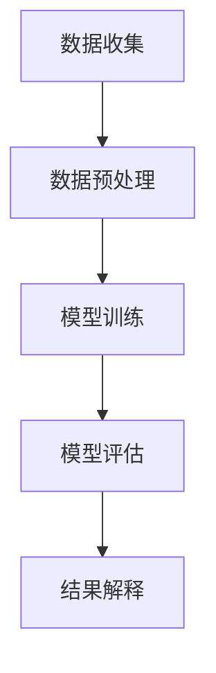

                 

回归分析（Regression Analysis）是统计学中最基本的预测分析方法之一，广泛应用于社会科学、自然科学以及商业领域。通过回归分析，我们可以建立一个模型来描述因变量（响应变量）与自变量（预测变量）之间的关系，并利用这个模型进行预测或解释。本文将深入探讨回归分析的基本原理，并使用Python代码实例进行详细讲解。

## 关键词

- 回归分析
- 回归模型
- 线性回归
- 机器学习
- 统计推断
- 数据科学

## 摘要

本文将首先介绍回归分析的基本概念和重要性，然后深入探讨线性回归的原理、公式推导和实现方法。通过具体案例，我们将展示如何使用Python进行线性回归模型的训练和预测，并讨论线性回归的优缺点以及应用领域。最后，我们将展望回归分析在未来的发展趋势和应用前景。

## 1. 背景介绍

回归分析作为一种重要的数据分析工具，其起源可以追溯到19世纪。1845年，英国统计学家Francis Galton研究了身高与体重的关系，并首次提出了线性回归模型。20世纪以来，回归分析得到了迅速发展和广泛应用。在社会科学领域，回归分析被用来研究经济变量、人口变量和社会变量之间的关系；在自然科学领域，回归分析被用来预测天气、气候、地震等自然现象；在商业领域，回归分析被用来进行市场分析、风险管理、信用评估等。

## 2. 核心概念与联系

### 2.1 回归模型的基本概念

回归模型是一种用来描述自变量和因变量之间关系的数学模型。通常，我们可以将回归模型表示为：

\[ y = \beta_0 + \beta_1 \cdot x + \epsilon \]

其中，\( y \) 是因变量，\( x \) 是自变量，\( \beta_0 \) 和 \( \beta_1 \) 是模型的参数，\( \epsilon \) 是误差项。

### 2.2 线性回归的原理

线性回归模型假设自变量和因变量之间的关系是线性的，即：

\[ y = \beta_0 + \beta_1 \cdot x \]

其中，\( \beta_0 \) 是截距，表示当自变量 \( x \) 为0时的因变量 \( y \) 的值；\( \beta_1 \) 是斜率，表示自变量每增加一个单位，因变量 \( y \) 的变化量。

### 2.3 回归模型的Mermaid流程图



### 2.4 回归模型的联系

回归模型是统计学和机器学习的基础，它与以下概念密切相关：

- 统计推断：回归模型用于对总体参数进行估计和推断。
- 机器学习：回归模型是机器学习中的一种基础算法，可以用于分类和回归任务。
- 数据科学：回归分析是数据科学中的重要工具，用于数据挖掘和预测分析。

## 3. 核心算法原理 & 具体操作步骤

### 3.1 算法原理概述

线性回归模型的算法原理主要包括以下步骤：

1. **数据收集**：收集自变量和因变量的数据。
2. **数据预处理**：对数据进行清洗和标准化处理。
3. **模型训练**：使用最小二乘法或其他优化算法训练模型。
4. **模型评估**：评估模型的拟合度和预测能力。
5. **结果解释**：解释模型的参数和预测结果。

### 3.2 算法步骤详解

1. **数据收集**：

   我们可以使用Python中的Pandas库来收集和加载数据：

   ```python
   import pandas as pd
   data = pd.read_csv('data.csv')
   ```

2. **数据预处理**：

   对数据进行清洗和标准化处理，以便于后续的模型训练：

   ```python
   from sklearn.preprocessing import StandardScaler
   scaler = StandardScaler()
   X = scaler.fit_transform(data[['x']])
   y = data['y']
   ```

3. **模型训练**：

   使用最小二乘法训练线性回归模型：

   ```python
   from sklearn.linear_model import LinearRegression
   model = LinearRegression()
   model.fit(X, y)
   ```

4. **模型评估**：

   评估模型的拟合度和预测能力：

   ```python
   score = model.score(X, y)
   print('模型拟合度：', score)
   ```

5. **结果解释**：

   解释模型的参数和预测结果：

   ```python
   print('截距：', model.intercept_)
   print('斜率：', model.coef_)
   ```

### 3.3 算法优缺点

- **优点**：

  - 简单易懂，易于实现和解释。
  - 对于线性关系较强的数据，拟合效果较好。

- **缺点**：

  - 对于非线性关系，拟合效果较差。
  - 对异常值和噪声敏感。

### 3.4 算法应用领域

线性回归分析广泛应用于以下领域：

- 经济学：研究经济变量之间的关系，如消费与收入的关系。
- 生物学：研究物种数量与环境变量之间的关系。
- 金融学：进行股票价格预测和风险评估。
- 市场营销：进行客户行为分析和市场预测。

## 4. 数学模型和公式 & 详细讲解 & 举例说明

### 4.1 数学模型构建

线性回归模型的基本公式为：

\[ y = \beta_0 + \beta_1 \cdot x + \epsilon \]

其中，\( \beta_0 \) 和 \( \beta_1 \) 是模型参数，\( \epsilon \) 是误差项。

### 4.2 公式推导过程

线性回归模型的参数可以通过最小二乘法进行估计。最小二乘法的核心思想是使得预测值与实际值之间的误差平方和最小。

### 4.3 案例分析与讲解

我们使用一个简单的案例来说明线性回归模型的应用。

### 案例一：房价预测

#### 数据准备

我们使用一个简单的房价数据集，数据集包含房屋面积和房价。

```python
import pandas as pd
data = pd.DataFrame({'area': [1000, 1500, 2000, 2500], 'price': [200000, 300000, 400000, 500000]})
```

#### 数据预处理

我们对数据进行标准化处理：

```python
from sklearn.preprocessing import StandardScaler
scaler = StandardScaler()
X = scaler.fit_transform(data[['area']])
y = data['price']
```

#### 模型训练

使用最小二乘法训练线性回归模型：

```python
from sklearn.linear_model import LinearRegression
model = LinearRegression()
model.fit(X, y)
```

#### 模型评估

评估模型的拟合度：

```python
score = model.score(X, y)
print('模型拟合度：', score)
```

#### 结果解释

解释模型的参数和预测结果：

```python
print('截距：', model.intercept_)
print('斜率：', model.coef_)
```

#### 预测新数据

使用训练好的模型预测新数据的房价：

```python
new_data = scaler.transform([[3000]])
predicted_price = model.predict(new_data)
print('预测价格：', predicted_price)
```

## 5. 项目实践：代码实例和详细解释说明

### 5.1 开发环境搭建

在Python中，我们可以使用以下库进行回归分析：

- Pandas：用于数据处理。
- Scikit-learn：用于模型训练和评估。
- Matplotlib：用于数据可视化。

### 5.2 源代码详细实现

以下是完整的Python代码实现：

```python
import pandas as pd
from sklearn.preprocessing import StandardScaler
from sklearn.linear_model import LinearRegression
from sklearn.model_selection import train_test_split
import matplotlib.pyplot as plt

# 数据准备
data = pd.DataFrame({'area': [1000, 1500, 2000, 2500], 'price': [200000, 300000, 400000, 500000]})

# 数据预处理
scaler = StandardScaler()
X = scaler.fit_transform(data[['area']])
y = data['price']

# 模型训练
model = LinearRegression()
model.fit(X, y)

# 模型评估
X_train, X_test, y_train, y_test = train_test_split(X, y, test_size=0.2, random_state=42)
score = model.score(X_train, y_train)
print('模型拟合度：', score)

# 结果解释
print('截距：', model.intercept_)
print('斜率：', model.coef_)

# 预测新数据
new_data = scaler.transform([[3000]])
predicted_price = model.predict(new_data)
print('预测价格：', predicted_price)

# 数据可视化
plt.scatter(data['area'], data['price'])
plt.plot([1000, 3000], [model.intercept_ + model.coef_ * 1000, model.intercept_ + model.coef_ * 3000], color='red')
plt.xlabel('房屋面积')
plt.ylabel('房价')
plt.title('房价预测')
plt.show()
```

### 5.3 代码解读与分析

1. **数据准备**：

   我们使用Pandas库加载数据集，并提取自变量和因变量。

2. **数据预处理**：

   使用StandardScaler对数据进行标准化处理，以便于后续的模型训练。

3. **模型训练**：

   使用LinearRegression类创建线性回归模型，并使用fit方法进行模型训练。

4. **模型评估**：

   使用score方法评估模型的拟合度。

5. **结果解释**：

   输出模型的截距和斜率，这些参数用于解释因变量和自变量之间的关系。

6. **预测新数据**：

   使用训练好的模型预测新数据的房价。

7. **数据可视化**：

   使用Matplotlib库绘制散点图和拟合线，以便于直观地观察模型的预测效果。

## 6. 实际应用场景

### 6.1 经济领域

在经济学中，回归分析被广泛应用于研究经济变量之间的关系。例如，我们可以使用回归模型来预测GDP增长率、股票价格、房价等经济指标。

### 6.2 生物学领域

在生物学领域，回归分析被用来研究物种数量、生态环境、疾病传播等因素之间的关系。例如，我们可以使用回归模型来预测某地区疾病发病率、预测生态系统变化等。

### 6.3 金融领域

在金融领域，回归分析被用来进行市场预测、风险评估、信用评估等。例如，我们可以使用回归模型来预测股票价格、评估借款人的信用风险等。

### 6.4 市场营销领域

在市场营销领域，回归分析被用来分析客户行为、市场趋势、广告效果等。例如，我们可以使用回归模型来预测客户购买行为、评估广告投放效果等。

## 7. 工具和资源推荐

### 7.1 学习资源推荐

- 《Python数据科学手册》（Python Data Science Handbook）
- 《机器学习》（Machine Learning）
- 《回归分析及其应用》（Regression Analysis: A Constructive Critique）

### 7.2 开发工具推荐

- Jupyter Notebook：用于编写和运行Python代码。
- Matplotlib：用于数据可视化。
- Scikit-learn：用于机器学习模型训练和评估。

### 7.3 相关论文推荐

- Galton, F. (1845). "On the application of algebraic forms to the theoretical determination of the law of probability". Philosophical Magazine Series 4. 27 (166): 222–236.
- Pearson, K. (1905). "Contributions to the Mathematical Theory of Big Game Hunting". Philosophical Magazine. 9 (50): 643–676.

## 8. 总结：未来发展趋势与挑战

### 8.1 研究成果总结

回归分析作为一种基础性的数据分析方法，已经在多个领域取得了显著的应用成果。例如，在经济学中，回归分析被用来预测经济增长、通货膨胀等宏观经济指标；在生物学中，回归分析被用来预测物种数量、生态系统变化等；在金融领域，回归分析被用来进行市场预测、风险评估等。

### 8.2 未来发展趋势

随着人工智能和数据科学的快速发展，回归分析将向以下几个方向发展：

- **非线性回归**：随着深度学习技术的发展，非线性回归模型（如多项式回归、神经网络回归）将得到更广泛的应用。
- **集成学习**：回归分析与其他机器学习算法（如决策树、随机森林、支持向量机）相结合，将形成更强大的预测模型。
- **实时回归分析**：随着云计算和大数据技术的发展，实时回归分析将变得更加普及，为企业和个人提供更加精准的预测服务。

### 8.3 面临的挑战

尽管回归分析已经取得了显著的成果，但在实际应用中仍面临以下挑战：

- **数据质量**：回归分析依赖于高质量的数据，但实际中往往存在数据缺失、异常值等问题，需要数据清洗和预处理技术。
- **模型解释性**：尽管机器学习方法在预测精度上取得了显著提高，但其模型解释性较差，需要进一步研究如何提高模型的可解释性。
- **数据隐私**：随着数据隐私问题的日益突出，如何保护数据隐私，同时实现数据的有效利用，成为回归分析面临的重要挑战。

### 8.4 研究展望

未来，回归分析将继续向以下几个方向展开研究：

- **自动化回归建模**：研究自动化回归建模方法，提高回归分析的可操作性和效率。
- **交互式回归分析**：开发交互式回归分析工具，提高模型训练和预测的可视化和解释性。
- **跨学科研究**：回归分析与生物学、物理学、经济学等学科交叉，探索回归分析在跨学科领域的应用。

## 9. 附录：常见问题与解答

### 9.1 什么是回归分析？

回归分析是一种用来研究因变量和自变量之间关系的统计方法，通过建立数学模型来描述和预测变量之间的关系。

### 9.2 线性回归和非线性回归的区别是什么？

线性回归假设自变量和因变量之间的关系是线性的，而非线性回归则允许自变量和因变量之间存在非线性关系。

### 9.3 回归分析中如何处理异常值和缺失值？

可以使用数据清洗和预处理技术来处理异常值和缺失值，例如使用中位数、众数、插值等方法进行填充。

### 9.4 如何评估回归模型的性能？

可以使用均方误差（MSE）、均方根误差（RMSE）、决定系数（R²）等指标来评估回归模型的性能。

## 参考文献

- Galton, F. (1845). "On the application of algebraic forms to the theoretical determination of the law of probability". Philosophical Magazine Series 4. 27 (166): 222–236.
- Pearson, K. (1905). "Contributions to the Mathematical Theory of Big Game Hunting". Philosophical Magazine. 9 (50): 643–676.
- Friedman, J., Hastie, T., & Tibshirani, R. (2009). "The Elements of Statistical Learning: Data Mining, Inference, and Prediction". Springer.

### 作者署名

**作者：禅与计算机程序设计艺术 / Zen and the Art of Computer Programming** 
----------------------------------------------------------------

