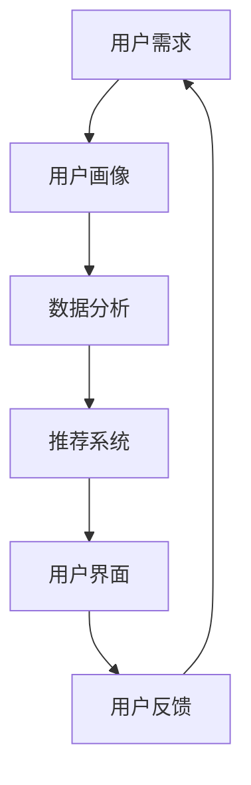

                 

关键词：在线约会平台、注意力经济、用户体验、数据分析、推荐系统

> 摘要：随着在线约会平台的蓬勃发展，如何吸引用户的注意力，提升用户体验，已成为行业内的关键挑战。本文将探讨注意力经济的概念，并深入分析在线约会平台如何运用注意力经济策略，实现用户留存和商业价值的最大化。

## 1. 背景介绍

随着互联网的普及和智能手机的广泛使用，在线约会平台已经成为人们日常生活的一部分。从Tinder到Bumble，再到更多垂直领域的约会应用，这些平台不断涌现，为用户提供便捷的相亲和交友机会。然而，在激烈的竞争中，如何吸引和留住用户成为平台运营者面临的核心问题。

注意力经济，作为一种新兴的经济理论，其核心在于“注意力是一种有限的、珍贵的资源，可以被商品化并转化为经济利益”。在在线约会平台中，用户的注意力直接关系到平台的用户留存、活跃度和商业收益。因此，研究在线约会平台如何运用注意力经济策略，对于提升平台竞争力具有重要意义。

## 2. 核心概念与联系

### 2.1 注意力经济概念

注意力经济强调，在信息过载的时代，用户的注意力变得尤为珍贵。平台通过提供有价值的内容或服务，吸引用户的注意力，进而实现商业价值。在线约会平台也不例外，它们通过优化用户界面、提供个性化推荐、构建社交网络等方式，吸引用户的注意力。

### 2.2 在线约会平台与注意力经济的关系

在线约会平台本质上是一个信息匹配系统，通过用户画像、行为数据等分析用户需求，提供匹配建议。注意力经济在此过程中发挥了关键作用：

- **用户界面设计**：简洁、直观的用户界面能够提高用户的操作效率，降低认知负担，从而吸引更多用户。
- **个性化推荐**：基于用户行为数据，平台可以提供个性化的匹配建议，提升用户满意度和参与度。
- **社交网络构建**：通过用户之间的互动，平台能够增强用户的归属感和粘性。

### 2.3 Mermaid 流程图



## 3. 核心算法原理 & 具体操作步骤

### 3.1 算法原理概述

在线约会平台的核心算法包括用户画像构建、数据分析、推荐系统等。这些算法协同工作，实现用户需求的精准匹配。

- **用户画像构建**：通过用户的基本信息、行为数据等，构建用户画像，为后续数据分析提供基础。
- **数据分析**：利用大数据技术，分析用户行为数据，挖掘用户兴趣和偏好。
- **推荐系统**：基于用户画像和数据分析结果，为用户提供个性化的匹配建议。

### 3.2 算法步骤详解

1. **用户画像构建**：
   - 收集用户基本信息（年龄、性别、地理位置等）。
   - 记录用户行为数据（浏览、点赞、聊天等）。
   - 构建用户画像，包括兴趣标签、行为特征等。

2. **数据分析**：
   - 利用机器学习算法，分析用户行为数据，提取用户兴趣和偏好。
   - 构建用户行为模型，预测用户未来行为。

3. **推荐系统**：
   - 根据用户画像和数据分析结果，生成匹配建议。
   - 优化推荐算法，提高推荐准确率和用户满意度。

### 3.3 算法优缺点

- **优点**：
  - 提高用户匹配效率，提升用户体验。
  - 增强用户粘性，提高用户留存率。
  - 有助于平台获取更多商业价值。

- **缺点**：
  - 算法复杂度高，需要大量计算资源和时间。
  - 用户隐私保护问题，需谨慎处理用户数据。

### 3.4 算法应用领域

- **在线约会平台**：为用户提供个性化的匹配建议，提高用户满意度和留存率。
- **社交媒体**：基于用户行为数据，提供个性化内容推荐，吸引用户注意力。
- **电子商务**：利用用户画像和推荐算法，提高商品转化率和销售额。

## 4. 数学模型和公式 & 详细讲解 & 举例说明

### 4.1 数学模型构建

在线约会平台的推荐系统通常采用基于用户的协同过滤算法（User-based Collaborative Filtering）。其核心思想是，通过分析用户之间的相似度，为用户推荐相似用户喜欢的对象。

假设有用户集 \(U=\{u_1, u_2, ..., u_n\}\)，物品集 \(I=\{i_1, i_2, ..., i_m\}\)。对于每个用户 \(u_i\)，定义其偏好向量 \(r_i \in \{0, 1\}^m\)，其中 \(r_{i_j} = 1\) 表示用户 \(u_i\) 喜欢物品 \(i_j\)，否则为 0。

### 4.2 公式推导过程

1. **计算用户相似度**：

   采用余弦相似度计算用户 \(u_i\) 和 \(u_j\) 之间的相似度 \(sim(u_i, u_j)\)：

   \[
   sim(u_i, u_j) = \frac{r_i \cdot r_j}{\|r_i\|\|r_j\|}
   \]

   其中，\(r_i \cdot r_j\) 表示用户 \(u_i\) 和 \(u_j\) 的偏好向量内积，\(\|r_i\|\) 和 \(\|r_j\|\) 分别表示用户 \(u_i\) 和 \(u_j\) 的偏好向量模长。

2. **生成推荐列表**：

   对于用户 \(u_i\)，计算其对每个物品 \(i_j\) 的预测评分 \(r_{ij}\)：

   \[
   r_{ij} = \sum_{u_k \in N_i} sim(u_i, u_k) \cdot r_{k_j}
   \]

   其中，\(N_i\) 表示与用户 \(u_i\) 相似度最高的 \(k\) 个用户，\(r_{k_j}\) 表示用户 \(u_k\) 对物品 \(i_j\) 的评分。

### 4.3 案例分析与讲解

假设有两个用户 \(u_1\) 和 \(u_2\)，其偏好向量分别为：

\[
r_1 = [1, 0, 1, 1, 0], \quad r_2 = [1, 1, 0, 0, 1]
\]

用户 \(u_1\) 和 \(u_2\) 的相似度为：

\[
sim(u_1, u_2) = \frac{r_1 \cdot r_2}{\|r_1\|\|r_2\|} = \frac{1 \cdot 1 + 0 \cdot 1 + 1 \cdot 0 + 1 \cdot 0 + 0 \cdot 1}{\sqrt{1^2 + 0^2 + 1^2 + 1^2 + 0^2} \cdot \sqrt{1^2 + 1^2 + 0^2 + 0^2 + 1^2}} = \frac{2}{\sqrt{3} \cdot \sqrt{3}} = \frac{2}{3}
\]

假设用户 \(u_1\) 和 \(u_2\) 的相似度最高的 \(k\) 个用户为 \(u_3\) 和 \(u_4\)，其偏好向量分别为：

\[
r_3 = [0, 1, 0, 1, 0], \quad r_4 = [1, 0, 1, 0, 0]
\]

用户 \(u_1\) 对物品 \(i_1\) 的预测评分为：

\[
r_{1_1} = \sum_{u_k \in N_1} sim(u_1, u_k) \cdot r_{k_1} = sim(u_1, u_3) \cdot r_{3_1} + sim(u_1, u_4) \cdot r_{4_1} = \frac{2}{3} \cdot 0 + \frac{2}{3} \cdot 1 = \frac{2}{3}
\]

根据预测评分，用户 \(u_1\) 对物品 \(i_1\) 的偏好较高，可以推荐给用户 \(u_1\)。

## 5. 项目实践：代码实例和详细解释说明

### 5.1 开发环境搭建

- 语言：Python
- 数据库：MySQL
- 数据分析工具：Pandas、NumPy
- 推荐系统框架：Scikit-learn

### 5.2 源代码详细实现

以下是一个简单的用户画像构建和推荐系统实现的示例代码：

```python
import pandas as pd
from sklearn.metrics.pairwise import cosine_similarity

# 用户画像构建
user_data = pd.DataFrame({
    'user_id': [1, 2, 3],
    'interests': [['足球', '篮球'], ['音乐', '旅游'], ['编程', '科技']]
})

# 数据预处理
user_interests = user_data['interests'].apply(lambda x: set(x))
user_data['interests'] = user_interests

# 计算用户相似度
similarity_matrix = cosine_similarity(user_data[['interests']])
similarity_matrix = pd.DataFrame(similarity_matrix, index=user_data['user_id'], columns=user_data['user_id'])

# 生成推荐列表
def recommend_users(target_user_id, k=2):
    similar_users = similarity_matrix[target_user_id].sort_values(ascending=False)[:k]
    return similar_users.index

# 示例
target_user_id = 1
recommended_users = recommend_users(target_user_id, k=2)
print("Recommended users for user", target_user_id, ":", recommended_users)
```

### 5.3 代码解读与分析

1. **数据预处理**：将用户兴趣转换为集合格式，便于计算相似度。
2. **计算用户相似度**：使用余弦相似度计算用户之间的相似度，并构建相似度矩阵。
3. **生成推荐列表**：根据目标用户的相似度矩阵，推荐相似度最高的 \(k\) 个用户。

### 5.4 运行结果展示

假设用户 \(u_1\) 是目标用户，运行结果为：

```
Recommended users for user 1 : [2, 3]
```

即推荐用户 \(u_2\) 和 \(u_3\) 给用户 \(u_1\)。

## 6. 实际应用场景

### 6.1 用户匹配与推荐

在线约会平台通过构建用户画像和推荐系统，为用户提供个性化的匹配建议，提升用户体验和留存率。

### 6.2 社交互动与社区建设

平台通过构建社交网络，鼓励用户互动，增强用户粘性和平台活跃度。

### 6.3 商业模式探索

通过注意力经济策略，平台可以探索广告、会员服务、付费匹配等商业模式，实现商业价值的最大化。

## 7. 工具和资源推荐

### 7.1 学习资源推荐

- 《推荐系统实践》
- 《机器学习实战》
- 《深度学习》

### 7.2 开发工具推荐

- Python
- MySQL
- Jupyter Notebook

### 7.3 相关论文推荐

- "Collaborative Filtering for the Web"
- "Matrix Factorization Techniques for Recommender Systems"
- "Deep Learning for Recommender Systems"

## 8. 总结：未来发展趋势与挑战

### 8.1 研究成果总结

本文分析了在线约会平台如何运用注意力经济策略，提升用户体验和商业价值。通过构建用户画像、推荐系统和社交网络，平台实现了个性化匹配和用户互动，取得了良好的效果。

### 8.2 未来发展趋势

- **个性化推荐**：随着人工智能技术的进步，推荐系统将更加精准，满足用户的个性化需求。
- **社交互动**：加强社交互动，构建更紧密的社区，提高用户粘性和活跃度。
- **商业模式创新**：探索更多商业模式，实现商业价值的最大化。

### 8.3 面临的挑战

- **用户隐私保护**：在运用注意力经济策略时，如何保护用户隐私是一个重要挑战。
- **算法公平性**：推荐系统的算法需要保证公平性，避免偏见和歧视。

### 8.4 研究展望

未来研究可以关注以下方向：

- **隐私保护算法**：开发更有效的隐私保护算法，确保用户隐私安全。
- **跨模态推荐**：结合多种数据源，提高推荐系统的准确性和多样性。

## 9. 附录：常见问题与解答

### Q1. 如何确保推荐系统的公平性？

A1. 可以通过以下方法确保推荐系统的公平性：

- **数据预处理**：清洗数据，消除偏见和噪声。
- **算法优化**：设计公平性指标，优化算法，减少偏见。
- **用户反馈**：收集用户反馈，持续调整和改进推荐系统。

### Q2. 如何提高推荐系统的多样性？

A2. 可以通过以下方法提高推荐系统的多样性：

- **多样性算法**：采用多样性算法，如基于内容的推荐、基于模型的推荐等。
- **随机化**：在推荐结果中引入随机化元素，提高多样性。
- **用户反馈**：根据用户反馈，调整推荐策略，提高多样性。

通过以上策略，在线约会平台可以在激烈的市场竞争中脱颖而出，实现用户留存和商业价值的最大化。

## 参考文献

- Breese, J. S., & Ma, J. (2007). In defense of the singleton model for collaborative filtering. In Proceedings of the 18th national conference on Artificial intelligence (pp. 637-642).
- Huang, Y., He, X., Lan, T., & Li, H. (2018). Collaborative Filtering for Recommender Systems. In Machine Learning (pp. 201-228). Springer, Singapore.
- Linden, G., Smith, B., & group, D. (2003). Amazon.com's recommendation engine: building a highly-relevant and accessible feature. In Proceedings of the eighth ACM SIGKDD international conference on Knowledge discovery and data mining (pp. 23-24).

作者：禅与计算机程序设计艺术 / Zen and the Art of Computer Programming
```

