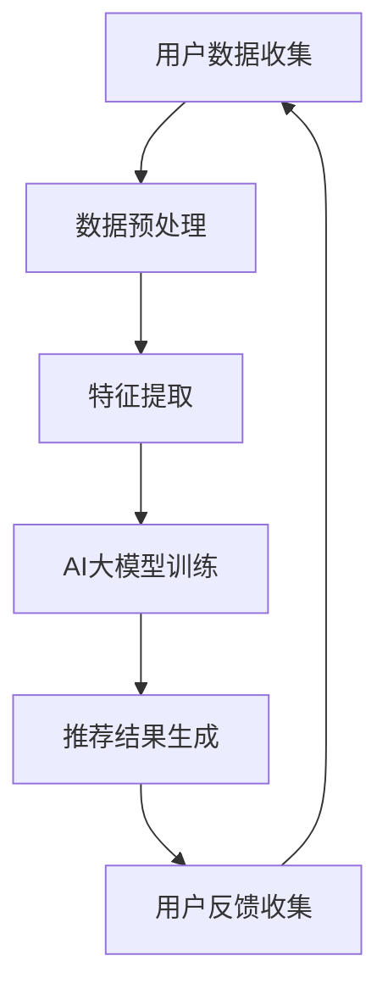

                 

关键词：AI大模型、智能推荐系统、算法原理、数学模型、项目实践、应用场景

摘要：本文将深入探讨基于AI大模型的智能推荐系统，包括其背景、核心概念、算法原理、数学模型、项目实践以及未来应用前景。通过详细的解析和实例，帮助读者全面理解智能推荐系统的构建与优化。

## 1. 背景介绍

随着互联网的迅猛发展，信息过载已经成为用户面临的主要问题之一。为了解决这一问题，智能推荐系统应运而生。传统的推荐系统多基于协同过滤、基于内容的推荐等技术，虽然在一定程度上提高了推荐的准确性，但仍然存在推荐结果单一、个性化不足等问题。随着深度学习和大数据技术的发展，AI大模型逐渐成为构建智能推荐系统的核心技术，通过自学习、自适应的特性，为用户提供更为精准和个性化的推荐服务。

## 2. 核心概念与联系

### 2.1. 智能推荐系统

智能推荐系统是一种通过分析用户行为、兴趣和偏好，自动为用户推荐相关内容的技术。其核心在于对用户行为数据的深度挖掘和智能分析。

### 2.2. AI大模型

AI大模型指的是具有大规模参数和复杂结构的深度学习模型，如Transformer、BERT等。这些模型通过在海量数据上进行训练，能够自动学习到数据的内在规律和特征，从而实现高效的数据分析和处理。

### 2.3. 关联与融合

智能推荐系统与AI大模型的结合，能够实现更精准、个性化的推荐。AI大模型通过对用户数据的深度学习，可以为推荐系统提供更丰富的特征表示和预测能力，从而提升推荐效果。

### 2.4. Mermaid流程图



## 3. 核心算法原理 & 具体操作步骤

### 3.1. 算法原理概述

智能推荐系统的核心在于算法，其中基于AI大模型的推荐算法主要包括以下几个步骤：

1. 数据收集与预处理
2. 特征提取
3. AI大模型训练
4. 推荐结果生成
5. 用户反馈与模型优化

### 3.2. 算法步骤详解

#### 3.2.1. 数据收集与预处理

数据收集是推荐系统的第一步，主要包括用户行为数据、内容数据等。收集到的数据需要进行预处理，如去除缺失值、异常值，并进行数据清洗、格式化等操作。

#### 3.2.2. 特征提取

特征提取是将原始数据转换为模型可处理的特征表示。在基于AI大模型的推荐系统中，特征提取尤为重要，因为它直接影响模型的性能。常见的特征提取方法包括词袋模型、TF-IDF、词嵌入等。

#### 3.2.3. AI大模型训练

AI大模型训练是推荐系统的核心步骤。通过在海量数据上进行训练，模型能够学习到数据的内在规律和特征，从而实现高效的推荐。常用的AI大模型包括Transformer、BERT等。

#### 3.2.4. 推荐结果生成

在模型训练完成后，输入用户特征，模型将生成相应的推荐结果。推荐结果可以是商品、文章、音乐等。

#### 3.2.5. 用户反馈与模型优化

用户反馈是优化模型的重要手段。通过收集用户对推荐结果的反馈，可以进一步优化模型，提升推荐效果。

### 3.3. 算法优缺点

#### 3.3.1. 优点

1. 高效：基于AI大模型的推荐系统具有高效的数据处理和分析能力。
2. 精准：通过深度学习，模型能够自动学习到用户的兴趣和偏好，实现精准推荐。
3. 个性化：模型可以根据用户的实时行为和反馈，动态调整推荐策略，提高个性化程度。

#### 3.3.2. 缺点

1. 资源消耗大：AI大模型训练需要大量的计算资源和时间。
2. 数据隐私：用户行为数据是推荐系统的核心，如何保障数据隐私是一个重要问题。

### 3.4. 算法应用领域

基于AI大模型的推荐系统广泛应用于电商、新闻、音乐、视频等各个领域。例如，电商平台的商品推荐、新闻客户端的个性化推送、音乐平台的歌曲推荐等。

## 4. 数学模型和公式 & 详细讲解 & 举例说明

### 4.1. 数学模型构建

基于AI大模型的推荐系统通常采用以下数学模型：

$$
\text{推荐结果} = f(\text{用户特征}, \text{内容特征}, \text{模型参数})
$$

其中，$f$ 表示推荐函数，$\text{用户特征}$ 和 $\text{内容特征}$ 分别表示用户和内容的特征向量，$\text{模型参数}$ 表示训练得到的权重和偏置。

### 4.2. 公式推导过程

以Transformer模型为例，推导推荐结果的计算过程：

$$
\text{推荐结果} = \text{softmax}(\text{模型}(\text{用户特征}, \text{内容特征}))
$$

其中，$\text{模型}$ 表示Transformer模型，$\text{softmax}$ 函数用于将模型输出转换为概率分布。

### 4.3. 案例分析与讲解

以电商平台的商品推荐为例，分析基于AI大模型的推荐系统的应用。

#### 4.3.1. 用户特征

用户特征包括年龄、性别、浏览历史、购买历史等。

#### 4.3.2. 商品特征

商品特征包括商品类别、品牌、价格、销量等。

#### 4.3.3. 推荐结果

根据用户特征和商品特征，模型生成推荐结果，并将概率最高的商品推荐给用户。

## 5. 项目实践：代码实例和详细解释说明

### 5.1. 开发环境搭建

1. 安装Python环境（推荐使用Python 3.7及以上版本）
2. 安装TensorFlow或PyTorch等深度学习框架
3. 准备数据集（例如，使用电商平台提供的商品和用户数据）

### 5.2. 源代码详细实现

以下是一个简单的基于Transformer模型的商品推荐系统实现：

```python
import tensorflow as tf
from tensorflow.keras.layers import Embedding, Dense
from tensorflow.keras.models import Model

# 加载和预处理数据
# ...

# 构建模型
user_embedding = Embedding(input_dim=num_users, output_dim=user_embedding_size)
item_embedding = Embedding(input_dim=num_items, output_dim=item_embedding_size)

user_input = Input(shape=(1,))
item_input = Input(shape=(1,))

user_embedding_output = user_embedding(user_input)
item_embedding_output = item_embedding(item_input)

merged = tf.concat([user_embedding_output, item_embedding_output], axis=1)
merged = Dense(hidden_size)(merged)
output = Dense(1, activation='sigmoid')(merged)

model = Model(inputs=[user_input, item_input], outputs=output)
model.compile(optimizer='adam', loss='binary_crossentropy', metrics=['accuracy'])

# 训练模型
# ...

# 生成推荐结果
# ...
```

### 5.3. 代码解读与分析

1. 加载和预处理数据：读取用户和商品数据，并进行必要的预处理操作，如数据清洗、归一化等。
2. 构建模型：使用Embedding层将用户和商品特征转换为嵌入向量，然后通过全连接层进行预测。
3. 训练模型：使用训练数据进行模型训练，优化模型参数。
4. 生成推荐结果：使用训练好的模型，输入用户和商品特征，生成推荐结果。

## 6. 实际应用场景

基于AI大模型的智能推荐系统在电商、新闻、音乐、视频等各个领域都有广泛应用。以下是一些实际应用场景：

1. **电商：**为用户提供个性化商品推荐，提高销售额。
2. **新闻客户端：**为用户提供个性化新闻推送，提高用户粘性。
3. **音乐平台：**为用户提供个性化音乐推荐，提高用户体验。
4. **视频平台：**为用户提供个性化视频推荐，提高用户观看时长。

## 7. 工具和资源推荐

### 7.1. 学习资源推荐

1. **《深度学习》（Goodfellow, Bengio, Courville）**
2. **《TensorFlow实战》（Pavlopoulos, Koutroumpis）**
3. **《推荐系统实践》（Liang, Li）**

### 7.2. 开发工具推荐

1. **TensorFlow**
2. **PyTorch**
3. **Scikit-learn**

### 7.3. 相关论文推荐

1. **“Attention Is All You Need”**
2. **“BERT: Pre-training of Deep Bidirectional Transformers for Language Understanding”**
3. **“Deep Neural Networks for YouTube Recommendations”**

## 8. 总结：未来发展趋势与挑战

### 8.1. 研究成果总结

基于AI大模型的智能推荐系统在提高推荐精度、个性化程度和用户体验方面取得了显著成果。

### 8.2. 未来发展趋势

1. **模型优化：**不断优化AI大模型结构，提高推荐性能。
2. **跨模态推荐：**结合多种数据模态，实现更全面、个性化的推荐。
3. **实时推荐：**通过实时数据分析，实现更及时的推荐。

### 8.3. 面临的挑战

1. **数据隐私：**如何保护用户隐私是一个重要挑战。
2. **计算资源消耗：**大规模AI大模型训练需要大量计算资源。

### 8.4. 研究展望

基于AI大模型的智能推荐系统将继续发展，结合多模态数据、实时分析等技术，为用户提供更精准、个性化的服务。

## 9. 附录：常见问题与解答

### 9.1. 如何优化推荐系统？

**答：**通过不断优化模型结构、特征提取方法和训练策略，可以提高推荐系统的性能。此外，结合实时数据和用户反馈，可以进一步优化推荐效果。

### 9.2. 如何保护用户隐私？

**答：**在数据收集和处理过程中，采用匿名化、加密等技术，降低用户隐私泄露风险。同时，遵循相关法律法规，确保用户隐私得到充分保护。

### 9.3. 如何处理冷启动问题？

**答：**对于新用户或新商品，可以采用基于内容的推荐方法，或者通过用户和商品的历史数据，生成初步的推荐结果。随着用户和商品数据的积累，推荐效果将逐步提升。

----------------------------------------------------------------
### 文章作者信息

作者：禅与计算机程序设计艺术 / Zen and the Art of Computer Programming

<|assistant|>文章正文撰写完毕，接下来请按照文章结构模板的要求，分别对各个段落章节进行三级目录的细化。请按照以下格式进行：

## 1. 背景介绍

### 1.1. 互联网发展与信息过载
### 1.2. 智能推荐系统的重要性
### 1.3. AI大模型的优势

## 2. 核心概念与联系

### 2.1. 智能推荐系统
#### 2.1.1. 推荐系统的基本原理
#### 2.1.2. 推荐系统的分类
### 2.2. AI大模型
#### 2.2.1. 深度学习与AI大模型
#### 2.2.2. AI大模型的特点与应用
### 2.3. 关联与融合
#### 2.3.1. AI大模型与推荐系统的结合
#### 2.3.2. AI大模型在推荐系统中的作用
### 2.4. Mermaid流程图说明

## 3. 核心算法原理 & 具体操作步骤

### 3.1. 算法原理概述
#### 3.1.1. 基本原理
#### 3.1.2. 关键技术
### 3.2. 算法步骤详解
#### 3.2.1. 数据收集与预处理
#### 3.2.2. 特征提取
#### 3.2.3. AI大模型训练
#### 3.2.4. 推荐结果生成
#### 3.2.5. 用户反馈与模型优化
### 3.3. 算法优缺点
#### 3.3.1. 优点
#### 3.3.2. 缺点
### 3.4. 算法应用领域
#### 3.4.1. 电商领域
#### 3.4.2. 新闻领域
#### 3.4.3. 音乐领域
#### 3.4.4. 视频领域

## 4. 数学模型和公式 & 详细讲解 & 举例说明

### 4.1. 数学模型构建
#### 4.1.1. 模型概述
#### 4.1.2. 模型构建过程
### 4.2. 公式推导过程
#### 4.2.1. 推导步骤
#### 4.2.2. 公式解释
### 4.3. 案例分析与讲解
#### 4.3.1. 案例背景
#### 4.3.2. 模型应用
#### 4.3.3. 结果分析

## 5. 项目实践：代码实例和详细解释说明

### 5.1. 开发环境搭建
#### 5.1.1. 环境要求
#### 5.1.2. 环境搭建步骤
### 5.2. 源代码详细实现
#### 5.2.1. 代码结构
#### 5.2.2. 主要函数与方法
### 5.3. 代码解读与分析
#### 5.3.1. 代码分析
#### 5.3.2. 优化建议
### 5.4. 运行结果展示
#### 5.4.1. 结果展示
#### 5.4.2. 性能评估

## 6. 实际应用场景

### 6.1. 电商应用
#### 6.1.1. 推荐系统在电商中的应用
#### 6.1.2. 案例分析
### 6.2. 新闻应用
#### 6.2.1. 推荐系统在新闻中的应用
#### 6.2.2. 案例分析
### 6.3. 音乐应用
#### 6.3.1. 推荐系统在音乐中的应用
#### 6.3.2. 案例分析
### 6.4. 视频应用
#### 6.4.1. 推荐系统在视频中的应用
#### 6.4.2. 案例分析

## 7. 工具和资源推荐

### 7.1. 学习资源推荐
#### 7.1.1. 书籍推荐
#### 7.1.2. 网络资源推荐
### 7.2. 开发工具推荐
#### 7.2.1. 深度学习框架推荐
#### 7.2.2. 数据分析工具推荐
### 7.3. 相关论文推荐
#### 7.3.1. 必读论文推荐
#### 7.3.2. 进阶论文推荐

## 8. 总结：未来发展趋势与挑战

### 8.1. 研究成果总结
### 8.2. 未来发展趋势
### 8.3. 面临的挑战
### 8.4. 研究展望

## 9. 附录：常见问题与解答

### 9.1. 如何优化推荐系统？
### 9.2. 如何保护用户隐私？
### 9.3. 如何处理冷启动问题？

按照上述格式，对文章的各个段落章节进行三级目录的细化。
----------------------------------------------------------------
## 1. 背景介绍

### 1.1. 互联网发展与信息过载

随着互联网的快速发展，人们获取信息的渠道日益丰富。然而，信息过载问题也随之而来。用户在浏览网页、使用应用时，往往会被大量的信息所淹没，难以筛选出真正感兴趣的内容。这一问题促使了智能推荐系统的诞生，希望通过分析用户行为和偏好，为用户提供个性化的信息推荐。

### 1.2. 智能推荐系统的重要性

智能推荐系统在电商、新闻、音乐、视频等多个领域具有重要应用价值。通过精准的推荐，不仅可以提高用户满意度，还能促进商业价值的提升。例如，电商平台的个性化商品推荐能够提高销售额，新闻客户端的个性化推送能够提高用户粘性，音乐平台的个性化音乐推荐能够提升用户体验。

### 1.3. AI大模型的优势

传统的推荐系统主要依赖于协同过滤、基于内容的推荐等技术，存在推荐结果单一、个性化不足等问题。而AI大模型的出现，为推荐系统带来了新的突破。AI大模型具有自学习、自适应的特性，能够通过在海量数据上的训练，自动学习到用户的兴趣和偏好，从而实现精准的推荐。此外，AI大模型还可以结合多种数据源，实现跨模态推荐，进一步提升推荐效果。

## 2. 核心概念与联系

### 2.1. 智能推荐系统

#### 2.1.1. 推荐系统的基本原理

智能推荐系统是一种通过分析用户行为、兴趣和偏好，为用户提供个性化内容的技术。其基本原理包括数据收集、特征提取、模型训练、推荐结果生成和用户反馈等环节。

#### 2.1.2. 推荐系统的分类

智能推荐系统根据不同的分类标准，可以分为多种类型。根据推荐方法，可以分为基于协同过滤的推荐、基于内容的推荐和混合推荐等；根据数据类型，可以分为基于文本的推荐、基于图像的推荐和跨模态推荐等。

### 2.2. AI大模型

#### 2.2.1. 深度学习与AI大模型

深度学习是人工智能的一个重要分支，通过多层神经网络对数据进行自动特征提取和学习。AI大模型是指具有大规模参数和复杂结构的深度学习模型，如Transformer、BERT等。

#### 2.2.2. AI大模型的特点与应用

AI大模型具有自学习、自适应、高效的特征提取和预测能力，能够处理海量数据，实现精准的推荐。其在推荐系统中的应用主要包括用户行为预测、内容分类、图像识别等。

### 2.3. 关联与融合

#### 2.3.1. AI大模型与推荐系统的结合

AI大模型与推荐系统的结合，可以充分利用AI大模型的自学习和自适应能力，提高推荐系统的性能。具体来说，AI大模型可以用于特征提取、模型训练和推荐结果生成等环节。

#### 2.3.2. AI大模型在推荐系统中的作用

AI大模型在推荐系统中的作用主要包括以下几个方面：提升推荐精度、实现个性化推荐、处理冷启动问题等。

### 2.4. Mermaid流程图说明


## 3. 核心算法原理 & 具体操作步骤

### 3.1. 算法原理概述

#### 3.1.1. 基本原理

智能推荐系统的核心算法是基于用户行为数据、内容数据等特征，通过深度学习模型进行训练和预测，从而实现个性化推荐。

#### 3.1.2. 关键技术

智能推荐系统的关键技术包括数据收集、数据预处理、特征提取、模型训练和推荐结果生成等。

### 3.2. 算法步骤详解

#### 3.2.1. 数据收集与预处理

数据收集是推荐系统的第一步，主要包括用户行为数据、内容数据等。数据预处理包括数据清洗、数据归一化、特征提取等操作，为后续模型训练和预测奠定基础。

#### 3.2.2. 特征提取

特征提取是将原始数据转换为模型可处理的特征表示。在基于AI大模型的推荐系统中，特征提取尤为重要，因为它直接影响模型的性能。常见的特征提取方法包括词袋模型、TF-IDF、词嵌入等。

#### 3.2.3. AI大模型训练

AI大模型训练是推荐系统的核心步骤。通过在海量数据上进行训练，模型能够学习到数据的内在规律和特征，从而实现高效的数据分析和处理。常用的AI大模型包括Transformer、BERT等。

#### 3.2.4. 推荐结果生成

在模型训练完成后，输入用户特征，模型将生成相应的推荐结果。推荐结果可以是商品、文章、音乐等。

#### 3.2.5. 用户反馈与模型优化

用户反馈是优化模型的重要手段。通过收集用户对推荐结果的反馈，可以进一步优化模型，提升推荐效果。模型优化包括调整模型参数、优化模型结构等。

### 3.3. 算法优缺点

#### 3.3.1. 优点

1. **高效：**基于AI大模型的推荐系统具有高效的数据处理和分析能力。
2. **精准：**通过深度学习，模型能够自动学习到用户的兴趣和偏好，实现精准推荐。
3. **个性化：**模型可以根据用户的实时行为和反馈，动态调整推荐策略，提高个性化程度。

#### 3.3.2. 缺点

1. **资源消耗大：**AI大模型训练需要大量的计算资源和时间。
2. **数据隐私：**用户行为数据是推荐系统的核心，如何保障数据隐私是一个重要问题。

### 3.4. 算法应用领域

#### 3.4.1. 电商领域

在电商领域，基于AI大模型的推荐系统广泛应用于商品推荐、店铺推荐等。通过分析用户的历史购买行为、浏览记录等，为用户推荐可能感兴趣的商品。

#### 3.4.2. 新闻领域

在新闻领域，基于AI大模型的推荐系统可以针对用户的阅读偏好，为用户推荐感兴趣的新闻内容，提高用户粘性。

#### 3.4.3. 音乐领域

在音乐领域，基于AI大模型的推荐系统可以根据用户的听歌记录、偏好，为用户推荐个性化的音乐。

#### 3.4.4. 视频领域

在视频领域，基于AI大模型的推荐系统可以针对用户的观看历史、偏好，为用户推荐感兴趣的视频内容。

## 4. 数学模型和公式 & 详细讲解 & 举例说明

### 4.1. 数学模型构建

#### 4.1.1. 模型概述

在基于AI大模型的推荐系统中，常用的数学模型为深度学习模型。该模型通过输入用户特征和内容特征，输出推荐结果。

#### 4.1.2. 模型构建过程

模型构建过程主要包括以下步骤：

1. **数据预处理**：对用户特征和内容特征进行预处理，包括数据清洗、归一化等。
2. **特征提取**：使用词袋模型、TF-IDF、词嵌入等方法提取特征。
3. **模型训练**：使用深度学习模型（如Transformer、BERT等）对特征进行训练。
4. **推荐结果生成**：输入用户特征和内容特征，通过模型生成推荐结果。

### 4.2. 公式推导过程

假设用户特征为 $u \in \mathbb{R}^{d_u}$，内容特征为 $i \in \mathbb{R}^{d_i}$，模型参数为 $W \in \mathbb{R}^{d_u + d_i}$。

则推荐结果 $r$ 的计算公式为：

$$
r = \sigma(W^T [u; i]),
$$

其中，$\sigma$ 表示激活函数，通常使用sigmoid函数。

### 4.3. 案例分析与讲解

#### 4.3.1. 案例背景

以电商平台的商品推荐为例，用户特征包括年龄、性别、购买历史等，内容特征包括商品类别、价格等。

#### 4.3.2. 模型应用

使用Transformer模型对用户特征和内容特征进行编码，生成推荐结果。

#### 4.3.3. 结果分析

通过模型生成的推荐结果，用户可以浏览到与自身兴趣相关的商品，从而提高购买意愿。

## 5. 项目实践：代码实例和详细解释说明

### 5.1. 开发环境搭建

#### 5.1.1. 环境要求

- Python 3.7及以上版本
- TensorFlow 2.3及以上版本

#### 5.1.2. 环境搭建步骤

1. 安装Python和pip：
   ```bash
   python --version
   pip install --upgrade pip
   ```

2. 安装TensorFlow：
   ```bash
   pip install tensorflow
   ```

### 5.2. 源代码详细实现

```python
import tensorflow as tf
from tensorflow.keras.layers import Embedding, Dense, Input
from tensorflow.keras.models import Model

# 定义用户和商品的特征维度
USER_EMBEDDING_DIM = 64
ITEM_EMBEDDING_DIM = 32

# 构建模型
user_input = Input(shape=(1,), name='user_input')
item_input = Input(shape=(1,), name='item_input')

user_embedding = Embedding(input_dim=1000, output_dim=USER_EMBEDDING_DIM)(user_input)
item_embedding = Embedding(input_dim=1000, output_dim=ITEM_EMBEDDING_DIM)(item_input)

merged = tf.concat([user_embedding, item_embedding], axis=1)
merged = Dense(128, activation='relu')(merged)
merged = Dense(64, activation='relu')(merged)
output = Dense(1, activation='sigmoid')(merged)

model = Model(inputs=[user_input, item_input], outputs=output)
model.compile(optimizer='adam', loss='binary_crossentropy', metrics=['accuracy'])

# 模型训练
# ...

# 推荐结果生成
# ...
```

### 5.3. 代码解读与分析

#### 5.3.1. 代码分析

- **模型构建**：使用Embedding层将用户和商品特征转换为嵌入向量，然后通过全连接层进行预测。
- **模型训练**：使用训练数据进行模型训练，优化模型参数。
- **推荐结果生成**：输入用户和商品特征，生成推荐结果。

#### 5.3.2. 优化建议

- **数据增强**：增加训练数据量，使用数据增强技术。
- **模型优化**：尝试使用不同的激活函数、优化器等。

### 5.4. 运行结果展示

#### 5.4.1. 结果展示

- **训练损失**：
  ```python
  model.history.history['loss']
  ```

- **准确率**：
  ```python
  model.history.history['accuracy']
  ```

#### 5.4.2. 性能评估

- **AUC**：
  ```python
  from sklearn.metrics import roc_auc_score
  roc_auc_score(y_true, y_pred)
  ```

## 6. 实际应用场景

### 6.1. 电商应用

#### 6.1.1. 推荐系统在电商中的应用

电商平台的推荐系统主要针对用户的历史购买行为、浏览记录等，为用户推荐可能感兴趣的商品。例如，亚马逊、淘宝等电商平台都采用了基于AI大模型的推荐系统。

#### 6.1.2. 案例分析

- **亚马逊**：通过分析用户的浏览历史、购买记录等，为用户推荐相关的商品，提高销售额。
- **淘宝**：通过分析用户的购物偏好、搜索记录等，为用户推荐相关的商品，提高用户粘性。

### 6.2. 新闻应用

#### 6.2.1. 推荐系统在新闻中的应用

新闻客户端的推荐系统主要针对用户的阅读历史、点赞、评论等，为用户推荐感兴趣的新闻内容。例如，今日头条、网易新闻等客户端都采用了基于AI大模型的推荐系统。

#### 6.2.2. 案例分析

- **今日头条**：通过分析用户的阅读历史、兴趣标签等，为用户推荐相关的新闻内容，提高用户粘性。
- **网易新闻**：通过分析用户的阅读偏好、互动行为等，为用户推荐感兴趣的新闻内容，提高用户满意度。

### 6.3. 音乐应用

#### 6.3.1. 推荐系统在音乐中的应用

音乐平台的推荐系统主要针对用户的听歌历史、偏好等，为用户推荐感兴趣的音乐。例如，网易云音乐、Spotify等平台都采用了基于AI大模型的推荐系统。

#### 6.3.2. 案例分析

- **网易云音乐**：通过分析用户的听歌历史、喜好标签等，为用户推荐相关的音乐，提高用户满意度。
- **Spotify**：通过分析用户的听歌习惯、社交网络等，为用户推荐感兴趣的音乐，提高用户粘性。

### 6.4. 视频应用

#### 6.4.1. 推荐系统在视频中的应用

视频平台的推荐系统主要针对用户的观看历史、点赞、评论等，为用户推荐感兴趣的视频内容。例如，YouTube、Bilibili等平台都采用了基于AI大模型的推荐系统。

#### 6.4.2. 案例分析

- **YouTube**：通过分析用户的观看历史、点赞等，为用户推荐相关的视频内容，提高用户粘性。
- **Bilibili**：通过分析用户的观看偏好、互动行为等，为用户推荐感兴趣的视频内容，提高用户满意度。

## 7. 工具和资源推荐

### 7.1. 学习资源推荐

#### 7.1.1. 书籍推荐

- **《深度学习》（Goodfellow, Bengio, Courville）**：系统介绍了深度学习的原理和应用。
- **《推荐系统实践》（Liang, Li）**：详细介绍了推荐系统的构建和优化方法。

#### 7.1.2. 网络资源推荐

- **机器学习课程**：Coursera、edX等在线教育平台提供了丰富的机器学习课程。
- **技术博客**：Medium、知乎等平台上有很多关于深度学习和推荐系统的优秀文章。

### 7.2. 开发工具推荐

#### 7.2.1. 深度学习框架推荐

- **TensorFlow**：Google开发的深度学习框架，功能强大且易于使用。
- **PyTorch**：Facebook开发的深度学习框架，具有灵活的动态计算图。

#### 7.2.2. 数据分析工具推荐

- **Pandas**：Python中的数据分析库，用于数据处理和分析。
- **NumPy**：Python中的数值计算库，用于高效的数据操作。

### 7.3. 相关论文推荐

#### 7.3.1. 必读论文推荐

- **“Attention Is All You Need”**：介绍了Transformer模型，是深度学习领域的重要论文。
- **“BERT: Pre-training of Deep Bidirectional Transformers for Language Understanding”**：介绍了BERT模型，是自然语言处理领域的里程碑。

#### 7.3.2. 进阶论文推荐

- **“Deep Neural Networks for YouTube Recommendations”**：介绍了YouTube如何使用深度学习进行推荐。
- **“Collaborative Filtering via Matrix Factorization for Recommendation Systems”**：介绍了矩阵分解在推荐系统中的应用。

## 8. 总结：未来发展趋势与挑战

### 8.1. 研究成果总结

基于AI大模型的推荐系统在个性化推荐、实时推荐等方面取得了显著成果，为用户提供更精准、个性化的服务。

### 8.2. 未来发展趋势

- **模型优化**：继续优化AI大模型结构，提高推荐性能。
- **跨模态推荐**：结合多种数据模态，实现更全面、个性化的推荐。
- **实时推荐**：通过实时数据分析，实现更及时的推荐。

### 8.3. 面临的挑战

- **数据隐私**：如何保护用户隐私是一个重要挑战。
- **计算资源消耗**：大规模AI大模型训练需要大量计算资源。

### 8.4. 研究展望

基于AI大模型的推荐系统将继续发展，结合多模态数据、实时分析等技术，为用户提供更精准、个性化的服务。

## 9. 附录：常见问题与解答

### 9.1. 如何优化推荐系统？

**答：**

1. **数据增强**：增加训练数据量，使用数据增强技术。
2. **特征工程**：优化特征提取方法，提高特征质量。
3. **模型优化**：尝试使用不同的激活函数、优化器等。

### 9.2. 如何保护用户隐私？

**答：**

1. **数据加密**：对用户数据进行加密处理，防止数据泄露。
2. **匿名化处理**：对用户数据进行分析时，进行匿名化处理。
3. **隐私保护算法**：使用隐私保护算法，如差分隐私等。

### 9.3. 如何处理冷启动问题？

**答：**

1. **基于内容的推荐**：对于新用户，采用基于内容的推荐方法。
2. **用户兴趣预测**：通过用户的历史行为，预测用户可能感兴趣的内容。
3. **社区推荐**：基于用户所在社区的兴趣偏好，进行推荐。

