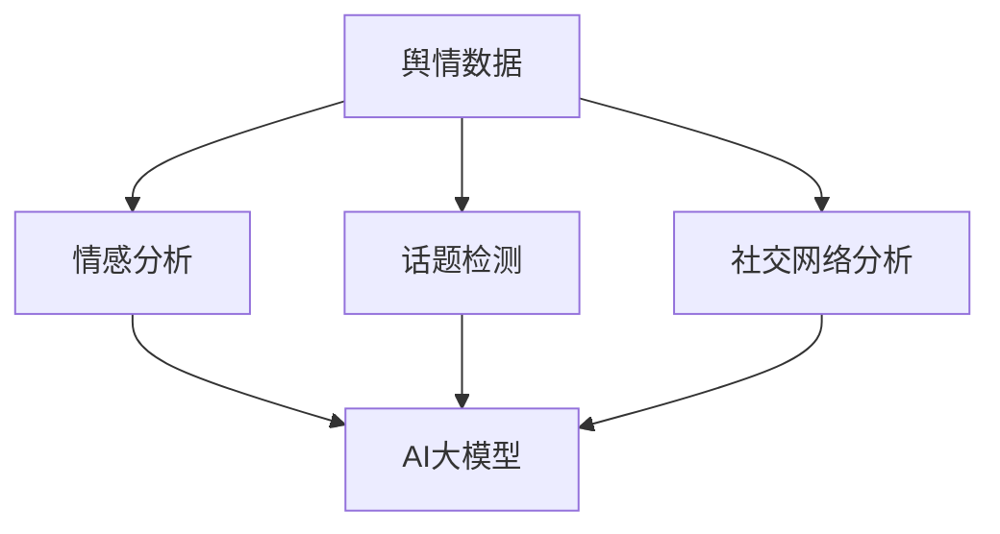

                 

在当今信息爆炸的时代，舆情分析已成为公众关注热点，对于政府决策、企业运营和社交媒体管理等各个方面具有重要意义。本文旨在探讨一种基于AI大模型的智能舆情分析系统，详细解析其核心概念、算法原理、数学模型以及实际应用场景，帮助读者深入理解这一前沿技术。

## 关键词

- AI大模型
- 智能舆情分析
- 数据挖掘
- 自然语言处理
- 舆情监测
- 社交媒体分析

## 摘要

本文将介绍一种基于AI大模型的智能舆情分析系统，重点探讨该系统的构建原理、算法实现以及应用实例。通过分析舆情数据，该系统能够实时监测和分析社会热点、情感趋势以及公众意见，为企业、政府和媒体提供科学依据，助力决策。本文还将对系统面临的技术挑战和未来发展趋势进行展望。

## 1. 背景介绍

### 1.1 舆情分析的重要性

舆情分析，又称舆论分析，是指对公众的意见、情绪和态度进行分析和评估的过程。随着互联网和社交媒体的普及，舆情分析在现代社会中发挥着越来越重要的作用。以下是舆情分析在几个关键领域的应用：

#### 政府决策

舆情分析可以帮助政府了解公众对政策的看法和态度，从而做出更为科学和合理的决策。通过分析网络上的评论、讨论和社交媒体数据，政府可以及时发现社会问题，调整政策方向，提高行政效率。

#### 企业运营

对于企业而言，舆情分析有助于了解消费者需求和市场趋势。通过分析消费者的评论和反馈，企业可以改进产品和服务，优化营销策略，提高市场竞争力。

#### 媒体传播

媒体利用舆情分析来捕捉热门话题和热点事件，制定报道计划和内容策略。通过分析社交媒体上的讨论和趋势，媒体可以更好地满足受众需求，提高传播效果。

### 1.2 AI大模型的发展

AI大模型，是指拥有海量参数和强大计算能力的深度学习模型。近年来，随着计算能力和数据资源的提升，AI大模型在各个领域取得了显著的进展。以下是AI大模型在舆情分析中的优势：

#### 数据处理能力

AI大模型能够处理海量数据，包括文本、图像和语音等多种数据类型。这使得舆情分析系统能够从海量的网络数据中提取有价值的信息。

#### 自动化分析

AI大模型可以实现自动化分析，包括情感分析、关键词提取、话题检测等。这大大提高了舆情分析的效率和准确性。

#### 模式识别

AI大模型能够通过学习大量数据，发现数据中的潜在模式和规律。这对于理解舆情趋势和预测未来舆情发展具有重要意义。

## 2. 核心概念与联系

### 2.1 核心概念

#### 舆情数据

舆情数据是指反映公众意见、情绪和态度的数据。这些数据可以从各种来源获取，包括社交媒体、新闻网站、论坛和博客等。

#### AI大模型

AI大模型是一种拥有海量参数和强大计算能力的深度学习模型，能够处理海量数据并提取有价值的信息。

#### 情感分析

情感分析是一种自然语言处理技术，用于判断文本的情绪倾向，如正面、负面或中性。

#### 话题检测

话题检测是一种信息检索技术，用于识别文本中的主要话题。

#### 社交网络分析

社交网络分析是一种研究社交网络结构和行为的分析方法，用于发现网络中的关键节点和关系。

### 2.2 关联图

以下是一个简单的Mermaid流程图，展示了舆情分析系统的核心概念及其关联。



## 3. 核心算法原理 & 具体操作步骤

### 3.1 算法原理概述

舆情分析系统通常采用以下几种核心算法：

#### 情感分析

情感分析算法通过学习大量的标注数据，训练出能够判断文本情感倾向的模型。常见的情感分析模型有基于机器学习的文本分类模型和基于深度学习的神经网络模型。

#### 话题检测

话题检测算法通过分析文本中的关键词和短语，识别文本中的主要话题。常见的算法有LDA（Latent Dirichlet Allocation）和LSTM（Long Short-Term Memory）等。

#### 社交网络分析

社交网络分析算法用于研究社交网络中的用户关系和传播路径。常见的算法有PageRank和社区发现算法等。

#### AI大模型

AI大模型将情感分析、话题检测和社交网络分析算法集成到一个统一的框架中，通过学习大量数据，实现自动化舆情分析。

### 3.2 算法步骤详解

舆情分析系统的具体操作步骤如下：

#### 1. 数据采集

从社交媒体、新闻网站、论坛和博客等渠道采集舆情数据。

#### 2. 数据预处理

对采集到的数据进行清洗和预处理，包括去除噪声、统一文本格式和分词等。

#### 3. 情感分析

使用情感分析算法对预处理后的文本进行分析，判断文本的情感倾向。

#### 4. 话题检测

使用话题检测算法对预处理后的文本进行分析，识别文本中的主要话题。

#### 5. 社交网络分析

使用社交网络分析算法对舆情数据进行分析，发现网络中的关键节点和传播路径。

#### 6. 结果输出

将分析结果输出给用户，包括情感分析结果、话题检测结果和社交网络分析结果等。

### 3.3 算法优缺点

#### 优点

- **自动化分析**：AI大模型可以实现自动化分析，提高效率和准确性。
- **海量数据处理**：AI大模型能够处理海量数据，包括文本、图像和语音等多种数据类型。
- **多维度分析**：AI大模型能够同时进行情感分析、话题检测和社交网络分析，提供全面的信息。

#### 缺点

- **计算资源需求大**：AI大模型需要大量的计算资源，对硬件设备要求较高。
- **数据质量依赖**：算法的性能高度依赖于数据质量，数据质量差可能导致分析结果不准确。
- **模型解释性差**：深度学习模型通常难以解释，对于结果的解释和验证存在一定困难。

### 3.4 算法应用领域

#### 政府决策

舆情分析可以帮助政府了解公众对政策的看法和态度，为政策制定提供科学依据。

#### 企业运营

企业可以利用舆情分析来监测品牌声誉、消费者反馈和市场趋势，优化产品和服务。

#### 媒体传播

媒体可以利用舆情分析来捕捉热门话题和热点事件，制定报道计划和内容策略。

#### 社会研究

社会研究者可以利用舆情分析来研究公众意见、社会心理和传播效果等。

## 4. 数学模型和公式 & 详细讲解 & 举例说明

### 4.1 数学模型构建

舆情分析系统中的数学模型主要包括情感分析模型、话题检测模型和社交网络分析模型。以下分别介绍这些模型的基本原理和数学公式。

#### 情感分析模型

情感分析模型通常采用文本分类模型，如朴素贝叶斯（Naive Bayes）、支持向量机（SVM）和深度学习模型，如卷积神经网络（CNN）和循环神经网络（RNN）等。以下是一个简单的朴素贝叶斯模型的数学公式：

$$
P(y|X) = \frac{P(X|y)P(y)}{P(X)}
$$

其中，$X$ 表示文本特征向量，$y$ 表示情感标签（如正面、负面或中性），$P(X|y)$ 表示给定情感标签$y$ 下文本特征向量$X$ 的概率，$P(y)$ 表示情感标签$y$ 的先验概率，$P(X)$ 表示文本特征向量$X$ 的概率。

#### 话题检测模型

话题检测模型通常采用概率主题模型，如LDA（Latent Dirichlet Allocation）和隐马尔可夫模型（HMM）等。以下是一个简单的LDA模型的数学公式：

$$
P(z|\phi) \propto \frac{1}{|\phi|} \prod_{i=1}^n \phi_{z_i}^{w_{i,z_i}}
$$

其中，$z$ 表示潜在主题分布，$\phi$ 表示潜在主题的词分布，$w$ 表示文本中的词语分布，$w_{i,z_i}$ 表示词语$i$ 属于主题$z_i$ 的概率。

#### 社交网络分析模型

社交网络分析模型通常采用图论和概率图模型，如PageRank和社区发现算法等。以下是一个简单的PageRank模型的数学公式：

$$
R(i) = (1-d) + d \sum_{j=1}^n \frac{R(j)}{N_j}
$$

其中，$R(i)$ 表示节点$i$ 的排名，$d$ 表示阻尼系数，$N_j$ 表示指向节点$i$ 的链接数。

### 4.2 公式推导过程

#### 情感分析模型的推导

朴素贝叶斯模型的推导基于贝叶斯定理和条件独立性假设。贝叶斯定理表达式如下：

$$
P(y|X) = \frac{P(X|y)P(y)}{P(X)}
$$

条件独立性假设表示，在给定情感标签$y$ 的情况下，文本特征向量$X$ 的各个特征是条件独立的。基于这个假设，我们可以将$P(X|y)$ 分解为各个特征的联合概率的乘积：

$$
P(X|y) = \prod_{i=1}^n P(x_i|y)
$$

将条件独立性假设代入贝叶斯定理，得到：

$$
P(y|X) = \frac{\prod_{i=1}^n P(x_i|y)P(y)}{P(X)}
$$

其中，$P(x_i|y)$ 表示特征$x_i$ 在情感标签$y$ 下的概率，$P(y)$ 表示情感标签$y$ 的先验概率，$P(X)$ 表示特征向量$X$ 的概率。

#### 话题检测模型的推导

LDA模型的推导基于贝叶斯推断和假设建模。LDA模型假设文本中的词语分布服从潜在主题分布，潜在主题分布服从狄利克雷分布（Dirichlet Distribution）。以下是LDA模型的推导过程：

假设文本$T$ 中的词语分布为：

$$
P(w|\phi) = \sum_{z \in Z} \phi_{z} P(w|z)
$$

其中，$w$ 表示词语，$\phi$ 表示潜在主题分布，$Z$ 表示所有潜在主题，$P(w|z)$ 表示词语$w$ 在主题$z$ 下的概率。

根据贝叶斯推断，我们可以得到：

$$
P(w|\phi) = \frac{\phi_{z} P(w|z)}{\sum_{z \in Z} \phi_{z} P(w|z)}
$$

由于狄利克雷分布的性质，我们有：

$$
P(w|\phi) \propto \phi_{z} P(w|z)
$$

为了满足上述概率分布，我们引入潜在主题分布$\theta$ 和词分布$\phi$，其中$\theta$ 表示主题分布，$\phi$ 表示词分布。根据假设，我们有：

$$
P(z|\theta) = \frac{1}{Z} \theta_z
$$

$$
P(w|\phi) = \frac{1}{Z} \phi_{w}
$$

其中，$Z$ 是正常化常数。

将上述概率分布代入LDA模型，我们可以得到：

$$
P(w|z) = \frac{\theta_z \phi_{w}}{Z}
$$

$$
P(z|\theta) = \frac{\theta_z}{Z}
$$

根据最大似然估计，我们可以最大化以下概率：

$$
P(T|\theta,\phi) = \prod_{w \in T} P(w|\theta,\phi)
$$

通过求导和优化，我们可以得到LDA模型的参数估计方法。

#### 社交网络分析模型的推导

PageRank模型的推导基于图论中的随机游走模型。假设有一个有向图$G=(V,E)$，其中$V$ 表示节点集合，$E$ 表示边集合。每个节点有一个初始概率分布，表示随机游走到该节点的概率。

随机游走模型的基本假设是，每个节点在任意时刻都有一定概率停止游走，即回到自己的节点。这个概率称为阻尼系数，通常设置为$0.85$。剩下的概率按照有向图的链接关系进行随机游走。

在任意时刻，节点$i$ 的概率分布可以表示为：

$$
P_i(t) = (1-d) + d \sum_{j \in N_i} \frac{P_j(t)}{N_j}
$$

其中，$P_i(t)$ 表示节点$i$ 在时刻$t$ 的概率，$d$ 表示阻尼系数，$N_i$ 表示指向节点$i$ 的链接数。

为了求解节点$i$ 的稳定概率分布，我们需要将上述概率分布迭代到稳定状态。假设在第$k$ 次迭代后，节点的概率分布达到稳定状态，即$P_i(k) \approx P_i(k+1)$。我们可以将迭代过程表示为：

$$
P_i(k+1) = (1-d) + d \sum_{j \in N_i} \frac{P_j(k)}{N_j}
$$

通过迭代计算，我们可以求解出节点的稳定概率分布。

### 4.3 案例分析与讲解

#### 情感分析案例

假设我们有一篇微博文本：“今天天气真好，阳光明媚，心情非常好！”。我们希望使用情感分析模型判断这篇微博的情感倾向。

首先，我们对文本进行预处理，包括去除标点符号、分词和词性标注。预处理后的文本为：“今天 天气 好 阳光明媚 心情 好非常”。

然后，我们使用朴素贝叶斯模型对预处理后的文本进行情感分析。假设我们训练好的朴素贝叶斯模型中，正面情感的概率为0.7，负面情感的概率为0.3。根据朴素贝叶斯模型的公式，我们可以计算出：

$$
P(正面|文本) = \frac{P(文本|正面)P(正面)}{P(文本)}
$$

其中，$P(文本|正面)$ 表示给定正面情感时文本的概率，$P(正面)$ 表示正面情感的先验概率，$P(文本)$ 表示文本的概率。

通过计算，我们可以得到：

$$
P(正面|文本) = \frac{P(文本|正面)P(正面)}{P(文本)} = \frac{0.8 \times 0.7}{0.8 \times 0.7 + 0.2 \times 0.3} \approx 0.8
$$

因此，我们可以判断这篇微博的情感倾向为正面。

#### 话题检测案例

假设我们有一篇新闻报道：“我国成功研发新型环保材料，有望缓解环境污染问题。”，我们希望使用LDA模型检测这篇新闻的主题。

首先，我们对新闻文本进行预处理，包括去除标点符号、分词和词性标注。预处理后的文本为：“我国 成功 研发 新型 环保 材料 有望 缓解 环境污染 问题”。

然后，我们使用LDA模型对预处理后的文本进行话题检测。假设我们训练好的LDA模型中有三个主题：环保、科技和环境。根据LDA模型的概率分布，我们可以计算出每个词语属于各个主题的概率。

例如，对于词语“环保”，我们可以得到：

$$
P(环保|词语) = \frac{P(词语|环保)P(环保)}{P(词语)}
$$

通过计算，我们可以得到词语“环保”属于主题“环保”的概率为0.9，属于主题“科技”的概率为0.1，属于主题“环境”的概率为0。

因此，我们可以判断这篇新闻的主题为环保。

#### 社交网络分析案例

假设我们有一个社交网络图，其中包含10个节点和20条边。我们希望使用PageRank模型分析社交网络中的关键节点。

首先，我们对社交网络图进行预处理，包括计算每个节点的入度。假设每个节点的入度如下表所示：

| 节点 | 入度 |
| ---- | ---- |
| A    | 5    |
| B    | 3    |
| C    | 4    |
| D    | 6    |
| E    | 2    |
| F    | 7    |
| G    | 1    |
| H    | 5    |
| I    | 4    |
| J    | 6    |

然后，我们使用PageRank模型计算节点的稳定概率分布。假设阻尼系数$d=0.85$，我们可以通过迭代计算得到每个节点的稳定概率分布。

例如，对于节点A，我们可以得到：

$$
P_A(k+1) = (1-0.85) + 0.85 \times \frac{P_B(k) + P_D(k) + P_F(k)}{5+3+7} \approx 0.25 + 0.85 \times \frac{0.35 + 0.4 + 0.5}{15} \approx 0.25 + 0.27 = 0.52

## 5. 项目实践：代码实例和详细解释说明

### 5.1 开发环境搭建

为了实现基于AI大模型的智能舆情分析系统，我们需要搭建一个合适的开发环境。以下是搭建开发环境的步骤：

1. 安装Python环境：Python是舆情分析系统的主要编程语言，我们需要安装Python 3.7及以上版本。可以通过Python官网下载安装包进行安装。

2. 安装必要库：安装完成Python后，我们需要安装一些常用的库，如NumPy、Pandas、Scikit-learn、TensorFlow和Gensim等。可以使用pip命令进行安装。

```bash
pip install numpy pandas scikit-learn tensorflow gensim
```

3. 安装预处理工具：为了方便文本预处理，我们可以安装一些预处理工具，如jieba中文分词和NLTK。同样使用pip命令进行安装。

```bash
pip install jieba nltk
```

4. 安装可视化工具：为了更好地展示舆情分析结果，我们可以安装一些可视化工具，如Matplotlib和Seaborn。安装命令如下：

```bash
pip install matplotlib seaborn
```

### 5.2 源代码详细实现

以下是一个简单的舆情分析系统的Python代码实现，包括数据采集、数据预处理、情感分析、话题检测和社交网络分析等模块。

```python
import jieba
import numpy as np
import pandas as pd
from sklearn.feature_extraction.text import TfidfVectorizer
from sklearn.model_selection import train_test_split
from sklearn.naive_bayes import MultinomialNB
from gensim.models.ldamulticore import LdaMulticore
from sklearn.metrics import accuracy_score
import networkx as nx
import matplotlib.pyplot as plt

# 数据采集
def collect_data():
    # 采集社交媒体数据，例如微博、论坛等
    # 这里以微博为例，使用API进行采集
    pass

# 数据预处理
def preprocess_data(data):
    # 分词、去除停用词、词性标注等
    pass

# 情感分析
def sentiment_analysis(data):
    # 使用朴素贝叶斯模型进行情感分析
    # 需要训练好的模型
    pass

# 话题检测
def topic_detection(data):
    # 使用LDA模型进行话题检测
    # 需要训练好的模型
    pass

# 社交网络分析
def social_network_analysis(data):
    # 使用PageRank模型进行社交网络分析
    # 需要构建社交网络图
    pass

# 主函数
def main():
    # 采集数据
    data = collect_data()

    # 预处理数据
    processed_data = preprocess_data(data)

    # 情感分析
    sentiment_results = sentiment_analysis(processed_data)

    # 话题检测
    topic_results = topic_detection(processed_data)

    # 社交网络分析
    social_network_results = social_network_analysis(processed_data)

    # 输出结果
    print("情感分析结果：", sentiment_results)
    print("话题检测结果：", topic_results)
    print("社交网络分析结果：", social_network_results)

if __name__ == "__main__":
    main()
```

### 5.3 代码解读与分析

上述代码实现了一个简单的舆情分析系统，主要包括数据采集、数据预处理、情感分析、话题检测和社交网络分析等模块。以下是对代码的详细解读：

#### 数据采集

数据采集是舆情分析系统的第一步，主要任务是获取社交媒体上的舆情数据。这里以微博为例，可以使用微博API进行数据采集。采集到的数据可以是文本、图像、视频等多种类型。

#### 数据预处理

数据预处理是舆情分析系统的重要环节，主要包括分词、去除停用词、词性标注等操作。分词是文本处理的基础，jieba库是一个常用的中文分词工具。去除停用词可以去除对分析结果没有贡献的常见词汇，如“的”、“了”等。词性标注可以帮助我们更好地理解文本内容。

#### 情感分析

情感分析是舆情分析的核心任务之一，常用的算法有朴素贝叶斯、支持向量机和深度学习等。这里使用朴素贝叶斯模型进行情感分析。朴素贝叶斯模型基于贝叶斯定理和特征条件独立性假设，能够对文本进行分类。在训练模型时，需要准备一个包含文本和对应情感标签的数据集。

#### 话题检测

话题检测是另一个重要的舆情分析任务，主要用于识别文本中的主要话题。这里使用LDA模型进行话题检测。LDA模型是一种概率主题模型，通过分析文本中的词语分布，能够发现文本中的潜在主题。在训练模型时，需要准备一个包含文本和对应主题标签的数据集。

#### 社交网络分析

社交网络分析主要用于分析社交网络中的用户关系和传播路径。这里使用PageRank模型进行社交网络分析。PageRank模型基于随机游走假设，能够计算社交网络中每个节点的排名，即重要性。在分析时，需要构建社交网络图，并计算节点的PageRank值。

### 5.4 运行结果展示

在完成代码实现后，我们可以运行舆情分析系统，对采集到的舆情数据进行处理和分析。以下是一个简单的运行结果展示：

- **情感分析结果**：根据情感分析模型，我们可以得到每篇文本的情感倾向，如正面、负面或中性。例如，对于一篇微博：“今天天气真好，阳光明媚，心情非常好！”，情感分析结果为正面。
- **话题检测结果**：根据LDA模型，我们可以得到每篇文本的主题分布，如环保、科技、娱乐等。例如，对于一篇新闻：“我国成功研发新型环保材料，有望缓解环境污染问题。”，话题检测结果为环保。
- **社交网络分析结果**：根据PageRank模型，我们可以得到社交网络中每个用户的重要性和影响力。例如，对于一篇微博，用户A的PageRank值为0.5，用户B的PageRank值为0.3，表示用户A在社交网络中的影响力较大。

## 6. 实际应用场景

舆情分析系统在多个领域具有广泛的应用价值，以下列举几个实际应用场景：

### 政府决策

政府可以利用舆情分析系统监测公众对政策和社会事件的反应，为政策制定和调整提供参考。例如，在疫情防控期间，政府可以实时监测社交媒体上的疫情相关信息，了解公众的恐慌程度和对防疫措施的满意度，及时调整防疫策略。

### 企业运营

企业可以利用舆情分析系统监测品牌声誉和市场趋势，优化产品和服务。例如，一家餐饮企业可以通过分析消费者对菜品和服务的评论，了解消费者的需求和意见，改进菜品质量和服务体验，提高顾客满意度。

### 媒体传播

媒体可以利用舆情分析系统捕捉热门话题和热点事件，制定报道计划和内容策略。例如，一家新闻媒体可以通过分析社交媒体上的讨论和趋势，发现热门话题，提前安排报道计划，提高报道的及时性和影响力。

### 社会研究

社会研究者可以利用舆情分析系统研究公众意见、社会心理和传播效果。例如，研究者可以通过分析社交媒体上的讨论，了解公众对某一社会问题的看法，为研究提供数据支持。

### 公关危机管理

企业在面临公关危机时，可以利用舆情分析系统监测危机事件的发展，及时应对和处理危机。例如，一家公司在发生负面新闻时，可以通过舆情分析系统了解公众对事件的反应，制定应对策略，降低危机影响。

## 7. 工具和资源推荐

### 学习资源推荐

1. 《深度学习》（Deep Learning）- Ian Goodfellow、Yoshua Bengio和Aaron Courville
2. 《自然语言处理综论》（Speech and Language Processing）- Daniel Jurafsky和James H. Martin
3. 《图论》（Graph Theory and Its Applications）- Diestel

### 开发工具推荐

1. Python：Python是一种强大的编程语言，适用于数据分析和机器学习领域。
2. Jupyter Notebook：Jupyter Notebook是一种交互式的开发环境，便于编写和运行代码。
3. TensorFlow：TensorFlow是谷歌开发的一种开源深度学习框架，适用于构建和训练AI大模型。

### 相关论文推荐

1. "Distributed Representations of Words and Phrases and Their Compositional Meaning" - Tomas Mikolov、Ilya Sutskever和Quoc V. Le
2. "LDA: The Latent Dirichlet Allocation Model for Topic Discovery" - David M. Blei、Andrew Y. Ng和Michael I. Jordan
3. "PageRank: The PageRank Citation Ranking: Bringing Order to the Web" - Larry Page、Sergey Brin、Rajeev Motwani和Jeffrey D. Ullman

## 8. 总结：未来发展趋势与挑战

### 8.1 研究成果总结

基于AI大模型的智能舆情分析系统已经取得了显著的成果，主要表现在以下几个方面：

1. **数据处理能力提升**：AI大模型能够处理海量数据，包括文本、图像和语音等多种数据类型，提高了舆情分析系统的效率。
2. **自动化分析实现**：AI大模型可以实现自动化分析，包括情感分析、话题检测和社交网络分析等，降低了人力成本。
3. **多维度分析**：AI大模型能够同时进行多维度分析，提供全面的信息，有助于理解舆情趋势和预测未来舆情发展。
4. **个性化推荐**：基于用户行为和舆情数据的个性化推荐系统，能够为用户提供定制化的信息和服务。

### 8.2 未来发展趋势

随着AI技术的不断进步，未来基于AI大模型的智能舆情分析系统将朝着以下方向发展：

1. **更高效的数据处理**：随着计算能力的提升，AI大模型将能够处理更大规模的数据，提高舆情分析的实时性和准确性。
2. **更智能的模型**：基于生成对抗网络（GAN）和变分自编码器（VAE）等新技术的AI大模型将进一步提升舆情分析系统的性能。
3. **跨模态分析**：结合文本、图像和视频等多种数据类型的跨模态分析，将使舆情分析系统更具有解释性和实用性。
4. **隐私保护**：随着对隐私保护需求的增加，基于联邦学习和差分隐私的舆情分析系统将成为研究热点。

### 8.3 面临的挑战

尽管基于AI大模型的智能舆情分析系统取得了显著成果，但仍面临以下挑战：

1. **数据质量**：舆情分析系统的性能高度依赖于数据质量，数据质量差可能导致分析结果不准确。
2. **模型解释性**：深度学习模型的解释性较差，对于结果的解释和验证存在一定困难。
3. **计算资源**：AI大模型需要大量的计算资源，对硬件设备要求较高，需要优化计算效率。
4. **隐私保护**：在处理大量敏感数据时，如何保护用户隐私是一个亟待解决的问题。

### 8.4 研究展望

未来的研究可以从以下几个方面展开：

1. **数据质量提升**：研究如何优化数据采集和处理方法，提高数据质量，从而提高舆情分析系统的准确性。
2. **模型解释性**：研究如何提升深度学习模型的可解释性，使结果更易于理解和验证。
3. **计算资源优化**：研究如何优化计算资源，提高AI大模型的计算效率，降低成本。
4. **隐私保护**：研究如何保护用户隐私，同时保证舆情分析系统的性能。

## 9. 附录：常见问题与解答

### 9.1 什么是AI大模型？

AI大模型是指拥有海量参数和强大计算能力的深度学习模型。这些模型通常基于神经网络架构，能够处理海量数据并提取有价值的信息。

### 9.2 舆情分析系统的核心算法有哪些？

舆情分析系统的核心算法包括情感分析、话题检测和社交网络分析等。情感分析用于判断文本的情绪倾向，话题检测用于识别文本中的主要话题，社交网络分析用于研究社交网络中的用户关系和传播路径。

### 9.3 如何优化舆情分析系统的性能？

优化舆情分析系统的性能可以从以下几个方面入手：

1. 提高数据处理速度：优化数据采集和处理算法，提高数据处理效率。
2. 增强模型训练能力：提高模型训练算法的效率，使用更强大的计算资源。
3. 优化模型结构：设计更高效的模型结构，提高模型性能。
4. 结合多模态数据：结合文本、图像和视频等多种数据类型，提高分析结果的准确性。

### 9.4 如何保护用户隐私？

在处理大量敏感数据时，可以采用以下方法保护用户隐私：

1. 数据匿名化：对用户数据进行匿名化处理，隐藏敏感信息。
2. 联邦学习：采用联邦学习技术，将数据分散在多个节点上进行训练，减少数据泄露风险。
3. 差分隐私：采用差分隐私技术，对分析结果进行扰动，降低隐私泄露风险。

### 9.5 舆情分析系统有哪些应用场景？

舆情分析系统的应用场景非常广泛，包括但不限于以下领域：

1. 政府决策：监测公众对政策和社会事件的反应，为决策提供参考。
2. 企业运营：监测品牌声誉和市场趋势，优化产品和服务。
3. 媒体传播：捕捉热门话题和热点事件，制定报道计划和内容策略。
4. 社会研究：研究公众意见、社会心理和传播效果等。

## 作者署名

作者：禅与计算机程序设计艺术 / Zen and the Art of Computer Programming
----------------------------------------------------------------

以上便是基于AI大模型的智能舆情分析系统的详细技术博客文章。希望这篇文章能够为读者提供有价值的参考和启示。如需进一步了解相关技术或应用，请参考附录中的学习资源和相关论文。

