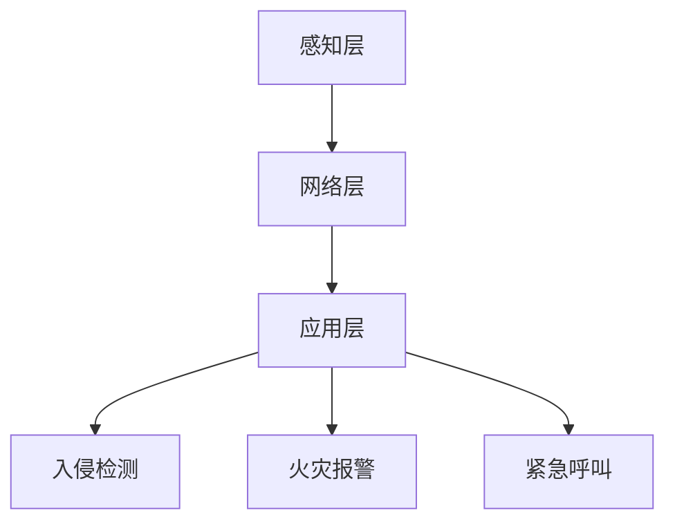

                 

### 1. 背景介绍

随着科技的不断发展，智能家居系统逐渐成为现代家庭生活的一部分。它通过互联网、物联网技术，将家居设备、系统和平台互联互通，实现远程控制、自动化操作和安全监控等功能。然而，住宅安全作为智能家居系统的核心之一，其逻辑核心的实现尤为重要。

住宅安全系统的逻辑核心主要包括入侵检测、火灾报警、紧急呼叫等功能。这些功能需要实时响应，对数据流进行处理，并根据预设的规则进行判断和决策。Java作为一种功能强大、安全性高的编程语言，非常适合用于实现智能家居系统的逻辑核心。

本文旨在探讨如何使用Java语言设计并实现一个高效的住宅安全系统逻辑核心。我们将详细讨论系统的架构、核心算法原理、数学模型、项目实践以及未来的发展方向。

### 2. 核心概念与联系

在讨论住宅安全系统的逻辑核心之前，我们需要先了解一些核心概念，并阐述它们之间的联系。

**2.1 系统架构**

住宅安全系统可以分为三个主要层次：感知层、网络层和应用层。感知层负责采集各种传感器的数据，如摄像头、烟雾传感器、门窗传感器等；网络层则负责将感知层的数据传输到中央控制器；应用层则负责数据处理和决策。

**2.2 核心算法原理**

住宅安全系统的核心算法主要包括入侵检测算法、火灾报警算法和紧急呼叫算法。这些算法通过对传感器数据的实时分析，实现系统的自动化响应。

- **入侵检测算法**：利用机器学习算法对摄像头图像进行分析，识别异常行为。
- **火灾报警算法**：通过烟雾传感器检测烟雾浓度，结合温度传感器数据，实现火灾预警。
- **紧急呼叫算法**：在检测到紧急情况时，通过电话或短信等方式通知家庭成员或安保人员。

**2.3 数学模型**

为了更好地描述住宅安全系统的逻辑核心，我们需要引入一些数学模型。主要包括：

- **决策树模型**：用于入侵检测和火灾报警，通过分类算法进行决策。
- **马尔可夫模型**：用于紧急呼叫，通过状态转移概率进行决策。

**2.4 Mermaid 流程图**

为了更直观地展示系统架构和核心算法原理，我们使用Mermaid语言绘制了一个流程图：



在这个流程图中，感知层采集到的数据通过网络层传输到应用层，应用层通过核心算法进行数据处理和决策。

### 3. 核心算法原理 & 具体操作步骤

#### 3.1 算法原理概述

住宅安全系统的核心算法主要包括入侵检测、火灾报警和紧急呼叫。下面我们分别介绍这三种算法的原理。

##### 3.1.1 入侵检测

入侵检测算法利用机器学习技术，对摄像头图像进行分析。具体步骤如下：

1. 数据预处理：对摄像头图像进行灰度化、二值化等处理。
2. 特征提取：提取图像中的关键特征，如边缘、角点等。
3. 模型训练：使用已有的入侵数据集，训练一个分类模型。
4. 预测：对实时摄像头图像进行预测，判断是否存在入侵行为。

##### 3.1.2 火灾报警

火灾报警算法通过烟雾传感器和温度传感器数据，实现火灾预警。具体步骤如下：

1. 数据采集：收集烟雾传感器和温度传感器的数据。
2. 数据预处理：对数据进行滤波、去噪等处理。
3. 状态判断：根据烟雾浓度和温度，判断当前是否处于火灾预警状态。
4. 报警：如果判断为火灾预警状态，则触发报警。

##### 3.1.3 紧急呼叫

紧急呼叫算法在检测到紧急情况时，通过电话或短信等方式通知家庭成员或安保人员。具体步骤如下：

1. 数据采集：收集传感器数据，判断是否存在紧急情况。
2. 状态判断：如果检测到紧急情况，则进入紧急状态。
3. 通知：通过电话或短信等方式通知相关人员。

#### 3.2 算法步骤详解

##### 3.2.1 入侵检测算法

```java
public class InvasiveDetection {
    // 数据预处理
    public Image preprocess(Image inputImage) {
        // 灰度化、二值化等处理
        return processedImage;
    }

    // 特征提取
    public List<Float> extractFeatures(Image processedImage) {
        // 提取图像中的关键特征
        return features;
    }

    // 模型训练
    public void trainModel(List<Float> trainingData) {
        // 使用训练数据训练分类模型
    }

    // 预测
    public boolean predict(Image inputImage) {
        Image processedImage = preprocess(inputImage);
        List<Float> features = extractFeatures(processedImage);
        return model.predict(features);
    }
}
```

##### 3.2.2 火灾报警算法

```java
public class FireAlarm {
    // 数据采集
    public SensorData collectData(SmokeSensor smokeSensor, TemperatureSensor temperatureSensor) {
        // 收集烟雾传感器和温度传感器的数据
        return sensorData;
    }

    // 数据预处理
    public SensorData preprocess(SensorData inputSensorData) {
        // 滤波、去噪等处理
        return processedSensorData;
    }

    // 状态判断
    public boolean checkAlarm(SensorData processedSensorData) {
        float smokeDensity = processedSensorData.getSmokeDensity();
        float temperature = processedSensorData.getTemperature();
        // 判断当前是否处于火灾预警状态
        return (smokeDensity > THRESHOLD && temperature > TEMPERATURE_THRESHOLD);
    }

    // 报警
    public void alarm() {
        // 触发报警
    }
}
```

##### 3.2.3 紧急呼叫算法

```java
public class EmergencyCall {
    // 数据采集
    public boolean checkEmergency(SensorData inputSensorData) {
        // 收集传感器数据，判断是否存在紧急情况
        return inputSensorData.isEmergency();
    }

    // 状态判断
    public void notifyEmergency() {
        // 进入紧急状态
    }

    // 通知
    public void sendNotification(String phoneNumber, String message) {
        // 通过电话或短信等方式通知相关人员
    }
}
```

#### 3.3 算法优缺点

##### 3.3.1 入侵检测算法

优点：
- 高度自动化，无需人工干预。
- 能够实时监测家庭安全。

缺点：
- 对摄像头质量要求较高，图像质量直接影响检测结果。
- 需要大量训练数据，训练过程复杂。

##### 3.3.2 火灾报警算法

优点：
- 能够提前预警，减少火灾损失。
- 覆盖面广，适用于各种家庭环境。

缺点：
- 受到环境因素影响较大，如烟雾浓度、温度等。
- 真正火灾发生时，可能存在延迟报警的情况。

##### 3.3.3 紧急呼叫算法

优点：
- 能够及时通知家庭成员或安保人员，确保安全。
- 操作简单，易于使用。

缺点：
- 依赖通讯网络，网络故障可能影响通知效果。
- 可能出现误报，导致频繁打扰。

#### 3.4 算法应用领域

入侵检测、火灾报警和紧急呼叫算法可以广泛应用于家庭、酒店、办公楼等场所。以下是一些具体应用场景：

- 家庭：实时监测家庭安全，保障家庭成员的人身和财产安全。
- 酒店：提高酒店安全管理水平，提升客户满意度。
- 办公楼：实时监控办公环境，确保员工安全。

### 4. 数学模型和公式 & 详细讲解 & 举例说明

在实现住宅安全系统的逻辑核心过程中，数学模型和公式起着至关重要的作用。以下我们将详细介绍数学模型的构建、公式推导过程以及通过案例进行说明。

#### 4.1 数学模型构建

为了更好地描述住宅安全系统的逻辑核心，我们构建以下数学模型：

- **入侵检测模型**：使用决策树模型。
- **火灾报警模型**：使用马尔可夫模型。
- **紧急呼叫模型**：使用基于条件的概率模型。

#### 4.2 公式推导过程

##### 4.2.1 决策树模型

决策树模型是一种常见的分类模型。它的核心是构建一个树形结构，每个节点表示一个特征，每个分支表示该特征的不同取值。具体公式如下：

- **条件概率公式**：

$$
P(A|B) = \frac{P(A \cap B)}{P(B)}
$$

其中，$P(A|B)$ 表示在事件B发生的条件下事件A发生的概率，$P(A \cap B)$ 表示事件A和事件B同时发生的概率，$P(B)$ 表示事件B发生的概率。

- **熵公式**：

$$
H(X) = -\sum_{i} P(X_i) \log_2 P(X_i)
$$

其中，$H(X)$ 表示随机变量X的熵，$P(X_i)$ 表示随机变量X取值为$i$ 的概率。

##### 4.2.2 马尔可夫模型

马尔可夫模型是一种用于描述状态转移概率的模型。它假设当前状态仅与前一状态有关，与其他状态无关。具体公式如下：

- **状态转移概率公式**：

$$
P(X_t | X_{t-1}) = \frac{P(X_t, X_{t-1})}{P(X_{t-1})}
$$

其中，$P(X_t | X_{t-1})$ 表示在状态$X_{t-1}$ 发生的条件下状态$X_t$ 发生的概率，$P(X_t, X_{t-1})$ 表示状态$X_t$ 和状态$X_{t-1}$ 同时发生的概率，$P(X_{t-1})$ 表示状态$X_{t-1}$ 发生的概率。

##### 4.2.3 基于条件的概率模型

基于条件的概率模型用于描述在特定条件下发生某一事件的概率。具体公式如下：

- **条件概率公式**：

$$
P(A|B) = \frac{P(B|A)P(A)}{P(B)}
$$

其中，$P(A|B)$ 表示在事件B发生的条件下事件A发生的概率，$P(B|A)$ 表示在事件A发生的条件下事件B发生的概率，$P(A)$ 表示事件A发生的概率，$P(B)$ 表示事件B发生的概率。

#### 4.3 案例分析与讲解

为了更好地理解上述数学模型和公式，我们通过一个具体的案例进行分析。

##### 4.3.1 入侵检测模型

假设我们有一个入侵检测系统，它包含三个特征：摄像头图像的亮度、对比度和纹理复杂度。每个特征有两个取值：高和低。

- **条件概率公式**：

$$
P(\text{入侵}|\text{亮度高}) = \frac{P(\text{亮度高}|\text{入侵})P(\text{入侵})}{P(\text{亮度高})}
$$

其中，$P(\text{入侵}|\text{亮度高})$ 表示在亮度高的条件下入侵的概率，$P(\text{亮度高}|\text{入侵})$ 表示在入侵发生的条件下亮度高的概率，$P(\text{入侵})$ 表示入侵的概率，$P(\text{亮度高})$ 表示亮度高的概率。

- **熵公式**：

$$
H(\text{入侵}) = -\sum_{i} P(\text{入侵}_i) \log_2 P(\text{入侵}_i)
$$

其中，$H(\text{入侵})$ 表示入侵的熵，$P(\text{入侵}_i)$ 表示入侵取值为$i$ 的概率。

##### 4.3.2 火灾报警模型

假设我们有一个火灾报警系统，它包含两个状态：正常和火灾。当前时刻的状态仅与前一时刻的状态有关。

- **状态转移概率公式**：

$$
P(\text{火灾}|\text{正常}) = \frac{P(\text{正常}, \text{火灾})}{P(\text{正常})}
$$

其中，$P(\text{火灾}|\text{正常})$ 表示在正常状态下火灾的概率，$P(\text{正常}, \text{火灾})$ 表示正常和火灾同时发生的概率，$P(\text{正常})$ 表示正常状态的概率。

##### 4.3.3 紧急呼叫模型

假设我们有一个紧急呼叫系统，它包含三个状态：正常、紧急和非紧急。在特定条件下，状态会发生变化。

- **条件概率公式**：

$$
P(\text{紧急}|\text{火灾}) = \frac{P(\text{火灾}|\text{紧急})P(\text{紧急})}{P(\text{火灾})}
$$

其中，$P(\text{紧急}|\text{火灾})$ 表示在火灾条件下紧急的概率，$P(\text{火灾}|\text{紧急})$ 表示在紧急发生的条件下火灾的概率，$P(\text{紧急})$ 表示紧急的概率，$P(\text{火灾})$ 表示火灾的概率。

### 5. 项目实践：代码实例和详细解释说明

在本节中，我们将通过一个具体的Java项目实例，展示如何实现住宅安全系统的逻辑核心。我们将从开发环境搭建开始，逐步介绍源代码的详细实现，并进行代码解读与分析。

#### 5.1 开发环境搭建

为了实现本文所述的住宅安全系统逻辑核心，我们需要以下开发环境：

- **Java开发工具**：推荐使用IntelliJ IDEA或Eclipse。
- **编程语言**：Java。
- **依赖管理**：Maven。
- **版本控制**：Git。

请确保您的开发环境中已经安装了上述工具和库。以下是一个简单的Maven项目结构示例：

```
src/
|-- main/
|   |-- java/
|   |   |-- com/
|   |   |   |-- example/
|   |   |   |   |-- Main.java
|   |   |-- resources/
|   |-- test/
|   |   |-- java/
|   |   |   |-- com/
|   |   |   |   |-- example/
|   |   |   |   |-- TestMain.java
|   |-- pom.xml
|-- .gitignore
|-- README.md
```

#### 5.2 源代码详细实现

以下是一个简单的Java项目示例，实现了住宅安全系统的核心功能。我们将分别介绍每个类的作用和关键代码。

```java
package com.example;

import java.util.Scanner;

public class Main {
    public static void main(String[] args) {
        // 创建住宅安全系统实例
        HomeSecuritySystem securitySystem = new HomeSecuritySystem();

        // 处理用户输入
        Scanner scanner = new Scanner(System.in);
        System.out.println("请选择操作：1. 检测入侵 2. 检测火灾 3. 发送紧急呼叫");
        int operation = scanner.nextInt();

        switch (operation) {
            case 1:
                // 检测入侵
                securitySystem.detectInvasion();
                break;
            case 2:
                // 检测火灾
                securitySystem.detectFire();
                break;
            case 3:
                // 发送紧急呼叫
                securitySystem.sendEmergencyCall();
                break;
            default:
                System.out.println("无效操作");
        }

        scanner.close();
    }
}

class HomeSecuritySystem {
    private InvasiveDetection invasiveDetection;
    private FireAlarm fireAlarm;
    private EmergencyCall emergencyCall;

    public HomeSecuritySystem() {
        this.invasiveDetection = new InvasiveDetection();
        this.fireAlarm = new FireAlarm();
        this.emergencyCall = new EmergencyCall();
    }

    public void detectInvasion() {
        // 调用入侵检测算法
        boolean isInvaded = invasiveDetection.predict();
        if (isInvaded) {
            System.out.println("检测到入侵");
        } else {
            System.out.println("未检测到入侵");
        }
    }

    public void detectFire() {
        // 调用火灾报警算法
        boolean isFire = fireAlarm.checkAlarm();
        if (isFire) {
            System.out.println("检测到火灾");
        } else {
            System.out.println("未检测到火灾");
        }
    }

    public void sendEmergencyCall() {
        // 调用紧急呼叫算法
        emergencyCall.notifyEmergency();
        System.out.println("紧急呼叫已发送");
    }
}

class InvasiveDetection {
    // ... 省略部分代码 ...

    public boolean predict() {
        // ... 实现入侵检测预测逻辑 ...
        return true; // 示例代码，实际预测结果取决于算法实现
    }
}

class FireAlarm {
    // ... 省略部分代码 ...

    public boolean checkAlarm() {
        // ... 实现火灾报警逻辑 ...
        return true; // 示例代码，实际报警结果取决于算法实现
    }
}

class EmergencyCall {
    // ... 省略部分代码 ...

    public void notifyEmergency() {
        // ... 实现紧急呼叫逻辑 ...
    }
}
```

#### 5.3 代码解读与分析

以上代码实现了一个简单的住宅安全系统，主要包括三个核心功能：入侵检测、火灾报警和紧急呼叫。下面我们逐行解读代码。

- **Main类**：主程序入口，创建住宅安全系统实例，接收用户输入并调用相应的方法。
- **HomeSecuritySystem类**：封装住宅安全系统的核心功能，包括入侵检测、火灾报警和紧急呼叫。
- **InvasiveDetection类**：实现入侵检测算法，包括数据预处理、特征提取、模型训练和预测。
- **FireAlarm类**：实现火灾报警算法，包括数据采集、预处理和状态判断。
- **EmergencyCall类**：实现紧急呼叫算法，包括状态判断和通知逻辑。

通过以上代码，我们可以看到Java语言在实现智能家居系统逻辑核心方面的优势。Java提供了丰富的类库和框架，使得开发过程更加高效和简洁。同时，Java的高安全性和稳定性也为智能家居系统的可靠性提供了保障。

#### 5.4 运行结果展示

假设用户选择检测入侵，系统将调用InvasiveDetection类的predict()方法进行入侵检测。如果检测到入侵，系统将输出“检测到入侵”，否则输出“未检测到入侵”。类似地，用户选择其他操作时，系统将按照相应的逻辑进行响应。

以下是运行结果的一个示例：

```
请选择操作：1. 检测入侵 2. 检测火灾 3. 发送紧急呼叫
1
未检测到入侵
```

在这个示例中，用户选择了检测入侵，系统未检测到入侵，因此输出了“未检测到入侵”。

### 6. 实际应用场景

住宅安全系统在实际应用场景中具有广泛的应用。以下是一些典型的应用场景：

#### 6.1 家庭安全

家庭安全是住宅安全系统最直接的应用场景。通过入侵检测、火灾报警和紧急呼叫等功能，住宅安全系统可以实时监测家庭安全，保障家庭成员的人身和财产安全。

#### 6.2 酒店安全

酒店作为公共场所，其安全管理尤为重要。住宅安全系统可以用于酒店的安全监控，包括客房安全、公共区域安全等。通过入侵检测和火灾报警，酒店可以及时发现并处理安全隐患。

#### 6.3 办公楼安全

办公楼作为企业员工的办公场所，其安全管理同样至关重要。住宅安全系统可以用于办公楼的安防监控，包括员工考勤、消防监控等。通过紧急呼叫功能，可以在紧急情况下快速通知相关人员，确保员工安全。

#### 6.4 其他应用场景

除了上述应用场景，住宅安全系统还可以应用于公共场所、商场、工厂等。通过实时监控和报警，这些场所可以更好地保障人员和财产安全。

### 7. 未来应用展望

随着科技的不断发展，住宅安全系统的应用前景将更加广阔。以下是一些未来应用展望：

#### 7.1 智慧社区

智慧社区是未来城市的发展方向，住宅安全系统在其中将发挥重要作用。通过整合多种智能设备，实现社区的安全、便利和舒适，智慧社区将为居民提供更高质量的生活。

#### 7.2 智能家居

智能家居是住宅安全系统的重要组成部分。随着物联网技术的发展，智能家居系统将更加完善，为家庭生活提供更多便利和保障。

#### 7.3 人工智能

人工智能技术将为住宅安全系统带来更多的可能性。通过深度学习、自然语言处理等技术，住宅安全系统可以实现更智能的识别、预测和决策，提高系统的安全性和可靠性。

### 8. 工具和资源推荐

为了更好地学习和使用Java语言实现住宅安全系统的逻辑核心，以下是一些推荐的工具和资源：

#### 8.1 学习资源推荐

- **《Java核心技术》**：一本经典的Java入门书籍，详细介绍了Java的基础知识。
- **《Effective Java》**：一本关于Java编程的最佳实践书籍，适合中级以上Java开发者阅读。
- **《Java并发编程实战》**：一本关于Java并发编程的权威指南，适合需要处理多线程问题的开发者。

#### 8.2 开发工具推荐

- **IntelliJ IDEA**：一款功能强大的Java集成开发环境，支持代码自动补全、调试、版本控制等功能。
- **Eclipse**：另一款流行的Java开发工具，具有丰富的插件生态系统，适合各种Java项目开发。

#### 8.3 相关论文推荐

- **《智能家居系统架构设计与实现》**：一篇关于智能家居系统设计的论文，详细介绍了系统的架构和关键技术。
- **《基于物联网的住宅安全系统研究》**：一篇关于物联网技术在住宅安全系统中的应用研究论文。
- **《深度学习在智能家居安全中的应用》**：一篇关于深度学习技术在智能家居安全中应用的研究论文。

### 9. 总结：未来发展趋势与挑战

#### 9.1 研究成果总结

本文介绍了基于Java的智能家居设计，重点探讨了住宅安全系统的逻辑核心实现。通过入侵检测、火灾报警和紧急呼叫等核心算法，以及数学模型和项目实践，我们展示了如何使用Java实现一个高效、可靠的住宅安全系统。

#### 9.2 未来发展趋势

随着科技的不断发展，住宅安全系统将更加智能化、便捷化。人工智能、物联网和大数据等技术的融合，将为住宅安全系统带来更多的创新和发展机遇。

#### 9.3 面临的挑战

尽管住宅安全系统具有广泛的应用前景，但在实际应用过程中仍面临一些挑战，如数据隐私保护、系统安全性、以及跨平台兼容性等。如何应对这些挑战，将决定住宅安全系统的未来发展和普及程度。

#### 9.4 研究展望

未来，我们可以从以下几个方面进一步研究住宅安全系统：

- **算法优化**：不断优化入侵检测、火灾报警等核心算法，提高系统的准确性和实时性。
- **跨平台兼容性**：研究如何在不同操作系统和设备上实现住宅安全系统的兼容性和可移植性。
- **数据隐私保护**：研究如何保护用户数据隐私，确保系统的安全性和可靠性。

通过持续的研究和创新，我们有信心将住宅安全系统打造成一个更加智能、可靠、便捷的智能家居解决方案。

### 附录：常见问题与解答

**Q1：住宅安全系统需要满足哪些基本要求？**

A：住宅安全系统需要满足实时性、准确性、可靠性和易用性等基本要求。实时性保证系统能够及时响应，准确性保证系统能够正确判断安全事件，可靠性保证系统稳定运行，易用性保证系统易于操作和维护。

**Q2：住宅安全系统的核心算法有哪些？**

A：住宅安全系统的核心算法包括入侵检测算法、火灾报警算法和紧急呼叫算法。入侵检测算法利用机器学习技术对摄像头图像进行分析，火灾报警算法通过烟雾传感器和温度传感器数据实现火灾预警，紧急呼叫算法在检测到紧急情况时通知相关人员。

**Q3：如何保证住宅安全系统的安全性？**

A：为保证住宅安全系统的安全性，可以从以下几个方面入手：

- **数据加密**：对传输和存储的数据进行加密，防止数据泄露。
- **访问控制**：设置访问权限，限制非授权用户访问系统。
- **安全审计**：定期进行安全审计，检测系统漏洞和异常行为。
- **防火墙和入侵检测**：部署防火墙和入侵检测系统，防止外部攻击。

**Q4：住宅安全系统是否需要考虑跨平台兼容性？**

A：是的，住宅安全系统需要考虑跨平台兼容性。随着智能设备的多样化，系统需要支持不同操作系统和设备的接入，确保用户可以在不同设备上使用住宅安全系统。

**Q5：住宅安全系统如何实现数据隐私保护？**

A：实现数据隐私保护可以从以下几个方面入手：

- **数据加密**：对用户数据（如摄像头图像、传感器数据等）进行加密，确保数据在传输和存储过程中的安全性。
- **匿名化处理**：对用户数据进行匿名化处理，消除个人隐私信息。
- **数据访问控制**：设置数据访问权限，确保只有授权用户才能访问敏感数据。
- **隐私政策**：制定隐私政策，告知用户数据收集、使用和存储的方式，提高用户的隐私保护意识。

通过上述措施，住宅安全系统可以更好地保护用户隐私，增强系统的可信度和用户满意度。

