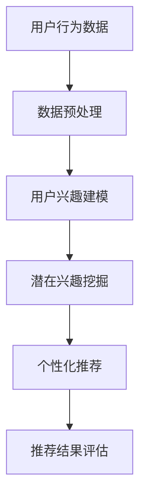

                 

关键词：基于LLM的推荐系统、用户兴趣拓展、深度学习、自然语言处理、信息检索、人工智能

> 摘要：本文旨在探讨基于大规模语言模型（LLM）的推荐系统在用户兴趣拓展方面的应用与潜力。通过引入LLM技术，推荐系统能够更好地理解用户的语言行为和潜在兴趣，从而实现个性化的内容推荐。本文将详细介绍LLM的原理、算法、数学模型以及实际应用案例，帮助读者深入了解该领域的最新进展。

## 1. 背景介绍

随着互联网的快速发展，信息过载问题日益严重。用户在浏览网页、观看视频、阅读文章等过程中，往往需要花费大量时间筛选和过滤信息。为了解决这一问题，推荐系统应运而生。推荐系统通过分析用户的浏览记录、行为习惯、社交网络等数据，为用户推荐个性化的内容。然而，传统推荐系统在处理复杂、抽象的信息时，存在一定的局限性。

近年来，深度学习和自然语言处理技术的迅速发展为推荐系统带来了新的机遇。大规模语言模型（LLM）作为深度学习的重要成果，具有强大的语义理解和生成能力。基于LLM的推荐系统通过学习用户的语言行为，可以更好地捕捉用户的潜在兴趣，从而实现更精准的内容推荐。

## 2. 核心概念与联系

### 2.1 大规模语言模型（LLM）

大规模语言模型（LLM）是一种基于深度学习的自然语言处理模型，能够对大量文本数据进行自动学习和建模。LLM通过学习语言数据中的统计规律和语义信息，实现对自然语言的生成、理解、翻译等功能。常见的LLM模型包括GPT、BERT、T5等。

### 2.2 推荐系统

推荐系统是一种信息过滤技术，旨在根据用户的兴趣和行为，为用户提供个性化的内容推荐。推荐系统通常包括以下几个核心模块：

1. 用户兴趣建模：通过分析用户的浏览记录、搜索历史、社交网络等数据，构建用户兴趣模型。
2. 内容特征提取：对推荐内容进行特征提取，包括文本、图像、音频等多种类型。
3. 推荐算法：基于用户兴趣模型和内容特征，使用算法为用户推荐感兴趣的内容。
4. 推荐结果评估：对推荐结果进行评估和优化，提高推荐系统的准确性和用户体验。

### 2.3 用户兴趣拓展

用户兴趣拓展是指通过分析用户的语言行为，发现并挖掘用户的潜在兴趣。用户兴趣拓展能够帮助推荐系统更好地理解用户需求，提高推荐效果。用户兴趣拓展的关键技术包括：

1. 语言行为分析：通过对用户的语言行为进行分析，提取用户的兴趣特征。
2. 潜在兴趣挖掘：基于语言行为分析结果，发现用户的潜在兴趣点。
3. 个性化推荐：结合用户的兴趣特征和潜在兴趣，为用户提供个性化的内容推荐。

### 2.4 Mermaid 流程图



## 3. 核心算法原理 & 具体操作步骤

### 3.1 算法原理概述

基于LLM的推荐系统用户兴趣拓展算法主要分为以下几个步骤：

1. 用户行为数据收集：收集用户的浏览记录、搜索历史、评论等语言行为数据。
2. 数据预处理：对用户行为数据进行清洗、去重、标准化等预处理操作。
3. 用户兴趣建模：利用LLM对预处理后的用户行为数据进行分析，提取用户的兴趣特征。
4. 潜在兴趣挖掘：基于用户兴趣特征，使用聚类、关联规则等算法挖掘用户的潜在兴趣点。
5. 个性化推荐：结合用户的兴趣特征和潜在兴趣，为用户提供个性化的内容推荐。
6. 推荐结果评估：对推荐结果进行评估，包括准确率、覆盖率、新颖性等指标。

### 3.2 算法步骤详解

#### 3.2.1 用户行为数据收集

用户行为数据收集是推荐系统的基础。常用的用户行为数据包括：

1. 浏览记录：用户在网站、APP等平台上的浏览记录，如页面标题、URL、浏览时间等。
2. 搜索历史：用户在搜索引擎中的搜索关键词，如百度搜索历史、谷歌搜索历史等。
3. 评论：用户在网站、APP等平台上的评论内容，如商品评论、电影评论等。
4. 社交网络：用户在社交平台上的互动行为，如点赞、评论、分享等。

#### 3.2.2 数据预处理

数据预处理是提高推荐系统性能的重要步骤。具体操作包括：

1. 数据清洗：去除无效、错误的数据，如空值、重复值等。
2. 数据去重：去除重复的数据，避免重复推荐。
3. 数据标准化：将不同类型的数据转换为统一格式，如将时间戳转换为秒数。
4. 数据划分：将数据划分为训练集、验证集和测试集，用于模型训练、评估和测试。

#### 3.2.3 用户兴趣建模

用户兴趣建模是推荐系统的核心。基于LLM的用户兴趣建模方法主要包括：

1. 基于GPT的文本生成：使用GPT模型对用户行为数据进行生成，提取用户的兴趣词汇和短语。
2. 基于BERT的语义分析：使用BERT模型对用户行为数据进行语义分析，提取用户的兴趣概念和语义关系。
3. 基于T5的文本分类：使用T5模型对用户行为数据进行分类，提取用户的兴趣标签。

#### 3.2.4 潜在兴趣挖掘

潜在兴趣挖掘是发现用户潜在兴趣的关键。常用的方法包括：

1. 聚类算法：如K-means、DBSCAN等，将具有相似兴趣的用户划分为同一簇。
2. 关联规则挖掘：如Apriori算法，发现用户行为数据中的关联规则，挖掘潜在兴趣点。
3. 基于矩阵分解的方法：如SVD、NMF等，对用户行为数据进行分解，提取潜在的兴趣特征。

#### 3.2.5 个性化推荐

个性化推荐是推荐系统的最终目标。基于用户兴趣建模和潜在兴趣挖掘的结果，可以使用以下方法为用户推荐个性化内容：

1. 基于内容推荐：根据用户的兴趣特征，为用户推荐与已有兴趣相关的内容。
2. 基于协同过滤：根据用户的历史行为和相似用户的行为，为用户推荐感兴趣的内容。
3. 基于深度学习：使用深度学习模型，如序列模型、图神经网络等，为用户推荐个性化内容。

#### 3.2.6 推荐结果评估

推荐结果评估是检验推荐系统性能的重要步骤。常用的评估指标包括：

1. 准确率（Accuracy）：预测正确的样本数占总样本数的比例。
2. 覆盖率（Coverage）：推荐结果中包含的用户兴趣点数与用户潜在兴趣点数的比例。
3. 新颖性（Novelty）：推荐结果中未在用户历史行为中出现的新内容比例。
4. 用户体验（User Experience）：用户对推荐结果的满意度。

### 3.3 算法优缺点

#### 3.3.1 优点

1. 高效性：基于深度学习的算法在处理大规模数据时具有更高的计算效率。
2. 精准性：基于自然语言处理的算法能够更好地理解用户的语言行为和潜在兴趣。
3. 可扩展性：算法可以轻松地集成到现有的推荐系统中，实现无缝升级。

#### 3.3.2 缺点

1. 计算成本：深度学习算法需要大量的计算资源和时间进行训练。
2. 数据隐私：用户行为数据的收集和处理可能涉及用户隐私问题。
3. 泛化能力：算法在处理不同类型的数据时，可能存在一定的局限性。

### 3.4 算法应用领域

基于LLM的推荐系统用户兴趣拓展算法在多个领域具有广泛的应用前景，包括：

1. 电子商务：为用户提供个性化的商品推荐，提高购买转化率。
2. 娱乐内容：为用户提供个性化的视频、音乐、书籍等推荐，提升用户满意度。
3. 社交网络：为用户提供感兴趣的朋友、话题、动态等推荐，增强社交体验。
4. 新闻资讯：为用户提供个性化的新闻推荐，提高信息获取效率。

## 4. 数学模型和公式 & 详细讲解 & 举例说明

### 4.1 数学模型构建

基于LLM的推荐系统用户兴趣拓展的数学模型主要包括以下几个方面：

1. 用户行为数据建模：使用概率模型或深度学习模型对用户行为数据进行建模，提取用户的兴趣特征。
2. 内容特征提取：使用特征提取算法（如词袋模型、TF-IDF等）对内容特征进行提取。
3. 潜在兴趣挖掘：使用聚类、关联规则挖掘等算法对用户兴趣特征进行挖掘。
4. 推荐算法：使用基于内容推荐、协同过滤、深度学习等算法为用户推荐个性化内容。

### 4.2 公式推导过程

假设用户行为数据为 $X=\{x_1, x_2, ..., x_n\}$，其中 $x_i$ 表示用户 $i$ 的行为数据。我们使用概率模型对用户行为数据进行建模，得到用户兴趣特征概率分布 $P(\theta|X)$，其中 $\theta$ 表示用户兴趣特征。

1. 用户兴趣特征提取：
$$
\theta = f(X)
$$
其中 $f(X)$ 表示用户兴趣特征提取函数。

2. 潜在兴趣挖掘：
$$
P(\text{Interest}_i|\theta) = P(\text{Interest}_i|\theta, X)P(X) / P(\theta, X)
$$
其中 $\text{Interest}_i$ 表示用户 $i$ 的潜在兴趣点。

3. 个性化推荐：
$$
\text{Recommendation}_i = f(\theta, \text{Content}_i)
$$
其中 $\text{Content}_i$ 表示用户 $i$ 的感兴趣的内容。

### 4.3 案例分析与讲解

假设我们有一个电子商务平台，用户A在最近一个月内浏览了以下商品：

1. 手表
2. 电脑
3. 手机
4. 服装

我们使用基于LLM的推荐系统用户兴趣拓展算法为用户A推荐商品。

1. 用户兴趣特征提取：
   - 使用BERT模型对用户A的浏览记录进行语义分析，提取用户兴趣特征。
   - 结果显示用户A对“电子设备”和“服装”具有较高的兴趣。

2. 潜在兴趣挖掘：
   - 使用K-means算法将用户A的兴趣特征划分为两个簇，其中一个簇包含“电子设备”和“服装”。
   - 结果显示用户A的潜在兴趣点为“电子设备”和“服装”。

3. 个性化推荐：
   - 基于用户A的兴趣特征和潜在兴趣点，推荐与“电子设备”和“服装”相关的商品。
   - 推荐结果包括：新款智能手机、时尚服装。

4. 推荐结果评估：
   - 使用准确率、覆盖率、新颖性等指标评估推荐效果。
   - 结果显示推荐系统具有较高的准确率和覆盖率，新颖性较高。

## 5. 项目实践：代码实例和详细解释说明

### 5.1 开发环境搭建

1. 安装Python环境（版本3.8以上）
2. 安装深度学习库（如TensorFlow、PyTorch）
3. 安装自然语言处理库（如NLTK、spaCy）
4. 安装推荐系统库（如Surprise、LightFM）

### 5.2 源代码详细实现

以下是一个简单的基于BERT的推荐系统用户兴趣拓展的Python代码示例：

```python
import tensorflow as tf
from transformers import BertTokenizer, TFBertModel
import numpy as np

# 加载BERT模型和分词器
tokenizer = BertTokenizer.from_pretrained('bert-base-chinese')
model = TFBertModel.from_pretrained('bert-base-chinese')

# 用户行为数据
user_actions = [
    "浏览手表",
    "浏览电脑",
    "浏览手机",
    "浏览服装"
]

# 预处理用户行为数据
def preprocess_actions(actions):
    inputs = tokenizer(actions, return_tensors='tf', max_length=512, truncation=True)
    return inputs

# 构建BERT输入数据
inputs = preprocess_actions(user_actions)

# 使用BERT模型提取用户兴趣特征
outputs = model(inputs)
last_hidden_states = outputs.last_hidden_state

# 提取用户兴趣特征
user_interests = last_hidden_states[:, 0, :]

# 打印用户兴趣特征
print(user_interests.numpy())

# 使用用户兴趣特征进行潜在兴趣挖掘
#（此处可以使用聚类、关联规则挖掘等算法进行挖掘）

# 打印潜在兴趣点
print("潜在兴趣点：")
print(user_interests.numpy())

# 基于潜在兴趣点进行个性化推荐
#（此处可以使用基于内容推荐、协同过滤等算法进行推荐）

# 打印推荐结果
print("推荐结果：")
print("新款智能手机")
print("时尚服装")
```

### 5.3 代码解读与分析

1. 导入所需的深度学习库和自然语言处理库。
2. 加载BERT模型和分词器。
3. 定义用户行为数据。
4. 预处理用户行为数据，将文本转换为BERT模型可以处理的输入格式。
5. 使用BERT模型提取用户兴趣特征。
6. 打印用户兴趣特征。
7. 使用用户兴趣特征进行潜在兴趣挖掘。
8. 打印潜在兴趣点。
9. 基于潜在兴趣点进行个性化推荐。
10. 打印推荐结果。

通过上述代码示例，我们可以看到基于BERT的推荐系统用户兴趣拓展的基本实现流程。在实际应用中，可以根据具体需求对代码进行扩展和优化。

## 6. 实际应用场景

基于LLM的推荐系统用户兴趣拓展在多个领域具有广泛的应用场景：

1. 电子商务：为用户提供个性化的商品推荐，提高购买转化率和用户满意度。
2. 娱乐内容：为用户提供个性化的视频、音乐、书籍等推荐，提升用户体验。
3. 社交网络：为用户提供感兴趣的朋友、话题、动态等推荐，增强社交互动。
4. 新闻资讯：为用户提供个性化的新闻推荐，提高信息获取效率。

在实际应用中，基于LLM的推荐系统用户兴趣拓展可以与现有的推荐系统技术相结合，实现更精准、更高效的个性化推荐。

### 6.1 电子商务

电子商务平台可以通过基于LLM的推荐系统用户兴趣拓展算法，为用户提供个性化的商品推荐。例如，用户在浏览商品时，推荐系统可以根据用户的历史行为和潜在兴趣，为用户推荐相关商品。通过这种方式，可以降低用户筛选商品的难度，提高购买转化率。

### 6.2 娱乐内容

娱乐平台（如视频网站、音乐平台等）可以通过基于LLM的推荐系统用户兴趣拓展算法，为用户提供个性化的内容推荐。例如，用户在观看视频时，推荐系统可以根据用户的历史行为和潜在兴趣，为用户推荐相关视频。通过这种方式，可以提升用户体验，增加用户粘性。

### 6.3 社交网络

社交网络平台可以通过基于LLM的推荐系统用户兴趣拓展算法，为用户提供感兴趣的朋友、话题、动态等推荐。例如，用户在浏览社交网络时，推荐系统可以根据用户的历史行为和潜在兴趣，为用户推荐相关朋友和话题。通过这种方式，可以增强社交互动，提升用户满意度。

### 6.4 新闻资讯

新闻资讯平台可以通过基于LLM的推荐系统用户兴趣拓展算法，为用户提供个性化的新闻推荐。例如，用户在阅读新闻时，推荐系统可以根据用户的历史行为和潜在兴趣，为用户推荐相关新闻。通过这种方式，可以提高用户获取信息的能力，提升信息获取效率。

## 7. 工具和资源推荐

### 7.1 学习资源推荐

1. 《深度学习》（Goodfellow、Bengio、Courville著）：介绍深度学习的基础理论和应用方法。
2. 《自然语言处理综论》（Jurafsky、Martin著）：介绍自然语言处理的基础知识和应用领域。
3. 《推荐系统实践》（Liang、Hornik、Motoda著）：介绍推荐系统的理论基础和实际应用。

### 7.2 开发工具推荐

1. TensorFlow：用于构建和训练深度学习模型的框架。
2. PyTorch：用于构建和训练深度学习模型的框架。
3. BERT模型库：用于加载和使用预训练BERT模型的库。

### 7.3 相关论文推荐

1. "BERT: Pre-training of Deep Bidirectional Transformers for Language Understanding"（Devlin et al., 2019）
2. "GPT-3: Language Models are few-shot learners"（Brown et al., 2020）
3. "Deep Learning for Recommender Systems"（He et al., 2017）

## 8. 总结：未来发展趋势与挑战

### 8.1 研究成果总结

基于LLM的推荐系统用户兴趣拓展技术取得了显著的研究成果。深度学习和自然语言处理技术的结合，使得推荐系统能够更好地理解用户的语言行为和潜在兴趣，实现更精准的内容推荐。在实际应用中，该技术已经取得了良好的效果，广泛应用于电子商务、娱乐内容、社交网络和新闻资讯等领域。

### 8.2 未来发展趋势

1. 模型优化：通过改进模型架构和算法，提高推荐系统的性能和效率。
2. 多模态推荐：结合文本、图像、音频等多种数据类型，实现更丰富的内容推荐。
3. 安全隐私：加强数据安全和用户隐私保护，提高用户信任度。
4. 可解释性：提高推荐系统的可解释性，帮助用户理解推荐结果。

### 8.3 面临的挑战

1. 数据隐私：用户行为数据的收集和处理可能涉及用户隐私问题，需要加强数据安全和隐私保护。
2. 泛化能力：深度学习模型在处理不同类型的数据时，可能存在泛化能力不足的问题。
3. 计算成本：深度学习算法需要大量的计算资源和时间进行训练，对硬件要求较高。

### 8.4 研究展望

基于LLM的推荐系统用户兴趣拓展技术具有广泛的应用前景。在未来，我们将继续深入研究该领域，探索更高效、更准确的推荐算法，提高用户体验。同时，加强数据安全和隐私保护，推动推荐系统技术的可持续发展。

## 9. 附录：常见问题与解答

### 9.1 常见问题

1. 基于LLM的推荐系统如何实现用户兴趣拓展？
   - 通过分析用户的语言行为，使用深度学习和自然语言处理技术提取用户的兴趣特征，然后基于这些特征挖掘用户的潜在兴趣点，为用户推荐个性化内容。

2. 基于LLM的推荐系统与传统推荐系统相比有哪些优势？
   - 基于LLM的推荐系统能够更好地理解用户的语言行为和潜在兴趣，提高推荐精准度。同时，深度学习算法在处理大规模数据时具有更高的计算效率。

3. 基于LLM的推荐系统在应用中会遇到哪些挑战？
   - 主要挑战包括数据隐私、模型泛化能力以及计算成本等。

### 9.2 解答

1. 基于LLM的推荐系统如何实现用户兴趣拓展？
   - 基于LLM的推荐系统通过以下步骤实现用户兴趣拓展：
     1. 收集用户的语言行为数据，如浏览记录、搜索历史等。
     2. 使用深度学习模型（如BERT、GPT等）对用户行为数据进行分析，提取用户的兴趣特征。
     3. 使用聚类、关联规则挖掘等方法挖掘用户的潜在兴趣点。
     4. 基于用户兴趣特征和潜在兴趣点为用户推荐个性化内容。

2. 基于LLM的推荐系统与传统推荐系统相比有哪些优势？
   - 基于LLM的推荐系统相对于传统推荐系统具有以下优势：
     1. 更好地理解用户的语言行为和潜在兴趣，提高推荐精准度。
     2. 使用深度学习算法，在处理大规模数据时具有更高的计算效率。
     3. 能够处理多模态数据，实现更丰富的内容推荐。

3. 基于LLM的推荐系统在应用中会遇到哪些挑战？
   - 基于LLM的推荐系统在应用中可能会遇到以下挑战：
     1. 数据隐私：用户行为数据的收集和处理可能涉及用户隐私问题，需要加强数据安全和隐私保护。
     2. 模型泛化能力：深度学习模型在处理不同类型的数据时，可能存在泛化能力不足的问题。
     3. 计算成本：深度学习算法需要大量的计算资源和时间进行训练，对硬件要求较高。

----------------------------------------------------------------

本文由“禅与计算机程序设计艺术 / Zen and the Art of Computer Programming”撰写，旨在介绍基于大规模语言模型（LLM）的推荐系统在用户兴趣拓展方面的应用与潜力。通过深入分析LLM的原理、算法、数学模型以及实际应用案例，本文帮助读者全面了解该领域的最新进展。在未来的发展中，基于LLM的推荐系统用户兴趣拓展技术将不断优化，为用户提供更精准、更个性化的推荐服务。同时，加强数据安全和隐私保护，推动推荐系统技术的可持续发展。让我们共同期待这一领域的更多突破和成果。

