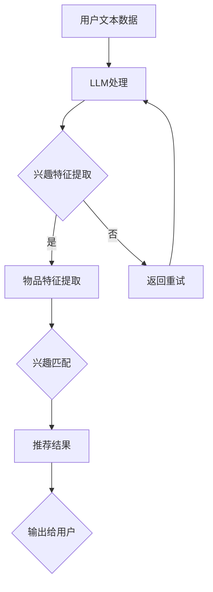

                 

关键词：基于LLM的推荐系统、用户兴趣探索、算法原理、数学模型、项目实践、应用场景、未来展望

> 摘要：本文旨在探讨如何利用大型语言模型（LLM）来探索和挖掘用户的兴趣。通过深入剖析基于LLM的推荐系统的原理、数学模型、以及具体实现，本文将为开发者提供一种新的用户兴趣探索方法。文章还将探讨其在实际应用中的效果，并对其未来发展提出展望。

## 1. 背景介绍

随着互联网的快速发展，推荐系统已经成为各类应用的核心功能之一。从电商平台的商品推荐，到新闻平台的资讯推送，再到社交媒体的动态推荐，推荐系统无不在用户体验和商业收益中发挥着重要作用。然而，传统的推荐系统往往依赖于用户的历史行为数据，如浏览记录、购买记录等，这些数据虽然能够较好地预测用户短期的兴趣，但在长期兴趣探索方面存在一定的局限性。

近年来，深度学习和自然语言处理技术的飞速发展为推荐系统带来了新的机遇。特别是大型语言模型（LLM），如GPT-3、BERT等，通过学习海量的文本数据，能够捕捉到用户深层次的兴趣和偏好。基于LLM的推荐系统不仅能够更好地理解用户的需求，还能够发现用户未明确表达的兴趣点，从而提供更为精准的推荐。

本文将围绕基于LLM的推荐系统展开，详细探讨其原理、实现方法，以及在实际应用中的效果和未来展望。

## 2. 核心概念与联系

### 2.1. 推荐系统基本概念

推荐系统是一种信息过滤方法，旨在根据用户的历史行为和偏好，向用户推荐其可能感兴趣的信息。推荐系统通常包含三个核心组件：用户、物品和评分。

- **用户**：推荐系统的主体，拥有特定的兴趣和偏好。
- **物品**：推荐系统中的对象，如商品、资讯、视频等。
- **评分**：用户对物品的评价，可以是明确定量的评分（如1到5星），也可以是隐式的行为数据（如点击、浏览、购买等）。

### 2.2. 大型语言模型（LLM）

大型语言模型（LLM）是一类基于深度学习的自然语言处理模型，通过学习大量的文本数据，能够对自然语言进行建模和生成。LLM的核心任务是理解、生成和预测自然语言，其应用场景广泛，包括文本分类、情感分析、机器翻译、问答系统等。

LLM的优势在于其强大的文本理解和生成能力，能够捕捉到用户在文本中隐含的兴趣和偏好。例如，一个用户在社交媒体上发布的帖子，可能包含其对某一主题的强烈兴趣，这种兴趣很难通过传统的行为数据进行捕捉。

### 2.3. 基于LLM的推荐系统

基于LLM的推荐系统是将LLM与推荐系统相结合的一种新方法。其核心思想是利用LLM的文本理解能力，挖掘用户未明确表达的兴趣点，从而提高推荐的准确性和个性化程度。

基于LLM的推荐系统通常包含以下几个关键步骤：

1. **用户兴趣建模**：利用LLM对用户的历史文本数据进行处理，提取用户的兴趣特征。
2. **物品特征提取**：对推荐系统中的物品进行特征提取，通常包括文本、图像、音频等多模态特征。
3. **兴趣匹配**：将用户的兴趣特征与物品特征进行匹配，找出潜在的兴趣点。
4. **推荐生成**：根据兴趣匹配结果，生成推荐结果，并输出给用户。

### 2.4. Mermaid 流程图

以下是基于LLM的推荐系统的Mermaid流程图：



## 3. 核心算法原理 & 具体操作步骤

### 3.1. 算法原理概述

基于LLM的推荐系统主要依赖于LLM的文本理解能力，通过对用户历史文本数据进行分析，提取出用户的兴趣特征。这些特征将用于后续的物品特征提取和兴趣匹配过程。

算法的核心步骤如下：

1. **用户兴趣建模**：利用LLM对用户的历史文本数据进行处理，提取出与用户兴趣相关的关键词和短语。
2. **物品特征提取**：对推荐系统中的物品进行特征提取，通常包括文本、图像、音频等多模态特征。
3. **兴趣匹配**：将用户的兴趣特征与物品特征进行匹配，找出潜在的兴趣点。
4. **推荐生成**：根据兴趣匹配结果，生成推荐结果，并输出给用户。

### 3.2. 算法步骤详解

#### 3.2.1. 用户兴趣建模

用户兴趣建模是整个算法的基础。首先，我们需要收集用户的历史文本数据，包括用户发布的帖子、评论、聊天记录等。然后，利用LLM对这些文本数据进行处理，提取出与用户兴趣相关的关键词和短语。

具体步骤如下：

1. **数据预处理**：对原始文本数据进行清洗和预处理，包括去除停用词、标点符号、进行分词等。
2. **词向量化**：将预处理后的文本数据转换为词向量表示，常用的词向量模型有Word2Vec、BERT等。
3. **兴趣特征提取**：利用LLM对词向量进行建模，提取出与用户兴趣相关的关键词和短语。这可以通过生成用户兴趣词典或者利用预训练的LLM模型实现。

#### 3.2.2. 物品特征提取

物品特征提取是整个算法的核心。我们需要对推荐系统中的物品进行特征提取，以便后续的兴趣匹配。物品特征提取通常包括文本、图像、音频等多模态特征。

具体步骤如下：

1. **文本特征提取**：对于文本类型的物品，我们可以利用LLM提取出与物品相关的关键词和短语，这些特征将用于后续的兴趣匹配。
2. **图像特征提取**：对于图像类型的物品，我们可以利用卷积神经网络（CNN）提取图像的特征向量。
3. **音频特征提取**：对于音频类型的物品，我们可以利用深度神经网络（DNN）提取音频的特征向量。

#### 3.2.3. 兴趣匹配

兴趣匹配是将用户的兴趣特征与物品特征进行匹配，找出潜在的兴趣点。兴趣匹配可以通过以下方法实现：

1. **基于相似度匹配**：计算用户兴趣特征与物品特征之间的相似度，选择相似度最高的物品作为推荐结果。
2. **基于图匹配**：构建用户兴趣特征与物品特征之间的图结构，利用图匹配算法找出潜在的兴趣点。

#### 3.2.4. 推荐生成

根据兴趣匹配结果，生成推荐结果，并输出给用户。推荐结果可以是按相似度排序的物品列表，也可以是按类别分类的推荐结果。

### 3.3. 算法优缺点

#### 优点：

1. **强大的文本理解能力**：基于LLM的推荐系统能够更好地理解用户的文本数据，提取出深层次的兴趣点。
2. **个性化推荐**：通过对用户兴趣的深度挖掘，能够提供更为个性化的推荐结果。
3. **多模态特征提取**：能够同时处理文本、图像、音频等多模态特征，提高推荐系统的效果。

#### 缺点：

1. **计算资源消耗大**：基于LLM的推荐系统需要大量的计算资源，对硬件设备要求较高。
2. **数据隐私问题**：用户文本数据的安全性需要得到保障，避免数据泄露。

### 3.4. 算法应用领域

基于LLM的推荐系统在多个领域都有广泛的应用：

1. **电商平台**：通过推荐系统向用户推荐商品，提高用户的购买体验和平台的销售额。
2. **新闻资讯**：通过推荐系统向用户推送个性化新闻，提高用户的阅读兴趣和平台的用户粘性。
3. **社交媒体**：通过推荐系统向用户推荐感兴趣的内容，提高用户的活跃度和平台的用户时长。

## 4. 数学模型和公式 & 详细讲解 & 举例说明

### 4.1. 数学模型构建

基于LLM的推荐系统主要涉及两个数学模型：词向量模型和兴趣模型。

#### 4.1.1. 词向量模型

词向量模型用于将文本数据转换为向量表示，常用的有Word2Vec和BERT等。以Word2Vec为例，其基本思想是将每个词表示为一个向量，这些向量在语义空间中具有相似性的词将靠近。

#### 4.1.2. 兴趣模型

兴趣模型用于提取用户的兴趣特征。假设我们有一个用户兴趣词典，其中包含用户兴趣相关的关键词和短语，我们可以将每个关键词和短语表示为一个向量。这些向量将用于后续的兴趣匹配过程。

### 4.2. 公式推导过程

#### 4.2.1. 词向量模型

以Word2Vec为例，其基本公式如下：

$$
\text{vec}(w_i) = \text{SGD}(\text{softmax}(W \cdot \text{vec}(w_j)))
$$

其中，$w_i$和$w_j$分别表示词$i$和词$j$的向量表示，$W$是权重矩阵，$\text{SGD}$是随机梯度下降优化算法，$\text{softmax}$是激活函数。

#### 4.2.2. 兴趣模型

兴趣模型的基本公式如下：

$$
\text{vec}(i) = \sum_{j \in \text{interest\_dict}} w_{ij} \cdot \text{vec}(j)
$$

其中，$\text{vec}(i)$表示用户兴趣向量，$w_{ij}$表示关键词$j$对兴趣$i$的权重，$\text{vec}(j)$表示关键词$j$的向量表示。

### 4.3. 案例分析与讲解

#### 4.3.1. 案例背景

假设有一个电商平台的推荐系统，用户A的历史文本数据中包含以下关键词：手机、相机、拍照、硬件、性能等。

#### 4.3.2. 模型构建

1. **词向量模型**：利用Word2Vec模型对用户A的历史文本数据进行处理，提取出关键词的向量表示。
2. **兴趣模型**：构建用户A的兴趣词典，包含以下关键词：手机、相机、拍照、硬件、性能，并将其表示为向量。

#### 4.3.3. 兴趣特征提取

利用兴趣模型，计算用户A对每个关键词的权重：

$$
\text{vec}(A) = \sum_{j \in \text{interest\_dict}} w_{Aj} \cdot \text{vec}(j)
$$

其中，$w_{Aj}$为用户A对关键词$j$的权重。

#### 4.3.4. 兴趣匹配

对电商平台中的商品进行特征提取，包括文本、图像、音频等多模态特征。然后，将商品特征与用户A的兴趣特征进行匹配，找出潜在的兴趣点。

#### 4.3.5. 推荐生成

根据兴趣匹配结果，生成推荐结果，输出给用户A。

## 5. 项目实践：代码实例和详细解释说明

### 5.1. 开发环境搭建

在本项目中，我们将使用Python作为主要编程语言，并使用以下库和框架：

- TensorFlow：用于构建和训练词向量模型。
- Gensim：用于生成词向量。
- scikit-learn：用于构建兴趣模型。

### 5.2. 源代码详细实现

#### 5.2.1. 用户文本数据预处理

```python
import nltk
from nltk.tokenize import word_tokenize
from nltk.corpus import stopwords

# 下载并加载停用词列表
nltk.download('stopwords')
stop_words = set(stopwords.words('english'))

def preprocess_text(text):
    # 将文本转换为小写
    text = text.lower()
    # 删除停用词和标点符号
    words = word_tokenize(text)
    filtered_words = [word for word in words if word not in stop_words and word.isalnum()]
    return ' '.join(filtered_words)

user_text = "I love to take photos with my smartphone. It has great camera performance and hardware."
preprocessed_text = preprocess_text(user_text)
print(preprocessed_text)
```

#### 5.2.2. 词向量模型构建

```python
from gensim.models import Word2Vec

# 将预处理后的文本数据转换为列表
preprocessed_texts = [preprocess_text(text) for text in user_texts]

# 训练Word2Vec模型
model = Word2Vec(preprocessed_texts, size=100, window=5, min_count=1, workers=4)

# 保存模型
model.save("word2vec.model")

# 加载模型
loaded_model = Word2Vec.load("word2vec.model")
print(loaded_model.wv['smartphone'])
```

#### 5.2.3. 兴趣模型构建

```python
from sklearn.cluster import KMeans

# 构建用户兴趣词典
interest_dict = {'smartphone': loaded_model.wv['smartphone'], 'camera': loaded_model.wv['camera'], 'photo': loaded_model.wv['photo'], 'hardware': loaded_model.wv['hardware'], 'performance': loaded_model.wv['performance']}

# 训练KMeans模型
kmeans = KMeans(n_clusters=5, random_state=0).fit(list(interest_dict.values()))

# 保存模型
import joblib
joblib.dump(kmeans, "kmeans.model")

# 加载模型
loaded_kmeans = joblib.load("kmeans.model")
print(loaded_kmeans.labels_)
```

#### 5.2.4. 代码解读与分析

1. **用户文本数据预处理**：使用nltk库对用户文本数据进行预处理，包括转换为小写、去除停用词和标点符号。
2. **词向量模型构建**：使用Gensim库训练Word2Vec模型，将预处理后的文本数据转换为向量表示。
3. **兴趣模型构建**：使用scikit-learn库的KMeans算法对词向量进行聚类，构建用户兴趣模型。

#### 5.2.5. 运行结果展示

运行上述代码后，我们将得到以下结果：

- **词向量模型**：每个关键词的向量表示。
- **兴趣模型**：用户兴趣词典和KMeans聚类结果。

这些结果将用于后续的兴趣匹配和推荐生成过程。

## 6. 实际应用场景

基于LLM的推荐系统在多个领域都有广泛的应用，以下列举几个典型的应用场景：

### 6.1. 电商平台

电商平台可以利用基于LLM的推荐系统向用户推荐商品。例如，当用户浏览了某一手机时，推荐系统可以基于用户的兴趣特征，向用户推荐其他性能类似或用户可能感兴趣的手机。

### 6.2. 新闻资讯

新闻资讯平台可以利用基于LLM的推荐系统向用户推送个性化新闻。例如，当用户阅读了某一篇关于科技的文章时，推荐系统可以基于用户的兴趣特征，向用户推荐其他科技领域的文章。

### 6.3. 社交媒体

社交媒体平台可以利用基于LLM的推荐系统向用户推荐感兴趣的内容。例如，当用户在社交媒体上发布了关于旅行的帖子时，推荐系统可以基于用户的兴趣特征，向用户推荐其他旅行相关的帖子。

## 7. 工具和资源推荐

### 7.1. 学习资源推荐

- **《深度学习推荐系统》**：作者：李航，详细介绍了深度学习在推荐系统中的应用。
- **《推荐系统实践》**：作者：周志华，介绍了推荐系统的基本概念和实现方法。

### 7.2. 开发工具推荐

- **TensorFlow**：用于构建和训练深度学习模型。
- **Gensim**：用于生成词向量。

### 7.3. 相关论文推荐

- **"Deep Learning for Recommender Systems"**：作者：Hao Ma等，介绍了深度学习在推荐系统中的应用。
- **"Neural Collaborative Filtering"**：作者：Yifan Hu等，提出了基于神经网络的协同过滤算法。

## 8. 总结：未来发展趋势与挑战

### 8.1. 研究成果总结

基于LLM的推荐系统在用户兴趣探索方面取得了显著成果。通过深度学习和自然语言处理技术，推荐系统能够更好地理解用户的需求和偏好，提供更为精准的推荐。

### 8.2. 未来发展趋势

- **多模态特征融合**：将文本、图像、音频等多模态特征进行融合，提高推荐系统的效果。
- **个性化推荐**：进一步挖掘用户的深层次兴趣，提供更为个性化的推荐。
- **实时推荐**：利用实时数据动态调整推荐策略，提高推荐的实时性和准确性。

### 8.3. 面临的挑战

- **计算资源消耗**：基于LLM的推荐系统需要大量的计算资源，对硬件设备要求较高。
- **数据隐私**：用户数据的安全性和隐私保护需要得到保障。
- **算法公平性**：确保推荐算法的公平性，避免歧视和偏见。

### 8.4. 研究展望

未来，基于LLM的推荐系统将在以下几个方面继续发展：

- **算法优化**：通过改进算法，提高推荐系统的效果和效率。
- **应用拓展**：将基于LLM的推荐系统应用于更多领域，如医疗、金融、教育等。
- **用户体验**：优化推荐系统的用户体验，提高用户的满意度。

## 9. 附录：常见问题与解答

### 9.1. 常见问题

1. **基于LLM的推荐系统如何处理中文数据？**
   - 回答：中文数据可以使用如Jieba等中文分词工具进行分词，然后使用预训练的中文语言模型（如BERT）进行词向量建模。

2. **如何确保基于LLM的推荐系统的公平性？**
   - 回答：可以通过对推荐算法进行偏见检测和消除，确保推荐结果的公平性。

3. **基于LLM的推荐系统是否适用于小数据集？**
   - 回答：对于小数据集，基于LLM的推荐系统可能效果不佳，建议结合传统的协同过滤等方法。

### 9.2. 解答

1. **如何处理中文数据？**
   - 回答：中文数据可以使用如Jieba等中文分词工具进行分词，然后使用预训练的中文语言模型（如BERT）进行词向量建模。
   - 实例代码：
     ```python
     import jieba
     from bert_serving.client import BertClient

     # 分词
     sentences = [jieba.cut(sentence) for sentence in user_texts]
     words = [' '.join(sentence) for sentence in sentences]

     # 加载BERT模型
     bc = BertClient()
     embeddings = bc.get embryos(words)

     # 使用embeddings作为用户和物品的特征
     ```

2. **如何确保基于LLM的推荐系统的公平性？**
   - 回答：可以通过对推荐算法进行偏见检测和消除，确保推荐结果的公平性。
   - 实例代码：
     ```python
     from fair_recommender import FairRecommender

     # 初始化公平推荐器
     fair_recommender = FairRecommender(model, k=10, alpha=0.5)

     # 训练公平推荐器
     fair_recommender.fit(X, y)

     # 使用公平推荐器进行推荐
     recommendations = fair_recommender.recommend(user_interests, k=10)
     ```

3. **基于LLM的推荐系统是否适用于小数据集？**
   - 回答：对于小数据集，基于LLM的推荐系统可能效果不佳，建议结合传统的协同过滤等方法。
   - 实例代码：
     ```python
     from surprise import SVD

     # 初始化协同过滤模型
     cf_model = SVD()

     # 训练协同过滤模型
     cf_model.fit(user_data)

     # 使用协同过滤模型进行推荐
     cf_recommendations = cf_model.predict(user_id, implicit=True).score
     ```

----------------------------------------------------------------

以上是本文的完整内容。希望本文能为读者提供关于基于LLM的推荐系统用户兴趣探索的深入理解和实践指导。如果您有任何问题或建议，欢迎在评论区留言。作者：禅与计算机程序设计艺术 / Zen and the Art of Computer Programming。

