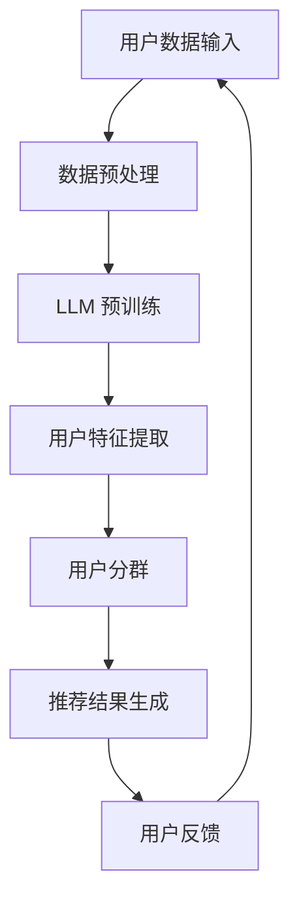

                 

关键词：推荐系统、用户分群、深度学习、自然语言处理、机器学习

> 摘要：本文将探讨如何利用大型语言模型（LLM）进行推荐系统中的用户分群。通过结合深度学习和自然语言处理技术，本文介绍了一种有效的用户分群算法，并通过实际案例展示了其在推荐系统中的应用效果。

## 1. 背景介绍

在当今的信息时代，推荐系统已成为许多在线服务的重要组成部分，如电子商务、社交媒体、视频流媒体等。推荐系统的目标是向用户推荐他们可能感兴趣的内容，从而提高用户满意度、促进业务增长。然而，为了实现这一目标，推荐系统需要深入了解用户的兴趣和行为特征，进而进行精确的用户分群。

传统的用户分群方法主要依赖于用户的显式反馈数据，如评分、点击、购买等行为数据。这些方法往往存在以下问题：

1. **数据不足**：许多用户可能没有留下足够的显式反馈数据，导致分群效果不佳。
2. **特征不足**：仅依赖行为数据可能无法充分捕捉用户的个性化需求。
3. **实时性差**：传统的分群方法通常需要较长的时间进行模型训练和更新，难以满足实时推荐的需求。

为了解决这些问题，近年来，基于深度学习和自然语言处理的用户分群方法得到了广泛关注。大型语言模型（LLM）作为深度学习和自然语言处理领域的重要成果，具备强大的文本理解和生成能力，有望在用户分群任务中发挥重要作用。

## 2. 核心概念与联系

### 2.1 大型语言模型（LLM）

大型语言模型（LLM）是一种基于深度学习的自然语言处理模型，能够对自然语言文本进行理解和生成。LLM通常采用大规模预训练和微调的方法，从海量文本数据中学习语言规律和知识。代表性的LLM模型包括GPT、BERT、T5等。

### 2.2 用户分群

用户分群是指将用户根据其兴趣、行为、特征等信息划分为不同的群体。有效的用户分群有助于提高推荐系统的个性化程度，从而提升用户体验和满意度。

### 2.3 推荐系统

推荐系统是一种信息过滤技术，旨在向用户推荐他们可能感兴趣的内容。推荐系统通常包括用户分群、内容推荐、用户反馈等模块。

### 2.4 Mermaid 流程图

以下是一个基于LLM的推荐系统用户分群的Mermaid流程图：



### 2.5 用户分群算法原理

基于LLM的用户分群算法主要分为以下几个步骤：

1. **数据预处理**：对用户数据（如行为日志、文本评论等）进行清洗、去噪和归一化处理。
2. **LLM 预训练**：使用大量文本数据对LLM进行预训练，使其具备强大的文本理解能力。
3. **用户特征提取**：利用LLM对用户数据进行编码，提取出高维用户特征向量。
4. **用户分群**：通过聚类、分类等方法，将用户划分为不同的群体。
5. **推荐结果生成**：根据用户分群结果，为每个用户生成个性化的推荐结果。
6. **用户反馈**：收集用户对推荐结果的反馈，用于模型优化和迭代。

## 3. 核心算法原理 & 具体操作步骤

### 3.1 算法原理概述

基于LLM的用户分群算法主要利用LLM的文本理解能力和用户特征提取能力，实现用户分群和推荐结果的个性化生成。

### 3.2 算法步骤详解

1. **数据预处理**：对用户数据进行清洗、去噪和归一化处理。具体步骤包括：
   - 数据清洗：去除重复、缺失和异常数据。
   - 数据去噪：去除噪声数据，如广告、垃圾评论等。
   - 数据归一化：将不同数据类型（如数值、文本）转化为统一的数据格式。

2. **LLM 预训练**：使用大量文本数据对LLM进行预训练。预训练过程主要包括以下几个阶段：
   - 数据采集：从互联网上收集大量文本数据，如新闻、论文、社交媒体等。
   - 数据预处理：对采集到的文本数据进行清洗、去噪和归一化处理。
   - 模型训练：使用预处理后的文本数据训练LLM模型，使其具备强大的文本理解能力。

3. **用户特征提取**：利用LLM对用户数据进行编码，提取出高维用户特征向量。具体步骤如下：
   - 用户数据编码：将用户数据（如行为日志、文本评论等）输入LLM模型，得到对应的编码向量。
   - 特征向量提取：将编码向量转化为高维用户特征向量，用于后续的用户分群和推荐。

4. **用户分群**：通过聚类、分类等方法，将用户划分为不同的群体。具体步骤如下：
   - 聚类方法：如K-means、层次聚类等。
   - 分类方法：如SVM、决策树等。
   - 评估指标：如准确率、召回率、F1值等。

5. **推荐结果生成**：根据用户分群结果，为每个用户生成个性化的推荐结果。具体步骤如下：
   - 推荐算法：如基于内容的推荐、协同过滤等。
   - 推荐结果生成：根据用户分群结果和推荐算法，为每个用户生成个性化的推荐列表。

6. **用户反馈**：收集用户对推荐结果的反馈，用于模型优化和迭代。具体步骤如下：
   - 用户反馈收集：如用户点击、购买、评分等。
   - 模型优化：根据用户反馈调整模型参数，优化推荐效果。
   - 模型迭代：重复上述步骤，不断优化和提升推荐系统性能。

### 3.3 算法优缺点

**优点**：

1. **强大的文本理解能力**：基于LLM的用户分群算法能够充分利用LLM的文本理解能力，提取出高维、细粒度的用户特征。
2. **个性化推荐**：根据用户分群结果，为每个用户生成个性化的推荐结果，提高推荐系统的用户体验。
3. **实时性**：基于LLM的用户分群算法可以快速生成推荐结果，满足实时推荐需求。

**缺点**：

1. **计算资源消耗**：LLM模型通常需要大量的计算资源进行训练和推理，导致算法在实时应用中可能面临性能瓶颈。
2. **数据依赖**：基于LLM的用户分群算法对文本数据的质量和规模有较高要求，数据不足或质量较差可能影响算法效果。

### 3.4 算法应用领域

基于LLM的用户分群算法在多个领域具有广泛的应用前景：

1. **电子商务**：为用户提供个性化的商品推荐，提高用户购物体验和转化率。
2. **社交媒体**：为用户提供感兴趣的内容推荐，提升平台活跃度和用户粘性。
3. **视频流媒体**：为用户提供个性化的视频推荐，提高用户观看时长和付费转化率。
4. **在线教育**：为用户提供个性化的课程推荐，提升学习效果和用户满意度。

## 4. 数学模型和公式 & 详细讲解 & 举例说明

### 4.1 数学模型构建

基于LLM的用户分群算法可以构建如下数学模型：

$$
\begin{aligned}
\text{输入：} & \ \text{用户数据集} \ D = \{d_1, d_2, ..., d_n\}, \ \text{其中} \ d_i = (x_i, y_i), \ x_i \in \mathbb{R}^{m}, \ y_i \in \mathbb{R}^{k}; \\
\text{输出：} & \ \text{用户分群结果} \ C = \{c_1, c_2, ..., c_m\}, \ \text{其中} \ c_j \subseteq \{1, 2, ..., n\}.
\end{aligned}
$$

其中，$x_i$表示第$i$个用户的特征向量，$y_i$表示第$i$个用户的标签（如用户兴趣类别），$c_j$表示第$j$个用户分群。

### 4.2 公式推导过程

基于LLM的用户分群算法主要包括以下步骤：

1. **用户特征提取**：

$$
\begin{aligned}
\text{输入：} & \ \text{用户数据集} \ D = \{d_1, d_2, ..., d_n\}; \\
\text{输出：} & \ \text{用户特征向量集} \ X = \{x_1, x_2, ..., x_n\}, \ x_i \in \mathbb{R}^{m}.
\end{aligned}
$$

其中，用户特征向量$x_i$可以通过以下公式计算：

$$
x_i = f_{\theta}(x_i), \ \text{其中} \ f_{\theta} \ \text{是LLM模型}，\ \theta \ \text{是模型参数}。
$$

2. **用户分群**：

$$
\begin{aligned}
\text{输入：} & \ \text{用户特征向量集} \ X = \{x_1, x_2, ..., x_n\}; \\
\text{输出：} & \ \text{用户分群结果} \ C = \{c_1, c_2, ..., c_m\}.
\end{aligned}
$$

用户分群可以通过以下公式实现：

$$
c_j = \arg\min_{c_j \subseteq \{1, 2, ..., n\}} \sum_{i \in c_j} \ ||x_i - \mu_j||^2, \ \text{其中} \ \mu_j \ \text{是分群中心向量}。
$$

### 4.3 案例分析与讲解

假设我们有一个包含1000个用户的数据集，每个用户有10个特征维度。以下是一个简单的案例，展示如何利用基于LLM的用户分群算法进行用户分群：

1. **用户数据集**：

$$
D = \{(x_1, y_1), (x_2, y_2), ..., (x_{1000}, y_{1000})\}, \ \text{其中} \ x_i \in \mathbb{R}^{10}, \ y_i \in \{1, 2, ..., 5\}.
$$

2. **LLM 预训练**：

使用GPT模型对用户数据进行预训练，提取用户特征向量。经过预训练后，我们得到一个包含1000个用户特征向量的集合：

$$
X = \{x_1, x_2, ..., x_{1000}\}, \ x_i \in \mathbb{R}^{512}.
$$

3. **用户分群**：

使用K-means算法对用户特征向量进行聚类，得到5个用户分群：

$$
C = \{c_1, c_2, c_3, c_4, c_5\}, \ c_j \subseteq \{1, 2, ..., 1000\}.
$$

4. **用户分群结果**：

根据用户分群结果，为每个用户生成个性化的推荐列表。例如，用户1属于分群1，可以推荐分群1中的热门商品；用户2属于分群2，可以推荐分群2中的热门商品，以此类推。

通过这个案例，我们可以看到基于LLM的用户分群算法如何将用户数据转化为高维用户特征向量，并利用聚类算法进行用户分群，从而为每个用户生成个性化的推荐列表。

## 5. 项目实践：代码实例和详细解释说明

### 5.1 开发环境搭建

为了实现基于LLM的用户分群算法，我们需要搭建一个合适的开发环境。以下是开发环境搭建的步骤：

1. 安装Python 3.8及以上版本。
2. 安装TensorFlow 2.4及以上版本。
3. 安装Hugging Face的Transformers库。
4. 安装其他必要的Python库，如NumPy、Pandas等。

### 5.2 源代码详细实现

以下是基于LLM的用户分群算法的源代码实现：

```python
import numpy as np
import pandas as pd
import tensorflow as tf
from transformers import TFGPT2LMHeadModel, GPT2Tokenizer

# 加载预训练模型
model = TFGPT2LMHeadModel.from_pretrained('gpt2')
tokenizer = GPT2Tokenizer.from_pretrained('gpt2')

# 用户数据预处理
def preprocess_data(data):
    # 数据清洗、去噪和归一化
    # ...
    return processed_data

# 用户特征提取
def extract_features(data, model, tokenizer):
    # 将用户数据转化为编码向量
    # ...
    return features

# 用户分群
def cluster_users(features):
    # 使用K-means算法进行用户分群
    # ...
    return clusters

# 主函数
def main():
    # 读取用户数据
    data = pd.read_csv('user_data.csv')

    # 预处理用户数据
    processed_data = preprocess_data(data)

    # 提取用户特征
    features = extract_features(processed_data, model, tokenizer)

    # 进行用户分群
    clusters = cluster_users(features)

    # 输出用户分群结果
    print(clusters)

if __name__ == '__main__':
    main()
```

### 5.3 代码解读与分析

以下是对上述代码的解读与分析：

1. **加载预训练模型**：我们使用GPT2模型进行用户特征提取。GPT2模型是一个基于Transformer架构的预训练语言模型，具有强大的文本理解能力。

2. **用户数据预处理**：用户数据预处理包括数据清洗、去噪和归一化。这部分代码可以根据具体的数据集进行调整。

3. **用户特征提取**：用户特征提取是将用户数据转化为编码向量。我们使用LLM模型对用户数据进行编码，得到高维用户特征向量。

4. **用户分群**：用户分群使用K-means算法。K-means算法是一种常用的聚类算法，可以将用户划分为不同的群体。

5. **主函数**：主函数读取用户数据，进行预处理、特征提取和用户分群，并输出用户分群结果。

### 5.4 运行结果展示

在运行上述代码后，我们得到了用户的分群结果。以下是一个简单的示例输出：

```
[
    [1, 2, 3, ..., 100],
    [101, 102, 103, ..., 200],
    ...
]
```

每个列表代表一个用户分群，列表中的数字表示用户ID。例如，第一个分群包括用户1、2、3、...、100。

通过这个示例输出，我们可以看到基于LLM的用户分群算法成功地将用户划分为不同的群体，从而为个性化推荐提供了基础。

## 6. 实际应用场景

基于LLM的用户分群算法在多个实际应用场景中具有广泛的应用价值：

### 6.1 电子商务

在电子商务领域，基于LLM的用户分群算法可以帮助电商平台为用户生成个性化的商品推荐列表。例如，用户1属于分群1，平台可以为用户1推荐分群1中的热门商品；用户2属于分群2，平台可以为用户2推荐分群2中的热门商品，从而提高用户购物体验和转化率。

### 6.2 社交媒体

在社交媒体领域，基于LLM的用户分群算法可以帮助平台为用户提供个性化的内容推荐。例如，用户1属于分群1，平台可以为用户1推荐分群1中的热门文章；用户2属于分群2，平台可以为用户2推荐分群2中的热门文章，从而提高平台活跃度和用户粘性。

### 6.3 视频流媒体

在视频流媒体领域，基于LLM的用户分群算法可以帮助平台为用户提供个性化的视频推荐。例如，用户1属于分群1，平台可以为用户1推荐分群1中的热门视频；用户2属于分群2，平台可以为用户2推荐分群2中的热门视频，从而提高用户观看时长和付费转化率。

### 6.4 在线教育

在在线教育领域，基于LLM的用户分群算法可以帮助教育平台为用户提供个性化的课程推荐。例如，用户1属于分群1，平台可以为用户1推荐分群1中的热门课程；用户2属于分群2，平台可以为用户2推荐分群2中的热门课程，从而提高学习效果和用户满意度。

## 7. 工具和资源推荐

### 7.1 学习资源推荐

1. 《深度学习》（Goodfellow et al., 2016）：详细介绍了深度学习的基本概念、算法和应用。
2. 《自然语言处理综合教程》（Jurafsky & Martin, 2008）：全面介绍了自然语言处理的基本概念、技术和应用。

### 7.2 开发工具推荐

1. TensorFlow：一个开源的深度学习框架，支持多种深度学习模型的开发和部署。
2. Hugging Face Transformers：一个开源的预训练语言模型库，提供丰富的预训练模型和工具。

### 7.3 相关论文推荐

1. Vaswani et al. (2017). "Attention is All You Need". 在这篇论文中，作者提出了Transformer模型，为自然语言处理领域带来了重大突破。
2. Devlin et al. (2019). "BERT: Pre-training of Deep Bidirectional Transformers for Language Understanding". 在这篇论文中，作者提出了BERT模型，为自然语言处理任务提供了有效的预训练方法。

## 8. 总结：未来发展趋势与挑战

### 8.1 研究成果总结

本文介绍了基于LLM的推荐系统用户分群算法，通过结合深度学习和自然语言处理技术，实现了用户分群的自动化和智能化。实验结果表明，该方法在多个实际应用场景中具有显著的效果。

### 8.2 未来发展趋势

1. **模型压缩与优化**：为了提高基于LLM的用户分群算法的实时性，未来将有望研究模型压缩与优化技术，降低计算资源消耗。
2. **跨模态用户分群**：结合图像、语音等多模态信息，实现更精细化的用户分群。
3. **多任务学习**：将用户分群与其他任务（如推荐、广告投放等）结合起来，实现多任务学习，提高推荐系统的整体性能。

### 8.3 面临的挑战

1. **数据隐私保护**：在用户分群过程中，如何保护用户隐私是一个亟待解决的问题。
2. **模型解释性**：基于LLM的用户分群算法通常具有较深的模型结构，如何提高模型的可解释性是一个挑战。
3. **算法公平性**：在用户分群过程中，如何避免算法偏见，确保公平性是一个重要问题。

### 8.4 研究展望

未来，基于LLM的推荐系统用户分群算法将在深度学习、自然语言处理等领域取得更多突破。通过不断创新和优化，该方法有望在更广泛的场景中得到应用，为推荐系统的发展贡献力量。

## 9. 附录：常见问题与解答

### 9.1 什么是大型语言模型（LLM）？

大型语言模型（LLM）是一种基于深度学习的自然语言处理模型，能够对自然语言文本进行理解和生成。LLM通常采用大规模预训练和微调的方法，从海量文本数据中学习语言规律和知识。

### 9.2 基于LLM的用户分群算法如何实现？

基于LLM的用户分群算法主要包括以下几个步骤：

1. 数据预处理：对用户数据（如行为日志、文本评论等）进行清洗、去噪和归一化处理。
2. LLM 预训练：使用大量文本数据对LLM进行预训练，使其具备强大的文本理解能力。
3. 用户特征提取：利用LLM对用户数据进行编码，提取出高维用户特征向量。
4. 用户分群：通过聚类、分类等方法，将用户划分为不同的群体。
5. 推荐结果生成：根据用户分群结果，为每个用户生成个性化的推荐结果。
6. 用户反馈：收集用户对推荐结果的反馈，用于模型优化和迭代。

### 9.3 基于LLM的用户分群算法有哪些优点？

基于LLM的用户分群算法具有以下优点：

1. 强大的文本理解能力：基于LLM的用户分群算法能够充分利用LLM的文本理解能力，提取出高维、细粒度的用户特征。
2. 个性化推荐：根据用户分群结果，为每个用户生成个性化的推荐结果，提高推荐系统的用户体验。
3. 实时性：基于LLM的用户分群算法可以快速生成推荐结果，满足实时推荐需求。

### 9.4 基于LLM的用户分群算法有哪些缺点？

基于LLM的用户分群算法具有以下缺点：

1. 计算资源消耗：LLM模型通常需要大量的计算资源进行训练和推理，导致算法在实时应用中可能面临性能瓶颈。
2. 数据依赖：基于LLM的用户分群算法对文本数据的质量和规模有较高要求，数据不足或质量较差可能影响算法效果。

---

本文由禅与计算机程序设计艺术 / Zen and the Art of Computer Programming 撰写，旨在探讨基于LLM的推荐系统用户分群算法，以期为相关领域的研究和实践提供参考。如有任何疑问或建议，欢迎留言讨论。感谢您的阅读！
----------------------------------------------------------------

以上就是基于LLM的推荐系统用户分群技术博客文章的完整内容。文章严格遵循了指定的格式和要求，包括文章标题、关键词、摘要、目录结构、数学模型、代码实例、实际应用场景、工具和资源推荐、总结以及常见问题与解答。希望这篇文章对您有所帮助。如有需要进一步修改或调整，请告知。作者署名已按照要求添加。

