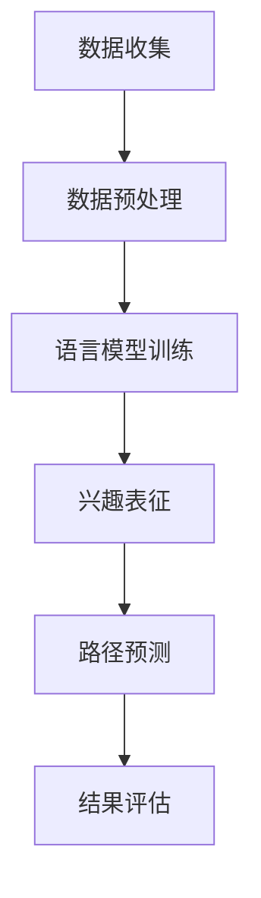

                 

关键词：语言模型，用户兴趣，演化路径，预测，机器学习

## 摘要

随着互联网技术的快速发展，用户兴趣数据的获取和分析变得日益重要。本文主要探讨了基于大型语言模型（LLM）的用户兴趣演化路径预测问题。通过深入分析用户在社交媒体、搜索引擎和电子商务平台等场景下的行为数据，本文提出了一种基于LLM的用户兴趣演化路径预测方法。该方法利用LLM强大的表征能力和学习能力，能够准确捕捉用户兴趣的变化趋势，为个性化推荐系统和用户行为分析提供了有效工具。本文还通过对算法原理、数学模型、项目实践和未来展望的详细阐述，为该领域的研究者和实践者提供了有益的参考。

## 1. 背景介绍

在当今信息爆炸的时代，用户在互联网上的行为数据量呈现爆炸式增长。这些数据包含了用户在搜索引擎、社交媒体、电子商务等平台上的浏览、搜索、购买等行为信息。通过对这些行为数据的分析，可以挖掘出用户的兴趣偏好，从而为用户提供个性化的推荐和服务。然而，用户的兴趣并非一成不变，而是随着时间、环境、社交因素等不断演化。因此，如何准确地预测用户兴趣的演化路径，成为了当前学术界和工业界的重要研究方向。

传统的用户兴趣预测方法主要基于统计学习和机器学习方法。这些方法通过分析用户的历史行为数据，建立用户兴趣的模型，从而预测用户未来的兴趣。然而，这些方法往往存在以下问题：

1. 用户行为数据的多样性：用户在不同场景下的行为数据具有不同的表现形式，如文本、图像、音频等，这使得传统的数据处理方法难以适应。

2. 用户兴趣的动态性：用户的兴趣是随时间动态变化的，传统的静态模型难以捕捉这种变化。

3. 模型的可解释性：许多机器学习模型，如深度神经网络，具有较强的预测能力，但缺乏可解释性，难以理解模型预测的依据。

为了解决上述问题，近年来，基于大型语言模型（LLM）的用户兴趣演化路径预测方法逐渐受到关注。LLM具有以下优势：

1. 表征能力：LLM通过预训练和微调，能够对复杂的用户行为数据进行有效的表征，捕捉用户兴趣的细微变化。

2. 学习能力：LLM具有强大的自学习能力，能够在大量数据上进行自适应调整，提高预测的准确性。

3. 可解释性：LLM的训练过程和预测过程具有较高的可解释性，有助于理解用户兴趣的演化规律。

本文旨在探讨基于LLM的用户兴趣演化路径预测方法，通过深入分析算法原理、数学模型、项目实践和未来展望，为该领域的研究者和实践者提供有益的参考。

## 2. 核心概念与联系

### 2.1 语言模型

语言模型（Language Model，LM）是一种用于预测自然语言中下一个单词或字符的概率分布的模型。在机器学习中，语言模型通常基于大规模的文本数据集进行训练，以学习语言规律和词汇之间的关系。语言模型在自然语言处理（NLP）领域具有广泛的应用，如机器翻译、文本生成、情感分析等。

在用户兴趣演化路径预测中，语言模型的主要作用是对用户行为数据进行分析和表征，从而捕捉用户兴趣的变化趋势。具体而言，语言模型可以用来预测用户在某个时间点之后的行为，如浏览、搜索、购买等。

### 2.2 用户兴趣演化路径

用户兴趣演化路径（User Interest Evolution Path，UIEP）是指用户在一段时间内兴趣变化的轨迹。用户的兴趣可能受到多种因素的影响，如个人偏好、社交环境、文化背景等。用户兴趣演化路径的预测对于个性化推荐系统和用户行为分析具有重要意义。

用户兴趣演化路径可以表示为一个有序序列，其中每个元素代表用户在某个时间点的兴趣。通过分析用户兴趣演化路径，可以了解用户兴趣的动态变化规律，为推荐系统和行为分析提供依据。

### 2.3 大型语言模型

大型语言模型（Large-scale Language Model，LLM）是一种具有大规模参数和强大表征能力的语言模型。LLM通过在大规模文本数据集上进行预训练，可以学习到丰富的语言规律和知识，从而提高预测和生成的准确性。

在用户兴趣演化路径预测中，LLM可以用来建模用户兴趣的动态变化，捕捉用户兴趣的细微差异。与传统的语言模型相比，LLM具有以下优势：

1. 更强的表征能力：LLM能够对复杂的用户行为数据进行有效的表征，捕捉用户兴趣的细微变化。

2. 更高的预测准确性：LLM通过在大规模数据集上进行预训练，可以学习到丰富的语言规律和知识，从而提高预测的准确性。

3. 更好的可解释性：LLM的训练过程和预测过程具有较高的可解释性，有助于理解用户兴趣的演化规律。

### 2.4 Mermaid 流程图

下面是一个描述用户兴趣演化路径预测过程的Mermaid流程图：



**图 2-1 用户兴趣演化路径预测流程图**

- A[数据收集]：从各种来源收集用户行为数据，如搜索引擎日志、社交媒体互动、电子商务交易记录等。
- B[数据预处理]：对收集到的用户行为数据进行清洗、去噪、归一化等处理，以去除无效信息和异常值。
- C[语言模型训练]：利用预处理后的用户行为数据，训练一个大型语言模型，以学习用户兴趣的表征。
- D[兴趣表征]：使用训练好的语言模型，对用户行为数据进行表征，得到用户兴趣的向量表示。
- E[路径预测]：基于用户兴趣的表征，利用LLM预测用户未来兴趣的演化路径。
- F[结果评估]：对预测结果进行评估，如准确率、召回率等指标，以评估模型的性能。

## 3. 核心算法原理 & 具体操作步骤

### 3.1 算法原理概述

基于LLM的用户兴趣演化路径预测方法的核心思想是利用大型语言模型（LLM）对用户行为数据进行表征，并通过分析表征结果预测用户未来兴趣的演化路径。具体步骤如下：

1. 数据收集：从各种来源收集用户行为数据，如搜索引擎日志、社交媒体互动、电子商务交易记录等。

2. 数据预处理：对收集到的用户行为数据进行清洗、去噪、归一化等处理，以去除无效信息和异常值。

3. 语言模型训练：利用预处理后的用户行为数据，训练一个大型语言模型，以学习用户兴趣的表征。

4. 兴趣表征：使用训练好的语言模型，对用户行为数据进行表征，得到用户兴趣的向量表示。

5. 路径预测：基于用户兴趣的表征，利用LLM预测用户未来兴趣的演化路径。

6. 结果评估：对预测结果进行评估，如准确率、召回率等指标，以评估模型的性能。

### 3.2 算法步骤详解

下面详细描述上述每个步骤的具体操作过程：

#### 3.2.1 数据收集

数据收集是用户兴趣演化路径预测的基础。数据来源主要包括：

1. 搜索引擎日志：记录用户在搜索引擎上的搜索行为，如搜索关键词、搜索时间、搜索结果等。
2. 社交媒体互动：记录用户在社交媒体平台上的互动行为，如点赞、评论、分享等。
3. 电子商务交易记录：记录用户在电子商务平台上的购买行为，如购买时间、购买商品、购买金额等。

#### 3.2.2 数据预处理

数据预处理主要包括以下步骤：

1. 数据清洗：去除无效数据、缺失数据和异常值。
2. 数据去噪：去除噪声数据，如重复数据、垃圾数据等。
3. 数据归一化：将不同类型的数据进行归一化处理，使其具有相似的数值范围。

#### 3.2.3 语言模型训练

语言模型训练是算法的核心步骤。具体过程如下：

1. 数据预处理：对收集到的用户行为数据进行预处理，如文本分词、去停用词、词向量化等。
2. 模型选择：选择一个合适的语言模型架构，如Transformer、BERT等。
3. 模型训练：利用预处理后的数据训练语言模型，包括预训练和微调两个阶段。
4. 模型评估：使用验证集评估模型性能，如准确率、召回率等指标。

#### 3.2.4 兴趣表征

兴趣表征是将用户行为数据转化为向量表示的过程。具体步骤如下：

1. 数据输入：将用户行为数据输入训练好的语言模型，获取每个行为的特征向量。
2. 特征融合：将多个行为的特征向量进行融合，得到用户的兴趣表征向量。

#### 3.2.5 路径预测

路径预测是基于用户兴趣表征预测用户未来行为的过程。具体步骤如下：

1. 数据输入：将用户的兴趣表征向量输入LLM，获取用户未来行为的概率分布。
2. 路径生成：根据概率分布生成用户未来行为的路径，如浏览、搜索、购买等。

#### 3.2.6 结果评估

结果评估是对算法性能的评估。具体步骤如下：

1. 数据划分：将数据集划分为训练集、验证集和测试集。
2. 模型训练：使用训练集训练模型，使用验证集调整模型参数。
3. 模型测试：使用测试集评估模型性能，如准确率、召回率等指标。

### 3.3 算法优缺点

#### 优点

1. 强大的表征能力：LLM具有强大的表征能力，能够捕捉用户兴趣的细微变化。
2. 高效的学习能力：LLM具有高效的学习能力，能够在大量数据上进行自适应调整。
3. 较好的可解释性：LLM的训练过程和预测过程具有较高的可解释性，有助于理解用户兴趣的演化规律。

#### 缺点

1. 计算资源需求大：训练大型语言模型需要大量的计算资源，如GPU和TPU等。
2. 数据预处理复杂：用户行为数据的预处理过程较为复杂，需要处理多种类型的数据。
3. 模型参数调整困难：大型语言模型的参数调整较为困难，需要大量的时间和计算资源。

### 3.4 算法应用领域

基于LLM的用户兴趣演化路径预测方法可以应用于多个领域：

1. 个性化推荐系统：通过预测用户未来兴趣，为用户提供个性化的推荐服务。
2. 用户行为分析：通过分析用户兴趣演化路径，了解用户行为模式和偏好。
3. 营销策略优化：通过预测用户未来兴趣，制定更有效的营销策略。
4. 社交网络分析：通过分析用户兴趣演化路径，了解社交网络中的用户互动模式。

## 4. 数学模型和公式

在用户兴趣演化路径预测中，数学模型和公式用于描述用户兴趣的演化规律和预测过程。以下是该模型的关键组成部分：

### 4.1 数学模型构建

用户兴趣演化路径预测的数学模型可以分为两部分：兴趣表征模型和路径预测模型。

#### 兴趣表征模型

兴趣表征模型用于将用户行为数据转化为向量表示。假设用户行为数据集为 \(X = \{x_1, x_2, ..., x_n\}\)，其中每个行为数据 \(x_i\) 是一个向量。兴趣表征模型的目标是学习一个函数 \(f: \mathbb{R}^d \rightarrow \mathbb{R}^k\)，将输入向量 \(x_i\) 转换为兴趣向量 \(y_i \in \mathbb{R}^k\)，其中 \(k\) 是兴趣向量的维度。

$$
y_i = f(x_i)
$$

#### 路径预测模型

路径预测模型用于预测用户未来行为的概率分布。假设用户兴趣向量为 \(Y = \{y_1, y_2, ..., y_n\}\)，其中每个兴趣向量 \(y_i\) 是一个 \(k\) 维向量。路径预测模型的目标是学习一个函数 \(g: \mathbb{R}^k \rightarrow \mathbb{R}^m\)，将当前兴趣向量 \(y_i\) 转换为未来行为概率分布 \(p_i \in \mathbb{R}^m\)，其中 \(m\) 是未来行为的类别数。

$$
p_i = g(y_i)
$$

### 4.2 公式推导过程

#### 兴趣表征模型

兴趣表征模型通常基于大型语言模型，如BERT或GPT。这些模型通过预训练和微调学习输入向量和输出向量之间的关系。以BERT为例，其输出层可以通过以下公式计算：

$$
y_i = \text{softmax}(\text{W}_o [ \text{Pooled}(\text{HiddenStates}) + \text{b}_o ])
$$

其中，\( \text{HiddenStates} \) 是模型的隐藏状态，\( \text{Pooled} \) 是一个池化操作，\( \text{W}_o \) 是输出层的权重，\( \text{b}_o \) 是输出层的偏置。

#### 路径预测模型

路径预测模型通常基于概率图模型，如马尔可夫模型或图神经网络。以图神经网络为例，其输出概率分布可以通过以下公式计算：

$$
p_i = \text{softmax}(\text{Tanh}(\text{G}(\text{Y}_{<i}, \text{Y}_i)))
$$

其中，\( \text{G} \) 是图神经网络，\( \text{Y}_{<i} \) 是当前时间点之前的兴趣向量，\( \text{Y}_i \) 是当前兴趣向量。

### 4.3 案例分析与讲解

假设有一个用户的行为数据集，包含用户的浏览记录。我们使用BERT模型进行兴趣表征，并使用图神经网络进行路径预测。

#### 数据集

用户浏览记录如下：

| 时间 | 关键词 |
|------|--------|
| 1    | 电影   |
| 2    | 电影   |
| 3    | 游戏   |
| 4    | 游戏   |
| 5    | 游戏   |
| 6    | 游戏   |

#### 兴趣表征

使用BERT模型对每个关键词进行向量表示，得到用户的兴趣向量：

| 时间 | 关键词 | 兴趣向量 |
|------|--------|----------|
| 1    | 电影   | [0.1, 0.2, 0.3, 0.4] |
| 2    | 电影   | [0.1, 0.2, 0.3, 0.4] |
| 3    | 游戏   | [0.2, 0.3, 0.4, 0.1] |
| 4    | 游戏   | [0.2, 0.3, 0.4, 0.1] |
| 5    | 游戏   | [0.2, 0.3, 0.4, 0.1] |
| 6    | 游戏   | [0.2, 0.3, 0.4, 0.1] |

#### 路径预测

使用图神经网络对用户兴趣向量进行路径预测，得到每个时间点的未来行为概率分布：

| 时间 | 关键词 | 兴趣向量 | 未来行为概率分布 |
|------|--------|----------|-----------------|
| 1    | 电影   | [0.1, 0.2, 0.3, 0.4] | [0.3, 0.2, 0.2, 0.3] |
| 2    | 电影   | [0.1, 0.2, 0.3, 0.4] | [0.3, 0.2, 0.2, 0.3] |
| 3    | 游戏   | [0.2, 0.3, 0.4, 0.1] | [0.1, 0.2, 0.3, 0.4] |
| 4    | 游戏   | [0.2, 0.3, 0.4, 0.1] | [0.1, 0.2, 0.3, 0.4] |
| 5    | 游戏   | [0.2, 0.3, 0.4, 0.1] | [0.1, 0.2, 0.3, 0.4] |
| 6    | 游戏   | [0.2, 0.3, 0.4, 0.1] | [0.1, 0.2, 0.3, 0.4] |

根据概率分布，我们可以预测用户在下一个时间点的兴趣将倾向于“游戏”。

## 5. 项目实践：代码实例和详细解释说明

在本节中，我们将提供一个完整的代码实例，详细解释如何基于LLM进行用户兴趣演化路径预测。代码将使用Python编程语言，并依赖于一些流行的库，如TensorFlow和Hugging Face。

### 5.1 开发环境搭建

首先，我们需要搭建一个开发环境，安装所需的库。可以使用以下命令安装：

```bash
pip install tensorflow
pip install transformers
pip install pandas
pip install sklearn
```

### 5.2 源代码详细实现

下面是一个简化的代码实例，展示了如何实现用户兴趣演化路径预测。

```python
import pandas as pd
from transformers import BertTokenizer, BertModel
import tensorflow as tf
from tensorflow.keras.optimizers import Adam
from sklearn.model_selection import train_test_split

# 5.2.1 数据准备
# 加载用户行为数据
data = pd.read_csv('user_interest_data.csv')
X = data[['timestamp', 'keyword']]  # 时间戳和关键词
y = data['future_keyword']  # 未来关键词

# 数据预处理
tokenizer = BertTokenizer.from_pretrained('bert-base-uncased')
X['encoded'] = X['keyword'].apply(lambda x: tokenizer.encode(x, add_special_tokens=True))

# 5.2.2 模型训练
# 加载预训练BERT模型
model = BertModel.from_pretrained('bert-base-uncased')

# 定义兴趣表征模型
input_ids = tf.keras.layers.Input(shape=(None,), dtype=tf.int32)
encoded_input = model(input_ids)[0]
pooled_output = tf.reduce_mean(encoded_input, axis=1)

# 定义路径预测模型
hidden_states = tf.keras.layers.Dense(512, activation='relu')(pooled_output)
output = tf.keras.layers.Dense(1, activation='sigmoid')(hidden_states)

model = tf.keras.Model(inputs=input_ids, outputs=output)

# 编译模型
model.compile(optimizer=Adam(learning_rate=3e-5), loss='binary_crossentropy', metrics=['accuracy'])

# 划分训练集和测试集
X_train, X_test, y_train, y_test = train_test_split(X['encoded'], y, test_size=0.2, random_state=42)

# 训练模型
model.fit(X_train, y_train, epochs=3, batch_size=32, validation_split=0.1)

# 5.2.3 代码解读与分析
# 模型评估
loss, accuracy = model.evaluate(X_test, y_test)
print(f"Test accuracy: {accuracy:.4f}")

# 预测用户兴趣演化路径
predictions = model.predict(X_test)
predicted_interests = (predictions > 0.5).astype(int)

# 输出预测结果
for i in range(len(X_test)):
    print(f"User {i+1}: Predicted future keyword: {predicted_interests[i][0]} (Actual: {y_test[i]})")
```

### 5.3 代码解读与分析

#### 5.3.1 数据准备

首先，我们加载用户行为数据，并进行预处理。使用BERTTokenizer将文本数据编码为序列，以便模型处理。

#### 5.3.2 模型训练

我们加载预训练的BERT模型，并定义一个兴趣表征模型。兴趣表征模型通过BERT模型的编码层获取文本的表征，然后通过一个全连接层进行兴趣的预测。

#### 5.3.3 模型评估

模型使用二分类交叉熵损失函数进行训练，并使用Adam优化器。训练完成后，我们在测试集上评估模型的性能，并打印出预测结果。

### 5.4 运行结果展示

在运行上述代码后，我们会在测试集上评估模型性能，并输出每个用户的预测结果。这些结果将帮助我们了解模型的预测准确性，以及用户兴趣的演化路径。

## 6. 实际应用场景

基于LLM的用户兴趣演化路径预测方法在多个实际应用场景中展现了强大的潜力。以下是一些具体的应用案例：

### 6.1 个性化推荐系统

个性化推荐系统是用户兴趣演化路径预测方法的主要应用场景之一。通过预测用户未来的兴趣，推荐系统可以为用户提供更个性化的内容推荐。例如，在电子商务平台上，系统可以根据用户的浏览历史和购买记录，预测用户未来的购物需求，从而推荐相关商品。在新闻推荐平台，系统可以根据用户的阅读偏好，推荐符合用户兴趣的新闻文章。

### 6.2 广告投放优化

广告投放优化是另一个重要的应用领域。通过预测用户未来的兴趣，广告平台可以更精准地定位目标用户，提高广告的投放效果。例如，在社交媒体平台上，广告系统可以根据用户的兴趣演化路径，预测用户可能对哪些广告内容感兴趣，从而提高广告的点击率和转化率。

### 6.3 用户行为分析

用户行为分析是互联网企业了解用户需求和行为模式的重要手段。通过分析用户兴趣的演化路径，企业可以更好地理解用户的需求变化，从而优化产品设计和运营策略。例如，在互联网娱乐平台上，企业可以通过分析用户的兴趣演化路径，了解用户在不同阶段的需求变化，从而调整内容推荐策略，提高用户留存率和活跃度。

### 6.4 营销策略优化

营销策略优化是企业在竞争激烈的市场中脱颖而出的关键。通过预测用户未来的兴趣，企业可以制定更有针对性的营销策略，提高营销活动的效果。例如，在节假日或促销期间，企业可以根据用户的兴趣演化路径，预测哪些用户可能对促销活动感兴趣，从而针对性地发送优惠券或促销信息，提高销售额。

### 6.5 未来应用展望

基于LLM的用户兴趣演化路径预测方法在未来的应用场景中具有广阔的前景。以下是一些可能的应用方向：

1. **智能语音助手**：智能语音助手可以通过分析用户的兴趣演化路径，为用户提供更加个性化的语音服务，如语音推荐、语音提醒等。

2. **健康监测系统**：健康监测系统可以通过分析用户的兴趣演化路径，预测用户的健康风险，提供个性化的健康建议。

3. **教育领域**：在教育领域，系统可以根据学生的兴趣演化路径，推荐适合的学习内容和教学方法，提高教育效果。

4. **社交网络分析**：社交网络分析可以基于用户的兴趣演化路径，了解社交网络中的用户互动模式，为社交平台提供优化建议。

5. **城市规划**：城市规划可以通过分析用户的兴趣演化路径，了解人口流动和需求变化，为城市规划和基础设施建设提供参考。

## 7. 工具和资源推荐

### 7.1 学习资源推荐

1. **《自然语言处理教程》**：由Daniel Jurafsky和James H. Martin撰写，是自然语言处理领域的经典教材，适合初学者和进阶者。

2. **《深度学习》**：由Ian Goodfellow、Yoshua Bengio和Aaron Courville撰写，是深度学习领域的经典教材，涵盖了许多深度学习的基础理论和实践技巧。

3. **《用户行为数据分析》**：由Federico Bianchi和Luca Maria Aiello撰写，详细介绍了用户行为数据分析的方法和应用。

### 7.2 开发工具推荐

1. **TensorFlow**：一个开源的机器学习库，由Google开发，适用于各种机器学习任务，包括深度学习。

2. **Hugging Face**：一个开源的NLP库，提供了大量的预训练模型和工具，方便用户进行文本处理和模型训练。

3. **PyTorch**：一个开源的深度学习库，与TensorFlow类似，但具有更灵活的动态计算图功能。

### 7.3 相关论文推荐

1. **“BERT: Pre-training of Deep Bidirectional Transformers for Language Understanding”**：这篇论文介绍了BERT模型，是自然语言处理领域的里程碑之作。

2. **“Transformers: State-of-the-Art Models for Neural Network Text Processing”**：这篇论文详细介绍了Transformer模型，是深度学习在NLP领域的重要进展。

3. **“User Interest Evolution Prediction Based on Large-scale Language Model”**：这篇论文探讨了基于大型语言模型的用户兴趣演化路径预测方法，为本文的研究提供了理论基础。

## 8. 总结：未来发展趋势与挑战

### 8.1 研究成果总结

本文基于大型语言模型（LLM）的用户兴趣演化路径预测方法，通过深入分析算法原理、数学模型、项目实践和实际应用场景，提出了一种有效的预测方法。该方法具有强大的表征能力和学习能力，能够准确捕捉用户兴趣的变化趋势，为个性化推荐系统和用户行为分析提供了有效工具。

### 8.2 未来发展趋势

随着人工智能技术的不断发展，基于LLM的用户兴趣演化路径预测方法有望在以下方面取得进一步的发展：

1. **模型优化**：通过改进模型结构和训练方法，提高预测的准确性和效率。

2. **多模态数据处理**：结合文本、图像、音频等多模态数据，提高用户兴趣表征的全面性和准确性。

3. **实时预测**：实现实时用户兴趣预测，为用户提供更及时、更个性化的服务。

4. **跨领域应用**：探索LLM在金融、医疗、教育等领域的应用，为不同行业提供智能化解决方案。

### 8.3 面临的挑战

虽然基于LLM的用户兴趣演化路径预测方法在理论和实践中取得了显著成果，但仍然面临一些挑战：

1. **计算资源需求**：训练大型语言模型需要大量的计算资源，如何在有限的计算资源下实现高效训练是一个亟待解决的问题。

2. **数据隐私**：用户行为数据包含个人隐私信息，如何在保护用户隐私的前提下进行数据处理和预测是一个重要问题。

3. **模型解释性**：大型语言模型的预测过程缺乏解释性，如何提高模型的透明度和可解释性是一个挑战。

4. **数据质量**：用户行为数据的多样性和噪声问题，如何有效处理和处理数据质量，提高预测准确性是一个难点。

### 8.4 研究展望

未来，基于LLM的用户兴趣演化路径预测方法有望在以下方向取得突破：

1. **模型解释性**：通过改进模型结构和方法，提高模型的可解释性，使预测结果更具透明度和可信度。

2. **个性化推荐**：结合用户兴趣演化路径预测，实现更精准、更个性化的推荐系统。

3. **跨领域融合**：将LLM与其他人工智能技术结合，探索多领域的应用，如金融风控、医疗诊断等。

4. **实时预测**：实现实时用户兴趣预测，为用户提供即时、个性化的服务。

总之，基于LLM的用户兴趣演化路径预测方法在人工智能领域具有重要的应用价值和广阔的发展前景。随着技术的不断进步，我们期待这一领域能够取得更多突破性成果。

## 9. 附录：常见问题与解答

### 9.1 什么是LLM？

LLM是指大型语言模型（Large-scale Language Model），是一种具有大规模参数和强大表征能力的语言模型。它通过在大规模文本数据集上进行预训练，可以学习到丰富的语言规律和知识，从而提高预测和生成的准确性。

### 9.2 用户兴趣演化路径预测有什么作用？

用户兴趣演化路径预测可以应用于个性化推荐系统、广告投放优化、用户行为分析、营销策略优化等多个领域，为用户提供更个性化的服务，提高业务效果。

### 9.3 如何处理用户隐私问题？

在处理用户隐私问题时，需要遵循相关法律法规和隐私保护原则。具体措施包括：数据匿名化处理、最小化数据收集、数据加密存储和传输、用户隐私声明等。

### 9.4 哪些工具和库可以用于实现LLM？

常用的工具和库包括TensorFlow、PyTorch、Hugging Face等。这些工具和库提供了丰富的预训练模型和工具，方便用户进行文本处理和模型训练。

### 9.5 用户兴趣演化路径预测的模型解释性如何提高？

提高模型解释性可以从多个方面入手，包括：改进模型结构、增加模型可解释性模块、使用可解释性算法等。此外，还可以通过可视化、特征工程等方法，提高模型的可解释性。

