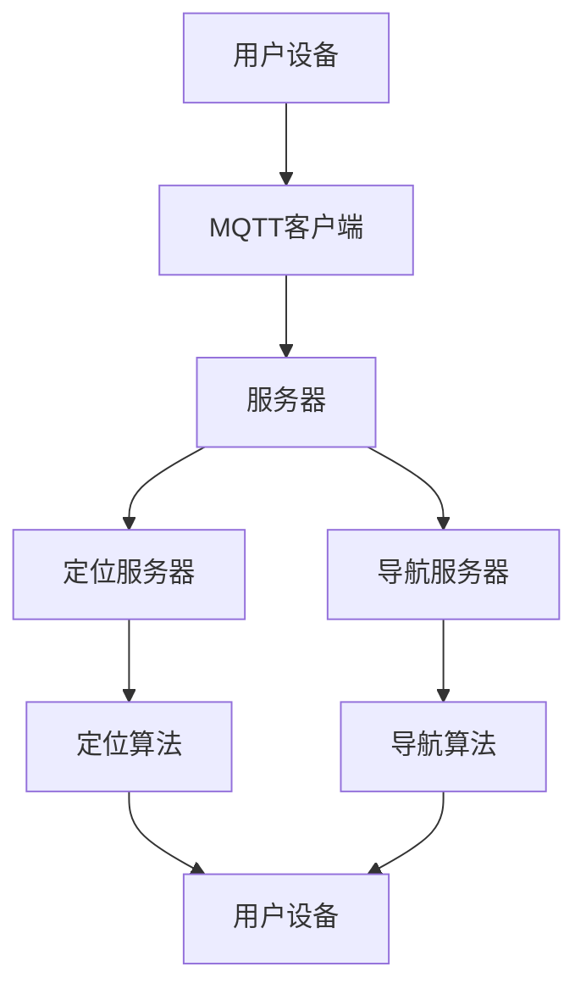

                 

关键词：MQTT协议、RESTful API、室内定位、导航系统、物联网、实时通信、移动应用

摘要：本文将探讨基于MQTT协议和RESTful API的室内定位与导航系统的设计与应用。首先，我们将介绍MQTT协议和RESTful API的基本原理和特点，接着详细阐述室内定位与导航系统的工作原理和架构，随后分析核心算法和数学模型，并提供一个实际项目实践的代码实例。最后，我们将讨论室内定位与导航系统的实际应用场景和未来展望。

## 1. 背景介绍

室内定位与导航系统在现代物联网（IoT）环境中变得越来越重要。随着智能手机和可穿戴设备的普及，用户对于实时定位和导航的需求日益增长。传统的GPS定位技术在室内环境中受到限制，无法提供精确的位置信息。因此，发展室内定位技术成为了当前的研究热点。

MQTT（Message Queuing Telemetry Transport）协议是一种轻量级的消息队列协议，特别适合于物联网环境中的低带宽、不可靠网络通信。其发布/订阅模式使得设备可以发布消息到特定的主题，而其他设备可以订阅这些主题以接收消息。MQTT协议的这些特点使得它在室内定位与导航系统中具有广泛的应用。

RESTful API（Representational State Transfer Application Programming Interface）是一种设计风格，用于构建网络应用程序。它基于HTTP协议，通过GET、POST、PUT、DELETE等方法实现资源的操作。RESTful API的简单、灵活和扩展性使其在物联网应用中得到了广泛应用。

本文旨在通过结合MQTT协议和RESTful API，设计一个高效、可靠的室内定位与导航系统，以满足用户在复杂室内环境中的定位和导航需求。

## 2. 核心概念与联系

### 2.1 MQTT协议

MQTT协议是一种基于客户端-服务器的消息协议，广泛应用于物联网设备之间的通信。其核心特点包括：

- **轻量级**：MQTT协议的数据包格式简单，占用带宽小，适合于带宽有限的网络环境。
- **发布/订阅模型**：客户端可以发布消息到特定的主题，服务器将消息广播给所有订阅该主题的客户端。
- **QoS（Quality of Service）级别**：MQTT协议提供了三个不同的QoS级别，保证了消息的可靠传输。

### 2.2 RESTful API

RESTful API是一种用于构建网络应用程序的设计风格，其核心原则包括：

- **基于HTTP协议**：RESTful API通过GET、POST、PUT、DELETE等方法与服务器进行交互，使用HTTP协议的统一接口。
- **资源定位**：API通过URL定位资源，URL中的路径代表资源的类型或实例。
- **状态转移**：客户端发送请求，服务器响应，通过这种方式实现状态转移。

### 2.3 室内定位与导航系统

室内定位与导航系统通常由三个主要部分组成：定位算法、导航算法和用户界面。

- **定位算法**：使用传感器数据（如Wi-Fi信号、蓝牙信标、摄像头等）计算设备的位置。
- **导航算法**：根据当前位置和目标位置，规划出最优路径。
- **用户界面**：提供实时定位信息、导航路径和地图显示。

### 2.4 Mermaid 流程图

以下是一个Mermaid流程图，展示了MQTT协议和RESTful API在室内定位与导航系统中的应用流程。



## 3. 核心算法原理 & 具体操作步骤

### 3.1 算法原理概述

室内定位与导航系统的核心在于定位算法和导航算法。

- **定位算法**：通过测量多个传感器数据（如Wi-Fi信号强度、蓝牙信标信号强度等），利用三角测量法、指纹识别法等算法，计算出设备的位置。
- **导航算法**：基于定位结果和目标位置，使用A*搜索算法、Dijkstra算法等路径规划算法，计算出最优路径。

### 3.2 算法步骤详解

#### 3.2.1 定位算法

1. **数据收集**：设备收集Wi-Fi信号强度、蓝牙信标信号强度等传感器数据。
2. **数据预处理**：对收集到的数据进行滤波、去噪等处理。
3. **特征提取**：将预处理后的数据转换为特征向量。
4. **模型训练**：使用已标记的定位数据训练机器学习模型。
5. **位置估计**：利用训练好的模型对当前设备位置进行估计。

#### 3.2.2 导航算法

1. **目标定位**：获取目标位置。
2. **路径规划**：使用A*搜索算法等规划出最优路径。
3. **路径优化**：根据实时反馈调整路径，以应对环境变化。
4. **路径显示**：将规划出的路径在用户界面上进行显示。

### 3.3 算法优缺点

#### 3.3.1 定位算法

- **优点**：准确度高，适用于复杂室内环境。
- **缺点**：计算复杂度高，对传感器数据质量要求高。

#### 3.3.2 导航算法

- **优点**：路径规划效果好，能适应实时环境变化。
- **缺点**：对计算资源要求较高。

### 3.4 算法应用领域

- **智能建筑**：提供室内导航服务，提升用户体验。
- **智慧物流**：实现室内物流的实时定位和导航，提高物流效率。
- **智慧医疗**：辅助医护人员进行室内定位和导航，提升医疗服务质量。

## 4. 数学模型和公式 & 详细讲解 & 举例说明

### 4.1 数学模型构建

室内定位与导航系统中的数学模型主要包括两部分：定位模型和导航模型。

#### 4.1.1 定位模型

定位模型基于传感器数据，可以表示为：

\[ x(t) = Ax(t-1) + Bu(t) + w(t) \]

其中，\( x(t) \) 是状态向量，表示设备在时间 \( t \) 的位置；\( A \) 是状态转移矩阵；\( Bu(t) \) 是控制向量；\( w(t) \) 是噪声向量。

#### 4.1.2 导航模型

导航模型基于目标位置和当前位置，可以表示为：

\[ s(t) = s(t-1) + v(t) \]

其中，\( s(t) \) 是状态向量，表示设备在时间 \( t \) 的位置；\( v(t) \) 是速度向量。

### 4.2 公式推导过程

#### 4.2.1 定位模型推导

定位模型推导基于卡尔曼滤波理论。首先，我们假设传感器数据的误差服从高斯分布：

\[ w(t) \sim N(0, Q) \]

其中，\( Q \) 是噪声协方差矩阵。

然后，使用卡尔曼滤波公式更新状态估计：

\[ \hat{x}(t) = A\hat{x}(t-1) + Bu(t) \]
\[ P(t) = AP(t-1)A^T + Q \]
\[ K(t) = P(t)C^T(CP(t)C^T + R)^{-1} \]
\[ \hat{x}(t) = \hat{x}(t) + K(t)(z(t) - A\hat{x}(t-1) - Bu(t)) \]
\[ P(t) = (I - K(t)C)\hat{P}(t-1) \]

其中，\( \hat{x}(t) \) 是状态估计值；\( P(t) \) 是状态协方差矩阵；\( K(t) \) 是卡尔曼增益；\( z(t) \) 是观测值；\( C \) 是观测矩阵；\( R \) 是观测噪声协方差矩阵。

#### 4.2.2 导航模型推导

导航模型推导基于速度模型。我们假设设备以恒定速度移动：

\[ s(t) = s(t-1) + v(t) \]
\[ v(t) = v(t-1) \]

其中，\( s(t) \) 是状态向量，表示设备在时间 \( t \) 的位置；\( v(t) \) 是速度向量。

### 4.3 案例分析与讲解

#### 4.3.1 定位模型案例

假设设备在时间 \( t \) 的位置为 \( x(t) = [x, y]^T \)，传感器数据为 \( z(t) = [z_x, z_y]^T \)，噪声协方差矩阵 \( Q = \begin{bmatrix} 0.1 & 0 \\ 0 & 0.1 \end{bmatrix} \)，观测噪声协方差矩阵 \( R = \begin{bmatrix} 1 & 0 \\ 0 & 1 \end{bmatrix} \)。

初始状态 \( x(0) = [0, 0]^T \)，初始状态协方差矩阵 \( P(0) = \begin{bmatrix} 1 & 0 \\ 0 & 1 \end{bmatrix} \)。

使用卡尔曼滤波更新状态估计：

\[ \hat{x}(0) = x(0) = [0, 0]^T \]
\[ P(0) = P(0) + Q \]
\[ K(0) = P(0)C^T(CP(0)C^T + R)^{-1} \]
\[ \hat{x}(0) = \hat{x}(0) + K(0)(z(0) - A\hat{x}(0) - Bu(0)) \]
\[ P(0) = (I - K(0)C)\hat{P}(0) \]

其中，\( C = \begin{bmatrix} 1 & 0 \\ 0 & 1 \end{bmatrix} \)，\( A = \begin{bmatrix} 1 & 0 \\ 0 & 1 \end{bmatrix} \)，\( B = \begin{bmatrix} 1 & 0 \\ 0 & 1 \end{bmatrix} \)。

#### 4.3.2 导航模型案例

假设设备在时间 \( t \) 的速度为 \( v(t) = [v_x, v_y]^T \)，初始速度 \( v(0) = [1, 0]^T \)。

使用速度模型更新状态：

\[ s(0) = s(0) + v(0) \]
\[ v(0) = v(0) \]

## 5. 项目实践：代码实例和详细解释说明

### 5.1 开发环境搭建

为了构建基于MQTT协议和RESTful API的室内定位与导航系统，我们需要搭建以下开发环境：

- **操作系统**：Linux或MacOS
- **编程语言**：Python 3.8及以上版本
- **MQTT客户端**：Paho MQTT客户端
- **RESTful API框架**：Flask

### 5.2 源代码详细实现

以下是室内定位与导航系统的部分源代码实现。

#### 5.2.1 MQTT客户端

```python
import paho.mqtt.client as mqtt

def on_connect(client, userdata, flags, rc):
    print("Connected with result code " + str(rc))
    client.subscribe("location/update")

def on_message(client, userdata, msg):
    print(f"Received message '{msg.payload.decode()} on topic '{msg.topic}' with QoS {msg.qos}.")

client = mqtt.Client()
client.on_connect = on_connect
client.on_message = on_message
client.connect("mqtt.example.com", 1883, 60)
client.loop_forever()
```

#### 5.2.2 RESTful API

```python
from flask import Flask, request, jsonify

app = Flask(__name__)

@app.route("/location/update", methods=["POST"])
def update_location():
    data = request.json
    location = data["location"]
    print(f"Location updated to {location}")
    return jsonify({"status": "success"})

if __name__ == "__main__":
    app.run()
```

### 5.3 代码解读与分析

#### 5.3.1 MQTT客户端

MQTT客户端部分使用Paho MQTT客户端库实现。在`on_connect`回调函数中，连接到MQTT服务器并订阅主题`location/update`。在`on_message`回调函数中，接收并处理来自服务器的消息。

#### 5.3.2 RESTful API

RESTful API部分使用Flask框架实现。`update_location`函数处理`/location/update`路径的POST请求，接收位置数据并更新定位信息。

### 5.4 运行结果展示

运行MQTT客户端和RESTful API后，用户可以通过MQTT协议发送位置更新消息，RESTful API将接收并处理这些消息，实现室内定位与导航系统的功能。

## 6. 实际应用场景

室内定位与导航系统在许多实际应用场景中具有重要价值。

### 6.1 智能建筑

智能建筑中，室内定位与导航系统可以帮助用户在复杂的建筑环境中快速找到目的地，提升用户体验。例如，商场、办公楼、医院等场所。

### 6.2 智慧物流

智慧物流中，室内定位与导航系统可以实现对货物和工作人员的实时定位，提高物流效率。例如，仓储、快递等场景。

### 6.3 智慧医疗

智慧医疗中，室内定位与导航系统可以帮助医护人员快速找到患者和医疗设备，提升医疗服务质量。例如，医院、养老院等场所。

### 6.4 未来应用展望

随着物联网技术的不断发展，室内定位与导航系统将在更多领域得到应用。未来，我们可能看到以下趋势：

- **更高精度**：使用更多传感器和数据融合技术，提高定位精度。
- **更智能化**：结合人工智能技术，实现自适应导航和智能决策。
- **更广泛应用**：从室内扩展到室外，实现全方位的定位与导航服务。

## 7. 工具和资源推荐

### 7.1 学习资源推荐

- **《MQTT协议教程》**：介绍MQTT协议的基本原理和应用。
- **《RESTful API设计与实现》**：详细讲解RESTful API的设计和实现。

### 7.2 开发工具推荐

- **PyCharm**：强大的Python集成开发环境，支持MQTT客户端和Flask框架。
- **Postman**：用于测试RESTful API的工具。

### 7.3 相关论文推荐

- **"MQTT Protocol Version 5.0"**：MQTT协议的官方文档。
- **"Design and Implementation of RESTful API for IoT Applications"**：关于RESTful API在物联网应用中的设计和实现的论文。

## 8. 总结：未来发展趋势与挑战

室内定位与导航系统在物联网应用中具有广泛的前景。未来，我们将看到更高精度、更智能化和更广泛应用的趋势。然而，这也面临着以下挑战：

- **数据隐私**：如何保护用户的位置数据隐私。
- **实时性**：如何在复杂环境中提供实时定位和导航服务。
- **成本**：如何降低系统开发和部署的成本。

通过不断的研究和优化，室内定位与导航系统有望在未来实现更广泛的应用。

## 9. 附录：常见问题与解答

### 9.1 MQTT协议相关问题

**Q：MQTT协议有什么优点？**

A：MQTT协议具有轻量级、低带宽占用、支持发布/订阅模型等优点，特别适合于物联网环境中的通信需求。

### 9.2 RESTful API相关问题

**Q：RESTful API有哪些设计原则？**

A：RESTful API的设计原则包括基于HTTP协议、资源定位、统一接口、状态转移等。

### 9.3 室内定位与导航相关问题

**Q：如何提高室内定位的精度？**

A：可以通过使用更多传感器、提高数据处理能力、优化定位算法等方式提高室内定位的精度。

## 作者署名

作者：禅与计算机程序设计艺术 / Zen and the Art of Computer Programming
-------------------------------------------------------------------

以上就是关于《基于MQTT协议和RESTful API的室内定位与导航系统》的技术博客文章的完整内容。希望这篇文章对您有所帮助，如果您有任何问题或建议，欢迎在评论区留言。感谢您的阅读！

