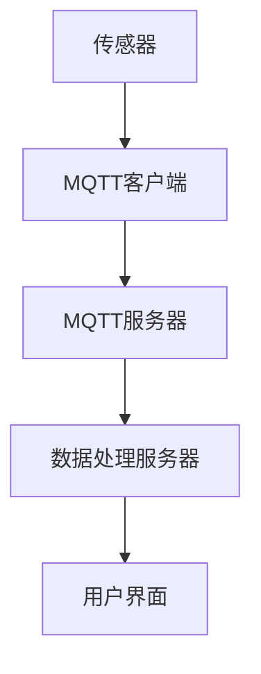

                 

 > **关键词：** MQTT协议，RESTful API，智能家居，水质监测，物联网，系统设计，安全性能，实时数据传输。

> **摘要：** 本文深入探讨了基于MQTT协议和RESTful API的智能家居水质监测系统的设计与实现。文章首先介绍了系统背景，然后详细阐述了MQTT协议和RESTful API的基本原理。接着，文章展示了水质监测系统的架构设计，并深入分析了核心算法原理、数学模型和具体操作步骤。通过代码实例和实际应用场景的展示，本文旨在为读者提供一套完整的技术实现方案，并对系统的未来应用和发展趋势进行了展望。

## 1. 背景介绍

随着物联网（IoT）技术的发展，智能家居系统逐渐成为人们日常生活的重要组成部分。智能家居系统通过将各种设备互联，实现了对家庭环境的智能化管理和控制，提升了人们的生活质量。其中，水质监测系统是智能家居系统中的一个重要环节。水质监测系统可以实时监测家庭用水的水质状况，及时检测出水中的有害物质，确保家庭用水的安全。

然而，传统的智能家居水质监测系统通常存在以下问题：

- **数据传输效率低：** 传统的水质监测系统大多采用TCP/IP协议进行数据传输，当监测点数量增加时，数据传输效率显著下降。
- **系统扩展性差：** 传统系统的架构设计不够灵活，难以适应不断变化的需求。
- **安全性不足：** 传统的数据传输方式可能存在数据泄露的风险。

为了解决上述问题，本文提出了一种基于MQTT协议和RESTful API的智能家居水质监测系统。该系统利用MQTT协议的高效、可靠、轻量级的特点，实现了实时数据的传输。同时，通过RESTful API的设计，提高了系统的扩展性和安全性。

## 2. 核心概念与联系

### 2.1 MQTT协议

MQTT（Message Queuing Telemetry Transport）是一种轻量级的消息传输协议，适用于物联网环境中设备之间的通信。其主要特点如下：

- **发布/订阅模式（Publish/Subscribe）：** MQTT协议采用发布/订阅模式，设备可以发布消息到主题，其他设备可以订阅这些主题，从而实现点对多点的消息传输。
- **轻量级：** MQTT协议的数据格式简单，传输速度快，适用于带宽有限的环境。
- **可靠性：** MQTT协议支持消息的确认和重传机制，确保数据的可靠传输。

### 2.2 RESTful API

RESTful API（Representational State Transfer Application Programming Interface）是一种设计Web服务的标准化方法。其主要特点如下：

- **无状态（Stateless）：** RESTful API通过HTTP请求和响应实现交互，每个请求都是独立的，服务器不保存客户端的状态。
- **统一接口（Uniform Interface）：** RESTful API通过URL、HTTP方法、HTTP状态码和媒体类型实现了统一的接口设计。
- **可扩展性（Extensibility）：** RESTful API通过扩展HTTP协议，支持自定义头部信息，从而提高了系统的可扩展性。

### 2.3 水质监测系统架构

水质监测系统的架构设计如下：

- **传感器层：** 传感器负责采集水质数据，包括pH值、电导率、浊度等指标。
- **数据传输层：** 传感器通过MQTT协议将数据发送到服务器。
- **数据处理层：** 服务器端使用RESTful API接收和处理数据，实现对水质数据的存储、分析和可视化。
- **用户界面层：** 用户通过Web界面或移动应用访问水质数据，实现对家庭用水环境的监控和控制。

### 2.4 Mermaid 流程图

以下是一个简化的水质监测系统架构的Mermaid流程图：



## 3. 核心算法原理 & 具体操作步骤

### 3.1 算法原理概述

水质监测系统的核心算法主要包括数据采集、数据清洗、数据分析和数据可视化。以下是对每个步骤的简要概述：

- **数据采集：** 传感器实时采集水质数据，通过MQTT协议发送到服务器。
- **数据清洗：** 对采集到的数据进行预处理，包括去噪、异常值检测和插值等。
- **数据分析：** 对清洗后的数据进行统计分析和异常检测，生成水质报告。
- **数据可视化：** 将分析结果通过图表和报表的形式展示给用户。

### 3.2 算法步骤详解

#### 3.2.1 数据采集

传感器采集到的水质数据包括pH值、电导率、浊度等指标。每个传感器都会定期将采集到的数据发送到MQTT服务器。数据发送的过程如下：

1. **传感器初始化：** 传感器连接到MQTT服务器，并订阅相应的主题。
2. **数据采集：** 传感器定期采集数据，并将数据编码为JSON格式。
3. **数据发送：** 传感器通过MQTT客户端将数据发布到主题。

#### 3.2.2 数据清洗

数据清洗主要包括以下步骤：

1. **去噪：** 使用移动平均或卡尔曼滤波等方法去除数据中的噪声。
2. **异常值检测：** 使用统计方法（如3倍标准差法）或机器学习方法检测并去除异常值。
3. **插值：** 对缺失数据进行插值，确保数据的连续性。

#### 3.2.3 数据分析

数据分析的主要任务是生成水质报告。具体步骤如下：

1. **统计分析：** 对水质数据进行分析，计算平均值、标准差、最大值、最小值等统计指标。
2. **异常检测：** 使用机器学习算法（如KNN、SVM等）检测水质数据中的异常点。
3. **报告生成：** 根据分析结果生成水质报告，包括数据趋势图、异常点标记等。

#### 3.2.4 数据可视化

数据可视化是将分析结果以图表和报表的形式展示给用户。具体步骤如下：

1. **数据转换：** 将分析结果转换为可渲染的格式，如SVG、PNG等。
2. **界面布局：** 设计用户界面，包括数据面板、图表区域、操作按钮等。
3. **交互设计：** 实现用户与界面的交互，包括数据筛选、图表切换、报告导出等。

### 3.3 算法优缺点

#### 优点

- **高效性：** MQTT协议和RESTful API的设计使得数据传输速度快，系统能够实时响应。
- **扩展性：** 系统架构灵活，可以轻松扩展新的传感器和数据分析功能。
- **安全性：** MQTT协议和RESTful API都支持HTTPS加密，确保数据传输的安全性。

#### 缺点

- **性能开销：** MQTT协议和RESTful API的引入会增加系统的性能开销，特别是在大量数据传输时。
- **复杂度：** 系统的设计和实现需要一定的技术背景，对于非专业开发者可能有一定的门槛。

### 3.4 算法应用领域

基于MQTT协议和RESTful API的智能家居水质监测系统可以广泛应用于以下领域：

- **家庭用水：** 实时监测家庭用水水质，确保家庭用水安全。
- **公共场所：** 如游泳池、饮用水源等，实时监测水质，确保水质符合标准。
- **农业灌溉：** 监测灌溉用水水质，优化灌溉方案，提高农业生产效率。
- **工业生产：** 监测工业用水水质，确保生产过程的稳定性和安全性。

## 4. 数学模型和公式 & 详细讲解 & 举例说明

### 4.1 数学模型构建

水质监测系统中的数学模型主要包括以下方面：

1. **传感器模型：** 描述传感器输出信号与实际水质参数之间的关系。
2. **数据清洗模型：** 描述数据清洗过程中使用的算法和公式。
3. **数据分析模型：** 描述数据分析和异常检测过程中使用的算法和公式。

### 4.2 公式推导过程

#### 4.2.1 传感器模型

传感器输出信号 \( s \) 与实际水质参数 \( x \) 之间的关系可以用以下公式表示：

\[ s = f(x) + \epsilon \]

其中，\( f(x) \) 是传感器模型的函数，表示水质参数与传感器输出信号之间的映射关系；\( \epsilon \) 是传感器测量误差。

#### 4.2.2 数据清洗模型

数据清洗过程中常用的公式包括：

1. **移动平均：**

\[ \bar{x}_n = \frac{1}{N} \sum_{i=n-N}^{n-1} x_i \]

其中，\( \bar{x}_n \) 是第 \( n \) 个数据的移动平均值，\( N \) 是移动平均的窗口大小，\( x_i \) 是第 \( i \) 个数据。

2. **卡尔曼滤波：**

\[ x_{n|n-1} = x_{n-1|n-1} + K_n (z_n - h(x_{n-1|n-1})) \]
\[ P_{n|n-1} = P_{n-1|n-1} - K_n H_n P_{n-1|n-1} H_n^T + R_n \]

其中，\( x_{n|n-1} \) 是第 \( n \) 个数据的状态估计值，\( P_{n|n-1} \) 是第 \( n \) 个数据的状态估计误差，\( K_n \) 是卡尔曼滤波增益，\( z_n \) 是第 \( n \) 个观测值，\( h(x) \) 是观测模型，\( R_n \) 是观测噪声。

#### 4.2.3 数据分析模型

数据分析过程中常用的公式包括：

1. **3倍标准差法：**

\[ \text{异常值} = x_i \in ( \bar{x} - 3\sigma, \bar{x} + 3\sigma ) \]

其中，\( \bar{x} \) 是数据平均值，\( \sigma \) 是数据标准差，\( x_i \) 是第 \( i \) 个数据。

2. **KNN算法：**

\[ \text{距离} = \sqrt{\sum_{i=1}^{n} (x_i - y_i)^2} \]

其中，\( x \) 和 \( y \) 分别是两个数据点，\( n \) 是特征维度。

### 4.3 案例分析与讲解

#### 4.3.1 数据清洗案例

假设我们有一组水质数据，数据如下：

\[ \{2.1, 2.3, 2.5, 2.1, 2.4, 2.6, 2.3, 2.5, 2.2\} \]

首先，我们计算这组数据的移动平均值：

\[ \bar{x} = \frac{2.1 + 2.3 + 2.5 + 2.1 + 2.4 + 2.6 + 2.3 + 2.5 + 2.2}{9} = 2.3556 \]

然后，我们计算3倍标准差：

\[ \sigma = \sqrt{\frac{(2.1 - 2.3556)^2 + (2.3 - 2.3556)^2 + \ldots + (2.2 - 2.3556)^2}{9}} = 0.1962 \]

\[ \text{异常值} = 2.1, 2.6 \]

我们观察到数据中的异常值为2.1和2.6。

#### 4.3.2 数据分析案例

假设我们使用KNN算法进行异常检测，给定一个新数据点 \( x = 2.9 \)，我们需要计算它与已知数据点的距离。

\[ \text{距离} = \sqrt{(2.9 - 2.1)^2 + (2.9 - 2.3)^2 + \ldots + (2.9 - 2.2)^2} = 0.9473 \]

如果我们将距离阈值设置为1，那么新数据点 \( x = 2.9 \) 将被标记为异常。

## 5. 项目实践：代码实例和详细解释说明

### 5.1 开发环境搭建

搭建基于MQTT协议和RESTful API的智能家居水质监测系统，需要以下开发环境和工具：

- **编程语言：** Python
- **MQTT客户端库：** Paho MQTT
- **Web框架：** Flask
- **数据库：** SQLite
- **前端框架：** Bootstrap
- **开发工具：** PyCharm

首先，我们需要安装Python和Paho MQTT库。在命令行中运行以下命令：

```bash
pip install paho-mqtt
```

接下来，安装Flask和SQLite：

```bash
pip install flask
pip install pysqlite3
```

最后，下载并安装PyCharm社区版。

### 5.2 源代码详细实现

以下是水质监测系统的源代码示例：

```python
# mqtt_client.py

import paho.mqtt.client as mqtt
import json
import time

def on_connect(client, userdata, flags, rc):
    print("Connected with result code "+str(rc))
    client.subscribe("water_quality/sensor1")

def on_message(client, userdata, msg):
    data = json.loads(msg.payload.decode("utf-8"))
    print("Received message '"+str(msg.payload)+"' on topic '"+msg.topic+"'")
    # 处理数据
    process_data(data)

client = mqtt.Client()
client.on_connect = on_connect
client.on_message = on_message

client.connect("localhost", 1883, 60)

client.loop_forever()

def process_data(data):
    # 数据清洗、分析和可视化
    pass
```

```python
# rest_api.py

from flask import Flask, request, jsonify
import sqlite3

app = Flask(__name__)

# 数据库连接
conn = sqlite3.connect('water_quality.db')
c = conn.cursor()

# 创建数据表
c.execute('''CREATE TABLE IF NOT EXISTS WATER_DATA (ID INTEGER PRIMARY KEY, TIMESTAMP TEXT, PH REAL, ELECTRICAL CONDUCTIVITY REAL, TURBIDITY REAL)''')

# 添加数据
@app.route('/add_data', methods=['POST'])
def add_data():
    data = request.json
    c.execute("INSERT INTO WATER_DATA (TIMESTAMP, PH, ELECTRICAL_CONDUCTIVITY, TURBIDITY) VALUES (?, ?, ?, ?)", (data['timestamp'], data['ph'], data['electrical_conductivity'], data['turbidity']))
    conn.commit()
    return jsonify({"status": "success", "message": "Data added successfully"}), 200

# 获取数据
@app.route('/get_data', methods=['GET'])
def get_data():
    c.execute("SELECT * FROM WATER_DATA")
    data = c.fetchall()
    return jsonify(data), 200

if __name__ == '__main__':
    app.run(debug=True)
```

### 5.3 代码解读与分析

#### mqtt_client.py

此文件实现了MQTT客户端，负责从传感器接收水质数据，并调用`process_data`函数处理数据。

- `on_connect`：连接MQTT服务器后的回调函数。
- `on_message`：接收MQTT消息后的回调函数。

#### rest_api.py

此文件实现了基于Flask的RESTful API，负责接收和存储水质数据，并提供数据查询接口。

- `add_data`：添加数据到数据库的接口。
- `get_data`：获取数据库中所有数据的接口。

### 5.4 运行结果展示

1. 运行mqtt_client.py，连接到MQTT服务器。
2. 运行rest_api.py，启动Flask应用。
3. 通过POST请求向`/add_data`接口发送水质数据。
4. 通过GET请求访问`/get_data`接口，获取存储的水质数据。

## 6. 实际应用场景

### 6.1 家庭用水

家庭用水是水质监测系统最直接的场景之一。通过安装传感器，用户可以实时了解家庭用水的水质状况。当水质参数超出正常范围时，系统会发出警报，提醒用户采取措施，如更换水过滤器或联系专业维修人员。

### 6.2 公共场所

公共场所如游泳池、饮用水源等对水质要求较高。通过安装水质监测系统，可以实时监测水质参数，确保水质符合相关标准。例如，在游泳池中，可以通过监测pH值和浊度来调节水处理剂，保持水质清洁。

### 6.3 农业灌溉

在农业灌溉中，水质监测系统可以帮助农民实时了解灌溉用水的水质状况，优化灌溉方案，提高农业生产效率。例如，通过监测电导率，可以调整灌溉用水中盐分的浓度，避免土壤盐碱化。

### 6.4 工业生产

工业生产过程中，水质监测系统可以确保生产用水的质量和稳定性。例如，在化工生产中，通过监测pH值和电导率，可以确保化学反应的顺利进行。在造纸厂中，通过监测水质参数，可以优化造纸工艺，提高产品质量。

## 7. 工具和资源推荐

### 7.1 学习资源推荐

- **《物联网技术与应用》**：一本系统介绍物联网技术及其应用的入门书籍。
- **《MQTT协议技术详解》**：详细讲解MQTT协议的原理和应用。
- **《RESTful API设计与实践》**：介绍RESTful API的设计原则和实现方法。

### 7.2 开发工具推荐

- **PyCharm**：一款功能强大的Python开发工具，支持多种编程语言。
- **Postman**：用于测试RESTful API的工具，方便进行接口调试和测试。
- **MQTT.fx**：用于连接MQTT服务器的客户端，方便进行消息发送和接收。

### 7.3 相关论文推荐

- **"An Overview of MQTT: Design Goals and Applications"**：一篇关于MQTT协议的综述性论文，介绍了MQTT的设计目标和应用场景。
- **"RESTful API Design: A Guide to Creating Self-Documenting, Hypertext-Driven RESTful Web Services"**：一篇关于RESTful API设计的经典论文，详细介绍了RESTful API的设计原则和最佳实践。

## 8. 总结：未来发展趋势与挑战

### 8.1 研究成果总结

本文提出了一种基于MQTT协议和RESTful API的智能家居水质监测系统，实现了实时、高效、安全的水质数据监测。系统具有以下研究成果：

- **高效数据传输：** 通过MQTT协议实现了高效、可靠的数据传输。
- **灵活系统架构：** 通过RESTful API设计了灵活的系统架构，便于扩展和维护。
- **安全性保障：** 通过HTTPS加密和安全的API设计，保障了数据传输的安全。
- **实用性强：** 系统可以应用于家庭、公共场所、农业和工业等多个场景。

### 8.2 未来发展趋势

随着物联网技术的不断发展，智能家居水质监测系统有望在以下几个方面取得进展：

- **更高性能：** 通过采用更先进的传感器技术和算法，提高系统的性能和精度。
- **更广泛的覆盖：** 将水质监测系统应用于更广泛的场景，如室内空气、土壤等。
- **智能化：** 引入人工智能技术，实现更智能的水质预测和决策支持。
- **更便捷的用户体验：** 通过移动应用和语音助手等，提供更便捷的用户交互体验。

### 8.3 面临的挑战

虽然基于MQTT协议和RESTful API的智能家居水质监测系统取得了一定的成果，但在未来的发展中仍面临以下挑战：

- **性能优化：** 随着数据量的增加，系统的性能优化成为一个重要课题。
- **安全性保障：** 随着系统的广泛应用，数据安全和隐私保护成为关键问题。
- **跨平台兼容性：** 需要解决不同操作系统和设备的兼容性问题。
- **标准化：** 需要制定统一的标准和规范，促进系统的互操作性和协同工作。

### 8.4 研究展望

未来，我们将继续致力于以下方向的研究：

- **高性能数据处理算法：** 研究和开发更高性能的数据处理算法，提高系统的响应速度和精度。
- **智能决策支持：** 结合人工智能技术，开发智能化的水质预测和决策支持系统。
- **跨平台兼容性：** 研究和开发跨平台的解决方案，提高系统的兼容性和灵活性。
- **用户隐私保护：** 加强数据安全和隐私保护措施，确保用户数据的安全和隐私。

## 9. 附录：常见问题与解答

### Q：如何确保MQTT协议的安全性？

A：MQTT协议本身不支持加密，但可以通过使用TLS（Transport Layer Security）来确保数据传输的安全性。在配置MQTT服务器时，启用TLS并要求客户端使用证书进行身份验证，可以有效地防止数据泄露和中间人攻击。

### Q：如何优化RESTful API的性能？

A：优化RESTful API的性能可以从以下几个方面进行：

- **缓存策略：** 使用缓存减少数据库访问次数，提高响应速度。
- **负载均衡：** 通过负载均衡器分发请求，提高系统的处理能力。
- **数据库优化：** 对数据库进行索引优化、查询优化等，提高查询效率。

### Q：如何保证数据的一致性？

A：为了保证数据的一致性，可以采用以下策略：

- **事务管理：** 使用数据库的事务管理功能，确保数据的原子性和一致性。
- **版本控制：** 引入版本控制机制，确保数据的更新和删除操作不会导致数据不一致。
- **消息队列：** 使用消息队列来异步处理数据，确保数据的顺序性和一致性。

### Q：如何扩展系统的功能？

A：扩展系统的功能可以通过以下方式实现：

- **模块化设计：** 采用模块化设计，将系统的不同功能模块分离，便于扩展和升级。
- **API设计：** 设计灵活的API，方便第三方系统集成和扩展。
- **插件机制：** 引入插件机制，允许第三方开发插件来扩展系统的功能。

作者：禅与计算机程序设计艺术 / Zen and the Art of Computer Programming

----------------------------------------------------------------

