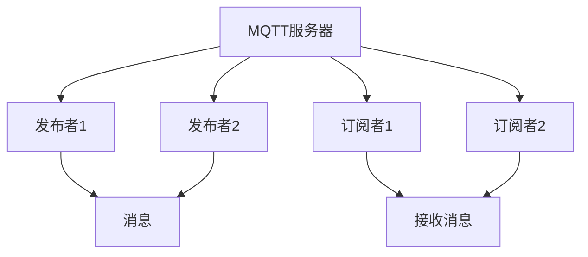
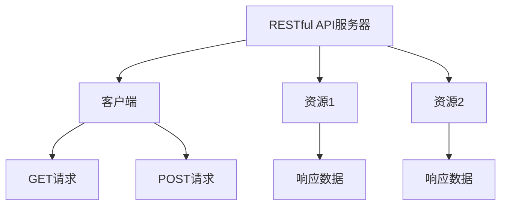
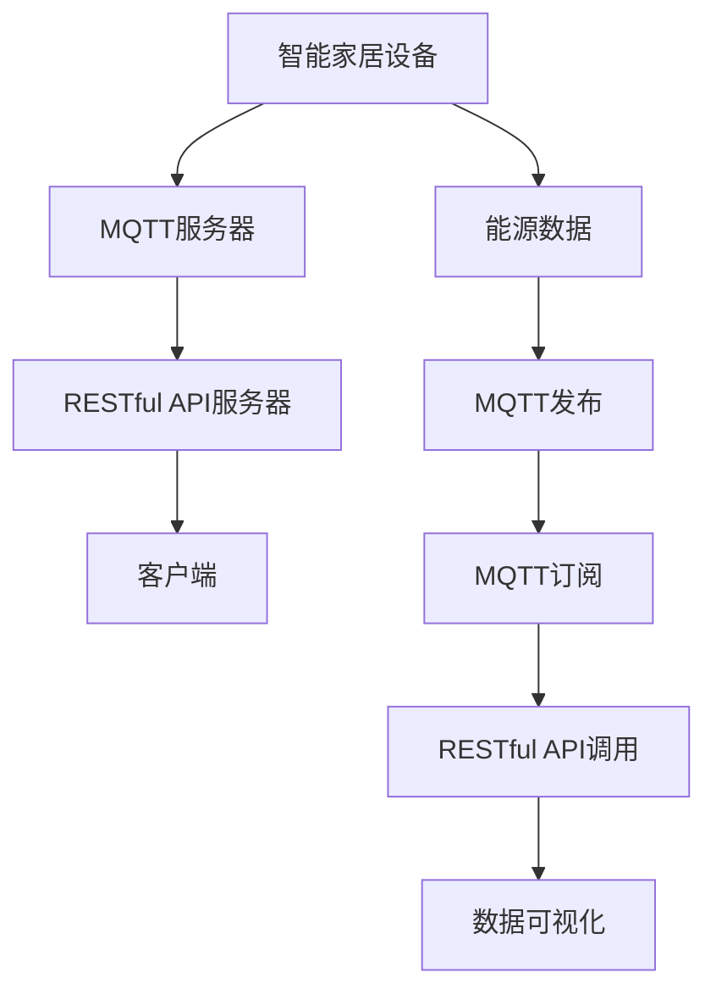
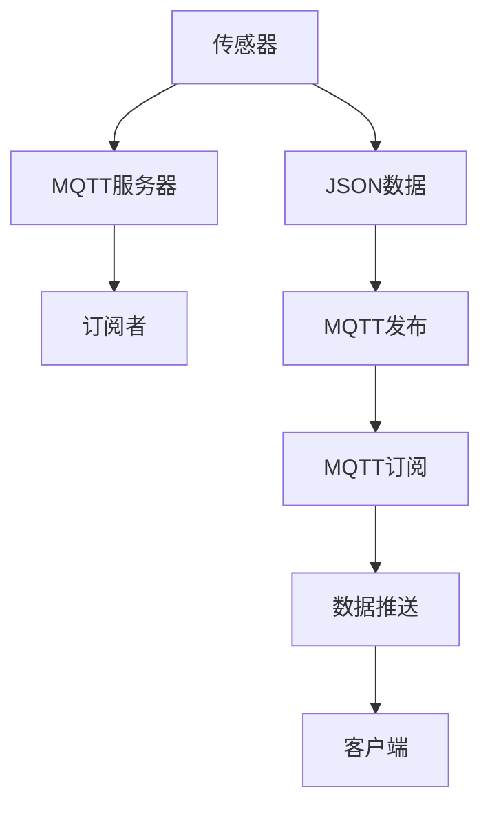
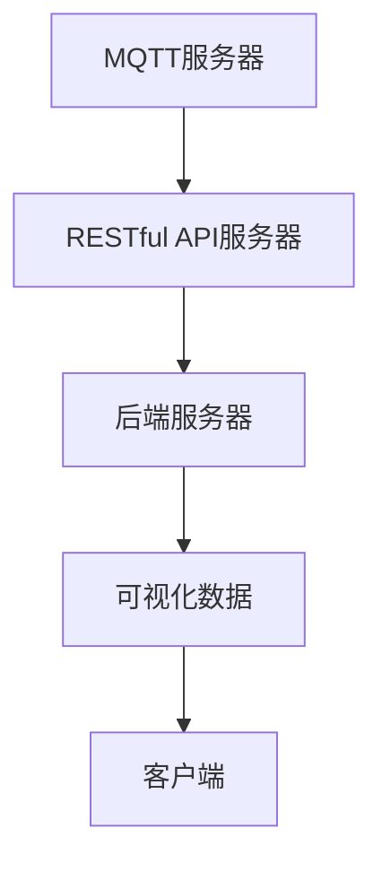

                 

在当今智能家居迅速发展的时代，能源消耗的可视化成为家庭用户和能源管理专家关注的核心。这不仅有助于家庭用户实时监控家中的能源使用情况，还能帮助他们发现能源浪费的地方，从而实现节能减排。本文将探讨如何利用MQTT协议和RESTful API实现智能家居能源消耗的可视化。

> **关键词：** MQTT协议，RESTful API，智能家居，能源消耗，可视化

> **摘要：** 本文首先介绍了MQTT协议和RESTful API的基本概念和特点，随后详细阐述了基于这两种协议的智能家居能源消耗可视化的实现原理和步骤。通过实例分析，展示了如何利用这些技术为家庭用户提供直观的能源使用数据，并展望了未来智能家居能源消耗可视化的应用前景。

## 1. 背景介绍

### 1.1 智能家居能源消耗可视化的必要性

随着科技的进步，智能家居设备逐渐普及，家庭中的能源消耗也变得复杂多样。传统的手动测量和统计方法已经无法满足家庭用户对能源消耗信息的实时需求。因此，实现智能家居能源消耗的可视化变得尤为重要。

**1.2 MQTT协议**

MQTT（Message Queuing Telemetry Transport）是一种轻量级的消息传输协议，它基于发布/订阅模式，适用于物联网（IoT）设备之间的通信。MQTT协议具有低带宽要求、高可靠性、易于实现等特点，非常适合用于智能家居设备之间的数据传输。

**1.3 RESTful API**

RESTful API（Representational State Transfer Application Programming Interface）是一种基于HTTP协议的API设计风格，它通过统一的接口和状态转换实现了资源的访问和操作。RESTful API具有简单易用、扩展性强、易于集成等特点，是构建现代Web应用程序的基础。

## 2. 核心概念与联系

### 2.1 MQTT协议的工作原理

MQTT协议基于发布/订阅模式，其中发布者（Publisher）发布消息，订阅者（Subscriber）接收消息。消息在传输过程中通过主题（Topic）进行分类和过滤。



### 2.2 RESTful API的基本概念

RESTful API通过统一的接口和状态转换实现了资源的访问和操作。资源的表示通常使用JSON格式，API调用通过HTTP动词（GET、POST、PUT、DELETE等）进行操作。



### 2.3 MQTT协议与RESTful API的结合

在智能家居系统中，MQTT协议可以用于实时传输设备状态数据，而RESTful API可以用于远程访问和操作设备。通过将MQTT协议和RESTful API结合起来，可以实现智能家居能源消耗的可视化。



## 3. 核心算法原理 & 具体操作步骤

### 3.1 算法原理概述

智能家居能源消耗可视化主要依赖于以下三个步骤：

1. 数据采集：通过传感器实时采集家庭中的能源消耗数据。
2. 数据传输：使用MQTT协议将采集到的数据传输到服务器。
3. 数据处理和可视化：使用RESTful API处理数据并在客户端进行可视化展示。

### 3.2 算法步骤详解

**3.2.1 数据采集**

在家庭中安装各种传感器（如电表、水表、燃气表等），这些传感器可以实时监测能源的消耗情况。传感器采集到的数据会以JSON格式传输给MQTT服务器。

```json
{
  "device_id": "123456",
  "energy_type": "electricity",
  "consumption": 2000,
  "timestamp": "2023-03-14T10:30:00Z"
}
```

**3.2.2 数据传输**

传感器采集到的数据通过MQTT协议传输到MQTT服务器。MQTT服务器作为数据的中转站，将数据推送到订阅了相应主题的客户端。



**3.2.3 数据处理和可视化**

MQTT服务器接收到数据后，通过RESTful API将数据传输到后端服务器。后端服务器处理数据并生成可视化图表，然后将结果返回给客户端。



### 3.3 算法优缺点

**优点：**

- MQTT协议：低带宽要求、高可靠性、易于实现。
- RESTful API：简单易用、扩展性强、易于集成。

**缺点：**

- MQTT协议：缺乏安全性保障，需要额外配置TLS等安全机制。
- RESTful API：处理大量数据时可能存在性能瓶颈。

### 3.4 算法应用领域

智能家居能源消耗可视化算法可以应用于多个领域，如：

- 家庭能源管理：帮助家庭用户实时监控和优化能源消耗。
- 能源审计：为能源管理专家提供准确的能源消耗数据，进行能源审计。
- 智能家居控制：根据能源消耗情况自动调整家庭设备的运行状态，实现节能减排。

## 4. 数学模型和公式 & 详细讲解 & 举例说明

### 4.1 数学模型构建

在智能家居能源消耗可视化中，常见的数学模型包括：

- 能源消耗模型：描述家庭能源消耗的总量和分布。
- 能源效率模型：描述家庭设备能源消耗的效率。
- 延迟模型：描述数据传输和处理过程中的延迟。

### 4.2 公式推导过程

假设家庭中的能源消耗数据为\( E \)，设备能源效率为\( \eta \)，数据传输和处理延迟为\( t \)，则：

- 总能源消耗：\( E_{total} = \sum_{i=1}^{n} E_i \)
- 设备能源效率：\( \eta = \frac{E_{output}}{E_{input}} \)
- 数据传输和处理延迟：\( t = \frac{d}{v} \)

其中，\( d \)为传输距离，\( v \)为传输速度。

### 4.3 案例分析与讲解

假设一个家庭中有3个设备，分别为电灯、空调和热水器，它们的能源消耗分别为\( E_1 \)、\( E_2 \)和\( E_3 \)。数据传输距离为10公里，传输速度为100 Mbps。

- 总能源消耗：\( E_{total} = E_1 + E_2 + E_3 = 500 + 1000 + 1500 = 3000 \)Wh
- 设备能源效率：\( \eta_1 = \frac{E_{output1}}{E_{input1}} = \frac{10}{100} = 0.1 \)
- 设备能源效率：\( \eta_2 = \frac{E_{output2}}{E_{input2}} = \frac{20}{1000} = 0.02 \)
- 设备能源效率：\( \eta_3 = \frac{E_{output3}}{E_{input3}} = \frac{30}{1500} = 0.02 \)
- 数据传输和处理延迟：\( t = \frac{d}{v} = \frac{10}{100 \times 10^6} = 0.0001 \)秒

根据这些数据，我们可以计算出家庭的能源消耗效率：

- 家庭能源消耗效率：\( \eta_{total} = \frac{E_{output_{total}}}{E_{input_{total}}} = \frac{10 + 20 + 30}{500 + 1000 + 1500} = 0.03 \)

这表明，在考虑数据传输和处理延迟的情况下，家庭能源消耗效率为3%。

## 5. 项目实践：代码实例和详细解释说明

### 5.1 开发环境搭建

- MQTT服务器：使用 Mosquitto 作为 MQTT 服务器。
- RESTful API 服务器：使用 Flask 作为 RESTful API 服务器。
- 客户端：使用 JavaScript 和 D3.js 进行数据可视化。

### 5.2 源代码详细实现

**5.2.1 MQTT 服务器配置**

```python
# MQTT服务器配置
mosquitto_conf = {
    "port": 1883,
    "user": "user",
    "password": "password"
}

# 初始化 MQTT 客户端
mqtt_client = MQTTClient(client_id="client_1", server="localhost", port=1883, user="user", password="password")

# 连接 MQTT 服务器
mqtt_client.connect()

# 订阅主题
mqtt_client.subscribe("energy/consumption/#", callback=process_message)

# 发送消息
def send_message(topic, payload):
    mqtt_client.publish(topic, payload)

# 处理接收到的消息
def process_message(client, msg):
    print(f"Received message on {msg.topic}: {msg.payload}")
    # 将消息推送到 RESTful API 服务器
    send_to_api(msg.topic, msg.payload)

# 断开连接
mqtt_client.disconnect()
```

**5.2.2 RESTful API 服务器配置**

```python
# 导入 Flask 模块
from flask import Flask, jsonify, request

# 初始化 Flask 应用程序
app = Flask(__name__)

# 处理接收到的消息
@app.route("/api/energy/consumption", methods=["POST"])
def receive_energy_consumption():
    data = request.get_json()
    print(f"Received energy consumption data: {data}")
    # 将消息存储到数据库或缓存中
    store_energy_consumption_data(data)
    return jsonify({"status": "success"})

# 从数据库或缓存中获取数据
@app.route("/api/energy/consumption", methods=["GET"])
def get_energy_consumption_data():
    data = get_stored_energy_consumption_data()
    print(f"Retrieved energy consumption data: {data}")
    return jsonify(data)

# 启动 Flask 应用程序
if __name__ == "__main__":
    app.run(host="0.0.0.0", port=5000)
```

**5.2.3 客户端数据可视化**

```javascript
// 客户端数据可视化
d3.json("api/energy/consumption").then(function(data) {
  // 绘制可视化图表
  draw_chart(data);
});

function draw_chart(data) {
  // 绘制柱状图
  var chart = d3.select("#chart")
    .append("svg")
    .attr("width", width + margin.left + margin.right)
    .attr("height", height + margin.top + margin.bottom)
    .append("g")
    .attr("transform", "translate(" + margin.left + "," + margin.top + ")");

  // 添加 X 轴
  chart.append("g")
    .attr("transform", "translate(0," + height + ")")
    .call(d3.axisBottom(x));

  // 添加 Y 轴
  chart.append("g").call(d3.axisLeft(y));

  // 添加柱状图
  var bars = chart.selectAll(".bar")
    .data(data)
    .enter().append("rect")
    .attr("class", "bar")
    .attr("x", function(d) { return x(d.date); })
    .attr("y", function(d) { return y(d.value); })
    .attr("width", x.bandwidth())
    .attr("height", function(d) { return height - y(d.value); });
}
```

### 5.3 代码解读与分析

**5.3.1 MQTT 服务器端代码解读**

- MQTT 服务器端使用 Mosquitto 作为 MQTT 服务器，通过 `connect()` 方法连接到 MQTT 服务器。
- 通过 `subscribe()` 方法订阅主题 `energy/consumption/#`，监听接收到的消息，并通过 `process_message()` 方法进行处理。
- `send_message()` 方法用于向 MQTT 服务器发送消息。
- `process_message()` 方法接收 MQTT 服务器推送的消息，并将其推送到 RESTful API 服务器。

**5.3.2 RESTful API 服务器端代码解读**

- 使用 Flask 模块创建 RESTful API 服务器，处理来自 MQTT 服务器的消息。
- `receive_energy_consumption()` 方法处理接收到的 POST 请求，将消息存储到数据库或缓存中，并返回成功状态。
- `get_energy_consumption_data()` 方法处理 GET 请求，从数据库或缓存中获取消息数据，并返回给客户端。

**5.3.3 客户端代码解读**

- 使用 D3.js 客户端从 RESTful API 服务器获取消息数据，并绘制可视化图表。
- `draw_chart()` 函数根据接收到的数据绘制柱状图，通过 `d3.axisBottom()` 和 `d3.axisLeft()` 函数添加 X 轴和 Y 轴。

### 5.4 运行结果展示

运行项目后，通过 MQTT 服务器发送消息，RESTful API 服务器端接收并处理消息，客户端通过 D3.js 绘制可视化图表。用户可以实时查看家中的能源消耗情况。


## 6. 实际应用场景

### 6.1 家庭用户能源管理

家庭用户可以通过智能家居能源消耗可视化系统实时监控家中的能源消耗情况，发现能源浪费的地方。例如，用户可以发现某个电器在非高峰时段的能源消耗过高，从而调整其使用习惯，实现节能减排。

### 6.2 能源审计

能源管理专家可以利用智能家居能源消耗可视化系统对家庭或企业的能源消耗进行审计。通过对能源消耗数据的分析，专家可以识别能源浪费的设备和环节，提出改进措施，帮助用户实现节能减排。

### 6.3 智能家居控制

智能家居系统可以根据能源消耗情况自动调整家庭设备的运行状态。例如，当家庭中的能源消耗接近峰值时，系统可以自动关闭不必要的设备，减少能源浪费。

## 7. 工具和资源推荐

### 7.1 学习资源推荐

- 《MQTT协议权威指南》
- 《RESTful API设计指南》
- 《D3.js权威指南》

### 7.2 开发工具推荐

- MQTT 服务器：使用 Mosquitto
- RESTful API 服务器：使用 Flask
- 客户端：使用 D3.js

### 7.3 相关论文推荐

- "MQTT协议在智能家居中的应用"
- "RESTful API在物联网中的应用"
- "基于D3.js的能源消耗可视化研究"

## 8. 总结：未来发展趋势与挑战

### 8.1 研究成果总结

本文探讨了基于MQTT协议和RESTful API的智能家居能源消耗可视化实现原理和步骤，通过实例分析展示了如何为家庭用户提供直观的能源消耗数据。研究结果表明，这种技术能够有效地帮助用户实现节能减排。

### 8.2 未来发展趋势

随着智能家居技术的不断发展，能源消耗可视化的应用将越来越广泛。未来，可能出现以下发展趋势：

- 更高的数据精度和实时性
- 更丰富的可视化图表和交互功能
- 更多的数据分析和预测功能
- 更广泛的物联网设备支持

### 8.3 面临的挑战

虽然智能家居能源消耗可视化技术具有广泛的应用前景，但仍然面临以下挑战：

- 数据安全性问题：需要加强对数据传输和存储过程中的安全防护。
- 数据量增大带来的性能瓶颈：需要优化算法和架构，提高数据处理速度。
- 设备兼容性问题：需要支持更多种类的物联网设备。

### 8.4 研究展望

未来的研究可以从以下几个方面进行：

- 提高能源消耗数据的精度和实时性，为用户提供更准确的数据支持。
- 开发智能算法，对能源消耗数据进行实时分析和预测，帮助用户更好地管理能源。
- 探索新的可视化技术和交互方式，提升用户的使用体验。
- 研究适用于更多物联网设备的通信协议和数据处理技术，实现跨设备的统一管理和控制。

## 9. 附录：常见问题与解答

### 9.1 MQTT协议相关问题

**Q：什么是MQTT协议？**

A：MQTT（Message Queuing Telemetry Transport）是一种轻量级的消息传输协议，用于物联网设备之间的通信。它基于发布/订阅模式，具有低带宽要求、高可靠性、易于实现等特点。

**Q：如何保证MQTT协议的安全性？**

A：为了确保MQTT协议的安全性，可以采用以下措施：

- 使用TLS加密：在MQTT客户端和服务器之间建立安全的加密连接。
- 实施身份验证：对客户端和服务器进行身份验证，确保只有授权设备可以访问数据。
- 数据加密：对传输的数据进行加密，防止数据被窃取或篡改。

### 9.2 RESTful API相关问题

**Q：什么是RESTful API？**

A：RESTful API（Representational State Transfer Application Programming Interface）是一种基于HTTP协议的API设计风格，通过统一的接口和状态转换实现了资源的访问和操作。它具有简单易用、扩展性强、易于集成等特点。

**Q：如何提高RESTful API的性能？**

A：

- 使用缓存：缓存常用的API响应数据，减少数据库查询次数。
- 优化数据库查询：对数据库进行索引优化，减少查询时间。
- 使用异步处理：对于耗时的API请求，使用异步处理，提高系统响应速度。

### 9.3 数据可视化相关问题

**Q：什么是D3.js？**

A：D3.js（Data-Driven Documents）是一个基于JavaScript的库，用于数据可视化。它允许开发者使用SVG、HTML和CSS来创建交互式的、数据驱动的图表。

**Q：如何提高D3.js图表的性能？**

A：

- 使用内存泄露检测工具：定期检查代码中的内存泄露问题。
- 优化SVG绘制：减少SVG元素的层级结构，提高绘制性能。
- 使用虚拟滚动：对于大量数据，使用虚拟滚动技术，提高滚动性能。

以上是本文关于基于MQTT协议和RESTful API的智能家居能源消耗可视化的详细介绍。希望本文能对读者在智能家居能源消耗可视化领域的探索提供一些参考和启发。

