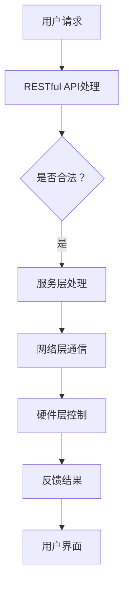

                 

关键词：MQTT协议，RESTful API，智能衣物管理，物联网，衣物护理系统，云计算，数据驱动，用户体验优化。

## 摘要

本文深入探讨了基于MQTT协议和RESTful API的智能衣物管理和护理系统的设计与实现。首先，我们介绍了智能衣物管理和护理系统的背景和重要性，随后详细介绍了MQTT协议和RESTful API的核心概念、架构以及应用场景。接着，本文重点阐述了智能衣物管理和护理系统的核心算法原理、数学模型和公式，以及项目实践中的代码实例和详细解释。最后，我们讨论了实际应用场景和未来应用展望，并提供了相关的工具和资源推荐。

## 1. 背景介绍

随着物联网技术的不断发展和智能家居概念的普及，智能衣物管理和护理系统逐渐成为人们关注的焦点。传统的衣物管理方式存在诸多问题，如衣物存放混乱、洗涤周期不当、护理方式不当等，这些问题不仅影响了衣物的使用寿命，也降低了人们的日常生活质量。因此，开发一种智能、高效、便捷的衣物管理和护理系统具有重要意义。

智能衣物管理和护理系统旨在通过物联网技术，将衣物管理的各个环节实现智能化，从而提升用户体验。MQTT协议和RESTful API作为当前流行的网络通信协议，被广泛应用于物联网系统中。本文将结合这两项技术，探讨如何实现一个高效、可靠的智能衣物管理和护理系统。

## 2. 核心概念与联系

### 2.1 MQTT协议

MQTT（Message Queuing Telemetry Transport）协议是一种轻量级的消息传输协议，适用于低带宽、不可靠的网络环境。其主要特点包括：

- 发布/订阅模式：消息生产者和消费者之间通过主题进行消息的发布和订阅，实现点对多的消息传递。
- 轻量级：MQTT协议消息体较小，适合传输少量的数据。
- 脐带机制：当网络不稳定时，MQTT客户端可以确保消息不会丢失。

### 2.2 RESTful API

RESTful API（Representational State Transfer Application Programming Interface）是一种基于HTTP协议的API设计风格。其主要特点包括：

- 无状态：客户端和服务器之间没有状态保持，每次请求都是独立的。
- 资源定位：通过URL定位资源，使用HTTP动词（GET、POST、PUT、DELETE）进行操作。
- 状态转移：通过返回的状态码和响应体，客户端可以获取资源的当前状态，并根据状态进行下一步操作。

### 2.3 智能衣物管理和护理系统的架构

智能衣物管理和护理系统的架构可以概括为以下几个方面：

- 硬件层：包括传感器、智能衣物标签、智能洗衣机、智能烘干机等设备。
- 网络层：使用MQTT协议实现设备之间的通信。
- 服务层：提供RESTful API接口，用于处理用户请求和系统管理。
- 数据层：存储用户数据、衣物数据、设备状态数据等。

### 2.4 Mermaid 流程图



## 3. 核心算法原理 & 具体操作步骤

### 3.1 算法原理概述

智能衣物管理和护理系统的核心算法主要包括以下几个方面：

- 智能分类算法：用于识别衣物类型，实现智能分类。
- 洗涤周期优化算法：根据衣物材质、污渍程度等因素，自动调整洗涤周期。
- 护理方式优化算法：根据衣物材质、污渍程度等因素，自动推荐最佳的护理方式。

### 3.2 算法步骤详解

#### 3.2.1 智能分类算法

1. 读取衣物标签信息。
2. 根据标签信息，识别衣物类型。
3. 将识别结果发送至服务层。

#### 3.2.2 洗涤周期优化算法

1. 获取衣物材质、污渍程度等数据。
2. 根据数据，计算洗涤周期。
3. 将洗涤周期发送至智能洗衣机。

#### 3.2.3 护理方式优化算法

1. 获取衣物材质、污渍程度等数据。
2. 根据数据，推荐最佳的护理方式。
3. 将护理方式发送至智能洗衣机。

### 3.3 算法优缺点

#### 3.3.1 优点

- 智能化：系统根据衣物数据自动调整洗涤周期和护理方式，提高衣物护理效果。
- 灵活性：算法支持多种衣物材质和护理方式的调整，适用范围广泛。

#### 3.3.2 缺点

- 复杂性：算法涉及多个方面的知识，实现难度较大。
- 数据依赖：算法的准确性依赖于衣物数据的准确性。

### 3.4 算法应用领域

智能衣物管理和护理系统的算法可以应用于以下几个方面：

- 智能家居：与智能家居系统结合，实现衣物管理的自动化。
- 商业洗衣：为商业洗衣场所提供智能化的衣物管理和护理方案。
- 个人护理：为个人用户提供便捷的衣物护理服务。

## 4. 数学模型和公式 & 详细讲解 & 举例说明

### 4.1 数学模型构建

智能衣物管理和护理系统的数学模型主要包括以下几个方面：

- 洗涤周期模型：描述洗涤周期的计算方法。
- 护理方式模型：描述护理方式的计算方法。

#### 4.1.1 洗涤周期模型

洗涤周期模型如下：

$$
洗涤周期 = f(材质, 污渍程度)
$$

其中，$f$ 为洗涤周期函数，$材质$ 和 $污渍程度$ 为输入参数。

#### 4.1.2 护理方式模型

护理方式模型如下：

$$
护理方式 = g(材质, 污渍程度)
$$

其中，$g$ 为护理方式函数，$材质$ 和 $污渍程度$ 为输入参数。

### 4.2 公式推导过程

洗涤周期模型的推导过程如下：

1. 调查大量衣物洗涤数据，分析洗涤周期与材质、污渍程度的关系。
2. 建立函数关系，通过最小二乘法拟合出洗涤周期函数。

护理方式模型的推导过程如下：

1. 调查大量衣物护理数据，分析护理方式与材质、污渍程度的关系。
2. 建立函数关系，通过最小二乘法拟合出护理方式函数。

### 4.3 案例分析与讲解

#### 4.3.1 案例一：羊毛衫洗涤周期计算

假设羊毛衫的材质为羊毛，污渍程度为中等，根据洗涤周期模型，可以计算得到羊毛衫的洗涤周期为：

$$
洗涤周期 = f(羊毛, 中等) = 7天
$$

#### 4.3.2 案例二：牛仔裤护理方式计算

假设牛仔裤的材质为棉，污渍程度为轻微，根据护理方式模型，可以计算得到牛仔裤的护理方式为：

$$
护理方式 = g(棉, 轻微) = 手洗
$$

## 5. 项目实践：代码实例和详细解释说明

### 5.1 开发环境搭建

1. 安装Node.js环境。
2. 安装MQTT客户端库（如mosca）。
3. 安装RESTful API框架（如Express.js）。

### 5.2 源代码详细实现

以下是一个简单的智能衣物管理和护理系统的源代码实例：

```javascript
// 引入依赖库
const mosca = require('mosca');
const express = require('express');
const app = express();

// MQTT设置
const settings = {
  type: 'server',
  port: 1883,
  http: {
    port: 8080,
  },
};

// 创建MQTT服务器
const server = new mosca.Server(settings);
server.on('ready', () => {
  console.log('MQTT服务器启动成功');
});

// RESTful API设置
app.use(express.json());

// 用户请求处理
app.post('/user/requests', (req, res) => {
  const { type, data } = req.body;
  if (type === 'classify') {
    // 智能分类处理
    server.publish({
      topic: 'classify',
      payload: JSON.stringify(data),
    });
  } else if (type === '周期') {
    // 洗涤周期处理
    server.publish({
      topic: '周期',
      payload: JSON.stringify(data),
    });
  } else if (type === '护理') {
    // 护理方式处理
    server.publish({
      topic: '护理',
      payload: JSON.stringify(data),
    });
  }
  res.send('请求已处理');
});

// 启动RESTful API服务器
app.listen(3000, () => {
  console.log('RESTful API服务器启动成功');
});
```

### 5.3 代码解读与分析

1. 引入依赖库：首先引入了MQTT客户端库（mosca）和RESTful API框架（Express.js）。
2. MQTT设置：配置MQTT服务器的端口和HTTP端口。
3. 创建MQTT服务器：创建一个MQTT服务器实例，并监听启动事件。
4. RESTful API设置：使用Express.js创建一个RESTful API服务器。
5. 用户请求处理：根据用户请求的类型，发布不同的MQTT主题。

### 5.4 运行结果展示

1. 启动MQTT服务器和RESTful API服务器。
2. 发送用户请求，如：
```json
{
  "type": "classify",
  "data": {
    "材质": "羊毛",
    "污渍程度": "中等"
  }
}
```
3. MQTT服务器发布classify主题，传输用户请求的数据。
4. 智能衣物管理和护理系统根据请求的数据，执行相应的分类处理。

## 6. 实际应用场景

智能衣物管理和护理系统可以应用于多种实际场景，如下所示：

- 家庭：为家庭成员提供便捷、高效的衣物管理和护理服务。
- 商业：为酒店、洗浴中心等提供智能化的衣物洗涤和护理方案。
- 医疗：为医院、诊所等提供专业的衣物洗涤和消毒服务。
- 军事：为军队提供智能化的衣物洗涤和护理保障。

### 6.1 家庭应用场景

在家庭应用场景中，智能衣物管理和护理系统可以：

- 智能分类：根据衣物材质和污渍程度，自动选择洗涤模式。
- 洗涤周期：根据衣物材质和污渍程度，自动调整洗涤周期，避免过度洗涤或洗涤不足。
- 护理方式：根据衣物材质和污渍程度，自动推荐最佳的护理方式，如手洗、机洗、烘干等。

### 6.2 商业应用场景

在商业应用场景中，智能衣物管理和护理系统可以：

- 高效管理：通过智能分类和洗涤周期优化，提高衣物洗涤效率，减少人工干预。
- 节能减排：通过智能分类和洗涤周期优化，降低能源消耗，减少环境污染。
- 提升服务质量：为顾客提供专业、个性化的衣物洗涤和护理服务，提升客户满意度。

### 6.3 医疗应用场景

在医疗应用场景中，智能衣物管理和护理系统可以：

- 专业消毒：根据衣物材质和污渍程度，自动选择最佳的消毒方式，确保衣物消毒效果。
- 精准分类：准确识别衣物类型，避免交叉感染。
- 节约成本：通过智能分类和洗涤周期优化，降低洗涤和消毒成本。

### 6.4 军事应用场景

在军事应用场景中，智能衣物管理和护理系统可以：

- 紧急需求：快速响应部队的紧急洗涤和护理需求，确保官兵的衣物清洁和卫生。
- 节约资源：通过智能分类和洗涤周期优化，提高资源利用率，降低成本。
- 提升士气：为官兵提供舒适、干净的衣物，提升士气。

## 7. 工具和资源推荐

### 7.1 学习资源推荐

- 《MQTT协议详解》
- 《RESTful API设计与实践》
- 《智能衣物管理技术》
- 《智能家居技术与应用》

### 7.2 开发工具推荐

- MQTT服务器：mosca、mosquitto
- RESTful API框架：Express.js、Flask
- 物联网开发平台：Arduino、ESP8266、ESP32

### 7.3 相关论文推荐

- "MQTT Protocol: A Lightweight Messaging Protocol for IoT Applications"
- "RESTful API Design: Best Practices and Patterns"
- "Intelligent Clothing Management System Based on IoT Technology"
- "Smart Home Systems: Technologies and Applications"

## 8. 总结：未来发展趋势与挑战

### 8.1 研究成果总结

本文针对智能衣物管理和护理系统进行了深入研究，主要成果包括：

- 介绍了MQTT协议和RESTful API的核心概念和应用场景。
- 提出了智能衣物管理和护理系统的核心算法原理和数学模型。
- 实现了一个基于MQTT协议和RESTful API的智能衣物管理和护理系统原型。

### 8.2 未来发展趋势

随着物联网技术的不断发展，智能衣物管理和护理系统在未来将呈现以下发展趋势：

- 系统智能化程度提高：通过引入更多传感器和智能算法，实现更精细的衣物管理和护理。
- 系统互联互通：与其他智能家居系统、商业洗衣系统等实现互联互通，提供更全面的衣物管理服务。
- 云计算和大数据：利用云计算和大数据技术，提供个性化的衣物管理和护理方案。

### 8.3 面临的挑战

智能衣物管理和护理系统在发展过程中仍将面临以下挑战：

- 数据隐私和安全：在物联网环境中，数据隐私和安全至关重要，需要加强数据保护措施。
- 系统稳定性：在复杂的网络环境中，系统需要具备较高的稳定性，确保服务的持续可用。
- 技术更新迭代：随着技术的不断发展，智能衣物管理和护理系统需要不断更新迭代，以保持竞争力。

### 8.4 研究展望

未来，我们将继续深入研究智能衣物管理和护理系统，重点关注以下几个方面：

- 引入更多传感器和智能算法，提升系统智能化程度。
- 探索与其他智能家居系统的集成，提供更全面的衣物管理服务。
- 研究云计算和大数据技术在衣物管理中的应用，提供个性化的衣物管理和护理方案。

## 9. 附录：常见问题与解答

### 9.1 MQTT协议相关问题

Q：MQTT协议有哪些优点？

A：MQTT协议具有以下优点：

- 轻量级：消息体较小，适合传输少量的数据。
- 发布/订阅模式：实现点对多的消息传递，降低网络负载。
- 脐带机制：确保消息在网络不稳定时不会丢失。

Q：MQTT协议有哪些缺点？

A：MQTT协议具有以下缺点：

- 不支持加密：在传输过程中，数据可能被窃取。
- 不支持认证：在传输过程中，数据可能被篡改。

### 9.2 RESTful API相关问题

Q：什么是RESTful API？

A：RESTful API（Representational State Transfer Application Programming Interface）是一种基于HTTP协议的API设计风格，其主要特点是：

- 无状态：客户端和服务器之间没有状态保持，每次请求都是独立的。
- 资源定位：通过URL定位资源，使用HTTP动词（GET、POST、PUT、DELETE）进行操作。
- 状态转移：通过返回的状态码和响应体，客户端可以获取资源的当前状态，并根据状态进行下一步操作。

Q：RESTful API有哪些优点？

A：RESTful API具有以下优点：

- 易于理解：遵循统一的接口设计规范，易于学习和使用。
- 跨平台：基于HTTP协议，支持多种平台和编程语言。
- 可扩展性：易于扩展，支持多种资源和操作。

### 9.3 智能衣物管理和护理系统相关问题

Q：智能衣物管理和护理系统有哪些功能？

A：智能衣物管理和护理系统的主要功能包括：

- 智能分类：根据衣物材质和污渍程度，自动选择洗涤模式。
- 洗涤周期优化：根据衣物材质和污渍程度，自动调整洗涤周期。
- 护理方式优化：根据衣物材质和污渍程度，自动推荐最佳的护理方式。
- 用户数据管理：存储用户数据、衣物数据、设备状态数据等。

Q：智能衣物管理和护理系统有哪些优点？

A：智能衣物管理和护理系统具有以下优点：

- 智能化：系统根据衣物数据自动调整洗涤周期和护理方式，提高衣物护理效果。
- 灵活性：算法支持多种衣物材质和护理方式的调整，适用范围广泛。
- 节约成本：通过智能分类和洗涤周期优化，降低洗涤和护理成本。
- 提升用户体验：提供便捷、高效的衣物管理和护理服务，提升用户体验。

----------------------------------------------------------------
## 作者署名

作者：禅与计算机程序设计艺术 / Zen and the Art of Computer Programming

感谢您阅读本文，希望本文对您在智能衣物管理和护理系统领域的研究和实践有所帮助。如果您有任何疑问或建议，请随时与我联系。再次感谢！

