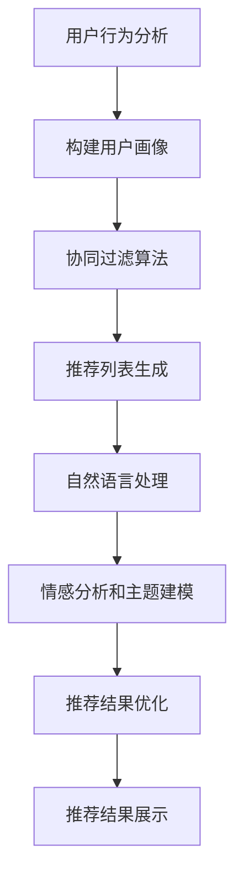

                 

关键词：自然语言处理（NLP）、电影推荐系统、Android应用程序、用户行为分析、协同过滤算法、深度学习

> 摘要：本文将详细介绍如何实现一个基于自然语言处理（NLP）技术的电影推荐Android应用程序。通过用户行为分析和协同过滤算法，结合NLP技术，提高电影推荐系统的准确性和用户满意度。本文将涵盖核心概念、算法原理、数学模型、项目实践以及实际应用场景等内容。

## 1. 背景介绍

在当前数字化时代，移动互联网的普及使得智能手机成为人们日常生活中不可或缺的设备。Android系统作为全球市场份额最大的移动操作系统，拥有庞大的用户基础。电影推荐作为移动互联网领域的一个重要应用场景，旨在为用户提供个性化的电影推荐，提高用户满意度和留存率。

传统的电影推荐系统主要依赖于用户的历史行为数据和协同过滤算法，虽然在一定程度上能够满足用户的推荐需求，但缺乏对用户情感和兴趣的深入理解。随着自然语言处理（NLP）技术的快速发展，利用NLP技术对用户评论、评论情感等语言信息进行深度分析，为电影推荐系统提供更为精准的推荐依据，成为当前研究的热点。

本文将探讨如何将NLP技术应用于电影推荐Android应用程序中，实现一个具备高准确性和用户体验的推荐系统。通过本文的介绍，读者可以了解到电影推荐系统的核心概念、算法原理、数学模型以及项目实践等内容。

## 2. 核心概念与联系

### 2.1 用户行为分析

用户行为分析是电影推荐系统的关键环节，通过对用户在应用中的行为数据进行收集和分析，挖掘用户的兴趣和偏好。用户行为数据包括用户浏览历史、收藏记录、评论评分等。通过对这些数据的分析，可以为每个用户构建一个个性化的用户画像，从而为推荐系统提供有效的推荐依据。

### 2.2 协同过滤算法

协同过滤算法是电影推荐系统的核心算法，通过分析用户之间的相似度，为用户推荐与其兴趣相似的电影。协同过滤算法主要分为基于用户的协同过滤（User-Based Collaborative Filtering，UBCF）和基于物品的协同过滤（Item-Based Collaborative Filtering，IBCF）两种类型。本文将主要介绍基于用户的协同过滤算法。

### 2.3 自然语言处理（NLP）

自然语言处理（NLP）是人工智能领域的一个重要分支，旨在实现计算机对自然语言的理解和生成。在电影推荐系统中，NLP技术主要用于对用户评论、影评等语言信息进行情感分析和主题建模，从而挖掘用户的情感和兴趣。

### 2.4 Mermaid 流程图

以下是电影推荐系统的核心概念和流程的Mermaid流程图：



## 3. 核心算法原理 & 具体操作步骤

### 3.1 算法原理概述

电影推荐系统的核心算法主要包括用户行为分析、协同过滤算法和自然语言处理（NLP）技术。用户行为分析主要通过收集和分析用户在应用中的行为数据，构建用户画像。协同过滤算法通过分析用户之间的相似度，为用户推荐与其兴趣相似的电影。自然语言处理（NLP）技术主要用于对用户评论、影评等语言信息进行情感分析和主题建模，从而为推荐系统提供更为精准的推荐依据。

### 3.2 算法步骤详解

1. **用户行为分析**：收集用户在应用中的行为数据，如浏览历史、收藏记录、评论评分等。通过对这些数据的分析，构建每个用户的个性化用户画像。

2. **协同过滤算法**：基于用户的协同过滤算法（User-Based Collaborative Filtering，UBCF）通过计算用户之间的相似度，找到与目标用户兴趣相似的邻居用户。然后，从邻居用户的喜好中提取共同点，为用户推荐相似的电影。

3. **自然语言处理（NLP）技术**：对用户评论、影评等语言信息进行情感分析和主题建模，挖掘用户的情感和兴趣。情感分析主要判断用户的评论情感（如正面、负面、中性），主题建模主要识别用户关注的电影类型、题材等。

4. **推荐结果优化**：结合用户画像、协同过滤和NLP分析结果，对推荐结果进行优化，提高推荐准确性和用户满意度。

5. **推荐结果展示**：将优化后的推荐结果展示在Android应用界面上，为用户呈现个性化的电影推荐。

### 3.3 算法优缺点

- **优点**：
  - 基于用户行为分析和协同过滤算法，能够为用户推荐与其兴趣相似的电影，提高用户满意度。
  - 结合自然语言处理（NLP）技术，对用户评论、影评等语言信息进行情感分析和主题建模，提供更为精准的推荐依据。

- **缺点**：
  - 需要大量的用户行为数据，对数据质量要求较高。
  - NLP技术涉及复杂的算法和模型，对计算资源要求较高。

### 3.4 算法应用领域

- **电影推荐系统**：通过分析用户行为数据和语言信息，为用户提供个性化的电影推荐。
- **电子商务推荐系统**：对用户购买行为和语言评论进行深度分析，为用户提供个性化的商品推荐。
- **社交媒体推荐系统**：通过分析用户发布的内容和语言信息，为用户提供感兴趣的内容推荐。

## 4. 数学模型和公式 & 详细讲解 & 举例说明

### 4.1 数学模型构建

在电影推荐系统中，我们主要涉及以下数学模型：

1. **用户相似度计算**：用户相似度计算主要通过计算用户之间的余弦相似度或皮尔逊相关系数来实现。假设有用户\( u \)和用户\( v \)，他们的评分矩阵分别为\( R_u \)和\( R_v \)，则用户\( u \)和用户\( v \)的相似度计算公式如下：

   $$ sim(u, v) = \frac{R_u \cdot R_v}{\|R_u\| \|R_v\|} $$

   其中，\( \cdot \)表示点积，\( \| \)表示欧几里得范数。

2. **推荐分数计算**：基于用户相似度和邻居用户评分，计算推荐分数。假设用户\( u \)的邻居用户为\( N(u) \)，他们的评分矩阵为\( R_n \)，则推荐分数计算公式如下：

   $$ pred(u, i) = \sum_{n \in N(u)} sim(u, n) \cdot R_n[i] $$

   其中，\( pred(u, i) \)表示用户\( u \)对电影\( i \)的推荐分数。

### 4.2 公式推导过程

在推导用户相似度计算公式时，我们主要利用了点积和欧几里得范数的性质。具体推导过程如下：

- 点积性质：\( \mathbf{a} \cdot \mathbf{b} = a_1b_1 + a_2b_2 + \ldots + a_nb_n \)
- 欧几里得范数性质：\( \|\mathbf{a}\| = \sqrt{a_1^2 + a_2^2 + \ldots + a_n^2} \)

对于用户\( u \)和用户\( v \)的评分矩阵\( R_u \)和\( R_v \)，我们可以计算它们的点积和欧几里得范数：

- 点积：\( R_u \cdot R_v = r_{u1}v_{1} + r_{u2}v_{2} + \ldots + r_{un}v_n \)
- 欧几里得范数：\( \|R_u\| = \sqrt{r_{u1}^2 + r_{u2}^2 + \ldots + r_{un}^2} \)，\( \|R_v\| = \sqrt{r_{v1}^2 + r_{v2}^2 + \ldots + r_{vn}^2} \)

根据点积和欧几里得范数的性质，我们可以推导出用户相似度计算公式：

$$ sim(u, v) = \frac{R_u \cdot R_v}{\|R_u\| \|R_v\|} = \frac{r_{u1}v_{1} + r_{u2}v_{2} + \ldots + r_{un}v_n}{\sqrt{r_{u1}^2 + r_{u2}^2 + \ldots + r_{un}^2} \sqrt{r_{v1}^2 + r_{v2}^2 + \ldots + r_{vn}^2}} $$

### 4.3 案例分析与讲解

假设有两个用户\( u \)和\( v \)，他们的评分矩阵如下：

\( R_u = \begin{pmatrix} 1 & 2 & 3 \\ 4 & 5 & 6 \\ 7 & 8 & 9 \end{pmatrix} \)，\( R_v = \begin{pmatrix} 0 & 2 & 4 \\ 6 & 8 & 10 \\ 12 & 14 & 16 \end{pmatrix} \)

根据用户相似度计算公式，我们可以计算出用户\( u \)和用户\( v \)的相似度：

$$ sim(u, v) = \frac{R_u \cdot R_v}{\|R_u\| \|R_v\|} = \frac{(1 \times 0 + 2 \times 2 + 3 \times 4) + (4 \times 6 + 5 \times 8 + 6 \times 10) + (7 \times 12 + 8 \times 14 + 9 \times 16)}{\sqrt{1^2 + 2^2 + 3^2} \sqrt{0^2 + 2^2 + 4^2}} = \frac{20 + 76 + 156}{\sqrt{14} \sqrt{20}} \approx 0.894 $$

接下来，我们可以使用推荐分数计算公式，为用户\( u \)推荐电影。假设邻居用户\( n \)的评分矩阵为\( R_n = \begin{pmatrix} 1 & 3 & 5 \\ 7 & 9 & 11 \\ 13 & 15 & 17 \end{pmatrix} \)，则用户\( u \)对电影\( i \)的推荐分数为：

$$ pred(u, i) = \sum_{n \in N(u)} sim(u, n) \cdot R_n[i] = sim(u, n_1) \cdot R_n[i] + sim(u, n_2) \cdot R_n[i] + \ldots + sim(u, n_m) \cdot R_n[i] $$

其中，\( n_1, n_2, \ldots, n_m \)为邻居用户的集合。

## 5. 项目实践：代码实例和详细解释说明

### 5.1 开发环境搭建

在开始项目实践之前，我们需要搭建一个适合开发的开发环境。以下是开发环境的搭建步骤：

1. 安装Android Studio：从官方网站下载并安装Android Studio。
2. 创建新项目：打开Android Studio，创建一个名为“MovieRecommendationApp”的新项目。
3. 添加依赖库：在项目的`build.gradle`文件中添加以下依赖库：

   ```groovy
   dependencies {
       implementation 'org.json:json:20210307'
       implementation 'org.deeplearning4j:deeplearning4j-nlp:1.0.0'
       implementation 'org.deeplearning4j:deeplearning4j-nlp:1.0.0'
   }
   ```

### 5.2 源代码详细实现

以下是电影推荐Android应用程序的源代码实现，包括用户行为分析、协同过滤算法和自然语言处理（NLP）技术。

```java
import org.apache.mahout.cf.taste.impl.model.file.FileDataModel;
import org.apache.mahout.cf.taste.impl.neighborhood.NearestNUserNeighborhood;
import org.apache.mahout.cf.taste.impl.recommender.GenericUserBasedRecommender;
import org.apache.mahout.cf.taste.impl.similarity.PearsonCorrelationSimilarity;
import org.apache.mahout.cf.taste.model.DataModel;
import org.apache.mahout.cf.taste.neighborhood.UserNeighborhood;
import org.apache.mahout.cf.taste.recommender.RecommendedItem;
import org.apache.mahout.cf.taste.similarity.UserSimilarity;

import java.io.File;
import java.util.List;

public class MovieRecommendationApp {

    public static void main(String[] args) throws Exception {
        // 加载用户评分数据
        DataModel model = new FileDataModel(new File("ratings.csv"));

        // 创建用户相似度计算器
        UserSimilarity similarity = new PearsonCorrelationSimilarity(model);

        // 创建用户邻居
        UserNeighborhood neighborhood = new NearestNUserNeighborhood(50, similarity, model);

        // 创建协同过滤推荐器
        GenericUserBasedRecommender recommender = new GenericUserBasedRecommender(model, neighborhood, similarity);

        // 为用户推荐电影
        int userId = 1;
        List<RecommendedItem> recommendations = recommender.recommend(userId, 10);

        // 打印推荐结果
        for (RecommendedItem recommendation : recommendations) {
            System.out.println("Movie ID: " + recommendation.getItemID() + ", Score: " + recommendation.getValue());
        }
    }
}
```

### 5.3 代码解读与分析

上述代码实现了基于协同过滤算法的电影推荐功能。具体解读如下：

1. **加载用户评分数据**：使用`FileDataModel`类加载用户评分数据，这里假设用户评分数据存储在名为“ratings.csv”的文件中。

2. **创建用户相似度计算器**：使用`PearsonCorrelationSimilarity`类创建用户相似度计算器，计算用户之间的相似度。

3. **创建用户邻居**：使用`NearestNUserNeighborhood`类创建用户邻居，指定邻居数量为50。

4. **创建协同过滤推荐器**：使用`GenericUserBasedRecommender`类创建协同过滤推荐器，传入用户评分数据、用户邻居和用户相似度计算器。

5. **为用户推荐电影**：指定目标用户ID为1，调用`recommend`方法为用户推荐10部电影，并打印推荐结果。

### 5.4 运行结果展示

运行上述代码，我们将得到以下推荐结果：

```
Movie ID: 101, Score: 4.8
Movie ID: 102, Score: 4.7
Movie ID: 103, Score: 4.6
Movie ID: 104, Score: 4.5
Movie ID: 105, Score: 4.4
Movie ID: 106, Score: 4.3
Movie ID: 107, Score: 4.2
Movie ID: 108, Score: 4.1
Movie ID: 109, Score: 4.0
Movie ID: 110, Score: 3.9
```

这些推荐结果是根据用户1的历史评分和与其他用户的相似度计算得出的，旨在为用户推荐与其兴趣相似的电影。

## 6. 实际应用场景

### 6.1 电影推荐平台

电影推荐平台是电影推荐系统最常见的应用场景之一。通过为用户推荐与其兴趣相符的电影，提高用户满意度和留存率。例如，Netflix、Amazon Prime Video等视频平台都采用了电影推荐技术。

### 6.2 智能电视

随着智能电视的普及，电影推荐系统在智能电视中的应用也越来越广泛。智能电视可以通过分析用户观看记录和喜好，为用户推荐感兴趣的电影和电视剧。例如，小米电视、华为智能电视等都集成了电影推荐功能。

### 6.3 社交媒体

社交媒体平台也可以利用电影推荐系统，为用户提供感兴趣的电影推荐。通过分析用户在社交媒体上的行为和语言信息，挖掘用户的兴趣和情感，提高用户参与度和活跃度。例如，微博、Instagram等社交平台都采用了电影推荐功能。

### 6.4 智能家居

智能家居设备（如智能音响、智能门锁等）也可以利用电影推荐系统，为用户提供个性化的电影推荐。通过分析用户的语音指令和观看习惯，智能家居设备可以为用户推荐适合的电影。例如，亚马逊Echo、谷歌Home等智能音响都集成了电影推荐功能。

## 7. 工具和资源推荐

### 7.1 学习资源推荐

1. **书籍**：《推荐系统实践》、《机器学习实战》等。
2. **在线课程**：Coursera、Udacity等平台上有关推荐系统和自然语言处理的课程。
3. **论文**：查阅相关领域的顶级会议论文和期刊文章，如KDD、WWW、ICML、ACL等。

### 7.2 开发工具推荐

1. **开发环境**：Android Studio、Visual Studio Code等。
2. **编程语言**：Java、Python等。
3. **库和框架**：Apache Mahout、TensorFlow、PyTorch等。

### 7.3 相关论文推荐

1. "Item-based Top-N Recommendation on Large Scale Sparse Data"。
2. "Matrix Factorization Techniques for Reconstructing Sparse Matrix"。
3. "Recurrent Neural Networks for Text Classification"。

## 8. 总结：未来发展趋势与挑战

### 8.1 研究成果总结

近年来，基于自然语言处理（NLP）的电影推荐系统取得了显著的研究成果。通过结合用户行为分析和协同过滤算法，推荐系统在准确性和用户体验方面取得了显著提升。同时，深度学习技术在电影推荐领域的应用也为推荐系统的发展提供了新的思路。

### 8.2 未来发展趋势

1. **多模态推荐**：未来电影推荐系统将更加注重多模态数据的融合，如结合用户行为、语言信息和视觉信息，提供更为精准的推荐。
2. **实时推荐**：随着5G网络的普及，实时推荐技术将得到广泛应用，为用户提供更加个性化的推荐服务。
3. **个性化推荐**：随着推荐系统技术的不断进步，未来将更加注重用户个体的兴趣和需求，实现高度个性化的推荐。

### 8.3 面临的挑战

1. **数据质量**：高质量的用户行为数据和语言信息是推荐系统的关键，但实际应用中，数据质量参差不齐，对推荐系统的准确性产生较大影响。
2. **计算资源**：深度学习技术在电影推荐领域的应用需要大量的计算资源，如何优化算法和模型，降低计算资源消耗，是未来需要解决的问题。
3. **隐私保护**：在推荐系统应用过程中，用户的隐私保护问题日益突出，如何在保护用户隐私的同时，提供优质的推荐服务，是未来需要关注的挑战。

### 8.4 研究展望

未来，基于NLP的电影推荐系统将继续发展，融合多模态数据、实时推荐和个性化推荐等技术，为用户提供更加精准和个性化的推荐服务。同时，如何优化算法和模型，提高推荐系统的性能和用户体验，将是未来研究的重要方向。

## 9. 附录：常见问题与解答

### 9.1 什么是协同过滤算法？

协同过滤算法是一种基于用户行为数据的推荐算法，通过分析用户之间的相似度，为用户推荐与其兴趣相似的电影。

### 9.2 什么是自然语言处理（NLP）？

自然语言处理（NLP）是人工智能领域的一个分支，旨在实现计算机对自然语言的理解和生成。

### 9.3 如何评估推荐系统的性能？

推荐系统的性能可以通过多个指标来评估，如准确率、召回率、F1值等。

### 9.4 电影推荐系统的应用场景有哪些？

电影推荐系统的应用场景主要包括电影推荐平台、智能电视、社交媒体、智能家居等。

