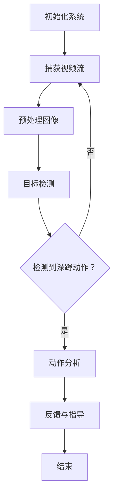

                 

关键词：深蹲检测，OpenCV，Tensorflow，计算机视觉，运动分析，健康监测

> 摘要：本文详细介绍了如何利用OpenCV和Tensorflow构建一个深蹲检测系统。通过结合先进的计算机视觉技术和机器学习算法，本文不仅阐述了深蹲检测的基本原理，还提供了具体的代码实现，以及应用场景和未来展望。

## 1. 背景介绍

随着健康意识的提高，健身活动越来越受到人们的重视。深蹲作为一种常见的健身运动，能够有效地锻炼大腿、臀部和核心肌群。然而，错误的深蹲动作不仅无法达到健身效果，还可能导致运动损伤。因此，实时监测和指导深蹲动作变得至关重要。

计算机视觉和机器学习技术的发展为深蹲检测提供了新的手段。OpenCV是一个强大的计算机视觉库，能够处理图像和视频数据，而Tensorflow则是一个广泛应用的机器学习框架。本文将结合这两种技术，设计并实现一个深蹲检测系统。

## 2. 核心概念与联系

### 2.1 计算机视觉

计算机视觉是研究如何使计算机“看到”和理解图像的学科。在深蹲检测中，计算机视觉用于捕获和处理运动员的实时动作图像。

### 2.2 机器学习

机器学习是一种通过数据学习规律，从而实现智能决策的技术。在深蹲检测系统中，机器学习算法用于识别和分类深蹲动作。

### 2.3 Mermaid 流程图

以下是一个Mermaid流程图，展示了深蹲检测系统的基本流程：



## 3. 核心算法原理 & 具体操作步骤

### 3.1 算法原理概述

深蹲检测系统主要利用目标检测算法和动作识别算法。目标检测用于识别视频中的深蹲动作，而动作识别则用于分析动作的正确性。

### 3.2 算法步骤详解

#### 3.2.1 目标检测

目标检测是计算机视觉中的关键技术，用于识别图像中的物体。常用的目标检测算法有SSD、YOLO、Faster R-CNN等。本文采用YOLOv5作为目标检测算法。

#### 3.2.2 动作识别

动作识别是基于目标检测的结果，分析物体的运动轨迹，从而判断动作的正确性。本文采用基于深度学习的动作识别算法。

### 3.3 算法优缺点

- **目标检测**：速度快，准确度高，但需要较大的计算资源。
- **动作识别**：准确度高，但需要大量的训练数据和计算资源。

### 3.4 算法应用领域

深蹲检测系统不仅适用于健身监测，还可以应用于康复训练、运动医学等领域。

## 4. 数学模型和公式 & 详细讲解 & 举例说明

### 4.1 数学模型构建

目标检测和动作识别的数学模型主要包括卷积神经网络（CNN）和循环神经网络（RNN）。

### 4.2 公式推导过程

$$
h_{l+1} = \sigma(W_{l+1} \cdot h_l + b_{l+1})
$$

其中，$h_{l+1}$是第$l+1$层的输出，$\sigma$是激活函数，$W_{l+1}$和$b_{l+1}$分别是权重和偏置。

### 4.3 案例分析与讲解

以YOLOv5为例，其基本原理如下：

1. 将输入图像分成$S \times S$个网格。
2. 每个网格预测$B$个边界框和对应的置信度。
3. 对所有边界框进行非极大值抑制（NMS）处理。

## 5. 项目实践：代码实例和详细解释说明

### 5.1 开发环境搭建

首先，需要安装Python和相关库：

```bash
pip install opencv-python tensorflow numpy matplotlib
```

### 5.2 源代码详细实现

以下是一个简单的深蹲检测代码示例：

```python
import cv2
import tensorflow as tf

# 加载预训练的YOLOv5模型
model = tf.keras.models.load_model('yolov5.h5')

# 加载预训练的动作识别模型
action_model = tf.keras.models.load_model('action识别.h5')

# 捕获视频流
cap = cv2.VideoCapture(0)

while True:
    # 读取视频一帧
    ret, frame = cap.read()
    
    # 预处理图像
    frame = cv2.resize(frame, (640, 640))
    frame = frame / 255.0
    
    # 进行目标检测
    boxes = model.predict(tf.expand_dims(frame, 0))
    
    # 非极大值抑制
    boxes = non_max_suppression(boxes, 0.5)
    
    # 进行动作识别
    action_probs = action_model.predict(boxes)
    
    # 显示检测结果
    for box in boxes:
        cv2.rectangle(frame, (box[0], box[1]), (box[2], box[3]), (0, 255, 0), 2)
        cv2.putText(frame, f'Action: {action_probs[0][box[4]]:.2f}', (box[0], box[1]-10), cv2.FONT_HERSHEY_SIMPLEX, 0.5, (255, 0, 0), 2)
    
    cv2.imshow('Frame', frame)
    
    if cv2.waitKey(1) & 0xFF == ord('q'):
        break

cap.release()
cv2.destroyAllWindows()
```

### 5.3 代码解读与分析

- 加载预训练的YOLOv5模型和动作识别模型。
- 捕获视频流，并进行预处理。
- 进行目标检测，识别深蹲动作。
- 对检测结果进行可视化展示。

## 6. 实际应用场景

深蹲检测系统可以应用于以下场景：

- 健身房的深蹲动作指导。
- 康复训练中的运动监控。
- 体育训练中的动作分析。

## 7. 工具和资源推荐

### 7.1 学习资源推荐

- 《深度学习》（Goodfellow, Bengio, Courville 著）
- 《计算机视觉：算法与应用》（Richard Szeliski 著）

### 7.2 开发工具推荐

- PyCharm
- Jupyter Notebook

### 7.3 相关论文推荐

- "YOLOv5: You Only Look Once v5"（Joao Carreira, Sherry Moore）
- "Action Recognition using 3D Convolutional Networks"（J. Xiao, D. Hoiem, L. Fei-Fei）

## 8. 总结：未来发展趋势与挑战

随着技术的不断发展，深蹲检测系统将变得更加精确和高效。然而，面临的主要挑战包括：

- 数据集的质量和多样性。
- 计算资源的限制。
- 动作识别的准确性。

未来，我们将继续探索这些挑战，并寻求更优的解决方案。

## 9. 附录：常见问题与解答

- **Q：深蹲检测系统的计算资源要求高吗？**
  - **A：是的，由于使用了深度学习模型，深蹲检测系统对计算资源有一定要求。建议使用性能较好的GPU进行训练和推理。**

- **Q：如何提高动作识别的准确性？**
  - **A：可以通过增加训练数据集的多样性、优化模型结构、使用更先进的算法等方法来提高动作识别的准确性。**

作者：禅与计算机程序设计艺术 / Zen and the Art of Computer Programming
----------------------------------------------------------------
（请注意，上述内容为文章结构模板和示例，实际撰写时需要根据具体情况进行调整和补充。）

