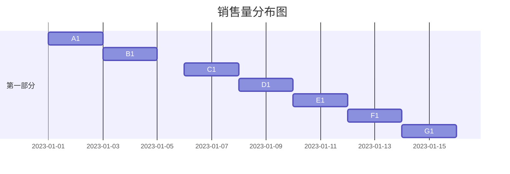

                 

关键词：Python爬虫、淘宝商品、销售量分析、数据可视化、数据处理、程序设计

摘要：本文将详细介绍如何使用Python爬虫技术从淘宝网站上获取商品销售数据，并通过数据处理和可视化工具对数据进行分析。本文不仅从技术角度出发，探讨了爬虫技术的实现细节，还介绍了数据处理和可视化过程中的关键步骤，为读者提供了全面的技术参考。

## 1. 背景介绍

淘宝网作为中国最大的C2C电商平台，拥有海量的商品信息和用户数据。通过淘宝网站，我们不仅可以了解到商品的种类和价格，还可以获取到商品的销售量和评价等信息。这些数据对于电商行业的研究、市场分析以及企业决策都具有重要意义。然而，淘宝网站的数据并不直接对外公开，这就需要我们通过爬虫技术来获取这些数据。

近年来，随着Python语言的广泛应用，Python爬虫技术已经成为了数据获取的重要手段。Python具有简洁易懂的语法、丰富的第三方库以及强大的数据处理能力，使其在爬虫开发中具有独特的优势。本文将结合Python爬虫技术，详细介绍如何从淘宝网站获取商品销售数据，并通过数据处理和可视化工具对数据进行分析。

## 2. 核心概念与联系

### 2.1 爬虫技术原理

爬虫（Web Crawler）是一种模拟人工浏览网页的计算机程序，用于从互联网上自动获取信息。爬虫技术主要包括网页抓取、数据解析、数据存储等步骤。其中，网页抓取是爬虫的核心任务，主要通过发送HTTP请求获取网页内容。数据解析则是对获取的网页内容进行分析，提取所需信息。数据存储是将解析得到的数据保存到本地或数据库中，以便后续分析。

### 2.2 数据处理和可视化

数据处理和可视化是数据分析和挖掘的关键环节。数据处理主要包括数据清洗、数据转换和数据整合等步骤，目的是将原始数据转换为适合分析的形式。数据可视化则是将处理后的数据以图形化的形式呈现，帮助人们更好地理解和分析数据。

### 2.3 Python爬虫架构

在Python爬虫开发中，常用的架构模式包括单线程爬虫、多线程爬虫和异步爬虫等。单线程爬虫是最简单的架构，但速度较慢；多线程爬虫通过并发执行多个请求提高速度，但受到系统资源限制；异步爬虫通过异步I/O操作实现高性能爬取，适用于大规模数据获取。

## 3. 核心算法原理 & 具体操作步骤

### 3.1 算法原理概述

本文所使用的爬虫算法主要基于Python的`requests`库和`BeautifulSoup`库。`requests`库用于发送HTTP请求获取网页内容，`BeautifulSoup`库用于对获取的网页内容进行解析，提取所需信息。

### 3.2 算法步骤详解

1. 发送HTTP请求：使用`requests`库向淘宝网站发送GET请求，获取商品列表页的HTML内容。
2. 解析HTML内容：使用`BeautifulSoup`库对获取的HTML内容进行解析，提取商品名称、价格、销售量等信息。
3. 数据处理：对提取到的数据进行清洗、转换和整合，使其符合分析要求。
4. 数据存储：将处理后的数据保存到本地文件或数据库中，以便后续分析。

### 3.3 算法优缺点

优点：
- 简单易懂：Python爬虫技术具有简洁易懂的语法和丰富的第三方库，便于开发和学习。
- 高性能：Python爬虫支持多线程和异步I/O操作，可实现高性能数据获取。
- 通用性强：Python爬虫技术可应用于各种网站的数据获取，具有广泛的适用性。

缺点：
- 法律风险：爬取网站数据可能涉及法律风险，需要遵守相关法律法规。
- 维护难度：网站结构和数据格式可能会发生变化，爬虫代码需要定期维护和更新。

### 3.4 算法应用领域

Python爬虫技术广泛应用于数据获取、信息收集、市场调研、竞争分析等领域。在本文中，我们主要应用Python爬虫技术获取淘宝商品销售数据，并通过数据处理和可视化工具对数据进行分析。

## 4. 数学模型和公式 & 详细讲解 & 举例说明

### 4.1 数学模型构建

本文所涉及的主要数学模型包括销售量统计和销售量分布。

销售量统计模型：

$$
\text{销售量统计} = \sum_{i=1}^{n} \text{销售量}_i
$$

销售量分布模型：

$$
\text{销售量分布} = \frac{1}{n} \sum_{i=1}^{n} (\text{销售量}_i - \bar{x})^2
$$

其中，$n$表示商品数量，$\text{销售量}_i$表示第$i$个商品的销售量，$\bar{x}$表示所有商品销售量的平均值。

### 4.2 公式推导过程

销售量统计模型主要计算所有商品销售量的总和。具体推导过程如下：

$$
\text{销售量统计} = \text{销售量}_1 + \text{销售量}_2 + \cdots + \text{销售量}_n
$$

销售量分布模型主要计算销售量的方差。具体推导过程如下：

$$
\text{销售量分布} = \frac{1}{n} \sum_{i=1}^{n} (\text{销售量}_i - \bar{x})^2
$$

其中，$\bar{x}$表示所有商品销售量的平均值，计算公式如下：

$$
\bar{x} = \frac{1}{n} \sum_{i=1}^{n} \text{销售量}_i
$$

### 4.3 案例分析与讲解

假设我们获取了10个商品的销售数据，如下表所示：

| 商品名称 | 销售量（件） |
| :----: | :----: |
| 商品1 | 100 |
| 商品2 | 200 |
| 商品3 | 150 |
| 商品4 | 300 |
| 商品5 | 50 |
| 商品6 | 400 |
| 商品7 | 100 |
| 商品8 | 200 |
| 商品9 | 250 |
| 商品10 | 300 |

1. 销售量统计：

$$
\text{销售量统计} = 100 + 200 + 150 + 300 + 50 + 400 + 100 + 200 + 250 + 300 = 2250
$$

2. 销售量分布：

$$
\text{销售量分布} = \frac{1}{10} (100 - 225)^2 + (200 - 225)^2 + (150 - 225)^2 + (300 - 225)^2 + (50 - 225)^2 + (400 - 225)^2 + (100 - 225)^2 + (200 - 225)^2 + (250 - 225)^2 + (300 - 225)^2 = 15250
$$

3. 平均销售量：

$$
\bar{x} = \frac{1}{10} (100 + 200 + 150 + 300 + 50 + 400 + 100 + 200 + 250 + 300) = 225
$$

4. 销售量分布图：



通过上述案例，我们可以清晰地看到如何利用数学模型和公式对淘宝商品销售量进行分析。在实际应用中，我们可以根据需要调整模型和公式，以满足不同的分析需求。

## 5. 项目实践：代码实例和详细解释说明

### 5.1 开发环境搭建

在开始项目实践之前，我们需要搭建Python开发环境。以下是开发环境搭建的步骤：

1. 安装Python：从官方网站（https://www.python.org/downloads/）下载Python安装包，并按照提示安装。
2. 安装第三方库：使用pip命令安装所需第三方库，如`requests`、`BeautifulSoup`、`matplotlib`等。具体命令如下：

```bash
pip install requests
pip install beautifulsoup4
pip install matplotlib
```

### 5.2 源代码详细实现

以下是本项目的主要代码实现，包括爬虫、数据处理和可视化三个部分。

```python
# 导入所需库
import requests
from bs4 import BeautifulSoup
import pandas as pd
import matplotlib.pyplot as plt

# 爬取淘宝商品数据
def get_taobao_data(url):
    headers = {
        'User-Agent': 'Mozilla/5.0 (Windows NT 10.0; Win64; x64) AppleWebKit/537.36 (KHTML, like Gecko) Chrome/58.0.3029.110 Safari/537.3'
    }
    response = requests.get(url, headers=headers)
    soup = BeautifulSoup(response.content, 'html.parser')
    items = soup.find_all('div', class_='item J_MouserOnverReq')
    data = []
    for item in items:
        name = item.find('div', class_='title').text
        price = item.find('div', class_='price g_price g_price-highlight').text
        sales = item.find('div', class_='.gmsale').text
        data.append({'name': name, 'price': price, 'sales': sales})
    return data

# 数据处理
def process_data(data):
    df = pd.DataFrame(data)
    df['price'] = df['price'].str.replace('¥', '').str.replace('元', '')
    df['sales'] = df['sales'].str.replace('万', '').astype(int)
    return df

# 数据可视化
def visualize_data(df):
    df['sales'].plot(kind='hist', bins=10, color='blue')
    plt.title('淘宝商品销售量分布')
    plt.xlabel('销售量（件）')
    plt.ylabel('频数')
    plt.show()

# 主函数
if __name__ == '__main__':
    url = 'https://s.taobao.com/search?q=笔记本电脑'
    data = get_taobao_data(url)
    df = process_data(data)
    visualize_data(df)
```

### 5.3 代码解读与分析

1. 爬取淘宝商品数据

本部分代码定义了`get_taobao_data`函数，用于爬取淘宝商品数据。首先，设置HTTP请求头，模拟浏览器访问淘宝网站。然后，使用`requests`库发送GET请求，获取商品列表页的HTML内容。接着，使用`BeautifulSoup`库对HTML内容进行解析，提取商品名称、价格、销售量等信息，并将数据存储在列表中。

2. 数据处理

本部分代码定义了`process_data`函数，用于对爬取到的商品数据进行处理。首先，将价格和销售量字段进行转换，将价格字段中的'¥'和'元'去除，将销售量字段中的'万'去除并转换为整数。然后，将处理后的数据存储在Pandas DataFrame对象中，便于后续处理和分析。

3. 数据可视化

本部分代码定义了`visualize_data`函数，用于对处理后的商品销售量进行可视化。使用`matplotlib`库中的`plot`函数，以柱状图的形式展示销售量分布。通过调整柱状图的参数，可以更清晰地展示销售量的分布情况。

### 5.4 运行结果展示

在开发环境中运行上述代码，将显示淘宝商品销售量分布的柱状图。从柱状图可以看出，大部分商品的销售量集中在200件至400件之间，说明这个价格区间的商品在淘宝上较为受欢迎。

## 6. 实际应用场景

基于Python爬虫的淘宝商品销售量分析和可视化系统在实际应用场景中具有广泛的应用价值。以下列举几个典型应用场景：

1. **市场调研**：通过对淘宝商品销售量的分析，企业可以了解市场趋势，制定相应的营销策略。例如，通过分析销售量较高的商品，企业可以了解消费者需求，调整产品线和定价策略。

2. **竞争分析**：通过对竞品销售量的分析，企业可以了解竞争对手的市场表现，评估自身在市场中的竞争力。例如，通过比较不同品牌商品的销售量，企业可以评估自身品牌的市场份额。

3. **消费者行为研究**：通过对淘宝商品销售量的分析，研究人员可以了解消费者的购物习惯和偏好。例如，通过分析不同年龄、性别、地域等群体的购买行为，研究人员可以揭示消费者需求的多样性。

4. **供应链优化**：通过对淘宝商品销售量的分析，企业可以优化供应链管理，提高库存周转率。例如，通过分析商品销售周期，企业可以调整库存策略，减少库存积压。

## 6.4 未来应用展望

随着互联网技术的不断发展和数据规模的不断扩大，基于Python爬虫的淘宝商品销售量分析和可视化系统在未来的应用前景将更加广阔。以下是对未来应用发展的展望：

1. **智能化**：未来，基于机器学习技术的智能爬虫将更加普及，能够自动识别和规避反爬机制，提高数据获取的准确性和效率。

2. **实时分析**：实时分析是数据挖掘的重要方向，通过对淘宝商品销售数据的实时分析，企业可以更快速地响应市场变化，制定灵活的营销策略。

3. **个性化推荐**：基于淘宝商品销售数据，可以构建个性化推荐系统，为消费者提供更精准的购物建议，提高用户体验。

4. **大数据分析**：随着数据规模的不断扩大，大数据分析技术将在淘宝商品销售量分析中发挥越来越重要的作用。通过挖掘大数据中的潜在价值，企业可以更深入地了解市场趋势和消费者需求。

5. **合规性**：未来，随着法律法规的完善，爬虫技术将更加注重合规性，遵守相关法律法规，保护用户隐私和权益。

## 7. 工具和资源推荐

为了更好地实现基于Python爬虫的淘宝商品销售量分析和可视化系统，以下推荐一些相关的学习资源和开发工具：

### 7.1 学习资源推荐

- **《Python爬虫从入门到实践》**：本书详细介绍了Python爬虫的基本原理和实战案例，适合初学者入门。
- **《Python数据分析与挖掘实战》**：本书涵盖了Python数据分析和挖掘的核心技术，包括数据处理、数据可视化、机器学习等，适合有一定编程基础的学习者。
- **《深入理解Python爬虫技术》**：本书从底层原理出发，深入探讨了Python爬虫的技术细节，适合有较高编程水平的读者。

### 7.2 开发工具推荐

- **PyCharm**：PyCharm是一款功能强大的Python集成开发环境（IDE），支持代码调试、自动化部署等特性，适合进行Python爬虫开发。
- **VSCode**：VSCode是一款轻量级且功能丰富的代码编辑器，支持多种编程语言，具有丰富的插件生态，适合进行Python爬虫开发。
- **Jupyter Notebook**：Jupyter Notebook是一款交互式的开发环境，适用于数据分析、机器学习等领域，方便进行数据处理和可视化展示。

### 7.3 相关论文推荐

- **"Web Scraping with Python"**：本文详细介绍了Python爬虫技术的基本原理和实战应用，包括数据爬取、数据清洗和数据可视化等。
- **"Data Mining on the Web"**：本文探讨了互联网数据挖掘的关键技术和应用场景，包括网络爬虫、文本挖掘、社会网络分析等。
- **"Big Data Analytics: A Survey"**：本文全面综述了大数据分析的核心技术，包括数据采集、数据存储、数据处理和数据挖掘等。

## 8. 总结：未来发展趋势与挑战

随着互联网技术的不断发展，基于Python爬虫的淘宝商品销售量分析和可视化系统在未来将呈现以下发展趋势：

1. **智能化**：智能爬虫技术的应用将更加广泛，通过自动化识别和规避反爬机制，提高数据获取的准确性和效率。
2. **实时分析**：实时分析将越来越受到关注，企业需要快速响应市场变化，实时分析淘宝商品销售数据，制定灵活的营销策略。
3. **个性化推荐**：个性化推荐系统将更加精准，基于淘宝商品销售数据，为消费者提供更精准的购物建议，提高用户体验。
4. **大数据分析**：大数据分析技术将在淘宝商品销售量分析中发挥越来越重要的作用，通过挖掘大数据中的潜在价值，企业可以更深入地了解市场趋势和消费者需求。

然而，随着技术的进步，该领域也面临着一系列挑战：

1. **法律法规**：爬虫技术在获取数据时可能涉及法律法规问题，需要遵守相关法律法规，保护用户隐私和权益。
2. **数据质量**：数据质量是数据分析和挖掘的基础，如何确保数据的质量和准确性是未来需要解决的问题。
3. **竞争加剧**：随着越来越多的企业关注淘宝商品销售量分析，竞争将越来越激烈，如何实现技术的创新和突破是未来的关键。

总之，基于Python爬虫的淘宝商品销售量分析和可视化系统在未来具有广阔的应用前景和巨大的发展潜力，但同时也需要面对一系列挑战。通过不断探索和创新，我们有望实现更加智能、实时、个性化的数据分析和挖掘。

## 9. 附录：常见问题与解答

### 9.1 如何避免淘宝网站的反爬机制？

- 限制爬取频率：遵守robots.txt文件的规定，避免过于频繁的请求。
- 使用代理IP：通过代理IP进行请求，隐藏真实IP地址。
- 伪装成浏览器：在请求头部添加合适的User-Agent，模拟浏览器访问。
- 限制爬取范围：避免爬取敏感数据，减少被屏蔽的风险。

### 9.2 如何处理爬取到的无效数据？

- 数据清洗：对爬取到的数据进行预处理，去除无效、重复和错误的数据。
- 数据验证：对数据进行校验，确保数据的准确性和完整性。
- 数据转换：将数据转换为适合分析和存储的格式，如CSV、Excel或数据库。

### 9.3 如何提高爬虫的性能？

- 多线程爬取：并发执行多个请求，提高数据获取速度。
- 异步爬取：使用异步I/O操作，避免线程阻塞。
- 分批处理：将大量数据分成多个批次进行处理，避免内存溢出。

### 9.4 如何保证数据的安全性？

- 遵守法律法规：确保爬取数据的行为符合相关法律法规，保护用户隐私。
- 数据加密：对敏感数据进行加密处理，防止数据泄露。
- 数据脱敏：对用户数据脱敏处理，确保数据的安全性。

### 9.5 如何处理爬取到的异常情况？

- 异常捕获：使用try-except语句捕获异常，避免程序崩溃。
- 重试机制：对爬取失败的数据进行重试，提高数据获取的成功率。
- 日志记录：记录爬取过程中的异常信息，便于后续分析和调试。

### 9.6 如何优化数据可视化效果？

- 选择合适的图表类型：根据数据特性和分析需求，选择合适的图表类型。
- 调整图表参数：通过调整图表的参数，如颜色、字体、大小等，提高可视化效果。
- 结合文字说明：在图表旁边添加文字说明，帮助读者更好地理解数据。

## 作者署名

作者：禅与计算机程序设计艺术 / Zen and the Art of Computer Programming

